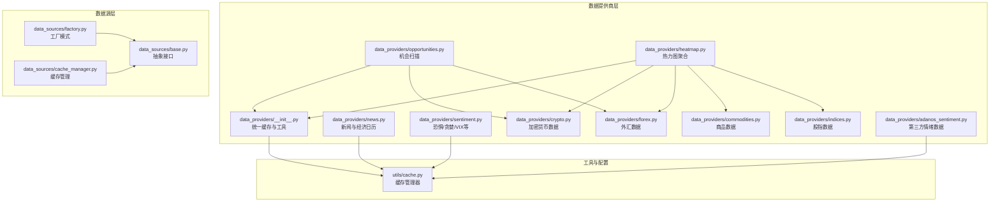
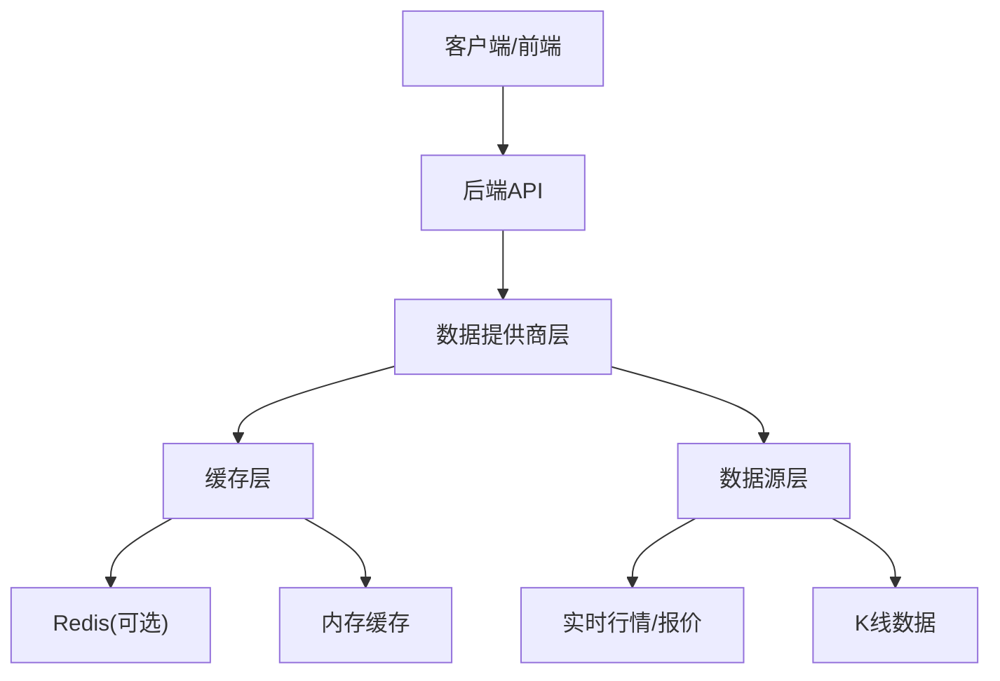
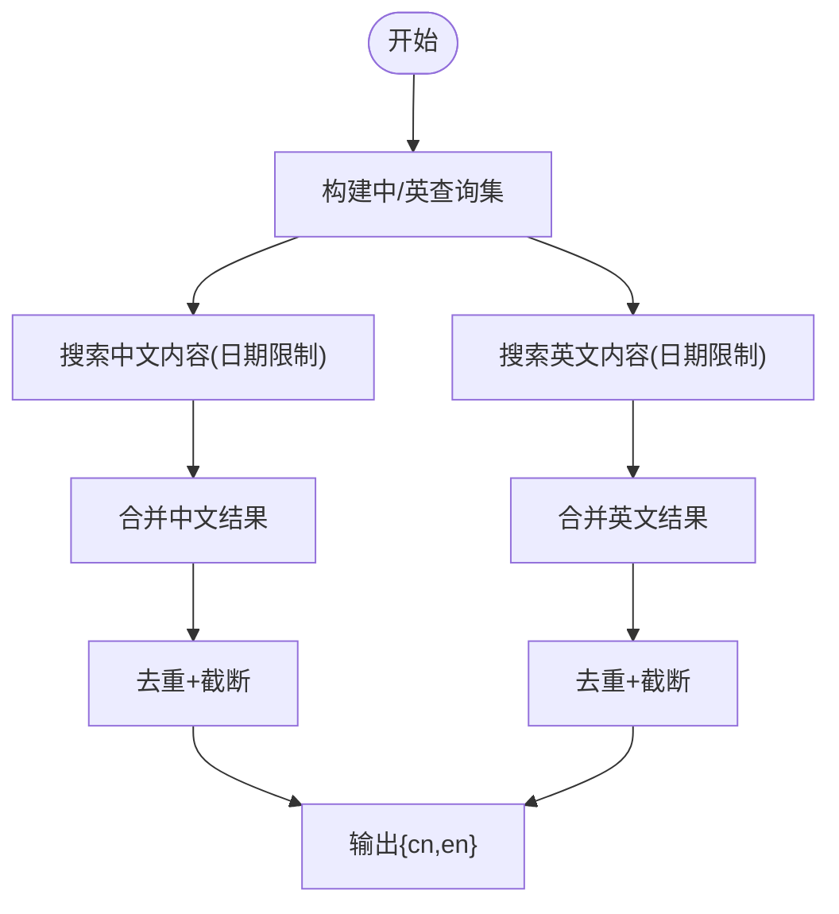
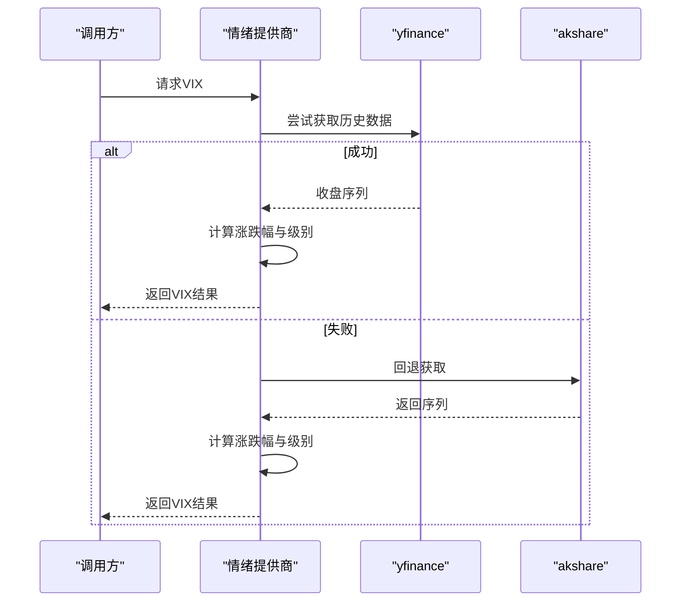
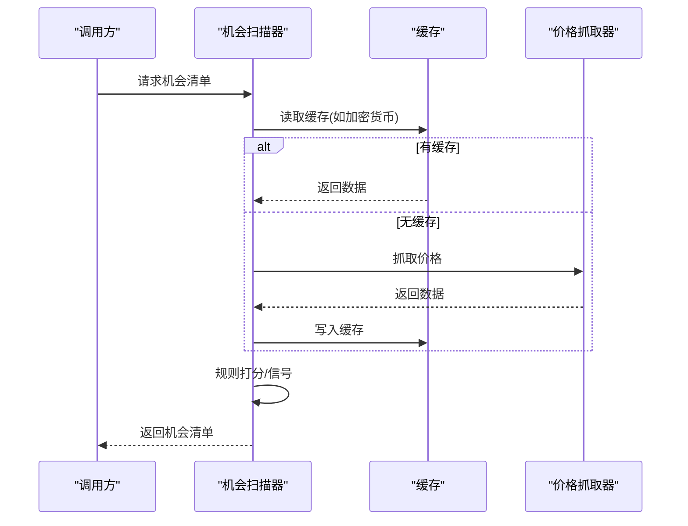
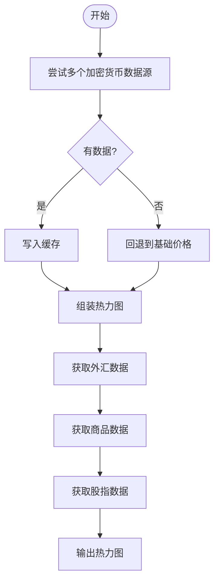
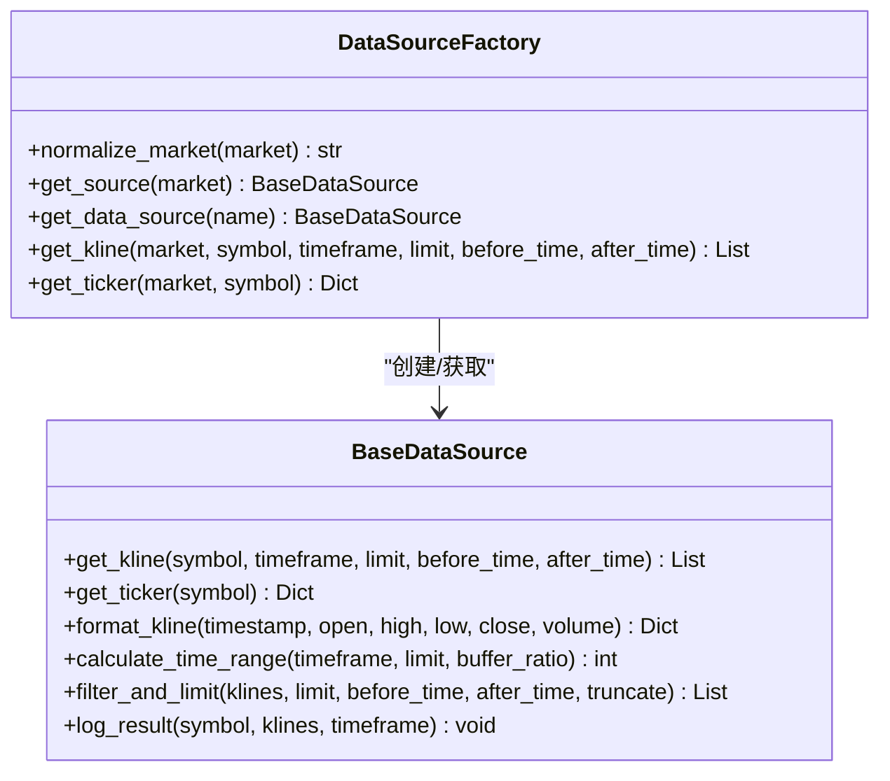
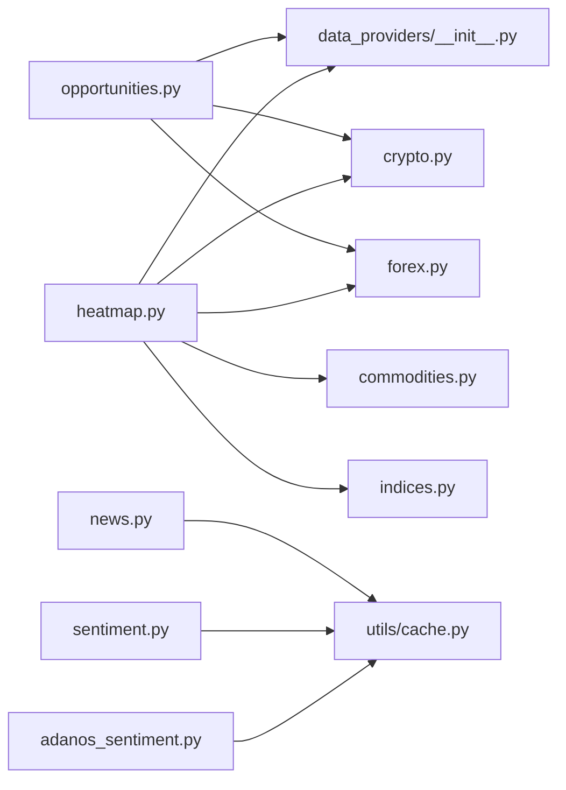

# 数据提供商插件开发

<cite>
**本文档引用的文件**
- [backend_api_python/app/data_providers/__init__.py](file://backend_api_python/app/data_providers/__init__.py)
- [backend_api_python/app/data_providers/news.py](file://backend_api_python/app/data_providers/news.py)
- [backend_api_python/app/data_providers/sentiment.py](file://backend_api_python/app/data_providers/sentiment.py)
- [backend_api_python/app/data_providers/opportunities.py](file://backend_api_python/app/data_providers/opportunities.py)
- [backend_api_python/app/data_providers/heatmap.py](file://backend_api_python/app/data_providers/heatmap.py)
- [backend_api_python/app/data_providers/crypto.py](file://backend_api_python/app/data_providers/crypto.py)
- [backend_api_python/app/data_providers/forex.py](file://backend_api_python/app/data_providers/forex.py)
- [backend_api_python/app/data_providers/commodities.py](file://backend_api_python/app/data_providers/commodities.py)
- [backend_api_python/app/data_providers/indices.py](file://backend_api_python/app/data_providers/indices.py)
- [backend_api_python/app/data_providers/adanos_sentiment.py](file://backend_api_python/app/data_providers/adanos_sentiment.py)
- [backend_api_python/app/data_sources/cache_manager.py](file://backend_api_python/app/data_sources/cache_manager.py)
- [backend_api_python/app/data_sources/base.py](file://backend_api_python/app/data_sources/base.py)
- [backend_api_python/app/data_sources/factory.py](file://backend_api_python/app/data_sources/factory.py)
- [backend_api_python/app/utils/cache.py](file://backend_api_python/app/utils/cache.py)
- [backend_api_python/tests/test_data_providers.py](file://backend_api_python/tests/test_data_providers.py)
</cite>

## 目录
1. [简介](#简介)
2. [项目结构](#项目结构)
3. [核心组件](#核心组件)
4. [架构总览](#架构总览)
5. [详细组件分析](#详细组件分析)
6. [依赖分析](#依赖分析)
7. [性能考虑](#性能考虑)
8. [故障排查指南](#故障排查指南)
9. [结论](#结论)
10. [附录](#附录)

## 简介
本指南面向QuantDinger平台，系统化阐述“数据提供商插件”的抽象接口设计与实现流程，覆盖新闻数据、市场情绪、交易机会扫描与热力图聚合等多类市场数据。文档同时给出数据抓取、清洗、标准化与缓存策略的实践建议，并结合现有实现示例（第三方API、RSS/搜索服务、Web爬虫思路）说明开发要点。最后提供数据质量控制、异常处理与更新频率管理的最佳实践，以及测试与性能监控的建议。

## 项目结构
QuantDinger后端采用分层组织：数据提供商层负责各类市场数据的抓取与聚合；数据源层提供统一的K线/报价接口；缓存层支持本地内存与Redis双栈；工具层提供通用缓存与日志能力；测试层验证缓存与关键数据流。

图表来源
- [backend_api_python/app/data_providers/__init__.py:1-86](file://backend_api_python/app/data_providers/__init__.py#L1-L86)
- [backend_api_python/app/data_providers/heatmap.py:1-147](file://backend_api_python/app/data_providers/heatmap.py#L1-L147)
- [backend_api_python/app/data_providers/opportunities.py:1-360](file://backend_api_python/app/data_providers/opportunities.py#L1-L360)
- [backend_api_python/app/data_sources/base.py:1-180](file://backend_api_python/app/data_sources/base.py#L1-L180)
- [backend_api_python/app/data_sources/factory.py:1-178](file://backend_api_python/app/data_sources/factory.py#L1-L178)
- [backend_api_python/app/data_sources/cache_manager.py:1-233](file://backend_api_python/app/data_sources/cache_manager.py#L1-L233)
- [backend_api_python/app/utils/cache.py:1-129](file://backend_api_python/app/utils/cache.py#L1-L129)

章节来源
- [backend_api_python/app/data_providers/__init__.py:1-86](file://backend_api_python/app/data_providers/__init__.py#L1-L86)
- [backend_api_python/app/data_sources/base.py:1-180](file://backend_api_python/app/data_sources/base.py#L1-L180)
- [backend_api_python/app/data_sources/factory.py:1-178](file://backend_api_python/app/data_sources/factory.py#L1-L178)
- [backend_api_python/app/data_sources/cache_manager.py:1-233](file://backend_api_python/app/data_sources/cache_manager.py#L1-L233)
- [backend_api_python/app/utils/cache.py:1-129](file://backend_api_python/app/utils/cache.py#L1-L129)

## 核心组件
- 统一缓存与工具层：提供全局缓存键前缀、TTL映射、安全数值转换与缓存清空等通用能力，便于各数据提供商共享。
- 数据提供商层：按领域拆分，分别处理新闻、情绪、机会扫描、热力图与各类资产类别（加密货币、外汇、商品、股指）。
- 数据源层：定义统一的K线/报价接口，通过工厂模式按市场类型返回具体实现，支持多数据源回退。
- 缓存层：支持本地内存与Redis双栈，具备TTL、LRU淘汰与命中统计，保障高频读取性能。

章节来源
- [backend_api_python/app/data_providers/__init__.py:23-86](file://backend_api_python/app/data_providers/__init__.py#L23-L86)
- [backend_api_python/app/data_sources/base.py:28-180](file://backend_api_python/app/data_sources/base.py#L28-L180)
- [backend_api_python/app/data_sources/factory.py:33-178](file://backend_api_python/app/data_sources/factory.py#L33-L178)
- [backend_api_python/app/data_sources/cache_manager.py:44-233](file://backend_api_python/app/data_sources/cache_manager.py#L44-L233)
- [backend_api_python/app/utils/cache.py:49-129](file://backend_api_python/app/utils/cache.py#L49-L129)

## 架构总览
下图展示数据提供商插件在系统中的位置与交互关系，突出缓存与数据源层的支撑作用。

图表来源
- [backend_api_python/app/data_providers/__init__.py:39-86](file://backend_api_python/app/data_providers/__init__.py#L39-L86)
- [backend_api_python/app/utils/cache.py:49-129](file://backend_api_python/app/utils/cache.py#L49-L129)
- [backend_api_python/app/data_sources/base.py:28-180](file://backend_api_python/app/data_sources/base.py#L28-L180)

## 详细组件分析

### 新闻与经济日历（news）
职责
- 从搜索服务抓取多语言新闻并去重，按语言分组返回。
- 生成模拟的经济日历事件，标注影响方向与重要程度。

关键点
- 多查询轮询与异常吞吐，保证稳定性。
- 结果去重与截断，避免重复与超限。
- 经济日历基于模板生成，支持随机扰动与实际值计算。

图表来源
- [backend_api_python/app/data_providers/news.py:13-70](file://backend_api_python/app/data_providers/news.py#L13-L70)

章节来源
- [backend_api_python/app/data_providers/news.py:1-150](file://backend_api_python/app/data_providers/news.py#L1-L150)

### 市场情绪（sentiment）
职责
- 提供恐惧/贪婪指数、VIX、美元指数、收益率曲线、VXN、GVZ、期权/股票隐含波动率比等情绪指标。
- 多源回退策略（如yfinance→akshare→默认值），增强鲁棒性。

关键点
- 多源回退链路清晰，失败即切换，最终兜底默认值。
- 对数值进行严格校验与异常捕获，避免NaN/Inf污染。
- 指标分级与解读文本中英双语，便于前端展示。

图表来源
- [backend_api_python/app/data_providers/sentiment.py:45-111](file://backend_api_python/app/data_providers/sentiment.py#L45-L111)

章节来源
- [backend_api_python/app/data_providers/sentiment.py:1-377](file://backend_api_python/app/data_providers/sentiment.py#L1-L377)

### 交易机会扫描（opportunities）
职责
- 聚合多市场（加密货币、外汇、美股、中概/港股、预测市场）的价格与涨跌幅，形成“交易机会”清单。
- 基于阈值规则打信号强度与影响方向，附加理由与时间戳。

关键点
- 价格数据优先从缓存读取，缺失时触发抓取并写入缓存。
- 各市场阈值差异化设计，兼顾不同市场波动特征。
- 预测市场机会通过专用数据源与分析器组合，输出AI分析字段。

图表来源
- [backend_api_python/app/data_providers/opportunities.py:131-176](file://backend_api_python/app/data_providers/opportunities.py#L131-L176)
- [backend_api_python/app/data_providers/opportunities.py:178-216](file://backend_api_python/app/data_providers/opportunities.py#L178-L216)
- [backend_api_python/app/data_providers/opportunities.py:218-277](file://backend_api_python/app/data_providers/opportunities.py#L218-L277)
- [backend_api_python/app/data_providers/opportunities.py:279-319](file://backend_api_python/app/data_providers/opportunities.py#L279-L319)

章节来源
- [backend_api_python/app/data_providers/opportunities.py:1-360](file://backend_api_python/app/data_providers/opportunities.py#L1-L360)

### 热力图聚合（heatmap）
职责
- 聚合加密货币、外汇、商品、股指与板块ETF的涨跌幅，形成统一热力图数据。
- 加密货币优先尝试多个数据源，失败回退到基础价格列表。

关键点
- 按类别标准化字段，统一对外输出结构。
- 股指与板块ETF通过yfinance批量获取，计算区间涨跌幅。
- 缓存策略与机会扫描一致，提升高频访问性能。

图表来源
- [backend_api_python/app/data_providers/heatmap.py:20-82](file://backend_api_python/app/data_providers/heatmap.py#L20-L82)
- [backend_api_python/app/data_providers/heatmap.py:83-146](file://backend_api_python/app/data_providers/heatmap.py#L83-L146)

章节来源
- [backend_api_python/app/data_providers/heatmap.py:1-147](file://backend_api_python/app/data_providers/heatmap.py#L1-L147)

### 第三方API与数据源集成示例

#### 加密货币（多源回退）
- 优先使用系统已有数据源获取报价，其次回退到yfinance，最后回退到公开API。
- 统一字段标准化，缺失值以占位数据补齐。

章节来源
- [backend_api_python/app/data_providers/crypto.py:13-169](file://backend_api_python/app/data_providers/crypto.py#L13-L169)

#### 外汇（多源回退）
- 优先Twelve Data，其次yfinance，最后Tiingo，确保至少半数有效对。
- 标准化货币对名称与中文/英文名称。

章节来源
- [backend_api_python/app/data_providers/forex.py:25-171](file://backend_api_python/app/data_providers/forex.py#L25-L171)

#### 商品（多源回退）
- 优先Twelve Data，其次yfinance，最后Tiingo（部分金属）。
- 统一单位与涨跌幅计算。

章节来源
- [backend_api_python/app/data_providers/commodities.py:23-180](file://backend_api_python/app/data_providers/commodities.py#L23-L180)

#### 股指
- 使用yfinance批量获取主要股指历史，计算区间涨跌幅。

章节来源
- [backend_api_python/app/data_providers/indices.py:30-87](file://backend_api_python/app/data_providers/indices.py#L30-L87)

#### 第三方情绪数据（Adanos）
- 支持Reddit/X/News/Polymarket等源，自动解析与归一化字段。
- 无API Key时fail-open，保持系统可用性。

章节来源
- [backend_api_python/app/data_providers/adanos_sentiment.py:135-205](file://backend_api_python/app/data_providers/adanos_sentiment.py#L135-L205)

### 统一缓存与工具
- 全局缓存键前缀统一为dp:，支持Redis与内存双栈。
- TTL映射针对不同数据类型设定，如新闻、经济日历、情绪、机会等。
- 提供安全数值转换与缓存清空工具函数。

章节来源
- [backend_api_python/app/data_providers/__init__.py:23-86](file://backend_api_python/app/data_providers/__init__.py#L23-L86)
- [backend_api_python/app/utils/cache.py:49-129](file://backend_api_python/app/utils/cache.py#L49-L129)

### 数据源抽象与工厂
- BaseDataSource定义K线与报价的统一接口，提供格式化与过滤工具。
- DataSourceFactory按市场类型返回具体实现，支持别名与向后兼容。

图表来源
- [backend_api_python/app/data_sources/base.py:28-180](file://backend_api_python/app/data_sources/base.py#L28-L180)
- [backend_api_python/app/data_sources/factory.py:33-178](file://backend_api_python/app/data_sources/factory.py#L33-L178)

章节来源
- [backend_api_python/app/data_sources/base.py:1-180](file://backend_api_python/app/data_sources/base.py#L1-L180)
- [backend_api_python/app/data_sources/factory.py:1-178](file://backend_api_python/app/data_sources/factory.py#L1-L178)

## 依赖分析
- 数据提供商层对缓存层存在直接依赖，通过统一工具函数读写缓存。
- 机会扫描与热力图聚合对各资产类别的数据提供商存在依赖，形成数据聚合闭环。
- 数据源层通过工厂模式解耦具体实现，降低耦合度与扩展成本。

图表来源
- [backend_api_python/app/data_providers/opportunities.py:1-360](file://backend_api_python/app/data_providers/opportunities.py#L1-L360)
- [backend_api_python/app/data_providers/heatmap.py:1-147](file://backend_api_python/app/data_providers/heatmap.py#L1-L147)
- [backend_api_python/app/data_providers/crypto.py:1-232](file://backend_api_python/app/data_providers/crypto.py#L1-L232)
- [backend_api_python/app/data_providers/forex.py:1-172](file://backend_api_python/app/data_providers/forex.py#L1-L172)
- [backend_api_python/app/data_providers/commodities.py:1-181](file://backend_api_python/app/data_providers/commodities.py#L1-L181)
- [backend_api_python/app/data_providers/indices.py:1-88](file://backend_api_python/app/data_providers/indices.py#L1-L88)
- [backend_api_python/app/data_providers/news.py:1-150](file://backend_api_python/app/data_providers/news.py#L1-L150)
- [backend_api_python/app/data_providers/sentiment.py:1-377](file://backend_api_python/app/data_providers/sentiment.py#L1-L377)
- [backend_api_python/app/data_providers/adanos_sentiment.py:1-205](file://backend_api_python/app/data_providers/adanos_sentiment.py#L1-L205)
- [backend_api_python/app/data_providers/__init__.py:1-86](file://backend_api_python/app/data_providers/__init__.py#L1-L86)
- [backend_api_python/app/utils/cache.py:1-129](file://backend_api_python/app/utils/cache.py#L1-L129)

章节来源
- [backend_api_python/app/data_providers/__init__.py:1-86](file://backend_api_python/app/data_providers/__init__.py#L1-L86)
- [backend_api_python/app/data_providers/opportunities.py:1-360](file://backend_api_python/app/data_providers/opportunities.py#L1-L360)
- [backend_api_python/app/data_providers/heatmap.py:1-147](file://backend_api_python/app/data_providers/heatmap.py#L1-L147)

## 性能考虑
- 缓存策略
  - 针对高频访问数据设置合理TTL（如新闻180s、经济日历3600s、情绪6h等），平衡新鲜度与性能。
  - 使用统一缓存键前缀dp:，便于集中清理与运维。
- 并发与回退
  - 多源回退链路应尽早短路，避免无效请求；成功即停止后续尝试。
  - 批量获取时尽量使用批量接口（如yfinance的多标的批量），减少HTTP开销。
- 数据标准化
  - 统一字段命名与精度，减少下游转换成本。
- 监控指标
  - 缓存命中率、平均响应时间、错误率、回退次数、TTFB分布等。

[本节为通用指导，无需列出具体文件来源]

## 故障排查指南
- 缓存问题
  - 使用统一清空接口清理所有dp:*键，确认缓存层可用性。
  - 检查TTL设置是否过短导致频繁失效。
- 第三方API异常
  - 关注fail-open逻辑（如Adanos），区分“无Key”与“HTTP错误”，记录状态码与响应体。
  - 对超时/网络异常进行重试与熔断保护。
- 数据质量
  - 使用安全数值转换函数，避免NaN/Inf进入业务逻辑。
  - 对缺失字段进行默认填充，保证输出结构一致性。
- 单元测试
  - 验证缓存读写往返、经济日历结构完整性、第三方情绪解析与参数校验。

章节来源
- [backend_api_python/app/data_providers/__init__.py:61-86](file://backend_api_python/app/data_providers/__init__.py#L61-L86)
- [backend_api_python/tests/test_data_providers.py:1-193](file://backend_api_python/tests/test_data_providers.py#L1-L193)

## 结论
QuantDinger的数据提供商插件体系以“统一缓存+多源回退+标准化输出”为核心，既保证了数据的可靠性与性能，也为扩展新的数据源提供了清晰的接口与流程。开发者可遵循本文档的抽象接口、缓存策略与测试方法，快速实现高质量的市场数据插件。

## 附录

### 开发流程清单
- 明确数据类型与字段规范，制定标准化输出结构。
- 设计多源回退链路，明确失败阈值与兜底策略。
- 实现数据抓取、清洗与标准化函数，确保异常不中断整体流程。
- 使用统一缓存工具写入缓存，设置合理TTL。
- 编写单元测试，覆盖缓存、解析与异常路径。
- 上线前评估更新频率与成本，必要时引入速率限制与并发控制。

[本节为通用指导，无需列出具体文件来源]