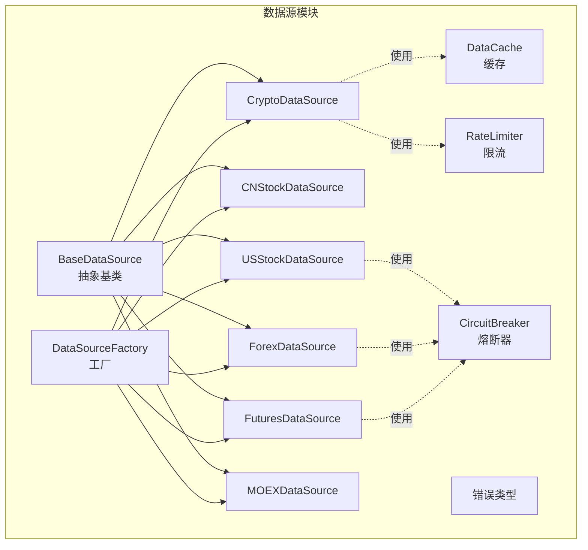
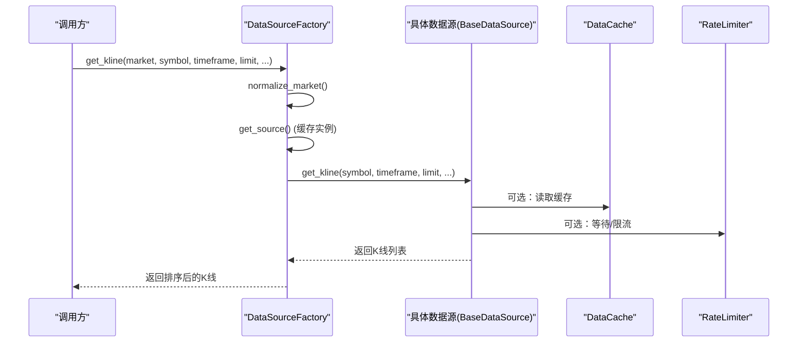
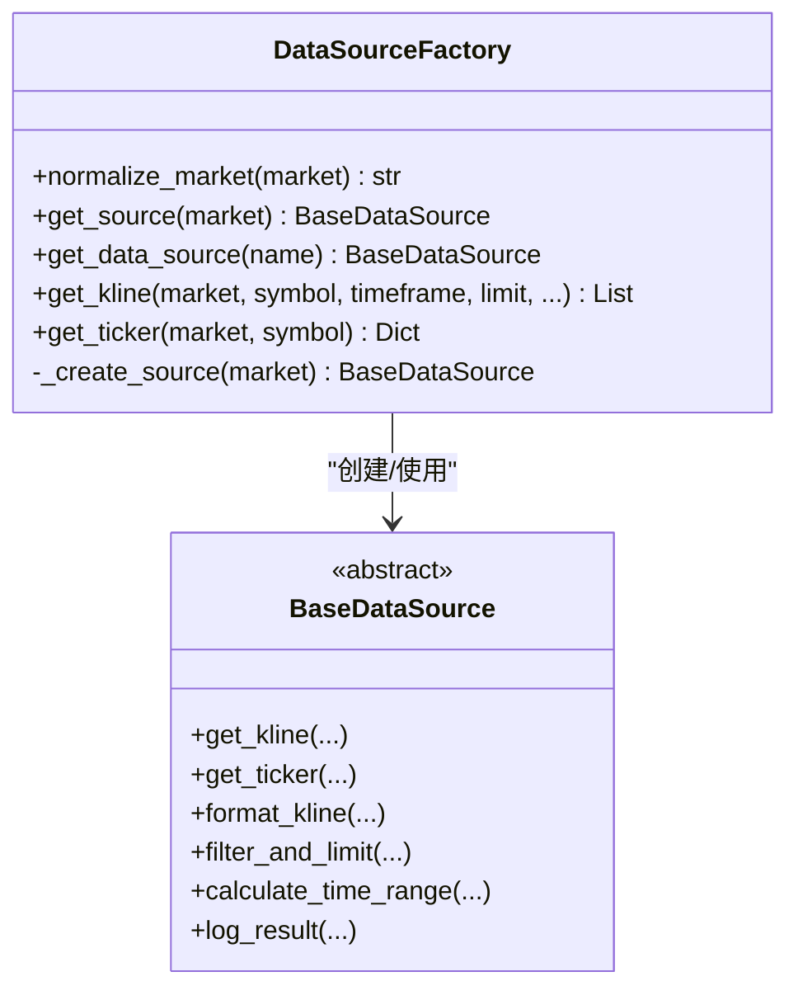
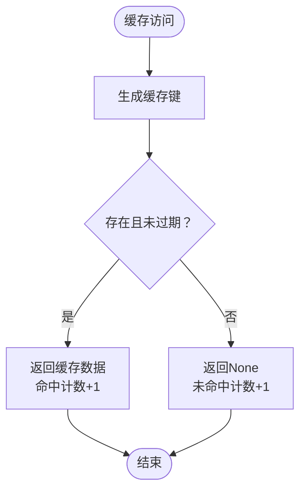
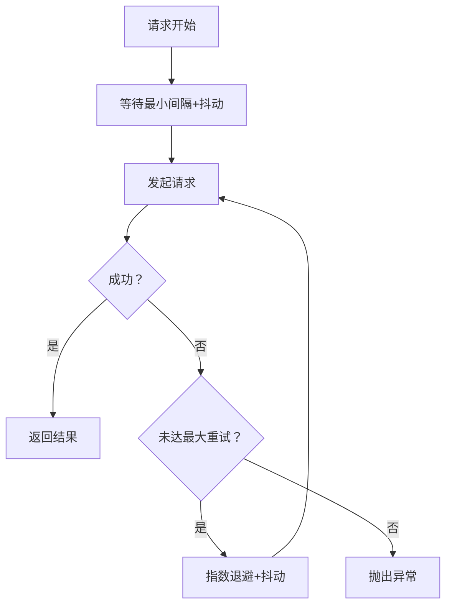
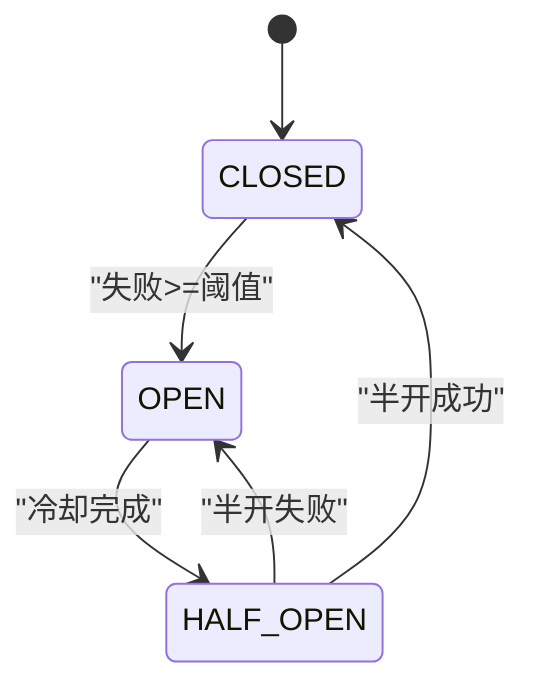
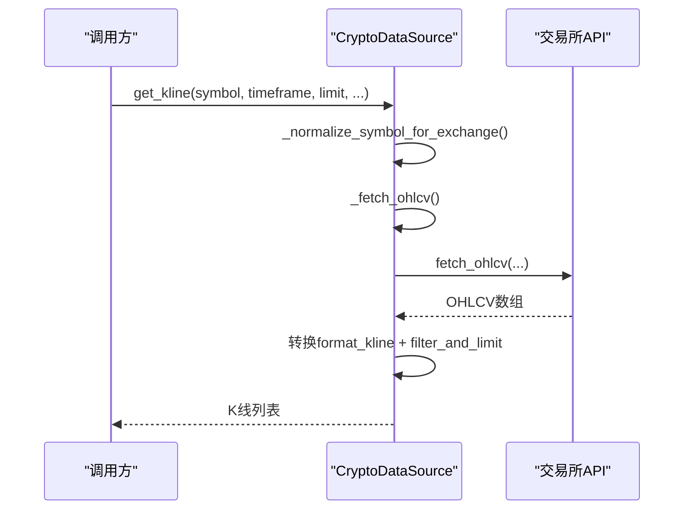
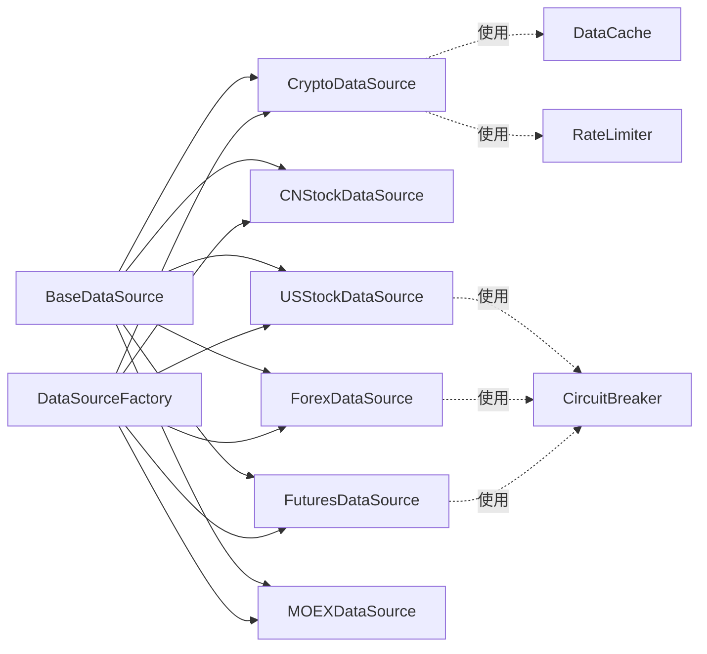

# 数据源插件开发

<cite>
**本文引用的文件**
- [backend_api_python/app/data_sources/base.py](file://backend_api_python/app/data_sources/base.py)
- [backend_api_python/app/data_sources/factory.py](file://backend_api_python/app/data_sources/factory.py)
- [backend_api_python/app/data_sources/cache_manager.py](file://backend_api_python/app/data_sources/cache_manager.py)
- [backend_api_python/app/data_sources/rate_limiter.py](file://backend_api_python/app/data_sources/rate_limiter.py)
- [backend_api_python/app/data_sources/errors.py](file://backend_api_python/app/data_sources/errors.py)
- [backend_api_python/app/data_sources/crypto.py](file://backend_api_python/app/data_sources/crypto.py)
- [backend_api_python/app/data_sources/cn_stock.py](file://backend_api_python/app/data_sources/cn_stock.py)
- [backend_api_python/app/data_sources/us_stock.py](file://backend_api_python/app/data_sources/us_stock.py)
- [backend_api_python/app/data_sources/forex.py](file://backend_api_python/app/data_sources/forex.py)
- [backend_api_python/app/data_sources/futures.py](file://backend_api_python/app/data_sources/futures.py)
- [backend_api_python/app/data_sources/moex.py](file://backend_api_python/app/data_sources/moex.py)
- [backend_api_python/app/data_sources/circuit_breaker.py](file://backend_api_python/app/data_sources/circuit_breaker.py)
- [backend_api_python/app/data_sources/__init__.py](file://backend_api_python/app/data_sources/__init__.py)
- [backend_api_python/app/config/data_sources.py](file://backend_api_python/app/config/data_sources.py)
- [backend_api_python/tests/test_moex_data_source.py](file://backend_api_python/tests/test_moex_data_source.py)
</cite>

## 目录
1. [简介](#简介)
2. [项目结构](#项目结构)
3. [核心组件](#核心组件)
4. [架构总览](#架构总览)
5. [详细组件分析](#详细组件分析)
6. [依赖分析](#依赖分析)
7. [性能考虑](#性能考虑)
8. [故障排查指南](#故障排查指南)
9. [结论](#结论)
10. [附录](#附录)

## 简介
本指南面向QuantDinger平台的数据源插件开发者，系统讲解BaseDataSource抽象基类的设计理念与接口规范，涵盖get_kline、get_ticker等核心方法的实现要求；详解数据源插件的生命周期管理、注册机制与工厂模式实现；提供完整的开发示例，包括市场数据获取、实时行情处理、历史数据存储的方法；解释时间周期处理、数据格式标准化、错误处理与重试机制；并给出测试方法、性能优化技巧与调试指南。

## 项目结构
QuantDinger后端Python服务采用模块化组织，数据源相关代码集中在app/data_sources目录，包含抽象基类、工厂、缓存、限流、熔断器以及各市场的具体实现。

**图表来源**
- [backend_api_python/app/data_sources/base.py:28-180](file://backend_api_python/app/data_sources/base.py#L28-L180)
- [backend_api_python/app/data_sources/factory.py:33-178](file://backend_api_python/app/data_sources/factory.py#L33-L178)
- [backend_api_python/app/data_sources/cache_manager.py:44-233](file://backend_api_python/app/data_sources/cache_manager.py#L44-L233)
- [backend_api_python/app/data_sources/rate_limiter.py:109-273](file://backend_api_python/app/data_sources/rate_limiter.py#L109-L273)
- [backend_api_python/app/data_sources/circuit_breaker.py:31-175](file://backend_api_python/app/data_sources/circuit_breaker.py#L31-L175)
- [backend_api_python/app/data_sources/crypto.py:16-428](file://backend_api_python/app/data_sources/crypto.py#L16-L428)
- [backend_api_python/app/data_sources/cn_stock.py:30-125](file://backend_api_python/app/data_sources/cn_stock.py#L30-L125)
- [backend_api_python/app/data_sources/us_stock.py:17-361](file://backend_api_python/app/data_sources/us_stock.py#L17-L361)
- [backend_api_python/app/data_sources/forex.py:104-709](file://backend_api_python/app/data_sources/forex.py#L104-L709)
- [backend_api_python/app/data_sources/futures.py:60-468](file://backend_api_python/app/data_sources/futures.py#L60-L468)
- [backend_api_python/app/data_sources/moex.py:57-314](file://backend_api_python/app/data_sources/moex.py#L57-L314)

**章节来源**
- [backend_api_python/app/data_sources/__init__.py:1-52](file://backend_api_python/app/data_sources/__init__.py#L1-L52)

## 核心组件
- BaseDataSource：定义统一接口与通用能力（时间周期映射、格式化、过滤、日志、延迟检测）
- DataSourceFactory：工厂类，负责市场枚举归一化、实例缓存与便捷方法
- DataCache：全局缓存管理器，支持TTL、LRU、线程安全
- RateLimiter：请求频率限制、指数退避重试、随机User-Agent轮换
- CircuitBreaker：熔断器，管理数据源可用性与冷却恢复
- 各市场实现：Crypto、CNStock、USStock、Forex、Futures、MOEX，均继承BaseDataSource

**章节来源**
- [backend_api_python/app/data_sources/base.py:28-180](file://backend_api_python/app/data_sources/base.py#L28-L180)
- [backend_api_python/app/data_sources/factory.py:33-178](file://backend_api_python/app/data_sources/factory.py#L33-L178)
- [backend_api_python/app/data_sources/cache_manager.py:44-233](file://backend_api_python/app/data_sources/cache_manager.py#L44-L233)
- [backend_api_python/app/data_sources/rate_limiter.py:109-273](file://backend_api_python/app/data_sources/rate_limiter.py#L109-L273)
- [backend_api_python/app/data_sources/circuit_breaker.py:31-175](file://backend_api_python/app/data_sources/circuit_breaker.py#L31-L175)

## 架构总览
数据源插件遵循“工厂+抽象基类+可插拔实现”的架构。调用方通过工厂获取具体数据源实例，数据源实现统一遵循BaseDataSource接口，内部可组合缓存、限流、熔断等基础设施。

**图表来源**
- [backend_api_python/app/data_sources/factory.py:114-149](file://backend_api_python/app/data_sources/factory.py#L114-L149)
- [backend_api_python/app/data_sources/base.py:33-56](file://backend_api_python/app/data_sources/base.py#L33-L56)
- [backend_api_python/app/data_sources/cache_manager.py:71-98](file://backend_api_python/app/data_sources/cache_manager.py#L71-L98)
- [backend_api_python/app/data_sources/rate_limiter.py:135-159](file://backend_api_python/app/data_sources/rate_limiter.py#L135-L159)

## 详细组件分析

### BaseDataSource抽象基类
- 设计要点
  - 统一接口：get_kline、get_ticker（可选）、format_kline、filter_and_limit、calculate_time_range、log_result
  - 时间周期映射：TIMEFRAME_SECONDS提供秒级映射，便于计算时间范围
  - 数据标准化：format_kline统一四舍五入精度，保证下游一致性
  - 数据过滤：filter_and_limit支持按时间边界过滤与截断策略
  - 延迟检测：log_result基于UTC时间比较，区分分钟级、日线、周线的阈值

- 关键方法说明
  - get_kline：必须实现，返回标准化K线列表
  - get_ticker：可选实现，返回最新报价字典
  - format_kline：格式化单条K线字段
  - filter_and_limit：排序、时间过滤、数量限制
  - calculate_time_range：按周期与条数估算请求范围
  - log_result：记录数据延迟警告

- 生命周期与注册
  - 工厂通过DataSourceFactory.get_source()按市场类型创建并缓存实例
  - 支持normalize_market()进行别名与大小写归一化

**章节来源**
- [backend_api_python/app/data_sources/base.py:28-180](file://backend_api_python/app/data_sources/base.py#L28-L180)
- [backend_api_python/app/data_sources/factory.py:42-66](file://backend_api_python/app/data_sources/factory.py#L42-L66)

### DataSourceFactory工厂模式
- 市场枚举归一化：normalize_market()支持别名映射与大小写处理
- 实例缓存：_sources字典缓存已创建的数据源实例
- 快捷方法：get_kline()、get_ticker()封装调用与异常处理
- 错误处理：捕获异常并记录日志，返回空结果或默认值

**图表来源**
- [backend_api_python/app/data_sources/factory.py:33-178](file://backend_api_python/app/data_sources/factory.py#L33-L178)
- [backend_api_python/app/data_sources/base.py:28-180](file://backend_api_python/app/data_sources/base.py#L28-L180)

**章节来源**
- [backend_api_python/app/data_sources/factory.py:33-178](file://backend_api_python/app/data_sources/factory.py#L33-L178)

### 缓存管理DataCache
- 特性：TTL过期、LRU淘汰、最大容量、线程安全、命中率统计
- 全局缓存：实时行情、K线、股票信息三类缓存实例
- 键生成：generate_kline_cache_key()按symbol、timeframe、limit、before_time生成键

**图表来源**
- [backend_api_python/app/data_sources/cache_manager.py:71-128](file://backend_api_python/app/data_sources/cache_manager.py#L71-L128)
- [backend_api_python/app/data_sources/cache_manager.py:218-233](file://backend_api_python/app/data_sources/cache_manager.py#L218-L233)

**章节来源**
- [backend_api_python/app/data_sources/cache_manager.py:44-233](file://backend_api_python/app/data_sources/cache_manager.py#L44-L233)

### 限流与重试RateLimiter
- 随机User-Agent轮换、请求头构造
- RateLimiter：最小间隔、抖动、上次请求时间记录
- 指数退避重试：retry_with_backoff，支持最大重试次数、最大延迟、异常类型筛选
- 全局限流器：针对不同接口提供专用限流器实例

**图表来源**
- [backend_api_python/app/data_sources/rate_limiter.py:135-159](file://backend_api_python/app/data_sources/rate_limiter.py#L135-L159)
- [backend_api_python/app/data_sources/rate_limiter.py:170-231](file://backend_api_python/app/data_sources/rate_limiter.py#L170-L231)

**章节来源**
- [backend_api_python/app/data_sources/rate_limiter.py:109-273](file://backend_api_python/app/data_sources/rate_limiter.py#L109-L273)

### 熔断器CircuitBreaker
- 状态机：CLOSED → OPEN → HALF_OPEN → CLOSED
- 配置：失败阈值、冷却时间、半开最大尝试
- 全局实例：实时行情熔断器，更严格策略

**图表来源**
- [backend_api_python/app/data_sources/circuit_breaker.py:24-100](file://backend_api_python/app/data_sources/circuit_breaker.py#L24-L100)
- [backend_api_python/app/data_sources/circuit_breaker.py:164-175](file://backend_api_python/app/data_sources/circuit_breaker.py#L164-L175)

**章节来源**
- [backend_api_python/app/data_sources/circuit_breaker.py:31-175](file://backend_api_python/app/data_sources/circuit_breaker.py#L31-L175)

### 各市场数据源实现

#### 加密货币数据源(CryptoDataSource)
- 符号规范化：支持多种输入格式，自动识别报价货币，必要时查找交易所有效符号
- CCXT集成：动态加载交易所类，支持代理、超时、限流
- K线获取：_fetch_ohlcv支持分页与去重，_fetch_ohlcv_fallback备用方案
- 实时报价：get_ticker，支持替代符号回退

**图表来源**
- [backend_api_python/app/data_sources/crypto.py:232-306](file://backend_api_python/app/data_sources/crypto.py#L232-L306)
- [backend_api_python/app/data_sources/crypto.py:308-427](file://backend_api_python/app/data_sources/crypto.py#L308-L427)

**章节来源**
- [backend_api_python/app/data_sources/crypto.py:16-428](file://backend_api_python/app/data_sources/crypto.py#L16-L428)

#### 中国A股数据源(CNStockDataSource)
- 多层降级：TwelveData → 腾讯日/周线 → yfinance → AkShare
- 实时报价：解析腾讯快照，转换为统一ticker格式
- K线获取：按时间周期映射，逐层尝试，最终filter_and_limit

**章节来源**
- [backend_api_python/app/data_sources/cn_stock.py:30-125](file://backend_api_python/app/data_sources/cn_stock.py#L30-L125)

#### 美股数据源(USStockDataSource)
- 优先级：Finnhub（实时）→ yfinance fast_info → yfinance info → 历史1分钟回退
- 周期映射与天数估算：INTERVAL_MAP与DAYS_MAP，合并因子处理
- K线获取：_fetch_yfinance → _fetch_finnhub（日线）→ 合并与过滤

**章节来源**
- [backend_api_python/app/data_sources/us_stock.py:17-361](file://backend_api_python/app/data_sources/us_stock.py#L17-L361)

#### 外汇数据源(ForexDataSource)
- 三级降级：Twelve Data → Tiingo → yfinance
- 符号映射与时间周期映射：TD、Tiingo、yfinance三套映射表
- Tiingo聚合：周线/月线通过日线聚合实现

**章节来源**
- [backend_api_python/app/data_sources/forex.py:104-709](file://backend_api_python/app/data_sources/forex.py#L104-L709)

#### 期货数据源(FuturesDataSource)
- 传统期货：Twelve Data → yfinance → Tiingo（贵金属）
- 加密货币期货：CCXT（Binance Futures）
- 符号与周期映射：YF_TIMEFRAME_MAP、CCXT_TIMEFRAME_MAP

**章节来源**
- [backend_api_python/app/data_sources/futures.py:60-468](file://backend_api_python/app/data_sources/futures.py#L60-L468)

#### MOEX（俄罗斯交易所）数据源(MOEXDataSource)
- 仅支持分析与回测，不支持实盘下单
- ISS API：按board、engine、market拼接URL，支持分页
- 时间周期映射：INTERVAL_MAP，非原生周期通过1分钟或60分钟聚合
- 符号规范化：路径注入防护正则表达式

**章节来源**
- [backend_api_python/app/data_sources/moex.py:57-314](file://backend_api_python/app/data_sources/moex.py#L57-L314)

## 依赖分析
- 继承关系：各市场实现均继承BaseDataSource，复用统一接口与通用方法
- 组合关系：数据源实现可选择性使用DataCache、RateLimiter、CircuitBreaker
- 工厂耦合：DataSourceFactory集中管理实例创建与缓存，降低调用方耦合度
- 配置依赖：CCXTConfig、YFinanceConfig、TiingoConfig等配置元类提供运行时配置

**图表来源**
- [backend_api_python/app/data_sources/base.py:28-180](file://backend_api_python/app/data_sources/base.py#L28-L180)
- [backend_api_python/app/data_sources/factory.py:87-111](file://backend_api_python/app/data_sources/factory.py#L87-L111)
- [backend_api_python/app/data_sources/cache_manager.py:44-233](file://backend_api_python/app/data_sources/cache_manager.py#L44-L233)
- [backend_api_python/app/data_sources/rate_limiter.py:109-273](file://backend_api_python/app/data_sources/rate_limiter.py#L109-L273)
- [backend_api_python/app/data_sources/circuit_breaker.py:31-175](file://backend_api_python/app/data_sources/circuit_breaker.py#L31-L175)

**章节来源**
- [backend_api_python/app/data_sources/__init__.py:13-51](file://backend_api_python/app/data_sources/__init__.py#L13-L51)
- [backend_api_python/app/config/data_sources.py:26-152](file://backend_api_python/app/config/data_sources.py#L26-L152)

## 性能考虑
- 缓存策略
  - K线缓存：默认TTL 5分钟，按需缓存，适合高频回测场景
  - 实时行情缓存：默认TTL 20分钟，适合策略执行中的快速读取
  - 股票信息缓存：默认TTL 24小时，适合基础信息类数据
- 限流与退避
  - RateLimiter最小间隔+抖动，模拟人类行为，降低被封禁风险
  - retry_with_backoff指数退避，避免雪崩效应
- 熔断器
  - CircuitBreaker在连续失败后进入OPEN状态，冷却后半开试探，提升系统稳定性
- 数据预取与分页
  - CryptoDataSource分页拉取并去重，避免重复数据与空洞
  - MOEXDataSource分页参数控制与最大页数限制，防止超大数据集

[本节为通用指导，无需特定文件引用]

## 故障排查指南
- 常见错误类型
  - UnsupportedMarketError：工厂无法识别的市场类型
  - 网络/超时：结合RateLimiter与retry_with_backoff进行重试
  - 符号无效：CryptoDataSource会尝试替代符号，若失败返回默认值
  - 限流/429：Forex/Futures/Tiingo对429进行重试与降级
- 日志与监控
  - log_result记录数据延迟警告，帮助定位数据源时效性问题
  - DataCache.stats输出命中率，辅助评估缓存效果
  - CircuitBreaker记录状态变化，便于观察熔断恢复过程
- 单元测试
  - test_moex_data_source.py演示了MOEX数据源的符号归一化、时间周期映射、K线重采样、错误回退等关键逻辑

**章节来源**
- [backend_api_python/app/data_sources/errors.py:4-15](file://backend_api_python/app/data_sources/errors.py#L4-L15)
- [backend_api_python/tests/test_moex_data_source.py:1-169](file://backend_api_python/tests/test_moex_data_source.py#L1-L169)

## 结论
QuantDinger数据源插件体系以BaseDataSource为核心，通过工厂模式实现松耦合扩展，配合缓存、限流、熔断等基础设施，形成高可用、高性能、易维护的数据获取框架。开发者只需继承BaseDataSource并实现get_kline/get_ticker，即可无缝接入统一的调度与治理能力。

[本节为总结，无需特定文件引用]

## 附录

### 开发步骤清单
- 继承BaseDataSource，实现get_kline与可选get_ticker
- 在factory.py中注册新市场类型与映射
- 如需缓存/限流/熔断，按需引入DataCache/RateLimiter/CircuitBreaker
- 编写单元测试，覆盖符号归一化、时间范围计算、错误回退等场景
- 配置环境变量与限流参数，确保生产可用

### 接口规范摘要
- get_kline：返回标准化K线列表，字段包含time/open/high/low/close/volume
- get_ticker：返回最新报价，至少包含last；可选change/changePercent等
- format_kline：统一数值精度与字段命名
- filter_and_limit：按before_time/after_time过滤并截断至limit条

**章节来源**
- [backend_api_python/app/data_sources/base.py:33-84](file://backend_api_python/app/data_sources/base.py#L33-L84)
- [backend_api_python/app/data_sources/factory.py:114-177](file://backend_api_python/app/data_sources/factory.py#L114-L177)