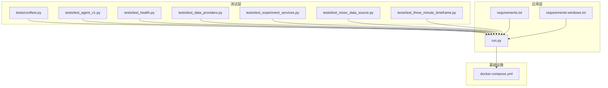
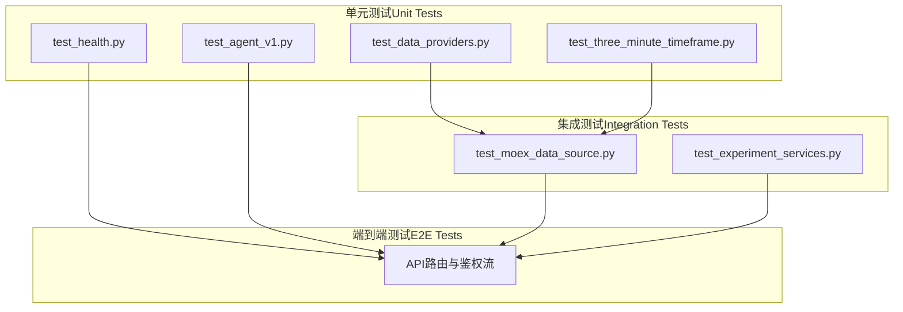
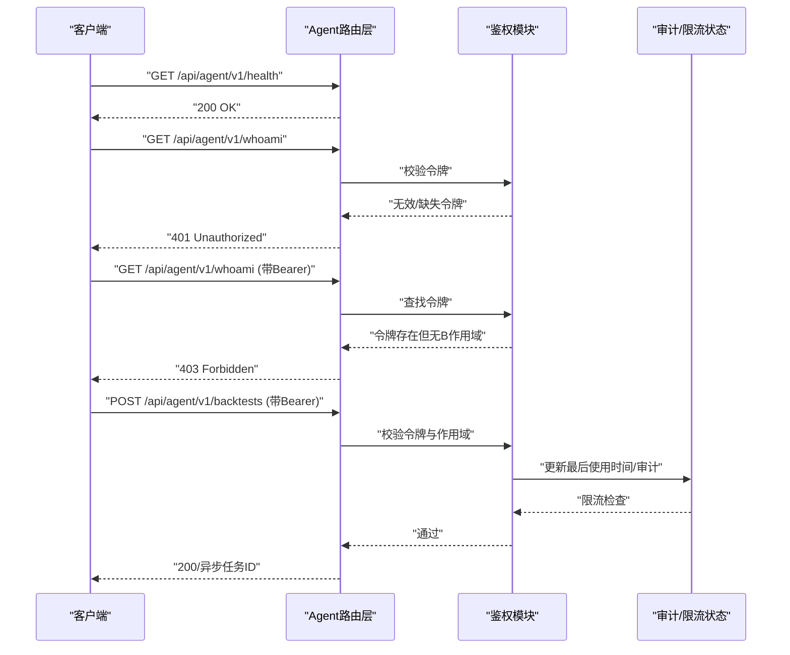
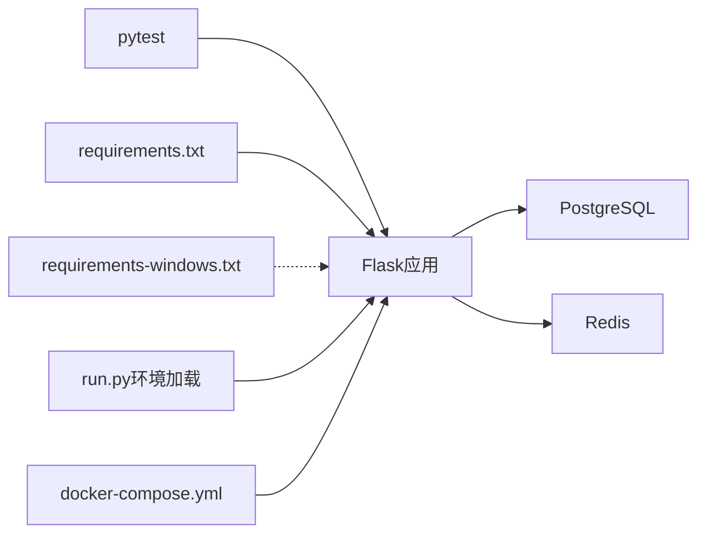

# 测试指南

<cite>
**本文引用的文件**
- [backend_api_python/tests/conftest.py](file://backend_api_python/tests/conftest.py)
- [backend_api_python/run.py](file://backend_api_python/run.py)
- [backend_api_python/requirements.txt](file://backend_api_python/requirements.txt)
- [backend_api_python/requirements-windows.txt](file://backend_api_python/requirements-windows.txt)
- [backend_api_python/tests/test_agent_v1.py](file://backend_api_python/tests/test_agent_v1.py)
- [backend_api_python/tests/test_health.py](file://backend_api_python/tests/test_health.py)
- [backend_api_python/tests/test_data_providers.py](file://backend_api_python/tests/test_data_providers.py)
- [backend_api_python/tests/test_experiment_services.py](file://backend_api_python/tests/test_experiment_services.py)
- [backend_api_python/tests/test_moex_data_source.py](file://backend_api_python/tests/test_moex_data_source.py)
- [backend_api_python/tests/test_three_minute_timeframe.py](file://backend_api_python/tests/test_three_minute_timeframe.py)
- [docker-compose.yml](file://docker-compose.yml)
</cite>

## 目录
1. [引言](#引言)
2. [项目结构](#项目结构)
3. [核心组件](#核心组件)
4. [架构总览](#架构总览)
5. [详细组件分析](#详细组件分析)
6. [依赖分析](#依赖分析)
7. [性能考虑](#性能考虑)
8. [故障排查指南](#故障排查指南)
9. [结论](#结论)
10. [附录](#附录)

## 引言
本测试指南面向QuantDinger后端API（Python）仓库，系统化阐述测试策略与测试金字塔结构，覆盖单元测试、集成测试与端到端测试的实施方法；详解pytest框架使用、测试夹具配置、模拟对象创建；给出测试用例编写规范、断言方法与测试数据管理建议；并提供为新功能模块编写测试的实践步骤，包括策略测试、数据源测试、API接口测试的方法。最后说明测试覆盖率要求、持续集成配置与自动化测试流程。

## 项目结构
后端测试集中在 backend_api_python/tests 目录，采用pytest组织测试用例，并通过 conftest.py 提供共享夹具（如测试应用实例与测试客户端）。运行入口脚本 run.py 负责加载环境变量与应用初始化，requirements.txt 定义生产依赖，requirements-windows.txt 提供Windows可选依赖。docker-compose.yml 描述了数据库与缓存等基础设施服务，便于在容器环境中进行集成测试与端到端验证。

图表来源
- [backend_api_python/tests/conftest.py:1-31](file://backend_api_python/tests/conftest.py#L1-L31)
- [backend_api_python/run.py:1-134](file://backend_api_python/run.py#L1-L134)
- [backend_api_python/requirements.txt:1-37](file://backend_api_python/requirements.txt#L1-L37)
- [backend_api_python/requirements-windows.txt:1-7](file://backend_api_python/requirements-windows.txt#L1-L7)
- [docker-compose.yml:1-172](file://docker-compose.yml#L1-L172)

章节来源
- [backend_api_python/tests/conftest.py:1-31](file://backend_api_python/tests/conftest.py#L1-L31)
- [backend_api_python/run.py:1-134](file://backend_api_python/run.py#L1-L134)
- [docker-compose.yml:1-172](file://docker-compose.yml#L1-L172)

## 核心组件
- pytest夹具与测试客户端
  - 在 conftest.py 中定义会话级 app 夹具与请求级 client 夹具，确保测试前构建最小化Flask应用实例并注入测试环境变量，避免配置类因缺少环境变量而失败。
  - 所有路由层与服务层测试均可直接使用 client 发起HTTP请求，无需真实数据库或外部服务。
- 运行入口与环境加载
  - run.py 支持从 .env 加载环境变量，设置代理与编码，以及安全检查（如生产环境下的默认密钥替换），保证本地开发与部署一致性。
- 依赖与平台支持
  - requirements.txt 与 requirements-windows.txt 明确生产与Windows可选依赖，为测试与CI提供一致的运行时基础。

章节来源
- [backend_api_python/tests/conftest.py:1-31](file://backend_api_python/tests/conftest.py#L1-L31)
- [backend_api_python/run.py:17-91](file://backend_api_python/run.py#L17-L91)
- [backend_api_python/requirements.txt:1-37](file://backend_api_python/requirements.txt#L1-L37)
- [backend_api_python/requirements-windows.txt:1-7](file://backend_api_python/requirements-windows.txt#L1-L7)

## 架构总览
下图展示测试金字塔在本项目中的落地：以单元测试为基础，通过夹具与模拟对象隔离外部依赖；以集成测试验证数据源与服务交互；以端到端测试覆盖API路由与业务流程。

图表来源
- [backend_api_python/tests/test_health.py:1-10](file://backend_api_python/tests/test_health.py#L1-L10)
- [backend_api_python/tests/test_data_providers.py:1-193](file://backend_api_python/tests/test_data_providers.py#L1-L193)
- [backend_api_python/tests/test_three_minute_timeframe.py:1-41](file://backend_api_python/tests/test_three_minute_timeframe.py#L1-L41)
- [backend_api_python/tests/test_agent_v1.py:1-160](file://backend_api_python/tests/test_agent_v1.py#L1-L160)
- [backend_api_python/tests/test_moex_data_source.py:1-169](file://backend_api_python/tests/test_moex_data_source.py#L1-L169)
- [backend_api_python/tests/test_experiment_services.py:1-132](file://backend_api_python/tests/test_experiment_services.py#L1-L132)

## 详细组件分析

### 单元测试：健康检查与路由层
- 目标：验证 /api/health 可达且返回期望结构；验证Agent网关公开与受保护端点的行为。
- 关键点：
  - 使用 client 直接发起 GET 请求，断言状态码与JSON响应字段。
  - 对受令牌保护的端点，通过模拟鉴权状态与速率限制状态，验证401/403/429等行为。
- 断言方法：
  - 状态码断言与响应体字段断言，确保服务可用性与鉴权逻辑正确。

章节来源
- [backend_api_python/tests/test_health.py:1-10](file://backend_api_python/tests/test_health.py#L1-L10)
- [backend_api_python/tests/test_agent_v1.py:50-160](file://backend_api_python/tests/test_agent_v1.py#L50-L160)

### 单元测试：数据提供层与缓存工具
- 目标：验证数据提供层辅助函数与缓存读写的一致性与健壮性。
- 关键点：
  - 测试数值转换、缓存读写、经济日历非空、第三方情感数据接口的错误回退与参数规范化。
  - 使用 monkeypatch 设置环境变量与伪造HTTP会话，确保不依赖真实网络。
- 断言方法：
  - 类型断言、长度断言、字段存在性断言、异常断言与HTTP调用参数断言。

章节来源
- [backend_api_python/tests/test_data_providers.py:1-193](file://backend_api_python/tests/test_data_providers.py#L1-L193)

### 单元测试：时间框架与合并逻辑
- 目标：验证3分钟K线在不同数据源中的映射与合并规则。
- 关键点：
  - 检查时间框架常量、CCXT映射、数据源内部映射与合并因子。
  - 验证按N根1分钟K线合并为1根3分钟K线的聚合逻辑。
- 断言方法：
  - 数值断言与结构断言，确保开高低收与成交量聚合正确。

章节来源
- [backend_api_python/tests/test_three_minute_timeframe.py:14-41](file://backend_api_python/tests/test_three_minute_timeframe.py#L14-L41)

### 集成测试：数据源工厂与MOEX数据源
- 目标：验证数据源工厂识别、符号归一化、板区与时间框架映射、HTTP层模拟下的K线与TICKER解析。
- 关键点：
  - 使用unittest.mock.patch对HTTP层进行模拟，避免真实网络访问。
  - 验证异常路径（HTTP失败、不支持的时间框架）与边界条件（空数据、路径注入防护）。
- 断言方法：
  - 结构完整性断言、排序断言、聚合断言与错误回退断言。

章节来源
- [backend_api_python/tests/test_moex_data_source.py:26-169](file://backend_api_python/tests/test_moex_data_source.py#L26-L169)

### 集成测试：实验服务（策略演化、评分与回归）
- 目标：验证市场周期检测、策略评分、参数空间变体生成与实验流水线执行。
- 关键点：
  - 使用pandas构造合成行情数据，驱动服务进行趋势识别与评分。
  - 通过自定义“假回测服务”模拟回测输出，验证最佳策略选择与排名。
- 断言方法：
  - 分数范围断言、等级断言、排名断言与最佳参数断言。

章节来源
- [backend_api_python/tests/test_experiment_services.py:13-132](file://backend_api_python/tests/test_experiment_services.py#L13-L132)

### 端到端测试：API路由与鉴权序列
- 目标：通过序列图展示从客户端到路由、鉴权、审计与限流的完整链路。
- 关键点：
  - 公共端点无需令牌；受保护端点需有效令牌；作用域不足返回403；超出速率限制返回429。
- 断言方法：
  - 状态码断言与响应体字段断言。

图表来源
- [backend_api_python/tests/test_agent_v1.py:50-160](file://backend_api_python/tests/test_agent_v1.py#L50-L160)

## 依赖分析
- 测试依赖与运行时依赖分离
  - requirements.txt 提供生产运行所需依赖，pytest与Flask测试工具由pytest生态提供。
  - Windows可选依赖（如MetaTrader5）在 requirements-windows.txt 中声明，不影响通用测试。
- 环境变量与代理
  - run.py 统一处理代理与编码问题，减少跨平台与网络环境差异对测试的影响。
- 基础设施依赖
  - docker-compose.yml 提供PostgreSQL与Redis，便于在容器内进行集成测试与端到端验证。

图表来源
- [backend_api_python/requirements.txt:1-37](file://backend_api_python/requirements.txt#L1-L37)
- [backend_api_python/requirements-windows.txt:1-7](file://backend_api_python/requirements-windows.txt#L1-L7)
- [backend_api_python/run.py:17-91](file://backend_api_python/run.py#L17-L91)
- [docker-compose.yml:25-132](file://docker-compose.yml#L25-L132)

章节来源
- [backend_api_python/requirements.txt:1-37](file://backend_api_python/requirements.txt#L1-L37)
- [backend_api_python/requirements-windows.txt:1-7](file://backend_api_python/requirements-windows.txt#L1-L7)
- [backend_api_python/run.py:17-91](file://backend_api_python/run.py#L17-L91)
- [docker-compose.yml:25-132](file://docker-compose.yml#L25-L132)

## 性能考虑
- 测试执行效率
  - 使用会话级夹具（如 app）复用应用实例，避免重复初始化。
  - 通过模拟外部HTTP与数据库访问，减少I/O等待，提升测试吞吐。
- 数据与资源
  - 合成数据（如pandas DataFrame）用于服务层测试，避免真实数据源波动影响稳定性。
- 并发与隔离
  - 将速率限制与审计状态置于进程内内存，配合夹具清理，确保测试间互不干扰。

## 故障排查指南
- 常见问题
  - 缺少环境变量导致配置类初始化失败：确认 conftest.py 已设置最小化环境变量集合。
  - 代理或网络问题导致HTTP测试不稳定：参考 run.py 的代理处理逻辑，在测试中统一设置代理绕过规则。
  - Windows平台MetaTrader5不可用：仅在需要相关功能时安装 requirements-windows.txt。
- 排查步骤
  - 优先运行单文件测试定位问题模块。
  - 使用 -v 与 -s 参数查看详细输出与调试信息。
  - 对模拟对象断言其被调用的URL、参数与返回值，确保HTTP层行为符合预期。

章节来源
- [backend_api_python/tests/conftest.py:8-13](file://backend_api_python/tests/conftest.py#L8-L13)
- [backend_api_python/run.py:60-91](file://backend_api_python/run.py#L60-L91)
- [backend_api_python/requirements-windows.txt:5-7](file://backend_api_python/requirements-windows.txt#L5-L7)

## 结论
本指南基于现有测试文件总结了QuantDinger后端的测试策略与实践：以pytest为核心，结合夹具与模拟对象实现高隔离度的单元测试；通过HTTP层模拟完成数据源集成测试；借助端到端测试覆盖关键路由与鉴权流程。建议在CI中引入覆盖率统计与容器化集成测试，持续保障代码质量与交付稳定性。

## 附录

### 测试金字塔实施要点
- 单元测试（>70%）
  - 覆盖核心算法、工具函数与数据转换逻辑。
  - 使用夹具与mock隔离外部依赖。
- 集成测试（20%-30%）
  - 覆盖数据源HTTP层、服务编排与关键业务流程。
  - 使用容器化基础设施（PostgreSQL/Redis）进行轻量集成验证。
- 端到端测试（10%-20%）
  - 覆盖关键API路由与用户场景，确保整体可用性。

### pytest使用与夹具配置
- 夹具生命周期
  - 会话级 app 夹具用于构建测试应用实例；请求级 client 夹具用于HTTP测试。
- 环境准备
  - 在 conftest.py 中设置最小化环境变量，避免配置类抛错。
- 模拟对象
  - 使用 monkeypatch 设置环境变量与函数行为；使用 unittest.mock.patch 替换HTTP客户端。

章节来源
- [backend_api_python/tests/conftest.py:19-31](file://backend_api_python/tests/conftest.py#L19-L31)
- [backend_api_python/tests/test_agent_v1.py:21-26](file://backend_api_python/tests/test_agent_v1.py#L21-L26)
- [backend_api_python/tests/test_data_providers.py:45-113](file://backend_api_python/tests/test_data_providers.py#L45-L113)

### 测试用例编写规范
- 命名与组织
  - 测试文件以 test_ 前缀命名，测试函数以 test_ 前缀命名，按功能模块分文件组织。
- 断言方法
  - 使用明确的状态码断言与响应体字段断言；对异常输入使用异常断言。
- 测试数据管理
  - 使用合成数据（如pandas DataFrame）与固定种子/时间戳，确保可重复性。
  - 对外部HTTP调用使用mock，避免依赖真实网络与第三方服务。

### 新功能模块测试编写步骤
- 策略测试
  - 构造合成行情数据，驱动策略执行与评分服务，断言输出指标与排名。
- 数据源测试
  - 使用mock模拟HTTP响应，覆盖正常路径、异常路径与边界条件。
- API接口测试
  - 使用client发起请求，断言状态码与响应体；对受保护端点断言鉴权与作用域控制。

### 测试覆盖率与CI
- 覆盖率要求
  - 建议核心模块（路由、服务、数据源）覆盖率不低于80%，关键路径不低于90%。
- CI配置与自动化
  - 在CI中执行pytest并生成覆盖率报告；结合docker-compose启动数据库与缓存服务，运行集成测试；对Windows平台可选安装额外依赖后运行相关测试。