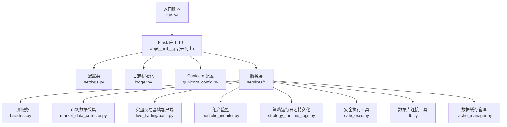
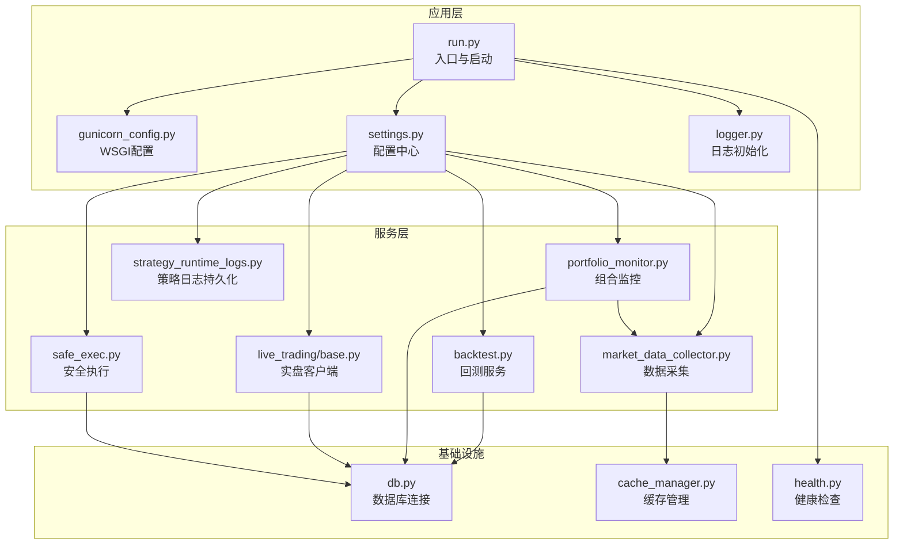
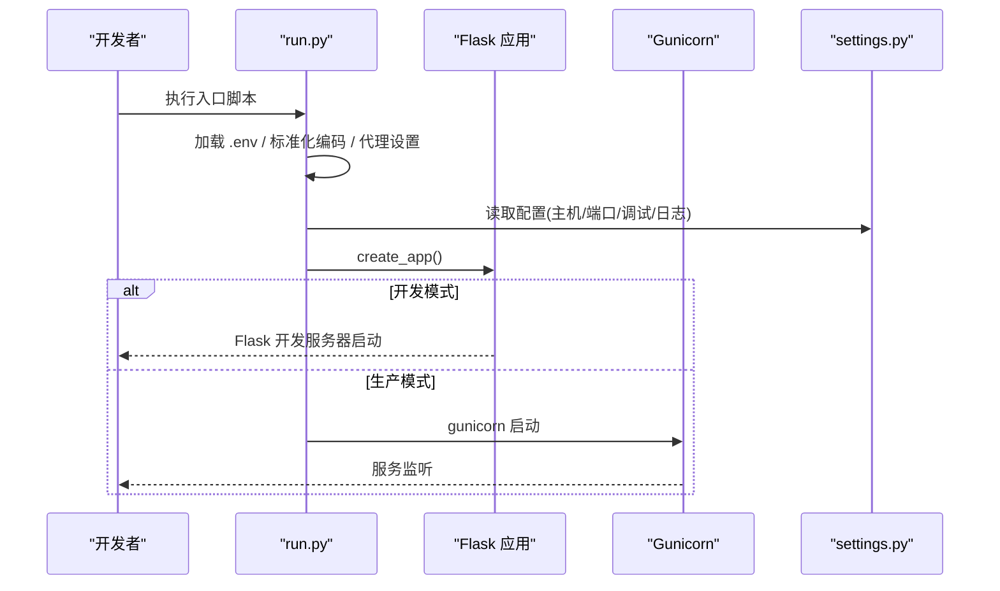
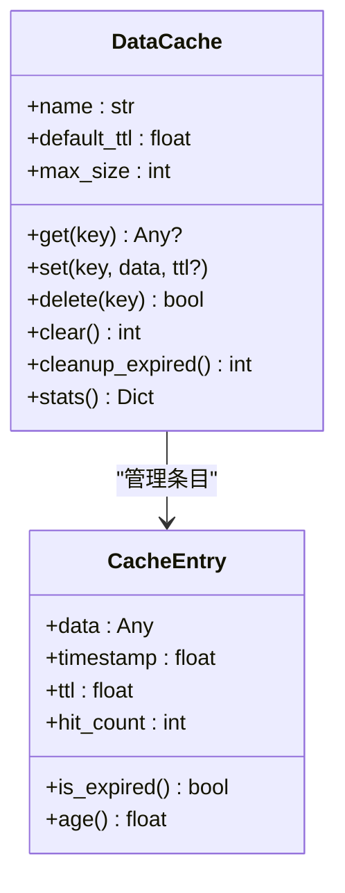
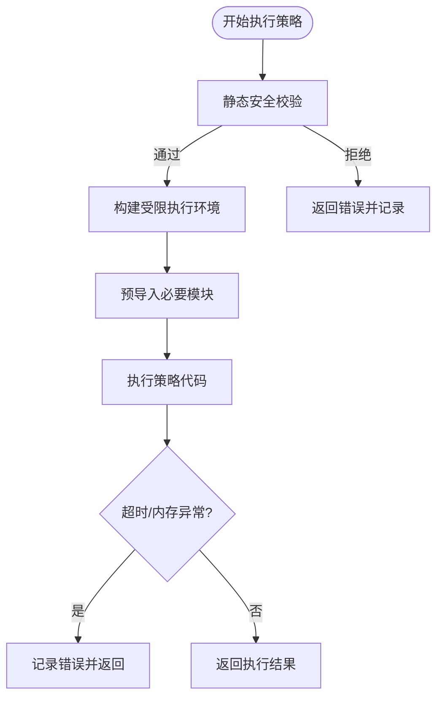
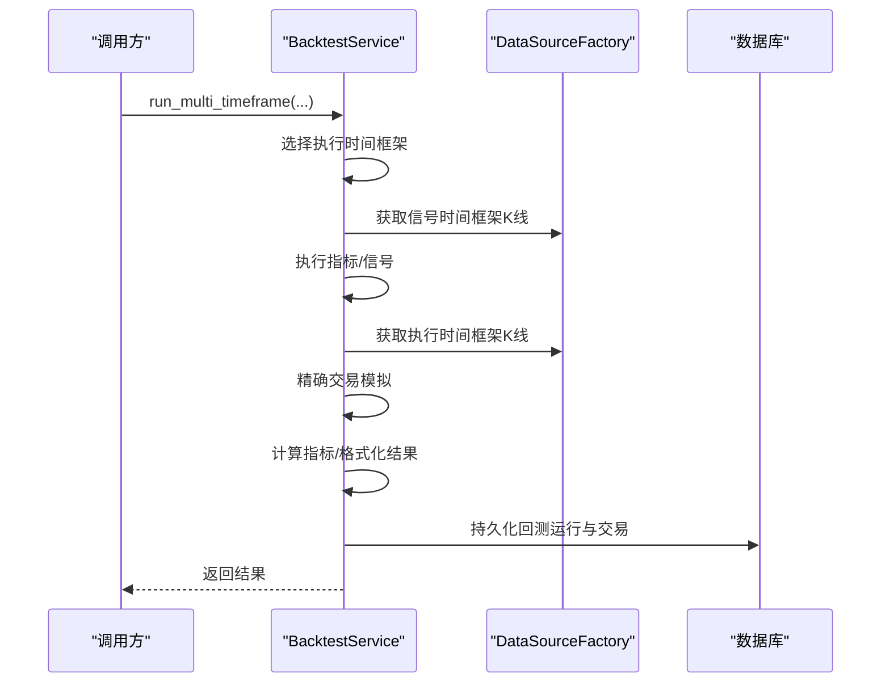
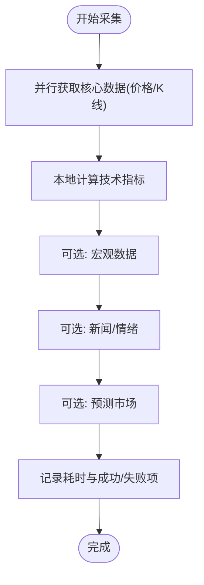
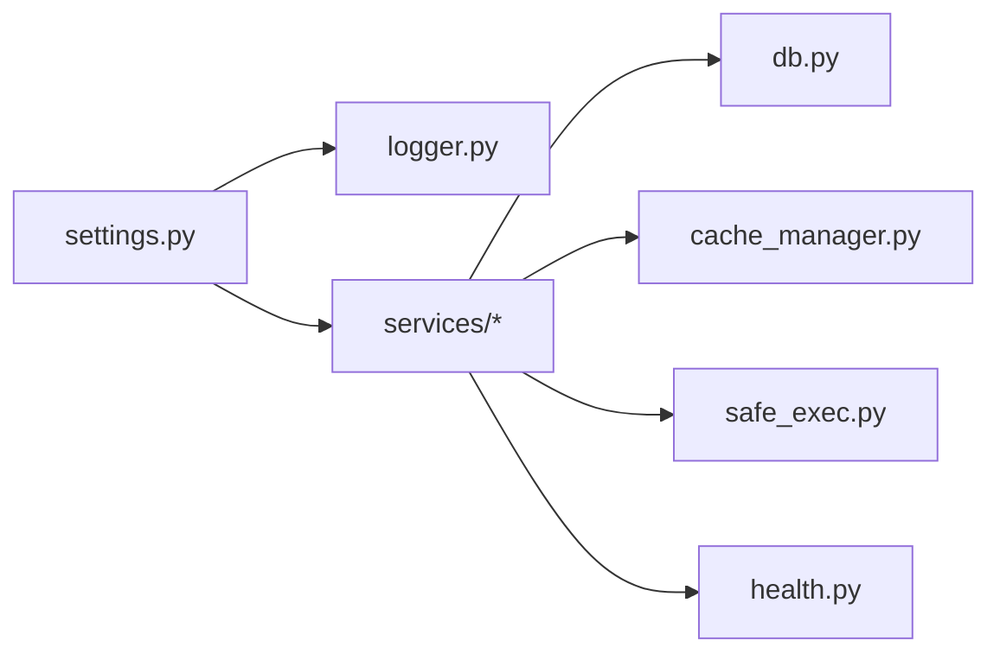

# 调试与性能分析

<cite>
**本文引用的文件**
- [run.py](file://backend_api_python/run.py)
- [gunicorn_config.py](file://backend_api_python/gunicorn_config.py)
- [settings.py](file://backend_api_python/app/config/settings.py)
- [logger.py](file://backend_api_python/app/utils/logger.py)
- [db.py](file://backend_api_python/app/utils/db.py)
- [cache_manager.py](file://backend_api_python/app/data_sources/cache_manager.py)
- [strategy_runtime_logs.py](file://backend_api_python/app/utils/strategy_runtime_logs.py)
- [safe_exec.py](file://backend_api_python/app/utils/safe_exec.py)
- [backtest.py](file://backend_api_python/app/services/backtest.py)
- [market_data_collector.py](file://backend_api_python/app/services/market_data_collector.py)
- [base.py](file://backend_api_python/app/services/live_trading/base.py)
- [portfolio_monitor.py](file://backend_api_python/app/services/portfolio_monitor.py)
- [health.py](file://backend_api_python/app/routes/health.py)
</cite>

## 目录
1. [简介](#简介)
2. [项目结构](#项目结构)
3. [核心组件](#核心组件)
4. [架构总览](#架构总览)
5. [详细组件分析](#详细组件分析)
6. [依赖分析](#依赖分析)
7. [性能考量](#性能考量)
8. [故障排查指南](#故障排查指南)
9. [结论](#结论)
10. [附录](#附录)

## 简介
本指南面向QuantDinger后端开发与运维团队，系统阐述开发与生产环境下的调试与性能分析方法。内容覆盖日志配置、断点调试、异常追踪、性能分析工具使用（内存、CPU、数据库查询）、策略执行调试、回测过程分析、实时交易监控，以及常见性能瓶颈的识别与解决策略。同时提供生产环境调试、错误监控与告警配置建议及工具推荐。

## 项目结构
后端采用Flask应用，通过入口脚本启动，使用Gunicorn作为生产WSGI服务器，配置项集中于配置类与环境变量，日志统一由工具模块初始化，数据库连接封装在独立工具中，核心业务逻辑分布在服务层，数据缓存与K线缓存分别在数据源与通用缓存模块中实现。

图表来源
- [run.py:100-134](file://backend_api_python/run.py#L100-L134)
- [gunicorn_config.py:10-36](file://backend_api_python/gunicorn_config.py#L10-L36)
- [settings.py:92-99](file://backend_api_python/app/config/settings.py#L92-L99)
- [logger.py:9-63](file://backend_api_python/app/utils/logger.py#L9-L63)
- [db.py:19-66](file://backend_api_python/app/utils/db.py#L19-L66)
- [cache_manager.py:44-233](file://backend_api_python/app/data_sources/cache_manager.py#L44-L233)
- [strategy_runtime_logs.py:11-30](file://backend_api_python/app/utils/strategy_runtime_logs.py#L11-L30)
- [safe_exec.py:157-244](file://backend_api_python/app/utils/safe_exec.py#L157-L244)
- [backtest.py:64-669](file://backend_api_python/app/services/backtest.py#L64-L669)
- [market_data_collector.py:34-225](file://backend_api_python/app/services/market_data_collector.py#L34-L225)
- [base.py:95-168](file://backend_api_python/app/services/live_trading/base.py#L95-L168)
- [portfolio_monitor.py:148-387](file://backend_api_python/app/services/portfolio_monitor.py#L148-L387)

章节来源
- [run.py:100-134](file://backend_api_python/run.py#L100-L134)
- [gunicorn_config.py:10-36](file://backend_api_python/gunicorn_config.py#L10-L36)
- [settings.py:92-99](file://backend_api_python/app/config/settings.py#L92-L99)

## 核心组件
- 日志系统：集中初始化与文件落盘，过滤噪声日志，支持环境变量控制级别与文件大小。
- 配置系统：通过元类聚合环境变量，统一暴露主机、端口、调试、日志、功能开关等。
- 数据库连接：统一PostgreSQL连接接口，提供初始化与关闭能力。
- 缓存体系：通用数据缓存与K线缓存，支持TTL、LRU与线程安全。
- 安全执行：策略代码沙箱执行、超时控制、内存限制、子进程隔离。
- 回测引擎：多时间框架回测、缓存与指标计算、结果持久化。
- 实时数据采集：并行抓取价格、K线、技术指标、宏观与情绪数据。
- 实盘交易：REST客户端基类，统一请求封装与TLS校验策略。
- 组合监控：定时分析用户持仓，构建报告并通过多通道通知。
- 健康检查：对外提供健康状态接口。

章节来源
- [logger.py:9-63](file://backend_api_python/app/utils/logger.py#L9-L63)
- [settings.py:66-91](file://backend_api_python/app/config/settings.py#L66-L91)
- [db.py:19-66](file://backend_api_python/app/utils/db.py#L19-L66)
- [cache_manager.py:44-233](file://backend_api_python/app/data_sources/cache_manager.py#L44-L233)
- [safe_exec.py:157-354](file://backend_api_python/app/utils/safe_exec.py#L157-L354)
- [backtest.py:64-669](file://backend_api_python/app/services/backtest.py#L64-L669)
- [market_data_collector.py:34-225](file://backend_api_python/app/services/market_data_collector.py#L34-L225)
- [base.py:95-168](file://backend_api_python/app/services/live_trading/base.py#L95-L168)
- [portfolio_monitor.py:148-387](file://backend_api_python/app/services/portfolio_monitor.py#L148-L387)
- [health.py:10-34](file://backend_api_python/app/routes/health.py#L10-L34)

## 架构总览
下图展示从入口到各服务模块的交互关系，突出日志、配置、缓存、数据库与安全执行在整体流程中的作用。

图表来源
- [run.py:100-134](file://backend_api_python/run.py#L100-L134)
- [gunicorn_config.py:10-36](file://backend_api_python/gunicorn_config.py#L10-L36)
- [settings.py:92-99](file://backend_api_python/app/config/settings.py#L92-L99)
- [logger.py:9-63](file://backend_api_python/app/utils/logger.py#L9-L63)
- [db.py:19-66](file://backend_api_python/app/utils/db.py#L19-L66)
- [cache_manager.py:44-233](file://backend_api_python/app/data_sources/cache_manager.py#L44-L233)
- [strategy_runtime_logs.py:11-30](file://backend_api_python/app/utils/strategy_runtime_logs.py#L11-L30)
- [safe_exec.py:157-354](file://backend_api_python/app/utils/safe_exec.py#L157-L354)
- [backtest.py:64-669](file://backend_api_python/app/services/backtest.py#L64-L669)
- [market_data_collector.py:34-225](file://backend_api_python/app/services/market_data_collector.py#L34-L225)
- [base.py:95-168](file://backend_api_python/app/services/live_trading/base.py#L95-L168)
- [portfolio_monitor.py:148-387](file://backend_api_python/app/services/portfolio_monitor.py#L148-L387)
- [health.py:10-34](file://backend_api_python/app/routes/health.py#L10-L34)

## 详细组件分析

### 日志系统与调试入口
- 初始化策略：启动时根据环境变量设置日志级别与文件滚动大小，过滤无关噪音，确保生产环境可读性。
- 模块化日志：提供按模块的细粒度控制，便于定位特定服务问题。
- 建议：开发期将LOG_LEVEL设为DEBUG，生产期设为INFO或WARNING；结合文件轮转避免磁盘膨胀。

章节来源
- [logger.py:9-63](file://backend_api_python/app/utils/logger.py#L9-L63)
- [settings.py:46-65](file://backend_api_python/app/config/settings.py#L46-L65)

### 配置与启动流程
- 入口脚本负责加载.env、设置代理、标准化输出编码、注入项目路径，随后创建Flask应用并启动。
- 生产环境通过Gunicorn运行，支持多worker与线程模型，超时与请求限制可控。
- 建议：生产务必设置非默认SECRET_KEY，避免安全风险。

图表来源
- [run.py:100-134](file://backend_api_python/run.py#L100-L134)
- [gunicorn_config.py:10-36](file://backend_api_python/gunicorn_config.py#L10-L36)
- [settings.py:10-28](file://backend_api_python/app/config/settings.py#L10-L28)

章节来源
- [run.py:100-134](file://backend_api_python/run.py#L100-L134)
- [gunicorn_config.py:10-36](file://backend_api_python/gunicorn_config.py#L10-L36)
- [settings.py:10-28](file://backend_api_python/app/config/settings.py#L10-L28)

### 数据库连接与事务
- 统一封装PostgreSQL连接，提供同步/异步获取与连接池关闭能力。
- 建议：在长事务中显式提交/回滚，避免长时间占用连接；批量写入使用事务包裹。

章节来源
- [db.py:19-66](file://backend_api_python/app/utils/db.py#L19-L66)

### 缓存与K线缓存
- 通用缓存：TTL过期、LRU淘汰、线程安全、命中率统计。
- K线缓存：针对高频K线数据的轻量缓存，降低外部API压力。
- 建议：热点符号与时间框架组合建立缓存键，合理设置TTL与最大容量。

图表来源
- [cache_manager.py:44-175](file://backend_api_python/app/data_sources/cache_manager.py#L44-L175)
- [cache_manager.py:27-42](file://backend_api_python/app/data_sources/cache_manager.py#L27-L42)

章节来源
- [cache_manager.py:44-233](file://backend_api_python/app/data_sources/cache_manager.py#L44-L233)

### 安全执行与策略调试
- 提供超时、内存限制、白名单内置函数与模块、子进程隔离等能力，保障策略执行安全。
- 建议：在开发阶段启用严格超时与内存限制，防止策略卡死或内存泄漏影响服务稳定性。

图表来源
- [safe_exec.py:157-244](file://backend_api_python/app/utils/safe_exec.py#L157-L244)
- [safe_exec.py:248-354](file://backend_api_python/app/utils/safe_exec.py#L248-L354)
- [safe_exec.py:358-471](file://backend_api_python/app/utils/safe_exec.py#L358-L471)

章节来源
- [safe_exec.py:157-354](file://backend_api_python/app/utils/safe_exec.py#L157-L354)
- [safe_exec.py:358-471](file://backend_api_python/app/utils/safe_exec.py#L358-L471)

### 回测服务与性能
- 多时间框架回测：根据回测区间自动选择执行时间框架，支持精确模拟交易。
- 指标计算与持久化：统一计算指标、持久化回测结果与交易清单。
- 建议：对大规模回测开启缓存，合理设置并发与批处理，避免重复拉取数据。

图表来源
- [backtest.py:444-669](file://backend_api_python/app/services/backtest.py#L444-L669)
- [backtest.py:258-342](file://backend_api_python/app/services/backtest.py#L258-L342)

章节来源
- [backtest.py:444-669](file://backend_api_python/app/services/backtest.py#L444-L669)
- [backtest.py:258-342](file://backend_api_python/app/services/backtest.py#L258-L342)

### 实时数据采集与性能
- 并行抓取：核心数据（价格/K线）并行获取，支持超时与失败降级。
- 指标计算：纯本地计算，避免外部依赖。
- 建议：为不同数据源设置差异化超时与重试策略，失败项单独记录以便重试。

图表来源
- [market_data_collector.py:72-225](file://backend_api_python/app/services/market_data_collector.py#L72-L225)
- [market_data_collector.py:285-510](file://backend_api_python/app/services/market_data_collector.py#L285-L510)

章节来源
- [market_data_collector.py:72-225](file://backend_api_python/app/services/market_data_collector.py#L72-L225)
- [market_data_collector.py:285-510](file://backend_api_python/app/services/market_data_collector.py#L285-L510)

### 实盘交易监控与TLS
- 统一REST客户端：封装请求、超时、TLS校验策略，避免重复逻辑。
- 建议：在容器/最小镜像环境中正确配置CA证书路径，避免TLS校验失败。

章节来源
- [base.py:95-168](file://backend_api_python/app/services/live_trading/base.py#L95-L168)

### 组合监控与通知
- 并行分析：去重后并行分析，聚合结果生成报告。
- 通知渠道：邮件、Telegram、Webhook、站内通知等多通道合并与校验。
- 建议：为每个通道配置可用性检查，缺失目标时自动补充浏览器通道。

章节来源
- [portfolio_monitor.py:148-387](file://backend_api_python/app/services/portfolio_monitor.py#L148-L387)

### 健康检查
- 提供应用状态与API健康检查端点，便于容器编排与反向代理探针使用。

章节来源
- [health.py:10-34](file://backend_api_python/app/routes/health.py#L10-L34)

## 依赖分析
- 组件耦合：服务层依赖配置、日志、数据库与缓存；缓存与数据采集相互配合；安全执行贯穿策略生命周期。
- 外部依赖：数据库(PostgreSQL)、第三方HTTP服务(交易所API、数据提供商)、TLS证书栈。
- 建议：避免循环依赖；对第三方依赖增加超时与熔断；对数据库操作进行连接池与事务管理。

图表来源
- [settings.py:92-99](file://backend_api_python/app/config/settings.py#L92-L99)
- [logger.py:9-63](file://backend_api_python/app/utils/logger.py#L9-L63)
- [db.py:19-66](file://backend_api_python/app/utils/db.py#L19-L66)
- [cache_manager.py:44-233](file://backend_api_python/app/data_sources/cache_manager.py#L44-L233)
- [safe_exec.py:157-354](file://backend_api_python/app/utils/safe_exec.py#L157-L354)
- [health.py:10-34](file://backend_api_python/app/routes/health.py#L10-L34)

## 性能考量
- CPU与内存
  - 使用安全执行工具限制策略执行时间与内存，防止“坏策略”拖垮服务。
  - 在回测与分析中使用并行线程池，注意任务粒度与队列长度。
- I/O与网络
  - 通过缓存与K线缓存减少外部API调用；为不同数据源设置差异化超时。
  - 实盘交易统一TLS校验策略，避免证书链问题导致的握手失败。
- 数据库
  - 批量写入使用事务；索引设计与查询条件匹配；定期清理历史表。
- 启动与并发
  - 生产使用Gunicorn多worker与线程模型；避免preload导致后台线程丢失。

章节来源
- [safe_exec.py:157-354](file://backend_api_python/app/utils/safe_exec.py#L157-L354)
- [backtest.py:444-669](file://backend_api_python/app/services/backtest.py#L444-L669)
- [market_data_collector.py:72-225](file://backend_api_python/app/services/market_data_collector.py#L72-L225)
- [base.py:95-168](file://backend_api_python/app/services/live_trading/base.py#L95-L168)
- [gunicorn_config.py:10-36](file://backend_api_python/gunicorn_config.py#L10-L36)

## 故障排查指南
- 日志定位
  - 开启DEBUG级别，观察关键模块日志（回测、数据采集、实盘交易、组合监控）。
  - 关注文件滚动与目录权限，避免日志写入失败。
- 断点调试
  - 开发模式使用Flask自带调试器；生产模式通过日志与异常堆栈定位。
- 异常追踪
  - 回测与组合监控中广泛使用日志记录与异常捕获，优先查看最近错误堆栈。
- 数据库问题
  - 检查连接字符串与权限；确认迁移脚本已执行；监控慢查询与锁等待。
- API调用超时
  - 为外部API设置合理超时与重试；启用缓存；必要时限流。
- 内存泄漏
  - 使用安全执行工具限制内存；检查策略中大对象引用；定期重启worker。
- 实时交易
  - 校验证书路径与代理设置；检查请求头编码；关注SSL错误日志。

章节来源
- [logger.py:9-63](file://backend_api_python/app/utils/logger.py#L9-L63)
- [backtest.py:340-342](file://backend_api_python/app/services/backtest.py#L340-L342)
- [portfolio_monitor.py:384-387](file://backend_api_python/app/services/portfolio_monitor.py#L384-L387)
- [base.py:138-146](file://backend_api_python/app/services/live_trading/base.py#L138-L146)

## 结论
通过统一的日志、配置、缓存与数据库接口，结合安全执行与健康检查，QuantDinger在开发与生产环境下具备良好的可观测性与可维护性。遵循本文提供的调试与性能分析方法，可有效定位问题、优化瓶颈并提升系统稳定性。

## 附录
- 调试工具推荐
  - 日志：RotatingFileHandler（已内置）
  - 性能：cProfile、py-spy（采样式CPU分析）、memory_profiler（采样式内存分析）
  - 数据库：EXPLAIN/ANALYZE、pg_stat_statements（PostgreSQL）
  - APM：OpenTelemetry（可选接入）
- 最佳实践
  - 明确日志级别与保留策略
  - 为关键路径埋点与指标
  - 严格策略执行时限与内存上限
  - 定期审查缓存命中率与淘汰策略
  - 生产环境禁用默认密钥，启用强密码学参数