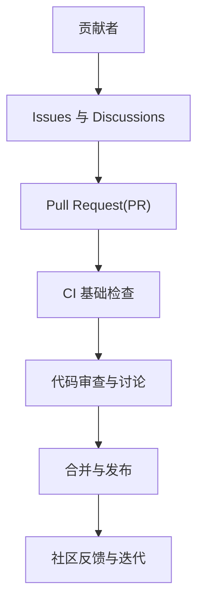
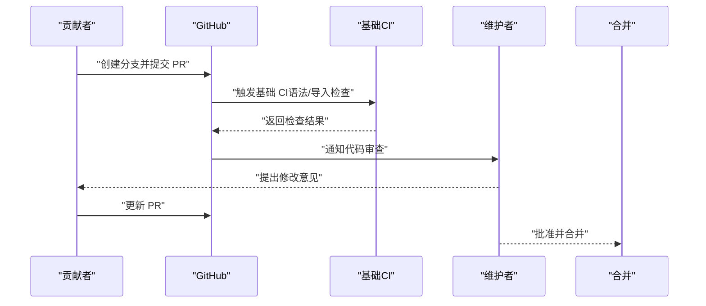
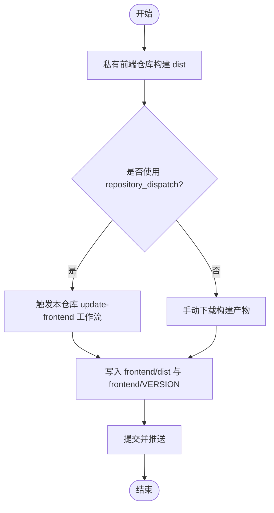

# 贡献流程

<cite>
**本文引用的文件**   
- [CONTRIBUTING.md](file://CONTRIBUTING.md)
- [CODE_OF_CONDUCT.md](file://CODE_OF_CONDUCT.md)
- [.github/PULL_REQUEST_TEMPLATE.md](file://.github/PULL_REQUEST_TEMPLATE.md)
- [README.md](file://README.md)
- [DEVELOPMENT.md](file://DEVELOPMENT.md)
- [docker-compose.yml](file://docker-compose.yml)
- [.github/workflows/basic-ci.yml](file://.github/workflows/basic-ci.yml)
- [.github/workflows/update-frontend.yml](file://.github/workflows/update-frontend.yml)
- [SECURITY.md](file://SECURITY.md)
- [CONTRIBUTORS.md](file://CONTRIBUTORS.md)
</cite>

## 目录
1. [简介](#简介)
2. [项目结构与贡献入口](#项目结构与贡献入口)
3. [核心贡献类型与范围](#核心贡献类型与范围)
4. [贡献前准备与开发环境](#贡献前准备与开发环境)
5. [分支命名与提交规范](#分支命名与提交规范)
6. [Pull Request 流程与模板](#pull-request-流程与模板)
7. [代码审查与合并要求](#代码审查与合并要求)
8. [发布与版本管理](#发布与版本管理)
9. [安全漏洞报告与处理](#安全漏洞报告与处理)
10. [社区沟通与协作规范](#社区沟通与协作规范)
11. [新贡献者入门与常见问题](#新贡献者入门与常见问题)
12. [附录：贡献者列表与致谢](#附录贡献者列表与致谢)

## 简介
本指南面向所有希望参与 QuantDinger 的贡献者，系统说明如何以规范的方式参与项目：从问题报告、功能请求、代码贡献，到文档改进、内容推广等。文档同时覆盖分支命名、提交信息格式、PR 标准模板、代码审查流程、合并要求、发布流程、安全披露、社区沟通与协作规范，并提供新贡献者的入门路径与常见问题解答。

## 项目结构与贡献入口
QuantDinger 采用多仓库协作模式：后端与部署在本仓库，前端源码位于独立私有仓库，构建产物同步至本仓库的 frontend/dist。贡献入口与职责如下：
- 后端与服务：Python/Flask 后端、数据源与执行适配器、AI 分析与代理网关、数据库迁移与配置等。
- 前端：预构建静态资源（Vue 源码在私有仓库维护），如需更新 UI，请在私有仓库构建后同步至本仓库。
- 文档与示例：产品文档、策略开发指南、示例脚本、本地化 README 等。
- 部署与运维：Docker Compose 编排、健康检查、环境变量与镜像前缀等。

图示来源
- [.github/workflows/basic-ci.yml:1-117](file://.github/workflows/basic-ci.yml#L1-L117)
- [docker-compose.yml:1-172](file://docker-compose.yml#L1-L172)

章节来源
- [README.md:121-131](file://README.md#L121-L131)
- [DEVELOPMENT.md:39-63](file://DEVELOPMENT.md#L39-L63)

## 核心贡献类型与范围
根据贡献性质，可划分为以下四类，均强调“公开、可验证”的工作成果与长期价值：
- 核心工程：Python 策略引擎、执行逻辑、AI/LLM 代理工作流、回测与数据管线等。
- 策略与研究：示例策略、研究笔记、实验与性能分析等，展示思路与方法论。
- 文档与解释：教程、架构说明、设计缘由等，清晰表达胜过完美代码。
- 内容与倡导：技术博客、演示视频、系统拆解、客观评测或批评等。

章节来源
- [CONTRIBUTING.md:46-85](file://CONTRIBUTING.md#L46-L85)

## 贡献前准备与开发环境
- 快速启动与本地调试
  - 使用 Docker Compose 一键拉起：前端、后端、PostgreSQL、Redis。
  - 配置后端 .env（至少设置密钥与管理员凭据），必要时调整根级 .env（端口、镜像前缀）。
  - 可选：在私有前端仓库构建后，将 dist 同步至本仓库的 frontend/dist。
- 后端本地运行（不使用容器）
  - 创建虚拟环境、安装依赖、复制并编辑 .env、运行后端入口。
- 前端更新流程
  - 在私有 Vue 仓库构建后，使用提供的脚本或手动同步 dist；随后重建/启动前端镜像。
- 环境变量与关键参数
  - 关键变量包括密钥、管理员账号、LLM 提供商密钥、缓存开关、数据库连接池与并发参数等。

章节来源
- [DEVELOPMENT.md:11-28](file://DEVELOPMENT.md#L11-L28)
- [DEVELOPMENT.md:65-75](file://DEVELOPMENT.md#L65-L75)
- [DEVELOPMENT.md:77-108](file://DEVELOPMENT.md#L77-L108)
- [DEVELOPMENT.md:125-137](file://DEVELOPMENT.md#L125-L137)
- [README.md:332-447](file://README.md#L332-L447)

## 分支命名与提交规范
- 分支命名
  - 修复类：fix/xxx
  - 新功能：feat/xxx
  - 文档类：docs/xxx
  - 维护类：chore/xxx
- 提交信息
  - 建议遵循“类型: 主题”格式，配合简要描述与变更动机，便于审阅与日志追踪。
  - 对于重大变更，建议先开 Discussion 讨论，再提交 PR。

章节来源
- [CONTRIBUTING.md:120-140](file://CONTRIBUTING.md#L120-L140)

## Pull Request 流程与模板
- PR 前建议
  - 先在 Discussion 中提出想法或大改动，避免重复劳动。
  - 保持 PR 聚焦、可审查，提供测试计划与影响说明。
- PR 模板要点
  - 概述变更内容与原因
  - 测试计划（本地验证、后端日志、pytest）
  - UI 变更附截图
  - 兼容性说明（如有）
- CI 基础检查
  - 后端：语法与导入检查（基础 CI 不运行测试）
  - 前端：校验预构建 dist 存在、Nginx 配置与 Dockerfile 完整

图示来源
- [.github/workflows/basic-ci.yml:1-117](file://.github/workflows/basic-ci.yml#L1-L117)
- [.github/PULL_REQUEST_TEMPLATE.md:1-18](file://.github/PULL_REQUEST_TEMPLATE.md#L1-L18)

章节来源
- [CONTRIBUTING.md:129-140](file://CONTRIBUTING.md#L129-L140)
- [.github/PULL_REQUEST_TEMPLATE.md:1-18](file://.github/PULL_REQUEST_TEMPLATE.md#L1-L18)
- [.github/workflows/basic-ci.yml:1-117](file://.github/workflows/basic-ci.yml#L1-L117)

## 代码审查与合并要求
- 审查流程
  - 维护者负责审查与协调，关注：变更范围、测试与验证、兼容性、安全性与可维护性。
  - 大改动优先 Discussion，确保方向一致后再 PR。
- 合并条件
  - CI 基础检查通过
  - 至少一位维护者批准
  - 无阻塞性异议；若有争议，按多数意见决定
- 合并方式
  - 小改动可直接合并；重大变更建议变基或 squash 以保持历史整洁

章节来源
- [CONTRIBUTING.md:94-95](file://CONTRIBUTING.md#L94-L95)
- [CODE_OF_CONDUCT.md:82-95](file://CODE_OF_CONDUCT.md#L82-L95)

## 发布与版本管理
- 版本策略
  - 当前仓库未内置自动版本号生成与发布脚本；前端版本通过独立工作流更新并写入 frontend/VERSION。
- 前端构建同步
  - 私有前端仓库构建完成后，可通过两种方式将 dist 推送至本仓库：
    - 手动触发 Actions 或使用 repository_dispatch 触发本仓库的“Update Frontend Build”工作流
    - 下载构建产物并提交到 frontend/dist 与 frontend/VERSION
- 基础 CI
  - 仅进行语法与导入检查，不运行测试或外部服务，保证快速反馈

图示来源
- [.github/workflows/update-frontend.yml:1-84](file://.github/workflows/update-frontend.yml#L1-L84)

章节来源
- [.github/workflows/update-frontend.yml:1-84](file://.github/workflows/update-frontend.yml#L1-L84)
- [.github/workflows/basic-ci.yml:1-117](file://.github/workflows/basic-ci.yml#L1-L117)

## 安全漏洞报告与处理
- 披露原则
  - 不要在公共 Issue 中披露安全漏洞
  - 通过邮件私下报告，主题含“[Security]”
- 报告内容
  - 漏洞描述、复现步骤、影响评估；可选：缓解建议
- 支持范围
  - 本仓库源码、认证授权、密钥与凭证处理、策略执行边界、默认配置等
  - 用户自建环境、第三方服务、非官方构建等不在支持范围内
- 响应预期
  - 72 小时内确认收到，7 天内给出初步评估；接受后协调修复与负责任披露

章节来源
- [SECURITY.md:49-81](file://SECURITY.md#L49-L81)

## 社区沟通与协作规范
- 沟通渠道
  - Issues：缺陷报告与功能请求
  - Discussions：提问、想法与设计讨论
  - 社区：官方链接见 README
- 协作规范
  - 明确、尊重、聚焦于思想、代码与设计本身
  - 保持建设性与相关性，避免人身攻击与恶意行为
  - 行为准则适用于所有官方空间（Issues、PR、Discussion、代码审查等）

章节来源
- [CONTRIBUTING.md:88-95](file://CONTRIBUTING.md#L88-L95)
- [CODE_OF_CONDUCT.md:26-51](file://CODE_OF_CONDUCT.md#L26-L51)
- [README.md:649-661](file://README.md#L649-L661)

## 新贡献者入门与常见问题
- 入门步骤
  - 阅读贡献指南与行为准则
  - 准备开发环境（Docker 快速启动或本地后端运行）
  - 选择贡献类型（工程、策略、文档、内容），先开 Discussion 再 PR
- 常见问题
  - 如何更新前端？在私有 Vue 仓库构建后，使用脚本或手动同步 dist，并重建前端镜像
  - 如何运行测试？后端可使用 pytest；前端变更请在私有仓库验证
  - 为什么 CI 不跑测试？基础 CI 仅做语法与导入检查，不启动服务
  - 如何报告安全问题？请勿开公开 Issue，按安全政策私下邮件联系

章节来源
- [DEVELOPMENT.md:77-108](file://DEVELOPMENT.md#L77-L108)
- [DEVELOPMENT.md:138-144](file://DEVELOPMENT.md#L138-L144)
- [README.md:418-426](file://README.md#L418-L426)

## 附录：贡献者列表与致谢
- 贡献者致谢
  - 本仓库记录了通过 PR 合并进入主线的贡献者与对应 PR 链接，欢迎在贡献后更新此列表以体现公开可见的贡献。

章节来源
- [CONTRIBUTORS.md:1-10](file://CONTRIBUTORS.md#L1-L10)