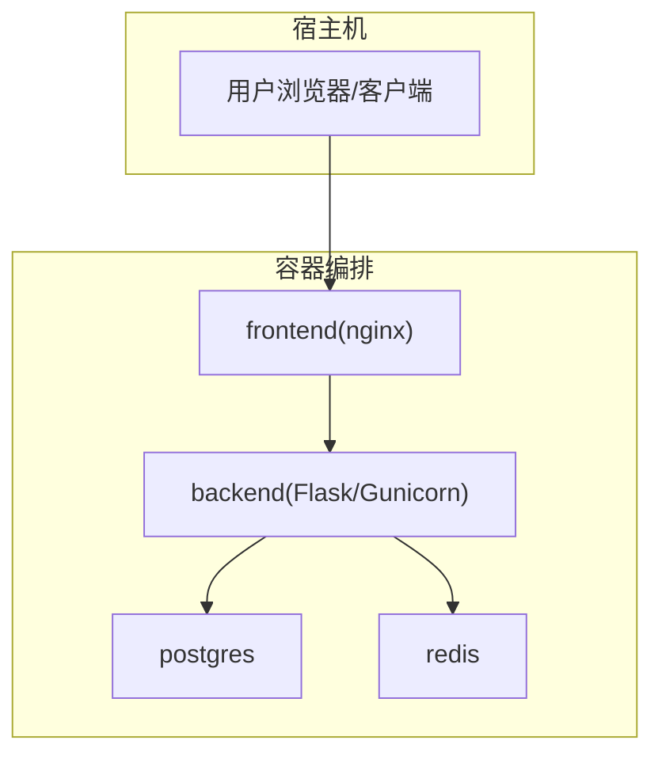
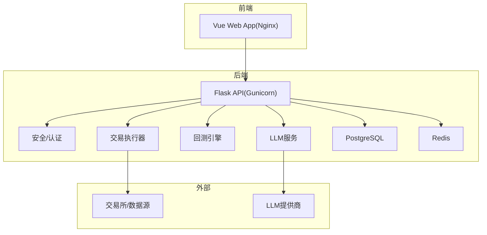
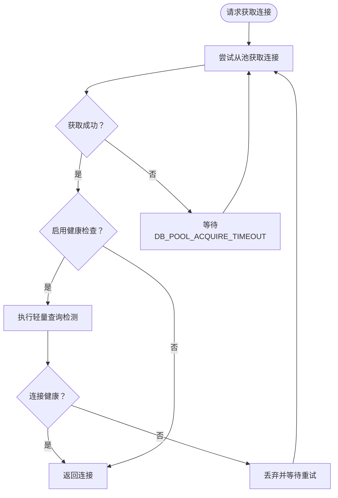
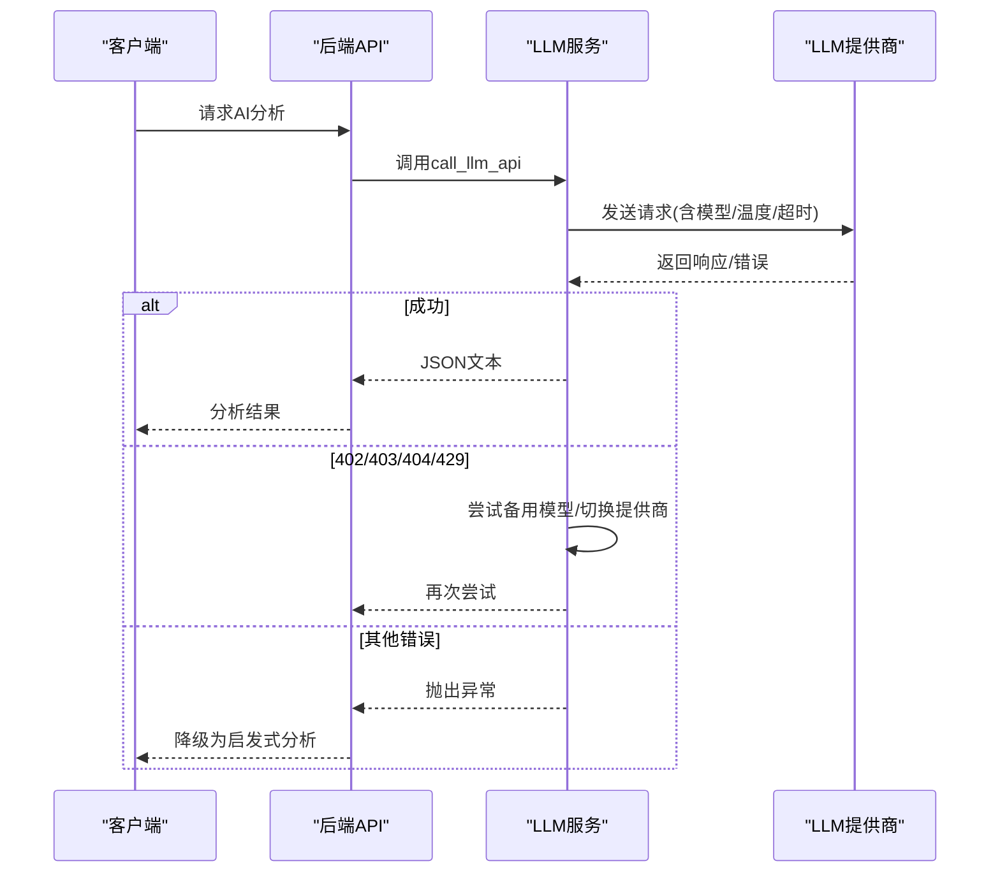
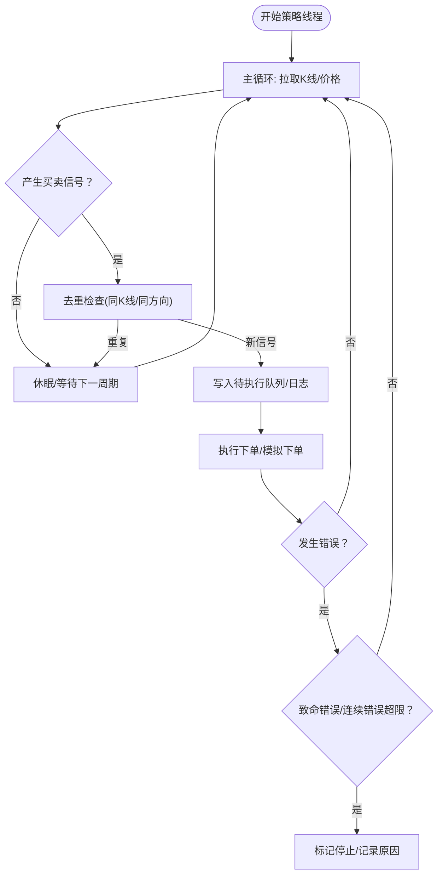
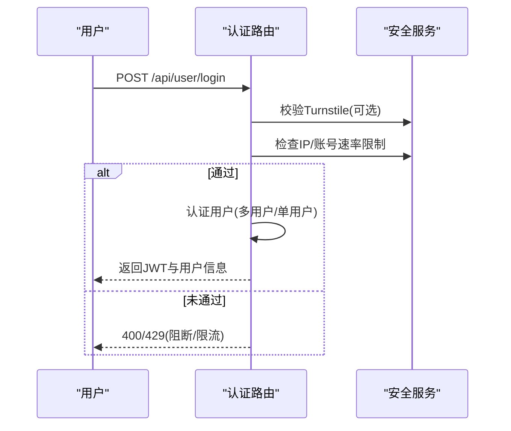
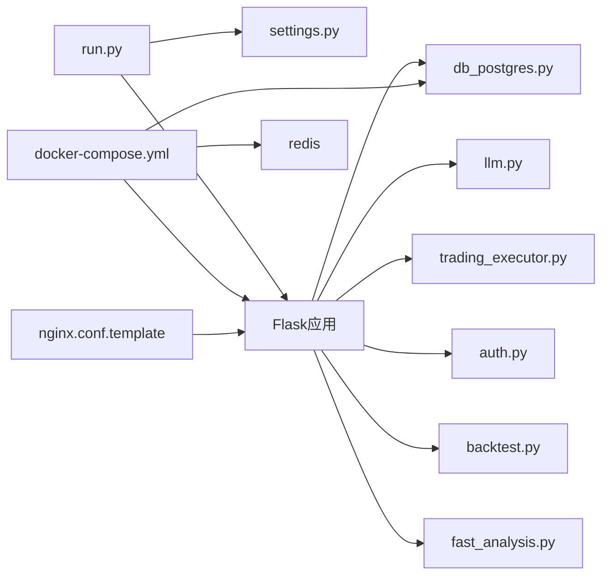

# 故障排除

<cite>
**本文引用的文件**
- [README.md](file://README.md)
- [backend_api_python/README.md](file://backend_api_python/README.md)
- [docker-compose.yml](file://docker-compose.yml)
- [backend_api_python/run.py](file://backend_api_python/run.py)
- [backend_api_python/env.example](file://backend_api_python/env.example)
- [backend_api_python/gunicorn_config.py](file://backend_api_python/gunicorn_config.py)
- [backend_api_python/app/utils/logger.py](file://backend_api_python/app/utils/logger.py)
- [backend_api_python/app/utils/db.py](file://backend_api_python/app/utils/db.py)
- [backend_api_python/app/utils/db_postgres.py](file://backend_api_python/app/utils/db_postgres.py)
- [backend_api_python/app/config/settings.py](file://backend_api_python/app/config/settings.py)
- [backend_api_python/app/utils/strategy_runtime_logs.py](file://backend_api_python/app/utils/strategy_runtime_logs.py)
- [backend_api_python/app/utils/safe_exec.py](file://backend_api_python/app/utils/safe_exec.py)
- [backend_api_python/app/services/exchange_execution.py](file://backend_api_python/app/services/exchange_execution.py)
- [backend_api_python/app/data_sources/rate_limiter.py](file://backend_api_python/app/data_sources/rate_limiter.py)
- [backend_api_python/app/services/trading_executor.py](file://backend_api_python/app/services/trading_executor.py)
- [backend_api_python/app/services/llm.py](file://backend_api_python/app/services/llm.py)
- [backend_api_python/app/routes/backtest.py](file://backend_api_python/app/routes/backtest.py)
- [backend_api_python/app/routes/fast_analysis.py](file://backend_api_python/app/routes/fast_analysis.py)
- [backend_api_python/app/routes/auth.py](file://backend_api_python/app/routes/auth.py)
- [backend_api_python/app/services/security_service.py](file://backend_api_python/app/services/security_service.py)
- [frontend/nginx.conf.template](file://frontend/nginx.conf.template)
</cite>

## 目录
1. [简介](#简介)
2. [项目结构](#项目结构)
3. [核心组件](#核心组件)
4. [架构总览](#架构总览)
5. [详细组件分析](#详细组件分析)
6. [依赖关系分析](#依赖关系分析)
7. [性能注意事项](#性能注意事项)
8. [故障排除指南](#故障排除指南)
9. [结论](#结论)
10. [附录](#附录)

## 简介
本指南面向QuantDinger用户与运维人员，覆盖安装部署、运行时诊断、网络与数据库连接、AI功能、交易执行与回测、安全与合规等全链路故障排除方法。内容基于仓库中的实际实现与文档，提供可操作的检查清单、日志分析要点、性能监控建议与应急处置流程。

## 项目结构
QuantDinger采用“前端静态资源 + 后端Flask API + 数据库(PostgreSQL) + 缓存(Redis)”的容器化部署模式。后端通过Docker Compose编排，提供健康检查与端口映射；前端通过Nginx提供静态资源与反向代理；后端负责策略引擎、AI分析、回测、交易执行与通知等核心能力。

图表来源
- [docker-compose.yml:25-172](file://docker-compose.yml#L25-L172)
- [frontend/nginx.conf.template:34-59](file://frontend/nginx.conf.template#L34-L59)

章节来源
- [README.md:332-448](file://README.md#L332-L448)
- [docker-compose.yml:25-172](file://docker-compose.yml#L25-L172)

## 核心组件
- 应用入口与配置加载：后端入口脚本负责加载.env、应用代理环境、初始化Flask应用与配置类。
- 数据库层：PostgreSQL连接池封装，提供健康检查与超时等待机制。
- 日志系统：统一日志配置与文件轮转，降低噪音并保留关键模块日志。
- 安全与认证：登录风控、验证码、Turnstile人机验证、速率限制。
- AI与LLM：多提供商适配、模型名归一化、错误提示与备用模型/提供商切换。
- 交易执行：策略线程、信号去重、价格缓存、资源状态打印与自动停止逻辑。
- 回测与分析：回测持久化、快速分析计费与降级、历史与相似模式检索。
- 健康检查：Compose健康检查与API健康端点。

章节来源
- [backend_api_python/run.py:17-134](file://backend_api_python/run.py#L17-L134)
- [backend_api_python/env.example:1-319](file://backend_api_python/env.example#L1-L319)
- [backend_api_python/gunicorn_config.py:1-36](file://backend_api_python/gunicorn_config.py#L1-L36)
- [backend_api_python/app/utils/db_postgres.py:107-161](file://backend_api_python/app/utils/db_postgres.py#L107-L161)
- [backend_api_python/app/utils/logger.py:9-63](file://backend_api_python/app/utils/logger.py#L9-L63)
- [backend_api_python/app/services/security_service.py:26-41](file://backend_api_python/app/services/security_service.py#L26-L41)
- [backend_api_python/app/services/llm.py:70-122](file://backend_api_python/app/services/llm.py#L70-L122)
- [backend_api_python/app/services/trading_executor.py:37-70](file://backend_api_python/app/services/trading_executor.py#L37-L70)
- [backend_api_python/app/routes/backtest.py:790-828](file://backend_api_python/app/routes/backtest.py#L790-L828)
- [backend_api_python/app/routes/fast_analysis.py:331-620](file://backend_api_python/app/routes/fast_analysis.py#L331-L620)

## 架构总览
下图展示从浏览器到后端、数据库与外部服务的典型交互路径，以及关键的错误与降级点。

图表来源
- [README.md:270-330](file://README.md#L270-L330)
- [backend_api_python/app/services/llm.py:70-122](file://backend_api_python/app/services/llm.py#L70-L122)
- [backend_api_python/app/services/trading_executor.py:37-70](file://backend_api_python/app/services/trading_executor.py#L37-L70)
- [backend_api_python/app/utils/db_postgres.py:107-161](file://backend_api_python/app/utils/db_postgres.py#L107-L161)

## 详细组件分析

### 组件A：数据库连接与池化
- 连接池参数：最小/最大连接数、获取超时、健康检查开关。
- 健康检查：连接池创建成功日志、轻量查询健康检查。
- 异常处理：连接池耗尽时的等待与告警、连接断开丢弃与重建。
- 建议：当出现“连接池耗尽”错误时，提升DB_POOL_MAX并确保PostgreSQL max_connections高于池上限。

图表来源
- [backend_api_python/app/utils/db_postgres.py:184-235](file://backend_api_python/app/utils/db_postgres.py#L184-L235)

章节来源
- [backend_api_python/app/utils/db_postgres.py:107-161](file://backend_api_python/app/utils/db_postgres.py#L107-L161)
- [backend_api_python/app/utils/db.py:38-49](file://backend_api_python/app/utils/db.py#L38-L49)
- [backend_api_python/env.example:42-62](file://backend_api_python/env.example#L42-L62)

### 组件B：AI与LLM服务
- 多提供商支持：OpenRouter、OpenAI、Google Gemini、DeepSeek、Grok、Custom、MiniMax。
- 模型名归一化：根据当前提供商提取或替换模型名，避免跨提供商错误调用。
- 错误处理：402/403/404/429等状态码的降级与备用模型/提供商切换。
- 降级策略：当LLM不可用时，回退到启发式分析结果。

图表来源
- [backend_api_python/app/services/llm.py:368-525](file://backend_api_python/app/services/llm.py#L368-L525)
- [backend_api_python/app/routes/backtest.py:790-828](file://backend_api_python/app/routes/backtest.py#L790-L828)

章节来源
- [backend_api_python/app/services/llm.py:70-122](file://backend_api_python/app/services/llm.py#L70-L122)
- [backend_api_python/app/routes/backtest.py:790-828](file://backend_api_python/app/routes/backtest.py#L790-L828)

### 组件C：交易执行与策略运行
- 策略线程管理：最大线程数限制、运行中策略集合、自动停止与错误阈值。
- 信号去重与价格缓存：避免同一K线重复下单、本地内存缓存提高性能。
- 资源状态打印：在容器环境中打印内存与线程数，辅助定位“无法创建新线程/内存不足”问题。
- 自动停止条件：致命错误(如不支持的市场类型)、连续错误超过阈值。

图表来源
- [backend_api_python/app/services/trading_executor.py:813-1595](file://backend_api_python/app/services/trading_executor.py#L813-L1595)

章节来源
- [backend_api_python/app/services/trading_executor.py:37-70](file://backend_api_python/app/services/trading_executor.py#L37-L70)
- [backend_api_python/app/utils/strategy_runtime_logs.py:11-29](file://backend_api_python/app/utils/strategy_runtime_logs.py#L11-L29)

### 组件D：认证与安全
- 登录风控：Turnstile校验、IP/账号级速率限制、失败记录与阻断。
- 安全配置公开：前端可获取验证码开关、注册开关、OAuth开关等。
- 防护措施：登录失败事件记录、验证码有效期与频率限制。

图表来源
- [backend_api_python/app/routes/auth.py:140-221](file://backend_api_python/app/routes/auth.py#L140-L221)
- [backend_api_python/app/services/security_service.py:26-41](file://backend_api_python/app/services/security_service.py#L26-L41)

章节来源
- [backend_api_python/app/routes/auth.py:115-134](file://backend_api_python/app/routes/auth.py#L115-L134)
- [backend_api_python/app/services/security_service.py:26-41](file://backend_api_python/app/services/security_service.py#L26-L41)

## 依赖关系分析
- 后端依赖：Flask应用工厂、PostgreSQL连接池、Redis(可选)、外部LLM与数据源。
- Compose依赖：容器间健康检查、端口映射、卷挂载(.env、日志、数据)。
- 前端依赖：Nginx反代后端API，SPA路由回退至index.html。

图表来源
- [backend_api_python/run.py:96-101](file://backend_api_python/run.py#L96-L101)
- [backend_api_python/app/config/settings.py:92-99](file://backend_api_python/app/config/settings.py#L92-L99)
- [docker-compose.yml:81-132](file://docker-compose.yml#L81-L132)
- [frontend/nginx.conf.template:48-59](file://frontend/nginx.conf.template#L48-L59)

章节来源
- [backend_api_python/run.py:96-101](file://backend_api_python/run.py#L96-L101)
- [docker-compose.yml:81-132](file://docker-compose.yml#L81-L132)

## 性能注意事项
- 连接池与并发：合理设置DB_POOL_MAX与Gunicorn线程数，避免“连接池耗尽”与“过多线程导致上下文切换开销”。
- 代理与TLS：在代理环境下正确设置CA证书与TLS验证，避免SSL握手失败导致上游请求失败。
- 速率限制与重试：数据源层具备指数退避与抖动的重试策略，避免雪崩效应。
- 日志与监控：开启请求日志与适当日志级别，结合容器资源监控定位CPU/内存瓶颈。

## 故障排除指南

### 安装部署阶段常见问题
- 端口冲突
  - 症状：容器启动后立即退出或端口占用。
  - 排查：检查宿主机端口占用，修改root级.env中的FRONTEND_PORT、BACKEND_PORT或DB_PORT、REDIS_PORT。
  - 参考：[README.md:344-345](file://README.md#L344-L345)、[docker-compose.yml:50-69](file://docker-compose.yml#L50-L69)
- 权限问题
  - 症状：容器无法写入日志或数据卷。
  - 排查：确认宿主机对backend_logs/backend_data卷目录的读写权限。
  - 参考：[docker-compose.yml:161-167](file://docker-compose.yml#L161-L167)
- 依赖缺失
  - 症状：后端启动时报缺少psycopg2或依赖安装失败。
  - 排查：确认requirements.txt安装完成；若使用自定义镜像，确保基础镜像包含所需依赖。
  - 参考：[backend_api_python/README.md:95-100](file://backend_api_python/README.md#L95-L100)
- 环境变量错误
  - 症状：SECRET_KEY未修改或格式错误导致拒绝启动。
  - 排查：生成并设置有效的SECRET_KEY，参考[README.md:362-375](file://README.md#L362-L375)与[run.py:109-120](file://backend_api_python/run.py#L109-L120)。
- 数据库连接失败
  - 症状：健康检查失败或启动报错。
  - 排查：核对DATABASE_URL格式、PostgreSQL服务可达性、DB_POOL参数与PG最大连接数。
  - 参考：[backend_api_python/env.example:21-51](file://backend_api_python/env.example#L21-L51)、[backend_api_python/app/utils/db_postgres.py:121-128](file://backend_api_python/app/utils/db_postgres.py#L121-L128)

章节来源
- [README.md:418-426](file://README.md#L418-L426)
- [docker-compose.yml:50-69](file://docker-compose.yml#L50-L69)
- [backend_api_python/run.py:109-120](file://backend_api_python/run.py#L109-L120)
- [backend_api_python/env.example:21-51](file://backend_api_python/env.example#L21-L51)
- [backend_api_python/app/utils/db_postgres.py:121-128](file://backend_api_python/app/utils/db_postgres.py#L121-L128)

### 运行时问题诊断
- 日志分析
  - 后端日志：查看logs/app.log，关注数据库连接、LLM调用、交易执行与回测相关错误。
  - 参考：[backend_api_python/app/utils/logger.py:9-49](file://backend_api_python/app/utils/logger.py#L9-L49)
- 性能监控
  - 连接池耗尽：观察“pool exhausted”告警，提升DB_POOL_MAX并优化慢查询。
  - 参考：[backend_api_python/app/utils/db_postgres.py:205-210](file://backend_api_python/app/utils/db_postgres.py#L205-L210)
- 资源使用
  - 线程/内存：在策略执行器中打印资源状态，定位“无法创建新线程/内存不足”。
  - 参考：[backend_api_python/app/services/trading_executor.py:149-176](file://backend_api_python/app/services/trading_executor.py#L149-L176)

章节来源
- [backend_api_python/app/utils/logger.py:9-49](file://backend_api_python/app/utils/logger.py#L9-L49)
- [backend_api_python/app/utils/db_postgres.py:205-210](file://backend_api_python/app/utils/db_postgres.py#L205-L210)
- [backend_api_python/app/services/trading_executor.py:149-176](file://backend_api_python/app/services/trading_executor.py#L149-L176)

### 网络连接问题
- 出站代理
  - 症状：访问外部数据源/LLM失败。
  - 排查：设置PROXY_URL，注意中国金融域名绕过规则；必要时配置LIVE_TRADING_CA_BUNDLE或禁用TLS校验(仅临时)。
  - 参考：[backend_api_python/run.py:60-91](file://backend_api_python/run.py#L60-L91)、[backend_api_python/env.example:138-152](file://backend_api_python/env.example#L138-L152)
- 反向代理与CORS
  - 症状：浏览器跨域或空白页。
  - 排查：确认FRONTEND_URL与后端CORS设置匹配，Nginx代理头正确传递。
  - 参考：[frontend/nginx.conf.template:34-46](file://frontend/nginx.conf.template#L34-L46)、[backend_api_python/env.example:22-28](file://backend_api_python/env.example#L22-L28)

章节来源
- [backend_api_python/run.py:60-91](file://backend_api_python/run.py#L60-L91)
- [backend_api_python/env.example:138-152](file://backend_api_python/env.example#L138-L152)
- [frontend/nginx.conf.template:34-46](file://frontend/nginx.conf.template#L34-L46)

### 数据库连接失败
- 症状：启动即报“无法连接PostgreSQL”或健康检查失败。
- 排查：核对DATABASE_URL、PostgreSQL服务状态、DB_POOL参数、PG最大连接数。
- 参考：[backend_api_python/app/utils/db.py:38-49](file://backend_api_python/app/utils/db.py#L38-L49)、[backend_api_python/env.example:42-51](file://backend_api_python/env.example#L42-L51)

章节来源
- [backend_api_python/app/utils/db.py:38-49](file://backend_api_python/app/utils/db.py#L38-L49)
- [backend_api_python/env.example:42-51](file://backend_api_python/env.example#L42-L51)

### API调用错误
- 通用错误码
  - 401/403/404/429/500/502/501：令牌失效、权限不足、资源不存在、限流、内部错误、上游失败、未启用实盘。
  - 参考：[docs/agent/AGENT_QUICKSTART.md:247-256](file://docs/agent/AGENT_QUICKSTART.md#L247-L256)
- 回测分析降级
  - 当LLM调用失败时，自动降级为启发式分析并返回提示。
  - 参考：[backend_api_python/app/routes/backtest.py:790-828](file://backend_api_python/app/routes/backtest.py#L790-L828)

章节来源
- [docs/agent/AGENT_QUICKSTART.md:247-256](file://docs/agent/AGENT_QUICKSTART.md#L247-L256)
- [backend_api_python/app/routes/backtest.py:790-828](file://backend_api_python/app/routes/backtest.py#L790-L828)

### AI功能异常
- LLM提供商配置错误
  - 症状：403/402/404/429或空内容。
  - 排查：检查对应API密钥、模型名、提供商URL；启用备用模型或切换提供商。
  - 参考：[backend_api_python/app/services/llm.py:480-525](file://backend_api_python/app/services/llm.py#L480-L525)
- 快速分析计费与并发
  - 症状：积分不足或并发进行中。
  - 排查：检查积分余额、billing开关与并发控制。
  - 参考：[backend_api_python/app/routes/fast_analysis.py:331-384](file://backend_api_python/app/routes/fast_analysis.py#L331-L384)

章节来源
- [backend_api_python/app/services/llm.py:480-525](file://backend_api_python/app/services/llm.py#L480-L525)
- [backend_api_python/app/routes/fast_analysis.py:331-384](file://backend_api_python/app/routes/fast_analysis.py#L331-L384)

### 交易执行失败
- 策略线程崩溃/自动停止
  - 症状：策略状态变为stopped，日志记录错误。
  - 排查：检查致命错误(如不支持的市场类型)与连续错误阈值；查看策略运行日志表。
  - 参考：[backend_api_python/app/services/trading_executor.py:813-1595](file://backend_api_python/app/services/trading_executor.py#L813-L1595)、[backend_api_python/app/utils/strategy_runtime_logs.py:11-29](file://backend_api_python/app/utils/strategy_runtime_logs.py#L11-L29)
- 信号重复/未成交
  - 症状：同一K线重复下单或长时间无成交。
  - 排查：确认信号去重缓存与价格缓存配置；检查交易所/数据源可用性。
  - 参考：[backend_api_python/app/services/trading_executor.py:44-57](file://backend_api_python/app/services/trading_executor.py#L44-L57)

章节来源
- [backend_api_python/app/services/trading_executor.py:813-1595](file://backend_api_python/app/services/trading_executor.py#L813-L1595)
- [backend_api_python/app/utils/strategy_runtime_logs.py:11-29](file://backend_api_python/app/utils/strategy_runtime_logs.py#L11-L29)

### 策略回测错误
- 回测失败
  - 症状：回测保存为失败状态并记录错误信息。
  - 排查：检查策略代码合法性、输入参数、时间范围与初始资金等。
  - 参考：[backend_api_python/app/routes/backtest.py:347-373](file://backend_api_python/app/routes/backtest.py#L347-L373)
- 回测存储结构升级
  - 症状：字段缺失导致查询异常。
  - 排查：确认回测存储结构迁移完成，索引存在。
  - 参考：[backend_api_python/app/services/backtest.py:88-103](file://backend_api_python/app/services/backtest.py#L88-L103)

章节来源
- [backend_api_python/app/routes/backtest.py:347-373](file://backend_api_python/app/routes/backtest.py#L347-L373)
- [backend_api_python/app/services/backtest.py:88-103](file://backend_api_python/app/services/backtest.py#L88-L103)

### 安全与合规
- 登录风控与验证码
  - 症状：频繁登录失败被限流或验证码错误。
  - 排查：检查Turnstile配置、IP/账号限流参数、验证码有效期与频率。
  - 参考：[backend_api_python/app/routes/auth.py:140-221](file://backend_api_python/app/routes/auth.py#L140-L221)、[backend_api_python/app/services/security_service.py:26-41](file://backend_api_python/app/services/security_service.py#L26-L41)
- 合规声明
  - 使用应遵守适用法律与平台合规要求，禁止用于非法活动。
  - 参考：[README.md:645-648](file://README.md#L645-L648)

章节来源
- [backend_api_python/app/routes/auth.py:140-221](file://backend_api_python/app/routes/auth.py#L140-L221)
- [backend_api_python/app/services/security_service.py:26-41](file://backend_api_python/app/services/security_service.py#L26-L41)
- [README.md:645-648](file://README.md#L645-L648)

### 社区支持与问题报告
- 支持渠道：Telegram群组、Discord服务器、YouTube频道。
- 问题报告：通过GitHub Issues提交Bug与功能请求。
- 参考：[README.md:649-661](file://README.md#L649-L661)

章节来源
- [README.md:649-661](file://README.md#L649-L661)

## 结论
本指南提供了从安装部署到运行时诊断、网络与数据库、AI与交易执行、安全与合规的全链路故障排除方法。建议在生产环境中：
- 明确端口与卷权限，严格设置SECRET_KEY与数据库URL；
- 合理配置连接池与并发参数，启用健康检查；
- 在代理与TLS场景下正确配置CA与证书；
- 为LLM与数据源准备备用模型/提供商与重试策略；
- 通过日志与资源监控持续观测系统健康状况。

## 附录
- 常用命令
  - 查看容器日志：docker-compose logs -f backend
  - 重启服务：docker-compose restart backend
  - 停止与清理：docker-compose down
- 关键端口
  - 前端：8888（默认），可在root级.env中调整
  - 后端：5000（默认），可在root级.env中调整
  - 数据库：5432（默认），可在root级.env中调整
  - 缓存：6379（默认），可在root级.env中调整
- 参考：[README.md:384-391](file://README.md#L384-L391)、[docker-compose.yml:50-69](file://docker-compose.yml#L50-L69)