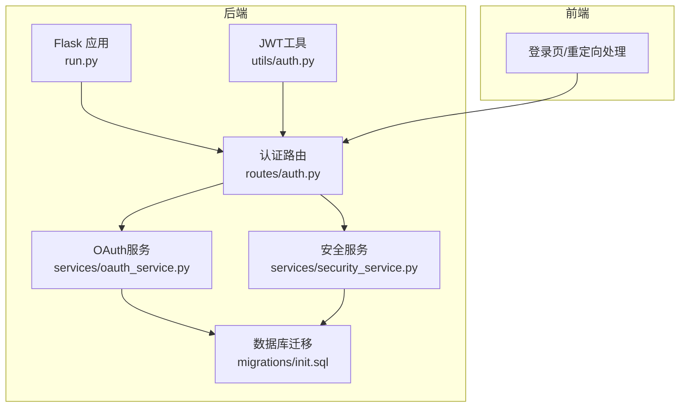
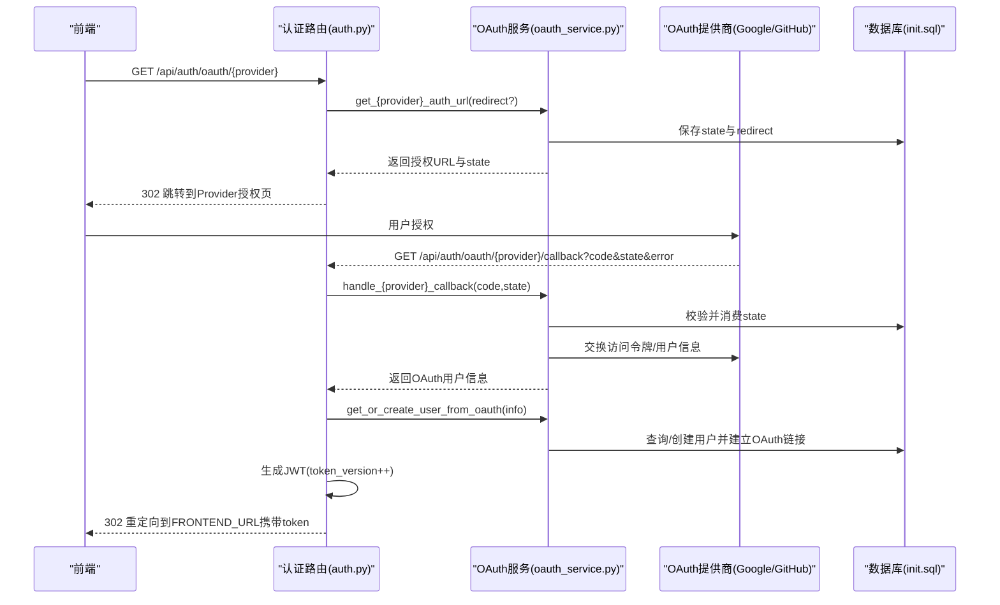
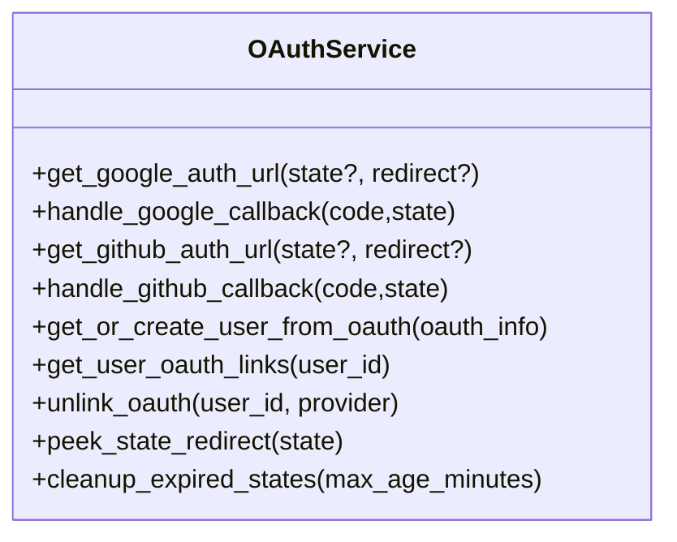
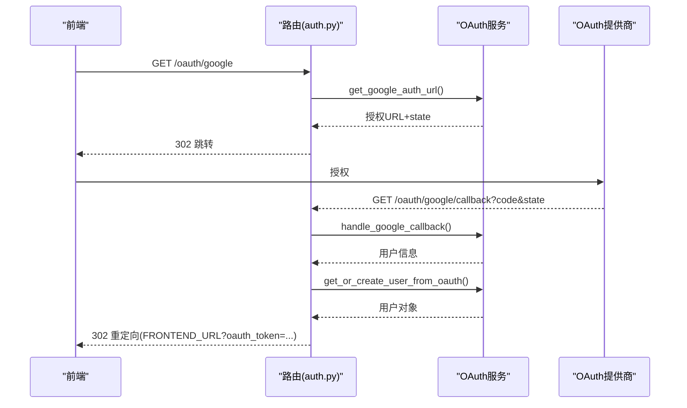
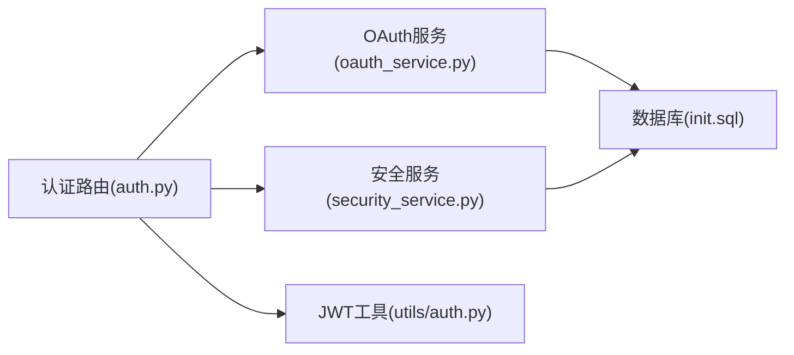

# OAuth集成

<cite>
**本文引用的文件**
- [backend_api_python/app/routers/auth.py](file://backend_api_python/app/routes/auth.py)
- [backend_api_python/app/services/oauth_service.py](file://backend_api_python/app/services/oauth_service.py)
- [backend_api_python/app/utils/auth.py](file://backend_api_python/app/utils/auth.py)
- [backend_api_python/app/services/security_service.py](file://backend_api_python/app/services/security_service.py)
- [backend_api_python/migrations/init.sql](file://backend_api_python/migrations/init.sql)
- [docs/OAUTH_CONFIG_EN.md](file://docs/OAUTH_CONFIG_EN.md)
- [docs/OAUTH_CONFIG_CN.md](file://docs/OAUTH_CONFIG_CN.md)
- [backend_api_python/env.example](file://backend_api_python/env.example)
- [backend_api_python/run.py](file://backend_api_python/run.py)
</cite>

## 目录
1. [简介](#简介)
2. [项目结构](#项目结构)
3. [核心组件](#核心组件)
4. [架构总览](#架构总览)
5. [详细组件分析](#详细组件分析)
6. [依赖关系分析](#依赖关系分析)
7. [性能考虑](#性能考虑)
8. [故障排除指南](#故障排除指南)
9. [结论](#结论)
10. [附录](#附录)

## 简介
本文件面向QuantDinger项目的OAuth集成系统，提供从第三方登录（Google、GitHub）到回调处理的完整技术文档。内容涵盖：
- OAuth授权流程与状态参数安全校验
- 客户端ID与密钥的配置与管理
- 用户信息同步与账户创建逻辑
- CSRF防护、重放攻击防范与安全配置
- 常见问题排查与调试方法

## 项目结构
QuantDinger后端采用Flask蓝图组织认证相关路由，OAuth服务封装于独立服务层，配合安全服务与数据库迁移脚本实现状态持久化与用户数据管理。

图示来源
- [backend_api_python/run.py:100-134](file://backend_api_python/run.py#L100-L134)
- [backend_api_python/app/routes/auth.py:914-1099](file://backend_api_python/app/routes/auth.py#L914-L1099)
- [backend_api_python/app/services/oauth_service.py:27-715](file://backend_api_python/app/services/oauth_service.py#L27-L715)
- [backend_api_python/app/services/security_service.py:26-399](file://backend_api_python/app/services/security_service.py#L26-L399)
- [backend_api_python/migrations/init.sql:104-111](file://backend_api_python/migrations/init.sql#L104-L111)

章节来源
- [backend_api_python/run.py:100-134](file://backend_api_python/run.py#L100-L134)
- [backend_api_python/app/routes/auth.py:914-1099](file://backend_api_python/app/routes/auth.py#L914-L1099)
- [backend_api_python/app/services/oauth_service.py:27-715](file://backend_api_python/app/services/oauth_service.py#L27-L715)
- [backend_api_python/app/services/security_service.py:26-399](file://backend_api_python/app/services/security_service.py#L26-L399)
- [backend_api_python/migrations/init.sql:104-111](file://backend_api_python/migrations/init.sql#L104-L111)

## 核心组件
- OAuth服务（OAuthService）
  - 负责Google与GitHub OAuth授权URL生成、回调处理、用户信息获取与账户创建/关联
  - 维护OAuth状态表（qd_oauth_states）以跨多工作进程共享状态，防重放
- 认证路由（routes/auth.py）
  - 提供/oauth/google与/oauth/github跳转入口与回调处理
  - 将OAuth结果转换为JWT令牌并重定向至前端
- 安全服务（security_service.py）
  - 提供Turnstile验证、登录速率限制、暴力破解防护与安全事件审计
- JWT工具（utils/auth.py）
  - 生成与验证JWT令牌，支持单设备登录控制（token_version）
- 数据库迁移（migrations/init.sql）
  - 定义qd_oauth_states、qd_oauth_links、qd_users等表结构

章节来源
- [backend_api_python/app/services/oauth_service.py:27-715](file://backend_api_python/app/services/oauth_service.py#L27-L715)
- [backend_api_python/app/routes/auth.py:914-1099](file://backend_api_python/app/routes/auth.py#L914-L1099)
- [backend_api_python/app/services/security_service.py:26-399](file://backend_api_python/app/services/security_service.py#L26-L399)
- [backend_api_python/app/utils/auth.py:18-80](file://backend_api_python/app/utils/auth.py#L18-L80)
- [backend_api_python/migrations/init.sql:104-111](file://backend_api_python/migrations/init.sql#L104-L111)

## 架构总览
OAuth集成采用“前端发起跳转—后端生成授权URL—OAuth提供商回调—后端换取令牌—创建/关联用户—签发JWT—前端登录”的闭环流程。状态参数state通过数据库持久化，确保跨多实例安全校验。

图示来源
- [backend_api_python/app/routes/auth.py:914-1099](file://backend_api_python/app/routes/auth.py#L914-L1099)
- [backend_api_python/app/services/oauth_service.py:200-426](file://backend_api_python/app/services/oauth_service.py#L200-L426)
- [backend_api_python/migrations/init.sql:104-111](file://backend_api_python/migrations/init.sql#L104-L111)

## 详细组件分析

### OAuth服务（OAuthService）
- 状态管理
  - 使用qd_oauth_states表保存state、提供商与redirect目标，带过期时间
  - 提供state保存、窥视与消费接口，消费时删除并校验provider与过期时间
- 授权URL生成
  - Google：构造accounts.google.com授权URL，scope包含openid email profile
  - GitHub：构造github.com/login/oauth/authorize URL，scope包含user:email read:user
- 回调处理
  - Google：交换token并调用oauth2/v2/userinfo获取用户信息
  - GitHub：交换access_token并调用api.github.com/user；若用户邮箱为空则查询/emails获取主邮箱
- 用户同步
  - 若存在OAuth链接：更新令牌并返回用户
  - 若存在相同邮箱用户：建立OAuth链接并更新令牌
  - 否则：创建新用户（用户名去重、邮箱去重、随机密码哈希、头像与昵称映射）
- OAuth解绑
  - 支持按提供商解绑，若用户仅有OAuth一种认证方式则拒绝

图示来源
- [backend_api_python/app/services/oauth_service.py:27-715](file://backend_api_python/app/services/oauth_service.py#L27-L715)

章节来源
- [backend_api_python/app/services/oauth_service.py:27-715](file://backend_api_python/app/services/oauth_service.py#L27-L715)
- [backend_api_python/migrations/init.sql:104-111](file://backend_api_python/migrations/init.sql#L104-L111)

### 认证路由（routes/auth.py）
- 入口与回调
  - /oauth/google：生成授权URL并跳转
  - /oauth/google/callback：处理回调、校验state、换取令牌、创建/关联用户、签发JWT并重定向
  - /oauth/github：生成授权URL并跳转
  - /oauth/github/callback：处理回调、校验state、换取令牌、创建/关联用户、签发JWT并重定向
- 安全重定向
  - 优先使用state中记录的redirect，否则回退到FRONTEND_URL
  - 错误参数或异常时同样回退到前端并携带错误码

图示来源
- [backend_api_python/app/routes/auth.py:914-1099](file://backend_api_python/app/routes/auth.py#L914-L1099)
- [backend_api_python/app/services/oauth_service.py:200-426](file://backend_api_python/app/services/oauth_service.py#L200-L426)

章节来源
- [backend_api_python/app/routes/auth.py:914-1099](file://backend_api_python/app/routes/auth.py#L914-L1099)

### 安全服务（security_service.py）
- Turnstile验证
  - 调用Cloudflare Turnstile站点验证接口，失败时拒绝请求
- 登录速率限制与暴力破解防护
  - 记录登录尝试，基于IP与账户维度统计失败次数与窗口
  - 超限时阻断并提示剩余时间
- 安全审计日志
  - 记录登录、注册、重置密码、OAuth登录等事件，便于审计
- 验证码速率限制
  - 控制同一邮箱与IP的发送频率，防止滥用

章节来源
- [backend_api_python/app/services/security_service.py:26-399](file://backend_api_python/app/services/security_service.py#L26-L399)

### JWT与单设备登录（utils/auth.py）
- JWT生成
  - 包含用户ID、用户名、角色与token_version，有效期7天
- JWT验证
  - 校验签名与过期时间，同时验证token_version与数据库一致
- 单设备登录
  - 通过递增用户token_version实现踢出旧会话，确保单一客户端登录

章节来源
- [backend_api_python/app/utils/auth.py:18-80](file://backend_api_python/app/utils/auth.py#L18-L80)

### 数据库模式（migrations/init.sql）
- qd_oauth_states
  - 存储state、提供商、redirect与过期时间，支持跨实例状态共享
- qd_oauth_links
  - 存储用户与第三方提供商的关联、令牌与头像等信息
- qd_users
  - 用户基本信息与token_version字段用于单设备登录

章节来源
- [backend_api_python/migrations/init.sql:104-111](file://backend_api_python/migrations/init.sql#L104-L111)
- [backend_api_python/migrations/init.sql:155-168](file://backend_api_python/migrations/init.sql#L155-L168)
- [backend_api_python/migrations/init.sql:8-31](file://backend_api_python/migrations/init.sql#L8-L31)

## 依赖关系分析
- 路由依赖OAuth服务与安全服务，负责业务编排与错误处理
- OAuth服务依赖数据库连接与HTTP客户端，负责与OAuth提供商交互
- 安全服务依赖数据库与外部Turnstile API，负责风控与审计
- JWT工具被路由与OAuth服务共同使用，保证令牌一致性

图示来源
- [backend_api_python/app/routes/auth.py:914-1099](file://backend_api_python/app/routes/auth.py#L914-L1099)
- [backend_api_python/app/services/oauth_service.py:27-715](file://backend_api_python/app/services/oauth_service.py#L27-L715)
- [backend_api_python/app/services/security_service.py:26-399](file://backend_api_python/app/services/security_service.py#L26-L399)
- [backend_api_python/app/utils/auth.py:18-80](file://backend_api_python/app/utils/auth.py#L18-L80)
- [backend_api_python/migrations/init.sql:104-111](file://backend_api_python/migrations/init.sql#L104-L111)

章节来源
- [backend_api_python/app/routes/auth.py:914-1099](file://backend_api_python/app/routes/auth.py#L914-L1099)
- [backend_api_python/app/services/oauth_service.py:27-715](file://backend_api_python/app/services/oauth_service.py#L27-L715)
- [backend_api_python/app/services/security_service.py:26-399](file://backend_api_python/app/services/security_service.py#L26-L399)
- [backend_api_python/app/utils/auth.py:18-80](file://backend_api_python/app/utils/auth.py#L18-L80)
- [backend_api_python/migrations/init.sql:104-111](file://backend_api_python/migrations/init.sql#L104-L111)

## 性能考虑
- 状态持久化
  - 使用PostgreSQL存储state，避免多实例间状态丢失，降低无效回调处理成本
- 并发与连接池
  - 合理配置数据库连接池与Gunicorn线程数，避免高并发下的连接争用
- 超时与重试
  - OAuth提供商请求设置合理超时，失败时快速降级并返回友好错误
- 缓存与索引
  - qd_oauth_states与qd_oauth_links具备必要索引，提升查询效率

## 故障排除指南
- 常见错误与定位
  - redirect_uri_mismatch：检查.env中GOOGLE_REDIRECT_URI/GITHUB_REDIRECT_URI与OAuth提供商后台配置一致
  - Invalid state parameter：确认state在qd_oauth_states中存在且未过期
  - OAuth服务不可用：检查网络连通性与提供商API可用性
  - Turnstile验证失败：确认TURNSTILE_SITE_KEY/TURNSTILE_SECRET_KEY正确且域名已加入白名单
- 调试步骤
  - 查看后端日志与安全审计日志（qd_security_logs）
  - 使用.env示例文件核对关键配置项
  - 在本地开发环境使用.env覆盖默认值进行验证

章节来源
- [docs/OAUTH_CONFIG_EN.md:185-228](file://docs/OAUTH_CONFIG_EN.md#L185-L228)
- [docs/OAUTH_CONFIG_CN.md:185-228](file://docs/OAUTH_CONFIG_CN.md#L185-L228)
- [backend_api_python/env.example:172-178](file://backend_api_python/env.example#L172-L178)

## 结论
QuantDinger的OAuth集成通过严谨的状态管理、严格的CSRF与重放防护、完善的用户同步与账户创建逻辑，实现了安全可靠的第三方登录体验。结合Turnstile与速率限制等安全措施，系统在易用性与安全性之间取得良好平衡。建议在生产环境中严格管理客户端ID与密钥，定期轮换并监控安全日志。

## 附录

### OAuth提供商配置要点
- Google
  - 在Google Cloud Console创建OAuth客户端，配置授权回调URI为后端API的Google回调地址
  - 在.env中设置GOOGLE_CLIENT_ID、GOOGLE_CLIENT_SECRET与GOOGLE_REDIRECT_URI
- GitHub
  - 在GitHub开发者设置创建OAuth App，配置回调URL为后端API的GitHub回调地址
  - 在.env中设置GITHUB_CLIENT_ID、GITHUB_CLIENT_SECRET与GITHUB_REDIRECT_URI
- 前端重定向
  - FRONTEND_URL为OAuth成功后的默认重定向地址；可通过redirect参数传入自定义目标（需在允许列表）

章节来源
- [docs/OAUTH_CONFIG_EN.md:15-88](file://docs/OAUTH_CONFIG_EN.md#L15-L88)
- [docs/OAUTH_CONFIG_CN.md:15-88](file://docs/OAUTH_CONFIG_CN.md#L15-L88)
- [backend_api_python/env.example:22-30](file://backend_api_python/env.example#L22-L30)
- [backend_api_python/env.example:172-178](file://backend_api_python/env.example#L172-L178)

### 状态参数与CSRF防护
- state生成与持久化
  - 服务端生成随机state并保存至qd_oauth_states，回调时消费并校验
- 重放攻击防范
  - state带过期时间，过期即失效；消费后删除，避免二次使用
- 前端重定向白名单
  - 仅允许在允许列表内的URL作为回调目标，防止开放重定向

章节来源
- [backend_api_python/app/services/oauth_service.py:42-144](file://backend_api_python/app/services/oauth_service.py#L42-L144)
- [backend_api_python/app/services/oauth_service.py:185-191](file://backend_api_python/app/services/oauth_service.py#L185-L191)
- [backend_api_python/app/routes/auth.py:958-961](file://backend_api_python/app/routes/auth.py#L958-L961)

### 用户信息同步与账户创建
- 映射规则
  - 邮箱：优先使用OAuth提供的邮箱，若为空则从GitHub邮箱列表中查找已验证主邮箱
  - 昵称：优先使用OAuth提供的name，否则使用login或邮箱用户名
  - 头像：使用OAuth提供的头像URL
- 账户创建
  - 用户名去重、邮箱去重；为OAuth用户生成随机密码哈希（无需用户输入）
  - 自动标记邮箱已验证，授予初始积分奖励（可配置）

章节来源
- [backend_api_python/app/services/oauth_service.py:432-641](file://backend_api_python/app/services/oauth_service.py#L432-L641)

### 安全配置与最佳实践
- SECRET_KEY
  - 生产环境禁止使用默认值，run.py会在DEBUG=False时自动生成随机密钥并提示持久化
- 单设备登录
  - 通过递增token_version实现踢出旧会话，确保单一客户端登录
- 速率限制与暴力破解
  - 基于IP与账户维度的失败次数统计与阻断策略
- Turnstile
  - 建议开启以抵御自动化攻击

章节来源
- [backend_api_python/run.py:114-120](file://backend_api_python/run.py#L114-L120)
- [backend_api_python/app/utils/auth.py:82-113](file://backend_api_python/app/utils/auth.py#L82-L113)
- [backend_api_python/app/services/security_service.py:146-219](file://backend_api_python/app/services/security_service.py#L146-L219)
- [backend_api_python/env.example:169-170](file://backend_api_python/env.example#L169-L170)