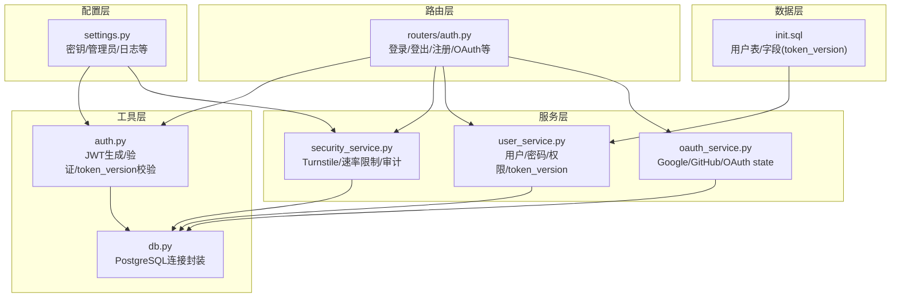
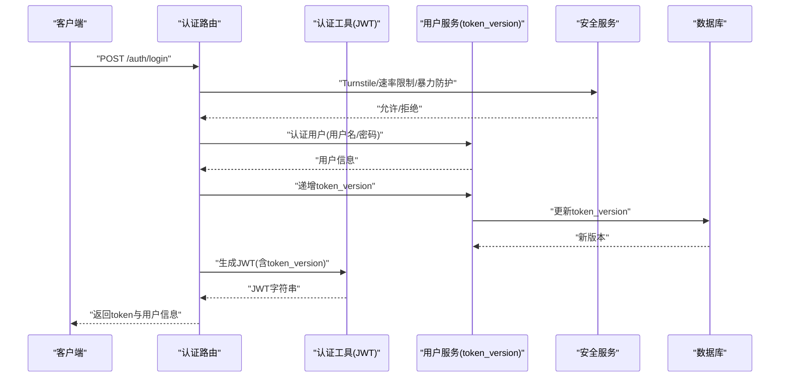
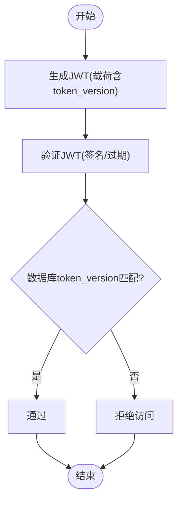
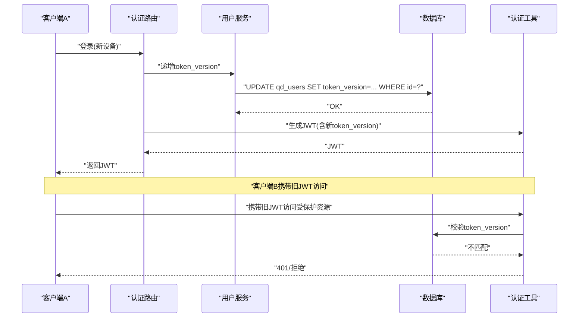
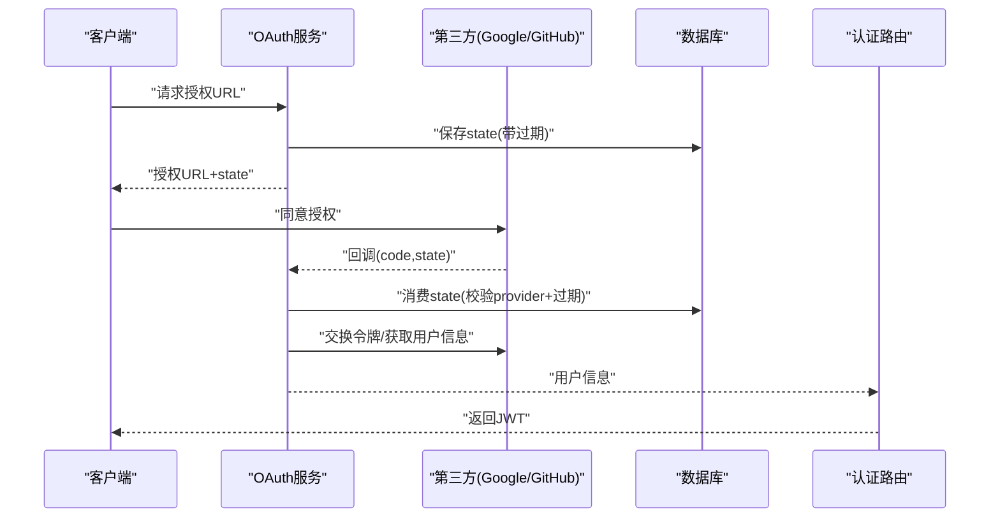
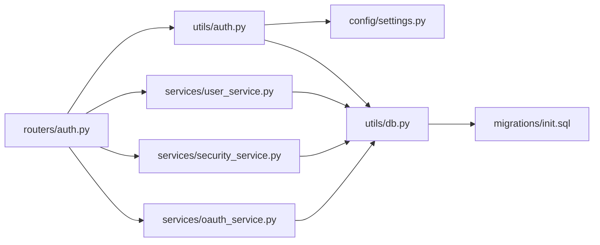

# 会话与令牌管理

<cite>
**本文档引用的文件**
- [auth.py](file://backend_api_python/app/utils/auth.py)
- [auth.py](file://backend_api_python/app/routers/auth.py)
- [security_service.py](file://backend_api_python/app/services/security_service.py)
- [user_service.py](file://backend_api_python/app/services/user_service.py)
- [settings.py](file://backend_api_python/app/config/settings.py)
- [init.sql](file://backend_api_python/migrations/init.sql)
- [oauth_service.py](file://backend_api_python/app/services/oauth_service.py)
- [db.py](file://backend_api_python/app/utils/db.py)
</cite>

## 目录
1. [简介](#简介)
2. [项目结构](#项目结构)
3. [核心组件](#核心组件)
4. [架构总览](#架构总览)
5. [详细组件分析](#详细组件分析)
6. [依赖关系分析](#依赖关系分析)
7. [性能考虑](#性能考虑)
8. [故障排查指南](#故障排查指南)
9. [结论](#结论)
10. [附录](#附录)

## 简介
本文件面向会话与令牌管理系统，系统采用基于 HS256 的 JWT 作为认证载体，并结合数据库中的 token_version 字段实现“单一设备登录”与强制下线能力。登录成功后，服务端会递增用户 token_version，旧令牌因版本校验失败而失效；同时配合安全服务实现登录速率限制、暴力破解防护与安全事件审计。OAuth 登录流程支持 Google/GitHub，使用数据库保存 OAuth state 以跨多工作进程/实例保证 CSRF 校验有效。

## 项目结构
围绕会话与令牌管理的关键模块如下：
- 工具层
  - 认证工具：生成、验证 JWT 并进行 token_version 校验
  - 数据库连接：统一 PostgreSQL 连接封装
- 路由层
  - 认证路由：登录、登出、注册、验证码发送、OAuth 回调等
- 服务层
  - 安全服务：Turnstile 验证、登录速率限制、暴力破解防护、安全事件审计
  - 用户服务：密码哈希、用户查询、token_version 增长与查询
  - OAuth 服务：Google/GitHub 授权链接生成、回调处理、OAuth state 存储与校验
- 配置层
  - 应用配置：密钥、管理员账户、日志级别等
- 数据层
  - 初始化脚本：创建用户表并添加 token_version 字段

**图示来源**
- [auth.py:1-239](file://backend_api_python/app/utils/auth.py#L1-L239)
- [auth.py:1-1180](file://backend_api_python/app/routers/auth.py#L1-L1180)
- [security_service.py:1-399](file://backend_api_python/app/services/security_service.py#L1-L399)
- [user_service.py:1-701](file://backend_api_python/app/services/user_service.py#L1-L701)
- [settings.py:1-99](file://backend_api_python/app/config/settings.py#L1-L99)
- [init.sql:1-800](file://backend_api_python/migrations/init.sql#L1-L800)
- [oauth_service.py:1-715](file://backend_api_python/app/services/oauth_service.py#L1-L715)
- [db.py:1-66](file://backend_api_python/app/utils/db.py#L1-L66)

**章节来源**
- [auth.py:1-239](file://backend_api_python/app/utils/auth.py#L1-L239)
- [auth.py:1-1180](file://backend_api_python/app/routers/auth.py#L1-L1180)
- [security_service.py:1-399](file://backend_api_python/app/services/security_service.py#L1-L399)
- [user_service.py:1-701](file://backend_api_python/app/services/user_service.py#L1-L701)
- [settings.py:1-99](file://backend_api_python/app/config/settings.py#L1-L99)
- [init.sql:1-800](file://backend_api_python/migrations/init.sql#L1-L800)
- [oauth_service.py:1-715](file://backend_api_python/app/services/oauth_service.py#L1-L715)
- [db.py:1-66](file://backend_api_python/app/utils/db.py#L1-L66)

## 核心组件
- JWT 生成与验证
  - 生成：包含用户标识、角色、签发时间、过期时间与 token_version
  - 验证：解码 HS256，检查过期，再与数据库 token_version 对比
- 单一设备登录
  - 登录成功后递增 token_version，旧令牌即刻失效
- 安全防护
  - Turnstile 人机验证、登录速率限制、暴力破解阻断、安全事件审计
- OAuth 流程
  - 生成授权链接、回调交换令牌、state 校验、跨实例共享 state
- 配置与持久化
  - 密钥、管理员账户、日志级别；数据库 schema 包含 token_version 字段

**章节来源**
- [auth.py:18-80](file://backend_api_python/app/utils/auth.py#L18-L80)
- [auth.py:227-242](file://backend_api_python/app/routers/auth.py#L227-L242)
- [security_service.py:72-110](file://backend_api_python/app/services/security_service.py#L72-L110)
- [user_service.py:274-312](file://backend_api_python/app/services/user_service.py#L274-L312)
- [init.sql:27-31](file://backend_api_python/migrations/init.sql#L27-L31)
- [oauth_service.py:70-143](file://backend_api_python/app/services/oauth_service.py#L70-L143)

## 架构总览
系统采用“无状态会话 + 数据库校验”的设计：前端携带 JWT 请求后端，后端解码并校验签名与过期时间，随后通过数据库对比 token_version 实现单一设备登录控制。安全服务贯穿登录流程，提供人机验证与速率限制。

**图示来源**
- [auth.py:140-278](file://backend_api_python/app/routers/auth.py#L140-L278)
- [auth.py:18-47](file://backend_api_python/app/utils/auth.py#L18-L47)
- [user_service.py:274-312](file://backend_api_python/app/services/user_service.py#L274-L312)
- [security_service.py:200-220](file://backend_api_python/app/services/security_service.py#L200-L220)

## 详细组件分析

### JWT 生成、验证与刷新机制
- 生成
  - 载荷包含 exp、iat、sub、user_id、role、token_version
  - 使用 SECRET_KEY 与 HS256 签名
- 验证
  - 解码 HS256，捕获过期与无效异常
  - 提取 user_id 与 token_version，调用内部函数与数据库对比
- 刷新
  - 本系统未实现“刷新令牌”接口；登录成功后生成新 JWT 并递增 token_version，旧令牌因版本不匹配立即失效

**图示来源**
- [auth.py:18-80](file://backend_api_python/app/utils/auth.py#L18-L80)

**章节来源**
- [auth.py:18-80](file://backend_api_python/app/utils/auth.py#L18-L80)

### 令牌版本控制与单一设备登录
- 登录流程
  - 成功认证后调用用户服务递增 token_version
  - 生成包含新 token_version 的 JWT 返回给前端
- 旧令牌失效
  - 后续请求携带旧 token_version，验证阶段与数据库对比失败，直接拒绝
- 强制下线
  - 任何新登录都会导致旧 token_version 不匹配，从而强制下线

**图示来源**
- [auth.py:227-242](file://backend_api_python/app/routers/auth.py#L227-L242)
- [user_service.py:274-312](file://backend_api_python/app/services/user_service.py#L274-L312)
- [auth.py:82-113](file://backend_api_python/app/utils/auth.py#L82-L113)

**章节来源**
- [auth.py:227-242](file://backend_api_python/app/routers/auth.py#L227-L242)
- [user_service.py:274-312](file://backend_api_python/app/services/user_service.py#L274-L312)
- [auth.py:82-113](file://backend_api_python/app/utils/auth.py#L82-L113)

### 令牌过期策略、自动刷新与安全撤销
- 过期策略
  - JWT 设置 7 天有效期，到期后验证阶段抛出过期异常被拒绝
- 自动刷新
  - 未实现专用刷新接口；可通过重新登录换取新 JWT
- 安全撤销
  - 通过递增 token_version 实现即时撤销，无需服务端维护黑名单

**章节来源**
- [auth.py:32-44](file://backend_api_python/app/utils/auth.py#L32-L44)
- [auth.py:74-79](file://backend_api_python/app/utils/auth.py#L74-L79)

### 会话状态管理与并发控制
- 在线状态跟踪
  - 通过安全审计日志记录登录/登出/注册等事件，便于追踪用户在线状态
- 并发会话限制
  - 通过单一设备登录机制实现“同一账户仅一个有效会话”，避免并发会话冲突

**章节来源**
- [security_service.py:246-277](file://backend_api_python/app/services/security_service.py#L246-L277)
- [auth.py:227-242](file://backend_api_python/app/routers/auth.py#L227-L242)

### OAuth 登录与状态管理
- 授权链接生成
  - 生成 state 并持久化至数据库，设置过期时间
- 回调处理
  - 校验 state 与 provider，交换第三方令牌，获取用户信息
- 用户关联
  - 若存在 OAuth 链接则复用用户；否则按邮箱或名称创建新用户
- 跨实例安全
  - 使用数据库存储 state，避免多实例间 CSRF 校验失效

**图示来源**
- [oauth_service.py:200-235](file://backend_api_python/app/services/oauth_service.py#L200-L235)
- [oauth_service.py:237-297](file://backend_api_python/app/services/oauth_service.py#L237-L297)
- [oauth_service.py:303-331](file://backend_api_python/app/services/oauth_service.py#L303-L331)
- [oauth_service.py:333-426](file://backend_api_python/app/services/oauth_service.py#L333-L426)
- [oauth_service.py:70-143](file://backend_api_python/app/services/oauth_service.py#L70-L143)

**章节来源**
- [oauth_service.py:200-235](file://backend_api_python/app/services/oauth_service.py#L200-L235)
- [oauth_service.py:237-297](file://backend_api_python/app/services/oauth_service.py#L237-L297)
- [oauth_service.py:303-331](file://backend_api_python/app/services/oauth_service.py#L303-L331)
- [oauth_service.py:333-426](file://backend_api_python/app/services/oauth_service.py#L333-L426)
- [oauth_service.py:70-143](file://backend_api_python/app/services/oauth_service.py#L70-L143)

### 安全配置与防护
- Turnstile 人机验证
  - 可选启用，调用云端验证接口
- 登录速率限制与暴力破解防护
  - 基于 IP 与账户维度统计失败次数，超过阈值进入封禁窗口
- 安全事件审计
  - 记录登录/注册/重置密码等关键事件，便于审计与溯源

**章节来源**
- [security_service.py:72-110](file://backend_api_python/app/services/security_service.py#L72-L110)
- [security_service.py:200-220](file://backend_api_python/app/services/security_service.py#L200-L220)
- [security_service.py:246-277](file://backend_api_python/app/services/security_service.py#L246-L277)

### 令牌存储安全、传输加密与持久化
- 传输加密
  - 建议在生产环境使用 HTTPS，防止令牌在传输中被窃取
- 令牌存储
  - 前端应将 JWT 存放在安全的存储介质中（如 HttpOnly Cookie 或受控内存），避免 XSS 泄露
- 持久化
  - 服务端不存储 JWT，仅依赖数据库中的 token_version 实现撤销
- 密钥管理
  - SECRET_KEY 必须妥善保管，定期轮换

**章节来源**
- [settings.py:32-41](file://backend_api_python/app/config/settings.py#L32-L41)

## 依赖关系分析
- 组件耦合
  - 认证路由依赖认证工具、安全服务、用户服务与 OAuth 服务
  - 认证工具依赖配置与数据库工具
  - 用户服务与安全服务均依赖数据库工具
- 外部依赖
  - 第三方 OAuth 服务（Google/GitHub）、Cloudflare Turnstile
- 数据模型
  - 用户表包含 token_version 字段，用于单一设备登录控制

**图示来源**
- [auth.py:1-1180](file://backend_api_python/app/routers/auth.py#L1-L1180)
- [auth.py:1-239](file://backend_api_python/app/utils/auth.py#L1-L239)
- [security_service.py:1-399](file://backend_api_python/app/services/security_service.py#L1-L399)
- [user_service.py:1-701](file://backend_api_python/app/services/user_service.py#L1-L701)
- [oauth_service.py:1-715](file://backend_api_python/app/services/oauth_service.py#L1-L715)
- [settings.py:1-99](file://backend_api_python/app/config/settings.py#L1-L99)
- [db.py:1-66](file://backend_api_python/app/utils/db.py#L1-L66)
- [init.sql:1-800](file://backend_api_python/migrations/init.sql#L1-L800)

**章节来源**
- [auth.py:1-1180](file://backend_api_python/app/routers/auth.py#L1-L1180)
- [auth.py:1-239](file://backend_api_python/app/utils/auth.py#L1-L239)
- [security_service.py:1-399](file://backend_api_python/app/services/security_service.py#L1-L399)
- [user_service.py:1-701](file://backend_api_python/app/services/user_service.py#L1-L701)
- [oauth_service.py:1-715](file://backend_api_python/app/services/oauth_service.py#L1-L715)
- [settings.py:1-99](file://backend_api_python/app/config/settings.py#L1-L99)
- [db.py:1-66](file://backend_api_python/app/utils/db.py#L1-L66)
- [init.sql:1-800](file://backend_api_python/migrations/init.sql#L1-L800)

## 性能考虑
- JWT 验证开销极低，主要成本在于数据库 token_version 查询
- 建议对用户表的 token_version 字段建立索引（若未默认创建），以优化查询性能
- 登录速率限制与审计写入为必要安全措施，建议使用异步写入或批量提交降低延迟

## 故障排查指南
- 常见问题
  - 401 Token invalid or expired：检查 JWT 是否过期或签名错误
  - 401 Token missing：确认请求头 Authorization 中是否携带 Bearer 令牌
  - 403 Admin access required：确认用户角色是否具备管理员权限
  - 登录频繁被限流：检查 IP/账户维度失败次数是否超过阈值
- 排查步骤
  - 查看安全审计日志定位登录/失败事件
  - 核对数据库中用户 token_version 是否与 JWT 中一致
  - 确认 SECRET_KEY 一致性与 HTTPS 传输
- 相关实现参考
  - JWT 验证与错误处理
  - 登录速率限制与封禁逻辑
  - 安全事件审计写入

**章节来源**
- [auth.py:126-157](file://backend_api_python/app/utils/auth.py#L126-L157)
- [security_service.py:200-220](file://backend_api_python/app/services/security_service.py#L200-L220)
- [security_service.py:246-277](file://backend_api_python/app/services/security_service.py#L246-L277)

## 结论
本系统通过“JWT + 数据库 token_version”的组合实现了强约束的单一设备登录与即时撤销能力，配合 Turnstile、速率限制与审计日志构建了较为完善的安全体系。登录成功即刻递增 token_version，旧令牌立即失效，满足强制下线需求；未实现专用刷新接口，推荐通过重新登录获取新令牌。建议在生产环境中强化传输加密与令牌存储安全，并对数据库查询与审计写入进行性能优化。

## 附录
- 数据库初始化要点
  - 用户表包含 token_version 字段，用于单一设备登录控制
- 配置要点
  - SECRET_KEY 必须保密且定期轮换
  - Turnstile 开关与阈值可根据业务场景调整

**章节来源**
- [init.sql:27-31](file://backend_api_python/migrations/init.sql#L27-L31)
- [settings.py:32-41](file://backend_api_python/app/config/settings.py#L32-L41)