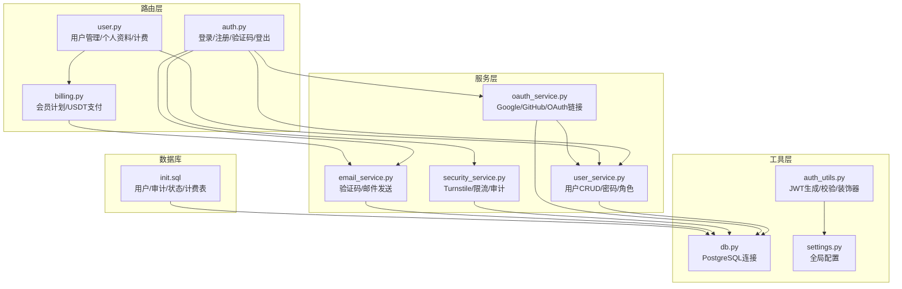
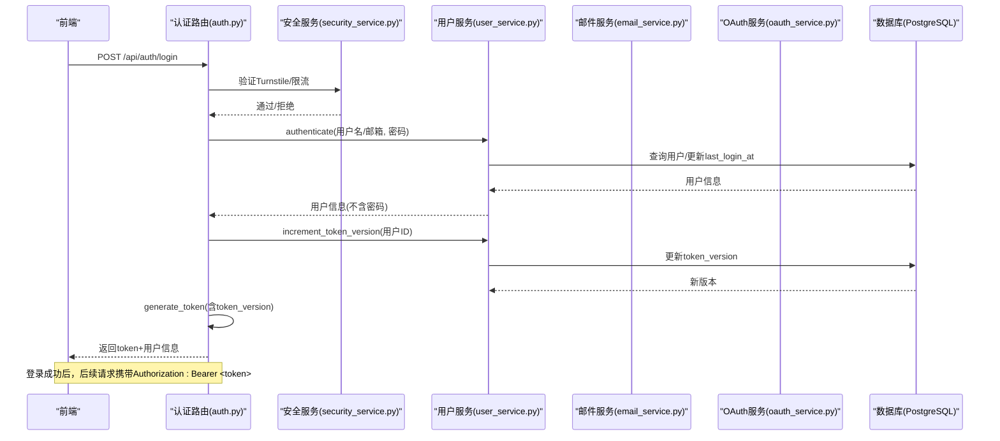
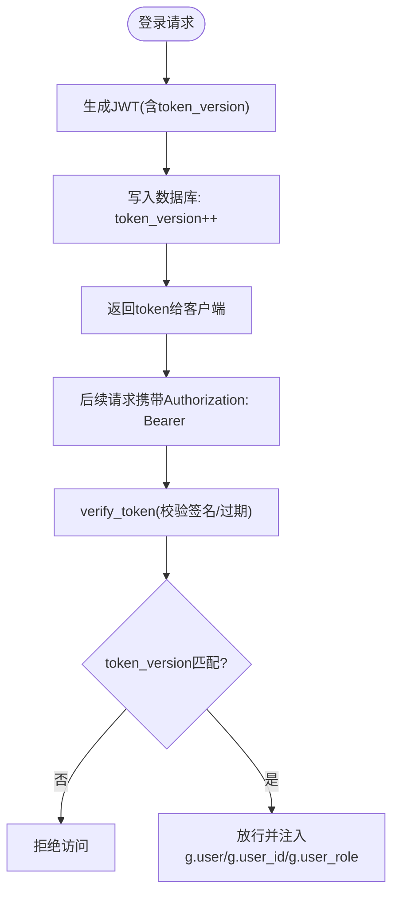
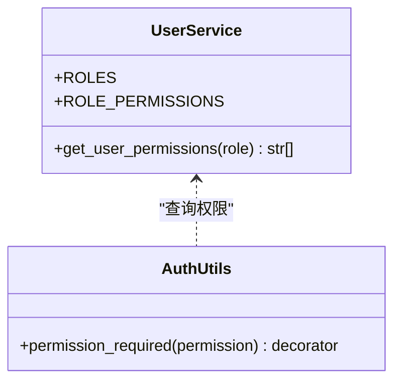
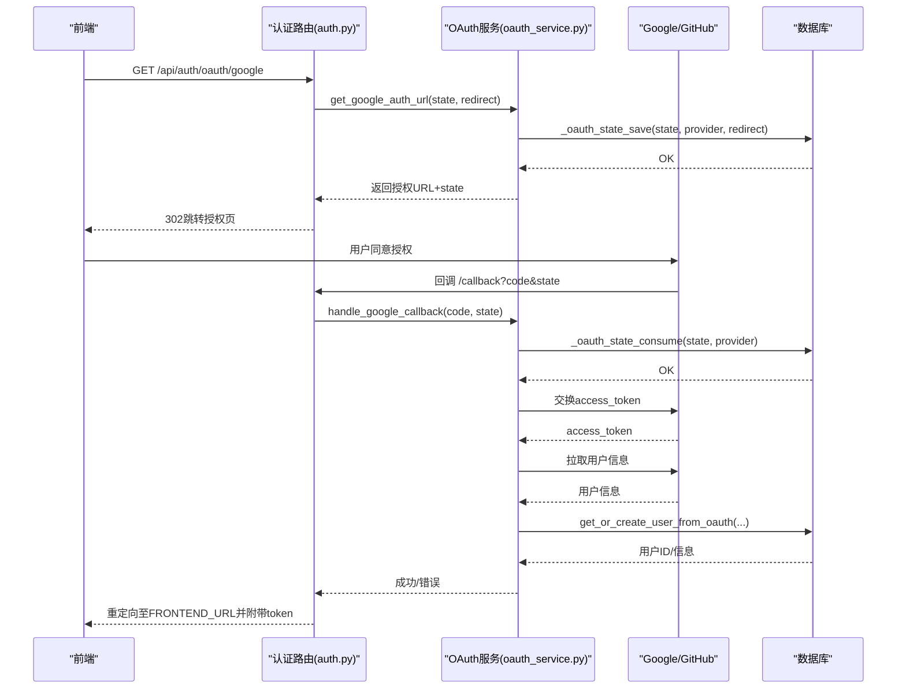
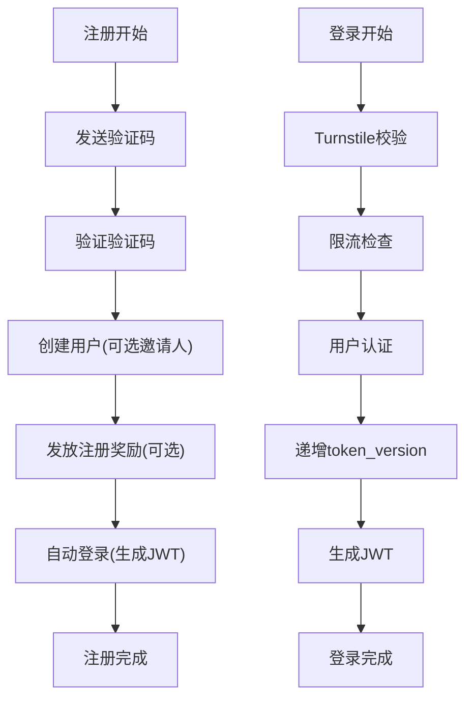
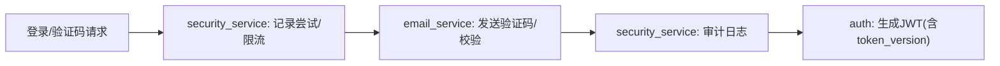
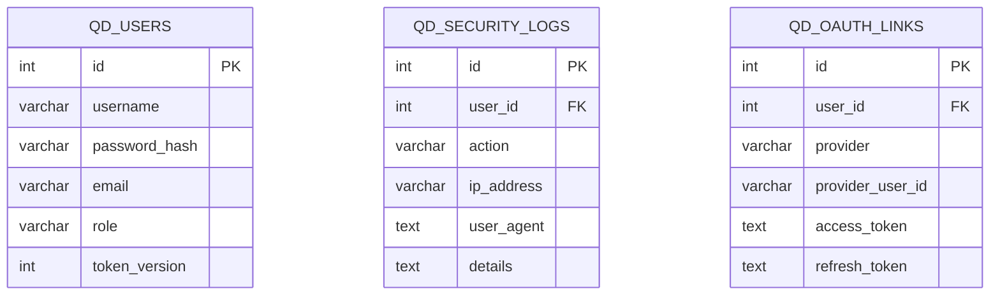
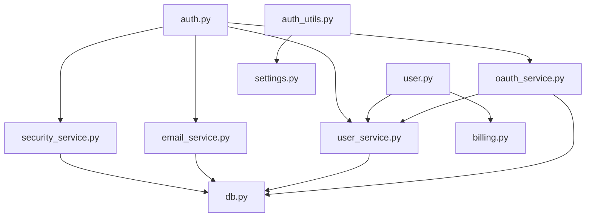

# 用户管理

<cite>
**本文引用的文件列表**
- [user.py](file://backend_api_python/app/routes/user.py)
- [auth.py](file://backend_api_python/app/routes/auth.py)
- [oauth_service.py](file://backend_api_python/app/services/oauth_service.py)
- [user_service.py](file://backend_api_python/app/services/user_service.py)
- [auth_utils.py](file://backend_api_python/app/utils/auth.py)
- [security_service.py](file://backend_api_python/app/services/security_service.py)
- [email_service.py](file://backend_api_python/app/services/email_service.py)
- [db.py](file://backend_api_python/app/utils/db.py)
- [settings.py](file://backend_api_python/app/config/settings.py)
- [init.sql](file://backend_api_python/migrations/init.sql)
- [OAUTH_CONFIG_EN.md](file://docs/OAUTH_CONFIG_EN.md)
- [billing.py](file://backend_api_python/app/routes/billing.py)
</cite>

## 目录
1. [简介](#简介)
2. [项目结构](#项目结构)
3. [核心组件](#核心组件)
4. [架构总览](#架构总览)
5. [详细组件分析](#详细组件分析)
6. [依赖关系分析](#依赖关系分析)
7. [性能考量](#性能考量)
8. [故障排查指南](#故障排查指南)
9. [结论](#结论)
10. [附录](#附录)

## 简介
本技术文档围绕用户管理系统进行深入解析，覆盖用户认证机制、JWT 令牌管理、权限控制、OAuth 第三方登录（Google、GitHub）、角色与权限模型、会话管理、安全审计与访问控制、以及用户注册、登录、密码重置等核心流程。同时提供配置项说明、参数与返回值规范、组件间集成关系及常见问题解决方案，帮助开发者与运维人员快速理解并正确部署与维护系统。

## 项目结构
用户管理相关代码主要分布在以下模块：
- 路由层：用户管理与认证路由
- 服务层：用户服务、OAuth 服务、安全服务、邮件服务
- 工具层：认证工具、数据库连接、配置
- 数据库：初始化脚本定义用户表与相关审计、状态表

**图示来源**
- [auth.py:1-1180](file://backend_api_python/app/routes/auth.py#L1-L1180)
- [user.py:1-1894](file://backend_api_python/app/routes/user.py#L1-L1894)
- [oauth_service.py:1-715](file://backend_api_python/app/services/oauth_service.py#L1-L715)
- [user_service.py:1-701](file://backend_api_python/app/services/user_service.py#L1-L701)
- [security_service.py:1-399](file://backend_api_python/app/services/security_service.py#L1-L399)
- [email_service.py:1-362](file://backend_api_python/app/services/email_service.py#L1-L362)
- [auth_utils.py:1-239](file://backend_api_python/app/utils/auth.py#L1-L239)
- [db.py:1-66](file://backend_api_python/app/utils/db.py#L1-L66)
- [settings.py:1-99](file://backend_api_python/app/config/settings.py#L1-L99)
- [init.sql:1-200](file://backend_api_python/migrations/init.sql#L1-L200)

**章节来源**
- [auth.py:1-1180](file://backend_api_python/app/routes/auth.py#L1-L1180)
- [user.py:1-1894](file://backend_api_python/app/routes/user.py#L1-L1894)
- [oauth_service.py:1-715](file://backend_api_python/app/services/oauth_service.py#L1-L715)
- [user_service.py:1-701](file://backend_api_python/app/services/user_service.py#L1-L701)
- [security_service.py:1-399](file://backend_api_python/app/services/security_service.py#L1-L399)
- [email_service.py:1-362](file://backend_api_python/app/services/email_service.py#L1-L362)
- [auth_utils.py:1-239](file://backend_api_python/app/utils/auth.py#L1-L239)
- [db.py:1-66](file://backend_api_python/app/utils/db.py#L1-L66)
- [settings.py:1-99](file://backend_api_python/app/config/settings.py#L1-L99)
- [init.sql:1-200](file://backend_api_python/migrations/init.sql#L1-L200)

## 核心组件
- 用户服务：负责用户 CRUD、密码哈希/校验、角色权限映射、令牌版本管理、默认资源种子等。
- OAuth 服务：统一处理 Google/GitHub 授权、CSRF 状态持久化、OAuth 用户关联与创建、令牌更新与解绑。
- 安全服务：Turnstile 验证、登录尝试记录与限流、验证码速率限制、安全事件审计。
- 邮件服务：验证码生成/存储/校验、邮件发送（SMTP），支持多种验证码类型。
- 认证工具：JWT 生成/校验、装饰器（登录/管理员/权限/经理）。
- 数据库工具：PostgreSQL 连接封装与初始化检查。
- 配置：全局配置加载（密钥、端口、功能开关等）。

**章节来源**
- [user_service.py:1-701](file://backend_api_python/app/services/user_service.py#L1-L701)
- [oauth_service.py:1-715](file://backend_api_python/app/services/oauth_service.py#L1-L715)
- [security_service.py:1-399](file://backend_api_python/app/services/security_service.py#L1-L399)
- [email_service.py:1-362](file://backend_api_python/app/services/email_service.py#L1-L362)
- [auth_utils.py:1-239](file://backend_api_python/app/utils/auth.py#L1-L239)
- [db.py:1-66](file://backend_api_python/app/utils/db.py#L1-L66)
- [settings.py:1-99](file://backend_api_python/app/config/settings.py#L1-L99)

## 架构总览
用户管理采用“路由-服务-工具-数据库”的分层架构，配合数据库迁移脚本完成表结构初始化。认证采用 JWT，结合令牌版本实现“单一客户端登录”；OAuth 使用第三方授权码流程，并将用户信息与本地账户关联；安全服务贯穿登录、验证码、审计全流程。

**图示来源**
- [auth.py:140-279](file://backend_api_python/app/routes/auth.py#L140-L279)
- [security_service.py:72-110](file://backend_api_python/app/services/security_service.py#L72-L110)
- [user_service.py:194-247](file://backend_api_python/app/services/user_service.py#L194-L247)
- [auth_utils.py:18-48](file://backend_api_python/app/utils/auth.py#L18-L48)

**章节来源**
- [auth.py:140-279](file://backend_api_python/app/routes/auth.py#L140-L279)
- [security_service.py:72-110](file://backend_api_python/app/services/security_service.py#L72-L110)
- [user_service.py:194-247](file://backend_api_python/app/services/user_service.py#L194-L247)
- [auth_utils.py:18-48](file://backend_api_python/app/utils/auth.py#L18-L48)

## 详细组件分析

### 用户认证与JWT令牌管理
- JWT 生成：包含用户ID、用户名、角色、token_version，有效期7天。
- JWT 校验：解码后验证签名与过期；额外校验 token_version 与数据库一致，确保单一客户端登录。
- 装饰器：@login_required、@admin_required、@manager_required、@permission_required 提供统一鉴权入口。
- 令牌版本：每次登录成功后递增 token_version，旧令牌立即失效，实现“踢出其他设备”。

**图示来源**
- [auth_utils.py:18-114](file://backend_api_python/app/utils/auth.py#L18-L114)
- [user_service.py:248-313](file://backend_api_python/app/services/user_service.py#L248-L313)
- [auth.py:227-242](file://backend_api_python/app/routes/auth.py#L227-L242)

**章节来源**
- [auth_utils.py:18-114](file://backend_api_python/app/utils/auth.py#L18-L114)
- [user_service.py:248-313](file://backend_api_python/app/services/user_service.py#L248-L313)
- [auth.py:227-242](file://backend_api_python/app/routes/auth.py#L227-L242)

### 权限控制系统与角色模型
- 角色层级：viewer → user → manager → admin，权限逐级叠加。
- 权限映射：不同角色具备不同的功能权限集合。
- 装饰器：@permission_required 在运行时动态查询角色权限，拒绝无权限访问。

**图示来源**
- [user_service.py:59-68](file://backend_api_python/app/services/user_service.py#L59-L68)
- [auth_utils.py:188-217](file://backend_api_python/app/utils/auth.py#L188-L217)

**章节来源**
- [user_service.py:59-68](file://backend_api_python/app/services/user_service.py#L59-L68)
- [auth_utils.py:188-217](file://backend_api_python/app/utils/auth.py#L188-L217)

### OAuth 集成（Google/GitHub）
- 授权流程：生成 state 并持久化到 qd_oauth_states，构建授权 URL，回调交换 access_token，拉取用户信息。
- 用户关联：优先根据 provider_user_id 查找本地用户；若不存在则按邮箱查找；否则自动创建新用户并建立 qd_oauth_links。
- 状态管理：跨多进程/多实例共享的 state 表，防止 CSRF 与无效 state。
- 允许重定向域：白名单校验，确保回调安全。

**图示来源**
- [oauth_service.py:200-298](file://backend_api_python/app/services/oauth_service.py#L200-L298)
- [oauth_service.py:303-426](file://backend_api_python/app/services/oauth_service.py#L303-L426)
- [oauth_service.py:432-641](file://backend_api_python/app/services/oauth_service.py#L432-L641)
- [auth.py:18-89](file://backend_api_python/app/routes/auth.py#L18-L89)

**章节来源**
- [oauth_service.py:200-298](file://backend_api_python/app/services/oauth_service.py#L200-L298)
- [oauth_service.py:303-426](file://backend_api_python/app/services/oauth_service.py#L303-L426)
- [oauth_service.py:432-641](file://backend_api_python/app/services/oauth_service.py#L432-L641)
- [auth.py:18-89](file://backend_api_python/app/routes/auth.py#L18-L89)
- [OAUTH_CONFIG_EN.md:1-228](file://docs/OAUTH_CONFIG_EN.md#L1-L228)

### 用户注册、登录与密码重置
- 注册：发送验证码 → 验证码校验 → 创建用户（可选邀请人）→ 自动登录（生成带 token_version 的 JWT）。
- 登录：Turnstile 校验 → 限流检查 → 用户认证 → 递增 token_version → 生成 JWT。
- 邮箱验证码：支持注册、登录、重置密码、修改密码、修改邮箱等类型。
- 代码登录：无需密码，通过邮箱验证码快速登录/注册。

**图示来源**
- [auth.py:491-771](file://backend_api_python/app/routes/auth.py#L491-L771)
- [auth.py:140-279](file://backend_api_python/app/routes/auth.py#L140-L279)
- [email_service.py:277-351](file://backend_api_python/app/services/email_service.py#L277-L351)

**章节来源**
- [auth.py:491-771](file://backend_api_python/app/routes/auth.py#L491-L771)
- [auth.py:140-279](file://backend_api_python/app/routes/auth.py#L140-L279)
- [email_service.py:277-351](file://backend_api_python/app/services/email_service.py#L277-L351)

### 会话管理、安全审计与访问控制
- 会话：基于 JWT 的无状态会话；通过 token_version 实现单一客户端登录。
- 审计：登录尝试、验证码发送、注册/登录/重置密码等事件写入 qd_security_logs。
- 限流：IP/账号维度失败次数统计与封禁；验证码发送频率限制。
- Turnstile：可选的人机验证，提升安全性。

**图示来源**
- [security_service.py:115-241](file://backend_api_python/app/services/security_service.py#L115-L241)
- [email_service.py:277-351](file://backend_api_python/app/services/email_service.py#L277-L351)
- [auth.py:140-279](file://backend_api_python/app/routes/auth.py#L140-L279)

**章节来源**
- [security_service.py:115-241](file://backend_api_python/app/services/security_service.py#L115-L241)
- [email_service.py:277-351](file://backend_api_python/app/services/email_service.py#L277-L351)
- [auth.py:140-279](file://backend_api_python/app/routes/auth.py#L140-L279)

### 用户角色与权限模型
- 角色：viewer、user、manager、admin。
- 权限：各角色具备不同功能权限集合，可通过装饰器动态校验。
- 管理员操作：用户列表导出、批量修改、计费操作等。

**图示来源**
- [init.sql:8-31](file://backend_api_python/migrations/init.sql#L8-L31)
- [init.sql:177-189](file://backend_api_python/migrations/init.sql#L177-L189)
- [init.sql:155-171](file://backend_api_python/migrations/init.sql#L155-L171)

**章节来源**
- [init.sql:8-31](file://backend_api_python/migrations/init.sql#L8-L31)
- [init.sql:177-189](file://backend_api_python/migrations/init.sql#L177-L189)
- [init.sql:155-171](file://backend_api_python/migrations/init.sql#L155-L171)

### 多租户架构说明
- 当前用户表未体现显式租户字段；系统通过用户ID与业务表外键关联实现逻辑隔离。
- 若需扩展多租户，可在用户表新增 tenant_id 字段并在路由/服务层增加租户上下文过滤。

[本节为概念性说明，不直接分析具体源码文件]

## 依赖关系分析
- 路由依赖服务：认证路由依赖用户、安全、邮件、OAuth 服务；用户管理路由依赖用户服务与计费服务。
- 服务依赖工具：用户/安全/邮件服务依赖数据库连接；OAuth 服务依赖用户服务与计费服务。
- 装饰器依赖配置：JWT 密钥来自配置；权限校验依赖用户服务。

**图示来源**
- [auth.py:1-1180](file://backend_api_python/app/routes/auth.py#L1-L1180)
- [user.py:1-1894](file://backend_api_python/app/routes/user.py#L1-L1894)
- [oauth_service.py:1-715](file://backend_api_python/app/services/oauth_service.py#L1-L715)
- [user_service.py:1-701](file://backend_api_python/app/services/user_service.py#L1-L701)
- [security_service.py:1-399](file://backend_api_python/app/services/security_service.py#L1-L399)
- [email_service.py:1-362](file://backend_api_python/app/services/email_service.py#L1-L362)
- [auth_utils.py:1-239](file://backend_api_python/app/utils/auth.py#L1-L239)
- [settings.py:1-99](file://backend_api_python/app/config/settings.py#L1-L99)
- [db.py:1-66](file://backend_api_python/app/utils/db.py#L1-L66)

**章节来源**
- [auth.py:1-1180](file://backend_api_python/app/routes/auth.py#L1-L1180)
- [user.py:1-1894](file://backend_api_python/app/routes/user.py#L1-L1894)
- [oauth_service.py:1-715](file://backend_api_python/app/services/oauth_service.py#L1-L715)
- [user_service.py:1-701](file://backend_api_python/app/services/user_service.py#L1-L701)
- [security_service.py:1-399](file://backend_api_python/app/services/security_service.py#L1-L399)
- [email_service.py:1-362](file://backend_api_python/app/services/email_service.py#L1-L362)
- [auth_utils.py:1-239](file://backend_api_python/app/utils/auth.py#L1-L239)
- [settings.py:1-99](file://backend_api_python/app/config/settings.py#L1-L99)
- [db.py:1-66](file://backend_api_python/app/utils/db.py#L1-L66)

## 性能考量
- 密码哈希：优先使用 bcrypt，降级时采用 sha256+盐，确保安全性与兼容性。
- 数据库索引：用户表、审计表、状态表均建立必要索引，降低查询成本。
- 令牌版本：通过单次更新实现即时失效，避免复杂缓存一致性问题。
- 限流策略：IP/账号维度失败次数与封禁窗口，验证码发送频率限制，有效缓解暴力破解与滥用。

[本节提供通用指导，不直接分析具体源码文件]

## 故障排查指南
- OAuth 回调失败（redirect_uri_mismatch）：核对 GOOGLE_REDIRECT_URI/GITHUB_REDIRECT_URI 与提供商配置一致。
- Turnstile 验证失败：检查 TURNSTILE_SITE_KEY/TURNSTILE_SECRET_KEY 与域名白名单。
- 验证码无法接收：检查 SMTP 配置（SMTP_HOST/PORT/USER/PASSWORD/FROM）。
- 登录被限流：查看 SECURITY_IP_MAX_ATTEMPTS/ACCOUNT_MAX_ATTEMPTS 与封禁时间。
- 单一客户端登录冲突：确认客户端使用最新 token，旧 token 将因 token_version 不匹配被拒绝。

**章节来源**
- [OAUTH_CONFIG_EN.md:185-221](file://docs/OAUTH_CONFIG_EN.md#L185-L221)
- [security_service.py:72-110](file://backend_api_python/app/services/security_service.py#L72-L110)
- [email_service.py:35-54](file://backend_api_python/app/services/email_service.py#L35-L54)
- [auth_utils.py:82-114](file://backend_api_python/app/utils/auth.py#L82-L114)

## 结论
该用户管理系统以 JWT 为核心，结合令牌版本实现单一客户端登录；通过 Turnstile、限流与审计强化安全；OAuth 与验证码流程完备，支持多场景登录与注册；角色权限模型清晰，便于扩展。整体架构层次分明、职责明确，适合在生产环境中稳定运行。

[本节为总结性内容，不直接分析具体源码文件]

## 附录

### 配置项与参数说明
- 认证与安全
  - SECRET_KEY：JWT 密钥
  - ADMIN_USER/ADMIN_PASSWORD：单用户模式管理员凭据
  - SINGLE_USER_MODE：启用单用户模式
- OAuth
  - GOOGLE_CLIENT_ID/GOOGLE_CLIENT_SECRET/GOOGLE_REDIRECT_URI
  - GITHUB_CLIENT_ID/GITHUB_CLIENT_SECRET/GITHUB_REDIRECT_URI
  - FRONTEND_URL：OAuth 成功后的重定向地址
  - OAUTH_ALLOWED_REDIRECTS：允许的重定向域名白名单
  - OAUTH_STATE_TTL_MINUTES：OAuth state 过期时间
- 验证码与邮件
  - VERIFICATION_CODE_EXPIRE_MINUTES：验证码过期分钟数
  - VERIFICATION_CODE_RATE_LIMIT：同一邮箱发送验证码间隔秒数
  - VERIFICATION_CODE_IP_HOURLY_LIMIT：同一IP每小时验证码上限
  - SMTP_*：SMTP 邮件配置
- 安全与限流
  - TURNSTILE_SITE_KEY/TURNSTILE_SECRET_KEY：Turnstile 配置
  - SECURITY_IP_MAX_ATTEMPTS/SECURITY_IP_WINDOW_MINUTES/SECURITY_IP_BLOCK_MINUTES
  - SECURITY_ACCOUNT_MAX_ATTEMPTS/SECURITY_ACCOUNT_WINDOW_MINUTES/SECURITY_ACCOUNT_BLOCK_MINUTES
- 功能开关
  - ENABLE_REGISTRATION：是否允许注册
  - ENABLE_CACHE/ENABLE_REQUEST_LOG：功能开关

**章节来源**
- [settings.py:30-90](file://backend_api_python/app/config/settings.py#L30-L90)
- [OAUTH_CONFIG_EN.md:49-178](file://docs/OAUTH_CONFIG_EN.md#L49-L178)
- [security_service.py:32-51](file://backend_api_python/app/services/security_service.py#L32-L51)
- [email_service.py:35-54](file://backend_api_python/app/services/email_service.py#L35-L54)

### 返回值与错误码约定
- 统一响应结构：{ code, msg, data }，其中 code 为 1 表示成功，非 1 表示失败。
- 常见错误码：
  - 400：参数错误/验证码错误/限流
  - 401：缺少/无效/过期 token
  - 403：权限不足/账户禁用/未激活
  - 429：请求过于频繁
  - 500：服务器内部错误

**章节来源**
- [auth.py:140-279](file://backend_api_python/app/routes/auth.py#L140-L279)
- [user.py:42-68](file://backend_api_python/app/routes/user.py#L42-L68)