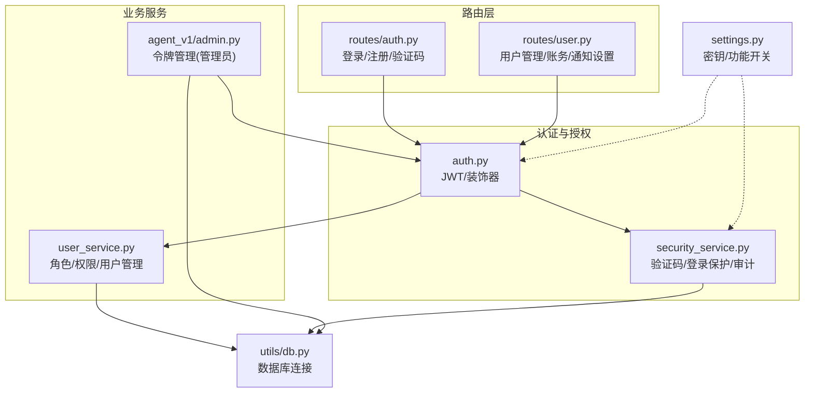
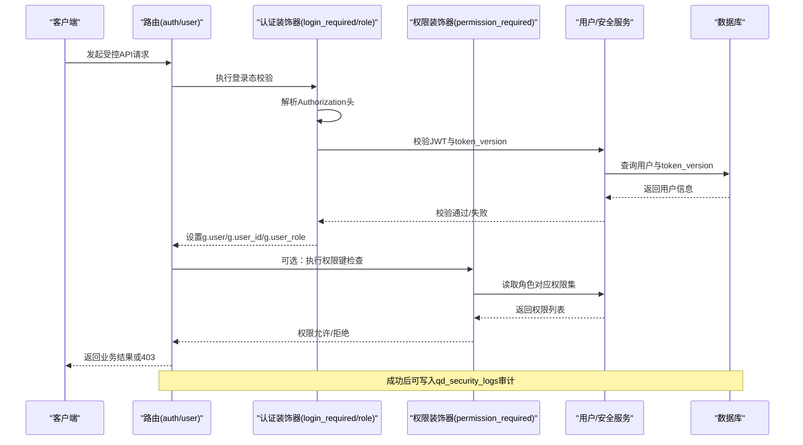
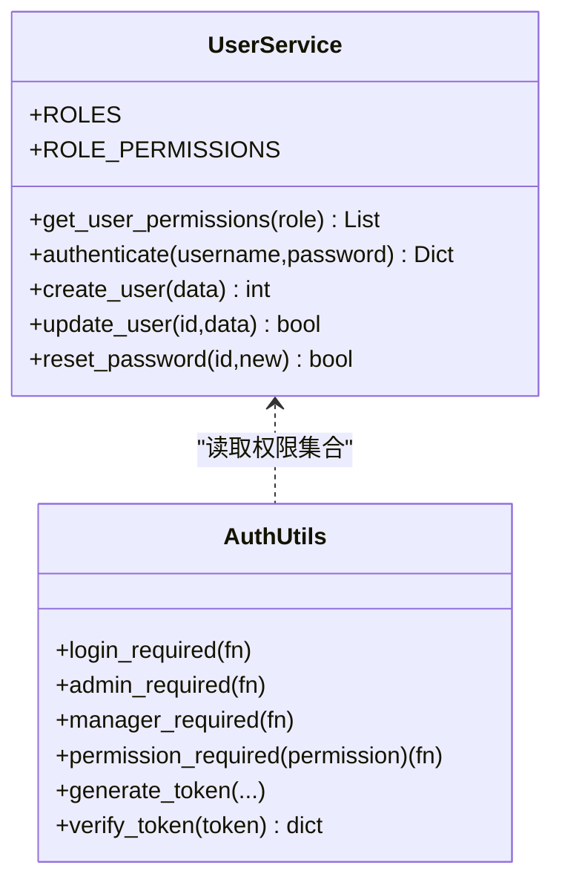
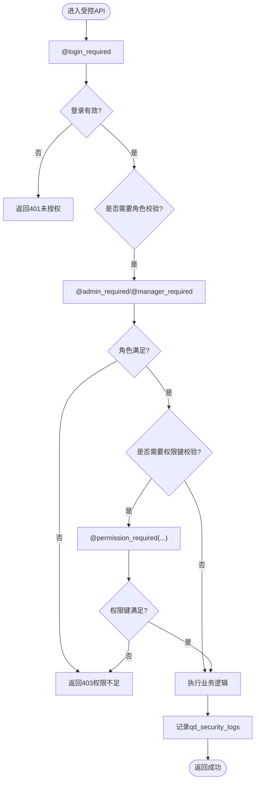
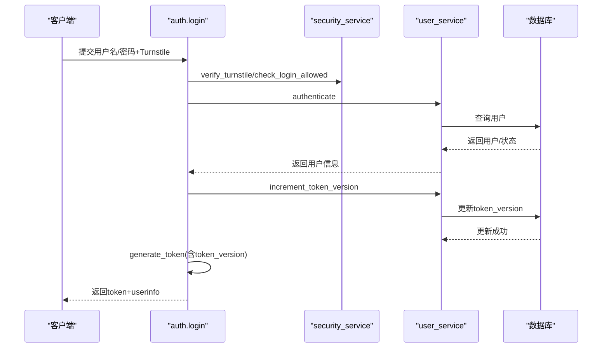
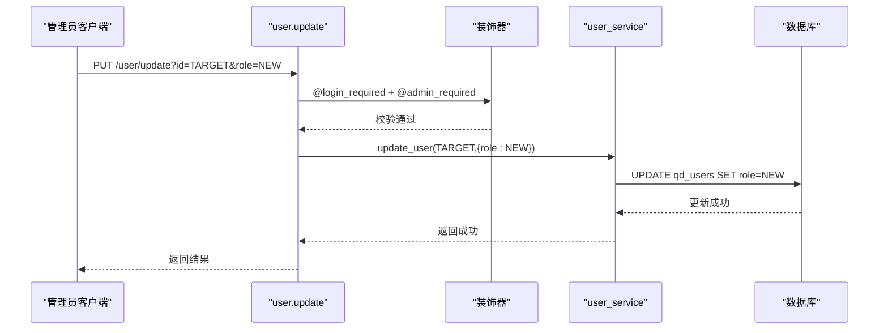
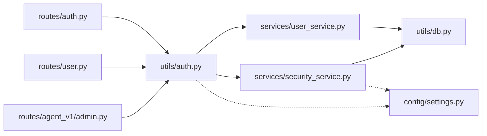

# 用户角色与权限

<cite>
**本文引用的文件**
- [backend_api_python/app/utils/auth.py](file://backend_api_python/app/utils/auth.py)
- [backend_api_python/app/services/user_service.py](file://backend_api_python/app/services/user_service.py)
- [backend_api_python/app/routers/auth.py](file://backend_api_python/app/routes/auth.py)
- [backend_api_python/app/services/security_service.py](file://backend_api_python/app/services/security_service.py)
- [backend_api_python/app/routers/user.py](file://backend_api_python/app/routers/user.py)
- [backend_api_python/app/routers/agent_v1/admin.py](file://backend_api_python/app/routers/agent_v1/admin.py)
- [backend_api_python/app/config/settings.py](file://backend_api_python/app/config/settings.py)
- [backend_api_python/app/utils/db.py](file://backend_api_python/app/utils/db.py)
</cite>

## 目录
1. [简介](#简介)
2. [项目结构](#项目结构)
3. [核心组件](#核心组件)
4. [架构总览](#架构总览)
5. [详细组件分析](#详细组件分析)
6. [依赖分析](#依赖分析)
7. [性能考量](#性能考量)
8. [故障排查指南](#故障排查指南)
9. [结论](#结论)
10. [附录](#附录)

## 简介
本文件面向“用户角色与权限”主题，系统性梳理 QuantDinger 后端在多租户与单用户模式下的角色权限模型与实现。重点覆盖以下方面：
- 四个角色的权限层级与范围：viewer、user、manager、admin
- 权限检查机制：装饰器用法、API 访问控制、页面级权限验证
- 权限继承与组合规则
- 角色升级/降级流程与安全考虑
- 权限配置示例、自定义权限扩展方法与权限审计日志
- 权限冲突与越权访问的预防与检测机制

## 项目结构
围绕权限体系的关键模块与文件如下：
- 认证与授权工具：auth.py（JWT 生成/校验、装饰器）
- 用户服务：user_service.py（角色与权限映射、用户 CRUD、密码哈希）
- 安全服务：security_service.py（验证码/登录保护、审计日志）
- 路由层：
  - auth.py（登录/注册/验证码等认证相关接口）
  - user.py（用户管理、角色查询、账务等）
  - agent_v1/admin.py（Agent 网关令牌管理，强调管理员权限）
- 配置：settings.py（密钥、功能开关等）
- 数据库工具：db.py（统一 PostgreSQL 连接）

图表来源
- [backend_api_python/app/utils/auth.py:1-239](file://backend_api_python/app/utils/auth.py#L1-L239)
- [backend_api_python/app/services/security_service.py:1-399](file://backend_api_python/app/services/security_service.py#L1-L399)
- [backend_api_python/app/services/user_service.py:1-701](file://backend_api_python/app/services/user_service.py#L1-L701)
- [backend_api_python/app/routers/auth.py:1-1180](file://backend_api_python/app/routes/auth.py#L1-L1180)
- [backend_api_python/app/routers/user.py:1-1894](file://backend_api_python/app/routers/user.py#L1-L1894)
- [backend_api_python/app/routers/agent_v1/admin.py:1-236](file://backend_api_python/app/routers/agent_v1/admin.py#L1-L236)
- [backend_api_python/app/config/settings.py:1-99](file://backend_api_python/app/config/settings.py#L1-L99)
- [backend_api_python/app/utils/db.py:1-66](file://backend_api_python/app/utils/db.py#L1-L66)

章节来源
- [backend_api_python/app/utils/auth.py:1-239](file://backend_api_python/app/utils/auth.py#L1-L239)
- [backend_api_python/app/services/user_service.py:1-701](file://backend_api_python/app/services/user_service.py#L1-L701)
- [backend_api_python/app/services/security_service.py:1-399](file://backend_api_python/app/services/security_service.py#L1-L399)
- [backend_api_python/app/routers/auth.py:1-1180](file://backend_api_python/app/routes/auth.py#L1-L1180)
- [backend_api_python/app/routers/user.py:1-1894](file://backend_api_python/app/routers/user.py#L1-L1894)
- [backend_api_python/app/routers/agent_v1/admin.py:1-236](file://backend_api_python/app/routers/agent_v1/admin.py#L1-L236)
- [backend_api_python/app/config/settings.py:1-99](file://backend_api_python/app/config/settings.py#L1-L99)
- [backend_api_python/app/utils/db.py:1-66](file://backend_api_python/app/utils/db.py#L1-L66)

## 核心组件
- 角色与权限映射
  - 角色顺序与权限集合由用户服务维护，形成“viewer → user → manager → admin”的权限递增链路。
  - 权限键用于细粒度控制，例如 dashboard、view、indicator、backtest、strategy、portfolio、settings、user_manage、credentials 等。
- 装饰器体系
  - 登录态校验：login_required
  - 角色校验：admin_required、manager_required
  - 自定义权限校验：permission_required(permission)
- 安全与审计
  - 登录保护：验证码（Turnstile）、登录尝试记录、失败次数阈值与封禁窗口
  - 审计日志：qd_security_logs 表记录登录/注册/重置密码等事件
- 单一客户端登录
  - 通过 token_version 递增使旧令牌失效，实现“踢下线”效果

章节来源
- [backend_api_python/app/services/user_service.py:56-68](file://backend_api_python/app/services/user_service.py#L56-L68)
- [backend_api_python/app/utils/auth.py:126-217](file://backend_api_python/app/utils/auth.py#L126-L217)
- [backend_api_python/app/services/security_service.py:26-399](file://backend_api_python/app/services/security_service.py#L26-L399)

## 架构总览
下图展示从请求到权限决策与执行的整体流程，涵盖认证、权限检查、业务处理与审计。

图表来源
- [backend_api_python/app/utils/auth.py:126-217](file://backend_api_python/app/utils/auth.py#L126-L217)
- [backend_api_python/app/services/user_service.py:656-658](file://backend_api_python/app/services/user_service.py#L656-L658)
- [backend_api_python/app/services/security_service.py:246-277](file://backend_api_python/app/services/security_service.py#L246-L277)

## 详细组件分析

### 角色与权限模型
- 角色层级
  - viewer：仅仪表盘与查看权限
  - user：在 viewer 基础上开放指标、回测、策略、组合等能力
  - manager：在 user 基础上开放设置项
  - admin：在 manager 基础上开放用户管理与凭证管理
- 权限继承与组合
  - 采用“角色 → 权限集合”的映射表，权限键以集合形式叠加，不存在显式继承函数；权限键即最小控制单元
  - 通过装饰器按角色或权限键进行门禁控制

图表来源
- [backend_api_python/app/services/user_service.py:56-68](file://backend_api_python/app/services/user_service.py#L56-L68)
- [backend_api_python/app/utils/auth.py:126-217](file://backend_api_python/app/utils/auth.py#L126-L217)

章节来源
- [backend_api_python/app/services/user_service.py:56-68](file://backend_api_python/app/services/user_service.py#L56-L68)
- [backend_api_python/app/utils/auth.py:188-217](file://backend_api_python/app/utils/auth.py#L188-L217)

### 权限检查机制
- 装饰器用法
  - 登录态：@login_required 必须在最内层
  - 角色：@admin_required 或 @manager_required 在 @login_required 之后
  - 自定义权限：@permission_required("strategy") 等
- API 访问控制
  - 登录/注册/验证码等路由在 auth.py 中完成 Turnstile、速率限制、登录尝试记录与审计
  - 用户管理路由在 user.py 中强制 admin_required
  - Agent 网关令牌管理在 agent_v1/admin.py 中同样要求管理员身份
- 页面级权限验证
  - 前端可基于后端返回的用户角色与权限集合进行前端渲染与交互控制

图表来源
- [backend_api_python/app/utils/auth.py:126-217](file://backend_api_python/app/utils/auth.py#L126-L217)
- [backend_api_python/app/routers/user.py:41-68](file://backend_api_python/app/routers/user.py#L41-L68)
- [backend_api_python/app/routers/agent_v1/admin.py:73-161](file://backend_api_python/app/routers/agent_v1/admin.py#L73-L161)
- [backend_api_python/app/services/security_service.py:246-277](file://backend_api_python/app/services/security_service.py#L246-L277)

章节来源
- [backend_api_python/app/utils/auth.py:126-217](file://backend_api_python/app/utils/auth.py#L126-L217)
- [backend_api_python/app/routers/user.py:41-68](file://backend_api_python/app/routers/user.py#L41-L68)
- [backend_api_python/app/routers/agent_v1/admin.py:73-161](file://backend_api_python/app/routers/agent_v1/admin.py#L73-L161)
- [backend_api_python/app/services/security_service.py:246-277](file://backend_api_python/app/services/security_service.py#L246-L277)

### 登录与单一客户端登录
- 登录流程要点
  - 支持 Turnstile 验证、登录尝试记录、账户状态检查、token_version 递增、生成新 JWT
  - 支持邮箱验证码快速登录/自动注册
- 单一客户端登录
  - 登录成功后递增 token_version，旧令牌在 verify_token 中因版本不匹配而被拒绝
  - 用于实现“踢下线”与会话唯一性

图表来源
- [backend_api_python/app/routers/auth.py:140-278](file://backend_api_python/app/routes/auth.py#L140-L278)
- [backend_api_python/app/utils/auth.py:18-47](file://backend_api_python/app/utils/auth.py#L18-L47)
- [backend_api_python/app/utils/auth.py:82-113](file://backend_api_python/app/utils/auth.py#L82-L113)
- [backend_api_python/app/services/user_service.py:274-312](file://backend_api_python/app/services/user_service.py#L274-L312)

章节来源
- [backend_api_python/app/routers/auth.py:140-278](file://backend_api_python/app/routes/auth.py#L140-L278)
- [backend_api_python/app/utils/auth.py:18-47](file://backend_api_python/app/utils/auth.py#L18-L47)
- [backend_api_python/app/utils/auth.py:82-113](file://backend_api_python/app/utils/auth.py#L82-L113)
- [backend_api_python/app/services/user_service.py:274-312](file://backend_api_python/app/services/user_service.py#L274-L312)

### 角色升级/降级操作流程与安全考虑
- 升级/降级入口
  - 管理员通过用户管理路由对目标用户执行角色更新
- 安全考虑
  - 自身不可删除/修改自身角色
  - 需要管理员身份，且操作应记录审计日志
  - 建议在变更后触发重新登录或 token_version 递增，确保即时生效

图表来源
- [backend_api_python/app/routers/user.py:174-205](file://backend_api_python/app/routers/user.py#L174-L205)
- [backend_api_python/app/utils/auth.py:160-185](file://backend_api_python/app/utils/auth.py#L160-L185)
- [backend_api_python/app/services/user_service.py:411-454](file://backend_api_python/app/services/user_service.py#L411-L454)

章节来源
- [backend_api_python/app/routers/user.py:174-205](file://backend_api_python/app/routers/user.py#L174-L205)
- [backend_api_python/app/utils/auth.py:160-185](file://backend_api_python/app/utils/auth.py#L160-L185)
- [backend_api_python/app/services/user_service.py:411-454](file://backend_api_python/app/services/user_service.py#L411-L454)

### 权限配置示例与自定义扩展
- 配置示例
  - 角色与权限映射：在用户服务中维护 ROLE_PERMISSIONS 字典，新增权限键即可扩展
  - 环境密钥：SECRET_KEY 用于 JWT 加解密
- 自定义权限扩展
  - 在用户服务中为角色追加新的权限键
  - 在路由中使用 @permission_required("your_key") 对具体端点进行细粒度控制
  - 若需更复杂权限模型，可在装饰器中引入“权限矩阵/策略引擎”，但当前实现以权限键集合为主

章节来源
- [backend_api_python/app/services/user_service.py:62-68](file://backend_api_python/app/services/user_service.py#L62-L68)
- [backend_api_python/app/utils/auth.py:188-217](file://backend_api_python/app/utils/auth.py#L188-L217)
- [backend_api_python/app/config/settings.py:32-41](file://backend_api_python/app/config/settings.py#L32-L41)

### 权限审计日志
- 登录/注册/重置密码等安全事件写入 qd_security_logs
- 登录保护与验证码发送也记录相应审计事件，便于追踪异常行为

章节来源
- [backend_api_python/app/services/security_service.py:246-277](file://backend_api_python/app/services/security_service.py#L246-L277)
- [backend_api_python/app/routers/auth.py:196-252](file://backend_api_python/app/routes/auth.py#L196-L252)

## 依赖分析
- 组件耦合
  - 路由层依赖认证装饰器与服务层
  - 用户服务与安全服务均依赖数据库工具
  - 配置类为认证与安全提供密钥与功能开关
- 外部依赖
  - JWT 库用于签名与解析
  - 请求库用于 Turnstile 校验
  - bcrypt（可选）用于密码哈希

图表来源
- [backend_api_python/app/routers/auth.py:1-1180](file://backend_api_python/app/routes/auth.py#L1-L1180)
- [backend_api_python/app/routers/user.py:1-1894](file://backend_api_python/app/routers/user.py#L1-L1894)
- [backend_api_python/app/routers/agent_v1/admin.py:1-236](file://backend_api_python/app/routers/agent_v1/admin.py#L1-L236)
- [backend_api_python/app/utils/auth.py:1-239](file://backend_api_python/app/utils/auth.py#L1-L239)
- [backend_api_python/app/services/user_service.py:1-701](file://backend_api_python/app/services/user_service.py#L1-L701)
- [backend_api_python/app/services/security_service.py:1-399](file://backend_api_python/app/services/security_service.py#L1-L399)
- [backend_api_python/app/utils/db.py:1-66](file://backend_api_python/app/utils/db.py#L1-L66)
- [backend_api_python/app/config/settings.py:1-99](file://backend_api_python/app/config/settings.py#L1-L99)

章节来源
- [backend_api_python/app/routers/auth.py:1-1180](file://backend_api_python/app/routes/auth.py#L1-L1180)
- [backend_api_python/app/routers/user.py:1-1894](file://backend_api_python/app/routers/user.py#L1-L1894)
- [backend_api_python/app/routers/agent_v1/admin.py:1-236](file://backend_api_python/app/routers/agent_v1/admin.py#L1-L236)
- [backend_api_python/app/utils/auth.py:1-239](file://backend_api_python/app/utils/auth.py#L1-L239)
- [backend_api_python/app/services/user_service.py:1-701](file://backend_api_python/app/services/user_service.py#L1-L701)
- [backend_api_python/app/services/security_service.py:1-399](file://backend_api_python/app/services/security_service.py#L1-L399)
- [backend_api_python/app/utils/db.py:1-66](file://backend_api_python/app/utils/db.py#L1-L66)
- [backend_api_python/app/config/settings.py:1-99](file://backend_api_python/app/config/settings.py#L1-L99)

## 性能考量
- 装饰器链路开销
  - 每次请求均需解析 Authorization 头、校验 JWT、读取权限集合，建议在网关层缓存轻量元数据
- 数据库访问
  - 登录与权限检查涉及少量查询，建议开启连接池与索引优化（如 qd_users 的 id、token_version）
- 速率限制
  - 登录尝试与验证码发送具备速率限制，避免滥用导致的数据库压力

## 故障排查指南
- 401 未登录
  - 检查请求头 Authorization 是否为 Bearer 令牌
  - 核对 SECRET_KEY 一致性与过期时间
- 403 权限不足
  - 确认用户角色与所需权限键是否匹配
  - 检查装饰器顺序：先 @login_required 再 @admin_required/@manager_required/@permission_required
- 单一客户端登录冲突
  - 若提示令牌无效或过期，确认是否被“踢下线”
  - 检查 token_version 是否与数据库一致
- 登录失败/被封禁
  - 查看 qd_login_attempts 与封禁窗口
  - 检查 Turnstile 配置与网络连通性
- 审计日志缺失
  - 确认审计写入逻辑是否执行
  - 检查数据库连接与表结构

章节来源
- [backend_api_python/app/utils/auth.py:146-156](file://backend_api_python/app/utils/auth.py#L146-L156)
- [backend_api_python/app/utils/auth.py:167-170](file://backend_api_python/app/utils/auth.py#L167-L170)
- [backend_api_python/app/utils/auth.py:202-213](file://backend_api_python/app/utils/auth.py#L202-L213)
- [backend_api_python/app/services/security_service.py:115-144](file://backend_api_python/app/services/security_service.py#L115-L144)
- [backend_api_python/app/services/security_service.py:246-277](file://backend_api_python/app/services/security_service.py#L246-L277)

## 结论
QuantDinger 的权限体系以“角色 → 权限键集合”的简单模型为核心，结合装饰器实现清晰的门禁控制，并通过 Turnstile、登录尝试记录与审计日志构建了基础的安全防线。单一客户端登录通过 token_version 递增实现即时生效与“踢下线”。若需进一步增强，可在现有装饰器基础上引入更复杂的权限矩阵或策略引擎，同时强化审计与告警联动。

## 附录
- 关键环境变量
  - SECRET_KEY：JWT 密钥
  - ADMIN_USER/ADMIN_PASSWORD：单用户模式默认管理员
  - TURNSTILE_*：验证码服务配置
  - RATE_LIMIT、ENABLE_CACHE、ENABLE_REQUEST_LOG：运行时开关
- 数据库表
  - qd_users：用户与角色、token_version、状态等
  - qd_security_logs：安全事件审计
  - qd_login_attempts：登录尝试记录
  - qd_verification_codes：验证码发送记录

章节来源
- [backend_api_python/app/config/settings.py:32-41](file://backend_api_python/app/config/settings.py#L32-L41)
- [backend_api_python/app/services/security_service.py:53-66](file://backend_api_python/app/services/security_service.py#L53-L66)
- [backend_api_python/app/utils/db.py:1-66](file://backend_api_python/app/utils/db.py#L1-L66)