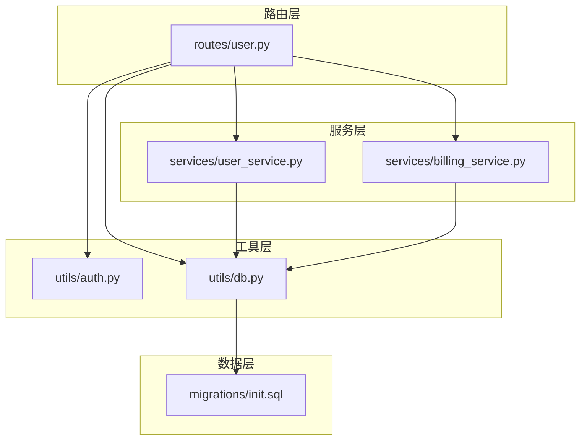
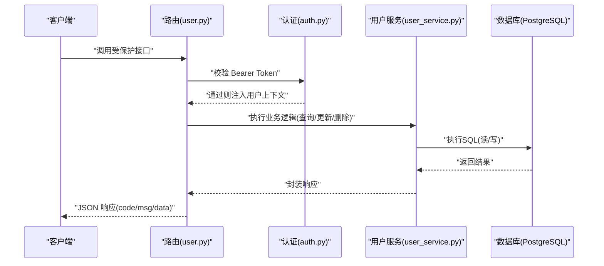
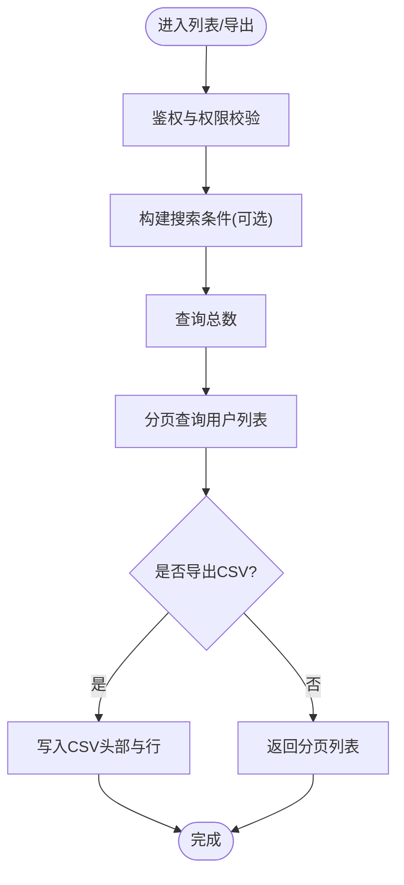
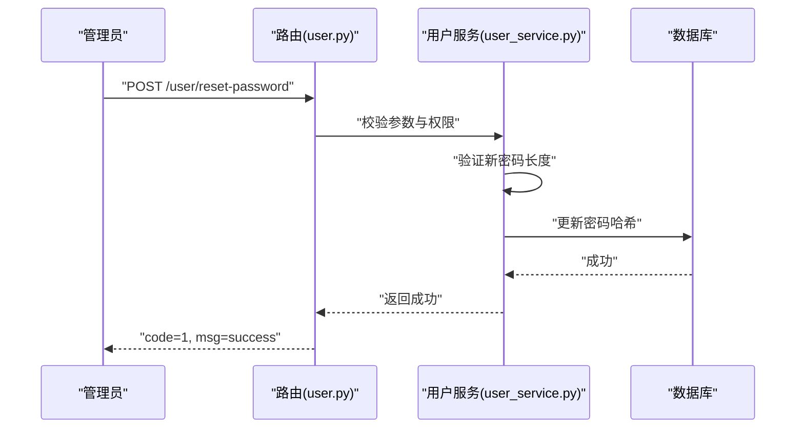
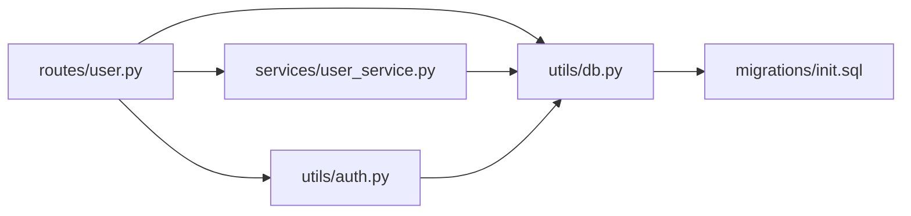
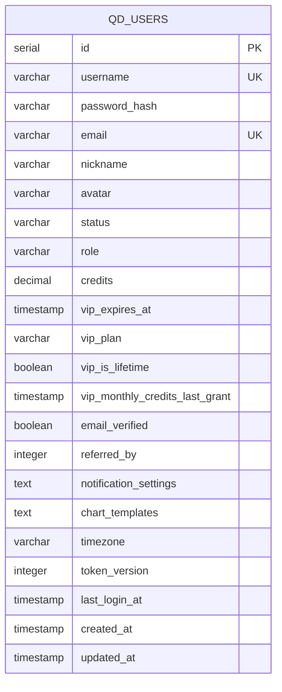

# 用户资料管理

<cite>
**本文引用的文件**
- [backend_api_python/app/routes/user.py](file://backend_api_python/app/routes/user.py)
- [backend_api_python/app/services/user_service.py](file://backend_api_python/app/services/user_service.py)
- [backend_api_python/app/utils/auth.py](file://backend_api_python/app/utils/auth.py)
- [backend_api_python/app/utils/db.py](file://backend_api_python/app/utils/db.py)
- [backend_api_python/migrations/init.sql](file://backend_api_python/migrations/init.sql)
- [backend_api_python/app/services/billing_service.py](file://backend_api_python/app/services/billing_service.py)
</cite>

## 目录
1. [简介](#简介)
2. [项目结构](#项目结构)
3. [核心组件](#核心组件)
4. [架构总览](#架构总览)
5. [详细组件分析](#详细组件分析)
6. [依赖分析](#依赖分析)
7. [性能考虑](#性能考虑)
8. [故障排查指南](#故障排查指南)
9. [结论](#结论)
10. [附录](#附录)

## 简介
本技术文档围绕用户资料管理系统进行深入解析，覆盖用户信息的完整 CRUD 操作（用户名、邮箱、昵称、头像等字段），密码修改与重置流程（含旧密码验证与安全策略）、用户状态管理（激活、禁用、删除）、时区设置与验证规则、用户列表查询与分页、搜索过滤、用户导出功能、以及常见问题（如更新冲突、重复邮箱检测）的处理方案。文档同时给出系统架构图、调用序列图与流程图，帮助开发者与运维人员快速理解与维护该模块。

## 项目结构
用户资料管理相关的核心代码分布在以下模块：
- 路由层：提供 REST 接口，负责参数校验、鉴权与响应封装
- 服务层：封装业务逻辑，包括密码哈希/校验、用户查询/更新、列表与导出、权限与角色管理
- 工具层：认证中间件（JWT）、数据库连接工具
- 数据层：PostgreSQL 初始化脚本定义用户表结构与索引

**图表来源**
- [backend_api_python/app/routes/user.py](file://backend_api_python/app/routes/user.py)
- [backend_api_python/app/services/user_service.py](file://backend_api_python/app/services/user_service.py)
- [backend_api_python/app/services/billing_service.py](file://backend_api_python/app/services/billing_service.py)
- [backend_api_python/app/utils/auth.py](file://backend_api_python/app/utils/auth.py)
- [backend_api_python/app/utils/db.py](file://backend_api_python/app/utils/db.py)
- [backend_api_python/migrations/init.sql](file://backend_api_python/migrations/init.sql)

**章节来源**
- [backend_api_python/app/routes/user.py](file://backend_api_python/app/routes/user.py)
- [backend_api_python/app/services/user_service.py](file://backend_api_python/app/services/user_service.py)
- [backend_api_python/app/utils/auth.py](file://backend_api_python/app/utils/auth.py)
- [backend_api_python/app/utils/db.py](file://backend_api_python/app/utils/db.py)
- [backend_api_python/migrations/init.sql](file://backend_api_python/migrations/init.sql)

## 核心组件
- 路由模块（用户管理）：提供管理员端用户列表、详情、创建、更新、删除、密码重置、角色与权限查询；以及面向普通用户的个人资料查询与更新、通知设置、图表模板、邀请返利等接口。
- 用户服务：封装用户认证、密码哈希/校验、用户创建/更新/删除、列表与导出、角色权限映射、管理员账户自动创建等。
- 认证工具：基于 JWT 的登录态校验、管理员/经理权限校验、单终端登录控制（token_version）。
- 数据库工具：统一 PostgreSQL 连接与初始化校验。
- 数据模式：PostgreSQL 初始化脚本定义用户表结构、索引及扩展列（如通知设置、图表模板、时区、token_version 等）。

**章节来源**
- [backend_api_python/app/routes/user.py](file://backend_api_python/app/routes/user.py)
- [backend_api_python/app/services/user_service.py](file://backend_api_python/app/services/user_service.py)
- [backend_api_python/app/utils/auth.py](file://backend_api_python/app/utils/auth.py)
- [backend_api_python/app/utils/db.py](file://backend_api_python/app/utils/db.py)
- [backend_api_python/migrations/init.sql](file://backend_api_python/migrations/init.sql)

## 架构总览
用户资料管理采用典型的三层架构：路由层负责请求接入与鉴权，服务层承载业务规则，数据层负责持久化。认证采用 JWT 并结合 token_version 实现“单一客户端登录”控制；用户状态与权限通过角色映射与数据库字段共同保障。

**图表来源**
- [backend_api_python/app/routes/user.py](file://backend_api_python/app/routes/user.py)
- [backend_api_python/app/utils/auth.py](file://backend_api_python/app/utils/auth.py)
- [backend_api_python/app/services/user_service.py](file://backend_api_python/app/services/user_service.py)
- [backend_api_python/app/utils/db.py](file://backend_api_python/app/utils/db.py)

## 详细组件分析

### 用户资料 CRUD 与状态管理
- 字段支持
  - 管理员端：用户名、邮箱、昵称、头像、角色、状态、时区、注册IP、最后登录时间、创建/更新时间等。
  - 自助服务端：昵称、头像、时区；邮箱不允许自更新（安全策略）。
- 状态管理
  - 用户状态字段：active、disabled、pending；登录时仅允许 active 用户通过。
  - 删除：管理员可删除用户，但禁止自我删除。
- 列表与分页
  - 支持分页与搜索（用户名/邮箱/昵称模糊匹配），排序按 ID 倒序。
- 导出
  - 输出 CSV，包含 ID、用户名、邮箱、昵称、角色、状态、积分、VIP 到期时间、时区、注册IP、最后登录时间、创建/更新时间等。

**图表来源**
- [backend_api_python/app/routes/user.py](file://backend_api_python/app/routes/user.py)
- [backend_api_python/app/services/user_service.py](file://backend_api_python/app/services/user_service.py)

**章节来源**
- [backend_api_python/app/routes/user.py](file://backend_api_python/app/routes/user.py)
- [backend_api_python/app/services/user_service.py](file://backend_api_python/app/services/user_service.py)

### 密码修改与重置流程
- 旧密码验证
  - change_password 流程要求提供旧密码并校验，若用户未设置密码（代码登录场景），则允许直接设置新密码。
- 管理员重置
  - reset_password 无需旧密码，仅管理员可用，且对新密码长度有最小长度限制。
- 安全策略
  - 密码哈希优先使用 bcrypt，若不可用则回退至 sha256+盐值方案，并记录警告日志。
  - 登录成功会更新最近登录时间，便于审计与风控。

**图表来源**
- [backend_api_python/app/routes/user.py](file://backend_api_python/app/routes/user.py)
- [backend_api_python/app/services/user_service.py](file://backend_api_python/app/services/user_service.py)

**章节来源**
- [backend_api_python/app/routes/user.py](file://backend_api_python/app/routes/user.py)
- [backend_api_python/app/services/user_service.py](file://backend_api_python/app/services/user_service.py)

### 用户状态管理（激活/禁用/删除）
- 状态字段：status（active/disabled/pending）
- 登录限制：非 active 状态用户无法登录
- 删除限制：禁止自我删除，防止误删
- 角色与权限：管理员可对用户进行状态变更与角色调整

**章节来源**
- [backend_api_python/app/routes/user.py](file://backend_api_python/app/routes/user.py)
- [backend_api_python/app/services/user_service.py](file://backend_api_python/app/services/user_service.py)

### 时区设置与验证规则
- 时区字段：timezone（IANA 时区标识，最大长度 64）
- 验证规则：支持空字符串（跟随客户端）、或符合 IANA 格式的字符串
- 更新范围：仅自助更新接口允许更新时区字段

**章节来源**
- [backend_api_python/app/routes/user.py](file://backend_api_python/app/routes/user.py)
- [backend_api_python/app/services/user_service.py](file://backend_api_python/app/services/user_service.py)
- [backend_api_python/migrations/init.sql](file://backend_api_python/migrations/init.sql)

### 用户列表查询、搜索过滤与分页
- 查询参数
  - page/page_size：默认 1/20，最大 100
  - search：按用户名/邮箱/昵称模糊匹配
- 返回结构：items、total、page、page_size、total_pages
- SQL 实现：先统计总数，再按偏移量与限制返回分页数据

**章节来源**
- [backend_api_python/app/routes/user.py](file://backend_api_python/app/routes/user.py)
- [backend_api_python/app/services/user_service.py](file://backend_api_python/app/services/user_service.py)

### 用户导出功能
- 输出格式：CSV（Excel友好），带 BOM
- 字段清单：ID、用户名、邮箱、昵称、角色、状态、积分、VIP 到期时间、时区、注册IP、最后登录时间、创建/更新时间
- 实现：遍历导出列表，逐行写入 CSV

**章节来源**
- [backend_api_python/app/routes/user.py](file://backend_api_python/app/routes/user.py)
- [backend_api_python/app/services/user_service.py](file://backend_api_python/app/services/user_service.py)

### 常见问题与处理方案
- 更新冲突
  - 使用数据库事务与原子更新语句，确保字段更新的原子性与一致性
- 重复邮箱检测
  - 用户创建时对邮箱唯一性进行检查；服务层查询邮箱时大小写不敏感（LOWER）
- 自助更新邮箱限制
  - 自助接口不允许更新邮箱，必须由管理员在后台更新，降低安全风险
- 单一客户端登录
  - 通过 token_version 字段与 JWT 中的 token_version 对比，实现踢出旧设备、强制单点登录

**章节来源**
- [backend_api_python/app/services/user_service.py](file://backend_api_python/app/services/user_service.py)
- [backend_api_python/app/utils/auth.py](file://backend_api_python/app/utils/auth.py)
- [backend_api_python/app/routes/user.py](file://backend_api_python/app/routes/user.py)

## 依赖分析
- 路由依赖服务层与工具层，服务层依赖数据库工具与日志工具
- 认证工具依赖配置与数据库工具，用于 JWT 解析与 token_version 校验
- 数据层依赖 PostgreSQL 初始化脚本，确保表结构与索引存在

**图表来源**
- [backend_api_python/app/routes/user.py](file://backend_api_python/app/routes/user.py)
- [backend_api_python/app/services/user_service.py](file://backend_api_python/app/services/user_service.py)
- [backend_api_python/app/utils/auth.py](file://backend_api_python/app/utils/auth.py)
- [backend_api_python/app/utils/db.py](file://backend_api_python/app/utils/db.py)
- [backend_api_python/migrations/init.sql](file://backend_api_python/migrations/init.sql)

**章节来源**
- [backend_api_python/app/routes/user.py](file://backend_api_python/app/routes/user.py)
- [backend_api_python/app/services/user_service.py](file://backend_api_python/app/services/user_service.py)
- [backend_api_python/app/utils/auth.py](file://backend_api_python/app/utils/auth.py)
- [backend_api_python/app/utils/db.py](file://backend_api_python/app/utils/db.py)
- [backend_api_python/migrations/init.sql](file://backend_api_python/migrations/init.sql)

## 性能考虑
- 分页与索引
  - 列表查询使用 LIMIT/OFFSET，配合索引提升性能；建议在高频查询字段上建立合适索引
- 导出优化
  - 导出采用流式 CSV 写入，避免一次性加载大量数据到内存
- 密码哈希
  - 优先使用 bcrypt；若不可用，回退方案仍保持安全性，但推荐安装 bcrypt 以获得更高强度
- 单点登录
  - token_version 校验在每次请求时进行，建议缓存短期结果以减少数据库访问

[本节为通用指导，不直接分析具体文件]

## 故障排查指南
- 401 未授权
  - 检查 Authorization 头是否为 Bearer Token，Token 是否过期或无效
- 403 权限不足
  - 确认用户角色是否满足接口所需权限（管理员/经理）
- 400 参数错误
  - 检查必填字段、长度限制（如密码长度、时区格式）、非法参数类型
- 500 服务器错误
  - 查看服务日志，定位数据库异常、连接失败或业务逻辑异常
- 导出为空或字段缺失
  - 确认搜索条件与数据库中数据是否匹配，检查 CSV 写入逻辑

**章节来源**
- [backend_api_python/app/routes/user.py](file://backend_api_python/app/routes/user.py)
- [backend_api_python/app/utils/auth.py](file://backend_api_python/app/utils/auth.py)

## 结论
用户资料管理系统通过清晰的路由-服务-数据分层设计，提供了完善的用户 CRUD、状态管理、密码安全策略与时区控制能力。配合 JWT 鉴权与单点登录机制，系统在安全性与可维护性方面具备良好基础。建议在生产环境中启用 bcrypt、合理设置分页与索引、并持续监控导出与列表查询的性能表现。

[本节为总结性内容，不直接分析具体文件]

## 附录

### 数据模型（用户表）

**图表来源**
- [backend_api_python/migrations/init.sql](file://backend_api_python/migrations/init.sql)

### 角色与权限映射
- viewer：仪表盘查看
- user：基础功能集合
- manager：包含设置权限
- admin：用户管理与凭证管理权限

**章节来源**
- [backend_api_python/app/services/user_service.py](file://backend_api_python/app/services/user_service.py)