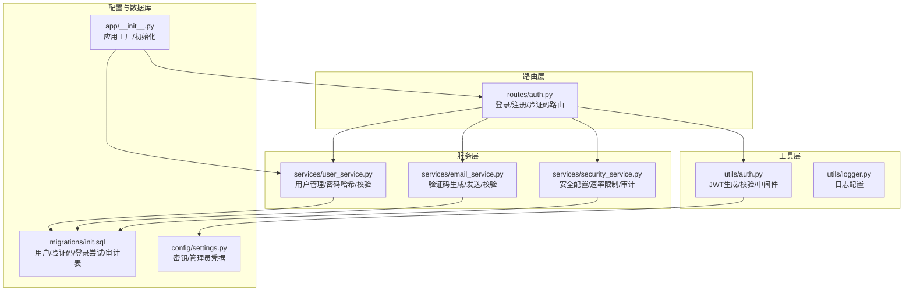
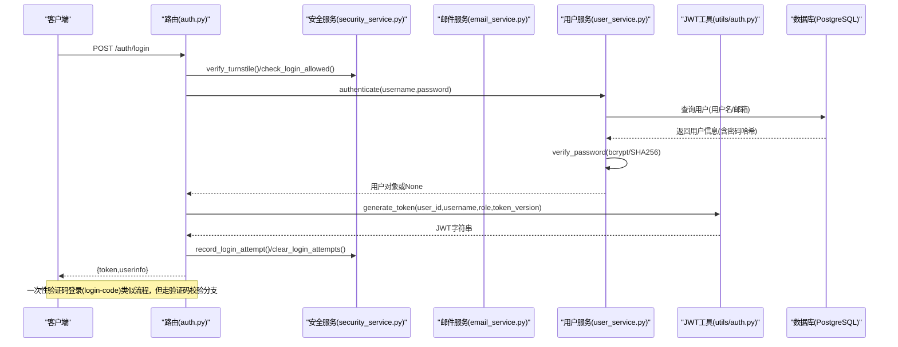
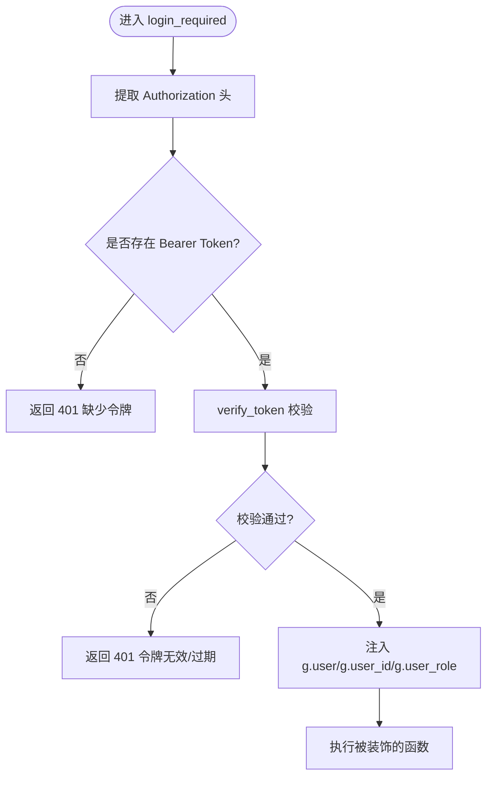
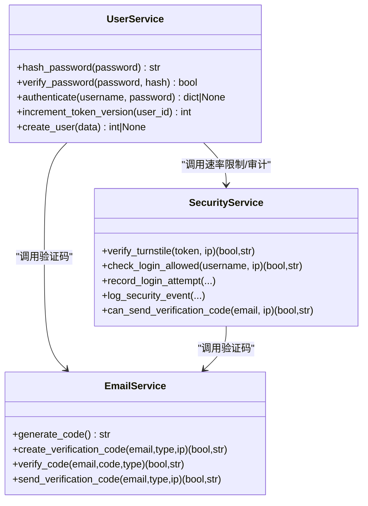
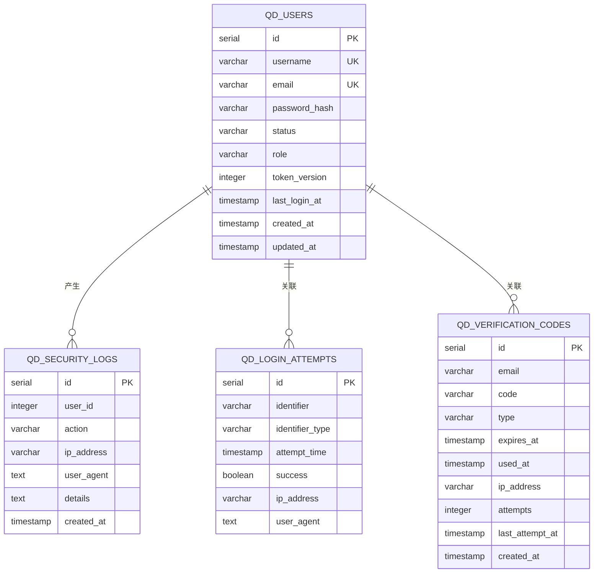
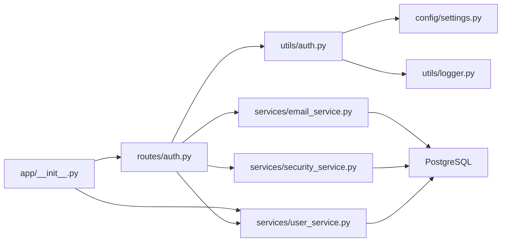

# 认证系统

<cite>
**本文档引用的文件**
- [auth.py](file://backend_api_python/app/routes/auth.py)
- [auth.py](file://backend_api_python/app/utils/auth.py)
- [security_service.py](file://backend_api_python/app/services/security_service.py)
- [user_service.py](file://backend_api_python/app/services/user_service.py)
- [email_service.py](file://backend_api_python/app/services/email_service.py)
- [settings.py](file://backend_api_python/app/config/settings.py)
- [logger.py](file://backend_api_python/app/utils/logger.py)
- [init.sql](file://backend_api_python/migrations/init.sql)
- [__init__.py](file://backend_api_python/app/__init__.py)
</cite>

## 目录
1. [简介](#简介)
2. [项目结构](#项目结构)
3. [核心组件](#核心组件)
4. [架构总览](#架构总览)
5. [详细组件分析](#详细组件分析)
6. [依赖关系分析](#依赖关系分析)
7. [性能考虑](#性能考虑)
8. [故障排除指南](#故障排除指南)
9. [结论](#结论)
10. [附录](#附录)

## 简介
本文件为 QuantDinger 认证系统的详细技术文档，覆盖以下主题：
- 用户认证流程：用户名/邮箱登录、密码验证机制、JWT 令牌生成与校验
- 密码哈希算法：bcrypt 优先、SHA256 回退的实现原理与安全考量
- 登录失败处理、账户锁定机制与安全审计日志
- 一次性验证码登录（code-login）的特殊处理逻辑
- 认证中间件工作原理、令牌验证流程与过期处理
- 具体 API 调用示例、错误码说明与调试指南
- 常见认证问题（密码错误、账户禁用等）的处理方案

## 项目结构
认证系统主要分布在以下模块：
- 路由层：处理登录、注册、验证码发送、一次性验证码登录等入口
- 工具层：JWT 生成与校验、认证中间件、权限装饰器
- 服务层：用户服务（密码哈希/校验、用户查询）、安全服务（速率限制、暴力破解防护、Turnstile、审计日志）、邮件服务（验证码生成/发送/校验）
- 配置与日志：密钥、管理员凭据、日志配置
- 数据库模式：用户表、验证码表、登录尝试表、安全审计日志表

**图示来源**
- [auth.py:1-1180](file://backend_api_python/app/routes/auth.py#L1-L1180)
- [auth.py:1-239](file://backend_api_python/app/utils/auth.py#L1-L239)
- [security_service.py:1-399](file://backend_api_python/app/services/security_service.py#L1-L399)
- [user_service.py:1-701](file://backend_api_python/app/services/user_service.py#L1-L701)
- [email_service.py:1-362](file://backend_api_python/app/services/email_service.py#L1-L362)
- [settings.py:1-99](file://backend_api_python/app/config/settings.py#L1-L99)
- [init.sql:1-800](file://backend_api_python/migrations/init.sql#L1-L800)
- [__init__.py:213-280](file://backend_api_python/app/__init__.py#L213-L280)

**章节来源**
- [auth.py:1-1180](file://backend_api_python/app/routes/auth.py#L1-L1180)
- [auth.py:1-239](file://backend_api_python/app/utils/auth.py#L1-L239)
- [security_service.py:1-399](file://backend_api_python/app/services/security_service.py#L1-L399)
- [user_service.py:1-701](file://backend_api_python/app/services/user_service.py#L1-L701)
- [email_service.py:1-362](file://backend_api_python/app/services/email_service.py#L1-L362)
- [settings.py:1-99](file://backend_api_python/app/config/settings.py#L1-L99)
- [init.sql:1-800](file://backend_api_python/migrations/init.sql#L1-L800)
- [__init__.py:213-280](file://backend_api_python/app/__init__.py#L213-L280)

## 核心组件
- 路由层（认证接口）
  - 登录：支持用户名/邮箱 + 密码；支持 Turnstile 人机验证；速率限制；登录成功生成 JWT
  - 一次性验证码登录：邮箱 + 验证码快速登录/注册；自动创建新用户；记录安全事件
  - 注册：邮箱验证码 + 用户名 + 密码；密码强度校验；邀请奖励
  - 发送验证码：注册/重置密码/修改密码/修改邮箱；防刷策略
- 工具层（JWT 与中间件）
  - JWT 生成：包含用户信息与 token_version；默认有效期 7 天
  - JWT 校验：HS256 解码；校验 token_version 一致性；过期处理
  - 中间件：Bearer 认证；角色/权限装饰器
- 服务层
  - 用户服务：bcrypt 优先的密码哈希；SHA256 回退；用户查询/创建/密码变更
  - 安全服务：Turnstile 验证；IP/账户级速率限制；验证码发送频率限制；暴力破解防护；安全审计日志
  - 邮件服务：SMTP 配置；验证码生成/发送/校验；防暴力破解
- 配置与日志
  - 密钥与管理员凭据来自环境变量
  - 日志统一配置与文件轮转

**章节来源**
- [auth.py:140-484](file://backend_api_python/app/routes/auth.py#L140-L484)
- [auth.py:18-157](file://backend_api_python/app/utils/auth.py#L18-L157)
- [user_service.py:70-100](file://backend_api_python/app/services/user_service.py#L70-L100)
- [security_service.py:26-399](file://backend_api_python/app/services/security_service.py#L26-L399)
- [email_service.py:29-362](file://backend_api_python/app/services/email_service.py#L29-L362)
- [settings.py:30-42](file://backend_api_python/app/config/settings.py#L30-L42)
- [logger.py:9-63](file://backend_api_python/app/utils/logger.py#L9-L63)

## 架构总览
认证系统采用“路由层 → 服务层 → 数据库”的分层设计，结合安全服务进行速率限制与审计，邮件服务负责验证码生命周期管理。

**图示来源**
- [auth.py:140-279](file://backend_api_python/app/routes/auth.py#L140-L279)
- [auth.py:18-80](file://backend_api_python/app/utils/auth.py#L18-L80)
- [security_service.py:72-240](file://backend_api_python/app/services/security_service.py#L72-L240)
- [user_service.py:194-246](file://backend_api_python/app/services/user_service.py#L194-L246)
- [email_service.py:119-213](file://backend_api_python/app/services/email_service.py#L119-L213)

## 详细组件分析

### 路由层：认证接口
- 登录（用户名/邮箱 + 密码）
  - 输入：username/account、password、turnstile_token（可选）
  - 流程：Turnstile 校验 → 速率限制检查 → 多用户认证（用户名/邮箱）→ 单用户模式回退 → 账户状态校验 → token_version 递增 → 生成 JWT → 成功/失败审计
  - 错误码：400 缺少参数/无效输入；401 凭证无效；403 账户禁用/待激活；429 频繁尝试；500 内部错误
- 一次性验证码登录（login-code）
  - 输入：email、code、turnstile_token（可选）、referral_code（可选）
  - 流程：邮箱格式校验 → Turnstile 校验 → 验证码校验 → 用户存在性判断 → 不存在则自动创建（无密码）→ token_version 递增 → 生成 JWT → 更新最后登录时间 → 安全事件记录
  - 自动注册：当用户不存在且允许注册时，自动生成用户名并创建用户
- 注册
  - 输入：email、code、username、password、turnstile_token、referral_code
  - 流程：Turnstile 校验 → 验证码校验 → 用户名/邮箱唯一性校验 → 密码强度校验 → 创建用户（密码哈希）→ 注册奖励 → 安全事件记录 → 自动登录
- 发送验证码
  - 输入：email、type(register/reset_password/change_password/login)、turnstile_token
  - 流程：Turnstile 校验（变更密码类型可跳过）→ 速率限制 → 验证码发送（带过期与尝试次数限制）

**章节来源**
- [auth.py:140-484](file://backend_api_python/app/routes/auth.py#L140-L484)
- [auth.py:491-771](file://backend_api_python/app/routes/auth.py#L491-L771)

### 工具层：JWT 生成与校验、中间件
- JWT 生成
  - 载荷包含 exp、iat、sub（用户名）、user_id、role、token_version
  - HS256 算法签名，密钥来自配置
- JWT 校验
  - HS256 解码；校验过期；校验 token_version 与数据库一致；失败返回 None
- 中间件
  - login_required：从 Authorization 提取 Bearer token，校验后注入 g.user/g.user_id/g.user_role
  - 角色/权限装饰器：admin_required、manager_required、permission_required

**图示来源**
- [auth.py:126-157](file://backend_api_python/app/utils/auth.py#L126-L157)
- [auth.py:50-80](file://backend_api_python/app/utils/auth.py#L50-L80)

**章节来源**
- [auth.py:18-157](file://backend_api_python/app/utils/auth.py#L18-L157)
- [settings.py:30-42](file://backend_api_python/app/config/settings.py#L30-L42)

### 服务层：用户、安全、邮件
- 用户服务（user_service.py）
  - 密码哈希：优先 bcrypt（12 轮），不可用时回退到 sha256$盐$哈希
  - 密码校验：识别 bcrypt 或 sha256 前缀，分别验证
  - 用户认证：支持用户名/邮箱登录；对无密码用户（code-login）返回特殊标记
  - token_version：每次登录递增，配合 JWT 校验实现“单一客户端登录”
  - 用户创建：用户名唯一性、密码长度校验、邀请人字段
- 安全服务（security_service.py）
  - Turnstile：可选的人机验证，失败时拒绝请求
  - 速率限制：IP 与账户双维度；失败计数与封禁窗口
  - 验证码速率限制：同一邮箱每分钟一次；同一 IP 每小时上限
  - 暴力破解防护：验证码最大尝试次数与封禁时间
  - 审计日志：登录/注册/验证码发送等事件写入 qd_security_logs
- 邮件服务（email_service.py）
  - SMTP 配置：主机、端口、用户名、密码、TLS/SSL
  - 验证码：生成固定位数随机码；过期时间；尝试计数与封禁
  - 发送：HTML/纯文本双版本；异常分类处理

**图示来源**
- [user_service.py:70-313](file://backend_api_python/app/services/user_service.py#L70-L313)
- [security_service.py:72-326](file://backend_api_python/app/services/security_service.py#L72-L326)
- [email_service.py:67-213](file://backend_api_python/app/services/email_service.py#L67-L213)

**章节来源**
- [user_service.py:70-313](file://backend_api_python/app/services/user_service.py#L70-L313)
- [security_service.py:26-399](file://backend_api_python/app/services/security_service.py#L26-L399)
- [email_service.py:29-362](file://backend_api_python/app/services/email_service.py#L29-L362)

### 数据模型与数据库
- 用户表（qd_users）：用户名/邮箱唯一、密码哈希、状态/角色、token_version、时区、最后登录时间等
- 验证码表（qd_verification_codes）：邮箱、验证码、类型、过期时间、尝试次数、IP 地址
- 登录尝试表（qd_login_attempts）：标识符（IP/用户名）、时间、成功与否、UA
- 安全日志表（qd_security_logs）：用户、动作、IP、UA、详情（JSON）

**图示来源**
- [init.sql:8-190](file://backend_api_python/migrations/init.sql#L8-L190)

**章节来源**
- [init.sql:8-190](file://backend_api_python/migrations/init.sql#L8-L190)

## 依赖关系分析
- 路由层依赖工具层（JWT）与服务层（用户/安全/邮件）
- 工具层依赖配置（密钥）与日志
- 服务层依赖数据库连接与日志
- 应用工厂负责初始化数据库与管理员用户

**图示来源**
- [auth.py:1-1180](file://backend_api_python/app/routes/auth.py#L1-L1180)
- [auth.py:1-239](file://backend_api_python/app/utils/auth.py#L1-L239)
- [user_service.py:1-701](file://backend_api_python/app/services/user_service.py#L1-L701)
- [security_service.py:1-399](file://backend_api_python/app/services/security_service.py#L1-L399)
- [email_service.py:1-362](file://backend_api_python/app/services/email_service.py#L1-L362)
- [settings.py:1-99](file://backend_api_python/app/config/settings.py#L1-L99)
- [logger.py:1-63](file://backend_api_python/app/utils/logger.py#L1-L63)
- [__init__.py:213-280](file://backend_api_python/app/__init__.py#L213-L280)

**章节来源**
- [auth.py:1-1180](file://backend_api_python/app/routes/auth.py#L1-L1180)
- [auth.py:1-239](file://backend_api_python/app/utils/auth.py#L1-L239)
- [user_service.py:1-701](file://backend_api_python/app/services/user_service.py#L1-L701)
- [security_service.py:1-399](file://backend_api_python/app/services/security_service.py#L1-L399)
- [email_service.py:1-362](file://backend_api_python/app/services/email_service.py#L1-L362)
- [settings.py:1-99](file://backend_api_python/app/config/settings.py#L1-L99)
- [logger.py:1-63](file://backend_api_python/app/utils/logger.py#L1-L63)
- [__init__.py:213-280](file://backend_api_python/app/__init__.py#L213-L280)

## 性能考虑
- 密码哈希
  - bcrypt：成本因子 12，计算开销适中；不可用时回退 sha256$盐$哈希，仍具备一定安全性
- JWT
  - HS256 解码与 token_version 校验为常量时间操作；建议合理设置 SECRET_KEY 并启用 HTTPS
- 速率限制
  - 使用内存计数与数据库清理；建议在高并发场景引入 Redis 缓存以提升性能
- 数据库
  - 为 qd_login_attempts、qd_verification_codes、qd_security_logs 建立索引，定期清理历史数据

[本节为通用指导，无需特定文件来源]

## 故障排除指南
- 常见错误码
  - 400：缺少必要参数、Turnstile 缺失或失败、邮箱格式无效、验证码缺失或过期
  - 401：凭证无效、令牌缺失或无效/过期
  - 403：账户禁用/待激活、权限不足
  - 429：登录尝试过多/IP/账户被临时封禁
  - 500：内部错误（令牌生成失败、数据库操作异常）
- 登录失败处理
  - 记录失败尝试与 UA；超过阈值封禁；审计日志记录失败原因
- 账户锁定机制
  - IP 与账户维度独立计数；封禁时长基于最后失败时间推算
- 安全审计日志
  - 所有登录/注册/验证码发送等事件均写入 qd_security_logs，支持后续追踪
- 调试建议
  - 启用更详细的日志级别；检查 TURNSTILE_*、SMTP_* 环境变量；确认数据库表存在与索引完善

**章节来源**
- [auth.py:140-484](file://backend_api_python/app/routes/auth.py#L140-L484)
- [security_service.py:115-240](file://backend_api_python/app/services/security_service.py#L115-L240)
- [email_service.py:119-213](file://backend_api_python/app/services/email_service.py#L119-L213)
- [logger.py:9-63](file://backend_api_python/app/utils/logger.py#L9-L63)

## 结论
该认证系统通过多层防护（Turnstile、速率限制、暴力破解防护、审计日志）与灵活的登录方式（用户名/邮箱 + 密码、一次性验证码登录），在保证易用性的同时提升了安全性。JWT 与 token_version 的组合实现了“单一客户端登录”能力；bcrypt 优先的密码哈希策略兼顾了安全与兼容性。建议在生产环境中完善监控与告警，并根据业务规模扩展缓存与数据库优化。

[本节为总结，无需特定文件来源]

## 附录

### API 调用示例与错误码
- 登录（用户名/邮箱 + 密码）
  - 请求：POST /auth/login
  - 参数：username/account、password、turnstile_token（可选）
  - 成功响应：{code: 1, data: {token, userinfo}}
  - 失败响应：{code: 0, msg: "..."}
- 一次性验证码登录（login-code）
  - 请求：POST /auth/login-code
  - 参数：email、code、turnstile_token（可选）、referral_code（可选）
  - 成功响应：{code: 1, data: {token, is_new_user, userinfo}}
- 注册
  - 请求：POST /auth/register
  - 参数：email、code、username、password、turnstile_token、referral_code
  - 成功响应：{code: 1, data: {token, userinfo}}
- 发送验证码
  - 请求：POST /auth/send-code
  - 参数：email、type(register/reset_password/change_password/login)、turnstile_token
  - 成功响应：{code: 1, msg: "..."}

常见错误码
- 400：缺少参数/Turnstile 失败/邮箱无效/验证码缺失
- 401：凭证无效/令牌无效/过期
- 403：账户禁用/待激活/权限不足
- 429：频繁尝试/IP/账户被封禁
- 500：内部错误

**章节来源**
- [auth.py:140-771](file://backend_api_python/app/routes/auth.py#L140-L771)

### 安全性最佳实践
- 强制启用 HTTPS，保护传输过程中的令牌与凭据
- 定期轮换 SECRET_KEY，确保密钥安全
- 合理设置 Turnstile 与速率限制参数，降低自动化攻击风险
- 定期清理 qd_login_attempts 与 qd_verification_codes 历史数据，避免表膨胀
- 对审计日志进行集中化存储与访问控制

[本节为通用指导，无需特定文件来源]