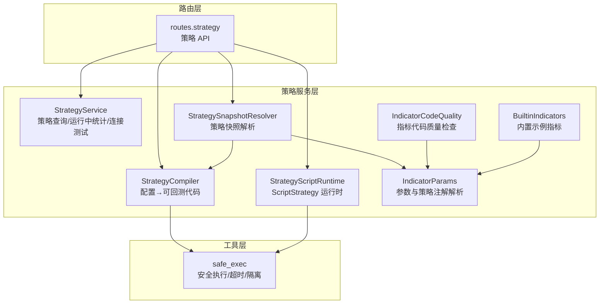
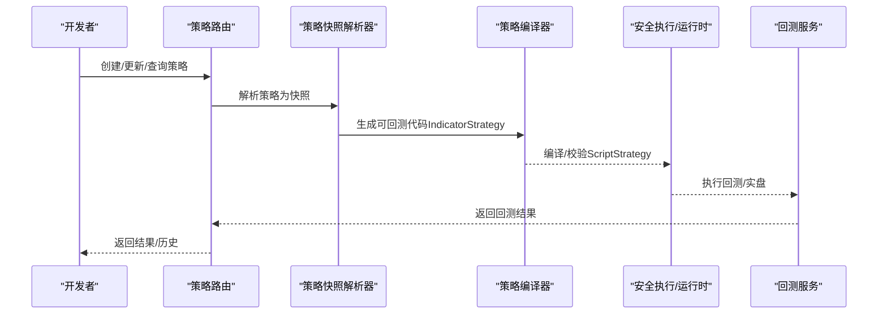
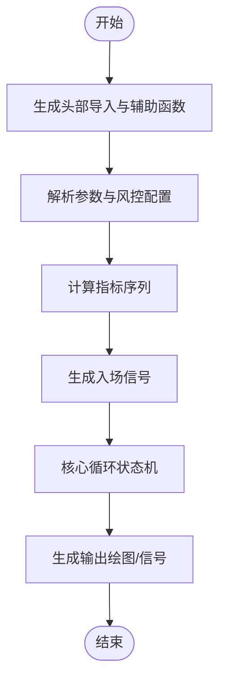
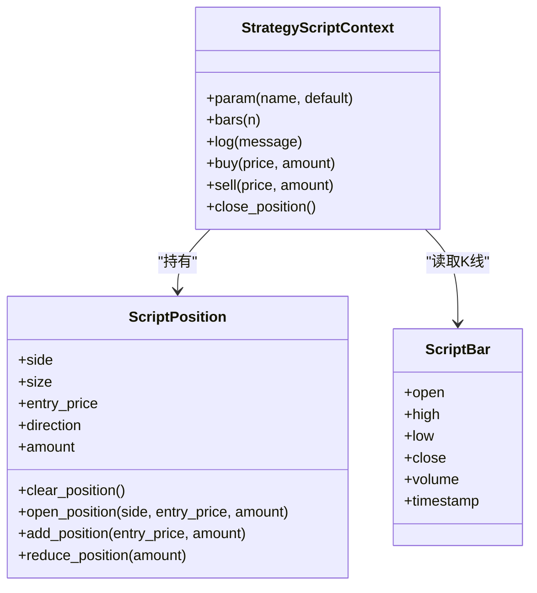
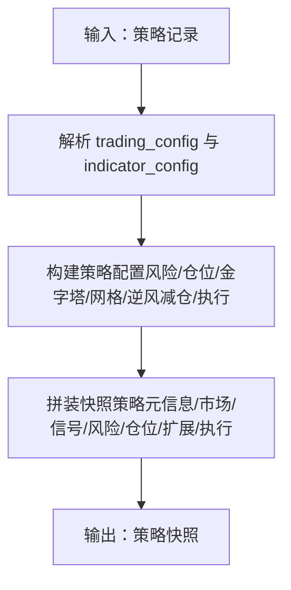
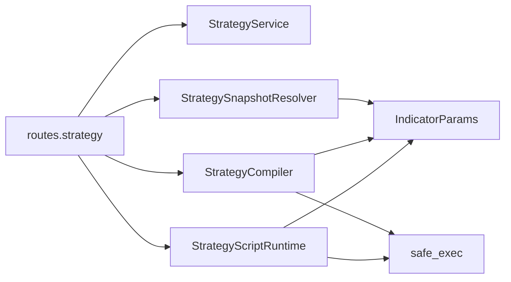

# 策略开发

<cite>
**本文引用的文件**
- [strategy.py](file://backend_api_python/app/services/strategy.py)
- [strategy_compiler.py](file://backend_api_python/app/services/strategy_compiler.py)
- [strategy_script_runtime.py](file://backend_api_python/app/services/strategy_script_runtime.py)
- [builtin_indicators.py](file://backend_api_python/app/services/builtin_indicators.py)
- [strategy_snapshot.py](file://backend_api_python/app/services/strategy_snapshot.py)
- [indicator_code_quality.py](file://backend_api_python/app/services/indicator_code_quality.py)
- [safe_exec.py](file://backend_api_python/app/utils/safe_exec.py)
- [strategy.py](file://backend_api_python/app/routes/strategy.py)
- [indicator_params.py](file://backend_api_python/app/services/indicator_params.py)
- [dual_ma_with_params.py](file://docs/examples/dual_ma_with_params.py)
- [multi_indicator_composite.py](file://docs/examples/multi_indicator_composite.py)
- [cross_sectional_momentum_rsi.py](file://docs/examples/cross_sectional_momentum_rsi.py)
- [STRATEGY_DEV_GUIDE_CN.md](file://docs/STRATEGY_DEV_GUIDE_CN.md)
- [CROSS_SECTIONAL_STRATEGY_GUIDE_CN.md](file://docs/CROSS_SECTIONAL_STRATEGY_GUIDE_CN.md)
</cite>

## 目录
1. [引言](#引言)
2. [项目结构](#项目结构)
3. [核心组件](#核心组件)
4. [架构总览](#架构总览)
5. [详细组件分析](#详细组件分析)
6. [依赖分析](#依赖分析)
7. [性能考虑](#性能考虑)
8. [故障排查指南](#故障排查指南)
9. [结论](#结论)
10. [附录](#附录)

## 引言
本文件面向策略开发者，系统化阐述 QuantDinger 策略开发平台的两类主要开发模式：IndicatorStrategy（基于 DataFrame 的信号脚本）与 ScriptStrategy（事件驱动的 on_init/on_bar 脚本）。内容涵盖策略编译器工作原理、策略运行时环境与内置指标库使用、策略编辑器的质量检查机制与策略快照功能，并提供可直接定位到仓库示例文件的路径指引，帮助读者快速编写买入/卖出信号、复合指标与跨市场策略，掌握策略生命周期管理、参数优化与性能监控的最佳实践。

## 项目结构
后端采用 Flask Blueprint 组织策略相关路由与服务，核心模块包括：
- 策略服务：策略查询、运行中策略统计、交易所符号与连接测试等
- 策略编译器：将配置转化为可回测的 Python 代码
- 策略脚本运行时：ScriptStrategy 的安全执行与上下文封装
- 内置指标：示例指标种子与可视化输出
- 策略快照：将策略持久化为回测/实盘可执行的快照
- 代码质量检查：针对指标脚本的启发式检查
- 安全执行：沙箱与超时控制
- 路由：策略 CRUD、回测、历史记录、批量启停等

**图表来源**
- [strategy.py:14-800](file://backend_api_python/app/services/strategy.py#L14-L800)
- [strategy_compiler.py:1-689](file://backend_api_python/app/services/strategy_compiler.py#L1-L689)
- [strategy_snapshot.py:1-220](file://backend_api_python/app/services/strategy_snapshot.py#L1-L220)
- [strategy_script_runtime.py:1-191](file://backend_api_python/app/services/strategy_script_runtime.py#L1-L191)
- [builtin_indicators.py:1-250](file://backend_api_python/app/services/builtin_indicators.py#L1-L250)
- [indicator_code_quality.py:1-206](file://backend_api_python/app/services/indicator_code_quality.py#L1-L206)
- [safe_exec.py:1-471](file://backend_api_python/app/utils/safe_exec.py#L1-L471)
- [strategy.py:1-800](file://backend_api_python/app/routes/strategy.py#L1-L800)
- [indicator_params.py:1-380](file://backend_api_python/app/services/indicator_params.py#L1-L380)

**章节来源**
- [strategy.py:14-800](file://backend_api_python/app/services/strategy.py#L14-L800)
- [strategy_compiler.py:1-689](file://backend_api_python/app/services/strategy_compiler.py#L1-L689)
- [strategy_script_runtime.py:1-191](file://backend_api_python/app/services/strategy_script_runtime.py#L1-L191)
- [builtin_indicators.py:1-250](file://backend_api_python/app/services/builtin_indicators.py#L1-L250)
- [strategy_snapshot.py:1-220](file://backend_api_python/app/services/strategy_snapshot.py#L1-L220)
- [indicator_code_quality.py:1-206](file://backend_api_python/app/services/indicator_code_quality.py#L1-L206)
- [safe_exec.py:1-471](file://backend_api_python/app/utils/safe_exec.py#L1-L471)
- [strategy.py:1-800](file://backend_api_python/app/routes/strategy.py#L1-L800)
- [indicator_params.py:1-380](file://backend_api_python/app/services/indicator_params.py#L1-L380)

## 核心组件
- 策略服务（StrategyService）
  - 查询运行中策略、获取交易所符号与连接测试、构建交易机器人显示配置等
- 策略编译器（StrategyCompiler）
  - 将策略配置（入场规则、参数、金字塔规则、风控）编译为可回测的 Python 代码
- 策略脚本运行时（StrategyScriptRuntime）
  - 提供 ScriptBar、ScriptPosition、StrategyScriptContext，以及编译/校验 on_init/on_bar 的工具
- 内置指标（BuiltinIndicators）
  - 提供示例指标（RSI、双均线、MACD、布林带）与种子写入逻辑
- 策略快照（StrategySnapshotResolver）
  - 将策略持久化为回测/实盘可执行的快照，含风险、仓位、金字塔/网格等配置
- 代码质量检查（IndicatorCodeQuality）
  - 针对指标脚本的启发式检查（缺失元数据、缺失输出、参数未读取、未知策略键等）
- 安全执行（safe_exec）
  - 构建受限 builtins、白名单模块、超时控制、子进程隔离
- 路由（routes.strategy）
  - 提供策略 CRUD、回测、历史、批量启停、模板等 API
- 指标参数与策略注解解析（indicator_params）
  - 解析 # @param 与 # @strategy 注解，生成参数定义与默认策略配置

**章节来源**
- [strategy.py:14-800](file://backend_api_python/app/services/strategy.py#L14-L800)
- [strategy_compiler.py:1-689](file://backend_api_python/app/services/strategy_compiler.py#L1-L689)
- [strategy_script_runtime.py:1-191](file://backend_api_python/app/services/strategy_script_runtime.py#L1-L191)
- [builtin_indicators.py:1-250](file://backend_api_python/app/services/builtin_indicators.py#L1-L250)
- [strategy_snapshot.py:1-220](file://backend_api_python/app/services/strategy_snapshot.py#L1-L220)
- [indicator_code_quality.py:1-206](file://backend_api_python/app/services/indicator_code_quality.py#L1-L206)
- [safe_exec.py:1-471](file://backend_api_python/app/utils/safe_exec.py#L1-L471)
- [strategy.py:1-800](file://backend_api_python/app/routes/strategy.py#L1-L800)
- [indicator_params.py:1-380](file://backend_api_python/app/services/indicator_params.py#L1-L380)

## 架构总览
策略开发平台围绕“配置→编译→回测/实盘→快照”的闭环展开。策略编辑器产出的配置与脚本经编译器/运行时安全执行，最终形成策略快照，供回测与实盘执行使用。

**图表来源**
- [strategy.py:295-441](file://backend_api_python/app/routes/strategy.py#L295-L441)
- [strategy_snapshot.py:116-220](file://backend_api_python/app/services/strategy_snapshot.py#L116-L220)
- [strategy_compiler.py:5-35](file://backend_api_python/app/services/strategy_compiler.py#L5-L35)
- [strategy_script_runtime.py:159-191](file://backend_api_python/app/services/strategy_script_runtime.py#L159-L191)
- [safe_exec.py:207-244](file://backend_api_python/app/utils/safe_exec.py#L207-L244)

## 详细组件分析

### 组件A：策略编译器（StrategyCompiler）
- 输入：策略配置（名称、入场规则、参数、金字塔规则、风控）
- 输出：可回测的 Python 代码（包含导入、参数、指标计算、信号逻辑、核心循环、输出）
- 关键流程：
  - 头部导入与辅助函数
  - 参数解析（初始仓位、杠杆、金字塔、风控）
  - 指标计算（SuperTrend、EMA、RSI、MACD、布林带、KDJ、MA）
  - 信号逻辑（基于规则的布尔条件）
  - 核心循环（多头/空头状态、止盈止损、金字塔加仓、信号平仓）
  - 输出（绘图配置与买卖信号）

**图表来源**
- [strategy_compiler.py:5-689](file://backend_api_python/app/services/strategy_compiler.py#L5-L689)

**章节来源**
- [strategy_compiler.py:1-689](file://backend_api_python/app/services/strategy_compiler.py#L1-L689)

### 组件B：策略脚本运行时（StrategyScriptRuntime）
- 提供 ScriptBar、ScriptPosition、StrategyScriptContext
- 提供 compile_strategy_script_handlers：校验并编译策略脚本，返回 on_init/on_bar
- 安全执行：build_safe_builtins + safe_exec_with_validation
- 运行时上下文：bars、param、log、buy/sell/close_position、position/balance/equity

**图表来源**
- [strategy_script_runtime.py:17-191](file://backend_api_python/app/services/strategy_script_runtime.py#L17-L191)

**章节来源**
- [strategy_script_runtime.py:1-191](file://backend_api_python/app/services/strategy_script_runtime.py#L1-L191)
- [safe_exec.py:74-93](file://backend_api_python/app/utils/safe_exec.py#L74-L93)
- [safe_exec.py:207-244](file://backend_api_python/app/utils/safe_exec.py#L207-L244)

### 组件C：策略快照（StrategySnapshotResolver）
- 将策略持久化为回测/实盘可执行的快照
- 解析字段：策略ID/名称、类型/模式、市场/符号/周期、初始资金/佣金/滑点/杠杆、交易方向、金字塔/网格/逆风减仓等
- 生成 config_snapshot：策略元信息、市场配置、信号配置、风险/仓位/扩展配置、执行配置

**图表来源**
- [strategy_snapshot.py:116-220](file://backend_api_python/app/services/strategy_snapshot.py#L116-L220)

**章节来源**
- [strategy_snapshot.py:1-220](file://backend_api_python/app/services/strategy_snapshot.py#L1-L220)

### 组件D：内置指标与示例（BuiltinIndicators）
- 提供示例指标（RSI 边缘触发、双均线金叉死叉、MACD 柱穿零轴、布林带触及）
- 种子写入：幂等写入用户指标库，避免重复

**章节来源**
- [builtin_indicators.py:1-250](file://backend_api_python/app/services/builtin_indicators.py#L1-L250)

### 组件E：代码质量检查（IndicatorCodeQuality）
- 检查项：缺失元数据、缺失 df.copy、缺失 output、缺失 buy/sell 列、参数声明但未读取、信号标记使用 where(None,...)、未知策略键、无止盈/止损/零止盈止损、trailing 无百分比等
- 用于策略编辑器的启发式提示

**章节来源**
- [indicator_code_quality.py:1-206](file://backend_api_python/app/services/indicator_code_quality.py#L1-L206)

### 组件F：安全执行（safe_exec）
- 构建受限 builtins 与白名单模块
- 超时控制（SIGALRM/Timer + ctypes 注入）
- 子进程隔离（multiprocessing + pickle 序列化）
- AST/正则双重校验，拒绝危险模式

**章节来源**
- [safe_exec.py:24-93](file://backend_api_python/app/utils/safe_exec.py#L24-L93)
- [safe_exec.py:95-153](file://backend_api_python/app/utils/safe_exec.py#L95-L153)
- [safe_exec.py:246-354](file://backend_api_python/app/utils/safe_exec.py#L246-L354)
- [safe_exec.py:358-471](file://backend_api_python/app/utils/safe_exec.py#L358-L471)

### 组件G：路由与策略生命周期（routes.strategy）
- 提供策略模板、回测、历史、批量启停、交易记录/持仓查询等
- 内置脚本代码质量检查（缺失 on_init/on_bar、未声明参数默认值、无下单意图等）

**章节来源**
- [strategy.py:251-274](file://backend_api_python/app/routes/strategy.py#L251-L274)
- [strategy.py:295-441](file://backend_api_python/app/routes/strategy.py#L295-L441)
- [strategy.py:443-471](file://backend_api_python/app/routes/strategy.py#L443-L471)
- [strategy.py:491-679](file://backend_api_python/app/routes/strategy.py#L491-L679)
- [strategy.py:716-776](file://backend_api_python/app/routes/strategy.py#L716-L776)

### 组件H：指标参数与策略注解解析（indicator_params）
- 解析 # @param：参数声明（name/type/default/description）
- 解析 # @strategy：策略默认配置（stopLossPct/takeProfitPct/entryPct/trailingEnabled/trailingStopPct/trailingActivationPct/tradeDirection）
- 支持指标间调用（call_indicator）

**章节来源**
- [indicator_params.py:26-117](file://backend_api_python/app/services/indicator_params.py#L26-L117)
- [indicator_params.py:119-216](file://backend_api_python/app/services/indicator_params.py#L119-L216)
- [indicator_params.py:218-380](file://backend_api_python/app/services/indicator_params.py#L218-L380)

## 依赖分析
- 策略服务依赖数据库连接与日志记录，提供运行中策略统计与交易所连接测试
- 策略编译器与脚本运行时依赖安全执行工具
- 策略快照解析器依赖参数解析器与数据库
- 路由层聚合服务层，提供对外 API

**图表来源**
- [strategy.py:11-28](file://backend_api_python/app/routes/strategy.py#L11-L28)
- [strategy.py:14-800](file://backend_api_python/app/services/strategy.py#L14-L800)
- [strategy_snapshot.py:1-220](file://backend_api_python/app/services/strategy_snapshot.py#L1-L220)
- [strategy_compiler.py:1-689](file://backend_api_python/app/services/strategy_compiler.py#L1-L689)
- [strategy_script_runtime.py:1-191](file://backend_api_python/app/services/strategy_script_runtime.py#L1-L191)
- [safe_exec.py:1-471](file://backend_api_python/app/utils/safe_exec.py#L1-L471)
- [indicator_params.py:1-380](file://backend_api_python/app/services/indicator_params.py#L1-L380)

**章节来源**
- [strategy.py:1-800](file://backend_api_python/app/routes/strategy.py#L1-L800)
- [strategy.py:1-800](file://backend_api_python/app/services/strategy.py#L1-L800)
- [strategy_snapshot.py:1-220](file://backend_api_python/app/services/strategy_snapshot.py#L1-L220)
- [strategy_compiler.py:1-689](file://backend_api_python/app/services/strategy_compiler.py#L1-L689)
- [strategy_script_runtime.py:1-191](file://backend_api_python/app/services/strategy_script_runtime.py#L1-L191)
- [safe_exec.py:1-471](file://backend_api_python/app/utils/safe_exec.py#L1-L471)
- [indicator_params.py:1-380](file://backend_api_python/app/services/indicator_params.py#L1-L380)

## 性能考虑
- 回测窗口与时间粒度：路由层对回测日期范围进行限制，避免过长回测导致资源压力
- 安全执行超时与内存限制：默认超时与内存上限可配置，防止长时间/大内存脚本阻塞
- 金字塔/网格/逆风减仓：通过 maxTimes/stepPct/sizePct 控制加减仓节奏，避免过度交易
- 信号边缘触发：减少重复信号，降低回测/实盘噪音

**章节来源**
- [strategy.py:357-374](file://backend_api_python/app/routes/strategy.py#L357-L374)
- [safe_exec.py:157-205](file://backend_api_python/app/utils/safe_exec.py#L157-L205)

## 故障排查指南
- 代码质量检查提示
  - 缺失元数据/输出/参数未读取/未知策略键/无止盈止损/零止盈止损/trailing 无百分比等
- 脚本运行时错误
  - 空代码、语法错误、缺失 on_init/on_bar、运行时错误
- 安全执行失败
  - 超时、内存不足、危险模式/AST 校验失败
- 交易所连接测试
  - 本地代理、IP 白名单、密钥权限、市场类型不匹配等问题

**章节来源**
- [indicator_code_quality.py:79-206](file://backend_api_python/app/services/indicator_code_quality.py#L79-L206)
- [strategy.py:67-122](file://backend_api_python/app/routes/strategy.py#L67-L122)
- [safe_exec.py:157-205](file://backend_api_python/app/utils/safe_exec.py#L157-L205)
- [strategy.py:292-610](file://backend_api_python/app/services/strategy.py#L292-L610)

## 结论
本平台提供从“信号脚本（IndicatorStrategy）”到“事件驱动脚本（ScriptStrategy）”的完整策略开发路径。通过策略编译器、运行时安全执行、策略快照与代码质量检查，开发者可以高效地验证信号、参数优化与风控策略，并将其稳定地落地到回测与实盘执行链路中。内置指标与示例为策略开发提供了良好的起点，结合参数与策略注解解析，可进一步提升策略的可维护性与可移植性。

## 附录

### A. 两种策略开发模式对比与选择
- IndicatorStrategy：适合信号型回测、参数调优、图表叠加与默认风控配置
- ScriptStrategy：适合有状态执行、动态风控、分批加减仓、bot 风格执行

**章节来源**
- [STRATEGY_DEV_GUIDE_CN.md:75-91](file://docs/STRATEGY_DEV_GUIDE_CN.md#L75-L91)

### B. 代码示例路径（不直接展示代码，仅提供定位）
- 双均线策略（含参数与默认风控）：[dual_ma_with_params.py:1-64](file://docs/examples/dual_ma_with_params.py#L1-L64)
- 多指标组合策略（均线/RSI/MACD/成交量过滤）：[multi_indicator_composite.py:1-109](file://docs/examples/multi_indicator_composite.py#L1-L109)
- 截面策略指标示例（动量+RSI）：[cross_sectional_momentum_rsi.py:1-71](file://docs/examples/cross_sectional_momentum_rsi.py#L1-L71)

### C. 策略编辑器与质量检查
- 指标脚本质量检查：缺失元数据、缺失 output、参数声明未读取、未知策略键等
- 脚本策略质量检查：缺失 on_init/on_bar、未声明参数默认值、无下单意图等

**章节来源**
- [indicator_code_quality.py:79-206](file://backend_api_python/app/services/indicator_code_quality.py#L79-L206)
- [strategy.py:45-64](file://backend_api_python/app/routes/strategy.py#L45-L64)

### D. 跨市场与截面策略
- 截面策略指南：多标支持、自动排序、组合管理、调仓频率、批量执行
- 截面策略指标模板与环境变量说明

**章节来源**
- [CROSS_SECTIONAL_STRATEGY_GUIDE_CN.md:1-224](file://docs/CROSS_SECTIONAL_STRATEGY_GUIDE_CN.md#L1-L224)