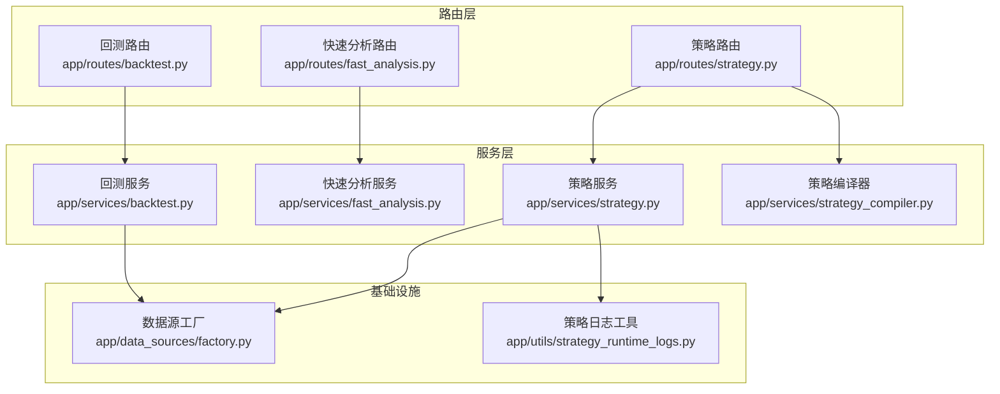
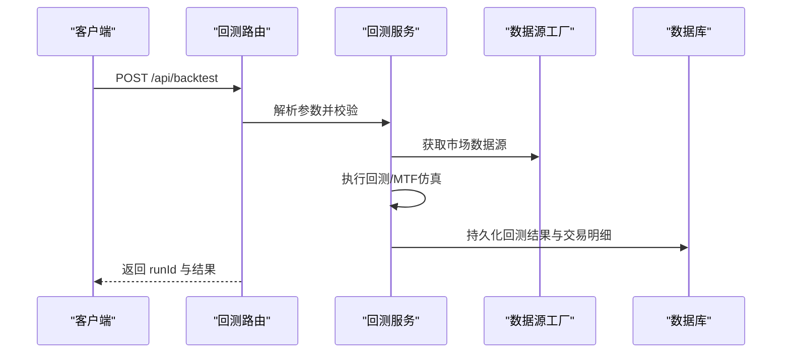
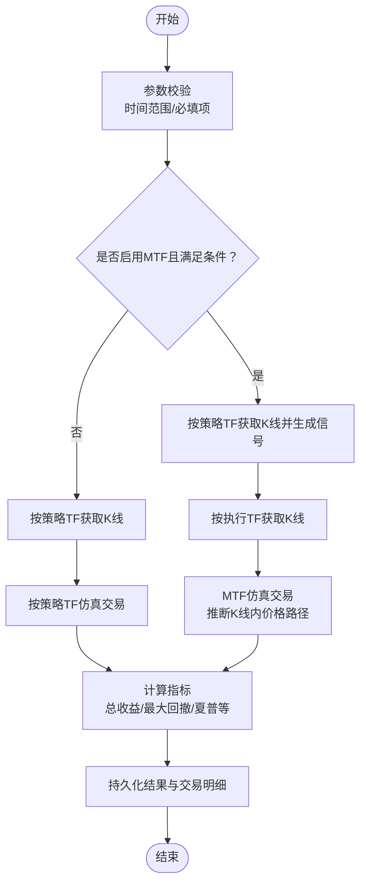
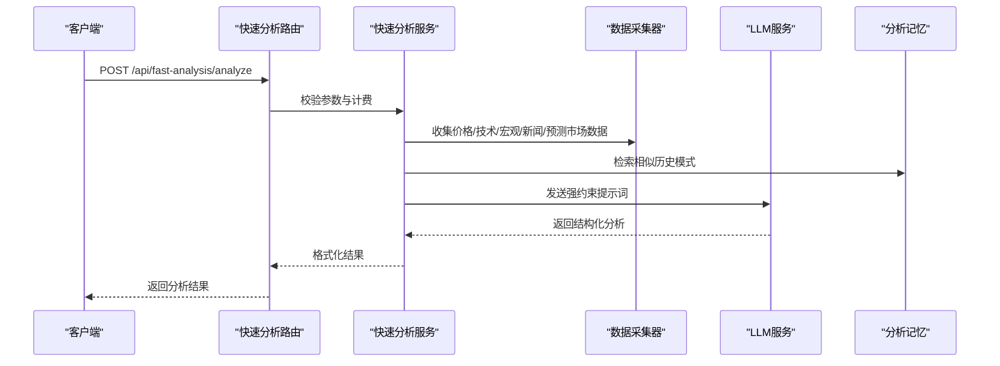
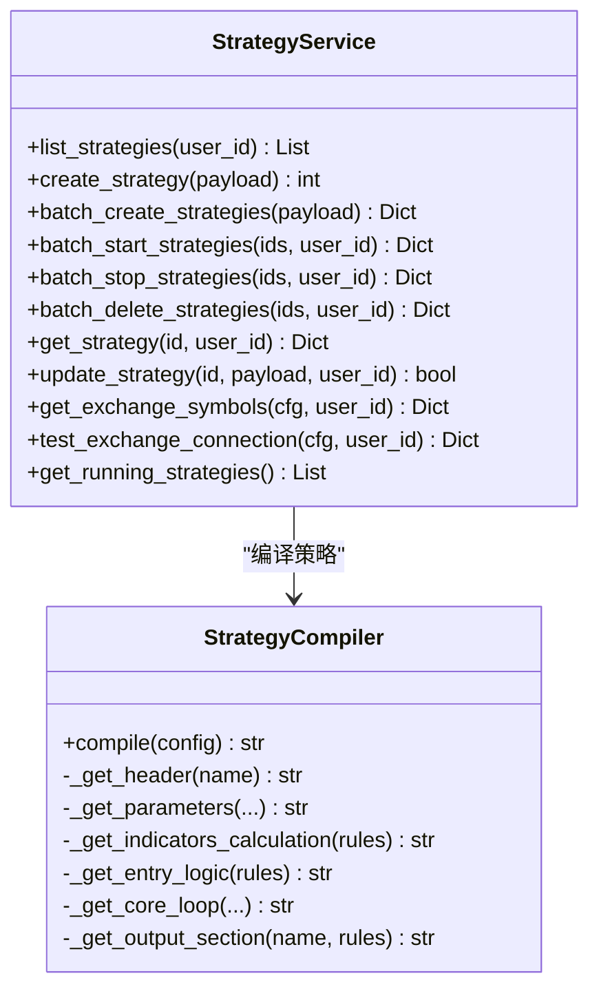
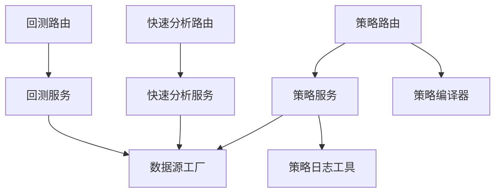

# 策略测试与验证

<cite>
**本文档引用的文件**
- [backtest.py](file://backend_api_python/app/routes/backtest.py)
- [backtest.py](file://backend_api_python/app/services/backtest.py)
- [fast_analysis.py](file://backend_api_python/app/routes/fast_analysis.py)
- [fast_analysis.py](file://backend_api_python/app/services/fast_analysis.py)
- [strategy.py](file://backend_api_python/app/routes/strategy.py)
- [strategy.py](file://backend_api_python/app/services/strategy.py)
- [strategy_compiler.py](file://backend_api_python/app/services/strategy_compiler.py)
- [factory.py](file://backend_api_python/app/data_sources/factory.py)
- [strategy_runtime_logs.py](file://backend_api_python/app/utils/strategy_runtime_logs.py)
</cite>

## 目录
1. [引言](#引言)
2. [项目结构](#项目结构)
3. [核心组件](#核心组件)
4. [架构总览](#架构总览)
5. [详细组件分析](#详细组件分析)
6. [依赖关系分析](#依赖关系分析)
7. [性能考量](#性能考量)
8. [故障排查指南](#故障排查指南)
9. [结论](#结论)
10. [附录](#附录)

## 引言
本指南面向量化策略开发者与研究人员，系统阐述 QuantDinger 策略测试与验证体系：涵盖历史数据回测、参数优化、性能评估、快速分析与实时监控、策略验证最佳实践（过拟合检测、样本外测试、压力测试）、测试数据准备与管理（清洗、缺失值与异常值处理）、结果解读（收益统计、风险指标、夏普比率）以及策略改进与优化建议。文档基于后端 API 与服务实现进行深入解析，辅以可视化图示帮助不同背景读者理解。

## 项目结构
后端采用 Flask 路由 + 服务层架构，策略测试与验证相关的关键模块如下：
- 回测路由与服务：负责接收策略与参数，执行回测并持久化结果
- 快速分析路由与服务：提供高性能的实时分析与建议
- 策略路由与服务：策略模板、编译、批量启停与交易记录查询
- 数据源工厂：统一市场与数据源抽象
- 运行日志工具：策略运行日志持久化

**图表来源**
- [backtest.py](file://backend_api_python/app/routes/backtest.py)
- [backtest.py](file://backend_api_python/app/services/backtest.py)
- [fast_analysis.py](file://backend_api_python/app/routes/fast_analysis.py)
- [fast_analysis.py](file://backend_api_python/app/services/fast_analysis.py)
- [strategy.py](file://backend_api_python/app/routes/strategy.py)
- [strategy.py](file://backend_api_python/app/services/strategy.py)
- [strategy_compiler.py](file://backend_api_python/app/services/strategy_compiler.py)
- [factory.py](file://backend_api_python/app/data_sources/factory.py)
- [strategy_runtime_logs.py](file://backend_api_python/app/utils/strategy_runtime_logs.py)

**章节来源**
- [backtest.py](file://backend_api_python/app/routes/backtest.py)
- [backtest.py](file://backend_api_python/app/services/backtest.py)
- [fast_analysis.py](file://backend_api_python/app/routes/fast_analysis.py)
- [fast_analysis.py](file://backend_api_python/app/services/fast_analysis.py)
- [strategy.py](file://backend_api_python/app/routes/strategy.py)
- [strategy.py](file://backend_api_python/app/services/strategy.py)
- [strategy_compiler.py](file://backend_api_python/app/services/strategy_compiler.py)
- [factory.py](file://backend_api_python/app/data_sources/factory.py)
- [strategy_runtime_logs.py](file://backend_api_python/app/utils/strategy_runtime_logs.py)

## 核心组件
- 回测路由与服务
  - 提供回测请求、历史查询、单次运行详情、AI 辅助分析建议等能力
  - 支持标准回测与多时间框架（MTF）高精度回测，自动选择执行时间框架
  - 结果持久化至数据库，包含交易明细与净值曲线
- 快速分析路由与服务
  - 统一数据采集器，整合价格、技术指标、宏观、新闻、预测市场等多维数据
  - 单次 LLM 调用输出结构化分析，支持异步提交与历史查询
- 策略路由与服务
  - 策略模板加载、策略编译器生成可执行代码、批量启停、交易与持仓查询
  - 交换连接测试、符号列表获取、策略状态管理
- 数据源工厂
  - 统一市场枚举与别名标准化，按市场类型返回对应数据源
- 策略日志工具
  - 最佳努力持久化策略运行日志，便于调试与审计

**章节来源**
- [backtest.py](file://backend_api_python/app/routes/backtest.py)
- [backtest.py](file://backend_api_python/app/services/backtest.py)
- [fast_analysis.py](file://backend_api_python/app/routes/fast_analysis.py)
- [fast_analysis.py](file://backend_api_python/app/services/fast_analysis.py)
- [strategy.py](file://backend_api_python/app/routes/strategy.py)
- [strategy.py](file://backend_api_python/app/services/strategy.py)
- [strategy_compiler.py](file://backend_api_python/app/services/strategy_compiler.py)
- [factory.py](file://backend_api_python/app/data_sources/factory.py)
- [strategy_runtime_logs.py](file://backend_api_python/app/utils/strategy_runtime_logs.py)

## 架构总览
回测与快速分析均通过路由层进入服务层，服务层依赖数据源工厂获取市场数据，回测服务还负责结果持久化与历史管理；策略服务负责策略生命周期与交易记录管理。

**图表来源**
- [backtest.py](file://backend_api_python/app/routes/backtest.py)
- [backtest.py](file://backend_api_python/app/services/backtest.py)
- [factory.py](file://backend_api_python/app/data_sources/factory.py)

## 详细组件分析

### 回测系统（历史数据回测、参数优化、性能评估）
- 接口能力
  - 标准回测：支持指定市场、品种、时间框架、起止日期、初始资金、手续费、滑点、杠杆、交易方向、策略配置等
  - 多时间框架（MTF）高精度回测：在加密货币市场且满足条件时，使用更高精度的执行时间框架进行仿真
  - 精度信息查询：根据回测区间自动推荐执行时间框架与估算 K 线数量
  - 历史查询与详情：支持分页查询回测历史、按 runId 查询详情
  - AI 辅助分析：基于选定回测运行，提供参数调优建议（启发式或 LLM）
- 关键流程
  - 参数校验与时间范围限制
  - 选择执行时间框架（MTF 或标准）
  - 信号生成与交易仿真（含止损、止盈、移动止盈、加仓/减仓规则）
  - 指标计算（总收益、年化收益、胜率、总交易数、最大回撤、夏普比率、盈亏比等）
  - 结果持久化与返回
- MTF 仿真要点
  - 以策略时间框架生成信号，以执行时间框架（1m/5m）进行精确仿真
  - 支持推断 K 线内价格路径，确定触发顺序
  - 对信号索引一致性进行告警，避免信号查找失败
- 性能与稳定性
  - 内置 K 线缓存（带 TTL），减少重复外部调用
  - 严格的参数范围与错误处理，失败时仍尝试持久化失败记录

**图表来源**
- [backtest.py](file://backend_api_python/app/services/backtest.py)

**章节来源**
- [backtest.py](file://backend_api_python/app/routes/backtest.py)
- [backtest.py](file://backend_api_python/app/services/backtest.py)

### 快速分析系统（实时性能监控与风险评估）
- 接口能力
  - 实时分析：统一数据采集器，整合技术指标、宏观、新闻、预测市场、公司基本面等
  - 单次 LLM 调用输出结构化分析，包含决策、置信度、摘要、关键原因、风险、技术/基本面/情绪评分等
  - 异步提交：支持异步任务提交与历史查询，避免重复计费与并发冲突
  - 类似模式检索：基于当前指标相似的历史模式辅助判断
- 数据采集与处理
  - 技术指标：RSI、MACD、均线趋势、支撑阻力、波动率等
  - 宏观环境：美元指数、恐慌指数、利率、地缘政治事件识别与惩罚
  - 新闻与事件：重大冲突/制裁/政策等事件的识别与影响评估
  - 预测市场：相关事件的概率作为情绪与预期参考
- 输出规范
  - 决策（买入/卖出/持有）、置信度、入场/止损/止盈建议、时间框架、关键原因、风险清单、评分等

**图表来源**
- [fast_analysis.py](file://backend_api_python/app/routes/fast_analysis.py)
- [fast_analysis.py](file://backend_api_python/app/services/fast_analysis.py)

**章节来源**
- [fast_analysis.py](file://backend_api_python/app/routes/fast_analysis.py)
- [fast_analysis.py](file://backend_api_python/app/services/fast_analysis.py)

### 策略系统（模板、编译、批量管理与交易记录）
- 接口能力
  - 模板管理：加载内置策略模板，按类别/难度筛选
  - 策略编译：将配置转换为可执行 Python 代码（包含参数、指标、信号、核心循环、输出）
  - 批量启停/删除：支持批量操作与分组管理
  - 交易与持仓：查询策略交易记录与持仓状态
  - 交换连接测试：验证交易所连接与权限
- 编译器逻辑
  - 参数定义：初始头寸比例、杠杆、金字塔加仓上限
  - 指标计算：支持多种技术指标（如 SuperTrend、EMA、RSI、MACD、布林带、KDJ、MA）
  - 信号逻辑：基于指标运算符组合生成买卖信号
  - 核心循环：处理开仓、加仓、止盈止损、移动止盈、信号平仓
  - 输出：生成绘图配置与信号序列

**图表来源**
- [strategy_compiler.py](file://backend_api_python/app/services/strategy_compiler.py)
- [strategy.py](file://backend_api_python/app/services/strategy.py)

**章节来源**
- [strategy.py](file://backend_api_python/app/routes/strategy.py)
- [strategy.py](file://backend_api_python/app/services/strategy.py)
- [strategy_compiler.py](file://backend_api_python/app/services/strategy_compiler.py)

### 数据源与市场抽象
- 数据源工厂
  - 统一市场枚举与别名标准化（如 crypto → Crypto）
  - 按市场类型返回对应数据源实例（加密、美股、港股、期货、外汇、MOEX 等）
  - 提供便捷方法获取 K 线与实时报价
- 在回测与快速分析中，通过工厂选择合适的数据源，保证跨市场一致性

**章节来源**
- [factory.py](file://backend_api_python/app/data_sources/factory.py)

### 策略运行日志
- 策略运行日志工具提供最佳努力持久化，避免影响主流程
- 适用于策略调试、问题定位与审计

**章节来源**
- [strategy_runtime_logs.py](file://backend_api_python/app/utils/strategy_runtime_logs.py)

## 依赖关系分析
- 路由层依赖服务层，服务层依赖数据源工厂与数据库
- 回测服务依赖策略配置与数据源工厂，快速分析服务依赖统一数据采集器与 LLM 服务
- 策略服务依赖编译器与数据源工厂，同时维护策略生命周期与交易记录

**图表来源**
- [backtest.py](file://backend_api_python/app/routes/backtest.py)
- [backtest.py](file://backend_api_python/app/services/backtest.py)
- [fast_analysis.py](file://backend_api_python/app/routes/fast_analysis.py)
- [fast_analysis.py](file://backend_api_python/app/services/fast_analysis.py)
- [strategy.py](file://backend_api_python/app/routes/strategy.py)
- [strategy.py](file://backend_api_python/app/services/strategy.py)
- [strategy_compiler.py](file://backend_api_python/app/services/strategy_compiler.py)
- [factory.py](file://backend_api_python/app/data_sources/factory.py)
- [strategy_runtime_logs.py](file://backend_api_python/app/utils/strategy_runtime_logs.py)

**章节来源**
- [backtest.py](file://backend_api_python/app/routes/backtest.py)
- [backtest.py](file://backend_api_python/app/services/backtest.py)
- [fast_analysis.py](file://backend_api_python/app/routes/fast_analysis.py)
- [fast_analysis.py](file://backend_api_python/app/services/fast_analysis.py)
- [strategy.py](file://backend_api_python/app/routes/strategy.py)
- [strategy.py](file://backend_api_python/app/services/strategy.py)
- [strategy_compiler.py](file://backend_api_python/app/services/strategy_compiler.py)
- [factory.py](file://backend_api_python/app/data_sources/factory.py)
- [strategy_runtime_logs.py](file://backend_api_python/app/utils/strategy_runtime_logs.py)

## 性能考量
- 回测性能
  - MTF 仿真在加密货币高精度场景下显著提升仿真精度，但会增加数据获取与计算复杂度
  - 内置 K 线缓存（带 TTL）减少重复外部调用，建议合理设置回测区间与时间框架
  - 严格的时间范围限制避免过长回测导致性能问题
- 快速分析性能
  - 统一数据采集器与单次 LLM 调用，减少重复请求与上下文碎片
  - 异步提交避免重复计费与并发冲突
- 策略编译与执行
  - 编译器将配置转换为高效 Python 代码，核心循环与指标计算尽量向量化
  - 批量启停与连接测试采用并发控制，避免资源争用

[本节为通用指导，无需特定文件引用]

## 故障排查指南
- 回测失败
  - 检查必填参数与时间范围限制，确认市场类型标准化
  - 查看回测历史中的失败记录，定位具体错误
  - 启用持久化失败记录，便于后续复盘
- 快速分析失败
  - 确认计费状态与额度，检查异步任务状态
  - 查看相似模式检索与数据采集是否成功
- 策略连接测试失败
  - 核对交易所类型与市场类型匹配（如 MT5 仅限外汇）
  - 检查密钥权限、IP 白名单、Base URL 与演示模式配置
- 日志与审计
  - 使用策略日志工具查看运行日志，定位异常

**章节来源**
- [backtest.py](file://backend_api_python/app/routes/backtest.py)
- [backtest.py](file://backend_api_python/app/services/backtest.py)
- [fast_analysis.py](file://backend_api_python/app/routes/fast_analysis.py)
- [fast_analysis.py](file://backend_api_python/app/services/fast_analysis.py)
- [strategy.py](file://backend_api_python/app/services/strategy.py)
- [strategy_runtime_logs.py](file://backend_api_python/app/utils/strategy_runtime_logs.py)

## 结论
QuantDinger 提供了从回测到快速分析再到策略全生命周期管理的一体化测试与验证体系。通过标准化的数据源、严谨的回测仿真与指标计算、结构化的快速分析输出，以及完善的策略编译与批量管理能力，用户可以在可控范围内高效开展策略开发、验证与优化工作。建议在实际应用中结合过拟合检测、样本外测试与压力测试，持续迭代策略参数与风控规则，以获得稳健的长期收益。

[本节为总结性内容，无需特定文件引用]

## 附录

### 回测参数与结果字段说明
- 请求参数（回测）
  - indicatorId/indicatorCode：指标/策略代码
  - symbol/market/timeframe：标的、市场、时间框架
  - startDate/endDate：回测起止日期
  - initialCapital/commission/slippage/leverage：资金、手续费、滑点、杠杆
  - tradeDirection：交易方向（多/空/双向）
  - strategyConfig：策略配置（风险、仓位、加减仓等）
  - enableMtf：是否启用 MTF（仅加密货币）
  - persist：是否持久化
- 结果字段（回测）
  - totalReturn/annualReturn/winRate/totalTrades/maxDrawdown/sharpeRatio/profitFactor
  - trades/equityCurve/precision_info/executionAssumptions

**章节来源**
- [backtest.py](file://backend_api_python/app/routes/backtest.py)
- [backtest.py](file://backend_api_python/app/services/backtest.py)

### 快速分析提示词与输出规范
- 提示词包含多因子约束（技术、宏观、新闻、基本面、情绪），要求输出结构化 JSON
- 输出字段：决策、置信度、摘要、分析（技术/基本面/情绪）、入场/止损/止盈、时间框架、关键原因、风险、评分等

**章节来源**
- [fast_analysis.py](file://backend_api_python/app/services/fast_analysis.py)

### 策略编译器支持的指标与运算符
- 指标：SuperTrend、EMA、RSI、MACD、布林带、KDJ、MA
- 运算符：价格上穿/下穿、线上/线下、金叉/死叉、阈值比较等
- 输出：绘图配置与信号序列

**章节来源**
- [strategy_compiler.py](file://backend_api_python/app/services/strategy_compiler.py)