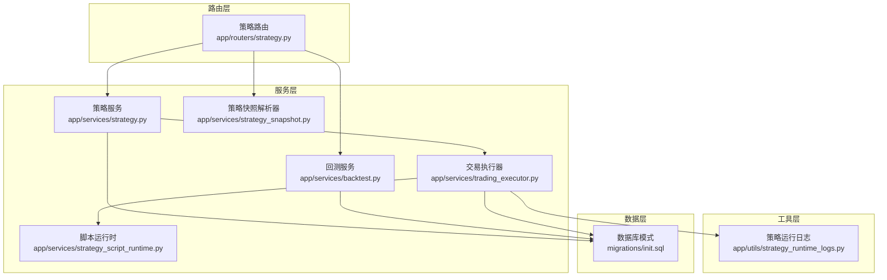
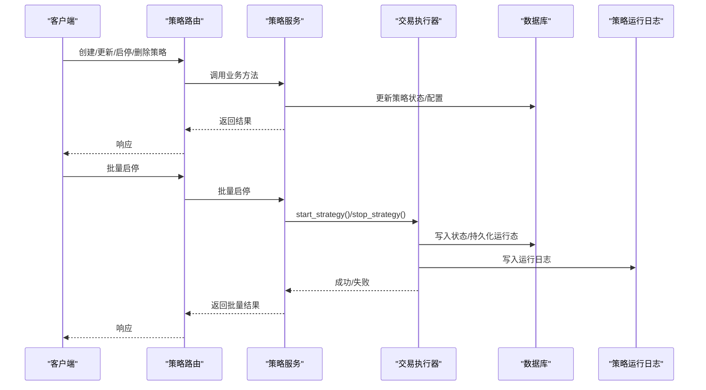
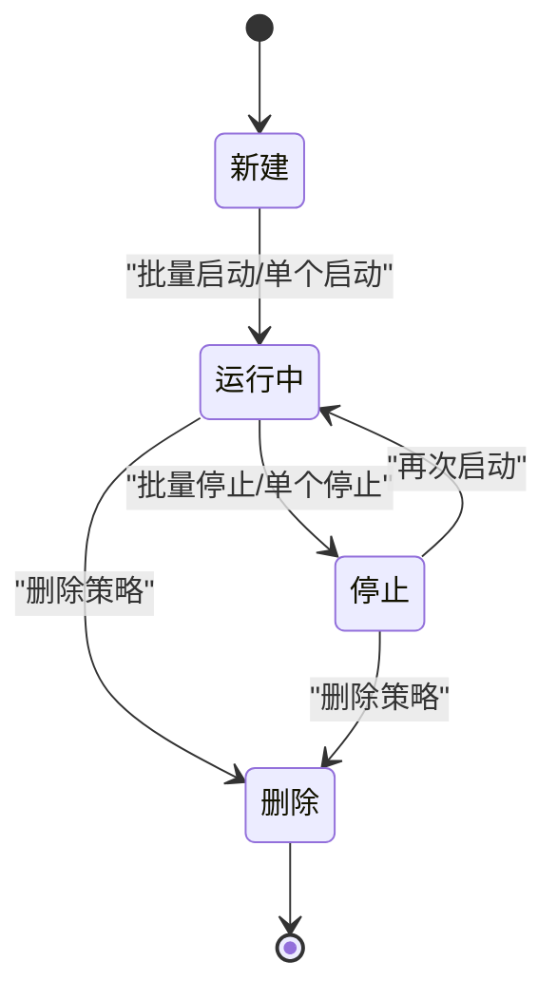
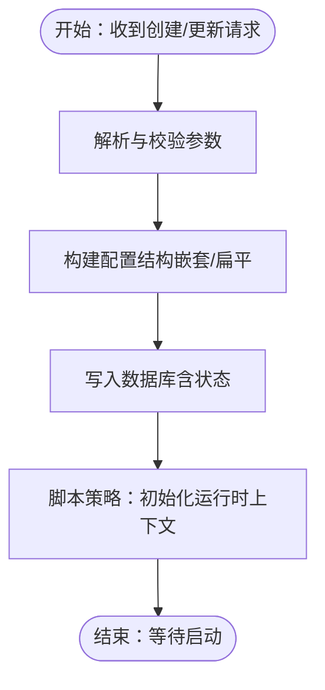
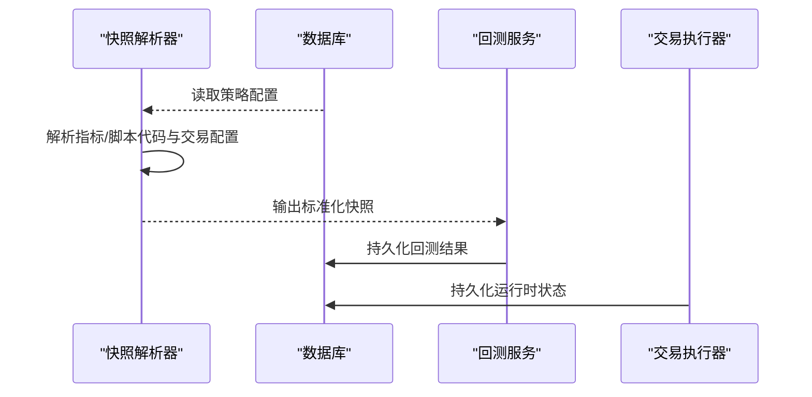
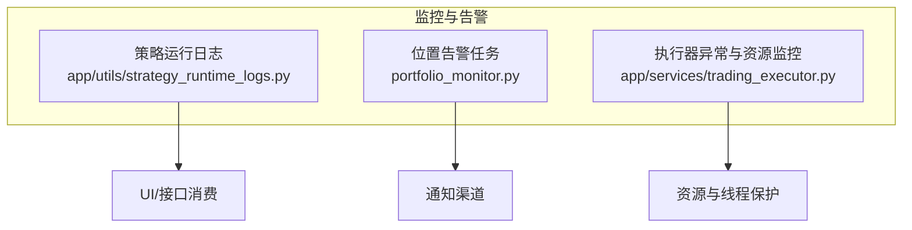
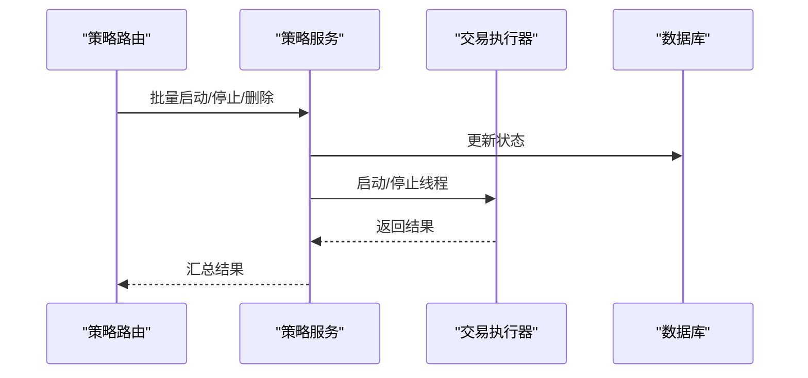
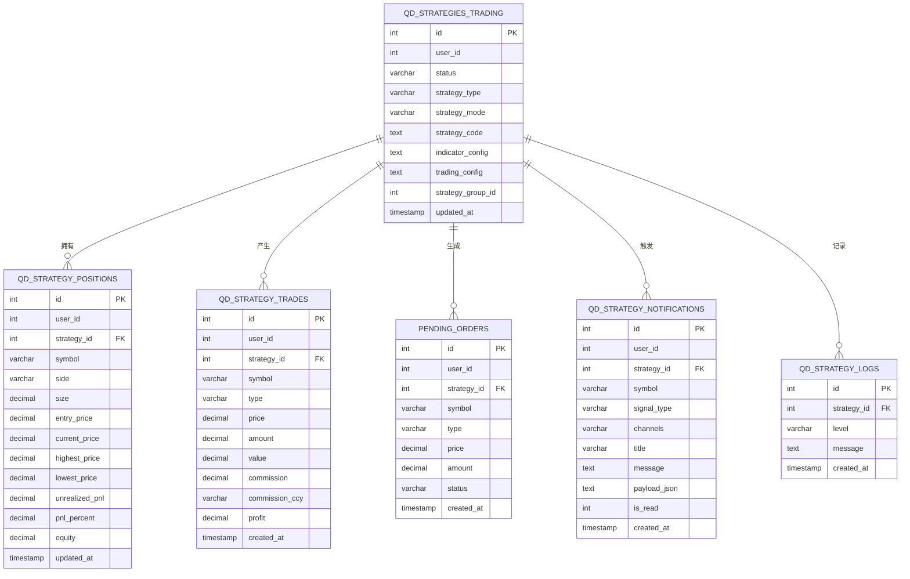
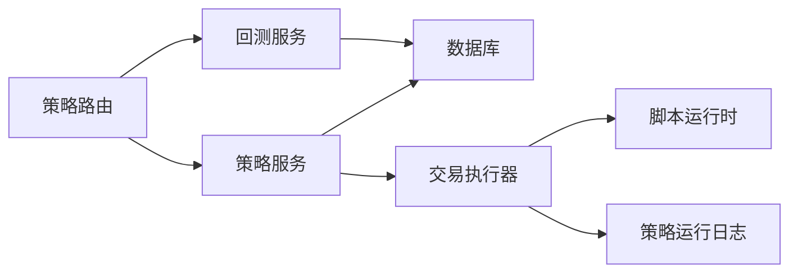

# 策略生命周期管理

<cite>
**本文档引用的文件**
- [backend_api_python/app/services/strategy.py](file://backend_api_python/app/services/strategy.py)
- [backend_api_python/app/services/strategy_snapshot.py](file://backend_api_python/app/services/strategy_snapshot.py)
- [backend_api_python/app/routers/strategy.py](file://backend_api_python/app/routers/strategy.py)
- [backend_api_python/app/services/trading_executor.py](file://backend_api_python/app/services/trading_executor.py)
- [backend_api_python/app/utils/strategy_runtime_logs.py](file://backend_api_python/app/utils/strategy_runtime_logs.py)
- [backend_api_python/backend_api_python/app/services/backtest.py](file://backend_api_python/app/services/backtest.py)
- [backend_api_python/backend_api_python/app/__init__.py](file://backend_api_python/app/__init__.py)
- [backend_api_python/migrations/init.sql](file://backend_api_python/migrations/init.sql)
</cite>

## 目录
1. [简介](#简介)
2. [项目结构](#项目结构)
3. [核心组件](#核心组件)
4. [架构总览](#架构总览)
5. [详细组件分析](#详细组件分析)
6. [依赖关系分析](#依赖关系分析)
7. [性能考量](#性能考量)
8. [故障排查指南](#故障排查指南)
9. [结论](#结论)
10. [附录](#附录)

## 简介
本指南面向量化交易系统中的策略生命周期管理，覆盖从策略创建、初始化、运行、监控、暂停、停止到销毁的全链路流程。重点阐述策略状态管理机制（新建、运行中、暂停、停止、删除）、策略快照与运行状态持久化、监控与告警、以及迁移、备份与版本升级操作建议。文档同时给出关键流程的可视化图示，帮助开发者与运维人员快速理解与落地。

## 项目结构
后端采用分层设计：路由层负责请求入口与鉴权，服务层封装业务逻辑（策略、回测、脚本运行时），工具层提供日志与数据库访问，执行器负责实时交易执行与信号生成。

**图表来源**
- [backend_api_python/app/routers/strategy.py:1-800](file://backend_api_python/app/routers/strategy.py#L1-L800)
- [backend_api_python/app/services/strategy.py:1-800](file://backend_api_python/app/services/strategy.py#L1-L800)
- [backend_api_python/app/services/backtest.py:1-800](file://backend_api_python/app/services/backtest.py#L1-L800)
- [backend_api_python/app/services/trading_executor.py:1-800](file://backend_api_python/app/services/trading_executor.py#L1-L800)
- [backend_api_python/app/services/strategy_snapshot.py:1-220](file://backend_api_python/app/services/strategy_snapshot.py#L1-L220)
- [backend_api_python/app/utils/strategy_runtime_logs.py:1-30](file://backend_api_python/app/utils/strategy_runtime_logs.py#L1-L30)
- [backend_api_python/migrations/init.sql:219-369](file://backend_api_python/migrations/init.sql#L219-L369)

**章节来源**
- [backend_api_python/app/routers/strategy.py:1-800](file://backend_api_python/app/routers/strategy.py#L1-L800)
- [backend_api_python/app/services/strategy.py:1-800](file://backend_api_python/app/services/strategy.py#L1-L800)
- [backend_api_python/migrations/init.sql:219-369](file://backend_api_python/migrations/init.sql#L219-L369)

## 核心组件
- 策略服务：提供策略的创建、查询、批量启停、状态更新、参数校验与展示等能力。
- 交易执行器：负责策略线程的启动/停止、K线拉取、信号生成、订单转换与持久化、运行时状态保存。
- 回测服务：提供回测引擎、多时间框架回测、结果持久化与历史查询。
- 策略快照解析器：将数据库中的策略配置解析为回测/执行所需的快照对象。
- 策略运行日志：将策略运行期日志写入数据库，供UI与API消费。
- 应用启动恢复：应用启动时自动恢复“运行中”策略的状态与线程。

**章节来源**
- [backend_api_python/app/services/strategy.py:1-800](file://backend_api_python/app/services/strategy.py#L1-L800)
- [backend_api_python/app/services/trading_executor.py:1-800](file://backend_api_python/app/services/trading_executor.py#L1-L800)
- [backend_api_python/app/services/backtest.py:1-800](file://backend_api_python/app/services/backtest.py#L1-L800)
- [backend_api_python/app/services/strategy_snapshot.py:1-220](file://backend_api_python/app/services/strategy_snapshot.py#L1-L220)
- [backend_api_python/app/utils/strategy_runtime_logs.py:1-30](file://backend_api_python/app/utils/strategy_runtime_logs.py#L1-L30)
- [backend_api_python/app/__init__.py:180-280](file://backend_api_python/app/__init__.py#L180-L280)

## 架构总览
策略生命周期由“路由-服务-执行器-数据库/日志”协同完成。策略状态以数据库字段为准，执行器负责线程生命周期与信号生成，回测服务提供离线验证，快照解析器统一配置格式。

**图表来源**
- [backend_api_python/app/routers/strategy.py:490-714](file://backend_api_python/app/routers/strategy.py#L490-L714)
- [backend_api_python/app/services/strategy.py:1139-1175](file://backend_api_python/app/services/strategy.py#L1139-L1175)
- [backend_api_python/app/services/trading_executor.py:395-496](file://backend_api_python/app/services/trading_executor.py#L395-L496)
- [backend_api_python/app/utils/strategy_runtime_logs.py:11-30](file://backend_api_python/app/utils/strategy_runtime_logs.py#L11-L30)

## 详细组件分析

### 策略状态管理与生命周期
- 状态定义与转换
  - 新建：策略创建后进入待运行状态（数据库字段初始值通常为“新建”或“待运行”，具体取决于迁移脚本）。
  - 运行中：通过批量启动接口或单个启动接口将状态置为“运行中”，并启动对应策略线程。
  - 暂停：当前实现主要通过“停止”接口将状态置为“停止”，策略线程退出；如需“暂停/恢复”的细粒度控制，可在执行器层面扩展。
  - 停止：将状态置为“停止”，并从执行器运行列表移除。
  - 删除：删除策略前先停止执行器线程，再删除数据库记录。

- 状态持久化与一致性
  - 状态更新通过策略服务统一入口进行，保证数据库事务与错误处理一致。
  - 应用启动时会扫描“运行中”策略并尝试恢复，若恢复失败则回写为“停止”。

**图表来源**
- [backend_api_python/app/services/strategy.py:626-646](file://backend_api_python/app/services/strategy.py#L626-L646)
- [backend_api_python/app/services/strategy.py:1139-1175](file://backend_api_python/app/services/strategy.py#L1139-L1175)
- [backend_api_python/app/services/trading_executor.py:457-496](file://backend_api_python/app/services/trading_executor.py#L457-L496)
- [backend_api_python/app/__init__.py:180-211](file://backend_api_python/app/__init__.py#L180-L211)

**章节来源**
- [backend_api_python/app/services/strategy.py:626-646](file://backend_api_python/app/services/strategy.py#L626-L646)
- [backend_api_python/app/services/strategy.py:1139-1175](file://backend_api_python/app/services/strategy.py#L1139-L1175)
- [backend_api_python/app/services/trading_executor.py:457-496](file://backend_api_python/app/services/trading_executor.py#L457-L496)
- [backend_api_python/app/__init__.py:180-211](file://backend_api_python/app/__init__.py#L180-L211)

### 策略初始化与参数配置
- 初始化流程
  - 路由层接收创建/更新请求，调用策略服务。
  - 策略服务解析并校验参数，必要时进行类型转换与默认值填充。
  - 将策略配置写入数据库，状态初始为“新建/待运行”。

- 参数配置要点
  - 交易配置（如止盈止损、加仓/减仓规则、网格/定投参数等）通过统一的构建函数转换为嵌套结构，便于回测与执行器复用。
  - 脚本策略的运行时状态（如参数字典、最后闭合K线时间）会持久化到策略配置中，以便重启后恢复。

**图表来源**
- [backend_api_python/app/routers/strategy.py:490-543](file://backend_api_python/app/routers/strategy.py#L490-L543)
- [backend_api_python/app/services/strategy.py:1323-1356](file://backend_api_python/app/services/strategy.py#L1323-L1356)
- [backend_api_python/app/services/trading_executor.py:547-576](file://backend_api_python/app/services/trading_executor.py#L547-L576)

**章节来源**
- [backend_api_python/app/routers/strategy.py:490-543](file://backend_api_python/app/routers/strategy.py#L490-L543)
- [backend_api_python/app/services/strategy.py:1323-1356](file://backend_api_python/app/services/strategy.py#L1323-L1356)
- [backend_api_python/app/services/trading_executor.py:547-576](file://backend_api_python/app/services/trading_executor.py#L547-L576)

### 策略快照与运行状态持久化
- 快照解析
  - 快照解析器将数据库中的策略配置（指标/脚本代码、交易配置、风险/规模配置等）转换为回测/执行所需的标准化快照。
  - 支持跨市场/跨品种/跨周期的参数覆盖与默认值推断。

- 运行状态持久化
  - 脚本策略的运行时状态（如参数字典、最后闭合K线时间）会写入策略的交易配置字段，重启后可恢复。
  - 回测服务将回测结果与中间曲线持久化至数据库，便于历史查询与对比。

**图表来源**
- [backend_api_python/app/services/strategy_snapshot.py:116-220](file://backend_api_python/app/services/strategy_snapshot.py#L116-L220)
- [backend_api_python/app/services/backtest.py:233-343](file://backend_api_python/app/services/backtest.py#L233-L343)
- [backend_api_python/app/services/trading_executor.py:577-614](file://backend_api_python/app/services/trading_executor.py#L577-L614)

**章节来源**
- [backend_api_python/app/services/strategy_snapshot.py:116-220](file://backend_api_python/app/services/strategy_snapshot.py#L116-L220)
- [backend_api_python/app/services/backtest.py:233-343](file://backend_api_python/app/services/backtest.py#L233-L343)
- [backend_api_python/app/services/trading_executor.py:577-614](file://backend_api_python/app/services/trading_executor.py#L577-L614)

### 监控与告警机制
- 运行日志
  - 策略运行日志通过专用工具写入数据库表，供UI与API消费，便于追踪策略行为与异常。
- 位置告警
  - 位置监控任务可基于价格/PnL阈值触发告警，支持重复间隔控制与多种通知渠道（邮件/电报等）。
- 性能与异常检测
  - 执行器内置线程上限与资源状态打印，避免过度创建线程导致系统不可用。
  - 脚本运行时异常会被捕获并记录，不影响整体系统稳定性。

**图表来源**
- [backend_api_python/app/utils/strategy_runtime_logs.py:11-30](file://backend_api_python/app/utils/strategy_runtime_logs.py#L11-L30)
- [backend_api_python/app/services/trading_executor.py:149-176](file://backend_api_python/app/services/trading_executor.py#L149-L176)

**章节来源**
- [backend_api_python/app/utils/strategy_runtime_logs.py:11-30](file://backend_api_python/app/utils/strategy_runtime_logs.py#L11-L30)
- [backend_api_python/app/services/trading_executor.py:149-176](file://backend_api_python/app/services/trading_executor.py#L149-L176)

### 批量启停与删除流程
- 批量启动：先更新数据库状态为“运行中”，再启动执行器线程；失败时记录错误。
- 批量停止：先停止执行器线程，再更新数据库状态为“停止”。
- 批量删除：先停止执行器线程，再删除数据库记录。

**图表来源**
- [backend_api_python/app/routers/strategy.py:545-679](file://backend_api_python/app/routers/strategy.py#L545-L679)
- [backend_api_python/app/services/strategy.py:1139-1175](file://backend_api_python/app/services/strategy.py#L1139-L1175)
- [backend_api_python/app/services/trading_executor.py:395-496](file://backend_api_python/app/services/trading_executor.py#L395-L496)

**章节来源**
- [backend_api_python/app/routers/strategy.py:545-679](file://backend_api_python/app/routers/strategy.py#L545-L679)
- [backend_api_python/app/services/strategy.py:1139-1175](file://backend_api_python/app/services/strategy.py#L1139-L1175)
- [backend_api_python/app/services/trading_executor.py:395-496](file://backend_api_python/app/services/trading_executor.py#L395-L496)

### 数据模型与索引
- 关键表与字段
  - 策略主表：包含用户ID、状态、策略类型/模式、代码、配置、组ID等。
  - 交易与持仓：记录每笔交易与当前持仓状态。
  - 待执行订单队列：记录待执行订单。
  - 策略通知与运行日志：记录通知与运行日志。
- 索引
  - 对用户ID、状态、组ID、策略ID等建立索引，提升查询效率。

**图表来源**
- [backend_api_python/migrations/init.sql:219-369](file://backend_api_python/migrations/init.sql#L219-L369)

**章节来源**
- [backend_api_python/migrations/init.sql:219-369](file://backend_api_python/migrations/init.sql#L219-L369)

## 依赖关系分析
- 路由依赖服务：路由层仅负责参数解析与鉴权，核心逻辑委托给策略服务。
- 策略服务依赖数据库与执行器：状态更新与批量操作均依赖数据库；启动/停止依赖执行器。
- 执行器依赖回测/脚本运行时：脚本策略需要脚本运行时上下文；回测配置与执行器配置相互映射。
- 日志与监控：运行日志独立于业务逻辑，便于扩展与维护。

**图表来源**
- [backend_api_python/app/routers/strategy.py:1-800](file://backend_api_python/app/routers/strategy.py#L1-L800)
- [backend_api_python/app/services/strategy.py:1-800](file://backend_api_python/app/services/strategy.py#L1-L800)
- [backend_api_python/app/services/trading_executor.py:1-800](file://backend_api_python/app/services/trading_executor.py#L1-L800)
- [backend_api_python/app/services/backtest.py:1-800](file://backend_api_python/app/services/backtest.py#L1-L800)
- [backend_api_python/app/utils/strategy_runtime_logs.py:1-30](file://backend_api_python/app/utils/strategy_runtime_logs.py#L1-L30)

**章节来源**
- [backend_api_python/app/routers/strategy.py:1-800](file://backend_api_python/app/routers/strategy.py#L1-L800)
- [backend_api_python/app/services/strategy.py:1-800](file://backend_api_python/app/services/strategy.py#L1-L800)
- [backend_api_python/app/services/trading_executor.py:1-800](file://backend_api_python/app/services/trading_executor.py#L1-L800)
- [backend_api_python/app/services/backtest.py:1-800](file://backend_api_python/app/services/backtest.py#L1-L800)
- [backend_api_python/app/utils/strategy_runtime_logs.py:1-30](file://backend_api_python/app/utils/strategy_runtime_logs.py#L1-L30)

## 性能考量
- 线程与资源限制
  - 执行器设置最大线程数，避免无限制创建线程导致系统资源耗尽。
  - 提供资源状态打印，便于定位问题。
- 缓存与去重
  - 执行器内置价格缓存与信号去重，减少重复下单与外部调用。
- 回测性能
  - 多时间框架回测根据日期范围自动选择执行时间框架，避免高精度回测超时。
- 数据库索引
  - 针对高频查询字段建立索引，降低查询延迟。

**章节来源**
- [backend_api_python/app/services/trading_executor.py:40-70](file://backend_api_python/app/services/trading_executor.py#L40-L70)
- [backend_api_python/app/services/backtest.py:170-225](file://backend_api_python/app/services/backtest.py#L170-L225)
- [backend_api_python/migrations/init.sql:219-225](file://backend_api_python/migrations/init.sql#L219-L225)

## 故障排查指南
- 启动失败
  - 检查线程上限与资源状态；查看最近一次启动失败原因。
- 策略无法停止
  - 确认数据库状态是否已更新为“停止”，并检查执行器运行列表是否清理。
- 日志缺失
  - 确认运行日志写入是否成功，关注异常捕获与降级处理。
- 回测异常
  - 检查时间范围限制与数据可用性；确认配置快照是否正确。

**章节来源**
- [backend_api_python/app/services/trading_executor.py:40-70](file://backend_api_python/app/services/trading_executor.py#L40-L70)
- [backend_api_python/app/services/trading_executor.py:457-496](file://backend_api_python/app/services/trading_executor.py#L457-L496)
- [backend_api_python/app/utils/strategy_runtime_logs.py:11-30](file://backend_api_python/app/utils/strategy_runtime_logs.py#L11-L30)
- [backend_api_python/app/services/backtest.py:444-554](file://backend_api_python/app/services/backtest.py#L444-L554)

## 结论
本指南梳理了策略生命周期的全链路流程，明确了状态管理、快照与持久化、监控与告警、以及批量启停与删除的关键实现点。通过统一的服务层与清晰的组件边界，系统实现了策略从创建到销毁的可控与可观测。建议在生产环境中结合日志与告警体系，持续优化线程与缓存策略，确保系统稳定与高性能。

## 附录
- 操作建议
  - 迁移：变更数据库结构时，遵循迁移脚本顺序，确保索引与字段存在。
  - 备份：定期导出策略配置与回测结果，保留配置快照。
  - 版本升级：升级前先批量停止策略，升级后恢复运行并验证。

**章节来源**
- [backend_api_python/migrations/init.sql:219-369](file://backend_api_python/migrations/init.sql#L219-L369)
- [backend_api_python/app/routers/strategy.py:545-679](file://backend_api_python/app/routers/strategy.py#L545-L679)
- [backend_api_python/app/__init__.py:180-211](file://backend_api_python/app/__init__.py#L180-L211)