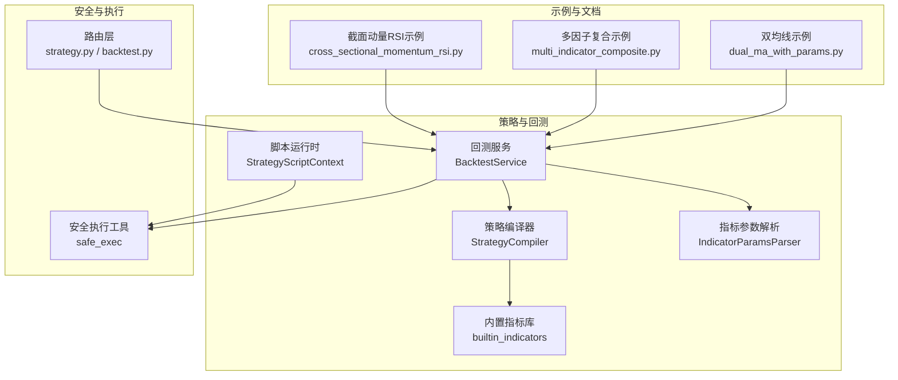
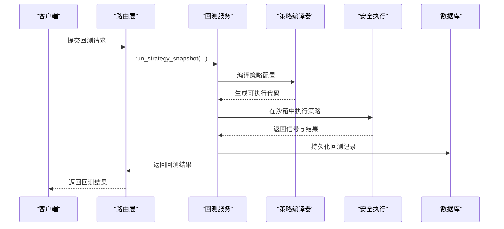
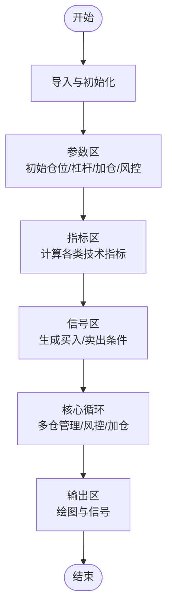
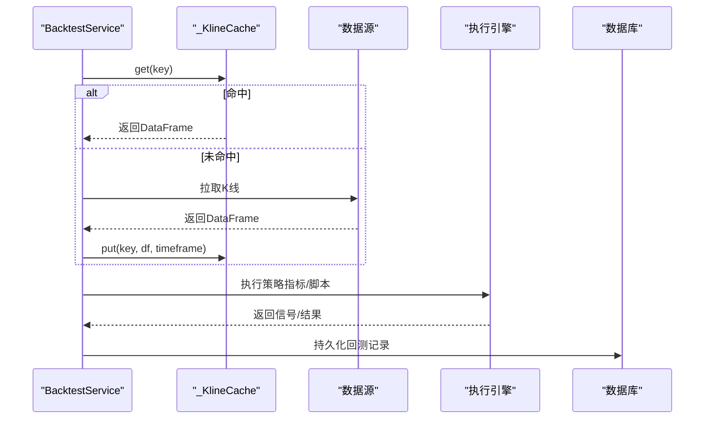
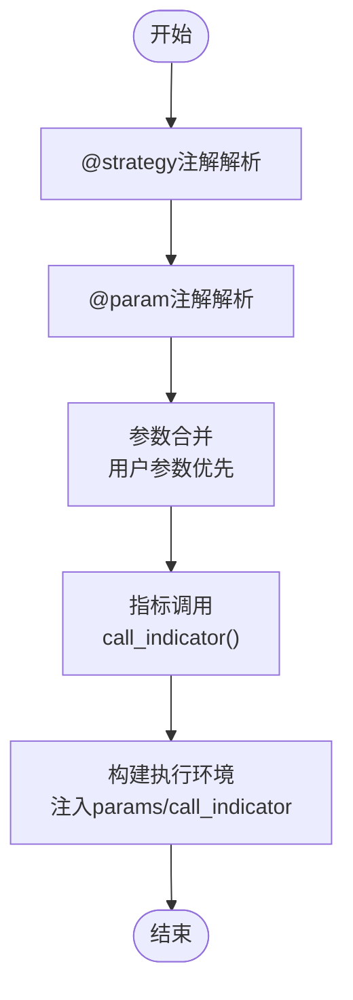
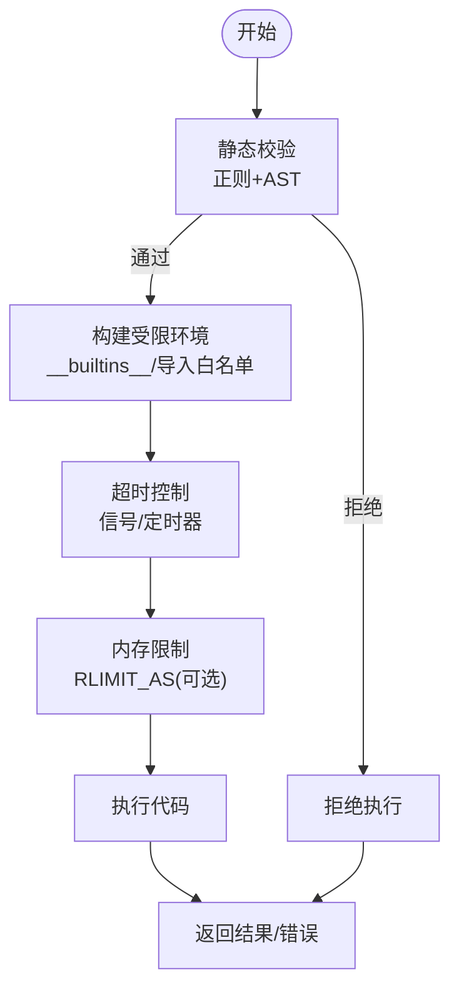
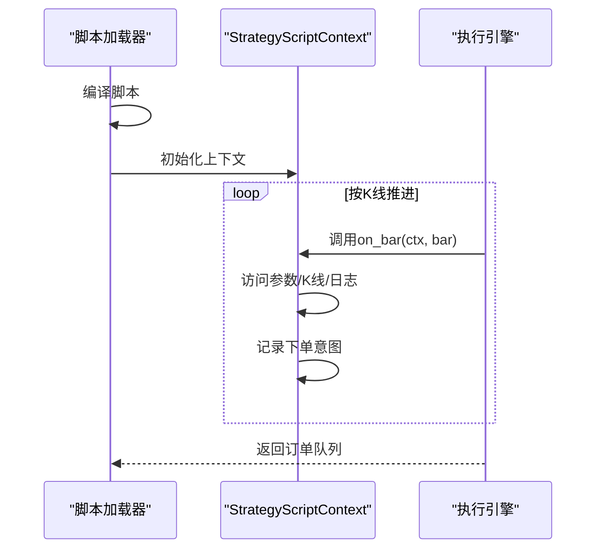
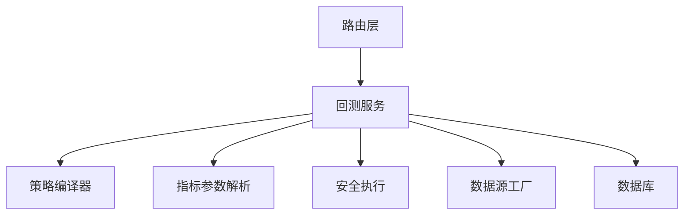

# IndicatorStrategy数据框策略

<cite>
**本文引用的文件**
- [strategy_compiler.py](file://backend_api_python/app/services/strategy_compiler.py)
- [backtest.py](file://backend_api_python/app/services/backtest.py)
- [indicator_params.py](file://backend_api_python/app/services/indicator_params.py)
- [builtin_indicators.py](file://backend_api_python/app/services/builtin_indicators.py)
- [strategy_script_runtime.py](file://backend_api_python/app/services/strategy_script_runtime.py)
- [safe_exec.py](file://backend_api_python/app/utils/safe_exec.py)
- [multi_indicator_composite.py](file://docs/examples/multi_indicator_composite.py)
- [dual_ma_with_params.py](file://docs/examples/dual_ma_with_params.py)
- [cross_sectional_momentum_rsi.py](file://docs/examples/cross_sectional_momentum_rsi.py)
- [strategy.py](file://backend_api_python/app/routes/strategy.py)
- [backtest.py](file://backend_api_python/app/routes/backtest.py)
</cite>

## 目录
1. [简介](#简介)
2. [项目结构](#项目结构)
3. [核心组件](#核心组件)
4. [架构总览](#架构总览)
5. [详细组件分析](#详细组件分析)
6. [依赖分析](#依赖分析)
7. [性能考虑](#性能考虑)
8. [故障排查指南](#故障排查指南)
9. [结论](#结论)
10. [附录](#附录)

## 简介
本文件面向IndicatorStrategy数据框策略的开发者与使用者，系统性阐述基于pandas DataFrame的数据框策略开发模式，覆盖策略生命周期、数据处理流程、性能优化、内置指标函数、自定义技术指标与多标的组合策略。同时详解策略编译器如何将Python代码转换为可执行的策略引擎，以及安全执行机制、沙箱环境与资源限制。最后提供最佳实践、性能调优建议与常见问题解决方案。

## 项目结构
围绕IndicatorStrategy的核心模块包括：
- 策略编译器：将配置转化为可执行的策略代码，内置多种技术指标与信号逻辑。
- 回测服务：负责加载K线数据、执行策略、生成回测报告与持久化。
- 指标参数解析：支持@strategy与@param注解，解析策略配置与参数声明。
- 内置指标库：提供示例型RSI、双均线、MACD、布林带等策略模板。
- 安全执行：构建受限的执行环境，保障代码安全与资源控制。
- 路由层：对外暴露策略与回测API，统一入口与鉴权。

**图表来源**
- [strategy_compiler.py:1-689](file://backend_api_python/app/services/strategy_compiler.py#L1-L689)
- [backtest.py:64-4974](file://backend_api_python/app/services/backtest.py#L64-L4974)
- [indicator_params.py:1-380](file://backend_api_python/app/services/indicator_params.py#L1-L380)
- [builtin_indicators.py:1-250](file://backend_api_python/app/services/builtin_indicators.py#L1-L250)
- [strategy_script_runtime.py:1-191](file://backend_api_python/app/services/strategy_script_runtime.py#L1-L191)
- [safe_exec.py:1-471](file://backend_api_python/app/utils/safe_exec.py#L1-L471)
- [strategy.py:1-2014](file://backend_api_python/app/routes/strategy.py#L1-L2014)
- [backtest.py:1-829](file://backend_api_python/app/routes/backtest.py#L1-L829)

**章节来源**
- [strategy_compiler.py:1-689](file://backend_api_python/app/services/strategy_compiler.py#L1-L689)
- [backtest.py:64-4974](file://backend_api_python/app/services/backtest.py#L64-L4974)
- [indicator_params.py:1-380](file://backend_api_python/app/services/indicator_params.py#L1-L380)
- [builtin_indicators.py:1-250](file://backend_api_python/app/services/builtin_indicators.py#L1-L250)
- [strategy_script_runtime.py:1-191](file://backend_api_python/app/services/strategy_script_runtime.py#L1-L191)
- [safe_exec.py:1-471](file://backend_api_python/app/utils/safe_exec.py#L1-L471)
- [strategy.py:1-2014](file://backend_api_python/app/routes/strategy.py#L1-L2014)
- [backtest.py:1-829](file://backend_api_python/app/routes/backtest.py#L1-L829)

## 核心组件
- 策略编译器（StrategyCompiler）
  - 将策略配置JSON编译为可执行的Python代码，内置多种技术指标与信号逻辑，支持输出绘图配置与信号列。
- 回测服务（BacktestService）
  - 负责K线缓存、多时间框架回测、执行策略脚本、生成回测结果与持久化。
- 指标参数解析（IndicatorParamsParser）
  - 解析@strategy与@param注解，合并用户参数与默认参数，支持指标间互相调用。
- 内置指标库（builtin_indicators）
  - 提供RSI、双均线、MACD、布林带等示例策略代码，便于快速上手。
- 安全执行（safe_exec）
  - 构建受限的__builtins__白名单、限制导入模块、超时与内存保护，支持子进程隔离。
- 脚本运行时（StrategyScriptContext）
  - 提供on_init/on_bar等回调的沙箱执行环境，支持参数、日志、下单意图记录。

**章节来源**
- [strategy_compiler.py:1-689](file://backend_api_python/app/services/strategy_compiler.py#L1-L689)
- [backtest.py:64-4974](file://backend_api_python/app/services/backtest.py#L64-L4974)
- [indicator_params.py:1-380](file://backend_api_python/app/services/indicator_params.py#L1-L380)
- [builtin_indicators.py:1-250](file://backend_api_python/app/services/builtin_indicators.py#L1-L250)
- [safe_exec.py:1-471](file://backend_api_python/app/utils/safe_exec.py#L1-L471)
- [strategy_script_runtime.py:1-191](file://backend_api_python/app/services/strategy_script_runtime.py#L1-L191)

## 架构总览
IndicatorStrategy采用“配置驱动 + 编译 + 沙箱执行”的架构。策略配置经编译器生成可执行代码，回测服务加载K线数据并执行，安全执行工具确保代码在受控环境中运行，最终输出信号与可视化配置。

**图表来源**
- [strategy.py:295-441](file://backend_api_python/app/routes/strategy.py#L295-L441)
- [backtest.py:376-401](file://backend_api_python/app/routes/backtest.py#L376-L401)
- [backtest.py:64-4974](file://backend_api_python/app/services/backtest.py#L64-L4974)
- [strategy_compiler.py:1-689](file://backend_api_python/app/services/strategy_compiler.py#L1-L689)
- [safe_exec.py:157-244](file://backend_api_python/app/utils/safe_exec.py#L157-L244)

## 详细组件分析

### 策略编译器（StrategyCompiler）
- 功能要点
  - 导入与初始化：注入pandas/numpy与安全辅助函数。
  - 参数区：支持初始仓位、杠杆、加仓规则与风控参数。
  - 指标区：内置超趋势、EMA、RSI、MACD、布林带、KDJ、MA等指标计算。
  - 信号区：将指标条件映射为买入/卖出信号。
  - 核心循环：实现多仓管理、止盈止损、追踪止损与加仓逻辑。
  - 输出区：生成绘图配置与信号序列。
- 关键流程
  - 读取配置，拼接代码段。
  - 生成指标列与信号列。
  - 生成回测循环，填充开平仓信号与价格。
  - 生成输出结构，包含图表与信号。

**图表来源**
- [strategy_compiler.py:37-689](file://backend_api_python/app/services/strategy_compiler.py#L37-L689)

**章节来源**
- [strategy_compiler.py:1-689](file://backend_api_python/app/services/strategy_compiler.py#L1-L689)

### 回测服务（BacktestService）
- 功能要点
  - K线缓存：按时间框架与TTL缓存，减少重复拉取。
  - 多时间框架：根据回测区间自动选择1m/5m执行时间框架。
  - 执行策略：支持两种策略模式：
    - 指标策略：执行用户提供的指标代码，生成buy/sell或四象限信号。
    - 策略脚本：执行on_init/on_bar等回调，支持下单意图。
  - 结果持久化：回测交易、权益曲线等结构化存储。
- 关键流程
  - 解析参数与策略配置。
  - 加载K线数据并缓存。
  - 执行策略代码或脚本。
  - 生成回测统计与可视化数据。

**图表来源**
- [backtest.py:25-61](file://backend_api_python/app/services/backtest.py#L25-L61)
- [backtest.py:170-225](file://backend_api_python/app/services/backtest.py#L170-L225)
- [backtest.py:233-325](file://backend_api_python/app/services/backtest.py#L233-L325)

**章节来源**
- [backtest.py:64-4974](file://backend_api_python/app/services/backtest.py#L64-L4974)

### 指标参数解析（IndicatorParamsParser）
- 功能要点
  - @strategy注解解析：支持止损、止盈、入场比例、追踪止损、交易方向等。
  - @param注解解析：支持int/float/bool/str类型，默认值与描述。
  - 参数合并：用户传参优先于默认参数。
  - 指标调用：支持call_indicator按ID或名称调用其他指标，具备调用深度与循环依赖保护。
- 关键流程
  - 解析代码中的@strategy与@params。
  - 合并用户参数与默认参数。
  - 生成执行环境，注入params与call_indicator。

**图表来源**
- [indicator_params.py:26-380](file://backend_api_python/app/services/indicator_params.py#L26-L380)

**章节来源**
- [indicator_params.py:1-380](file://backend_api_python/app/services/indicator_params.py#L1-L380)

### 内置指标库（builtin_indicators）
- 功能要点
  - 提供RSI、双均线、MACD、布林带等示例策略代码。
  - 以“边缘触发”方式生成买卖信号，避免重复开仓。
  - 输出包含图表与信号标记点。
- 使用建议
  - 作为模板快速迭代，注意参数化与风控配置。

**章节来源**
- [builtin_indicators.py:1-250](file://backend_api_python/app/services/builtin_indicators.py#L1-L250)

### 安全执行（safe_exec）
- 功能要点
  - 白名单内置函数与允许导入模块，禁用危险操作。
  - 超时控制：Unix主线程使用SIGALRM，非主线程使用定时器+异步异常注入。
  - 内存限制：可选RLIMIT_AS限制子进程内存。
  - 子进程隔离：通过multiprocessing在独立进程中执行，崩溃不影响主进程。
- 关键流程
  - 静态校验：正则+AST双重检查，拒绝危险模式。
  - 构建受限环境：__builtins__白名单、__import__限制。
  - 执行与回收：超时/内存/异常捕获，返回结果字典。

**图表来源**
- [safe_exec.py:358-471](file://backend_api_python/app/utils/safe_exec.py#L358-L471)
- [safe_exec.py:157-244](file://backend_api_python/app/utils/safe_exec.py#L157-L244)

**章节来源**
- [safe_exec.py:1-471](file://backend_api_python/app/utils/safe_exec.py#L1-L471)

### 脚本运行时（StrategyScriptContext）
- 功能要点
  - 提供on_init/on_bar回调的沙箱环境。
  - 支持参数读取、K线窗口访问、日志记录与下单意图（buy/sell/close_position）。
  - 位置状态管理：开仓、加仓、减仓与清仓。
- 关键流程
  - 编译脚本：校验并编译on_init/on_bar。
  - 执行循环：按K线推进，触发on_bar回调。
  - 订单收集：将下单意图写入队列，供后续执行。

**图表来源**
- [strategy_script_runtime.py:159-191](file://backend_api_python/app/services/strategy_script_runtime.py#L159-L191)
- [strategy_script_runtime.py:114-158](file://backend_api_python/app/services/strategy_script_runtime.py#L114-L158)

**章节来源**
- [strategy_script_runtime.py:1-191](file://backend_api_python/app/services/strategy_script_runtime.py#L1-L191)

### API与路由
- 策略路由（strategy.py）
  - 列举/创建/更新/批量启停/历史回放等策略管理接口。
  - 策略代码质量检测：缺失函数、参数声明、下单意图等提示。
- 回测路由（backtest.py）
  - 提交回测任务、查询回测历史、精度信息等。
  - 自动选择执行时间框架（1m/5m），限制回测区间。

**章节来源**
- [strategy.py:1-2014](file://backend_api_python/app/routes/strategy.py#L1-L2014)
- [backtest.py:1-829](file://backend_api_python/app/routes/backtest.py#L1-L829)

## 依赖分析
- 组件耦合
  - BacktestService依赖StrategyCompiler与IndicatorParamsParser，用于策略编译与参数解析。
  - BacktestService依赖safe_exec进行安全执行。
  - 路由层依赖BacktestService与StrategyService，提供统一入口。
- 外部依赖
  - pandas/numpy用于数据处理与指标计算。
  - 数据源工厂用于拉取K线数据并缓存。
  - 数据库存储回测结果与持久化。

**图表来源**
- [backtest.py:64-4974](file://backend_api_python/app/services/backtest.py#L64-L4974)
- [strategy_compiler.py:1-689](file://backend_api_python/app/services/strategy_compiler.py#L1-L689)
- [indicator_params.py:1-380](file://backend_api_python/app/services/indicator_params.py#L1-L380)
- [safe_exec.py:1-471](file://backend_api_python/app/utils/safe_exec.py#L1-L471)

**章节来源**
- [backtest.py:64-4974](file://backend_api_python/app/services/backtest.py#L64-L4974)

## 性能考虑
- 指标计算
  - 优先使用向量化运算（rolling/ewm），避免显式循环。
  - 合理设置指标周期，避免过长导致计算量与内存占用上升。
- 数据加载
  - 利用K线缓存减少重复拉取，合理设置TTL。
  - 多时间框架回测时，根据区间自动选择1m/5m，平衡精度与性能。
- 执行安全
  - 设置合理的超时与内存上限，防止长时间卡顿或内存溢出。
  - 子进程隔离适用于极端风险代码，但会增加进程开销。
- 回测统计
  - 仅在必要时生成可视化数据，避免冗余序列导出。

[本节为通用指导，无需特定文件引用]

## 故障排查指南
- 代码安全校验失败
  - 现象：提示“危险代码模式/不允许导入模块/危险函数调用”。
  - 排查：检查是否使用了禁止的内置/模块/函数，遵循白名单。
  - 参考：[safe_exec.py:358-471](file://backend_api_python/app/utils/safe_exec.py#L358-L471)
- 超时/内存不足
  - 现象：执行超时或内存不足错误。
  - 排查：缩短指标周期、减少数据长度、降低复杂度；调整超时与内存限制。
  - 参考：[safe_exec.py:157-244](file://backend_api_python/app/utils/safe_exec.py#L157-L244)
- 回测区间过大
  - 现象：提示回测范围超出限制。
  - 排查：根据时间框架调整区间，或切换到更高精度的时间框架。
  - 参考：[backtest.py:170-225](file://backend_api_python/app/services/backtest.py#L170-L225)
- 策略脚本缺失必要函数
  - 现象：提示缺失on_init/on_bar或未检测到下单意图。
  - 排查：确保脚本包含on_bar回调，必要时添加on_init；使用ctx.buy/sell/close_position表达意图。
  - 参考：[strategy.py:67-122](file://backend_api_python/app/routes/strategy.py#L67-L122), [strategy_script_runtime.py:159-191](file://backend_api_python/app/services/strategy_script_runtime.py#L159-L191)

**章节来源**
- [safe_exec.py:157-244](file://backend_api_python/app/utils/safe_exec.py#L157-L244)
- [safe_exec.py:358-471](file://backend_api_python/app/utils/safe_exec.py#L358-L471)
- [backtest.py:170-225](file://backend_api_python/app/services/backtest.py#L170-L225)
- [strategy.py:67-122](file://backend_api_python/app/routes/strategy.py#L67-L122)
- [strategy_script_runtime.py:159-191](file://backend_api_python/app/services/strategy_script_runtime.py#L159-L191)

## 结论
IndicatorStrategy通过“配置驱动 + 编译 + 沙箱执行”的模式，实现了从策略设计到回测执行的闭环。策略编译器提供丰富的技术指标与信号逻辑，回测服务兼顾性能与准确性，安全执行工具保障运行时安全。结合内置指标与参数解析能力，开发者可以快速构建稳健的多因子复合策略，并在受控环境中进行验证与优化。

[本节为总结，无需特定文件引用]

## 附录

### 基于pandas的数据框策略开发模式
- 生命周期
  - 设计阶段：编写@strategy与@params注解，定义参数与风控。
  - 编译阶段：策略编译器生成指标列与信号列。
  - 执行阶段：回测服务加载K线并执行策略，生成信号与可视化。
  - 优化阶段：根据回测结果调整参数与逻辑。
- 数据处理流程
  - 输入：K线DataFrame（open/high/low/close/volume/time）。
  - 处理：指标计算、信号生成、风控与加仓逻辑。
  - 输出：buy/sell或四象限信号，绘图配置与回测统计。

**章节来源**
- [strategy_compiler.py:1-689](file://backend_api_python/app/services/strategy_compiler.py#L1-L689)
- [backtest.py:64-4974](file://backend_api_python/app/services/backtest.py#L64-L4974)

### 内置指标函数与自定义技术指标
- 内置指标
  - RSI、EMA、MACD、布林带、KDJ、MA等，均以向量化方式实现。
- 自定义指标
  - 通过@params声明参数，使用pandas/numpy进行计算，返回df列供信号逻辑使用。
  - 可通过call_indicator调用其他指标，实现指标复用与组合。

**章节来源**
- [builtin_indicators.py:1-250](file://backend_api_python/app/services/builtin_indicators.py#L1-L250)
- [indicator_params.py:218-380](file://backend_api_python/app/services/indicator_params.py#L218-L380)

### 多标的组合策略
- 截面策略示例
  - 对多个标的分别计算动量与RSI，综合评分后排序，用于研究参考。
- 注意事项
  - 当前平台文档已明确cross_sectional不在主策略快照回测/实盘链路，建议作为研究参考。

**章节来源**
- [cross_sectional_momentum_rsi.py:1-71](file://docs/examples/cross_sectional_momentum_rsi.py#L1-L71)

### 完整代码示例路径
- 双均线交叉策略
  - 示例路径：[dual_ma_with_params.py:1-64](file://docs/examples/dual_ma_with_params.py#L1-L64)
- 多因子复合策略
  - 示例路径：[multi_indicator_composite.py:1-109](file://docs/examples/multi_indicator_composite.py#L1-L109)
- 截面动量RSI策略
  - 示例路径：[cross_sectional_momentum_rsi.py:1-71](file://docs/examples/cross_sectional_momentum_rsi.py#L1-L71)

**章节来源**
- [dual_ma_with_params.py:1-64](file://docs/examples/dual_ma_with_params.py#L1-L64)
- [multi_indicator_composite.py:1-109](file://docs/examples/multi_indicator_composite.py#L1-L109)
- [cross_sectional_momentum_rsi.py:1-71](file://docs/examples/cross_sectional_momentum_rsi.py#L1-L71)