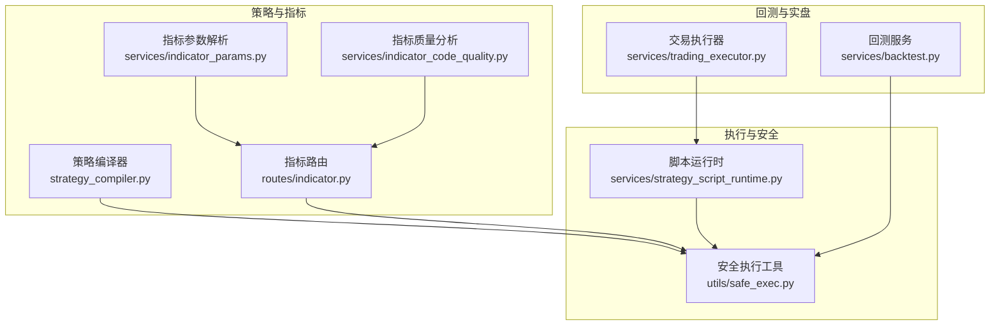
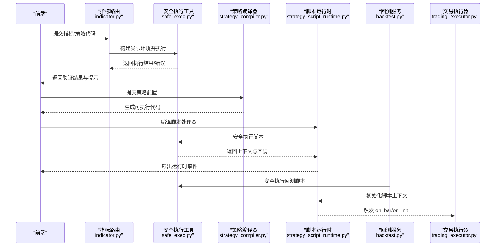
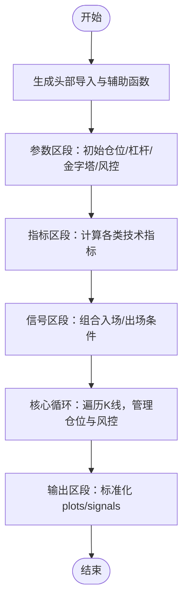
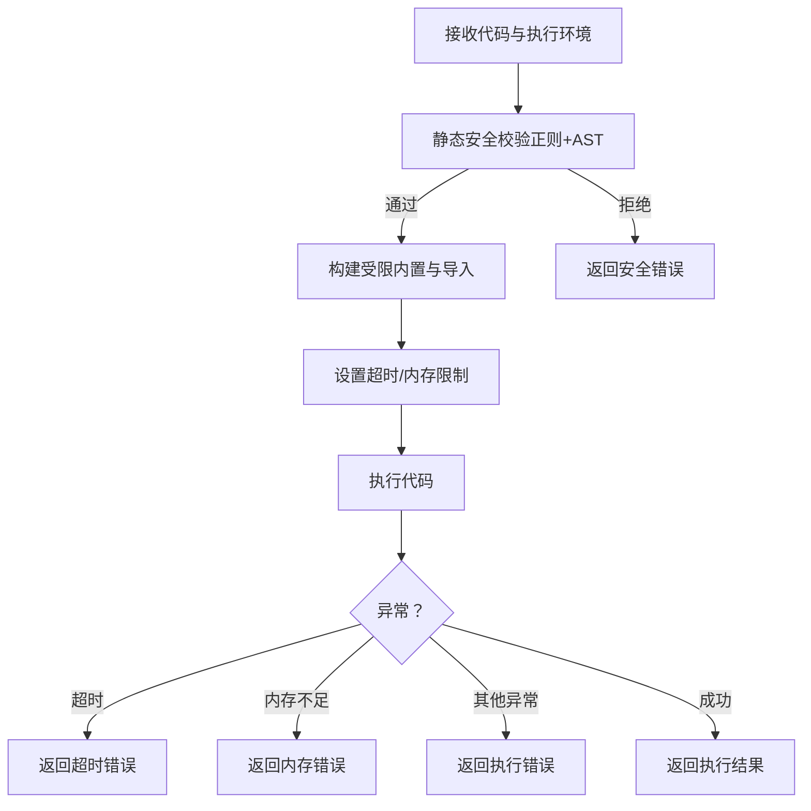
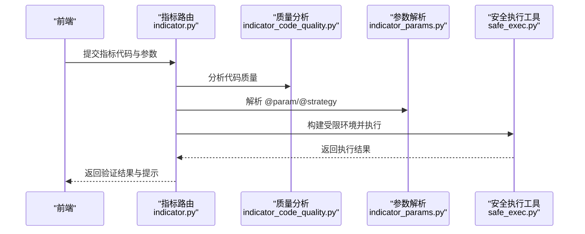
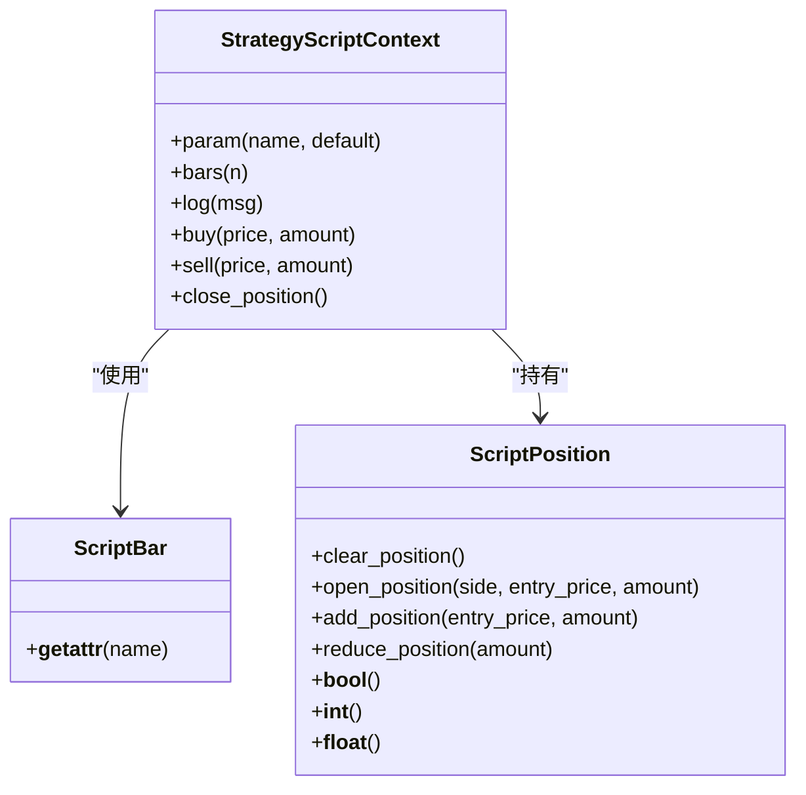
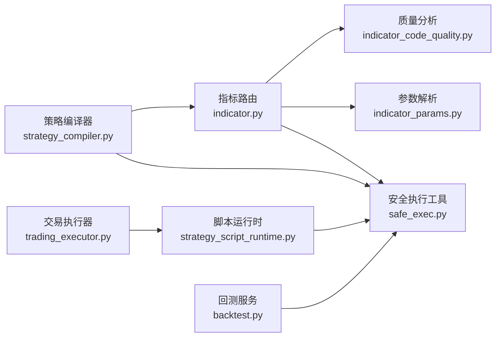

# 代码执行与沙箱环境

<cite>
**本文引用的文件**
- [strategy_compiler.py](file://backend_api_python/app/services/strategy_compiler.py)
- [safe_exec.py](file://backend_api_python/app/utils/safe_exec.py)
- [strategy_script_runtime.py](file://backend_api_python/app/services/strategy_script_runtime.py)
- [indicator.py](file://backend_api_python/app/routes/indicator.py)
- [indicator_params.py](file://backend_api_python/app/services/indicator_params.py)
- [indicator_code_quality.py](file://backend_api_python/app/services/indicator_code_quality.py)
- [backtest.py](file://backend_api_python/app/services/backtest.py)
- [trading_executor.py](file://backend_api_python/app/services/trading_executor.py)
</cite>

## 目录
1. [简介](#简介)
2. [项目结构](#项目结构)
3. [核心组件](#核心组件)
4. [架构总览](#架构总览)
5. [详细组件分析](#详细组件分析)
6. [依赖分析](#依赖分析)
7. [性能考虑](#性能考虑)
8. [故障排查指南](#故障排查指南)
9. [结论](#结论)
10. [附录](#附录)

## 简介
本文件围绕 IndicatorStrategy 的代码执行与沙箱环境展开，系统阐述策略编译器如何将用户定义的 Python 代码转换为可在安全环境中执行的可执行体，以及沙箱机制如何通过白名单内置函数、受限导入、超时与内存限制等手段保障系统安全。同时，文档覆盖代码执行生命周期（初始化、运行时监控、异常处理）、安全最佳实践（输入校验、错误处理、资源清理），并提供安全检查示例与常见漏洞防护建议。

## 项目结构
与 IndicatorStrategy 直接相关的后端模块主要分布在以下位置：
- 编译与执行：services/strategy_compiler.py、utils/safe_exec.py、services/strategy_script_runtime.py
- 指标与参数：routes/indicator.py、services/indicator_params.py、services/indicator_code_quality.py
- 回测与实盘：services/backtest.py、services/trading_executor.py

**图示来源**
- [strategy_compiler.py](file://backend_api_python/app/services/strategy_compiler.py)
- [safe_exec.py](file://backend_api_python/app/utils/safe_exec.py)
- [strategy_script_runtime.py](file://backend_api_python/app/services/strategy_script_runtime.py)
- [indicator.py](file://backend_api_python/app/routes/indicator.py)
- [indicator_params.py](file://backend_api_python/app/services/indicator_params.py)
- [indicator_code_quality.py](file://backend_api_python/app/services/indicator_code_quality.py)
- [backtest.py](file://backend_api_python/app/services/backtest.py)
- [trading_executor.py](file://backend_api_python/app/services/trading_executor.py)

**章节来源**
- [strategy_compiler.py](file://backend_api_python/app/services/strategy_compiler.py)
- [safe_exec.py](file://backend_api_python/app/utils/safe_exec.py)
- [strategy_script_runtime.py](file://backend_api_python/app/services/strategy_script_runtime.py)
- [indicator.py](file://backend_api_python/app/routes/indicator.py)
- [indicator_params.py](file://backend_api_python/app/services/indicator_params.py)
- [indicator_code_quality.py](file://backend_api_python/app/services/indicator_code_quality.py)
- [backtest.py](file://backend_api_python/app/services/backtest.py)
- [trading_executor.py](file://backend_api_python/app/services/trading_executor.py)

## 核心组件
- 策略编译器：将策略配置（参数、指标、信号规则、风控）转换为可执行的 Python 代码，生成输出结构（plots、signals）。
- 安全执行工具：提供白名单内置函数、受限导入、超时与内存限制、AST/正则双重安全校验、子进程隔离等能力。
- 指标路由与参数：负责指标代码的验证、参数解析、质量提示与输出结构校验。
- 脚本运行时：为 ScriptStrategy 提供上下文（参数、K线、订单、日志、持仓）与 on_init/on_bar 生命周期。
- 回测与实盘：在回测与实盘执行链路中注入安全执行环境，确保策略脚本在受控环境下运行。

**章节来源**
- [strategy_compiler.py](file://backend_api_python/app/services/strategy_compiler.py)
- [safe_exec.py](file://backend_api_python/app/utils/safe_exec.py)
- [indicator.py](file://backend_api_python/app/routes/indicator.py)
- [indicator_params.py](file://backend_api_python/app/services/indicator_params.py)
- [indicator_code_quality.py](file://backend_api_python/app/services/indicator_code_quality.py)
- [strategy_script_runtime.py](file://backend_api_python/app/services/strategy_script_runtime.py)
- [backtest.py](file://backend_api_python/app/services/backtest.py)
- [trading_executor.py](file://backend_api_python/app/services/trading_executor.py)

## 架构总览
下图展示了从指标/策略代码提交到安全执行的关键路径，以及与回测/实盘执行器的衔接。

**图示来源**
- [indicator.py](file://backend_api_python/app/routes/indicator.py)
- [safe_exec.py](file://backend_api_python/app/utils/safe_exec.py)
- [strategy_compiler.py](file://backend_api_python/app/services/strategy_compiler.py)
- [strategy_script_runtime.py](file://backend_api_python/app/services/strategy_script_runtime.py)
- [backtest.py](file://backend_api_python/app/services/backtest.py)
- [trading_executor.py](file://backend_api_python/app/services/trading_executor.py)

## 详细组件分析

### 策略编译器（StrategyCompiler）
- 功能职责
  - 接收策略配置（名称、入场规则、参数、加仓/金字塔、风控），生成可执行 Python 代码。
  - 自动生成指标计算、信号逻辑、核心循环（止盈止损、跟踪止损、加仓）与输出结构。
- 关键点
  - 头部导入与辅助函数（如数组越界安全访问）。
  - 参数区段：初始仓位、杠杆、金字塔参数、止损/止盈阈值。
  - 指标区段：支持多种技术指标（如 SuperTrend、EMA、RSI、MACD、布林带、KDJ、MA）。
  - 信号区段：基于规则组合布尔条件，生成原始买卖信号。
  - 核心循环：遍历K线，维护持仓状态、最高价/最低价、止盈/止损触发与加仓条件。
  - 输出区段：标准化 plots/signals 结构，便于前端渲染与回测消费。

**图示来源**
- [strategy_compiler.py](file://backend_api_python/app/services/strategy_compiler.py)

**章节来源**
- [strategy_compiler.py](file://backend_api_python/app/services/strategy_compiler.py)

### 安全执行工具（safe_exec）
- 安全白名单与受限导入
  - 仅允许纯计算型内置函数，禁用 eval/exec/open/getattr/type 等高危能力。
  - 仅允许有限模块导入（如 numpy/pandas/math/json/time/collections 等）。
- 双重安全校验
  - 正则扫描：识别危险模式（os.system、__import__、eval/exec 等）。
  - AST 校验：禁止危险导入、函数调用与属性访问（如 __builtins__/__import__/globals 等）。
- 超时与内存限制
  - 跨平台超时：Unix 主线程使用 SIGALRM，非主线程/Windows 使用异步异常注入。
  - 内存限制：在支持平台上设置 AS 限制，默认 500MB。
- 子进程隔离
  - 通过 multiprocessing 在独立进程中执行用户代码，父子进程通过管道与 pickle 通信，异常与超时均能可靠回收。
- 执行入口
  - safe_exec_with_validation：先静态校验，再构建受限内置，最后执行。
  - safe_exec_code：在当前进程内执行，带超时与内存限制。
  - safe_exec_isolated：子进程隔离执行，适合高风险场景。

**图示来源**
- [safe_exec.py](file://backend_api_python/app/utils/safe_exec.py)

**章节来源**
- [safe_exec.py](file://backend_api_python/app/utils/safe_exec.py)

### 指标路由与参数（indicator.py、indicator_params.py、indicator_code_quality.py）
- 指标路由
  - 提供指标代码验证（verifyCode）、参数解析、AI生成等接口。
  - 使用安全执行工具在受限环境中执行用户代码，校验输出结构（plots/signals）与长度一致性。
- 参数解析
  - 支持 @param 声明参数与 @strategy 声明策略默认配置（止损、止盈、入场比例、交易方向等）。
  - 合并声明参数与用户传参，生成最终执行参数。
- 质量分析
  - 读取型分析：检查是否声明 my_indicator_name/description、是否拷贝 df、是否定义 output、是否生成 buy/sell 列、是否使用 params.get 读取参数、是否使用 where(None) 标记器等。
  - 对策略注解进行合法性检查，给出缺失/冗余键的提示。

**图示来源**
- [indicator.py](file://backend_api_python/app/routes/indicator.py)
- [indicator_params.py](file://backend_api_python/app/services/indicator_params.py)
- [indicator_code_quality.py](file://backend_api_python/app/services/indicator_code_quality.py)
- [safe_exec.py](file://backend_api_python/app/utils/safe_exec.py)

**章节来源**
- [indicator.py](file://backend_api_python/app/routes/indicator.py)
- [indicator_params.py](file://backend_api_python/app/services/indicator_params.py)
- [indicator_code_quality.py](file://backend_api_python/app/services/indicator_code_quality.py)

### 脚本运行时（strategy_script_runtime）
- 上下文对象
  - ScriptBar：封装 K 线字段，支持属性访问。
  - ScriptPosition：封装当前持仓状态（side/size/entry_price/direction/amount），支持清仓、加仓、减仓。
  - StrategyScriptContext：提供 param/bars/log/buy/sell/close_position 等接口，承载 on_init/on_bar 生命周期。
- 编译与加载
  - compile_strategy_handlers：在受限环境中编译用户脚本，返回 on_init/on_bar 回调，确保 on_bar 必须存在。
- 实盘/回测对接
  - 回测服务在每根 K 线上驱动 on_bar，实时更新 orders/logs/position。
  - 交易执行器在实盘中初始化脚本上下文，按 bar 驱动策略逻辑并生成执行信号。

**图示来源**
- [strategy_script_runtime.py](file://backend_api_python/app/services/strategy_script_runtime.py)

**章节来源**
- [strategy_script_runtime.py](file://backend_api_python/app/services/strategy_script_runtime.py)
- [backtest.py](file://backend_api_python/app/services/backtest.py)
- [trading_executor.py](file://backend_api_python/app/services/trading_executor.py)

## 依赖分析
- 指标路由依赖安全执行工具进行代码验证，依赖参数解析与质量分析模块。
- 策略编译器生成的代码在回测与脚本运行时中再次通过安全执行工具执行。
- 脚本运行时与回测/实盘执行器耦合，前者提供 on_init/on_bar，后者负责驱动与状态持久化。

**图示来源**
- [indicator.py](file://backend_api_python/app/routes/indicator.py)
- [safe_exec.py](file://backend_api_python/app/utils/safe_exec.py)
- [indicator_params.py](file://backend_api_python/app/services/indicator_params.py)
- [indicator_code_quality.py](file://backend_api_python/app/services/indicator_code_quality.py)
- [strategy_compiler.py](file://backend_api_python/app/services/strategy_compiler.py)
- [strategy_script_runtime.py](file://backend_api_python/app/services/strategy_script_runtime.py)
- [backtest.py](file://backend_api_python/app/services/backtest.py)
- [trading_executor.py](file://backend_api_python/app/services/trading_executor.py)

**章节来源**
- [indicator.py](file://backend_api_python/app/routes/indicator.py)
- [safe_exec.py](file://backend_api_python/app/utils/safe_exec.py)
- [strategy_compiler.py](file://backend_api_python/app/services/strategy_compiler.py)
- [strategy_script_runtime.py](file://backend_api_python/app/services/strategy_script_runtime.py)
- [backtest.py](file://backend_api_python/app/services/backtest.py)
- [trading_executor.py](file://backend_api_python/app/services/trading_executor.py)

## 性能考虑
- 执行超时与内存限制：通过跨平台超时与 AS 限制，避免长时间占用与内存泄漏导致的系统不稳定。
- 向量化计算：策略编译器与指标侧尽量使用 pandas/numpy 向量化操作，减少逐行循环带来的性能损耗。
- 子进程隔离：在高风险场景采用子进程隔离，牺牲少量 IPC 性能换取更强的稳定性与隔离性。
- 并发与限流：指标路由与连接测试等场景使用信号量限制并发，避免资源争用。

[本节为通用指导，无需特定文件引用]

## 故障排查指南
- 安全拒绝
  - 现象：返回“Unsafe code rejected”。
  - 排查：检查是否使用了危险内置/模块（如 os/sys/requests/socket 等），是否使用 eval/exec/compile/__import__ 等。
  - 参考：安全执行工具的静态校验规则。
- 超时/内存不足
  - 现象：返回超时或内存不足错误。
  - 排查：优化算法复杂度，避免 O(n^2) 或深层递归；减少中间变量；必要时提升超时/内存阈值。
  - 参考：安全执行工具的超时与内存限制。
- 输出结构错误
  - 现象：缺少 output、output 不是字典、plots/signals 缺少 data 或长度不匹配。
  - 排查：确保定义 output 字典，包含 plots 与 signals 列表，且每个元素 data 长度等于 df 长度。
  - 参考：指标路由的输出校验逻辑。
- 参数未读取
  - 现象：声明了 @param 但未通过 params.get 读取。
  - 排查：在代码中使用 params.get(name, default) 读取参数。
  - 参考：质量分析模块的提示。

**章节来源**
- [safe_exec.py](file://backend_api_python/app/utils/safe_exec.py)
- [indicator.py](file://backend_api_python/app/routes/indicator.py)
- [indicator_code_quality.py](file://backend_api_python/app/services/indicator_code_quality.py)

## 结论
通过策略编译器与安全执行工具的协同，系统实现了从配置到可执行代码的自动化生成与严格沙箱执行。指标与脚本策略在受限环境中完成验证、回测与实盘驱动，既保证了灵活性，又有效降低了安全风险。配合参数解析与质量分析，开发者可以快速产出高质量、可审计的策略代码。

[本节为总结性内容，无需特定文件引用]

## 附录

### 安全编程最佳实践
- 输入验证
  - 使用参数解析模块读取用户参数，避免直接拼接字符串。
  - 对外部输入进行类型转换与边界检查。
- 错误处理
  - 捕获并记录异常，避免泄露内部信息。
  - 对超时/内存不足等进行优雅降级。
- 资源清理
  - 避免全局状态污染；在 on_init 中初始化，在 on_bar 中仅做增量更新。
  - 使用 df.copy() 避免修改原始数据帧。
- 沙箱内限制
  - 仅使用白名单内置与允许的模块；避免动态导入与反射调用。
  - 避免任何网络/文件/子进程/系统调用。

### 常见安全漏洞与防护
- 危险内置/模块
  - 防护：严格白名单与受限导入；AST/正则双重校验。
- 代码注入
  - 防护：禁止 eval/exec/compile/__import__；限制属性访问。
- 资源滥用
  - 防护：超时与内存限制；必要时启用子进程隔离。
- 输出结构不一致
  - 防护：在指标路由中强制校验 output 结构与长度；质量分析模块提前发现潜在问题。

[本节为通用指导，无需特定文件引用]