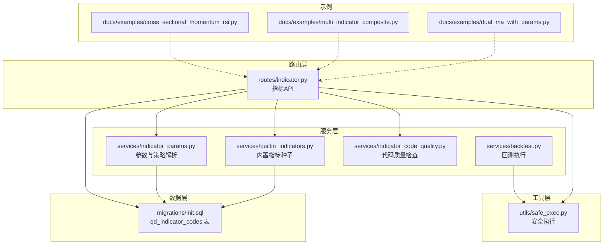
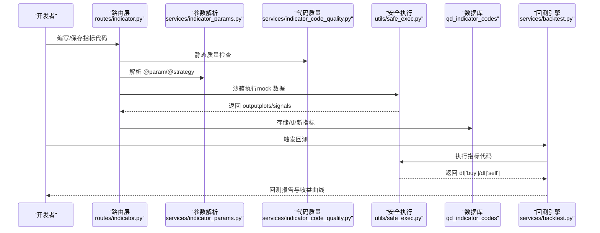
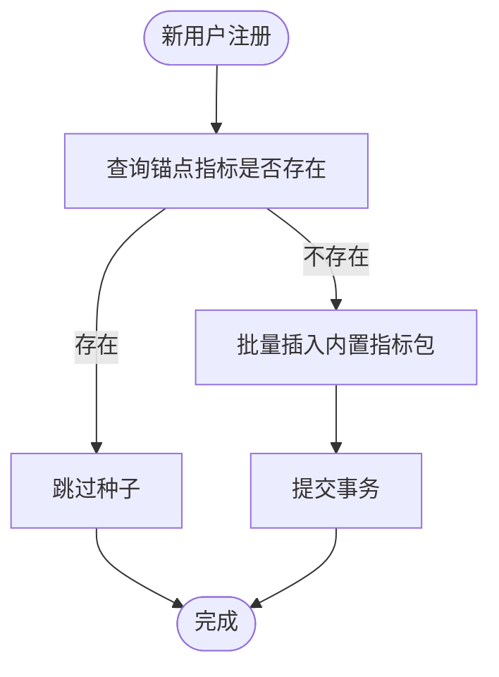
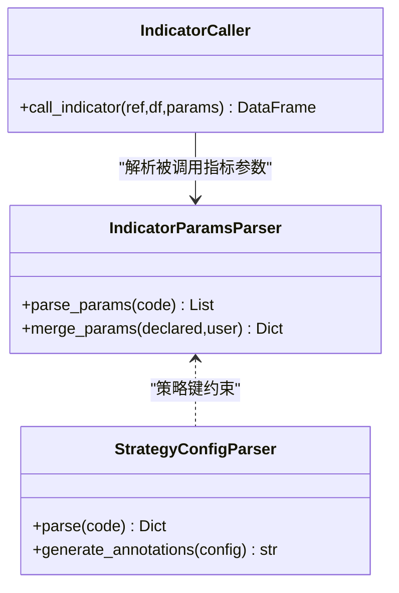
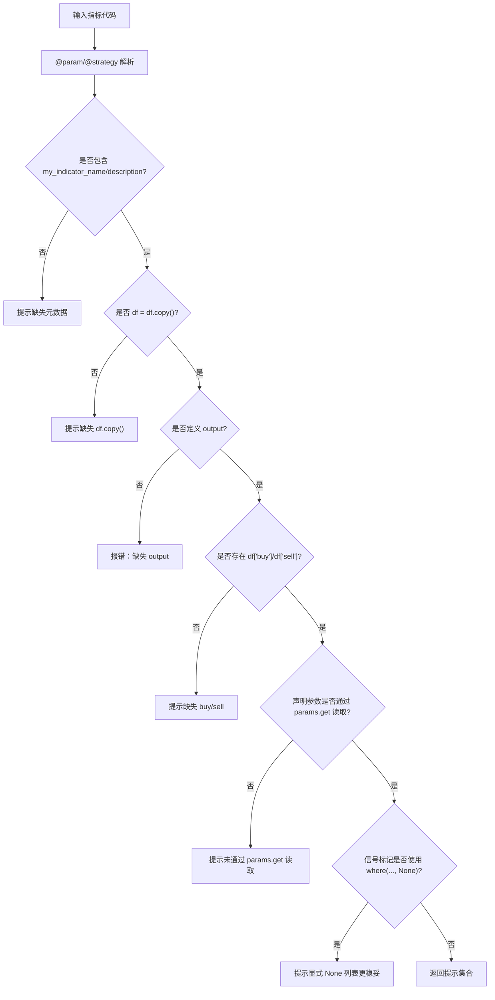
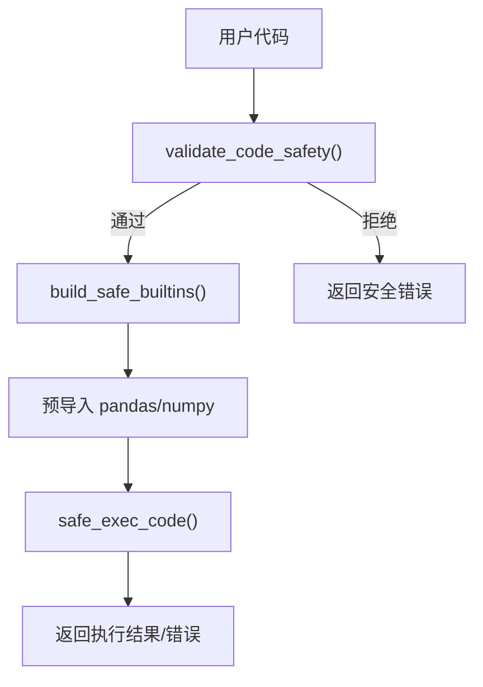
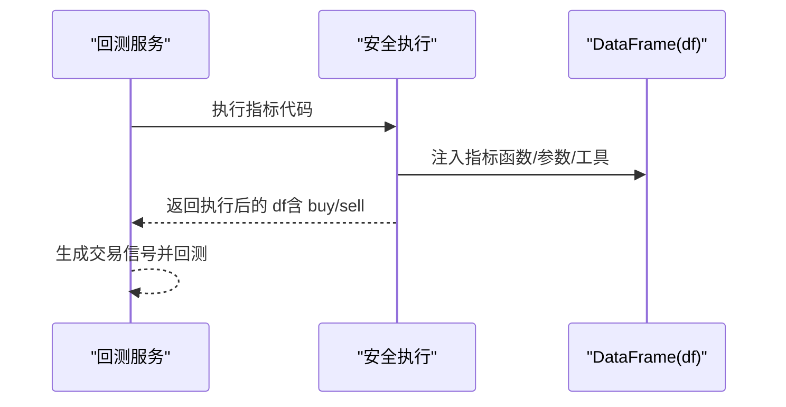
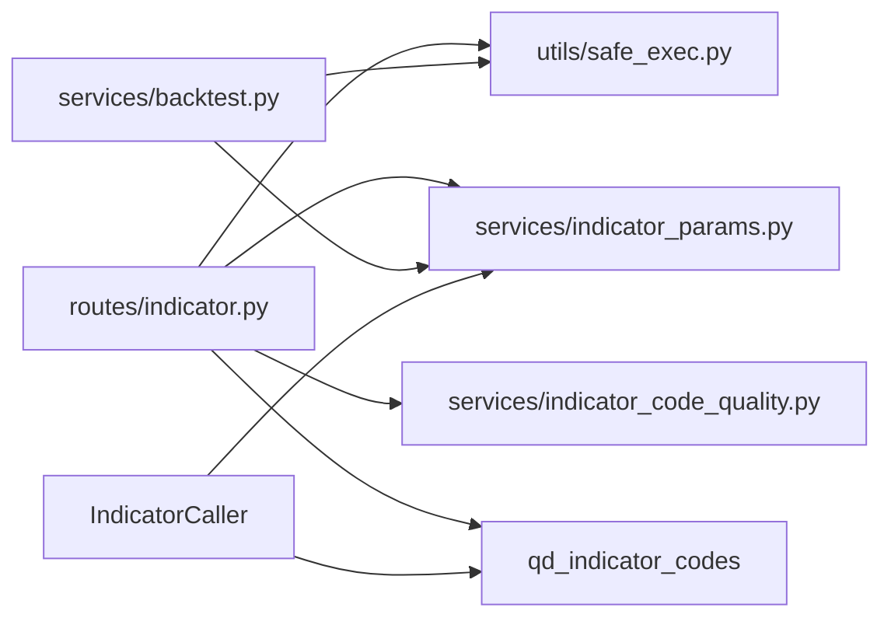
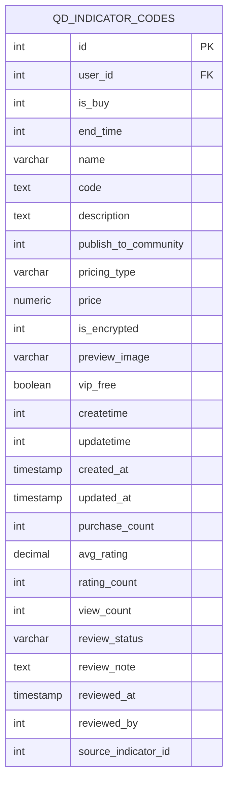

# 内置指标函数

<cite>
**本文引用的文件**
- [builtin_indicators.py](file://backend_api_python/app/services/builtin_indicators.py)
- [indicator.py](file://backend_api_python/app/routes/indicator.py)
- [indicator_params.py](file://backend_api_python/app/services/indicator_params.py)
- [indicator_code_quality.py](file://backend_api_python/app/services/indicator_code_quality.py)
- [safe_exec.py](file://backend_api_python/app/utils/safe_exec.py)
- [init.sql](file://backend_api_python/migrations/init.sql)
- [dual_ma_with_params.py](file://docs/examples/dual_ma_with_params.py)
- [multi_indicator_composite.py](file://docs/examples/multi_indicator_composite.py)
- [cross_sectional_momentum_rsi.py](file://docs/examples/cross_sectional_momentum_rsi.py)
- [backtest.py](file://backend_api_python/app/services/backtest.py)
</cite>

## 目录
1. [简介](#简介)
2. [项目结构](#项目结构)
3. [核心组件](#核心组件)
4. [架构总览](#架构总览)
5. [详细组件分析](#详细组件分析)
6. [依赖关系分析](#依赖关系分析)
7. [性能考量](#性能考量)
8. [故障排查指南](#故障排查指南)
9. [结论](#结论)
10. [附录](#附录)

## 简介
本文件面向策略开发者与量化研究人员，系统梳理 QuantDinger 平台的 IndicatorStrategy 内置指标函数与开发规范。内容涵盖：
- 内置指标清单与实现要点（移动平均线、RSI、MACD、布林带等）
- 指标参数声明与解析机制（@param）、策略默认配置（@strategy）
- 信号生成与可视化输出规范（edge-trigger、plots/signals）
- 多指标组合策略与风控融合实践
- 代码质量检查、安全执行与回测集成
- 参数优化与性能调优建议

## 项目结构
与内置指标函数相关的核心模块与文件如下：
- 服务层：内置指标种子、参数解析、代码质量检查、安全执行
- 路由层：指标 CRUD、参数查询、代码校验与 AI 生成
- 数据层：指标代码持久化表结构
- 示例：多指标组合、参数化均线、截面 RSI 复合

**图表来源**
- [indicator.py:1-1322](file://backend_api_python/app/routes/indicator.py#L1-L1322)
- [builtin_indicators.py:1-250](file://backend_api_python/app/services/builtin_indicators.py#L1-L250)
- [indicator_params.py:1-380](file://backend_api_python/app/services/indicator_params.py#L1-L380)
- [indicator_code_quality.py:1-206](file://backend_api_python/app/services/indicator_code_quality.py#L1-L206)
- [safe_exec.py:1-471](file://backend_api_python/app/utils/safe_exec.py#L1-L471)
- [init.sql:384-421](file://backend_api_python/migrations/init.sql#L384-L421)
- [dual_ma_with_params.py:1-64](file://docs/examples/dual_ma_with_params.py#L1-L64)
- [multi_indicator_composite.py:1-109](file://docs/examples/multi_indicator_composite.py#L1-L109)
- [cross_sectional_momentum_rsi.py:1-71](file://docs/examples/cross_sectional_momentum_rsi.py#L1-L71)

**章节来源**
- [indicator.py:1-1322](file://backend_api_python/app/routes/indicator.py#L1-L1322)
- [builtin_indicators.py:1-250](file://backend_api_python/app/services/builtin_indicators.py#L1-L250)
- [indicator_params.py:1-380](file://backend_api_python/app/services/indicator_params.py#L1-L380)
- [indicator_code_quality.py:1-206](file://backend_api_python/app/services/indicator_code_quality.py#L1-L206)
- [safe_exec.py:1-471](file://backend_api_python/app/utils/safe_exec.py#L1-L471)
- [init.sql:384-421](file://backend_api_python/migrations/init.sql#L384-L421)

## 核心组件
- 内置指标种子：为新用户自动注入示例指标包，包含 RSI 边缘触发、双均线金叉死叉、MACD 柱穿零轴、布林带触及等。
- 参数与策略解析：解析 @param 与 @strategy 注解，生成参数表单与默认风控配置。
- 代码质量检查：静态分析提示缺失元数据、未读取参数、未声明 buy/sell 列等常见问题。
- 安全执行：构建受限沙箱，限制导入与危险操作，支持超时与内存限制。
- 回测集成：将指标代码注入回测引擎，生成 buy/sell 信号并驱动模拟交易。

**章节来源**
- [builtin_indicators.py:17-189](file://backend_api_python/app/services/builtin_indicators.py#L17-L189)
- [indicator_params.py:26-117](file://backend_api_python/app/services/indicator_params.py#L26-L117)
- [indicator_code_quality.py:79-205](file://backend_api_python/app/services/indicator_code_quality.py#L79-L205)
- [safe_exec.py:74-92](file://backend_api_python/app/utils/safe_exec.py#L74-L92)
- [backtest.py:1940-1971](file://backend_api_python/app/services/backtest.py#L1940-L1971)

## 架构总览
下图展示了指标从“编写—校验—渲染—回测”的端到端流程。

**图表来源**
- [indicator.py:125-277](file://backend_api_python/app/routes/indicator.py#L125-L277)
- [indicator_params.py:119-216](file://backend_api_python/app/services/indicator_params.py#L119-L216)
- [indicator_code_quality.py:79-205](file://backend_api_python/app/services/indicator_code_quality.py#L79-L205)
- [safe_exec.py:207-243](file://backend_api_python/app/utils/safe_exec.py#L207-L243)
- [backtest.py:1940-1971](file://backend_api_python/app/services/backtest.py#L1940-L1971)

## 详细组件分析

### 内置指标种子与示例
- 种子机制：为新用户写入内置指标包，使用锚点名称进行幂等判断，避免重复插入。
- 示例指标：
  - RSI 边缘触发：经典超买/超卖阈值，使用边缘触发避免重复开仓。
  - 双均线金叉死叉：快线上穿/下穿慢线，边缘触发。
  - MACD 柱穿零轴：柱状线穿越零轴，适合动量切换。
  - 布林带触及：收盘价跌破/突破通道边带，边缘触发。

**图表来源**
- [builtin_indicators.py:192-250](file://backend_api_python/app/services/builtin_indicators.py#L192-L250)

**章节来源**
- [builtin_indicators.py:17-189](file://backend_api_python/app/services/builtin_indicators.py#L17-L189)
- [builtin_indicators.py:192-250](file://backend_api_python/app/services/builtin_indicators.py#L192-L250)

### 参数与策略解析
- 参数声明（@param）：支持 int/float/bool/str 类型，默认值与描述，用于前端参数表单与 AI 生成。
- 策略默认配置（@strategy）：支持止损/止盈/入场比例/追踪止损/交易方向等，用于回测面板默认风控。
- 参数合并：将声明参数与用户传参合并，按类型转换并回填默认值。

**图表来源**
- [indicator_params.py:119-216](file://backend_api_python/app/services/indicator_params.py#L119-L216)
- [indicator_params.py:218-355](file://backend_api_python/app/services/indicator_params.py#L218-L355)

**章节来源**
- [indicator_params.py:26-117](file://backend_api_python/app/services/indicator_params.py#L26-L117)
- [indicator_params.py:119-216](file://backend_api_python/app/services/indicator_params.py#L119-L216)
- [indicator_params.py:218-355](file://backend_api_python/app/services/indicator_params.py#L218-L355)

### 代码质量检查
- 静态检查项：缺失元数据、未复制 df、未定义 output、未声明 buy/sell、未通过 params.get 读取参数、信号标记使用 where(..., None) 等。
- 策略配置完整性：未声明止损/止盈、追踪止损未配置比例、入场比例过低等提示。
- 返回提示集合，便于前端生成“自动修复”与“人类可读摘要”。

**图表来源**
- [indicator_code_quality.py:79-205](file://backend_api_python/app/services/indicator_code_quality.py#L79-L205)

**章节来源**
- [indicator_code_quality.py:79-205](file://backend_api_python/app/services/indicator_code_quality.py#L79-L205)

### 安全执行与沙箱
- 白名单内置函数与允许导入模块，拒绝危险调用与模块导入。
- 超时与内存限制，跨平台线程注入超时，保证宿主稳定性。
- 支持预导入 pandas/numpy，执行用户代码并返回执行环境。

**图表来源**
- [safe_exec.py:207-243](file://backend_api_python/app/utils/safe_exec.py#L207-L243)
- [safe_exec.py:358-471](file://backend_api_python/app/utils/safe_exec.py#L358-L471)

**章节来源**
- [safe_exec.py:74-92](file://backend_api_python/app/utils/safe_exec.py#L74-L92)
- [safe_exec.py:157-205](file://backend_api_python/app/utils/safe_exec.py#L157-L205)
- [safe_exec.py:207-243](file://backend_api_python/app/utils/safe_exec.py#L207-L243)
- [safe_exec.py:358-471](file://backend_api_python/app/utils/safe_exec.py#L358-L471)

### 回测集成
- 回测执行时注入指标函数与 call_indicator 能力，支持指标间互相调用。
- 通过安全执行返回 df['buy']/df['sell']，驱动模拟成交与收益曲线。

**图表来源**
- [backtest.py:1940-1971](file://backend_api_python/app/services/backtest.py#L1940-L1971)

**章节来源**
- [backtest.py:1940-1971](file://backend_api_python/app/services/backtest.py#L1940-L1971)

### 指标实现与使用方法

#### RSI 边缘触发
- 参数：rsi_len（默认 14）
- 计算：差分、上涨/下跌均值、平滑、RSI 公式、填充默认值
- 信号：RSI < 30 做多，RSI > 70 做空，边缘触发避免重复
- 适用场景：震荡/弱趋势市场，适合短周期回测与实盘过滤

**章节来源**
- [builtin_indicators.py:20-62](file://backend_api_python/app/services/builtin_indicators.py#L20-L62)
- [dual_ma_with_params.py:17-64](file://docs/examples/dual_ma_with_params.py#L17-L64)

#### 双均线金叉死叉
- 参数：sma_short/sma_long（示例默认 14/28）
- 计算：滚动均值，交叉条件
- 信号：快线上穿/下穿慢线，边缘触发
- 适用场景：趋势跟踪，适合多时间框架与多资产轮动

**章节来源**
- [builtin_indicators.py:64-100](file://backend_api_python/app/services/builtin_indicators.py#L64-L100)
- [dual_ma_with_params.py:17-64](file://docs/examples/dual_ma_with_params.py#L17-L64)

#### MACD 柱穿零轴
- 参数：默认 12/26/9（指数平滑）
- 计算：EXP12/EXP26、DIF/DEA、柱状线
- 信号：柱线由负转正试多，由正转负试空
- 适用场景：动量切换，适合高波动市场与加密货币

**章节来源**
- [builtin_indicators.py:102-140](file://backend_api_python/app/services/builtin_indicators.py#L102-L140)
- [multi_indicator_composite.py:58-66](file://docs/examples/multi_indicator_composite.py#L58-L66)

#### 布林带触及
- 参数：period（默认 20）、mult（默认 2.0）
- 计算：中轨均值、标准差、上下轨
- 信号：收盘价跌破下轨做多，突破上轨做空，边缘触发
- 适用场景：均值回归，需结合趋势过滤

**章节来源**
- [builtin_indicators.py:142-183](file://backend_api_python/app/services/builtin_indicators.py#L142-L183)
- [multi_indicator_composite.py:47-75](file://docs/examples/multi_indicator_composite.py#L47-L75)

### 多指标组合策略
- 组合思路：均线（金叉/死叉）、RSI（超买/超卖）、MACD（柱/信号）、成交量过滤
- 权重与融合：原始条件经“或/与”组合，边缘触发稳定化
- 风险管理：通过 @strategy 默认配置控制止损/止盈/追踪止损/交易方向

**章节来源**
- [multi_indicator_composite.py:13-109](file://docs/examples/multi_indicator_composite.py#L13-L109)
- [indicator_params.py:26-117](file://backend_api_python/app/services/indicator_params.py#L26-L117)

### 截面策略与 RSI 复合
- 思路：对多标的计算动量因子与 RSI 反转值，加权综合评分排序
- 限制：当前平台文档明确 cross_sectional 不在主策略链路，示例用于研究参考

**章节来源**
- [cross_sectional_momentum_rsi.py:1-71](file://docs/examples/cross_sectional_momentum_rsi.py#L1-L71)

## 依赖关系分析
- 路由层依赖参数解析、代码质量检查与安全执行
- 服务层依赖数据库持久化与回测引擎
- 安全执行独立于业务逻辑，提供统一沙箱能力
- 指标间可通过 IndicatorCaller 互相调用，受最大调用深度与循环依赖保护

**图表来源**
- [indicator.py:1-1322](file://backend_api_python/app/routes/indicator.py#L1-L1322)
- [indicator_params.py:218-355](file://backend_api_python/app/services/indicator_params.py#L218-L355)
- [safe_exec.py:1-471](file://backend_api_python/app/utils/safe_exec.py#L1-L471)
- [init.sql:384-421](file://backend_api_python/migrations/init.sql#L384-L421)
- [backtest.py:1940-1971](file://backend_api_python/app/services/backtest.py#L1940-L1971)

**章节来源**
- [indicator.py:1-1322](file://backend_api_python/app/routes/indicator.py#L1-L1322)
- [indicator_params.py:218-355](file://backend_api_python/app/services/indicator_params.py#L218-L355)
- [safe_exec.py:1-471](file://backend_api_python/app/utils/safe_exec.py#L1-L471)
- [init.sql:384-421](file://backend_api_python/migrations/init.sql#L384-L421)
- [backtest.py:1940-1971](file://backend_api_python/app/services/backtest.py#L1940-L1971)

## 性能考量
- 向量化优先：尽量使用 pandas/numpy 向量化运算（rolling/ewm/shift），避免逐行循环
- 数据长度一致性：确保 output['plots']['data'] 与 output['signals']['data'] 长度等于 df
- 边缘触发：使用 fillna(False) & (~shift(1).fillna(False))，减少重复信号
- 内存与超时：安全执行默认超时与内存限制，复杂指标需优化计算路径
- 指标调用：限制调用深度，避免循环依赖导致栈溢出

[本节为通用指导，无需特定文件来源]

## 故障排查指南
- 缺少 output：必须定义 output 字典，包含 name/plots/signals
- plots/signals 缺失 data 或长度不匹配：检查 Series/列表长度与 df 对齐
- 未声明 buy/sell：回测无法识别信号，需在 df 上生成布尔列
- 未读取参数：声明了 @param 但未通过 params.get 读取，将使用默认值
- 信号标记问题：where(..., None) 可能导致 NaN 渲染，建议显式 None 列表
- 安全拒绝：导入/调用危险模块或函数会被拒绝，需使用白名单内置函数与模块

**章节来源**
- [indicator.py:125-277](file://backend_api_python/app/routes/indicator.py#L125-L277)
- [indicator_code_quality.py:79-205](file://backend_api_python/app/services/indicator_code_quality.py#L79-L205)
- [safe_exec.py:358-471](file://backend_api_python/app/utils/safe_exec.py#L358-L471)

## 结论
QuantDinger 的 IndicatorStrategy 通过“参数声明 + 策略默认配置 + 边缘触发信号 + 安全执行 + 回测集成”的闭环，为开发者提供了可复用、可扩展、可审计的指标开发与应用体系。内置指标覆盖主流技术面要素，示例代码展示了参数化、多指标融合与风控一体化的最佳实践。建议在实际策略中遵循向量化优先、长度对齐、边缘触发与安全沙箱的原则，结合参数扫描与回测优化持续迭代。

[本节为总结，无需特定文件来源]

## 附录

### 数据模型（指标代码表）

**图表来源**
- [init.sql:384-421](file://backend_api_python/migrations/init.sql#L384-L421)

### API 一览（关键接口）
- GET /api/indicator/getIndicators：获取用户指标列表
- POST /api/indicator/saveIndicator：保存/更新指标
- POST /api/indicator/deleteIndicator：删除指标
- GET /api/indicator/getIndicatorParams：获取指标参数声明
- POST /api/indicator/verifyCode：校验指标代码（沙箱执行）
- POST /api/indicator/aiGenerate：AI 生成指标代码（SSE）

**章节来源**
- [indicator.py:411-715](file://backend_api_python/app/routes/indicator.py#L411-L715)