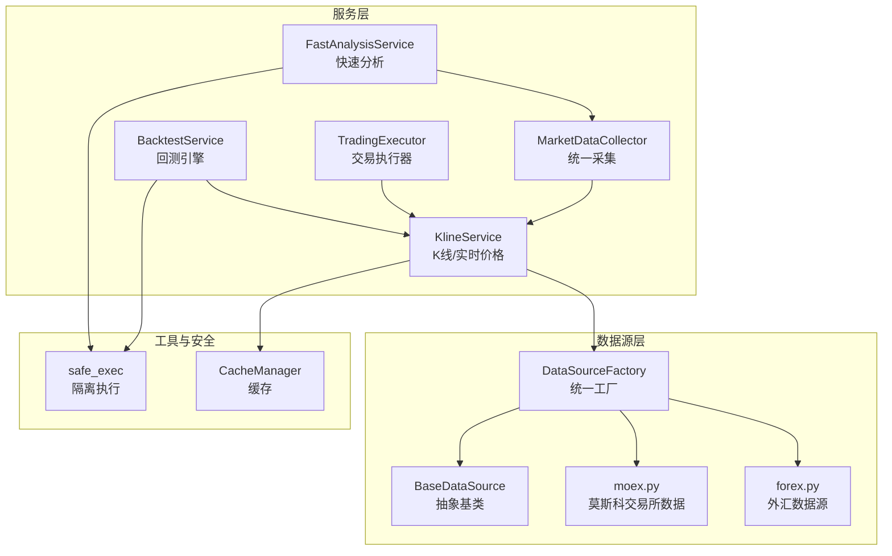
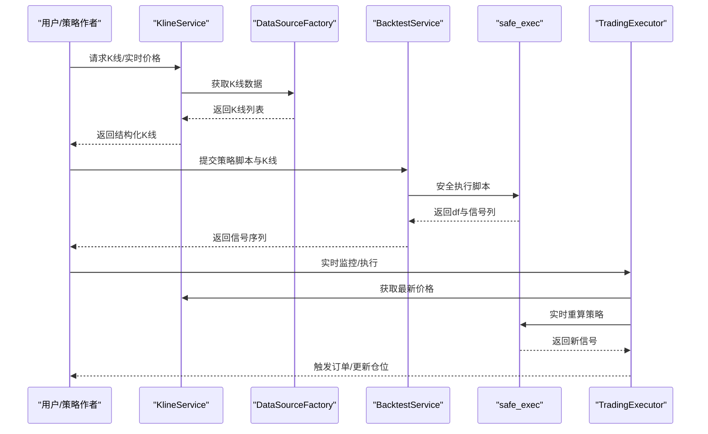
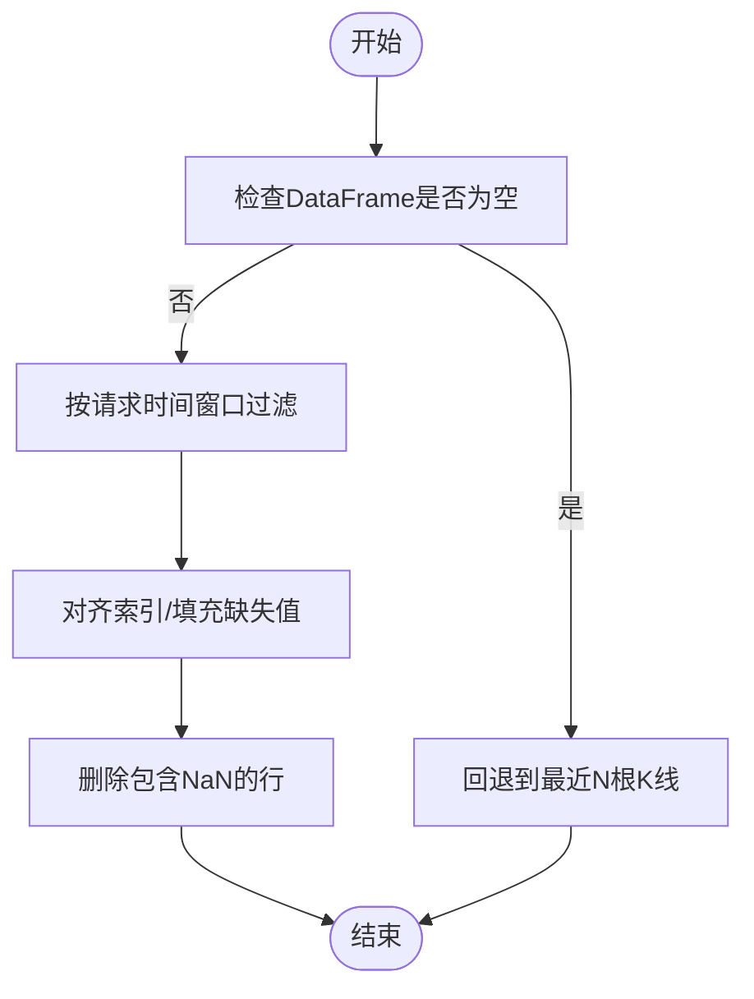
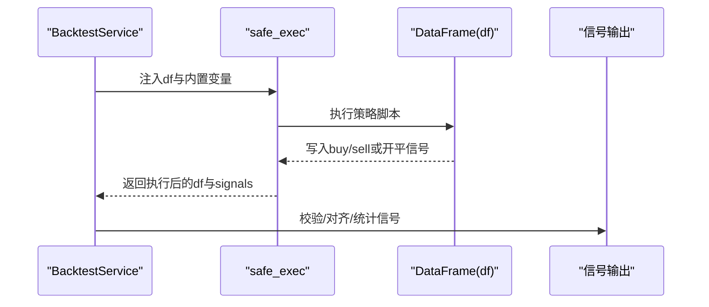
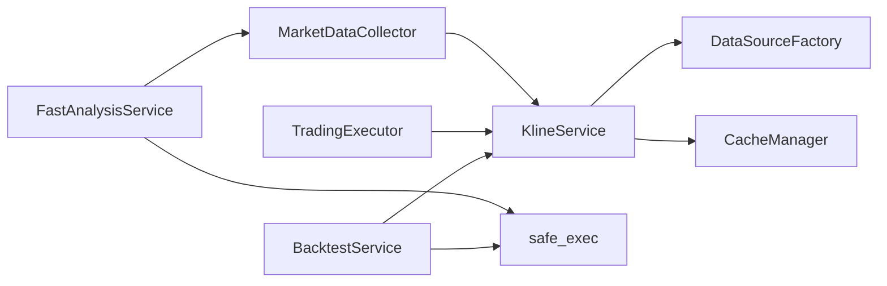

# 数据处理与DataFrame操作

<cite>
**本文引用的文件**   
- [backtest.py](file://backend_api_python/app/services/backtest.py)
- [trading_executor.py](file://backend_api_python/app/services/trading_executor.py)
- [market_data_collector.py](file://backend_api_python/app/services/market_data_collector.py)
- [fast_analysis.py](file://backend_api_python/app/services/fast_analysis.py)
- [builtin_indicators.py](file://backend_api_python/app/services/builtin_indicators.py)
- [kline.py](file://backend_api_python/app/services/kline.py)
- [base.py](file://backend_api_python/app/data_sources/base.py)
- [forex.py](file://backend_api_python/app/data_sources/forex.py)
- [moex.py](file://backend_api_python/app/data_sources/moex.py)
- [cache.py](file://backend_api_python/app/utils/cache.py)
- [safe_exec.py](file://backend_api_python/app/utils/safe_exec.py)
- [cross_sectional_momentum_rsi.py](file://docs/examples/cross_sectional_momentum_rsi.py)
</cite>

## 目录
1. [简介](#简介)
2. [项目结构](#项目结构)
3. [核心组件](#核心组件)
4. [架构总览](#架构总览)
5. [详细组件分析](#详细组件分析)
6. [依赖关系分析](#依赖关系分析)
7. [性能考量](#性能考量)
8. [故障排查指南](#故障排查指南)
9. [结论](#结论)
10. [附录](#附录)

## 简介
本文件围绕 IndicatorStrategy 的数据处理与 pandas DataFrame 操作展开，系统性阐述金融数据的加载、清洗、转换与分析流程，重点覆盖时间序列处理（重采样、对齐、缺失值处理）、多标的并行处理（数据合并、分组与批量计算）、以及性能优化（向量化、内存与计算加速）。同时提供实际示例与常见数据质量问题的解决方案，帮助开发者在策略开发与回测/实盘执行中高效、稳健地处理数据。

## 项目结构
后端服务以“数据源—服务—执行/回测—工具”分层组织，核心围绕 K 线与实时价格获取、统一指标计算、策略脚本安全执行与实时监控执行链路构建。

图示来源
- [kline.py:14-65](file://backend_api_python/app/services/kline.py#L14-L65)
- [market_data_collector.py:34-53](file://backend_api_python/app/services/market_data_collector.py#L34-L53)
- [fast_analysis.py:186-232](file://backend_api_python/app/services/fast_analysis.py#L186-L232)
- [backtest.py:1800-1890](file://backend_api_python/app/services/backtest.py#L1800-L1890)
- [trading_executor.py:1200-1318](file://backend_api_python/app/services/trading_executor.py#L1200-L1318)
- [cache.py:49-99](file://backend_api_python/app/utils/cache.py#L49-L99)
- [safe_exec.py:248-332](file://backend_api_python/app/utils/safe_exec.py#L248-L332)

章节来源
- [kline.py:14-191](file://backend_api_python/app/services/kline.py#L14-L191)
- [market_data_collector.py:34-224](file://backend_api_python/app/services/market_data_collector.py#L34-L224)
- [fast_analysis.py:186-232](file://backend_api_python/app/services/fast_analysis.py#L186-L232)

## 核心组件
- 数据源与K线服务
  - 统一数据源接口与过滤/限制逻辑，支持时间窗口裁剪与延迟检测。
  - K 线服务负责缓存与实时价格回退策略，降低外部 API 压力。
- 市场数据采集器
  - 并行采集价格、K线、技术指标、基本面、宏观与情绪数据，统一输出结构化报告。
- 快速分析服务
  - 基于统一采集器的单次 LLM 调用，输出结构化分析与交易建议。
- 回测引擎
  - 将策略脚本在受控环境中执行，产出买卖/开平信号，并进行信号对齐与统计。
- 交易执行器
  - 实时监控与信号触发，支持 bot 模式与指标策略的即时重算与止盈止损。
- 工具与安全
  - 缓存管理（内存/Redis），策略脚本隔离执行，防止资源滥用与崩溃。

章节来源
- [base.py:28-180](file://backend_api_python/app/data_sources/base.py#L28-L180)
- [kline.py:14-191](file://backend_api_python/app/services/kline.py#L14-L191)
- [market_data_collector.py:34-224](file://backend_api_python/app/services/market_data_collector.py#L34-L224)
- [fast_analysis.py:186-232](file://backend_api_python/app/services/fast_analysis.py#L186-L232)
- [backtest.py:1891-2029](file://backend_api_python/app/services/backtest.py#L1891-L2029)
- [trading_executor.py:1200-1400](file://backend_api_python/app/services/trading_executor.py#L1200-L1400)
- [cache.py:49-129](file://backend_api_python/app/utils/cache.py#L49-L129)
- [safe_exec.py:248-332](file://backend_api_python/app/utils/safe_exec.py#L248-L332)

## 架构总览
下图展示从数据源到策略执行的关键路径，强调 DataFrame 在回测与实时执行中的核心地位。

图示来源
- [kline.py:21-65](file://backend_api_python/app/services/kline.py#L21-L65)
- [backtest.py:1891-2029](file://backend_api_python/app/services/backtest.py#L1891-L2029)
- [safe_exec.py:248-332](file://backend_api_python/app/utils/safe_exec.py#L248-L332)
- [trading_executor.py:1274-1318](file://backend_api_python/app/services/trading_executor.py#L1274-L1318)

## 详细组件分析

### 时间序列处理：重采样、对齐与缺失值处理
- 重采样与聚合
  - 外汇数据源提供按目标周期聚合的实现，按时间桶聚合 OHLCV，确保不同粒度数据对齐。
  - 莫斯科交易所数据提供按目标秒数聚合的实现，保证跨周期一致性。
- 对齐与窗口裁剪
  - 回测阶段对传入的 DataFrame 进行时间窗口对齐，若请求区间与上游数据无交集，则回退到可用数据范围。
  - 使用索引对齐与填充策略，确保信号列与原始 K 线严格对齐。
- 缺失值处理
  - 实时执行器在更新最后一根 K 线时，先剔除包含 NaN 的行，再进行后续计算。
  - 回测阶段对空结果进行兜底，取最近若干根 K 线，避免完全失败。

图示来源
- [forex.py:425-453](file://backend_api_python/app/data_sources/forex.py#L425-L453)
- [moex.py:125-142](file://backend_api_python/app/data_sources/moex.py#L125-L142)
- [backtest.py:1800-1889](file://backend_api_python/app/services/backtest.py#L1800-L1889)
- [trading_executor.py:2123-2127](file://backend_api_python/app/services/trading_executor.py#L2123-L2127)

章节来源
- [forex.py:425-453](file://backend_api_python/app/data_sources/forex.py#L425-L453)
- [moex.py:125-142](file://backend_api_python/app/data_sources/moex.py#L125-L142)
- [backtest.py:1800-1889](file://backend_api_python/app/services/backtest.py#L1800-L1889)
- [trading_executor.py:2123-2127](file://backend_api_python/app/services/trading_executor.py#L2123-L2127)

### 多标的并行处理：数据合并、分组与批量计算
- 截面策略示例
  - 示例展示了对多个标的分别计算动量与 RSI 反转值，形成复合评分并排序，体现“多标的并行处理—批量计算—统一排序”的思路。
- 实战要点
  - 使用字典容器承载各标的 DataFrame，遍历计算，注意最小长度校验与异常跳过。
  - 排序后按权重分配多头/空头头寸，为后续组合管理与下单提供依据。

章节来源
- [cross_sectional_momentum_rsi.py:22-71](file://docs/examples/cross_sectional_momentum_rsi.py#L22-L71)

### 策略中的DataFrame操作与信号生成
- 回测执行器
  - 将策略脚本注入包含 open/high/low/close/volume 的执行环境，支持参数注入与内置函数扩展。
  - 支持两类信号输出：简单 buy/sell（布尔列）与四象限开平信号（开多/平多/开空/平空）。
  - 对输出的信号进行校验与索引对齐，确保与原始时间序列严格对应。
- 实时执行器
  - 每个 tick 对实时 DataFrame 更新最后一根 K 线的最高价/最低价等，重新执行策略脚本，生成新的待触发信号。
  - 支持立即触发与价格触发两种模式，结合止盈止损与追踪止盈的服务器端控制。

图示来源
- [backtest.py:1891-2029](file://backend_api_python/app/services/backtest.py#L1891-L2029)
- [safe_exec.py:248-332](file://backend_api_python/app/utils/safe_exec.py#L248-L332)

章节来源
- [backtest.py:1891-2029](file://backend_api_python/app/services/backtest.py#L1891-L2029)
- [trading_executor.py:1274-1318](file://backend_api_python/app/services/trading_executor.py#L1274-L1318)
- [safe_exec.py:248-332](file://backend_api_python/app/utils/safe_exec.py#L248-L332)

### 技术指标计算与数据质量
- 市场数据采集器
  - 本地计算 RSI、MACD、布林带、ATR 等指标，避免外部 API 依赖，提升稳定性与速度。
  - 对价格、成交量等字段进行安全转换与默认值处理，减少异常输入导致的计算失败。
- 快速分析服务
  - 基于统一采集器输出，构建强约束提示词，一次性输出结构化分析与交易建议，降低噪声与不确定性。

章节来源
- [market_data_collector.py:299-510](file://backend_api_python/app/services/market_data_collector.py#L299-L510)
- [fast_analysis.py:234-357](file://backend_api_python/app/services/fast_analysis.py#L234-L357)

### 内置指标与策略模板
- 内置指标包
  - 提供 RSI、双均线、MACD、布林带等示例指标代码，便于快速上手与对比验证。
  - 通过脚本输出 plots 与 signals，便于可视化与回测对接。

章节来源
- [builtin_indicators.py:17-185](file://backend_api_python/app/services/builtin_indicators.py#L17-L185)

## 依赖关系分析
- 组件耦合
  - KlineService 依赖 DataSourceFactory，统一接入多数据源；对外暴露简洁接口。
  - BacktestService 与 TradingExecutor 依赖 KlineService 获取数据，依赖 safe_exec 执行策略脚本。
  - MarketDataCollector 与 FastAnalysisService 依赖 KlineService 获取基础数据，再进行本地指标计算与 LLM 结构化输出。
- 外部依赖
  - 缓存：内存缓存优先，可选 Redis；用于 K 线与实时价格短期缓存。
  - 执行隔离：通过子进程隔离执行策略脚本，限制资源与时间，避免崩溃影响主进程。

图示来源
- [kline.py:14-65](file://backend_api_python/app/services/kline.py#L14-L65)
- [backtest.py:1891-2029](file://backend_api_python/app/services/backtest.py#L1891-L2029)
- [trading_executor.py:1274-1318](file://backend_api_python/app/services/trading_executor.py#L1274-L1318)
- [market_data_collector.py:34-53](file://backend_api_python/app/services/market_data_collector.py#L34-L53)
- [fast_analysis.py:186-232](file://backend_api_python/app/services/fast_analysis.py#L186-L232)
- [cache.py:49-99](file://backend_api_python/app/utils/cache.py#L49-L99)
- [safe_exec.py:248-332](file://backend_api_python/app/utils/safe_exec.py#L248-L332)

章节来源
- [kline.py:14-65](file://backend_api_python/app/services/kline.py#L14-L65)
- [backtest.py:1891-2029](file://backend_api_python/app/services/backtest.py#L1891-L2029)
- [trading_executor.py:1274-1318](file://backend_api_python/app/services/trading_executor.py#L1274-L1318)
- [market_data_collector.py:34-53](file://backend_api_python/app/services/market_data_collector.py#L34-L53)
- [fast_analysis.py:186-232](file://backend_api_python/app/services/fast_analysis.py#L186-L232)
- [cache.py:49-99](file://backend_api_python/app/utils/cache.py#L49-L99)
- [safe_exec.py:248-332](file://backend_api_python/app/utils/safe_exec.py#L248-L332)

## 性能考量
- 向量化优先
  - 使用 pandas/numpy 向量化操作（滚动均值、指数平滑、布尔掩码）替代显式循环，显著提升指标计算效率。
- 内存与缓存
  - K 线与实时价格采用短期缓存，减少重复请求；缓存管理器支持内存与 Redis 双实现，按需启用。
- 执行隔离
  - 策略脚本在独立子进程中执行，限制运行时长与内存，避免单个脚本拖垮系统。
- 并行采集
  - 市场数据采集器使用线程池并行获取价格、K线、技术指标等，缩短整体等待时间。
- 数据预处理
  - 在回测与实时执行前进行时间窗口对齐、索引对齐与 NaN 清理，减少后续计算负担。

章节来源
- [market_data_collector.py:128-157](file://backend_api_python/app/services/market_data_collector.py#L128-L157)
- [cache.py:49-129](file://backend_api_python/app/utils/cache.py#L49-L129)
- [safe_exec.py:248-332](file://backend_api_python/app/utils/safe_exec.py#L248-L332)
- [backtest.py:1891-2029](file://backend_api_python/app/services/backtest.py#L1891-L2029)
- [trading_executor.py:2123-2127](file://backend_api_python/app/services/trading_executor.py#L2123-L2127)

## 故障排查指南
- 数据延迟告警
  - 数据源基类提供延迟检测逻辑，根据周期设定阈值，超过阈值发出警告，便于定位上游数据问题。
- 回测窗口无交集
  - 当请求时间窗口与上游数据无交集时，回测会自动调整有效区间或回退到最近 K 线，日志记录覆盖比例与回退原因。
- 空DataFrame兜底
  - 当过滤后为空时，回测回退到最近若干根 K 线；实时执行器删除 NaN 行后再继续，避免异常传播。
- 策略执行失败
  - safe_exec 提供超时与内存限制，失败时返回错误信息；回测/执行器捕获异常并记录堆栈，便于定位问题。

章节来源
- [base.py:142-179](file://backend_api_python/app/data_sources/base.py#L142-L179)
- [backtest.py:1849-1889](file://backend_api_python/app/services/backtest.py#L1849-L1889)
- [trading_executor.py:2123-2127](file://backend_api_python/app/services/trading_executor.py#L2123-L2127)
- [safe_exec.py:248-332](file://backend_api_python/app/utils/safe_exec.py#L248-L332)

## 结论
通过统一的数据源接口、本地化的指标计算、严格的信号对齐与执行隔离机制，系统在回测与实盘执行中实现了高效、稳健的 DataFrame 数据处理。遵循本文的重采样/对齐/缺失值处理流程、多标的并行计算范式与性能优化实践，可显著提升策略开发与部署的质量与效率。

## 附录
- 关键流程图与类图已在前述章节中给出，读者可据此对照源码定位具体实现细节。
- 如需进一步了解各文件的完整实现，请参阅相应源码文件。