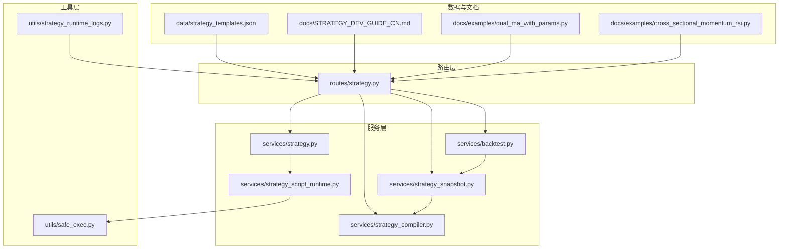
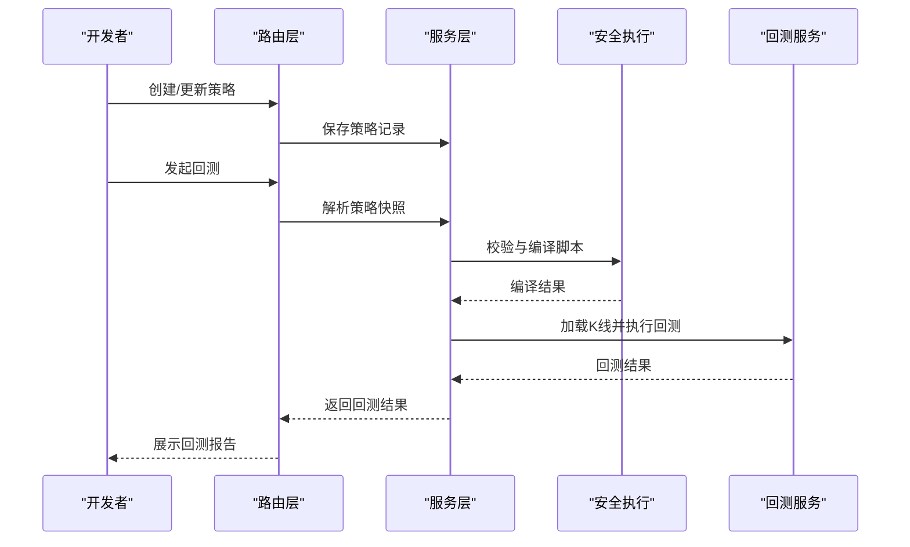
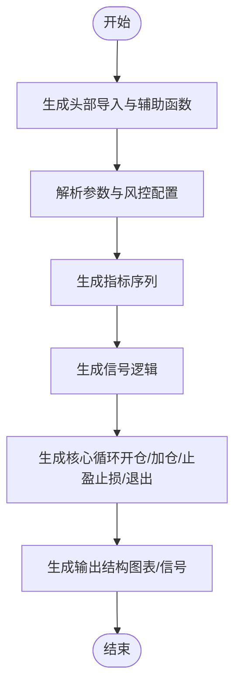
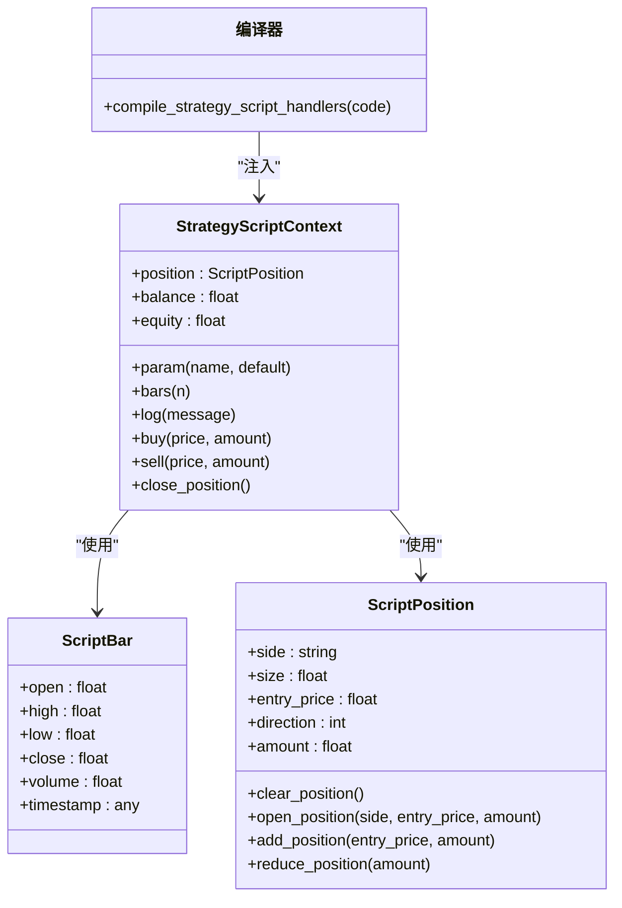
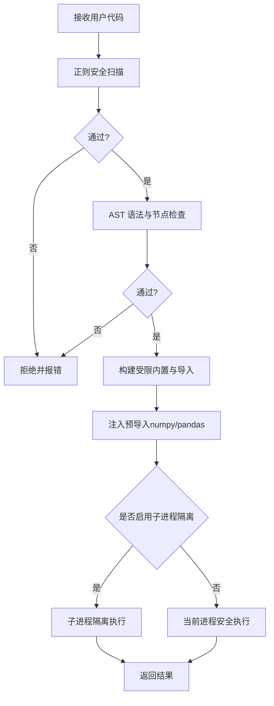
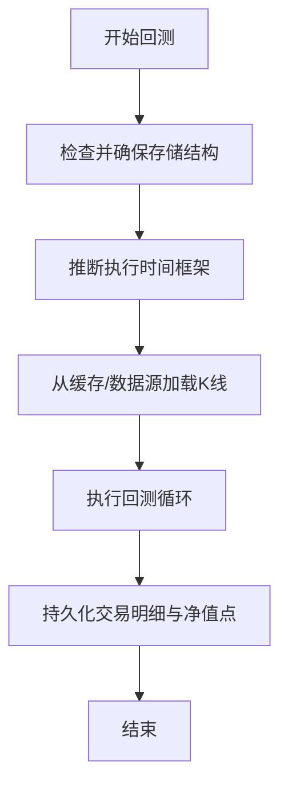
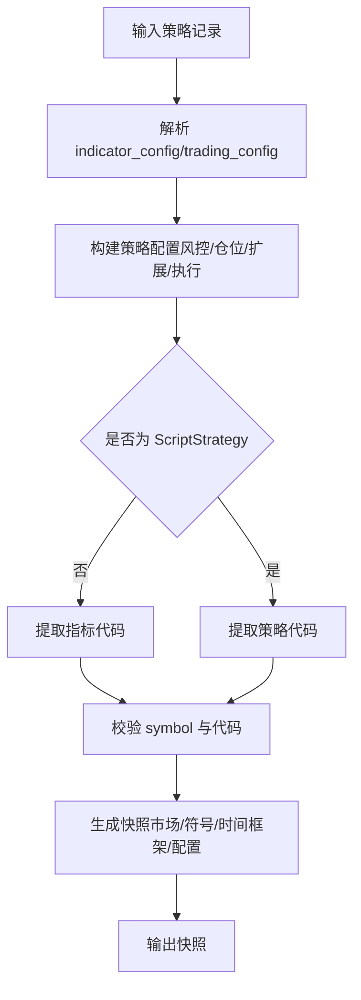
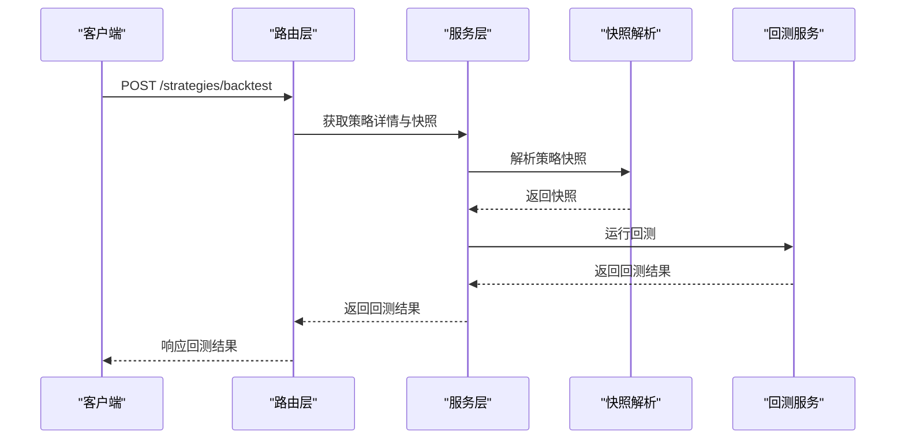
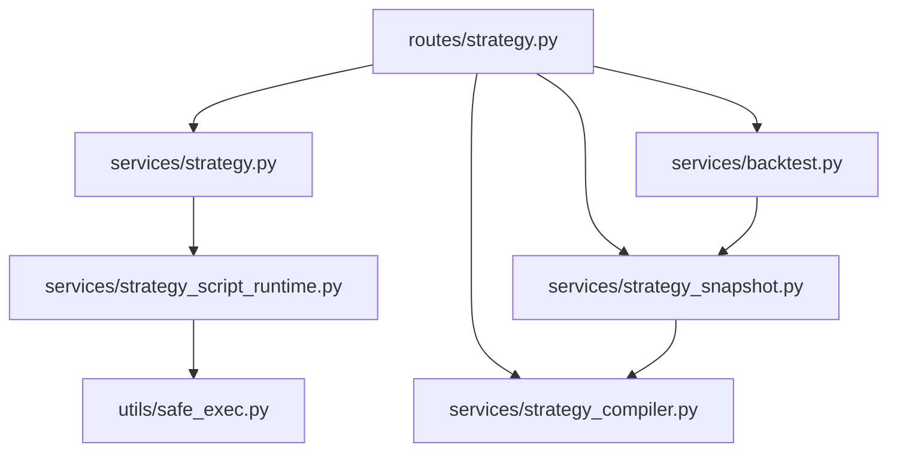

# 策略开发流程

<cite>
**本文引用的文件**
- [strategy_compiler.py](file://backend_api_python/app/services/strategy_compiler.py)
- [strategy.py](file://backend_api_python/app/services/strategy.py)
- [strategy.py](file://backend_api_python/app/routes/strategy.py)
- [safe_exec.py](file://backend_api_python/app/utils/safe_exec.py)
- [strategy_script_runtime.py](file://backend_api_python/app/services/strategy_script_runtime.py)
- [backtest.py](file://backend_api_python/app/services/backtest.py)
- [strategy_snapshot.py](file://backend_api_python/app/services/strategy_snapshot.py)
- [strategy_templates.json](file://backend_api_python/app/data/strategy_templates.json)
- [STRATEGY_DEV_GUIDE_CN.md](file://docs/STRATEGY_DEV_GUIDE_CN.md)
- [dual_ma_with_params.py](file://docs/examples/dual_ma_with_params.py)
- [cross_sectional_momentum_rsi.py](file://docs/examples/cross_sectional_momentum_rsi.py)
- [strategy_runtime_logs.py](file://backend_api_python/app/utils/strategy_runtime_logs.py)
</cite>

## 目录
1. [引言](#引言)
2. [项目结构](#项目结构)
3. [核心组件](#核心组件)
4. [架构总览](#架构总览)
5. [详细组件分析](#详细组件分析)
6. [依赖分析](#依赖分析)
7. [性能考虑](#性能考虑)
8. [故障排除指南](#故障排除指南)
9. [结论](#结论)
10. [附录](#附录)

## 引言
本技术文档围绕 IndicatorStrategy 策略开发流程，系统阐述从策略构思到部署执行的完整过程，涵盖策略设计原则、代码编写规范、调试方法、策略编译器工作机制（Python 代码解析、AST 转换与安全执行）、最佳实践（命名规范、注释标准、版本管理）、生命周期管理（创建、测试、部署、监控）以及常见问题与解决方案。文档同时提供可视化流程图与代码级关系图，帮助不同背景的读者高效理解与应用。

## 项目结构
QuantDinger 后端以服务层与路由层分离的方式组织策略开发与执行链路：
- 服务层：策略编译、脚本运行时、回测、快照解析、安全执行等核心能力封装在 app/services 下。
- 路由层：对外提供策略 CRUD、回测、批量启停等 API，在 app/routes 下实现。
- 工具层：安全执行、日志持久化等通用能力在 app/utils 下实现。
- 文档与示例：docs 提供开发指南与示例脚本，app/data 提供策略模板。

**图表来源**
- [strategy.py:1-200](file://backend_api_python/app/routes/strategy.py#L1-L200)
- [strategy.py:1-120](file://backend_api_python/app/services/strategy.py#L1-L120)
- [strategy_compiler.py:1-120](file://backend_api_python/app/services/strategy_compiler.py#L1-L120)
- [strategy_script_runtime.py:1-80](file://backend_api_python/app/services/strategy_script_runtime.py#L1-L80)
- [backtest.py:1-120](file://backend_api_python/app/services/backtest.py#L1-L120)
- [strategy_snapshot.py:1-80](file://backend_api_python/app/services/strategy_snapshot.py#L1-L80)
- [safe_exec.py:1-120](file://backend_api_python/app/utils/safe_exec.py#L1-L120)
- [strategy_templates.json:1-80](file://backend_api_python/app/data/strategy_templates.json#L1-L80)
- [STRATEGY_DEV_GUIDE_CN.md:1-120](file://docs/STRATEGY_DEV_GUIDE_CN.md#L1-L120)

**章节来源**
- [strategy.py:1-200](file://backend_api_python/app/routes/strategy.py#L1-L200)
- [strategy.py:1-120](file://backend_api_python/app/services/strategy.py#L1-L120)
- [strategy_compiler.py:1-120](file://backend_api_python/app/services/strategy_compiler.py#L1-L120)
- [strategy_script_runtime.py:1-80](file://backend_api_python/app/services/strategy_script_runtime.py#L1-L80)
- [backtest.py:1-120](file://backend_api_python/app/services/backtest.py#L1-L120)
- [strategy_snapshot.py:1-80](file://backend_api_python/app/services/strategy_snapshot.py#L1-L80)
- [safe_exec.py:1-120](file://backend_api_python/app/utils/safe_exec.py#L1-L120)
- [strategy_templates.json:1-80](file://backend_api_python/app/data/strategy_templates.json#L1-L80)
- [STRATEGY_DEV_GUIDE_CN.md:1-120](file://docs/STRATEGY_DEV_GUIDE_CN.md#L1-L120)

## 核心组件
- 策略编译器（StrategyCompiler）：将策略配置 JSON 转换为可执行的 Python 代码，生成指标、信号、核心循环与输出结构。
- 脚本运行时（StrategyScriptContext + compile_strategy_script_handlers）：在安全沙箱中编译并执行 ScriptStrategy 的 on_init/on_bar，提供 ctx 上下文与订单意图。
- 安全执行（safe_exec_with_validation/safe_exec_isolated）：基于白名单内置函数、受限导入模块与超时/内存限制，保障策略执行安全。
- 回测服务（BacktestService）：加载 K 线、缓存、执行回测、持久化交易明细与净值点，支持多时间框架与精度配置。
- 快照解析（StrategySnapshotResolver）：将存储的策略记录解析为回测/执行所需的快照，合并产品配置与默认风控。
- 路由与服务（routes/strategy.py + services/strategy.py）：提供策略 CRUD、批量启停、回测运行、模板加载等接口与业务逻辑。

**章节来源**
- [strategy_compiler.py:1-120](file://backend_api_python/app/services/strategy_compiler.py#L1-L120)
- [strategy_script_runtime.py:159-191](file://backend_api_python/app/services/strategy_script_runtime.py#L159-L191)
- [safe_exec.py:207-244](file://backend_api_python/app/utils/safe_exec.py#L207-L244)
- [backtest.py:64-120](file://backend_api_python/app/services/backtest.py#L64-L120)
- [strategy_snapshot.py:116-200](file://backend_api_python/app/services/strategy_snapshot.py#L116-L200)
- [strategy.py:491-634](file://backend_api_python/app/routes/strategy.py#L491-L634)
- [strategy.py:14-120](file://backend_api_python/app/services/strategy.py#L14-L120)

## 架构总览
策略开发与执行的关键流程如下：
- IndicatorStrategy：在 Indicator IDE 中完成信号与图表验证，保存为策略后，通过快照解析与回测服务进行策略回测。
- ScriptStrategy：通过脚本运行时在安全环境中编译并执行，按 bar 推进，支持运行时状态与动态风控。
- 安全执行：在策略校验与执行阶段，严格限制内置函数与导入模块，防止危险操作。

**图表来源**
- [strategy.py:329-441](file://backend_api_python/app/routes/strategy.py#L329-L441)
- [strategy_snapshot.py:116-200](file://backend_api_python/app/services/strategy_snapshot.py#L116-L200)
- [strategy_script_runtime.py:159-191](file://backend_api_python/app/services/strategy_script_runtime.py#L159-L191)
- [safe_exec.py:207-244](file://backend_api_python/app/utils/safe_exec.py#L207-L244)
- [backtest.py:64-120](file://backend_api_python/app/services/backtest.py#L64-L120)

## 详细组件分析

### 策略编译器（StrategyCompiler）
- 职责：将策略配置（名称、入场规则、参数、金字塔加仓、风控）转换为可执行的 Python 代码，包含指标计算、信号逻辑、核心循环与输出。
- 关键步骤：
  - 导入与初始化：生成基础导入与安全辅助函数。
  - 参数声明：解析初始仓位、杠杆、金字塔参数、止损与跟踪止损。
  - 指标计算：按规则生成各类技术指标序列（如 SuperTrend、EMA、RSI、MACD、布林带、KDJ、MA）。
  - 信号逻辑：将规则映射为布尔信号列（buy/sell）。
  - 核心循环：实现多时间框架下的多头/空头开仓、加仓、止盈止损与退出逻辑。
  - 输出：生成图表与信号的 Python 结构，便于前端渲染与回测展示。
- 设计要点：通过分层生成代码，确保可读性与可维护性；对重复指标进行去重计算。

**图表来源**
- [strategy_compiler.py:5-35](file://backend_api_python/app/services/strategy_compiler.py#L5-L35)
- [strategy_compiler.py:37-84](file://backend_api_python/app/services/strategy_compiler.py#L37-L84)
- [strategy_compiler.py:86-222](file://backend_api_python/app/services/strategy_compiler.py#L86-L222)
- [strategy_compiler.py:224-376](file://backend_api_python/app/services/strategy_compiler.py#L224-L376)
- [strategy_compiler.py:378-566](file://backend_api_python/app/services/strategy_compiler.py#L378-L566)
- [strategy_compiler.py:567-687](file://backend_api_python/app/services/strategy_compiler.py#L567-L687)

**章节来源**
- [strategy_compiler.py:1-689](file://backend_api_python/app/services/strategy_compiler.py#L1-L689)

### 脚本运行时（StrategyScriptContext + compile_strategy_script_handlers）
- 职责：在安全沙箱中编译并执行 ScriptStrategy 的 on_init/on_bar，提供 ctx 上下文（参数、K线、日志、下单意图）与持仓状态管理。
- 关键点：
  - ScriptBar/ScriptPosition：封装 bar 字段与持仓对象，支持布尔判断与增减仓。
  - StrategyScriptContext：提供 param/bars/log/buy/sell/close_position 等接口，维护余额与权益。
  - compile_strategy_script_handlers：校验并编译用户脚本，注入安全内置与 numpy/pandas，确保 on_bar 存在且可调用。

**图表来源**
- [strategy_script_runtime.py:17-113](file://backend_api_python/app/services/strategy_script_runtime.py#L17-L113)
- [strategy_script_runtime.py:114-157](file://backend_api_python/app/services/strategy_script_runtime.py#L114-L157)
- [strategy_script_runtime.py:159-191](file://backend_api_python/app/services/strategy_script_runtime.py#L159-L191)

**章节来源**
- [strategy_script_runtime.py:1-191](file://backend_api_python/app/services/strategy_script_runtime.py#L1-L191)

### 安全执行（safe_exec_with_validation/safe_exec_isolated）
- 职责：在策略校验与执行阶段，限制内置函数与导入模块，提供超时与内存限制，必要时使用子进程隔离。
- 关键机制：
  - 白名单内置函数与受限导入模块集合，拒绝危险调用与模块导入。
  - 正则 + AST 双重检查，拦截潜在危险模式与 AST 中的危险节点。
  - 超时上下文（Unix 主线程使用 SIGALRM，非主线程使用异步异常注入）。
  - 子进程隔离执行，限制内存并仅返回可序列化结果。

**图表来源**
- [safe_exec.py:358-471](file://backend_api_python/app/utils/safe_exec.py#L358-L471)
- [safe_exec.py:95-153](file://backend_api_python/app/utils/safe_exec.py#L95-L153)
- [safe_exec.py:248-354](file://backend_api_python/app/utils/safe_exec.py#L248-L354)

**章节来源**
- [safe_exec.py:1-471](file://backend_api_python/app/utils/safe_exec.py#L1-L471)

### 回测服务（BacktestService）
- 职责：加载 K 线、缓存、执行回测、持久化交易明细与净值点，支持多时间框架与精度配置。
- 关键特性：
  - K 线缓存：按时间框架设置 TTL，避免重复拉取。
  - 执行时间框架推断：根据回测区间自动选择 1m/5m 执行精度。
  - 存储结构：确保回测运行表与交易明细表结构一致，支持索引优化。

**图表来源**
- [backtest.py:88-142](file://backend_api_python/app/services/backtest.py#L88-L142)
- [backtest.py:170-220](file://backend_api_python/app/services/backtest.py#L170-L220)
- [backtest.py:25-62](file://backend_api_python/app/services/backtest.py#L25-L62)

**章节来源**
- [backtest.py:1-200](file://backend_api_python/app/services/backtest.py#L1-L200)

### 快照解析（StrategySnapshotResolver）
- 职责：将存储的策略记录解析为回测/执行所需的快照，合并产品配置与默认风控，支持覆盖配置。
- 关键流程：
  - 解析 indicator_config/trading_config，构建策略配置（风控、仓位、加减仓扩展、执行时机）。
  - 从数据库或策略内容提取指标代码，校验 symbol 与代码有效性。
  - 生成快照（包含市场、符号、时间框架、初始资本、杠杆、交易方向、是否启用多时间框架等）。

**图表来源**
- [strategy_snapshot.py:116-200](file://backend_api_python/app/services/strategy_snapshot.py#L116-L200)
- [strategy_snapshot.py:52-101](file://backend_api_python/app/services/strategy_snapshot.py#L52-L101)

**章节来源**
- [strategy_snapshot.py:1-220](file://backend_api_python/app/services/strategy_snapshot.py#L1-L220)

### 路由与服务（routes/strategy.py + services/strategy.py）
- 路由层：
  - 提供策略模板加载、回测运行、批量启停、交易查询等接口。
  - 内置策略代码质量检查（缺失函数、语法错误、运行时错误）。
- 服务层：
  - 提供策略 CRUD、批量启停、连接测试、交换对查询等业务逻辑。
  - 与回测服务、快照解析器协作，支撑策略生命周期管理。

**图表来源**
- [strategy.py:329-441](file://backend_api_python/app/routes/strategy.py#L329-L441)
- [strategy.py:291-610](file://backend_api_python/app/services/strategy.py#L291-L610)
- [strategy_snapshot.py:116-200](file://backend_api_python/app/services/strategy_snapshot.py#L116-L200)
- [backtest.py:64-120](file://backend_api_python/app/services/backtest.py#L64-L120)

**章节来源**
- [strategy.py:1-800](file://backend_api_python/app/routes/strategy.py#L1-L800)
- [strategy.py:1-800](file://backend_api_python/app/services/strategy.py#L1-L800)

## 依赖分析
- 组件耦合：
  - 路由层依赖服务层；服务层依赖工具层（安全执行）与数据层（快照解析）。
  - 回测服务依赖数据源工厂与指标参数解析器。
- 外部依赖：
  - pandas/numpy 用于向量化计算与回测。
  - 数据库连接与事务管理用于持久化策略与回测结果。
- 潜在循环依赖：当前文件间未发现循环导入，模块职责清晰。

**图表来源**
- [strategy.py:1-120](file://backend_api_python/app/routes/strategy.py#L1-L120)
- [strategy.py:1-120](file://backend_api_python/app/services/strategy.py#L1-L120)
- [strategy_compiler.py:1-120](file://backend_api_python/app/services/strategy_compiler.py#L1-L120)
- [strategy_script_runtime.py:1-80](file://backend_api_python/app/services/strategy_script_runtime.py#L1-L80)
- [backtest.py:1-120](file://backend_api_python/app/services/backtest.py#L1-L120)
- [strategy_snapshot.py:1-80](file://backend_api_python/app/services/strategy_snapshot.py#L1-L80)
- [safe_exec.py:1-120](file://backend_api_python/app/utils/safe_exec.py#L1-L120)

**章节来源**
- [strategy.py:1-200](file://backend_api_python/app/routes/strategy.py#L1-L200)
- [strategy.py:1-120](file://backend_api_python/app/services/strategy.py#L1-L120)
- [strategy_compiler.py:1-120](file://backend_api_python/app/services/strategy_compiler.py#L1-L120)
- [strategy_script_runtime.py:1-80](file://backend_api_python/app/services/strategy_script_runtime.py#L1-L80)
- [backtest.py:1-120](file://backend_api_python/app/services/backtest.py#L1-L120)
- [strategy_snapshot.py:1-80](file://backend_api_python/app/services/strategy_snapshot.py#L1-L80)
- [safe_exec.py:1-120](file://backend_api_python/app/utils/safe_exec.py#L1-L120)

## 性能考虑
- 向量化优先：IndicatorStrategy 的核心指标计算应优先使用 pandas/numpy 向量化逻辑，避免逐行循环。
- K 线缓存：BacktestService 内置 K 线缓存，按时间框架设置 TTL，减少重复拉取。
- 执行时间框架：根据回测区间自动选择 1m/5m 执行精度，兼顾性能与精度。
- 资源限制：安全执行提供超时与内存限制，防止策略执行导致系统资源耗尽。

[本节为通用指导，无需特定文件引用]

## 故障排除指南
- 缺少必需函数：ScriptStrategy 必须定义 on_bar；若 UI 校验器要求，还需包含 on_init。
- 代码为空或不可回测：保存后的策略在当前模式下必须具备有效代码。
- 列表长度不一致：output 中的 plots/signals 数据长度必须与 df 对齐。
- 未来函数误用：信号逻辑中禁止使用 shift(-1)，避免未来数据泄漏。
- 回测语义偏差：确认成交语义（通常为“收盘确认、下一根开盘成交”），避免对 intrabar 价格的依赖。
- 数据库结构不匹配：确保 qd_strategies_trading 等表结构与当前代码一致。
- 交易所凭证或配置异常：检查连接测试返回信息，核对 IP 白名单、密钥权限与 base_url。

**章节来源**
- [strategy.py:67-122](file://backend_api_python/app/routes/strategy.py#L67-L122)
- [STRATEGY_DEV_GUIDE_CN.md:840-881](file://docs/STRATEGY_DEV_GUIDE_CN.md#L840-L881)

## 结论
本文从策略设计原则、代码规范、编译与安全执行机制、生命周期管理到最佳实践与故障排除，全面梳理了 IndicatorStrategy 的开发流程。通过分层设计与安全执行机制，QuantDinger 为策略研发提供了从原型到回测再到实盘的稳健路径。建议开发者遵循“先指标、后脚本”的演进路线，明确信号与引擎风控的边界，借助模板与指南提升开发效率与质量。

[本节为总结性内容，无需特定文件引用]

## 附录

### 开发示例
- 双均线策略（文档同步版）：演示参数与默认风控声明、边缘触发信号与图表输出。
- 截面动量 RSI 复合评分：研究参考示例，展示跨标的评分与排序思路。

**章节来源**
- [dual_ma_with_params.py:1-64](file://docs/examples/dual_ma_with_params.py#L1-L64)
- [cross_sectional_momentum_rsi.py:1-71](file://docs/examples/cross_sectional_momentum_rsi.py#L1-L71)

### 策略模板
- 策略模板 JSON：提供多种策略类别与难度等级，便于一键导入与参数化配置。

**章节来源**
- [strategy_templates.json:1-191](file://backend_api_python/app/data/strategy_templates.json#L1-L191)

### 开发指南与最佳实践
- 开发指南：涵盖策略类型选择、分层设计、参数与风控声明、回测语义、最佳实践与常见错误示例。
- 运行日志：提供策略运行日志持久化接口，便于监控与排障。

**章节来源**
- [STRATEGY_DEV_GUIDE_CN.md:1-1270](file://docs/STRATEGY_DEV_GUIDE_CN.md#L1-L1270)
- [strategy_runtime_logs.py:1-30](file://backend_api_python/app/utils/strategy_runtime_logs.py#L1-L30)