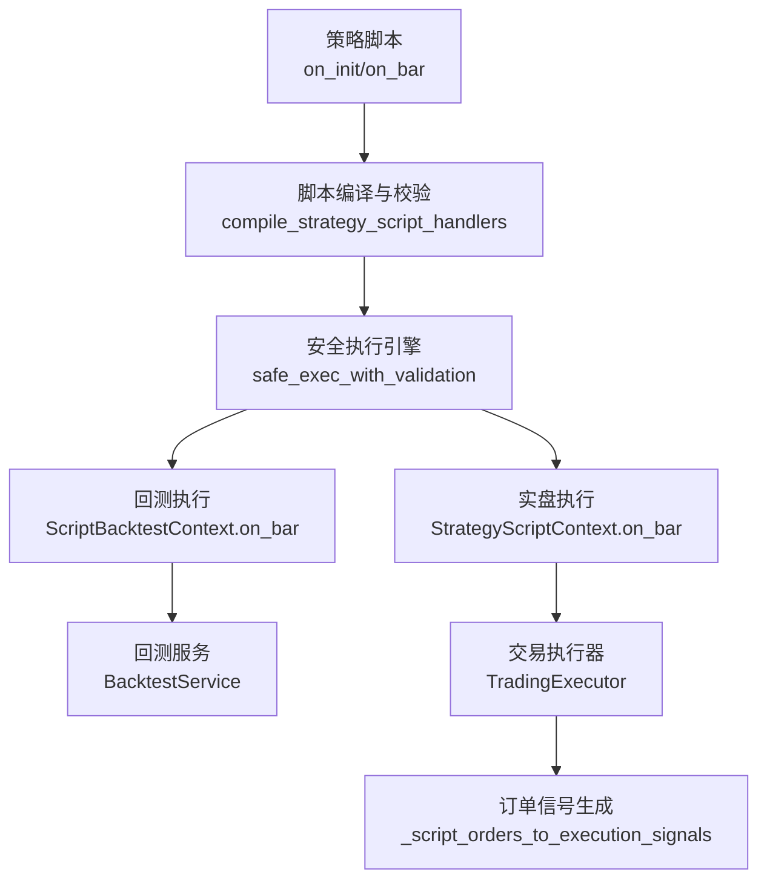
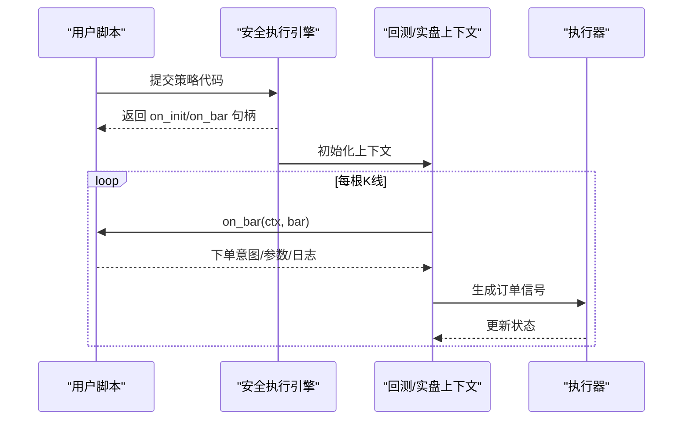
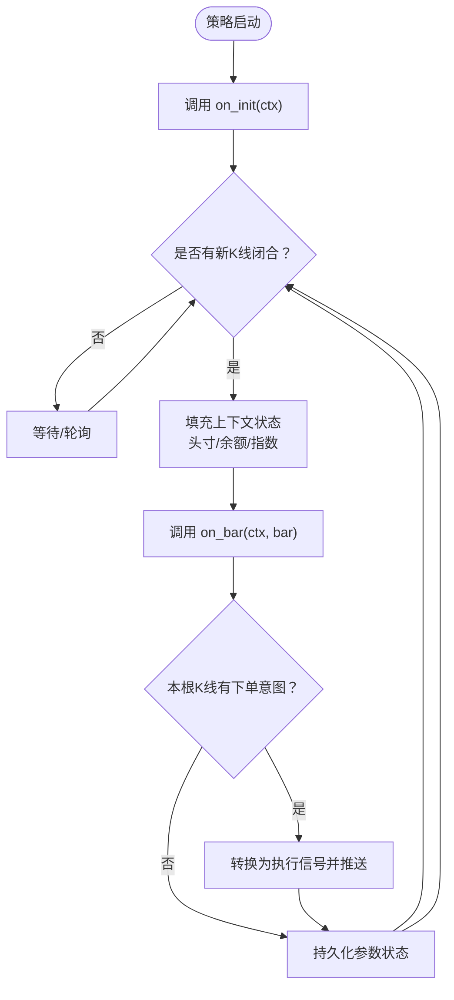
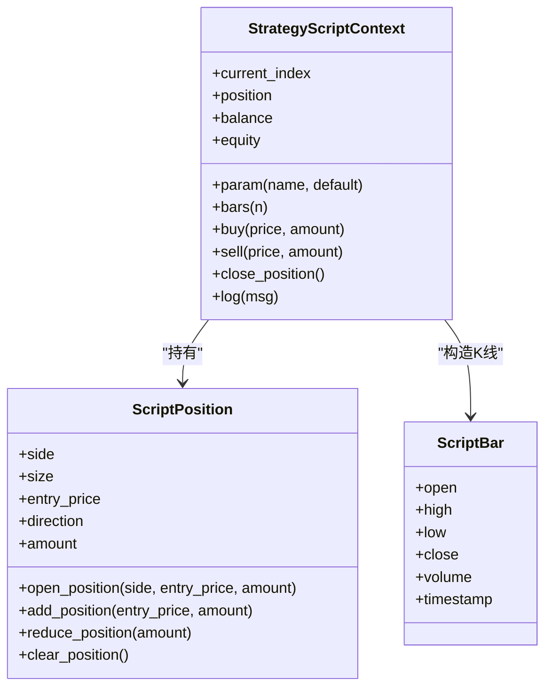
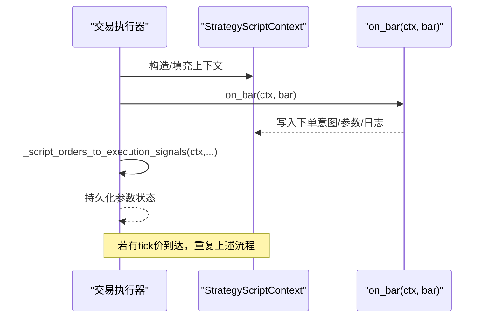
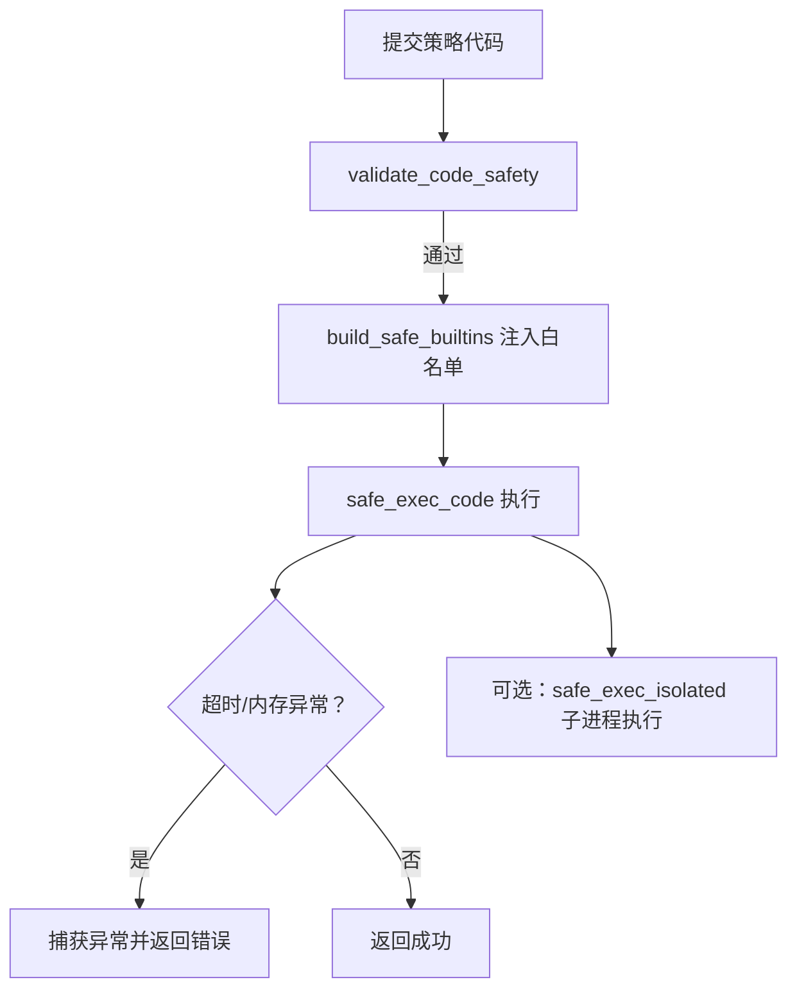
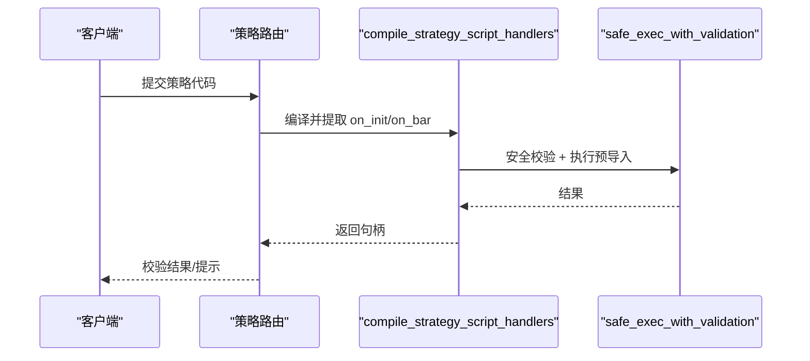
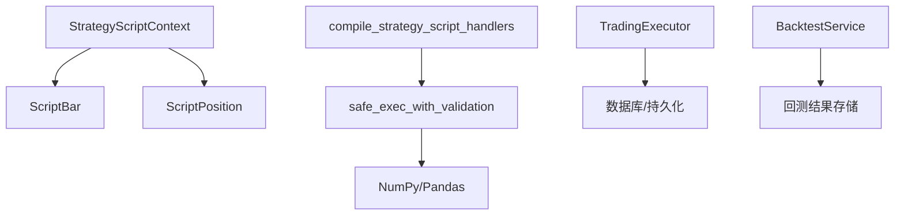

# ScriptStrategy脚本策略

<cite>
**本文引用的文件**
- [strategy_script_runtime.py](file://backend_api_python/app/services/strategy_script_runtime.py)
- [safe_exec.py](file://backend_api_python/app/utils/safe_exec.py)
- [backtest.py](file://backend_api_python/app/services/backtest.py)
- [trading_executor.py](file://backend_api_python/app/services/trading_executor.py)
- [strategy.py](file://backend_api_python/app/routes/strategy.py)
- [multi_indicator_composite.py](file://docs/examples/multi_indicator_composite.py)
- [dual_ma_with_params.py](file://docs/examples/dual_ma_with_params.py)
- [cross_sectional_momentum_rsi.py](file://docs/examples/cross_sectional_momentum_rsi.py)
- [STRATEGY_DEV_GUIDE.md](file://docs/STRATEGY_DEV_GUIDE.md)
</cite>

## 目录
1. [简介](#简介)
2. [项目结构](#项目结构)
3. [核心组件](#核心组件)
4. [架构总览](#架构总览)
5. [详细组件分析](#详细组件分析)
6. [依赖分析](#依赖分析)
7. [性能考虑](#性能考虑)
8. [故障排查指南](#故障排查指南)
9. [结论](#结论)
10. [附录](#附录)

## 简介
ScriptStrategy脚本策略采用事件驱动的开发范式，围绕 on_init 初始化与 on_bar 周期回调两大事件展开。策略在回测与实盘两条路径中共享同一套运行时模型：通过 StrategyScriptContext 提供参数、历史K线、订单意图与日志能力；通过 ScriptBar 封装单根K线数据；通过 ScriptPosition 管理头寸状态。运行时环境采用严格的安全隔离与资源限制，确保用户脚本在受控沙箱中执行，避免对宿主系统造成影响。

## 项目结构
ScriptStrategy相关代码主要分布在以下模块：
- 运行时与数据模型：strategy_script_runtime.py
- 安全执行与隔离：safe_exec.py
- 回测与脚本验证：backtest.py
- 实盘执行与事件循环：trading_executor.py
- API路由与脚本校验：strategy.py
- 示例策略与开发指南：docs/examples/*.py 与 STRATEGY_DEV_GUIDE.md

**图表来源**
- [strategy_script_runtime.py:159-191](file://backend_api_python/app/services/strategy_script_runtime.py#L159-L191)
- [safe_exec.py:207-243](file://backend_api_python/app/utils/safe_exec.py#L207-L243)
- [backtest.py:2194-2226](file://backend_api_python/app/services/backtest.py#L2194-L2226)
- [trading_executor.py:1076-1091](file://backend_api_python/app/services/trading_executor.py#L1076-L1091)

**章节来源**
- [strategy_script_runtime.py:1-191](file://backend_api_python/app/services/strategy_script_runtime.py#L1-L191)
- [safe_exec.py:1-471](file://backend_api_python/app/utils/safe_exec.py#L1-L471)
- [backtest.py:1-200](file://backend_api_python/app/services/backtest.py#L1-L200)
- [trading_executor.py:725-1288](file://backend_api_python/app/services/trading_executor.py#L725-L1288)
- [strategy.py:67-122](file://backend_api_python/app/routes/strategy.py#L67-L122)

## 核心组件
- ScriptBar：封装单根K线的开放高低价、收盘价、成交量与时间戳，支持点式访问。
- ScriptPosition：封装头寸方向、数量、均价与金额，提供开仓、加仓、减仓与清仓操作。
- StrategyScriptContext：策略运行时上下文，提供参数注册（param）、历史K线窗口（bars）、下单意图（buy/sell/close_position）、日志（log）与账户余额/权益。
- 编译器：compile_strategy_script_handlers 校验并提取 on_init 与 on_bar，确保 on_bar 必须存在且可调用。
- 安全执行：safe_exec_with_validation 执行前进行安全扫描与白名单注入，随后在受限环境中执行脚本。
- 回测/实盘：回测服务与交易执行器分别在各自上下文中调用 on_bar，完成策略逻辑与信号生成。

**章节来源**
- [strategy_script_runtime.py:17-157](file://backend_api_python/app/services/strategy_script_runtime.py#L17-L157)
- [strategy_script_runtime.py:159-191](file://backend_api_python/app/services/strategy_script_runtime.py#L159-L191)
- [safe_exec.py:207-243](file://backend_api_python/app/utils/safe_exec.py#L207-L243)
- [backtest.py:2194-2226](file://backend_api_python/app/services/backtest.py#L2194-L2226)
- [trading_executor.py:1076-1091](file://backend_api_python/app/services/trading_executor.py#L1076-L1091)

## 架构总览
ScriptStrategy在两条执行链路中复用同一套事件模型与数据结构：
- 回测链路：由回测服务加载数据，构建 ScriptBacktestContext，逐根K线调用 on_bar。
- 实盘链路：由交易执行器接收实时K线，构建 StrategyScriptContext，逐根K线调用 on_bar，并将订单意图转换为执行信号。

**图表来源**
- [safe_exec.py:207-243](file://backend_api_python/app/utils/safe_exec.py#L207-L243)
- [backtest.py:2194-2226](file://backend_api_python/app/services/backtest.py#L2194-L2226)
- [trading_executor.py:1076-1091](file://backend_api_python/app/services/trading_executor.py#L1076-L1091)

## 详细组件分析

### 事件循环与生命周期管理
- 生命周期阶段
  - 初始化：on_init(ctx) 在策略启动时被调用，用于注册参数、初始化内部状态。
  - 周期回调：on_bar(ctx, bar) 在每根K线闭合后被调用，策略在此处决定是否下单或调整头寸。
  - 实时tick：在实盘链路中，若启用tick级推进，会在每笔成交价到达时生成tick条目并触发一次 on_bar。
- 上下文状态
  - ctx.current_index：当前K线索引，便于按需回溯历史K线。
  - ctx.bars(n)：返回最近 n 根K线的列表，便于计算移动平均、RSI等指标。
  - ctx.position：当前头寸状态，支持开仓、加仓、减仓与清仓。
  - ctx.balance/equity：账户余额与权益，用于风险控制与仓位计算。
  - ctx._orders：收集本根K线内的下单意图，由执行器转换为信号。

**图表来源**
- [trading_executor.py:734-786](file://backend_api_python/app/services/trading_executor.py#L734-L786)
- [trading_executor.py:1076-1091](file://backend_api_python/app/services/trading_executor.py#L1076-L1091)
- [backtest.py:2214-2226](file://backend_api_python/app/services/backtest.py#L2214-L2226)

**章节来源**
- [strategy_script_runtime.py:114-157](file://backend_api_python/app/services/strategy_script_runtime.py#L114-L157)
- [trading_executor.py:734-786](file://backend_api_python/app/services/trading_executor.py#L734-L786)
- [backtest.py:2214-2226](file://backend_api_python/app/services/backtest.py#L2214-L2226)

### 数据结构与复杂度
- ScriptBar：O(1) 访问各字段。
- ScriptPosition：开仓/加仓/减仓均为 O(1) 状态更新。
- StrategyScriptContext.bars(n)：遍历最近 n 根K线，时间复杂度 O(n)，空间复杂度 O(n)。
- 整体策略逻辑复杂度取决于指标计算与信号判断，通常为 O(n) 每根K线。

**图表来源**
- [strategy_script_runtime.py:17-157](file://backend_api_python/app/services/strategy_script_runtime.py#L17-L157)

**章节来源**
- [strategy_script_runtime.py:17-157](file://backend_api_python/app/services/strategy_script_runtime.py#L17-L157)

### 实时数据处理与tick推进
- 实盘链路在K线闭合后调用 on_bar，同时支持tick级推进：当有最新成交价到达时，构造 tick 条目并再次调用 on_bar，从而实现毫秒级响应。
- 执行器将 ctx._orders 转换为实际执行信号，并持久化参数状态以便后续恢复。

**图表来源**
- [trading_executor.py:1247-1270](file://backend_api_python/app/services/trading_executor.py#L1247-L1270)

**章节来源**
- [trading_executor.py:1247-1270](file://backend_api_python/app/services/trading_executor.py#L1247-L1270)

### 脚本运行时安全隔离与资源限制
- 代码安全扫描：validate_code_safety 使用正则与AST双重校验，拒绝危险模式与非法模块导入。
- 白名单内置：build_safe_builtins 仅暴露纯计算类内置函数与有限模块，禁用 eval/exec/open 等危险能力。
- 超时保护：timeout_context 支持跨平台超时注入，防止无限循环与长时间阻塞。
- 内存限制：safe_exec_code 在非Windows平台可通过RLIMIT_AS限制内存占用。
- 子进程隔离：safe_exec_isolated 将用户代码放入独立子进程执行，崩溃或超时仅影响子进程。

**图表来源**
- [safe_exec.py:358-471](file://backend_api_python/app/utils/safe_exec.py#L358-L471)
- [safe_exec.py:157-205](file://backend_api_python/app/utils/safe_exec.py#L157-L205)
- [safe_exec.py:248-354](file://backend_api_python/app/utils/safe_exec.py#L248-L354)

**章节来源**
- [safe_exec.py:358-471](file://backend_api_python/app/utils/safe_exec.py#L358-L471)
- [safe_exec.py:157-205](file://backend_api_python/app/utils/safe_exec.py#L157-L205)
- [safe_exec.py:248-354](file://backend_api_python/app/utils/safe_exec.py#L248-L354)

### API与脚本校验流程
- API层对策略代码进行初步校验：检查是否存在 on_init/on_bar、是否能编译、是否能通过安全校验。
- 校验通过后，编译器返回 on_init/on_bar 句柄，供回测/实盘调用。

**图表来源**
- [strategy.py:67-122](file://backend_api_python/app/routes/strategy.py#L67-L122)
- [strategy_script_runtime.py:159-191](file://backend_api_python/app/services/strategy_script_runtime.py#L159-L191)
- [safe_exec.py:207-243](file://backend_api_python/app/utils/safe_exec.py#L207-L243)

**章节来源**
- [strategy.py:67-122](file://backend_api_python/app/routes/strategy.py#L67-L122)
- [strategy_script_runtime.py:159-191](file://backend_api_python/app/services/strategy_script_runtime.py#L159-L191)
- [safe_exec.py:207-243](file://backend_api_python/app/utils/safe_exec.py#L207-L243)

### 示例策略与最佳实践

#### 跨市场动量策略
- 思路概述：基于多市场K线数据计算动量评分，结合风控参数生成多/空头信号。
- 关键要点：使用 ctx.param 注册参数；通过 ctx.bars 获取近期K线；使用 ctx.buy/ctx.sell/ctx.close_position 发出订单意图；利用 ctx.log 记录关键决策。
- 参考示例：多指标组合策略展示了参数声明、指标计算与信号生成的规范写法。

**章节来源**
- [multi_indicator_composite.py:1-109](file://docs/examples/multi_indicator_composite.py#L1-L109)
- [dual_ma_with_params.py:1-64](file://docs/examples/dual_ma_with_params.py#L1-L64)

#### 条件单策略
- 思路概述：在特定价格条件满足时自动下单，支持止损止盈与方向切换。
- 关键要点：在 on_bar 中读取当前价格与头寸状态，结合风控参数判断是否触发条件单；注意避免重复下单。

**章节来源**
- [STRATEGY_DEV_GUIDE.md:711-765](file://docs/STRATEGY_DEV_GUIDE.md#L711-L765)

#### 动态资产配置策略
- 思路概述：根据市场状态或评分对多个标的进行动态权重分配，定期再平衡。
- 参考示例：截面动量RSI示例展示了如何为多标的打分与排序，为后续资产配置提供基础。

**章节来源**
- [cross_sectional_momentum_rsi.py:1-71](file://docs/examples/cross_sectional_momentum_rsi.py#L1-L71)

## 依赖分析
- 组件耦合
  - StrategyScriptContext 与 ScriptBar/ScriptPosition 强内聚，提供策略所需的核心能力。
  - 编译器与安全执行器解耦，前者负责提取函数，后者负责执行与隔离。
  - 回测与实盘共享同一套上下文接口，降低维护成本。
- 外部依赖
  - NumPy/Pandas 通过白名单导入，保证计算能力与性能。
  - PostgreSQL/数据库连接用于持久化回测结果与运行状态。

**图表来源**
- [strategy_script_runtime.py:17-157](file://backend_api_python/app/services/strategy_script_runtime.py#L17-L157)
- [strategy_script_runtime.py:159-191](file://backend_api_python/app/services/strategy_script_runtime.py#L159-L191)
- [safe_exec.py:207-243](file://backend_api_python/app/utils/safe_exec.py#L207-L243)

**章节来源**
- [strategy_script_runtime.py:17-157](file://backend_api_python/app/services/strategy_script_runtime.py#L17-L157)
- [strategy_script_runtime.py:159-191](file://backend_api_python/app/services/strategy_script_runtime.py#L159-L191)
- [safe_exec.py:207-243](file://backend_api_python/app/utils/safe_exec.py#L207-L243)

## 性能考虑
- 计算优化
  - 使用 Pandas 向量化计算替代显式循环，减少Python层开销。
  - 合理使用 ctx.bars(n) 控制回溯窗口，避免不必要的大数据集遍历。
- 内存管理
  - 通过安全执行器的内存限制与白名单内置，防止内存泄漏与过度占用。
  - 在长周期回测中，建议分批处理或降低数据精度以节省内存。
- 执行效率
  - 将高频计算（如移动平均、RSI）放在指标计算阶段，策略逻辑尽量简洁。
  - 避免在 on_bar 中进行网络I/O或阻塞操作，必要时使用异步或缓存。

## 故障排查指南
- 常见问题
  - 缺少 on_bar：确保策略定义了 on_bar(ctx, bar)。
  - 语法错误：检查代码语法，确保可编译。
  - 安全拒绝：检查是否使用了未授权的内置或模块，遵循白名单规则。
  - 超时/内存不足：缩短计算窗口、减少复杂度或提升超时/内存限制。
- 调试技巧
  - 使用 ctx.log 记录关键中间值与决策依据，便于定位问题。
  - 在回测服务中逐步缩小时间范围，快速定位异常区间。
  - 对比回测与实盘数据差异，确认数据源与时间戳一致性。
- 性能监控
  - 观察每根K线的执行耗时，识别热点函数。
  - 监控内存使用与峰值，避免接近限制导致的中断。

**章节来源**
- [strategy.py:67-122](file://backend_api_python/app/routes/strategy.py#L67-L122)
- [safe_exec.py:157-205](file://backend_api_python/app/utils/safe_exec.py#L157-L205)
- [backtest.py:2194-2226](file://backend_api_python/app/services/backtest.py#L2194-L2226)

## 结论
ScriptStrategy脚本策略通过事件驱动的 on_init/on_bar 模型，实现了在回测与实盘中的统一运行时体验。借助严格的沙箱与资源限制，保障了系统的稳定性与安全性；通过清晰的上下文与订单意图抽象，降低了策略开发的复杂度。配合示例策略与开发指南，开发者可以快速构建从简单均值回归到复杂的跨市场动量与动态资产配置策略。

## 附录
- 开发最佳实践
  - 明确参数化：使用 ctx.param 注册所有可调参数。
  - 清晰信号：仅在 on_bar 中发出下单意图，避免在其他地方直接下单。
  - 简洁逻辑：将复杂计算前置到指标阶段，策略逻辑保持轻量。
  - 安全优先：遵循白名单规则，避免任何潜在危险操作。
- 调试与监控清单
  - 使用 ctx.log 记录关键变量与条件分支。
  - 在回测中对比不同参数组合的表现，定位最优配置。
  - 监控执行耗时与内存峰值，及时优化热点路径。