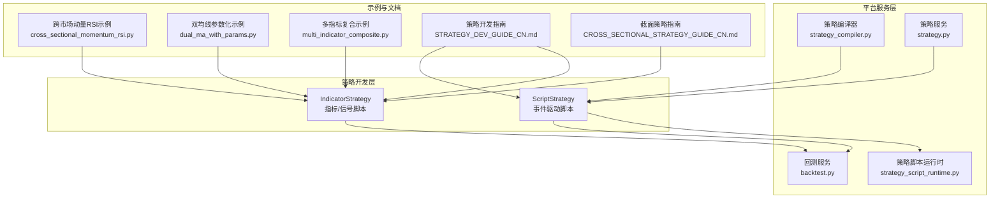
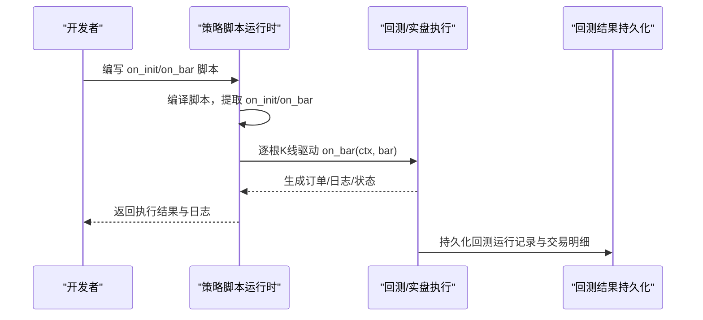
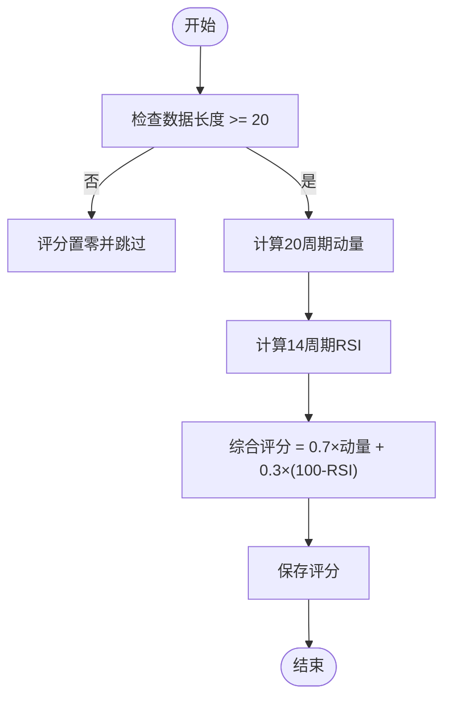
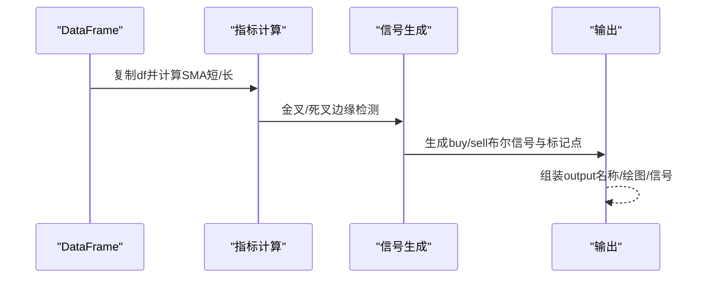
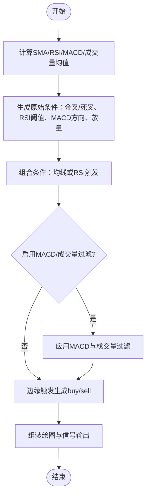
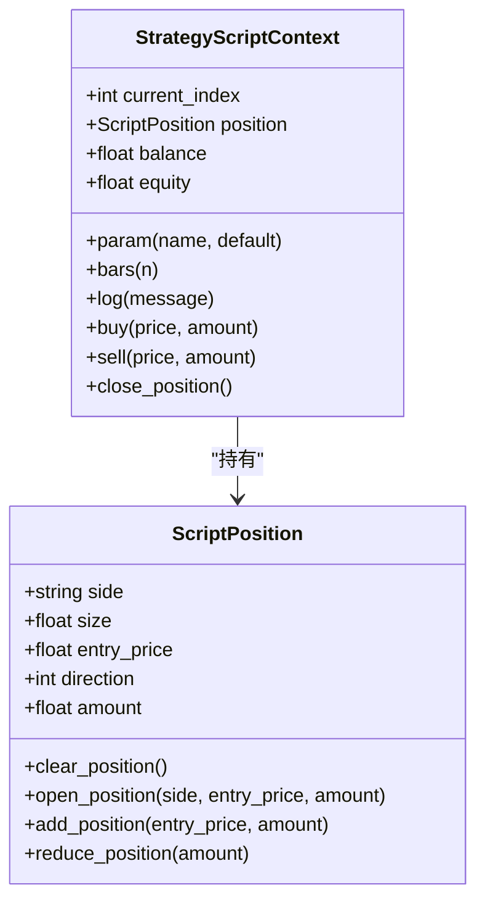
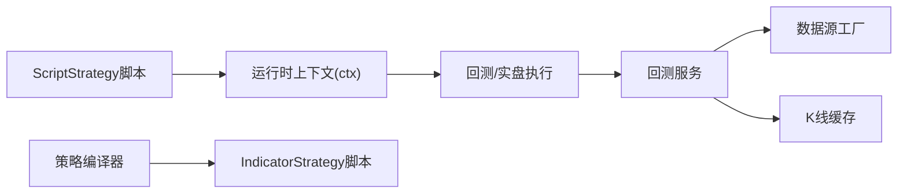

# 脚本开发示例

<cite>
**本文引用的文件**
- [cross_sectional_momentum_rsi.py](file://docs/examples/cross_sectional_momentum_rsi.py)
- [dual_ma_with_params.py](file://docs/examples/dual_ma_with_params.py)
- [multi_indicator_composite.py](file://docs/examples/multi_indicator_composite.py)
- [STRATEGY_DEV_GUIDE_CN.md](file://docs/STRATEGY_DEV_GUIDE_CN.md)
- [CROSS_SECTIONAL_STRATEGY_GUIDE_CN.md](file://docs/CROSS_SECTIONAL_STRATEGY_GUIDE_CN.md)
- [strategy.py](file://backend_api_python/app/services/strategy.py)
- [backtest.py](file://backend_api_python/app/services/backtest.py)
- [strategy_script_runtime.py](file://backend_api_python/app/services/strategy_script_runtime.py)
- [strategy_compiler.py](file://backend_api_python/app/services/strategy_compiler.py)
</cite>

## 目录
1. [引言](#引言)
2. [项目结构](#项目结构)
3. [核心组件](#核心组件)
4. [架构总览](#架构总览)
5. [详细组件分析](#详细组件分析)
6. [依赖分析](#依赖分析)
7. [性能考虑](#性能考虑)
8. [故障排查指南](#故障排查指南)
9. [结论](#结论)
10. [附录](#附录)

## 引言
本指南围绕 ScriptStrategy 脚本开发，提供从零到一的实战路径，覆盖跨市场动量 RS I策略、双均线参数化策略、多指标复合策略三大案例。文档不仅解释交易逻辑、参数设置与风控策略，还给出参数化最佳实践（动态参数、条件单、止盈止损）、复杂交易逻辑（网格、套利、资产配置）的实现思路、策略测试与回测验证方法，以及常见问题与优化建议。

## 项目结构
QuantDinger 提供两类策略开发路径：
- IndicatorStrategy：基于 DataFrame 的指标/信号脚本，适合图表渲染、信号型回测与策略原型验证。
- ScriptStrategy：基于 on_init/on_bar 的事件驱动脚本，适合运行时状态、动态仓位管理与执行控制。

**图表来源**
- [strategy_script_runtime.py:114-191](file://backend_api_python/app/services/strategy_script_runtime.py#L114-L191)
- [backtest.py:64-142](file://backend_api_python/app/services/backtest.py#L64-L142)
- [strategy_compiler.py:4-35](file://backend_api_python/app/services/strategy_compiler.py#L4-L35)
- [strategy.py:14-57](file://backend_api_python/app/services/strategy.py#L14-L57)
- [cross_sectional_momentum_rsi.py:1-71](file://docs/examples/cross_sectional_momentum_rsi.py#L1-L71)
- [dual_ma_with_params.py:1-64](file://docs/examples/dual_ma_with_params.py#L1-L64)
- [multi_indicator_composite.py:1-109](file://docs/examples/multi_indicator_composite.py#L1-L109)
- [STRATEGY_DEV_GUIDE_CN.md:1-120](file://docs/STRATEGY_DEV_GUIDE_CN.md#L1-L120)
- [CROSS_SECTIONAL_STRATEGY_GUIDE_CN.md:1-60](file://docs/CROSS_SECTIONAL_STRATEGY_GUIDE_CN.md#L1-L60)

**章节来源**
- [STRATEGY_DEV_GUIDE_CN.md:1-120](file://docs/STRATEGY_DEV_GUIDE_CN.md#L1-L120)

## 核心组件
- 策略脚本运行时（ScriptStrategy）
  - 提供 ctx 上下文：参数读取、历史K线、位置状态、下单与日志。
  - 将脚本编译为 on_init/on_bar 可执行句柄。
- 回测服务
  - 支持标准回测与多时间框架（MTF）回测，提供执行精度信息与结果持久化。
- 策略编译器（辅助）
  - 将配置转换为可执行的 IndicatorStrategy 脚本骨架，便于快速原型。
- 策略服务
  - 提供策略类型查询、运行中策略列表、交易对查询与连接测试等。

**章节来源**
- [strategy_script_runtime.py:114-191](file://backend_api_python/app/services/strategy_script_runtime.py#L114-L191)
- [backtest.py:64-142](file://backend_api_python/app/services/backtest.py#L64-L142)
- [strategy_compiler.py:4-35](file://backend_api_python/app/services/strategy_compiler.py#L4-L35)
- [strategy.py:14-57](file://backend_api_python/app/services/strategy.py#L14-L57)

## 架构总览
ScriptStrategy 的执行链路由“脚本编译—回测/实盘—结果持久化”构成，支持 bot 模式与 bar-close 模式的差异化行为。

**图表来源**
- [strategy_script_runtime.py:159-191](file://backend_api_python/app/services/strategy_script_runtime.py#L159-L191)
- [backtest.py:444-668](file://backend_api_python/app/services/backtest.py#L444-L668)

## 详细组件分析

### 跨市场动量RSI策略（截面研究示例）
- 适用场景
  - 多标的评分与排序，构建多/空头组合，适合截面策略研究与未来平台链路对接。
- 交易逻辑
  - 动量因子（20周期）：价格变化率越高评分越高。
  - RSI因子（14周期）：反转值（100 - RSI），越低评分越高。
  - 综合评分：70% 动量 + 30% RSI 反转值。
- 参数与风控
  - 示例中未显式声明 # @strategy，适合研究阶段；若接入平台默认风控，可在脚本顶部添加默认配置。
- 关键实现要点
  - 遍历 data.items()，确保数据长度足够后再计算。
  - 使用边缘触发信号（可选）提升稳定性。
- 输出
  - 返回 scores 字典；可选提供 rankings 列表。

**图表来源**
- [cross_sectional_momentum_rsi.py:26-61](file://docs/examples/cross_sectional_momentum_rsi.py#L26-L61)

**章节来源**
- [cross_sectional_momentum_rsi.py:1-71](file://docs/examples/cross_sectional_momentum_rsi.py#L1-L71)
- [CROSS_SECTIONAL_STRATEGY_GUIDE_CN.md:60-123](file://docs/CROSS_SECTIONAL_STRATEGY_GUIDE_CN.md#L60-L123)

### 双均线参数化策略（文档同步版）
- 适用场景
  - 快速验证均线交叉逻辑，演示 # @param 与 # @strategy 的标准写法，配合平台回测面板默认风控。
- 交易逻辑
  - 短期/长期均线金叉做多、死叉做空，生成边缘触发 buy/sell 信号。
- 参数声明
  - # @param sma_short/int/14、# @param sma_long/int/28。
- 默认风控
  - # @strategy stopLossPct、takeProfitPct、entryPct、trailingEnabled、tradeDirection both。
- 关键实现要点
  - 使用 shift(1) 判断交叉边缘，避免同趋势内重复发信号。
  - 输出 plots 与 signals 用于图表渲染。

**图表来源**
- [dual_ma_with_params.py:31-64](file://docs/examples/dual_ma_with_params.py#L31-L64)

**章节来源**
- [dual_ma_with_params.py:1-64](file://docs/examples/dual_ma_with_params.py#L1-L64)
- [STRATEGY_DEV_GUIDE_CN.md:93-176](file://docs/STRATEGY_DEV_GUIDE_CN.md#L93-L176)

### 多指标复合策略（文档同步版）
- 适用场景
  - 组合均线、RSI、MACD、成交量过滤，演示稳定边缘触发信号的生成。
- 参数声明
  - # @param sma_short/…、rsi_period、rsi_oversold/overbought、use_macd/use_volume、volume_mult。
- 默认风控
  - # @strategy stopLossPct、takeProfitPct、entryPct、trailingEnabled、trailingStopPct、trailingActivationPct、tradeDirection both。
- 交易逻辑
  - 原始条件：均线金叉/死叉、RSI超买/超卖、MACD方向、成交量放大。
  - 组合条件：均线或RSI触发；可选加入MACD与成交量过滤。
  - 边缘触发：去重连续触发，提升稳健性。
- 关键实现要点
  - RSI、MACD独立计算后参与组合。
  - 输出 plots（SMA、RSI、MACD）与 signals（买卖标记）。

**图表来源**
- [multi_indicator_composite.py:35-109](file://docs/examples/multi_indicator_composite.py#L35-L109)

**章节来源**
- [multi_indicator_composite.py:1-109](file://docs/examples/multi_indicator_composite.py#L1-L109)
- [STRATEGY_DEV_GUIDE_CN.md:298-363](file://docs/STRATEGY_DEV_GUIDE_CN.md#L298-L363)

### ScriptStrategy 实战：参数化、动态风控与复杂逻辑
- 参数化最佳实践
  - 使用 ctx.param(name, default) 读取脚本默认参数，避免硬编码。
  - 将杠杆、交易方向、风控阈值等放入产品配置，脚本中仅保留必要默认值。
- 动态参数与条件单
  - 基于历史K线与指标动态计算入场条件；使用 ctx.bars(n) 获取窗口数据。
  - 条件单：根据当前持仓状态与价格走势，动态设置止盈止损与追踪止损。
- 止盈止损机制
  - 引擎默认风控：# @strategy stopLossPct/takeProfitPct/trailing 系列。
  - 运行时退出：在 on_bar 中根据持仓与价格条件主动平仓。
- 复杂交易逻辑
  - 网格交易：bot 模式下以类 tick 的伪 bar 驱动，按网格档位挂单与反向。
  - 套利策略：跨市场/跨品种价差信号触发，结合风控与资金管理。
  - 资产配置模型：多策略/多标的组合，按波动率或风险预算分配头寸。

**图表来源**
- [strategy_script_runtime.py:25-112](file://backend_api_python/app/services/strategy_script_runtime.py#L25-L112)
- [strategy_script_runtime.py:114-157](file://backend_api_python/app/services/strategy_script_runtime.py#L114-L157)

**章节来源**
- [strategy_script_runtime.py:1-191](file://backend_api_python/app/services/strategy_script_runtime.py#L1-L191)
- [STRATEGY_DEV_GUIDE_CN.md:570-780](file://docs/STRATEGY_DEV_GUIDE_CN.md#L570-L780)

## 依赖分析
- 组件耦合
  - ScriptStrategy 依赖运行时上下文（ctx）与历史K线（bars），与回测/实盘执行链路解耦。
  - 回测服务负责数据获取、信号仿真与指标计算，输出标准化结果。
  - 策略编译器用于将配置转换为可执行脚本骨架，辅助快速原型。
- 外部依赖
  - pandas/numpy 用于数据处理与指标计算。
  - 数据源工厂与缓存机制减少重复拉取，提升性能。

**图表来源**
- [backtest.py:25-61](file://backend_api_python/app/services/backtest.py#L25-L61)
- [strategy_compiler.py:4-35](file://backend_api_python/app/services/strategy_compiler.py#L4-L35)

**章节来源**
- [backtest.py:25-82](file://backend_api_python/app/services/backtest.py#L25-L82)
- [strategy_compiler.py:1-689](file://backend_api_python/app/services/strategy_compiler.py#L1-L689)

## 性能考虑
- 多时间框架回测（MTF）
  - 在 1 分钟至 5 分钟范围内提供更高精度回测；超过范围则回退为标准回测。
  - 当存在缩量规则或非 next_bar_open 的执行时机时，可能回退为标准回测。
- 执行精度与回退
  - precision_info 提供启用原因与消息；fallback_reason 指示回退原因。
- 交易成本与滑点
  - 回测服务支持 commission/slippage 配置，建议在策略开发早期即设定合理值。

**章节来源**
- [backtest.py:170-224](file://backend_api_python/app/services/backtest.py#L170-L224)
- [backtest.py:444-554](file://backend_api_python/app/services/backtest.py#L444-L554)

## 故障排查指南
- 策略不执行
  - 检查策略类型与配置字段（如截面策略 cs_strategy_type、symbol_list）。
  - 确认调仓频率与数据可用性。
- 指标执行失败
  - 确保 scores 字典正确填充；检查各标的可用数据。
- 信号不生成
  - 校验 portfolio_size 与 long_ratio 的合理性；确认评分有效。
- 回测结果异常
  - 核对成交时机（next_bar_open/same_bar_close）与滑点/手续费设置。
  - 若使用 MTF，确认 precision_info 与 fallback_reason。

**章节来源**
- [CROSS_SECTIONAL_STRATEGY_GUIDE_CN.md:210-224](file://docs/CROSS_SECTIONAL_STRATEGY_GUIDE_CN.md#L210-L224)
- [backtest.py:444-554](file://backend_api_python/app/services/backtest.py#L444-L554)

## 结论
通过本指南，开发者可基于 ScriptStrategy 构建从参数化到动态风控、从信号生成到复杂执行的全栈策略。建议遵循“先 IndicatorStrategy 验证信号，再迁移到 ScriptStrategy 管理状态与风控”的路径，并充分利用平台提供的回测与运行时工具，持续迭代参数与逻辑。

## 附录
- 术语
  - 边缘触发：仅在条件首次满足时触发，避免同趋势内重复信号。
  - MTF：多时间框架回测，利用更高精度数据提升仿真精度。
  - bot 模式：以类 tick 的伪 bar 驱动，适合网格/DCA等机器人风格策略。
- 参考示例
  - 跨市场动量RSI、双均线参数化、多指标复合策略的完整实现路径与参数说明。