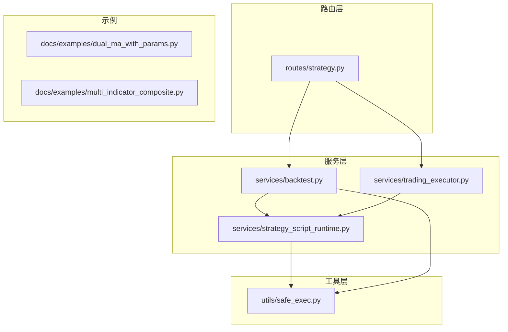
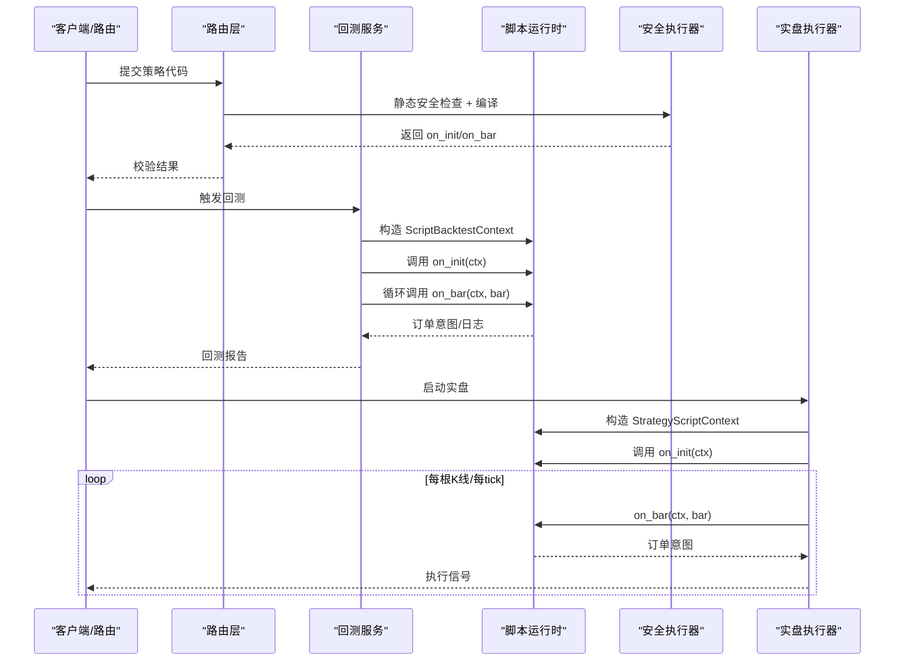
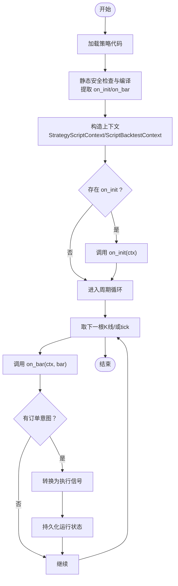
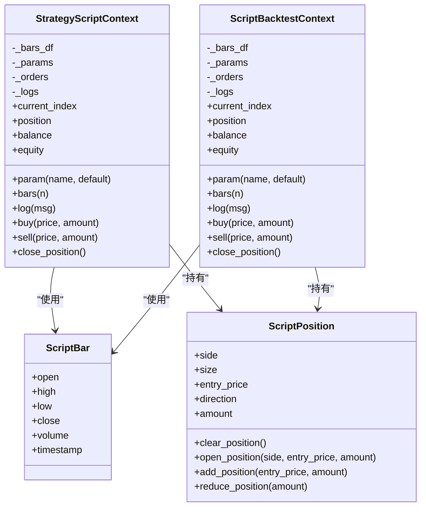
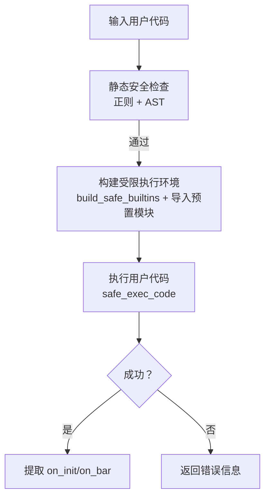
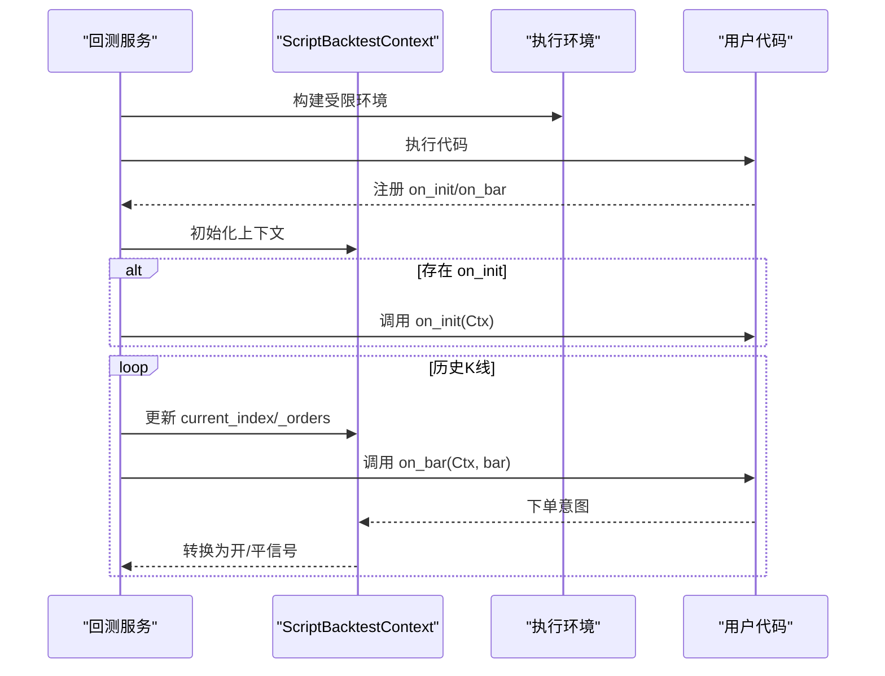
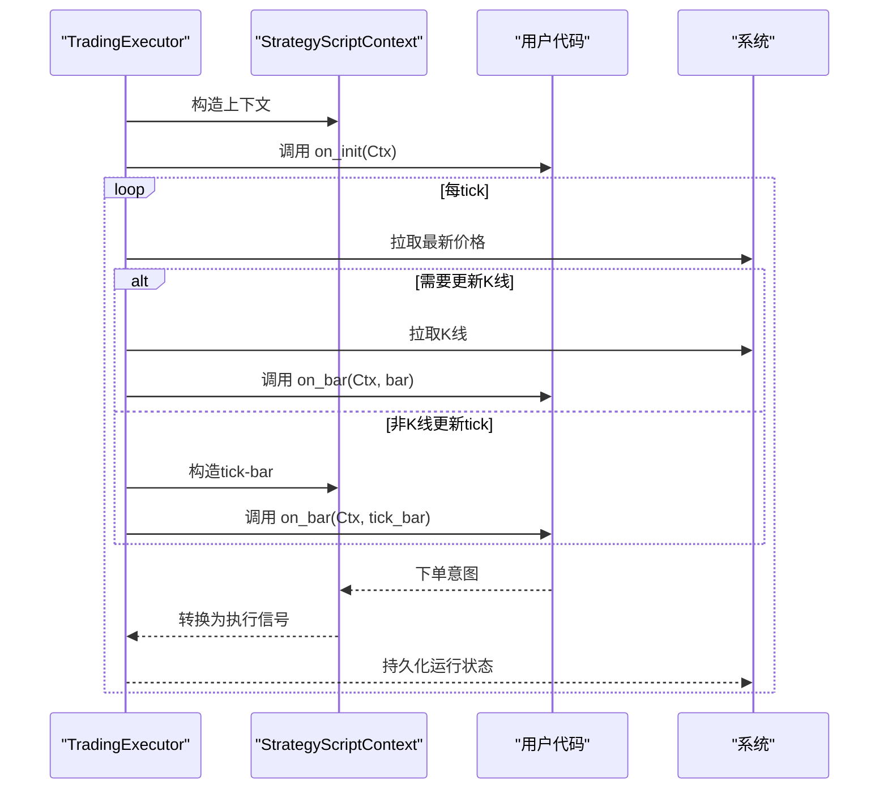
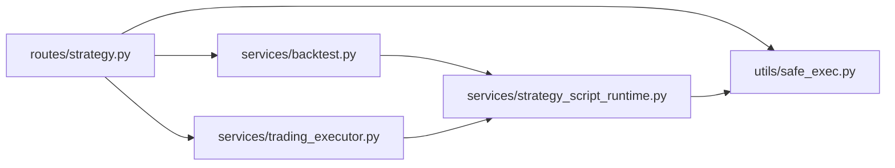

# 脚本编程模型

<cite>
**本文引用的文件**
- [strategy_script_runtime.py](file://backend_api_python/app/services/strategy_script_runtime.py)
- [safe_exec.py](file://backend_api_python/app/utils/safe_exec.py)
- [backtest.py](file://backend_api_python/app/services/backtest.py)
- [trading_executor.py](file://backend_api_python/app/services/trading_executor.py)
- [strategy.py](file://backend_api_python/app/routes/strategy.py)
- [dual_ma_with_params.py](file://docs/examples/dual_ma_with_params.py)
- [multi_indicator_composite.py](file://docs/examples/multi_indicator_composite.py)
</cite>

## 目录
1. [简介](#简介)
2. [项目结构](#项目结构)
3. [核心组件](#核心组件)
4. [架构总览](#架构总览)
5. [详细组件分析](#详细组件分析)
6. [依赖关系分析](#依赖关系分析)
7. [性能考量](#性能考量)
8. [故障排查指南](#故障排查指南)
9. [结论](#结论)
10. [附录](#附录)

## 简介
本文件系统化阐述 ScriptStrategy 脚本编程模型，围绕事件驱动范式，详解 on_init 初始化函数与 on_bar 周期性回调函数的设计原理与生命周期。文档覆盖从策略加载、初始化到逐根 K 线处理的完整事件循环机制，解释脚本编译器如何将用户 Python 代码转换为可执行的策略函数，包括语法验证、安全沙箱与执行环境构建。同时提供编程模型示例，展示如何正确使用 ctx 上下文对象进行数据访问、订单管理与日志记录，并总结最佳实践、常见陷阱与调试技巧。

## 项目结构
ScriptStrategy 的实现主要分布在以下模块：
- 服务层：策略脚本运行时、回测服务、实盘交易执行器
- 工具层：安全执行与沙箱
- 路由层：策略 API 与校验
- 示例：文档示例脚本

图表来源
- [strategy.py:67-121](file://backend_api_python/app/routes/strategy.py#L67-L121)
- [strategy_script_runtime.py:159-191](file://backend_api_python/app/services/strategy_script_runtime.py#L159-L191)
- [backtest.py:2184-2276](file://backend_api_python/app/services/backtest.py#L2184-L2276)
- [trading_executor.py:1070-1269](file://backend_api_python/app/services/trading_executor.py#L1070-L1269)
- [safe_exec.py:207-244](file://backend_api_python/app/utils/safe_exec.py#L207-L244)

章节来源
- [strategy.py:67-121](file://backend_api_python/app/routes/strategy.py#L67-L121)
- [strategy_script_runtime.py:159-191](file://backend_api_python/app/services/strategy_script_runtime.py#L159-L191)
- [backtest.py:2184-2276](file://backend_api_python/app/services/backtest.py#L2184-L2276)
- [trading_executor.py:1070-1269](file://backend_api_python/app/services/trading_executor.py#L1070-L1269)
- [safe_exec.py:207-244](file://backend_api_python/app/utils/safe_exec.py#L207-L244)

## 核心组件
- ScriptBar：封装单根 K 线字段，支持字典与属性两种访问方式
- ScriptPosition：封装头寸状态与方向，提供开仓、加仓、减仓、平仓等操作
- StrategyScriptContext：脚本运行上下文，提供 param、bars、log、buy、sell、close_position 等接口
- compile_strategy_script_handlers：编译并提取 on_init/on_bar 函数，内置安全校验
- safe_exec_with_validation：静态安全检查 + 沙箱执行，保障代码安全与稳定性
- ScriptBacktestContext：回测专用上下文，行为与 StrategyScriptContext 保持一致
- TradingExecutor：实盘事件循环，按 K 线周期推进并调用 on_bar

章节来源
- [strategy_script_runtime.py:17-157](file://backend_api_python/app/services/strategy_script_runtime.py#L17-L157)
- [strategy_script_runtime.py:159-191](file://backend_api_python/app/services/strategy_script_runtime.py#L159-L191)
- [backtest.py:2142-2183](file://backend_api_python/app/services/backtest.py#L2142-L2183)
- [trading_executor.py:750-788](file://backend_api_python/app/services/trading_executor.py#L750-L788)

## 架构总览
事件驱动的脚本策略生命周期分为三个阶段：
- 策略加载与编译：路由层触发代码校验，编译器提取 on_init/on_bar
- 初始化阶段：回测或实盘加载历史数据，构造上下文并调用 on_init
- 周期执行阶段：按 K 线推进，逐根调用 on_bar，策略通过 ctx 下达订单意图，系统转换为执行信号

图表来源
- [strategy.py:67-121](file://backend_api_python/app/routes/strategy.py#L67-L121)
- [safe_exec.py:207-244](file://backend_api_python/app/utils/safe_exec.py#L207-L244)
- [backtest.py:2184-2276](file://backend_api_python/app/services/backtest.py#L2184-L2276)
- [trading_executor.py:1070-1269](file://backend_api_python/app/services/trading_executor.py#L1070-L1269)

## 详细组件分析

### 事件循环与生命周期
- 策略加载：路由层调用安全执行器进行静态校验与编译，提取 on_init/on_bar
- 初始化：回测/实盘分别构造上下文，调用 on_init(ctx)，用于初始化参数、状态
- 周期执行：按 K 线推进，逐根调用 on_bar(ctx, bar)，策略通过 ctx 下单意图
- 订单转换：系统将 ctx 的订单意图转换为执行信号并持久化运行状态

图表来源
- [strategy.py:67-121](file://backend_api_python/app/routes/strategy.py#L67-L121)
- [backtest.py:2184-2276](file://backend_api_python/app/services/backtest.py#L2184-L2276)
- [trading_executor.py:1070-1269](file://backend_api_python/app/services/trading_executor.py#L1070-L1269)

章节来源
- [strategy.py:67-121](file://backend_api_python/app/routes/strategy.py#L67-L121)
- [backtest.py:2184-2276](file://backend_api_python/app/services/backtest.py#L2184-L2276)
- [trading_executor.py:1070-1269](file://backend_api_python/app/services/trading_executor.py#L1070-L1269)

### 上下文与数据访问（ctx）
- param(name, default)：声明并读取策略参数，支持跨周期复用
- bars(n)：返回当前索引向前 n 根 K 线的列表，便于技术指标计算
- log(msg)：记录日志，便于回测与实盘追踪
- buy/sell(price, amount)/close_position()：提交订单意图，系统后续转换为执行信号

图表来源
- [strategy_script_runtime.py:114-157](file://backend_api_python/app/services/strategy_script_runtime.py#L114-L157)
- [strategy_script_runtime.py:17-112](file://backend_api_python/app/services/strategy_script_runtime.py#L17-L112)
- [backtest.py:2142-2183](file://backend_api_python/app/services/backtest.py#L2142-L2183)

章节来源
- [strategy_script_runtime.py:114-157](file://backend_api_python/app/services/strategy_script_runtime.py#L114-L157)
- [backtest.py:2142-2183](file://backend_api_python/app/services/backtest.py#L2142-L2183)

### 脚本编译与安全执行
- 静态安全检查：正则与 AST 双重校验，拒绝危险模式与非法模块导入
- 沙箱执行：受限 __builtins__ 与白名单模块，超时控制，必要时子进程隔离
- 编译提取：构建执行环境，注入 numpy/pandas，执行用户代码，提取 on_init/on_bar

图表来源
- [safe_exec.py:207-244](file://backend_api_python/app/utils/safe_exec.py#L207-L244)
- [safe_exec.py:358-471](file://backend_api_python/app/utils/safe_exec.py#L358-L471)

章节来源
- [safe_exec.py:207-244](file://backend_api_python/app/utils/safe_exec.py#L207-L244)
- [safe_exec.py:358-471](file://backend_api_python/app/utils/safe_exec.py#L358-L471)

### 回测执行流程
- 构造 ScriptBacktestContext，注入 __builtins__ 白名单与 numpy/pandas
- 执行用户代码，提取 on_init/on_bar
- 若存在 on_init，先调用一次初始化
- 遍历历史 K 线，逐根调用 on_bar(ctx, bar)，收集订单意图并转换为开平信号

图表来源
- [backtest.py:2184-2276](file://backend_api_python/app/services/backtest.py#L2184-L2276)

章节来源
- [backtest.py:2184-2276](file://backend_api_python/app/services/backtest.py#L2184-L2276)

### 实盘事件循环
- 初始化：加载策略配置，编译脚本，构造 StrategyScriptContext，调用 on_init
- 主循环：按 tick cadence 获取最新价格，必要时拉取 K 线，逐根评估 on_bar
- Bot 模式：每 tick 生成虚拟 K 线（当前价格），实时评估 on_bar
- 订单转换与持久化：将订单意图转换为执行信号，持久化运行参数

图表来源
- [trading_executor.py:1070-1269](file://backend_api_python/app/services/trading_executor.py#L1070-L1269)

章节来源
- [trading_executor.py:1070-1269](file://backend_api_python/app/services/trading_executor.py#L1070-L1269)

### 编程模型示例与最佳实践
- 示例一：双均线策略（参数声明、平台默认策略配置、边缘触发信号）
- 示例二：多指标组合策略（参数声明、RSI/MACD/成交量过滤、稳定信号）

建议实践：
- 明确声明参数并通过 ctx.param 读取，避免硬编码
- 使用 ctx.bars(n) 获取历史数据，避免直接依赖全局状态
- 通过 ctx.buy/sell/close_position 下达意图，不要直接操作外部状态
- 使用 ctx.log 记录关键决策点，便于回测与实盘审计
- 控制订单意图数量，避免频繁微小调整

章节来源
- [dual_ma_with_params.py:20-63](file://docs/examples/dual_ma_with_params.py#L20-L63)
- [multi_indicator_composite.py:16-108](file://docs/examples/multi_indicator_composite.py#L16-L108)

## 依赖关系分析
- 路由层依赖安全执行器完成代码校验与编译
- 回测与实盘均依赖脚本运行时上下文与安全执行器
- TradingExecutor 依赖数据源与执行信号转换模块

图表来源
- [strategy.py:67-121](file://backend_api_python/app/routes/strategy.py#L67-L121)
- [safe_exec.py:207-244](file://backend_api_python/app/utils/safe_exec.py#L207-L244)
- [backtest.py:2184-2276](file://backend_api_python/app/services/backtest.py#L2184-L2276)
- [trading_executor.py:1070-1269](file://backend_api_python/app/services/trading_executor.py#L1070-L1269)
- [strategy_script_runtime.py:159-191](file://backend_api_python/app/services/strategy_script_runtime.py#L159-L191)

章节来源
- [strategy.py:67-121](file://backend_api_python/app/routes/strategy.py#L67-L121)
- [safe_exec.py:207-244](file://backend_api_python/app/utils/safe_exec.py#L207-L244)
- [backtest.py:2184-2276](file://backend_api_python/app/services/backtest.py#L2184-L2276)
- [trading_executor.py:1070-1269](file://backend_api_python/app/services/trading_executor.py#L1070-L1269)
- [strategy_script_runtime.py:159-191](file://backend_api_python/app/services/strategy_script_runtime.py#L159-L191)

## 性能考量
- 代码执行超时与内存限制：安全执行器提供超时与内存上限，防止长耗时与内存泄漏
- 跨平台超时策略：Unix 使用信号，Windows 使用线程定时器注入异步异常
- 子进程隔离：在支持的环境下可启用子进程执行，进一步隔离风险
- 实盘 tick cadence：可通过环境变量调节 tick 间隔，平衡响应速度与资源消耗

章节来源
- [safe_exec.py:95-153](file://backend_api_python/app/utils/safe_exec.py#L95-L153)
- [safe_exec.py:248-354](file://backend_api_python/app/utils/safe_exec.py#L248-L354)
- [trading_executor.py:1120-1127](file://backend_api_python/app/services/trading_executor.py#L1120-L1127)

## 故障排查指南
- 代码校验失败：检查是否存在危险模式、非法导入或语法错误
- 运行时错误：on_init/on_bar 抛出异常会被捕获并记录堆栈，定位具体策略逻辑
- 实盘停止：当连续错误达到阈值或出现致命错误（如鉴权失败、符号不存在）时自动停止
- 订单未成交：确认 ctx 的订单意图是否被正确转换为执行信号，检查交易方向与风控配置

章节来源
- [strategy.py:67-121](file://backend_api_python/app/routes/strategy.py#L67-L121)
- [backtest.py:2273-2276](file://backend_api_python/app/services/backtest.py#L2273-L2276)
- [trading_executor.py:800-856](file://backend_api_python/app/services/trading_executor.py#L800-L856)

## 结论
ScriptStrategy 采用事件驱动的脚本模型，通过 on_init 与 on_bar 的清晰职责划分，结合安全沙箱与稳健的事件循环，实现了从回测到实盘的一致执行体验。开发者应遵循参数声明、意图下单与日志记录的最佳实践，充分利用 ctx 的数据访问与订单管理能力，确保策略的可维护性与可移植性。

## 附录
- 示例脚本路径
  - [双均线策略示例:20-63](file://docs/examples/dual_ma_with_params.py#L20-L63)
  - [多指标组合示例:16-108](file://docs/examples/multi_indicator_composite.py#L16-L108)