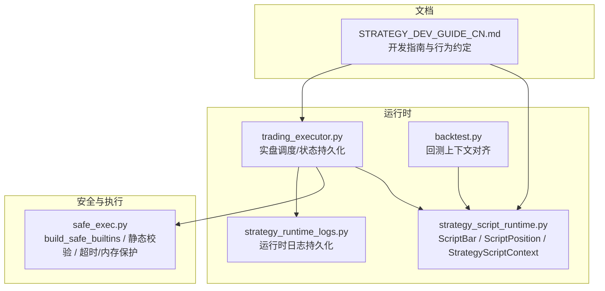
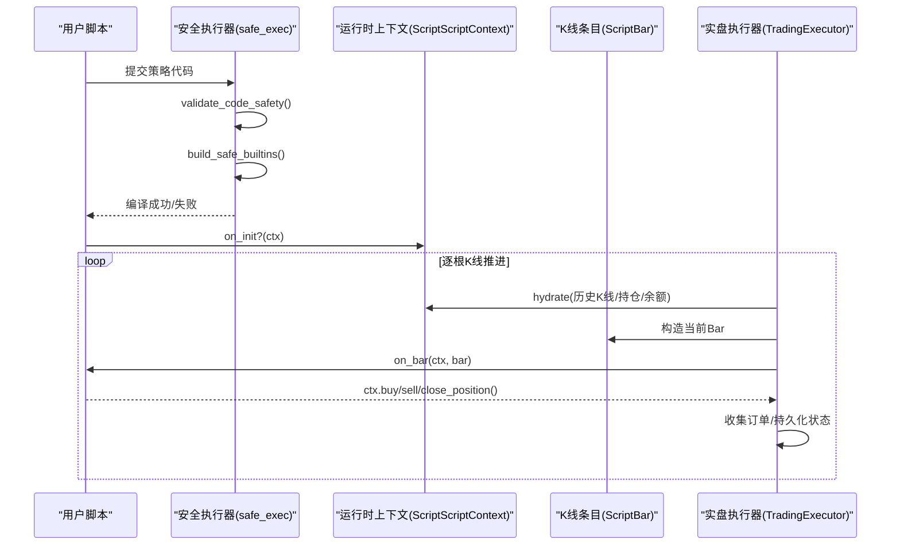
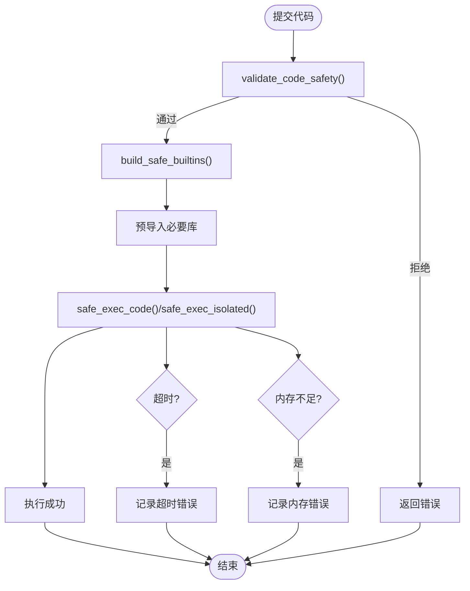
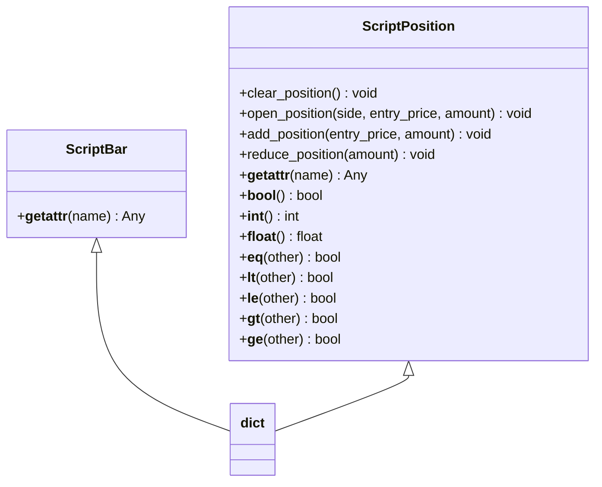
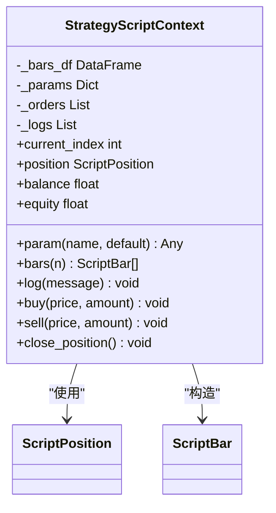
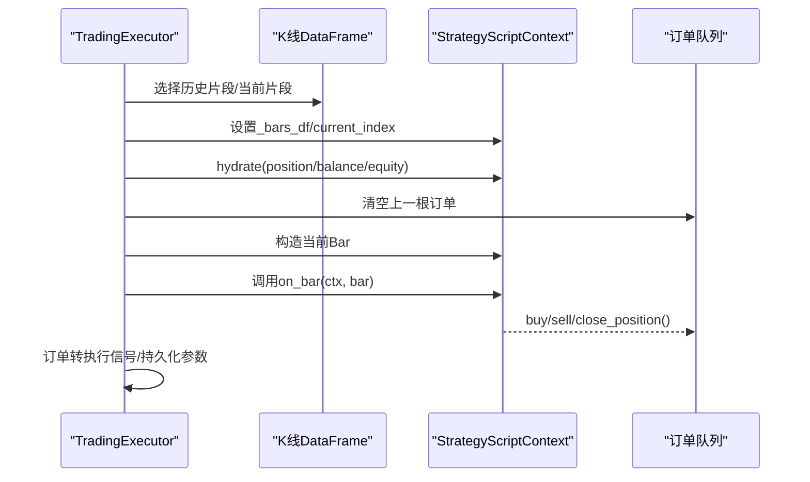
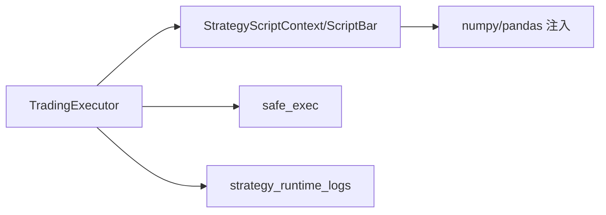

# 运行时环境

<cite>
**本文引用的文件**
- [strategy_script_runtime.py](file://backend_api_python/app/services/strategy_script_runtime.py)
- [safe_exec.py](file://backend_api_python/app/utils/safe_exec.py)
- [trading_executor.py](file://backend_api_python/app/services/trading_executor.py)
- [backtest.py](file://backend_api_python/app/services/backtest.py)
- [strategy_runtime_logs.py](file://backend_api_python/app/utils/strategy_runtime_logs.py)
- [STRATEGY_DEV_GUIDE_CN.md](file://docs/STRATEGY_DEV_GUIDE_CN.md)
</cite>

## 目录
1. [简介](#简介)
2. [项目结构](#项目结构)
3. [核心组件](#核心组件)
4. [架构总览](#架构总览)
5. [详细组件分析](#详细组件分析)
6. [依赖关系分析](#依赖关系分析)
7. [性能考量](#性能考量)
8. [故障排除指南](#故障排除指南)
9. [结论](#结论)
10. [附录](#附录)

## 简介
本文件面向ScriptStrategy运行时环境，系统性阐述其安全隔离机制、数据结构设计、上下文对象功能、内存与执行效率优化、配置项、性能监控与故障排除。重点覆盖以下方面：
- 安全隔离：build_safe_builtins如何限制内置函数与模块，以及静态安全校验与超时/内存保护。
- 数据结构：ScriptBar与ScriptPosition如何通过字典包装提供属性访问语法与数值比较。
- 上下文对象：StrategyScriptContext的参数管理、订单队列、日志记录与实时数据访问。
- 内存与效率：数据帧处理、索引管理与资源清理策略。
- 运行时配置、性能监控与故障排除。

## 项目结构
围绕ScriptStrategy运行时，相关代码分布在以下模块：
- 安全执行与沙箱：safe_exec.py
- 运行时数据结构与上下文：strategy_script_runtime.py
- 实盘执行调度与状态持久化：trading_executor.py
- 回测上下文对齐：backtest.py
- 运行时日志持久化：strategy_runtime_logs.py
- 开发者指南与行为约定：STRATEGY_DEV_GUIDE_CN.md

**图示来源**
- [strategy_script_runtime.py:1-191](file://backend_api_python/app/services/strategy_script_runtime.py#L1-L191)
- [safe_exec.py:1-471](file://backend_api_python/app/utils/safe_exec.py#L1-L471)
- [trading_executor.py:1-3955](file://backend_api_python/app/services/trading_executor.py#L1-L3955)
- [backtest.py:2132-2226](file://backend_api_python/app/services/backtest.py#L2132-L2226)
- [strategy_runtime_logs.py:1-30](file://backend_api_python/app/utils/strategy_runtime_logs.py#L1-L30)
- [STRATEGY_DEV_GUIDE_CN.md:1-200](file://docs/STRATEGY_DEV_GUIDE_CN.md#L1-L200)

**章节来源**
- [strategy_script_runtime.py:1-191](file://backend_api_python/app/services/strategy_script_runtime.py#L1-L191)
- [safe_exec.py:1-471](file://backend_api_python/app/utils/safe_exec.py#L1-L471)
- [trading_executor.py:1-3955](file://backend_api_python/app/services/trading_executor.py#L1-L3955)
- [backtest.py:2132-2226](file://backend_api_python/app/services/backtest.py#L2132-L2226)
- [strategy_runtime_logs.py:1-30](file://backend_api_python/app/utils/strategy_runtime_logs.py#L1-L30)
- [STRATEGY_DEV_GUIDE_CN.md:1-200](file://docs/STRATEGY_DEV_GUIDE_CN.md#L1-L200)

## 核心组件
- 安全沙箱与执行
  - build_safe_builtins：构建受限的内置命名空间，仅包含纯计算类内置与白名单模块导入器。
  - validate_code_safety：正则+AST双重校验，拒绝危险模式与非法导入。
  - timeout_context：跨平台超时（Unix主进程SIGALRM，其他线程定时器+异步异常注入）。
  - safe_exec_code/safe_exec_with_validation：在当前进程内安全执行，支持超时与内存限制。
  - safe_exec_isolated：子进程隔离执行，通过管道序列化结果，避免主进程被污染。
- 数据结构
  - ScriptBar：K线条目字典包装，支持属性访问与键访问。
  - ScriptPosition：持仓字典包装，支持属性访问、布尔/数值比较、开仓/加仓/减仓/平仓。
- 上下文对象
  - StrategyScriptContext：参数管理、历史K线窗口访问、订单队列、日志记录、买卖指令入口。
- 实盘执行
  - TradingExecutor：按根推进策略，填充上下文，调用on_bar，收集订单并持久化运行时状态。
- 回测对齐
  - ScriptBacktestContext：与运行时上下文行为一致，保证脚本在回测与实盘的一致性。

**章节来源**
- [safe_exec.py:74-92](file://backend_api_python/app/utils/safe_exec.py#L74-L92)
- [safe_exec.py:358-471](file://backend_api_python/app/utils/safe_exec.py#L358-L471)
- [safe_exec.py:97-153](file://backend_api_python/app/utils/safe_exec.py#L97-L153)
- [safe_exec.py:157-205](file://backend_api_python/app/utils/safe_exec.py#L157-L205)
- [safe_exec.py:248-354](file://backend_api_python/app/utils/safe_exec.py#L248-L354)
- [strategy_script_runtime.py:17-113](file://backend_api_python/app/services/strategy_script_runtime.py#L17-L113)
- [strategy_script_runtime.py:114-158](file://backend_api_python/app/services/strategy_script_runtime.py#L114-L158)
- [trading_executor.py:754-786](file://backend_api_python/app/services/trading_executor.py#L754-L786)
- [backtest.py:2142-2226](file://backend_api_python/app/services/backtest.py#L2142-L2226)

## 架构总览
ScriptStrategy运行时由“安全沙箱 + 数据结构 + 上下文 + 执行器”构成，整体流程如下：

**图示来源**
- [safe_exec.py:207-244](file://backend_api_python/app/utils/safe_exec.py#L207-L244)
- [strategy_script_runtime.py:159-191](file://backend_api_python/app/services/strategy_script_runtime.py#L159-L191)
- [trading_executor.py:754-786](file://backend_api_python/app/services/trading_executor.py#L754-L786)

## 详细组件分析

### 安全隔离机制
- 白名单内置与导入
  - build_safe_builtins：仅注入纯计算类内置与白名单模块导入器，移除eval/exec/open/getattr/type等危险能力。
  - SAFE_IMPORT_MODULES：限定允许导入的模块集合，如numpy/pandas/math/json/datetime/time等。
- 静态安全校验
  - validate_code_safety：正则匹配危险模式，AST遍历禁止危险模块/函数/属性访问，Fail-Closed策略。
- 超时与内存保护
  - timeout_context：Unix主进程使用SIGALRM，非主进程使用Timer+异步异常注入。
  - safe_exec_code：可选RLIMIT_AS设置最大地址空间，捕获MemoryError与TimeoutError。
- 子进程隔离
  - safe_exec_isolated：子进程独立地址空间，仅pickle可序列化结果返回，异常/超时/崩溃均不影响主进程。

**图示来源**
- [safe_exec.py:358-471](file://backend_api_python/app/utils/safe_exec.py#L358-L471)
- [safe_exec.py:74-92](file://backend_api_python/app/utils/safe_exec.py#L74-L92)
- [safe_exec.py:97-153](file://backend_api_python/app/utils/safe_exec.py#L97-L153)
- [safe_exec.py:157-205](file://backend_api_python/app/utils/safe_exec.py#L157-L205)
- [safe_exec.py:248-354](file://backend_api_python/app/utils/safe_exec.py#L248-L354)

**章节来源**
- [safe_exec.py:24-61](file://backend_api_python/app/utils/safe_exec.py#L24-L61)
- [safe_exec.py:64-72](file://backend_api_python/app/utils/safe_exec.py#L64-L72)
- [safe_exec.py:74-92](file://backend_api_python/app/utils/safe_exec.py#L74-L92)
- [safe_exec.py:358-471](file://backend_api_python/app/utils/safe_exec.py#L358-L471)
- [safe_exec.py:97-153](file://backend_api_python/app/utils/safe_exec.py#L97-L153)
- [safe_exec.py:157-205](file://backend_api_python/app/utils/safe_exec.py#L157-L205)
- [safe_exec.py:248-354](file://backend_api_python/app/utils/safe_exec.py#L248-L354)

### ScriptBar与ScriptPosition数据结构
- ScriptBar
  - 继承自dict，通过__getattr__将键访问转换为属性访问，缺失键抛出AttributeError，提升脚本可读性。
- ScriptPosition
  - 继承自dict，提供clear_position/open_position/add_position/reduce_position等方法。
  - 支持布尔判断（是否持有）、数值比较（方向/大小），便于脚本进行条件判断与风控。

**图示来源**
- [strategy_script_runtime.py:17-113](file://backend_api_python/app/services/strategy_script_runtime.py#L17-L113)

**章节来源**
- [strategy_script_runtime.py:17-113](file://backend_api_python/app/services/strategy_script_runtime.py#L17-L113)

### StrategyScriptContext上下文对象
- 职责
  - 参数管理：param(name, default)集中管理脚本默认参数。
  - 历史数据：bars(n)返回最近n根K线（ScriptBar列表）。
  - 订单队列：buy/sell/close_position将指令暂存至内部订单列表，供执行器消费。
  - 日志记录：log(message)追加日志，配合strategy_runtime_logs持久化。
  - 实时数据：current_index/current_price等由执行器推进。
- 与回测对齐
  - ScriptBacktestContext与StrategyScriptContext字段与行为保持一致，确保脚本在回测与实盘一致性。

**图示来源**
- [strategy_script_runtime.py:114-158](file://backend_api_python/app/services/strategy_script_runtime.py#L114-L158)
- [backtest.py:2142-2163](file://backend_api_python/app/services/backtest.py#L2142-L2163)

**章节来源**
- [strategy_script_runtime.py:114-158](file://backend_api_python/app/services/strategy_script_runtime.py#L114-L158)
- [backtest.py:2142-2163](file://backend_api_python/app/services/backtest.py#L2142-L2163)

### 实盘执行流程（TradingExecutor）
- 初始化与上下文填充
  - 从历史K线DataFrame中提取当前索引与Bar，初始化ctx.bars_df与current_index。
  - 从持仓与权益快照恢复ctx.position/ctx.balance/ctx.equity。
- 逐根推进
  - 清空上一根的订单队列，构造当前Bar，调用on_bar(ctx, bar)。
  - 将ctx中的买卖指令转换为执行信号，持久化运行时参数。
- 资源与性能
  - 价格缓存、信号去重、线程数上限、数据库字段保障、资源状态打印等。

**图示来源**
- [trading_executor.py:754-786](file://backend_api_python/app/services/trading_executor.py#L754-L786)

**章节来源**
- [trading_executor.py:754-786](file://backend_api_python/app/services/trading_executor.py#L754-L786)

### 回测上下文对齐
- ScriptBacktestContext与StrategyScriptContext字段与行为一致，确保脚本在两种模式下行为一致。
- 回测中同样通过bars(n)/param()/buy()/sell()/close_position()表达策略逻辑。

**章节来源**
- [backtest.py:2142-2226](file://backend_api_python/app/services/backtest.py#L2142-L2226)

## 依赖关系分析
- 组件耦合
  - TradingExecutor依赖strategy_script_runtime（ScriptBar/StrategyScriptContext/编译器）与safe_exec（安全执行）。
  - StrategyScriptContext依赖pandas/numpy（通过exec_env注入）。
  - 日志通过strategy_runtime_logs持久化到数据库。
- 外部依赖
  - numpy/pandas作为默认注入库，提升脚本计算效率。
  - multiprocessing用于子进程隔离执行。

**图示来源**
- [strategy_script_runtime.py:169-173](file://backend_api_python/app/services/strategy_script_runtime.py#L169-L173)
- [safe_exec.py:282-289](file://backend_api_python/app/utils/safe_exec.py#L282-L289)
- [trading_executor.py:28-32](file://backend_api_python/app/services/trading_executor.py#L28-L32)

**章节来源**
- [strategy_script_runtime.py:169-173](file://backend_api_python/app/services/strategy_script_runtime.py#L169-L173)
- [safe_exec.py:282-289](file://backend_api_python/app/utils/safe_exec.py#L282-L289)
- [trading_executor.py:28-32](file://backend_api_python/app/services/trading_executor.py#L28-L32)

## 性能考量
- 内存管理
  - safe_exec_code支持RLIMIT_AS设置最大地址空间（Linux），避免内存泄漏导致系统不稳定。
  - safe_exec_isolated通过子进程隔离，防止内存溢出影响主进程。
- 执行效率
  - 默认注入numpy/pandas，减少脚本层导入开销。
  - TradingExecutor对价格缓存、信号去重、线程数上限进行控制，降低抖动与资源竞争。
- 数据帧与索引
  - 通过DataFrame切片与iloc访问历史K线，避免重复构造对象。
  - current_index推进时注意边界与NaN清理，确保稳定性。

**章节来源**
- [safe_exec.py:181-188](file://backend_api_python/app/utils/safe_exec.py#L181-L188)
- [safe_exec.py:274-280](file://backend_api_python/app/utils/safe_exec.py#L274-L280)
- [strategy_script_runtime.py:132-144](file://backend_api_python/app/services/strategy_script_runtime.py#L132-L144)
- [trading_executor.py:44-66](file://backend_api_python/app/services/trading_executor.py#L44-L66)

## 故障排除指南
- 代码安全被拒
  - 现象：返回“Unsafe code rejected”。
  - 排查：检查是否使用危险模式（如eval/exec/open/__import__/__builtins__等），或导入了非白名单模块。
  - 参考：validate_code_safety的危险模式与AST检查规则。
- 超时
  - 现象：返回“代码执行超时”。
  - 排查：缩短计算复杂度、减少循环次数、避免阻塞操作；必要时调整timeout。
- 内存不足
  - 现象：返回“内存不足”。
  - 排查：减少中间变量、及时释放大对象、启用RLIMIT_AS或使用子进程隔离。
- 运行时错误
  - 现象：返回“代码执行错误”。
  - 排查：查看日志与堆栈信息，定位异常位置；确保脚本只使用白名单内置与模块。
- 实盘执行异常
  - 现象：on_bar报错或订单未生效。
  - 排查：确认ctx.bars(n)与ctx.position状态是否符合预期；检查订单队列是否被正确清空与持久化。

**章节来源**
- [safe_exec.py:224-227](file://backend_api_python/app/utils/safe_exec.py#L224-L227)
- [safe_exec.py:198-204](file://backend_api_python/app/utils/safe_exec.py#L198-L204)
- [trading_executor.py:778-783](file://backend_api_python/app/services/trading_executor.py#L778-L783)
- [strategy_runtime_logs.py:11-29](file://backend_api_python/app/utils/strategy_runtime_logs.py#L11-L29)

## 结论
ScriptStrategy运行时环境通过严格的沙箱与安全校验、稳健的数据结构与上下文对象、以及实盘执行器的状态推进与持久化，实现了可回测、可执行、可监控的策略运行闭环。开发者可在白名单范围内高效编写策略逻辑，同时借助超时/内存保护与子进程隔离确保系统稳定。

## 附录
- 配置选项
  - SAFE_EXEC_ENABLE_RLIMIT：启用RLIMIT_AS内存限制（Linux）。
  - PRICE_CACHE_TTL_SEC：价格缓存过期时间（秒）。
  - STRATEGY_MAX_THREADS：策略线程上限。
  - STRATEGY_SCRIPT_RUNTIME_TIMEOUT：脚本编译/执行超时（秒）。
- 性能监控
  - 线程/内存状态打印：_log_resource_status。
  - 运行时日志持久化：append_strategy_log。
- 行为约定
  - ctx.position支持数值判断与字段访问，脚本应优先使用ctx.buy/sell/close_position表达意图。

**章节来源**
- [safe_exec.py:181-188](file://backend_api_python/app/utils/safe_exec.py#L181-L188)
- [trading_executor.py:49](file://backend_api_python/app/services/trading_executor.py#L49)
- [trading_executor.py:60](file://backend_api_python/app/services/trading_executor.py#L60)
- [strategy_runtime_logs.py:11-29](file://backend_api_python/app/utils/strategy_runtime_logs.py#L11-L29)
- [STRATEGY_DEV_GUIDE_CN.md:618-636](file://docs/STRATEGY_DEV_GUIDE_CN.md#L618-L636)