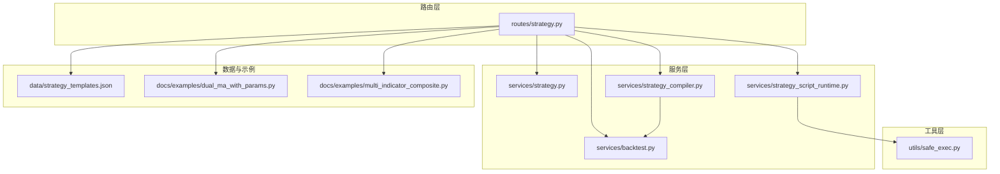
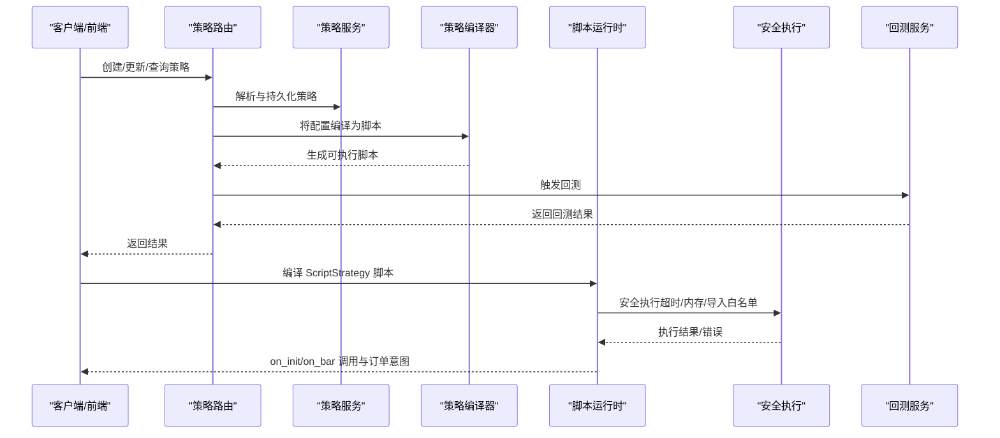
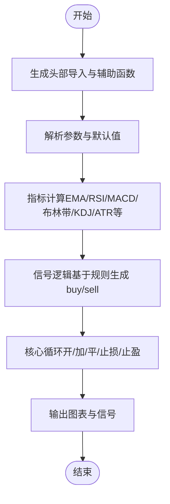
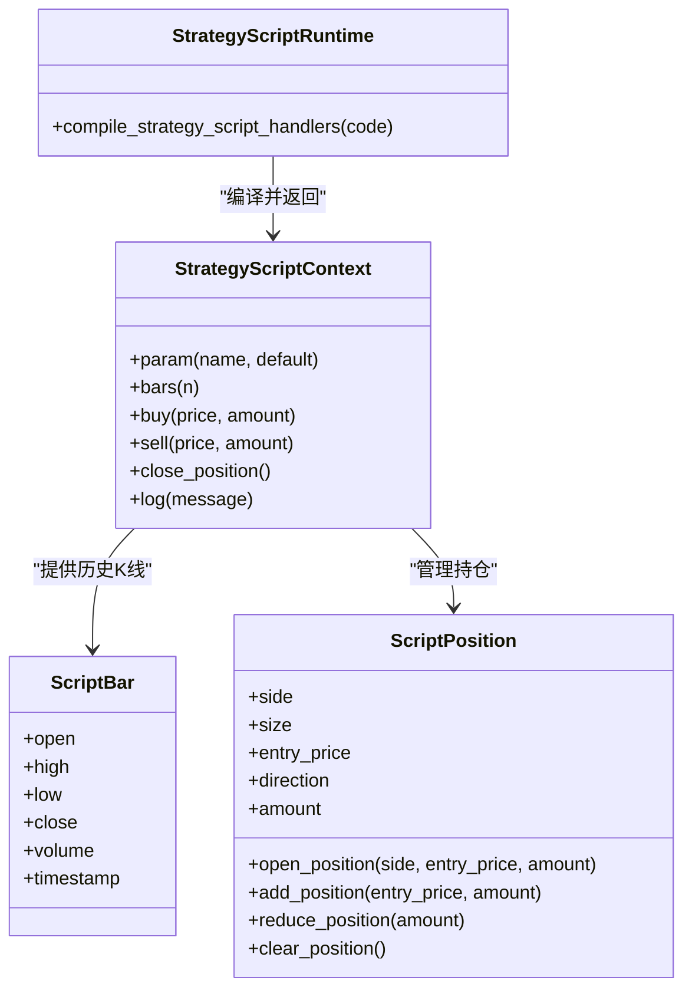
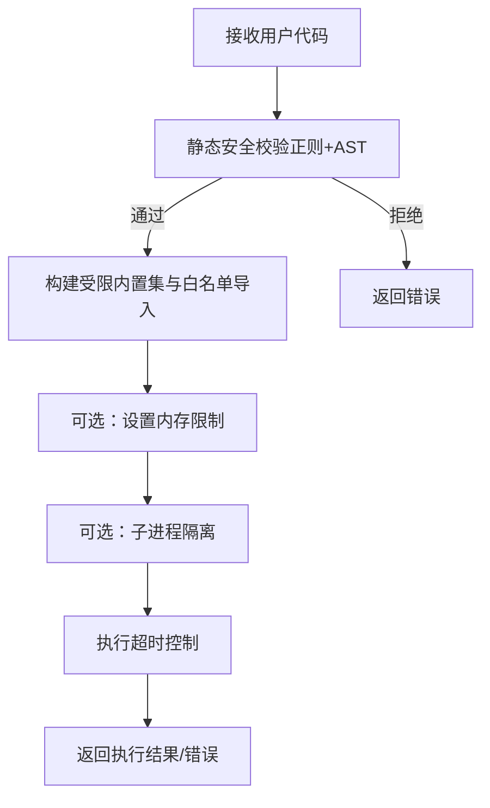
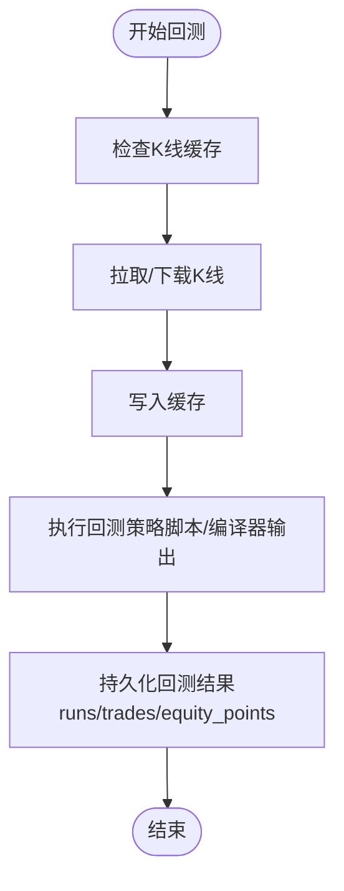
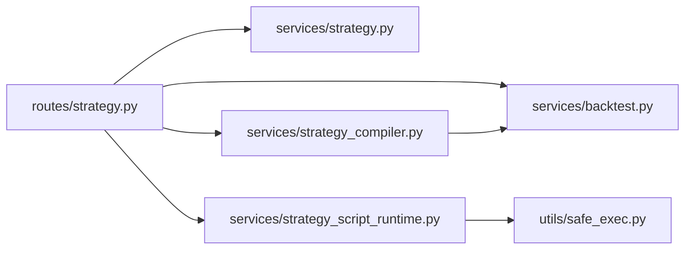

# 策略类型与开发模式

<cite>
**本文引用的文件**
- [strategy.py](file://backend_api_python/app/routes/strategy.py)
- [strategy.py](file://backend_api_python/app/services/strategy.py)
- [strategy_compiler.py](file://backend_api_python/app/services/strategy_compiler.py)
- [strategy_script_runtime.py](file://backend_api_python/app/services/strategy_script_runtime.py)
- [safe_exec.py](file://backend_api_python/app/utils/safe_exec.py)
- [backtest.py](file://backend_api_python/app/services/backtest.py)
- [strategy_templates.json](file://backend_api_python/app/data/strategy_templates.json)
- [STRATEGY_DEV_GUIDE_CN.md](file://docs/STRATEGY_DEV_GUIDE_CN.md)
- [dual_ma_with_params.py](file://docs/examples/dual_ma_with_params.py)
- [multi_indicator_composite.py](file://docs/examples/multi_indicator_composite.py)
</cite>

## 目录
1. [引言](#引言)
2. [项目结构](#项目结构)
3. [核心组件](#核心组件)
4. [架构总览](#架构总览)
5. [详细组件分析](#详细组件分析)
6. [依赖分析](#依赖分析)
7. [性能考虑](#性能考虑)
8. [故障排查指南](#故障排查指南)
9. [结论](#结论)
10. [附录](#附录)

## 引言
本文件聚焦于策略类型与开发模式，系统阐述两种主要策略开发范式：
- IndicatorStrategy：基于 pandas DataFrame 的指标/信号脚本，适用于图表渲染、信号型回测与策略原型验证。
- ScriptStrategy：基于事件驱动的 on_init/on_bar 脚本策略，适用于运行时状态管理、动态止盈止损与复杂执行逻辑。

文档将从架构、组件、数据流、处理逻辑、集成点、错误处理与性能特性等方面进行深入分析，并提供最佳实践、性能优化建议与常见陷阱规避方法。

## 项目结构
围绕策略开发与执行的关键模块分布如下：
- 路由层：提供策略模板、回测、运行与管理接口
- 服务层：策略服务、策略编译器、脚本运行时、回测服务
- 工具层：安全执行与沙箱机制
- 数据与示例：策略模板、示例策略脚本

**图表来源**
- [strategy.py:1-200](file://backend_api_python/app/routes/strategy.py#L1-L200)
- [strategy.py:1-120](file://backend_api_python/app/services/strategy.py#L1-L120)
- [strategy_compiler.py:1-120](file://backend_api_python/app/services/strategy_compiler.py#L1-L120)
- [strategy_script_runtime.py:1-120](file://backend_api_python/app/services/strategy_script_runtime.py#L1-L120)
- [safe_exec.py:1-120](file://backend_api_python/app/utils/safe_exec.py#L1-L120)
- [backtest.py:1-120](file://backend_api_python/app/services/backtest.py#L1-L120)
- [strategy_templates.json:1-60](file://backend_api_python/app/data/strategy_templates.json#L1-L60)
- [dual_ma_with_params.py:1-64](file://docs/examples/dual_ma_with_params.py#L1-L64)
- [multi_indicator_composite.py:1-109](file://docs/examples/multi_indicator_composite.py#L1-L109)

**章节来源**
- [strategy.py:1-200](file://backend_api_python/app/routes/strategy.py#L1-L200)
- [strategy.py:1-120](file://backend_api_python/app/services/strategy.py#L1-L120)

## 核心组件
- 策略服务（StrategyService）
  - 提供策略查询、运行中策略检索、交易所符号与连接测试、策略类型查询、状态更新等能力。
- 策略编译器（StrategyCompiler）
  - 将配置 JSON 编译为可执行的 pandas/numpy 脚本，生成指标、信号与输出图表/信号。
- 脚本运行时（StrategyScriptRuntime）
  - 提供 ScriptStrategy 的运行时上下文（ctx）、bar 封装、位置对象与订单意图收集，支持 on_init/on_bar 编译与安全执行。
- 安全执行（SafeExec）
  - 构建受限内置集、白名单模块导入、超时与内存限制、跨平台超时注入、子进程隔离等，保障用户代码安全。
- 回测服务（BacktestService）
  - 提供多时间框架回测、缓存、存储结构、执行时间窗推断与回测结果持久化。

**章节来源**
- [strategy.py:14-120](file://backend_api_python/app/services/strategy.py#L14-L120)
- [strategy_compiler.py:4-689](file://backend_api_python/app/services/strategy_compiler.py#L4-L689)
- [strategy_script_runtime.py:16-191](file://backend_api_python/app/services/strategy_script_runtime.py#L16-L191)
- [safe_exec.py:74-244](file://backend_api_python/app/utils/safe_exec.py#L74-L244)
- [backtest.py:64-120](file://backend_api_python/app/services/backtest.py#L64-L120)

## 架构总览
策略从“配置/脚本”到“回测/执行”的整体流程如下：

**图表来源**
- [strategy.py:491-588](file://backend_api_python/app/routes/strategy.py#L491-L588)
- [strategy.py:14-120](file://backend_api_python/app/services/strategy.py#L14-L120)
- [strategy_compiler.py:5-35](file://backend_api_python/app/services/strategy_compiler.py#L5-L35)
- [strategy_script_runtime.py:159-191](file://backend_api_python/app/services/strategy_script_runtime.py#L159-L191)
- [safe_exec.py:207-244](file://backend_api_python/app/utils/safe_exec.py#L207-L244)
- [backtest.py:170-200](file://backend_api_python/app/services/backtest.py#L170-L200)

## 详细组件分析

### 组件A：策略编译器（StrategyCompiler）
- 输入：策略配置（名称、入场规则、仓位配置、加仓规则、风控）
- 输出：可执行的 Python 脚本（pandas/numpy），包含指标计算、信号逻辑、核心循环与输出
- 关键流程：
  - 头部导入与辅助函数
  - 参数解析与默认值注入
  - 指标计算（支持多种技术指标）
  - 信号逻辑（基于规则生成 buy/sell）
  - 核心循环（处理开仓/加仓/平仓/止损/止盈）
  - 输出（图表与信号）

**图表来源**
- [strategy_compiler.py:37-689](file://backend_api_python/app/services/strategy_compiler.py#L37-L689)

**章节来源**
- [strategy_compiler.py:4-689](file://backend_api_python/app/services/strategy_compiler.py#L4-L689)

### 组件B：脚本运行时（StrategyScriptRuntime）
- 提供运行时上下文（ctx）与 bar 封装，支持：
  - 参数读取（ctx.param）
  - 历史K线访问（ctx.bars）
  - 位置对象（ScriptPosition）与余额/权益
  - 订单意图（ctx.buy/sell/close_position）
- 编译流程：
  - 校验脚本（on_init/on_bar）
  - 构建受限执行环境（安全内置/白名单模块）
  - 安全执行（超时/内存/导入限制）

**图表来源**
- [strategy_script_runtime.py:17-191](file://backend_api_python/app/services/strategy_script_runtime.py#L17-L191)

**章节来源**
- [strategy_script_runtime.py:16-191](file://backend_api_python/app/services/strategy_script_runtime.py#L16-L191)

### 组件C：安全执行（SafeExec）
- 安全内置集构建（仅允许纯计算内置）
- 白名单模块导入（numpy/pandas/math/json/time/collections 等）
- 超时控制（Unix 主线程使用 SIGALRM，非主线程使用线程计时器+异步异常注入）
- 内存限制（可选资源限制）
- 子进程隔离（可选，通过 multiprocessing 执行并限制内存）
- 静态安全校验（正则+AST 双重检查，拒绝危险模式与模块导入）

**图表来源**
- [safe_exec.py:358-471](file://backend_api_python/app/utils/safe_exec.py#L358-L471)
- [safe_exec.py:157-205](file://backend_api_python/app/utils/safe_exec.py#L157-L205)
- [safe_exec.py:248-354](file://backend_api_python/app/utils/safe_exec.py#L248-L354)

**章节来源**
- [safe_exec.py:74-244](file://backend_api_python/app/utils/safe_exec.py#L74-L244)
- [safe_exec.py:358-471](file://backend_api_python/app/utils/safe_exec.py#L358-L471)

### 组件D：回测服务（BacktestService）
- 多时间框架回测与缓存（K线缓存、TTL）
- 存储结构（回测运行记录、交易明细、净值点）
- 执行时间窗推断（根据日期范围与市场类型自动选择 1m/5m）
- 引擎版本与扩展字段（run_type、strategy_id、engine_version 等）

**图表来源**
- [backtest.py:25-120](file://backend_api_python/app/services/backtest.py#L25-L120)
- [backtest.py:170-200](file://backend_api_python/app/services/backtest.py#L170-L200)

**章节来源**
- [backtest.py:64-120](file://backend_api_python/app/services/backtest.py#L64-L120)
- [backtest.py:170-200](file://backend_api_python/app/services/backtest.py#L170-L200)

### 组件E：策略模板与示例
- 策略模板：提供多类策略模板（均线交叉、RSI、布林带、MACD、网格、动量轮动等），便于一键导入与参数化。
- 示例脚本：展示参数声明、默认策略配置、指标计算、信号生成与图表输出的标准结构。

**章节来源**
- [strategy_templates.json:1-191](file://backend_api_python/app/data/strategy_templates.json#L1-L191)
- [dual_ma_with_params.py:1-64](file://docs/examples/dual_ma_with_params.py#L1-L64)
- [multi_indicator_composite.py:1-109](file://docs/examples/multi_indicator_composite.py#L1-L109)

## 依赖分析
- 路由层依赖服务层与工具层，负责策略生命周期管理与回测调度。
- 服务层内部协作：策略服务提供策略元数据与运行状态；编译器与脚本运行时分别服务于 IndicatorStrategy 与 ScriptStrategy；回测服务提供统一回测入口。
- 安全执行贯穿脚本运行时与编译器输出的执行阶段，确保用户代码在受限环境中运行。

**图表来源**
- [strategy.py:1-120](file://backend_api_python/app/routes/strategy.py#L1-L120)
- [strategy.py:1-120](file://backend_api_python/app/services/strategy.py#L1-L120)
- [strategy_compiler.py:1-60](file://backend_api_python/app/services/strategy_compiler.py#L1-L60)
- [strategy_script_runtime.py:1-60](file://backend_api_python/app/services/strategy_script_runtime.py#L1-L60)
- [safe_exec.py:1-60](file://backend_api_python/app/utils/safe_exec.py#L1-L60)
- [backtest.py:1-60](file://backend_api_python/app/services/backtest.py#L1-L60)

**章节来源**
- [strategy.py:1-120](file://backend_api_python/app/routes/strategy.py#L1-L120)
- [strategy.py:1-120](file://backend_api_python/app/services/strategy.py#L1-L120)

## 性能考虑
- 回测缓存与时间窗选择：根据回测日期范围与市场类型自动选择 1m/5m 执行时间窗，减少数据规模与计算压力。
- 指标计算优化：优先使用 pandas/numpy 向量化操作，避免显式循环；合理设置滚动窗口与指数平滑参数。
- 脚本执行安全：通过超时与内存限制防止长时间运行或内存泄漏；必要时启用子进程隔离。
- 批量操作：批量创建/启动/停止策略时，先更新数据库状态再触发执行器，降低并发冲突。

[本节为通用指导，无需特定文件来源]

## 故障排查指南
- 脚本编译与校验
  - 缺少必需函数（on_init/on_bar）或语法错误会导致编译失败。
  - 代码质量检查会提示缺失 on_init、缺失 on_bar、未使用 ctx.param、未发出订单意图等问题。
- 安全执行错误
  - 导入未授权模块、使用 eval/exec/open 等危险函数、访问 __builtins__/__import__ 等将被拒绝。
  - 超时或内存不足会触发相应错误信息。
- 回测范围限制
  - 不同时间框架支持的最大回测天数不同，超出限制会返回错误。
- 交易所连接测试
  - 连接测试会尝试公共 ping 与私有接口验证，若失败会返回具体原因与提示（如币安权限/IP 白名单）。

**章节来源**
- [strategy.py:67-122](file://backend_api_python/app/routes/strategy.py#L67-L122)
- [safe_exec.py:358-471](file://backend_api_python/app/utils/safe_exec.py#L358-L471)
- [backtest.py:355-375](file://backend_api_python/app/services/backtest.py#L355-L375)
- [strategy.py:292-609](file://backend_api_python/app/services/strategy.py#L292-L609)

## 结论
- IndicatorStrategy 适合信号型策略与原型验证，强调“指标层—信号层—风险默认配置层”的分层设计。
- ScriptStrategy 适合需要运行时状态、动态风控与复杂执行逻辑的策略，强调 on_init/on_bar 的事件驱动模型。
- 策略编译器与脚本运行时分别支撑两类策略的生成与执行；安全执行与回测服务提供可靠的安全边界与验证手段。
- 建议优先使用模板与示例脚本作为起点，逐步迭代参数与风控配置，并通过回测与实盘前的“保存后回测”核对仓位暴露与成交语义。

[本节为总结性内容，无需特定文件来源]

## 附录

### 附录A：两种策略开发模式对比与适用场景
- IndicatorStrategy
  - 适用：指标研究、信号型回测、参数调优、图表叠加
  - 特点：基于 df 的纯信号脚本，输出 buy/sell 与图表
- ScriptStrategy
  - 适用：运行时状态管理、动态止盈止损、分批加减仓、bot 风格执行
  - 特点：事件驱动，通过 ctx 读取状态并发出订单意图

**章节来源**
- [STRATEGY_DEV_GUIDE_CN.md:75-91](file://docs/STRATEGY_DEV_GUIDE_CN.md#L75-L91)

### 附录B：策略编译器工作原理（概览）
- 输入配置 → 生成脚本 → 指标计算 → 信号逻辑 → 核心循环 → 输出图表与信号
- 支持指标：Supertrend、EMA、RSI、MACD、布林带、KDJ、MA 等
- 风控：固定止损、跟踪止损、加仓阈值与次数

**章节来源**
- [strategy_compiler.py:86-689](file://backend_api_python/app/services/strategy_compiler.py#L86-L689)

### 附录C：脚本运行时与安全执行机制
- 运行时上下文：ctx.param、ctx.bars、ctx.position、ctx.buy/sell/close_position、ctx.log
- 安全机制：受限内置集、白名单模块、超时/内存限制、可选子进程隔离、AST/正则双重校验

**章节来源**
- [strategy_script_runtime.py:114-191](file://backend_api_python/app/services/strategy_script_runtime.py#L114-L191)
- [safe_exec.py:74-244](file://backend_api_python/app/utils/safe_exec.py#L74-L244)

### 附录D：回测服务与执行时间窗
- 自动选择执行时间窗（1m/5m），并限制最大回测天数
- 存储结构：qd_backtest_runs、qd_backtest_trades、qd_backtest_equity_points

**章节来源**
- [backtest.py:64-120](file://backend_api_python/app/services/backtest.py#L64-L120)
- [backtest.py:170-200](file://backend_api_python/app/services/backtest.py#L170-L200)

### 附录E：策略模板与示例参考
- 策略模板：均线交叉、RSI、布林带、MACD、网格、动量轮动等
- 示例脚本：双均线策略、多指标组合策略

**章节来源**
- [strategy_templates.json:1-191](file://backend_api_python/app/data/strategy_templates.json#L1-L191)
- [dual_ma_with_params.py:1-64](file://docs/examples/dual_ma_with_params.py#L1-L64)
- [multi_indicator_composite.py:1-109](file://docs/examples/multi_indicator_composite.py#L1-L109)