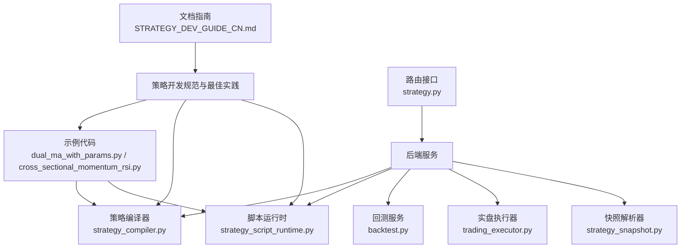
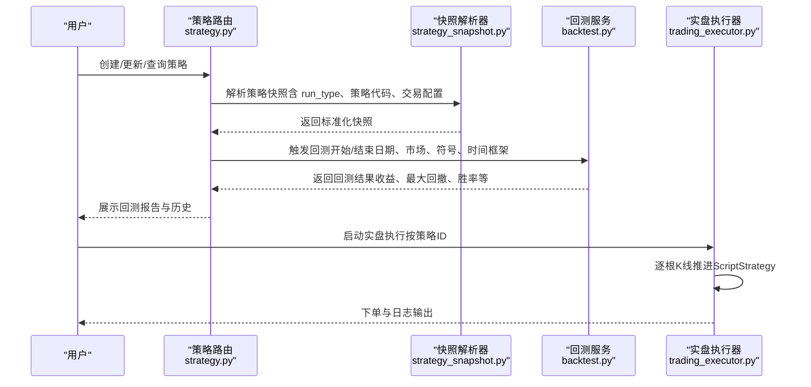
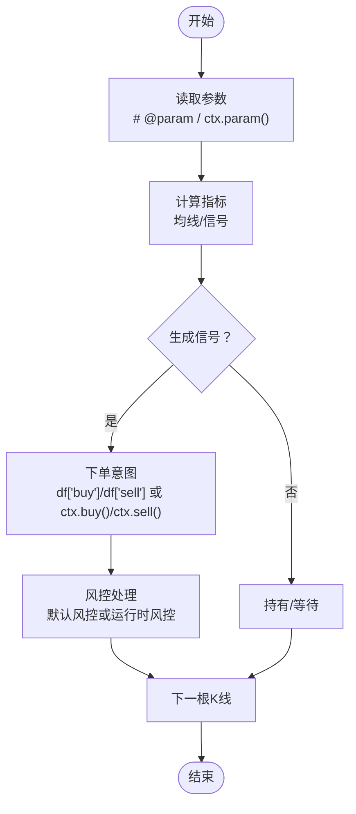
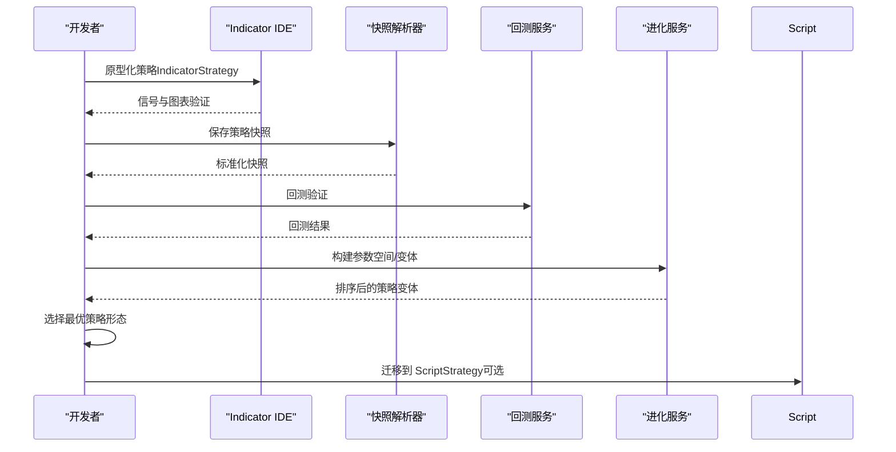
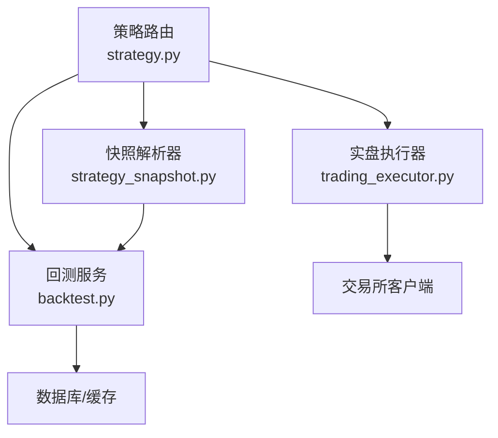

# 策略类型对比与选择

<cite>
**本文引用的文件**
- [STRATEGY_DEV_GUIDE_CN.md](file://docs/STRATEGY_DEV_GUIDE_CN.md)
- [strategy.py](file://backend_api_python/app/routes/strategy.py)
- [strategy_script_runtime.py](file://backend_api_python/app/services/strategy_script_runtime.py)
- [backtest.py](file://backend_api_python/app/services/backtest.py)
- [strategy_compiler.py](file://backend_api_python/app/services/strategy_compiler.py)
- [trading_executor.py](file://backend_api_python/app/services/trading_executor.py)
- [strategy_snapshot.py](file://backend_api_python/app/services/strategy_snapshot.py)
- [dual_ma_with_params.py](file://docs/examples/dual_ma_with_params.py)
- [cross_sectional_momentum_rsi.py](file://docs/examples/cross_sectional_momentum_rsi.py)
- [evolution.py](file://backend_api_python/app/services/experiment/evolution.py)
- [runner.py](file://backend_api_python/app/services/experiment/runner.py)
- [scoring.py](file://backend_api_python/app/services/experiment/scoring.py)
</cite>

## 目录
1. [引言](#引言)
2. [项目结构](#项目结构)
3. [核心组件](#核心组件)
4. [架构总览](#架构总览)
5. [详细组件分析](#详细组件分析)
6. [依赖分析](#依赖分析)
7. [性能考虑](#性能考虑)
8. [故障排除指南](#故障排除指南)
9. [结论](#结论)
10. [附录](#附录)

## 引言
本技术文档围绕 QuantDinger 平台的两种策略开发模式——IndicatorStrategy 与 ScriptStrategy——进行全面对比与选择指导。内容涵盖两类策略的特性、优势、适用场景、性能差异、开发复杂度与维护成本，并提供决策树、迁移方法、混合开发与渐进式重构策略，辅以实际案例分析与效果对比，帮助用户在不同需求下做出最优选择。

## 项目结构
QuantDinger 的策略体系由“文档指南 + 后端服务 + 路由接口 + 示例代码”构成：
- 文档指南：提供策略开发规范、最佳实践、参数与配置说明、常见错误与排障。
- 后端服务：包含策略编译器、脚本运行时、回测引擎、实盘执行器、快照解析器等。
- 路由接口：提供策略创建、批量创建、回测、历史查询、状态管理等 API。
- 示例代码：提供双均线与截面动量等策略样例，便于对照学习。

**图表来源**
- [STRATEGY_DEV_GUIDE_CN.md](file://docs/STRATEGY_DEV_GUIDE_CN.md)
- [strategy_compiler.py](file://backend_api_python/app/services/strategy_compiler.py)
- [strategy_script_runtime.py](file://backend_api_python/app/services/strategy_script_runtime.py)
- [backtest.py](file://backend_api_python/app/services/backtest.py)
- [trading_executor.py](file://backend_api_python/app/services/trading_executor.py)
- [strategy_snapshot.py](file://backend_api_python/app/services/strategy_snapshot.py)
- [strategy.py](file://backend_api_python/app/routes/strategy.py)

**章节来源**
- [STRATEGY_DEV_GUIDE_CN.md](file://docs/STRATEGY_DEV_GUIDE_CN.md)
- [strategy.py](file://backend_api_python/app/routes/strategy.py)

## 核心组件
- 策略编译器（StrategyCompiler）：将结构化配置转换为可执行的 IndicatorStrategy 代码，自动生成指标、信号与输出。
- 脚本运行时（StrategyScriptContext）：为 ScriptStrategy 提供安全的执行环境，封装参数、K线、订单与日志。
- 回测服务（BacktestService）：加载行情、执行回测、持久化交易与净值点，支持多时间框架与高精度回测。
- 实盘执行器（TradingExecutor）：根据策略快照与配置，驱动实盘逐根推进，支持跨截面与脚本策略。
- 快照解析器（StrategySnapshotResolver）：将策略持久化为统一快照，注入回测/执行所需字段与默认值。
- 路由接口（Strategy API）：提供策略生命周期管理、回测调度、历史查询与状态控制。

**章节来源**
- [strategy_compiler.py](file://backend_api_python/app/services/strategy_compiler.py)
- [strategy_script_runtime.py](file://backend_api_python/app/services/strategy_script_runtime.py)
- [backtest.py](file://backend_api_python/app/services/backtest.py)
- [trading_executor.py](file://backend_api_python/app/services/trading_executor.py)
- [strategy_snapshot.py](file://backend_api_python/app/services/strategy_snapshot.py)
- [strategy.py](file://backend_api_python/app/routes/strategy.py)

## 架构总览
策略从“文档/示例”到“回测/实盘”的整体链路如下：

**图表来源**
- [strategy.py](file://backend_api_python/app/routes/strategy.py)
- [strategy_snapshot.py](file://backend_api_python/app/services/strategy_snapshot.py)
- [backtest.py](file://backend_api_python/app/services/backtest.py)
- [trading_executor.py](file://backend_api_python/app/services/trading_executor.py)

## 详细组件分析

### IndicatorStrategy 与 ScriptStrategy 的对比与选择
- 设计理念
  - IndicatorStrategy：以“DataFrame 信号”为核心，强调指标层、信号层与默认风控层的清晰分层，适合“条件触发即入场/出场”的策略。
  - ScriptStrategy：以“逐根K线运行时逻辑”为核心，强调上下文（ctx）、持仓（position）、订单意图（buy/sell/close_position），适合需要“实时状态管理”的策略。
- 适用场景
  - IndicatorStrategy：叠加图表、画买卖点、研究 DataFrame 上的进出场信号、仅需固定止损/止盈/默认仓位。
  - ScriptStrategy：需要逐根读取持仓状态、动态止盈止损、分批加减仓、状态机/机器人式执行。
- 关键差异
  - 信号来源：IndicatorStrategy 通过 df['buy']/df['sell']；ScriptStrategy 通过 ctx.buy()/ctx.sell()/ctx.close_position()。
  - 风控默认值：IndicatorStrategy 通过 # @strategy；ScriptStrategy 通过 ctx.param()。
  - 执行路径：IndicatorStrategy 主要走指标侧回测；ScriptStrategy 走脚本回测/实盘逐根推进。
  - 跨截面支持：当前平台对 cross_sectional 的支持在策略快照链路中有限，ScriptStrategy 不支持 cross_sectional 实盘运行。

**章节来源**
- [STRATEGY_DEV_GUIDE_CN.md](file://docs/STRATEGY_DEV_GUIDE_CN.md)
- [strategy.py](file://backend_api_python/app/routes/strategy.py)

### 决策树：如何选择策略开发模式
- 问：我的策略是否可以用“条件 A 出现就买，条件 B 出现就卖”来表达？
  - 是：优先选择 IndicatorStrategy。
  - 否：问第二条。
- 问：我的策略是否需要在开仓后持续关注当前持仓状态并据此做反应？
  - 是：选择 ScriptStrategy。
  - 否：继续使用 IndicatorStrategy。
- 问：是否需要分批加仓/减仓、冷却期、状态机或机器人式执行？
  - 是：选择 ScriptStrategy。
  - 否：继续使用 IndicatorStrategy。
- 问：是否需要跨截面（多标的）策略？
  - 是：当前平台链路尚不支持 cross_sectional 的策略快照回测/实盘，建议先作为研究参考，或等待平台完善后再迁移。
  - 否：按上述结论选择。

**章节来源**
- [STRATEGY_DEV_GUIDE_CN.md](file://docs/STRATEGY_DEV_GUIDE_CN.md)

### 性能差异与复杂度对比
- 性能差异
  - IndicatorStrategy：以向量化为主，适合在指标侧高效计算与回测；对大数据集更友好。
  - ScriptStrategy：逐根推进，实时性强，但对每根K线的逻辑开销更大；适合中小规模回测与实盘。
- 开发复杂度
  - IndicatorStrategy：强调三层分离（指标/信号/风控），逻辑清晰、易于调试与可视化。
  - ScriptStrategy：需要处理上下文、订单意图、状态机与风控联动，复杂度更高。
- 维护成本
  - IndicatorStrategy：参数与风控默认值集中在 # @param 与 # @strategy，便于统一管理与演进。
  - ScriptStrategy：参数集中在 ctx.param()，需注意运行时一致性与日志可观测性。

**章节来源**
- [STRATEGY_DEV_GUIDE_CN.md](file://docs/STRATEGY_DEV_GUIDE_CN.md)
- [strategy_script_runtime.py](file://backend_api_python/app/services/strategy_script_runtime.py)

### 实际案例分析：双均线策略（IndicatorStrategy vs ScriptStrategy）
- IndicatorStrategy 版本（来自示例）
  - 特点：使用 # @param 与 # @strategy 声明参数与默认风控；通过 df['buy']/df['sell'] 生成边缘触发信号；输出 plots 与 signals 用于图表展示。
  - 优点：逻辑简洁、回测语义清晰、易于参数扫描与可视化。
  - 适用：以信号驱动为主的趋势策略。
- ScriptStrategy 版本（思路迁移）
  - 特点：在 on_bar 中读取 ctx.param()，使用 ctx.bars() 获取最近K线，依据均线交叉与当前持仓状态决定 buy/sell/close_position。
  - 优点：可加入动态风控（如基于持仓的止盈止损）、分批加仓、冷却期等。
  - 适用：需要运行时状态管理与精细化风控的策略。

**图表来源**
- [dual_ma_with_params.py](file://docs/examples/dual_ma_with_params.py)
- [strategy_script_runtime.py](file://backend_api_python/app/services/strategy_script_runtime.py)

**章节来源**
- [dual_ma_with_params.py](file://docs/examples/dual_ma_with_params.py)
- [strategy_script_runtime.py](file://backend_api_python/app/services/strategy_script_runtime.py)

### 策略迁移方法与混合开发
- 迁移步骤
  - 从 IndicatorStrategy 迁移到 ScriptStrategy：将信号逻辑转化为逐根运行时逻辑，引入 ctx.position 与风控参数，逐步替换默认风控为运行时风控。
  - 从 ScriptStrategy 迁移到 IndicatorStrategy：将运行时状态与订单意图抽象为信号列，利用 # @strategy 设置默认风控，确保回测语义一致。
- 混合开发与渐进式重构
  - 先在 Indicator IDE 中完成信号原型与参数校准，再将稳定逻辑迁移到 ScriptStrategy，保留必要的运行时风控。
  - 使用参数空间（parameter space）与进化服务生成变体，对比不同策略形态的回测得分，指导重构方向。

**图表来源**
- [evolution.py](file://backend_api_python/app/services/experiment/evolution.py)
- [runner.py](file://backend_api_python/app/services/experiment/runner.py)
- [scoring.py](file://backend_api_python/app/services/experiment/scoring.py)

**章节来源**
- [evolution.py](file://backend_api_python/app/services/experiment/evolution.py)
- [runner.py](file://backend_api_python/app/services/experiment/runner.py)
- [scoring.py](file://backend_api_python/app/services/experiment/scoring.py)

### 跨截面策略现状与限制
- 当前限制
  - cross_sectional 在策略快照回测/实盘链路中尚未支持。
  - ScriptStrategy 当前不支持 cross_sectional 实盘运行。
- 建议
  - 将 cross_sectional 作为研究参考，待平台完善后再迁移至标准实盘链路。

**章节来源**
- [STRATEGY_DEV_GUIDE_CN.md](file://docs/STRATEGY_DEV_GUIDE_CN.md)
- [cross_sectional_momentum_rsi.py](file://docs/examples/cross_sectional_momentum_rsi.py)

## 依赖分析
- 组件耦合
  - 路由接口依赖快照解析器与回测服务；回测服务依赖数据源与指标参数解析；脚本运行时与回测服务共享上下文接口；实盘执行器根据策略快照与配置驱动逐根推进。
- 外部依赖
  - 第三方数据源、交易所客户端、数据库与缓存（K线缓存）。
- 潜在环路
  - 各服务通过路由接口解耦，未见直接循环依赖。

**图表来源**
- [strategy.py](file://backend_api_python/app/routes/strategy.py)
- [strategy_snapshot.py](file://backend_api_python/app/services/strategy_snapshot.py)
- [backtest.py](file://backend_api_python/app/services/backtest.py)
- [trading_executor.py](file://backend_api_python/app/services/trading_executor.py)

**章节来源**
- [strategy.py](file://backend_api_python/app/routes/strategy.py)
- [strategy_snapshot.py](file://backend_api_python/app/services/strategy_snapshot.py)
- [backtest.py](file://backend_api_python/app/services/backtest.py)
- [trading_executor.py](file://backend_api_python/app/services/trading_executor.py)

## 性能考虑
- 回测性能
  - 多时间框架与高精度回测（如1分钟）对数据量敏感，需合理设置回测时间范围与缓存策略。
  - IndicatorStrategy 的向量化计算在长序列上更具优势；ScriptStrategy 的逐根推进更适合中小规模回测。
- 实盘性能
  - 实盘执行器按根推进，需关注订单生成与风控判断的耗时；建议在策略中减少不必要的状态切换与冗余计算。
- 参数扫描与评分
  - 使用进化服务与评分服务对策略变体进行排序，有助于在性能与收益之间找到平衡。

**章节来源**
- [backtest.py](file://backend_api_python/app/services/backtest.py)
- [evolution.py](file://backend_api_python/app/services/experiment/evolution.py)
- [scoring.py](file://backend_api_python/app/services/experiment/scoring.py)

## 故障排除指南
- 常见问题
  - 缺少 on_bar/on_init：确保脚本定义必要函数。
  - 代码为空或不可回测：检查策略代码与符号合法性。
  - 图表长度不一致：确保 plots 与 signals 数组与 df 长度对齐。
  - 误用未来函数：避免使用 shift(-1)，仅使用已完成K线信息。
  - 混用信号退出与引擎退出：明确主退出来源，避免歧义。
- 建议排查步骤
  - 查看后端日志与数据库结构版本。
  - 使用代码质量检查与自动修复流程。
  - 通过保存后的策略回测核对参数与风控默认值。

**章节来源**
- [strategy.py](file://backend_api_python/app/routes/strategy.py)
- [STRATEGY_DEV_GUIDE_CN.md](file://docs/STRATEGY_DEV_GUIDE_CN.md)

## 结论
- 优先选择 IndicatorStrategy：当策略以信号驱动为主、不需要复杂的运行时状态管理时，可获得更高的开发效率与回测性能。
- 选择 ScriptStrategy：当策略需要实时状态管理、动态风控与精细化执行时，可满足更复杂的业务需求。
- 跨截面策略：当前平台链路尚不支持，建议作为研究参考，待完善后再迁移。
- 迁移与重构：以参数空间与评分服务为支撑，渐进式地将 IndicatorStrategy 的稳定逻辑迁移到 ScriptStrategy，或反之，以达到性能与可维护性的平衡。

## 附录
- 快速参考
  - IndicatorStrategy：# @param、# @strategy、df['buy']/df['sell']、输出 plots/signals。
  - ScriptStrategy：ctx.param()、ctx.bars()、ctx.buy()/ctx.sell()/ctx.close_position()、ctx.position。
  - 回测与评分：使用回测服务与评分服务评估策略变体，指导参数优化与策略选择。

**章节来源**
- [STRATEGY_DEV_GUIDE_CN.md](file://docs/STRATEGY_DEV_GUIDE_CN.md)
- [strategy_script_runtime.py](file://backend_api_python/app/services/strategy_script_runtime.py)
- [scoring.py](file://backend_api_python/app/services/experiment/scoring.py)