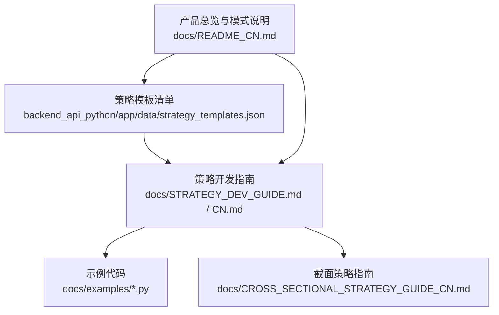
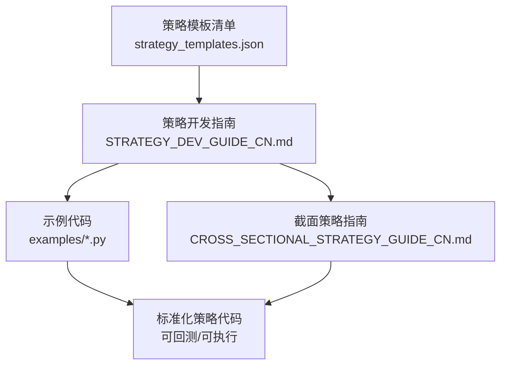
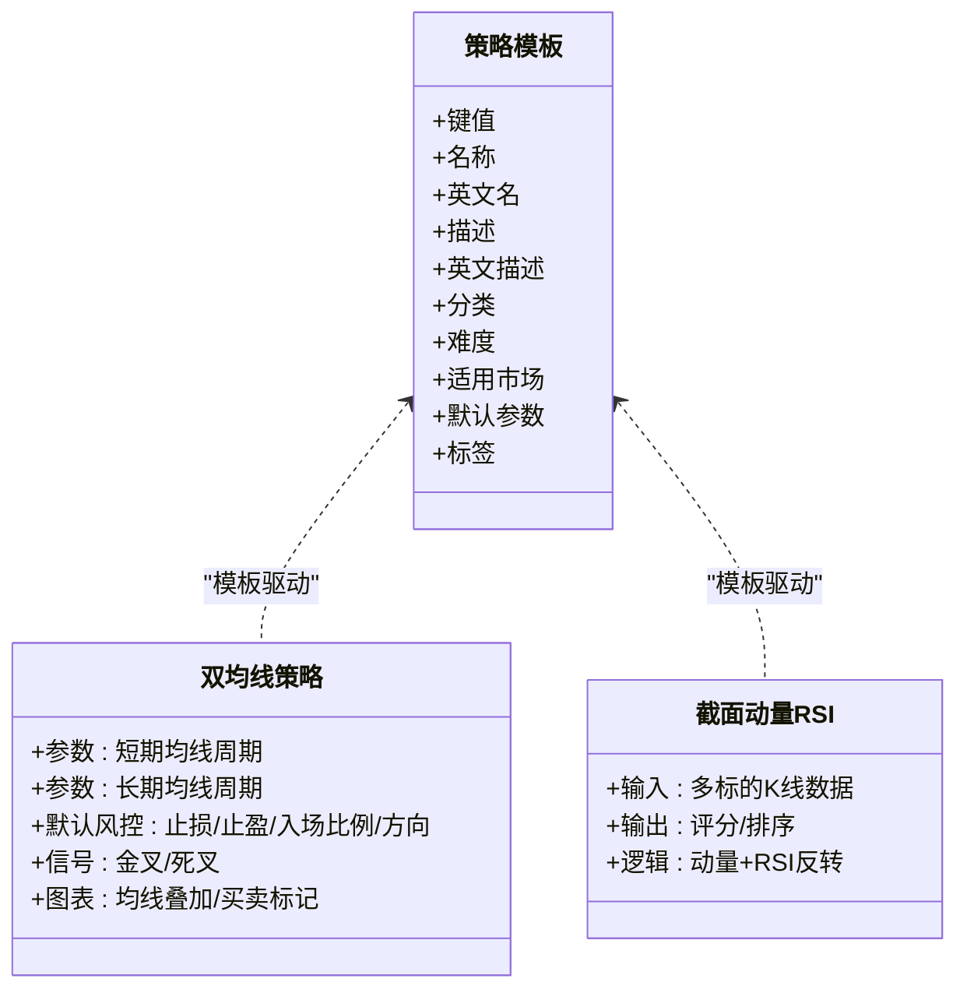
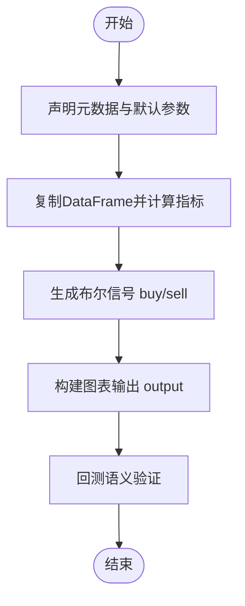
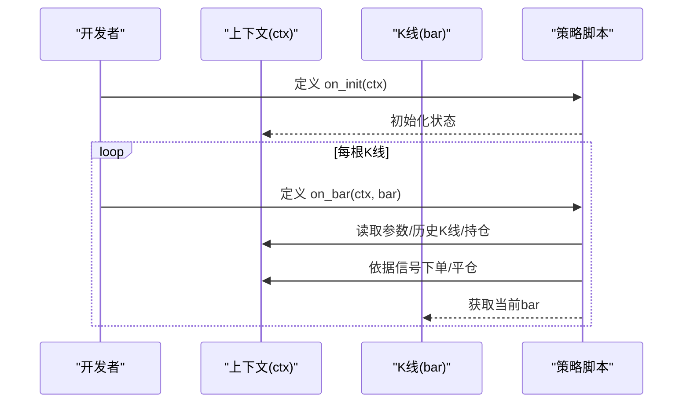
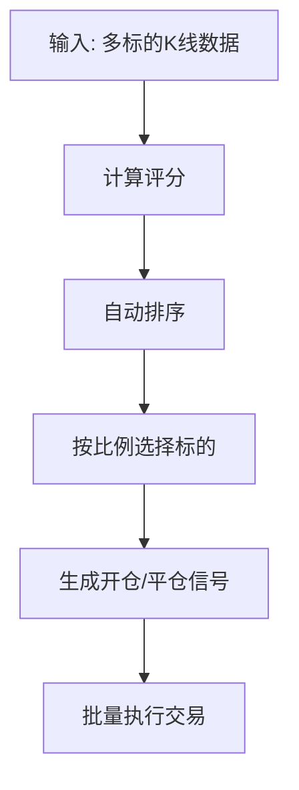
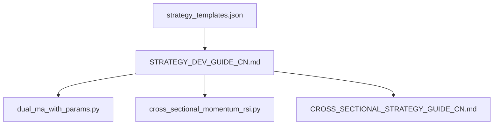

# 代码模板与快捷键

<cite>
**本文引用的文件**
- [strategy_templates.json](file://backend_api_python/app/data/strategy_templates.json)
- [STRATEGY_DEV_GUIDE.md](file://docs/STRATEGY_DEV_GUIDE.md)
- [STRATEGY_DEV_GUIDE_CN.md](file://docs/STRATEGY_DEV_GUIDE_CN.md)
- [dual_ma_with_params.py](file://docs/examples/dual_ma_with_params.py)
- [cross_sectional_momentum_rsi.py](file://docs/examples/cross_sectional_momentum_rsi.py)
- [README_CN.md](file://docs/README_CN.md)
- [CROSS_SECTIONAL_STRATEGY_GUIDE_CN.md](file://docs/CROSS_SECTIONAL_STRATEGY_GUIDE_CN.md)
</cite>

## 目录
1. [简介](#简介)
2. [项目结构](#项目结构)
3. [核心组件](#核心组件)
4. [架构总览](#架构总览)
5. [详细组件分析](#详细组件分析)
6. [依赖关系分析](#依赖关系分析)
7. [性能考量](#性能考量)
8. [故障排查指南](#故障排查指南)
9. [结论](#结论)
10. [附录](#附录)

## 简介
本指南聚焦于 QuantDinger 平台的“代码模板”与“快捷键”两大主题，帮助开发者快速生成标准化策略代码、提升开发效率。内容涵盖：
- 策略模板体系：策略模板、指标模板、回测模板等的分类与使用方法
- 快捷键与高效开发技巧：代码补全、自动格式化、批量替换等常用操作
- 模板库管理与自定义：如何根据个人习惯定制模板与快捷键
- 实战案例：基于内置模板与示例文件的快速上手流程

## 项目结构
QuantDinger 的模板与开发体验主要分布在以下位置：
- 策略模板清单：backend_api_python/app/data/strategy_templates.json
- 策略开发指南：docs/STRATEGY_DEV_GUIDE.md（英文）与 docs/STRATEGY_DEV_GUIDE_CN.md（中文）
- 示例代码：docs/examples/ 下的各类策略示例
- 截面策略指南：docs/CROSS_SECTIONAL_STRATEGY_GUIDE_CN.md
- 产品总览与策略开发模式：docs/README_CN.md

**图表来源**
- [strategy_templates.json:1-191](file://backend_api_python/app/data/strategy_templates.json#L1-L191)
- [STRATEGY_DEV_GUIDE.md:1-1270](file://docs/STRATEGY_DEV_GUIDE.md#L1-L1270)
- [STRATEGY_DEV_GUIDE_CN.md:1-1270](file://docs/STRATEGY_DEV_GUIDE_CN.md#L1-L1270)
- [README_CN.md:504-527](file://docs/README_CN.md#L504-L527)

**章节来源**
- [README_CN.md:504-527](file://docs/README_CN.md#L504-L527)

## 核心组件
- 策略模板库：提供多种策略模板（如均线交叉、RSI 超卖反弹、布林带收缩突破等），包含默认参数、难度等级、适用市场与标签，便于快速生成标准化策略骨架。
- 指标与脚本策略开发框架：提供 IndicatorStrategy（基于数据表的信号策略）与 ScriptStrategy（事件驱动的运行时策略）两类开发模式，配套参数与默认风控声明语法。
- 示例与指南：提供双均线策略、截面动量 RSI 等示例，帮助快速理解模板使用与最佳实践。

**章节来源**
- [strategy_templates.json:1-191](file://backend_api_python/app/data/strategy_templates.json#L1-L191)
- [STRATEGY_DEV_GUIDE_CN.md:1-1270](file://docs/STRATEGY_DEV_GUIDE_CN.md#L1-L1270)
- [dual_ma_with_params.py:1-64](file://docs/examples/dual_ma_with_params.py#L1-L64)
- [cross_sectional_momentum_rsi.py:1-71](file://docs/examples/cross_sectional_momentum_rsi.py#L1-L71)

## 架构总览
下图展示了模板与开发流程的关系：模板清单驱动策略生成，开发指南与示例指导具体实现，最终形成可回测、可执行的策略代码。

**图表来源**
- [strategy_templates.json:1-191](file://backend_api_python/app/data/strategy_templates.json#L1-L191)
- [STRATEGY_DEV_GUIDE_CN.md:1-1270](file://docs/STRATEGY_DEV_GUIDE_CN.md#L1-L1270)
- [CROSS_SECTIONAL_STRATEGY_GUIDE_CN.md:1-224](file://docs/CROSS_SECTIONAL_STRATEGY_GUIDE_CN.md#L1-L224)
- [dual_ma_with_params.py:1-64](file://docs/examples/dual_ma_with_params.py#L1-L64)
- [cross_sectional_momentum_rsi.py:1-71](file://docs/examples/cross_sectional_momentum_rsi.py#L1-L71)

## 详细组件分析

### 策略模板体系与使用
- 模板分类与属性
  - 分类：趋势、均值回归、波动率、市场制造、被动投资、统计套利、组合管理等
  - 属性：名称、英文名、描述、英文描述、难度（入门/中级/高级）、适用市场、默认参数、标签
- 使用方式
  - 从模板清单中选择合适模板，复制其默认参数与标签，作为策略骨架
  - 在 IndicatorStrategy 或 ScriptStrategy 中按指南补充参数声明、信号生成与图表输出
- 常用模板举例
  - 均线交叉策略：适合入门，提供快慢均线周期与时间框架等默认参数
  - RSI 超卖反弹：适合入门，提供 RSI 周期、超卖/超买阈值与时间框架
  - 布林带收缩突破：适合中级，提供布林周期、标准差、压缩阈值与时间框架
  - 海龟交易法：适合高级，提供突破/出场周期、ATR 周期、单笔风险等参数

**图表来源**
- [strategy_templates.json:1-191](file://backend_api_python/app/data/strategy_templates.json#L1-L191)
- [dual_ma_with_params.py:1-64](file://docs/examples/dual_ma_with_params.py#L1-L64)
- [cross_sectional_momentum_rsi.py:1-71](file://docs/examples/cross_sectional_momentum_rsi.py#L1-L71)

**章节来源**
- [strategy_templates.json:1-191](file://backend_api_python/app/data/strategy_templates.json#L1-L191)
- [dual_ma_with_params.py:1-64](file://docs/examples/dual_ma_with_params.py#L1-L64)
- [cross_sectional_momentum_rsi.py:1-71](file://docs/examples/cross_sectional_momentum_rsi.py#L1-L71)

### 指标策略（IndicatorStrategy）开发流程
- 元数据与默认参数
  - 使用参数声明语法定义可调参数
  - 使用默认风控声明语法定义止损、止盈、入场比例、移动止损等
- 指标计算与信号生成
  - 基于 DataFrame 计算指标序列
  - 生成布尔型 buy/sell 信号，确保边缘触发、无重复信号
- 图表输出
  - 输出 plots 与 signals，用于图表渲染与信号标注
- 回测语义
  - 信号在收盘确认，通常于次开盘价成交，避免前瞻偏差

**图表来源**
- [STRATEGY_DEV_GUIDE_CN.md:93-295](file://docs/STRATEGY_DEV_GUIDE_CN.md#L93-L295)

**章节来源**
- [STRATEGY_DEV_GUIDE_CN.md:93-295](file://docs/STRATEGY_DEV_GUIDE_CN.md#L93-L295)

### 脚本策略（ScriptStrategy）开发流程
- 必备函数
  - 初始化函数与每根 K 线回调函数
- 上下文对象
  - 获取参数、历史 K 线、持仓状态、余额/权益、下单接口等
- 交易逻辑
  - 基于实时状态决定开仓、加仓、减仓或平仓
  - 明确区分“全平”与“反向开仓”的意图表达

**图表来源**
- [STRATEGY_DEV_GUIDE_CN.md:570-780](file://docs/STRATEGY_DEV_GUIDE_CN.md#L570-L780)

**章节来源**
- [STRATEGY_DEV_GUIDE_CN.md:570-780](file://docs/STRATEGY_DEV_GUIDE_CN.md#L570-L780)

### 截面策略模板与使用
- 配置要素
  - 标的列表、组合规模、多头比例、调仓频率
- 指标代码
  - 对每个标的计算评分，系统根据评分自动排序并生成交易信号
- 执行逻辑
  - 新增标的生成开仓信号，移除标的生成平仓信号，方向变更先平后开

**图表来源**
- [CROSS_SECTIONAL_STRATEGY_GUIDE_CN.md:60-136](file://docs/CROSS_SECTIONAL_STRATEGY_GUIDE_CN.md#L60-L136)

**章节来源**
- [CROSS_SECTIONAL_STRATEGY_GUIDE_CN.md:60-136](file://docs/CROSS_SECTIONAL_STRATEGY_GUIDE_CN.md#L60-L136)

## 依赖关系分析
- 模板清单依赖开发指南与示例代码，共同构成“模板→实现→验证”的闭环
- 开发指南与示例代码相互印证，前者提供规范，后者提供范式
- 截面策略指南独立于常规策略，但与开发指南共享参数与风控声明语法

**图表来源**
- [strategy_templates.json:1-191](file://backend_api_python/app/data/strategy_templates.json#L1-L191)
- [STRATEGY_DEV_GUIDE_CN.md:1-1270](file://docs/STRATEGY_DEV_GUIDE_CN.md#L1-L1270)
- [dual_ma_with_params.py:1-64](file://docs/examples/dual_ma_with_params.py#L1-L64)
- [cross_sectional_momentum_rsi.py:1-71](file://docs/examples/cross_sectional_momentum_rsi.py#L1-L71)
- [CROSS_SECTIONAL_STRATEGY_GUIDE_CN.md:1-224](file://docs/CROSS_SECTIONAL_STRATEGY_GUIDE_CN.md#L1-L224)

**章节来源**
- [README_CN.md:504-527](file://docs/README_CN.md#L504-L527)

## 性能考量
- 模板复用与参数化：通过模板默认参数减少重复劳动，提升策略迭代速度
- 信号生成去冗余：确保 buy/sell 信号边缘触发，避免连续触发导致回测噪音
- 截面策略批量执行：系统支持并行执行多个标的交易，注意并发上限与网络延迟
- 回测语义一致性：严格遵循“收盘确认、次开盘成交”的语义，避免前瞻偏差

## 故障排查指南
- 参数声明与使用不一致
  - 现象：代码质量检查提示参数声明但未通过 params.get 读取
  - 处理：统一通过 params.get 读取参数，避免硬编码
- 信号重复触发
  - 现象：同一趋势内 buy/sell 信号连续出现
  - 处理：采用边缘触发模式，结合前一根信号状态去重
- 回测语义偏差
  - 现象：使用 shift(-1) 或基于当前 K 线的 intrabar 止损
  - 处理：遵循“收盘确认、次开盘成交”的语义，避免前瞻
- 截面策略标的缺失
  - 现象：部分标的因数据获取失败被跳过
  - 处理：检查数据源可用性与网络状况，必要时降低并发或增加重试

**章节来源**
- [STRATEGY_DEV_GUIDE_CN.md:177-295](file://docs/STRATEGY_DEV_GUIDE_CN.md#L177-L295)
- [CROSS_SECTIONAL_STRATEGY_GUIDE_CN.md:192-199](file://docs/CROSS_SECTIONAL_STRATEGY_GUIDE_CN.md#L192-L199)

## 结论
通过策略模板、开发指南与示例代码的协同，QuantDinger 提供了从“模板生成”到“回测验证”的完整开发路径。建议开发者：
- 优先使用模板作为策略骨架，结合参数与默认风控声明快速搭建可回测的信号策略
- 在需要运行时状态与复杂执行逻辑时，转向 ScriptStrategy 并明确上下文与交易意图
- 在截面策略场景下，遵循评分与排序流程，确保系统能自动生成交易信号
- 持续优化模板库与快捷键配置，形成团队级的标准化开发流程

## 附录

### 快捷键与高效开发技巧（通用建议）
- 代码补全
  - 使用 IDE 的 Python 补全功能，结合 params.get、ctx.buy 等上下文对象进行智能补全
- 自动格式化
  - 配置自动格式化（如 black/autoflake），在保存时自动清理冗余导入与空白
- 批量替换
  - 在模板基础上批量替换默认参数名与默认风控值，快速生成多版本策略
- 模板库管理
  - 将常用模板（如双均线、RSI、布林带）整理为代码片段，按需粘贴
- 自定义模板
  - 基于示例文件扩展模板，加入团队约定的注释、图表与风控默认值
- 快捷键定制
  - 根据个人习惯设置常用操作的快捷键（如“生成 buy/sell 信号”“插入默认风控声明”），提升编写效率

### 模板与示例文件索引
- 策略模板清单：[strategy_templates.json:1-191](file://backend_api_python/app/data/strategy_templates.json#L1-L191)
- 指标策略开发指南：[STRATEGY_DEV_GUIDE_CN.md:1-1270](file://docs/STRATEGY_DEV_GUIDE_CN.md#L1-L1270)
- 双均线策略示例：[dual_ma_with_params.py:1-64](file://docs/examples/dual_ma_with_params.py#L1-L64)
- 截面动量 RSI 示例：[cross_sectional_momentum_rsi.py:1-71](file://docs/examples/cross_sectional_momentum_rsi.py#L1-L71)
- 截面策略指南：[CROSS_SECTIONAL_STRATEGY_GUIDE_CN.md:1-224](file://docs/CROSS_SECTIONAL_STRATEGY_GUIDE_CN.md#L1-L224)