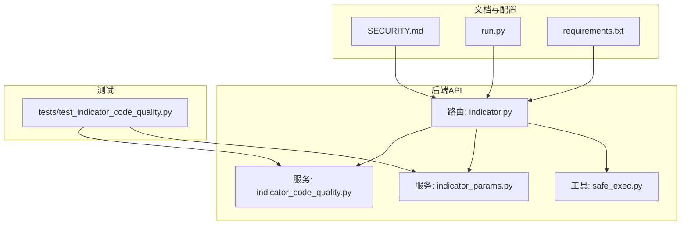
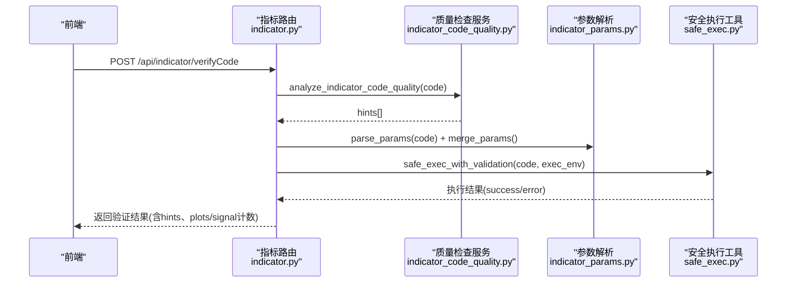
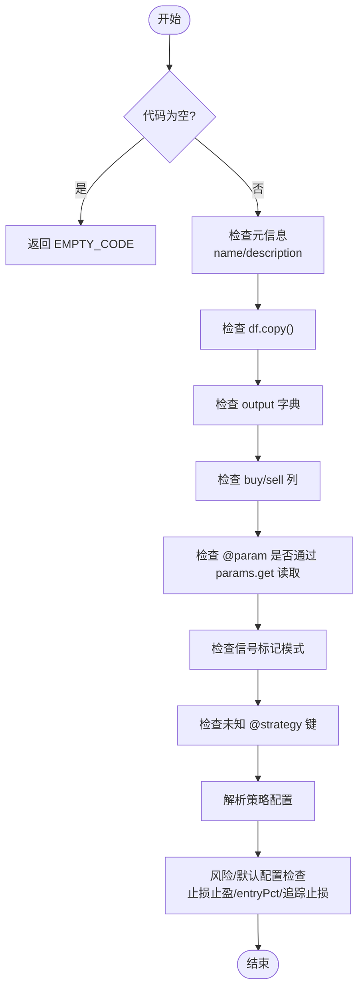
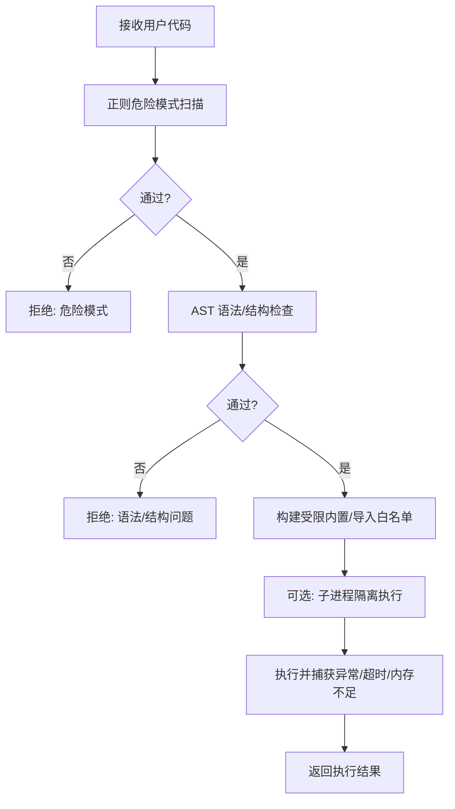
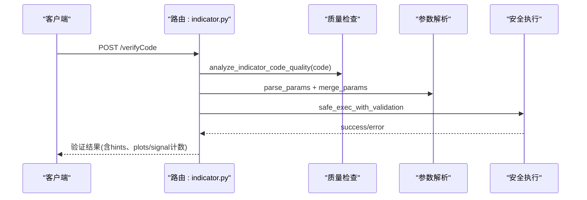
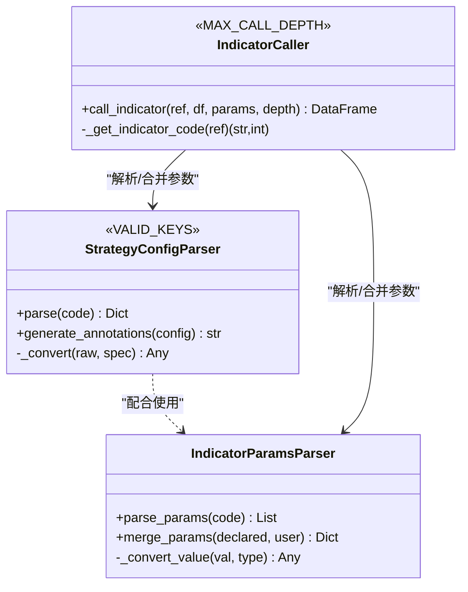
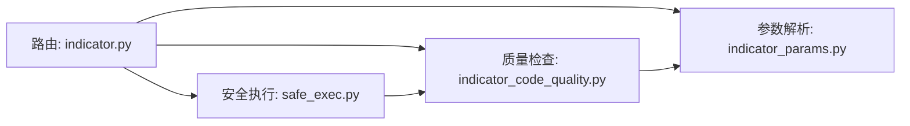

# 代码质量检查

<cite>
**本文档引用的文件**
- [backend_api_python/app/services/indicator_code_quality.py](file://backend_api_python/app/services/indicator_code_quality.py)
- [backend_api_python/tests/test_indicator_code_quality.py](file://backend_api_python/tests/test_indicator_code_quality.py)
- [backend_api_python/app/utils/safe_exec.py](file://backend_api_python/app/utils/safe_exec.py)
- [backend_api_python/app/routers/indicator.py](file://backend_api_python/app/routers/indicator.py)
- [backend_api_python/app/services/indicator_params.py](file://backend_api_python/app/services/indicator_params.py)
- [backend_api_python/SECURITY.md](file://backend_api_python/SECURITY.md)
- [backend_api_python/run.py](file://backend_api_python/run.py)
- [backend_api_python/requirements.txt](file://backend_api_python/requirements.txt)
</cite>

## 目录
1. [简介](#简介)
2. [项目结构](#项目结构)
3. [核心组件](#核心组件)
4. [架构总览](#架构总览)
5. [详细组件分析](#详细组件分析)
6. [依赖分析](#依赖分析)
7. [性能考虑](#性能考虑)
8. [故障排查指南](#故障排查指南)
9. [结论](#结论)
10. [附录](#附录)

## 简介
本指南面向使用 QuantDinger 指标开发与验证的开发者，系统讲解“代码质量检查”机制的工作原理与使用方法。该机制覆盖语法检查、结构合规性检查、安全扫描、运行时输出校验等多个维度，帮助在本地沙箱环境中尽早发现潜在问题，包括代码风格、性能隐患、安全风险与回测兼容性问题。同时提供结果解读、改进建议与配置集成建议，便于将质量检查融入日常开发流程。

## 项目结构
与代码质量检查直接相关的后端模块主要分布在以下位置：
- 质量检查服务：`app/services/indicator_code_quality.py`
- 安全执行工具：`app/utils/safe_exec.py`
- 指标路由与验证入口：`app/routers/indicator.py`
- 参数与策略注解解析：`app/services/indicator_params.py`
- 单元测试：`tests/test_indicator_code_quality.py`
- 安全策略文档：`SECURITY.md`
- 应用入口与配置：`run.py`、`requirements.txt`

**图表来源**
- [backend_api_python/app/routers/indicator.py:1194-1231](file://backend_api_python/app/routers/indicator.py#L1194-L1231)
- [backend_api_python/app/services/indicator_code_quality.py:1-206](file://backend_api_python/app/services/indicator_code_quality.py#L1-L206)
- [backend_api_python/app/services/indicator_params.py:1-380](file://backend_api_python/app/services/indicator_params.py#L1-L380)
- [backend_api_python/app/utils/safe_exec.py:1-471](file://backend_api_python/app/utils/safe_exec.py#L1-L471)
- [backend_api_python/tests/test_indicator_code_quality.py:1-135](file://backend_api_python/tests/test_indicator_code_quality.py#L1-L135)
- [backend_api_python/SECURITY.md:1-110](file://backend_api_python/SECURITY.md#L1-L110)
- [backend_api_python/run.py:1-134](file://backend_api_python/run.py#L1-L134)
- [backend_api_python/requirements.txt:1-37](file://backend_api_python/requirements.txt#L1-L37)

**章节来源**
- [backend_api_python/app/routers/indicator.py:1194-1231](file://backend_api_python/app/routers/indicator.py#L1194-L1231)
- [backend_api_python/app/services/indicator_code_quality.py:1-206](file://backend_api_python/app/services/indicator_code_quality.py#L1-L206)
- [backend_api_python/app/utils/safe_exec.py:1-471](file://backend_api_python/app/utils/safe_exec.py#L1-L471)
- [backend_api_python/app/services/indicator_params.py:1-380](file://backend_api_python/app/services/indicator_params.py#L1-L380)
- [backend_api_python/tests/test_indicator_code_quality.py:1-135](file://backend_api_python/tests/test_indicator_code_quality.py#L1-L135)
- [backend_api_python/SECURITY.md:1-110](file://backend_api_python/SECURITY.md#L1-L110)
- [backend_api_python/run.py:1-134](file://backend_api_python/run.py#L1-L134)
- [backend_api_python/requirements.txt:1-37](file://backend_api_python/requirements.txt#L1-L37)

## 核心组件
- 代码质量检查服务（heuristics）
  - 分析指标代码的结构、注解与潜在风险，不执行用户代码，仅基于启发式规则与正则匹配给出提示。
  - 关键能力：缺失元信息、缺失输出、缺少 buy/sell 列、参数声明但未通过 params.get 读取、信号标记模式、未知 @strategy 键、策略默认配置合理性等。
- 安全执行工具（sandbox + 静态校验）
  - 对用户代码进行正则+AST双重安全扫描，白名单导入与内置函数，超时控制，必要时在子进程中隔离执行。
  - 关键能力：危险模式识别、AST 语法/结构检查、模块/函数/属性黑名单、超时/内存限制。
- 指标路由与验证入口
  - 提供 /verifyCode、/codeQualityHints、/parseStrategyConfig 等接口，串联质量检查与安全执行。
  - 关键能力：mock 数据生成、参数合并、输出格式校验、错误分类与消息本地化。
- 参数与策略注解解析
  - 解析 @param 与 @strategy 注解，生成策略配置与参数声明，支撑质量检查与运行时参数注入。
  - 关键能力：参数类型转换、默认值合并、策略键值范围校验、注解生成。

**章节来源**
- [backend_api_python/app/services/indicator_code_quality.py:79-206](file://backend_api_python/app/services/indicator_code_quality.py#L79-L206)
- [backend_api_python/app/utils/safe_exec.py:358-471](file://backend_api_python/app/utils/safe_exec.py#L358-L471)
- [backend_api_python/app/routers/indicator.py:1194-1231](file://backend_api_python/app/routers/indicator.py#L1194-L1231)
- [backend_api_python/app/services/indicator_params.py:26-117](file://backend_api_python/app/services/indicator_params.py#L26-L117)

## 架构总览
下图展示了“质量检查 + 安全执行”的端到端流程，包括启发式检查、静态安全扫描、沙箱执行与输出校验。

**图表来源**
- [backend_api_python/app/routers/indicator.py:673-715](file://backend_api_python/app/routers/indicator.py#L673-L715)
- [backend_api_python/app/services/indicator_code_quality.py:79-206](file://backend_api_python/app/services/indicator_code_quality.py#L79-L206)
- [backend_api_python/app/services/indicator_params.py:129-216](file://backend_api_python/app/services/indicator_params.py#L129-L216)
- [backend_api_python/app/utils/safe_exec.py:207-244](file://backend_api_python/app/utils/safe_exec.py#L207-L244)

## 详细组件分析

### 组件A：代码质量检查服务（启发式）
- 功能要点
  - 缺失元信息：my_indicator_name、my_indicator_description
  - 结构完整性：df = df.copy()、必须定义 output 字典、至少包含 buy/sell 列之一
  - 参数合规：声明了 @param 必须通过 params.get(...) 读取
  - 信号标记：推荐显式 None 列表而非 where(..., None).tolist()
  - 策略注解：未知 @strategy 键、止损止盈默认配置合理性、entryPct 合理性、追踪止损配置
  - 输出空提示：当 plots 与 signals 均为空且未报 MISSING_OUTPUT 时给出提示
- 复杂度与性能
  - 正则与字符串匹配为主，时间复杂度近似 O(n)，空间复杂度 O(1)，整体开销极低
- 错误处理
  - 空代码直接返回 EMPTY_CODE 提示
  - 未知键与参数未读取等以不同严重级别返回，便于前端分级展示

**图表来源**
- [backend_api_python/app/services/indicator_code_quality.py:79-206](file://backend_api_python/app/services/indicator_code_quality.py#L79-L206)

**章节来源**
- [backend_api_python/app/services/indicator_code_quality.py:1-206](file://backend_api_python/app/services/indicator_code_quality.py#L1-L206)
- [backend_api_python/tests/test_indicator_code_quality.py:1-135](file://backend_api_python/tests/test_indicator_code_quality.py#L1-L135)

### 组件B：安全执行工具（沙箱与静态校验）
- 功能要点
  - 静态安全扫描：危险正则模式、AST 抽象语法树检查、禁止导入/调用/属性访问黑名单
  - 白名单机制：仅允许受控模块与内置函数，拒绝危险操作
  - 执行控制：超时（跨平台）、可选内存限制、必要时子进程隔离
- 复杂度与性能
  - AST 解析与节点遍历，时间复杂度 O(n)，空间复杂度 O(n)
  - 正则扫描线性，整体开销可控
- 错误处理
  - 语法错误、解析失败、超时、内存不足等均有明确错误类型与日志记录

**图表来源**
- [backend_api_python/app/utils/safe_exec.py:358-471](file://backend_api_python/app/utils/safe_exec.py#L358-L471)
- [backend_api_python/app/utils/safe_exec.py:157-244](file://backend_api_python/app/utils/safe_exec.py#L157-L244)

**章节来源**
- [backend_api_python/app/utils/safe_exec.py:1-471](file://backend_api_python/app/utils/safe_exec.py#L1-L471)

### 组件C：指标路由与验证入口
- 功能要点
  - /verifyCode：对指标代码进行质量检查与安全执行，校验输出格式与长度一致性
  - /codeQualityHints：仅返回质量检查提示
  - /parseStrategyConfig：解析 @param 与 @strategy 注解
  - 本地化提示文本与错误类型映射
- 处理逻辑
  - 生成 mock DataFrame，合并参数，构造执行环境，调用安全执行工具
  - 对输出结构进行严格校验（plots/signal 的 data 长度需与 df 一致）

**图表来源**
- [backend_api_python/app/routers/indicator.py:673-715](file://backend_api_python/app/routers/indicator.py#L673-L715)
- [backend_api_python/app/routers/indicator.py:1194-1231](file://backend_api_python/app/routers/indicator.py#L1194-L1231)

**章节来源**
- [backend_api_python/app/routers/indicator.py:673-715](file://backend_api_python/app/routers/indicator.py#L673-L715)
- [backend_api_python/app/routers/indicator.py:1194-1231](file://backend_api_python/app/routers/indicator.py#L1194-L1231)

### 组件D：参数与策略注解解析
- 功能要点
  - @param：解析参数声明，支持 int/float/bool/str 类型与默认值
  - @strategy：解析策略配置，限定键与取值范围，生成注解
  - 合并：将声明参数与用户输入合并，按类型转换
- 复杂度与性能
  - 正则匹配与简单字典操作，时间复杂度 O(n)，空间复杂度 O(1)

**图表来源**
- [backend_api_python/app/services/indicator_params.py:26-117](file://backend_api_python/app/services/indicator_params.py#L26-L117)
- [backend_api_python/app/services/indicator_params.py:119-216](file://backend_api_python/app/services/indicator_params.py#L119-L216)
- [backend_api_python/app/services/indicator_params.py:218-355](file://backend_api_python/app/services/indicator_params.py#L218-L355)

**章节来源**
- [backend_api_python/app/services/indicator_params.py:1-380](file://backend_api_python/app/services/indicator_params.py#L1-L380)

## 依赖分析
- 组件耦合
  - 路由层依赖质量检查与安全执行工具，耦合度适中，职责清晰
  - 质量检查与安全执行相互独立，分别负责“静态启发式”和“动态沙箱”
- 外部依赖
  - Flask/Werkzeug、pandas/numpy、gunicorn 等运行时依赖
  - 安全策略文档明确了安全边界与响应流程

**图表来源**
- [backend_api_python/app/routers/indicator.py:1194-1231](file://backend_api_python/app/routers/indicator.py#L1194-L1231)
- [backend_api_python/app/services/indicator_code_quality.py:1-206](file://backend_api_python/app/services/indicator_code_quality.py#L1-L206)
- [backend_api_python/app/utils/safe_exec.py:1-471](file://backend_api_python/app/utils/safe_exec.py#L1-L471)
- [backend_api_python/app/services/indicator_params.py:1-380](file://backend_api_python/app/services/indicator_params.py#L1-L380)

**章节来源**
- [backend_api_python/requirements.txt:1-37](file://backend_api_python/requirements.txt#L1-L37)
- [backend_api_python/SECURITY.md:1-110](file://backend_api_python/SECURITY.md#L1-L110)

## 性能考虑
- 启发式检查开销极低，适合在前端即时反馈
- 安全执行工具在本地开发环境默认超时较短，避免长时间阻塞
- 建议在 CI 中适当放宽超时与内存限制，确保复杂指标也能完成验证
- 对于大规模回测场景，建议将质量检查前置到本地 IDE，减少线上失败概率

## 故障排查指南
- 常见错误类型与定位
  - EMPTY_CODE：代码为空，检查前端提交内容
  - Security Error：安全扫描拒绝，检查是否存在危险导入/调用/属性
  - RuntimeError：运行时异常，检查输出结构、buy/sell 列长度与类型
  - MissingOutput/InvalidOutput：未定义 output 或类型不符
  - LengthMismatch：plots/signal 的 data 长度与 df 不一致
- 建议排查步骤
  - 使用 /codeQualityHints 获取启发式提示，逐项修正
  - 使用 /parseStrategyConfig 校验 @param 与 @strategy 注解是否正确
  - 在本地 mock 数据环境下最小复现，逐步缩小问题范围
- 日志与可观测性
  - 安全执行工具会记录超时、内存不足、语法错误等日志，便于定位

**章节来源**
- [backend_api_python/app/routers/indicator.py:126-277](file://backend_api_python/app/routers/indicator.py#L126-L277)
- [backend_api_python/app/utils/safe_exec.py:157-244](file://backend_api_python/app/utils/safe_exec.py#L157-L244)

## 结论
代码质量检查机制通过“启发式规则 + 静态安全扫描 + 沙箱执行 + 输出校验”的组合拳，有效覆盖了语法、结构、安全与回测兼容性等关键质量维度。结合本地化提示与自动修复流程，能够显著降低指标开发中的常见错误，提升整体交付质量。建议在团队开发流程中强制启用质量检查，并将其纳入 CI/CD 流水线。

## 附录

### 质量检查结果解读与改进建议
- EMPTY_CODE：请提供非空代码
- MISSING_OUTPUT：必须定义 output 字典
- MISSING_BUY_SELL_COLUMNS：至少设置 df['buy'] 或 df['sell']
- DECLARED_PARAMS_NOT_READ_VIA_PARAMS_GET：声明的参数必须通过 params.get(...) 读取
- SIGNAL_MARKERS_USE_WHERE_NONE：建议使用显式 None 列表，避免 NaN 渲染问题
- UNKNOWN_STRATEGY_KEY：移除或修正为受支持的 @strategy 键
- NO_STRATEGY_ANNOTATIONS：建议添加默认策略配置
- NO_STOP_AND_TAKE_PROFIT：至少声明止损或止盈之一
- ENTRY_PCT_VERY_LOW：评估 entryPct 是否合理
- TRAILING_NO_PCT：启用追踪止损时需设置百分比

**章节来源**
- [backend_api_python/app/routers/indicator.py:317-362](file://backend_api_python/app/routers/indicator.py#L317-L362)
- [backend_api_python/app/services/indicator_code_quality.py:79-206](file://backend_api_python/app/services/indicator_code_quality.py#L79-L206)

### 配置与阈值说明
- 质量检查规则
  - 通过注解解析与启发式规则实现，无需额外配置文件
- 安全阈值
  - 导入白名单、内置函数白名单、危险模式黑名单
  - 超时默认 20 秒（verifyCode），可按需调整
- 策略默认配置
  - @strategy 键值范围与枚举由解析器约束，超出范围将被忽略或规范化

**章节来源**
- [backend_api_python/app/utils/safe_exec.py:56-92](file://backend_api_python/app/utils/safe_exec.py#L56-L92)
- [backend_api_python/app/services/indicator_params.py:47-101](file://backend_api_python/app/services/indicator_params.py#L47-L101)

### 开发流程集成建议
- 本地 IDE 集成
  - 在保存/运行前调用 /codeQualityHints 与 /verifyCode
  - 自动修复：若命中可修复提示，可触发 /aiGenerate 并选择返回修复版本
- CI/CD 集成
  - 在 PR 阶段增加质量检查步骤，失败即阻断
  - 对复杂指标适当放宽超时与内存限制
- 安全基线
  - 严格遵守安全模型，不引入危险模块与调用
  - 定期审查安全策略与依赖版本

**章节来源**
- [backend_api_python/app/routers/indicator.py:717-1191](file://backend_api_python/app/routers/indicator.py#L717-L1191)
- [backend_api_python/SECURITY.md:26-46](file://backend_api_python/SECURITY.md#L26-L46)