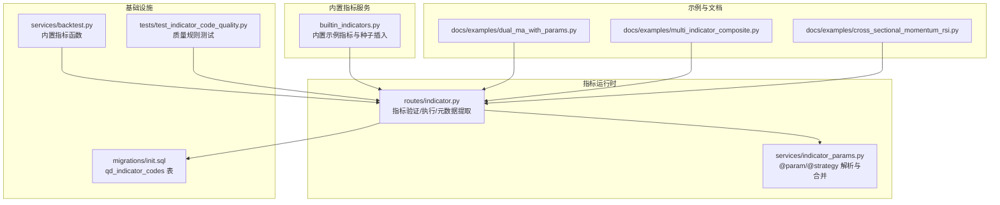
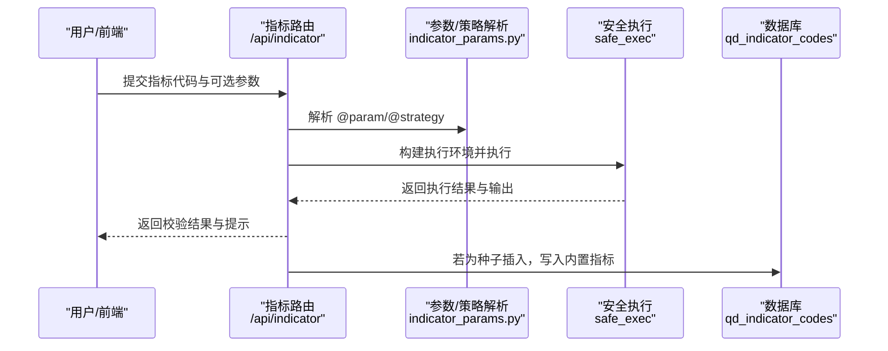
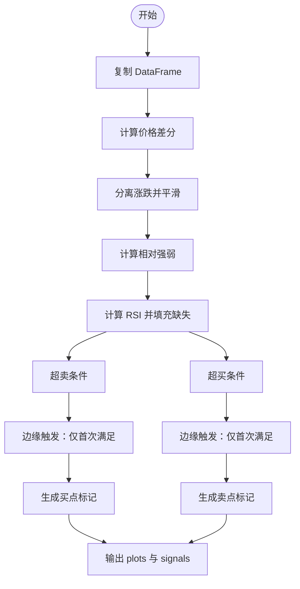
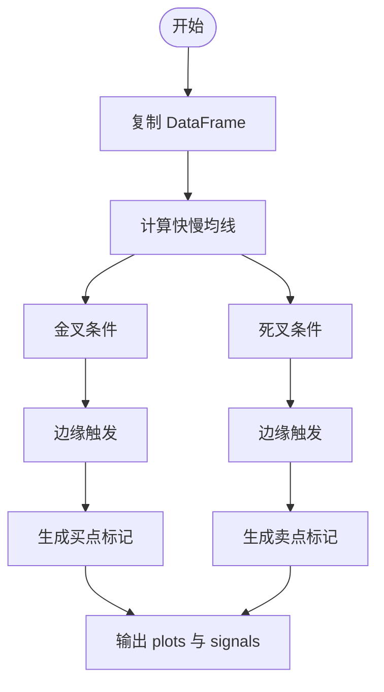
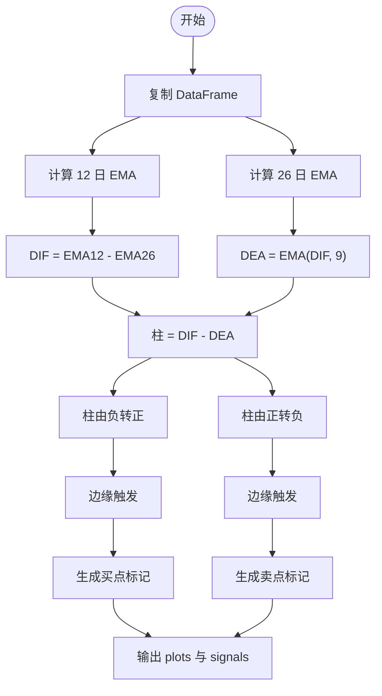
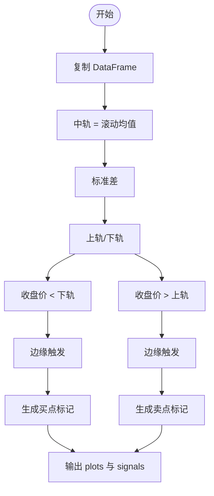
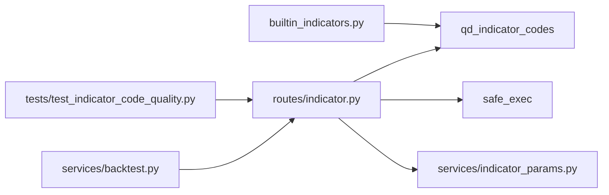

# 内置指标库

<cite>
**本文引用的文件**
- [builtin_indicators.py](file://backend_api_python/app/services/builtin_indicators.py)
- [indicator.py](file://backend_api_python/app/routes/indicator.py)
- [indicator_params.py](file://backend_api_python/app/services/indicator_params.py)
- [dual_ma_with_params.py](file://docs/examples/dual_ma_with_params.py)
- [multi_indicator_composite.py](file://docs/examples/multi_indicator_composite.py)
- [cross_sectional_momentum_rsi.py](file://docs/examples/cross_sectional_momentum_rsi.py)
- [init.sql](file://backend_api_python/migrations/init.sql)
- [test_indicator_code_quality.py](file://backend_api_python/tests/test_indicator_code_quality.py)
- [backtest.py](file://backend_api_python/app/services/backtest.py)
- [indicator.py](file://backend_api_python/app/routes/indicator.py)
</cite>

## 目录
1. [简介](#简介)
2. [项目结构](#项目结构)
3. [核心组件](#核心组件)
4. [架构总览](#架构总览)
5. [详细组件分析](#详细组件分析)
6. [依赖分析](#依赖分析)
7. [性能考虑](#性能考虑)
8. [故障排查指南](#故障排查指南)
9. [结论](#结论)
10. [附录](#附录)

## 简介
本指南面向策略开发者与量化研究人员，系统讲解平台内置指标库的使用方法与实现原理。内容覆盖：
- 经典技术指标：RSI 边缘触发、双均线金叉死叉、MACD 柱穿零轴、布林带触及
- 指标代码结构与格式规范：@strategy 参数注释、DataFrame 操作、信号生成逻辑
- 如何在策略中调用内置指标与自定义扩展
- 指标参数调整方法与最佳实践

## 项目结构
内置指标库由“内置示例指标 + 指标运行时与校验框架 + 参数与策略注解解析 + 数据库持久化”构成，核心文件如下：
- 内置示例指标：backend_api_python/app/services/builtin_indicators.py
- 指标路由与校验：backend_api_python/app/routes/indicator.py
- 参数与策略注解解析：backend_api_python/app/services/indicator_params.py
- 示例策略与组合策略：docs/examples/*.py
- 数据库模式：backend_api_python/migrations/init.sql
- 测试与质量规则：backend_api_python/tests/test_indicator_code_quality.py
- 回测内置函数：backend_api_python/app/services/backtest.py

**图表来源**
- [builtin_indicators.py:192-250](file://backend_api_python/app/services/builtin_indicators.py#L192-L250)
- [indicator.py:126-200](file://backend_api_python/app/routes/indicator.py#L126-L200)
- [indicator_params.py:119-216](file://backend_api_python/app/services/indicator_params.py#L119-L216)
- [init.sql:385-420](file://backend_api_python/migrations/init.sql#L385-L420)
- [dual_ma_with_params.py:17-64](file://docs/examples/dual_ma_with_params.py#L17-L64)
- [multi_indicator_composite.py:13-109](file://docs/examples/multi_indicator_composite.py#L13-L109)
- [cross_sectional_momentum_rsi.py:22-71](file://docs/examples/cross_sectional_momentum_rsi.py#L22-L71)
- [backtest.py:2279-2311](file://backend_api_python/app/services/backtest.py#L2279-L2311)
- [test_indicator_code_quality.py:1-135](file://backend_api_python/tests/test_indicator_code_quality.py#L1-L135)

**章节来源**
- [builtin_indicators.py:17-185](file://backend_api_python/app/services/builtin_indicators.py#L17-L185)
- [indicator.py:1-200](file://backend_api_python/app/routes/indicator.py#L1-L200)
- [indicator_params.py:1-380](file://backend_api_python/app/services/indicator_params.py#L1-L380)
- [init.sql:385-420](file://backend_api_python/migrations/init.sql#L385-L420)

## 核心组件
- 内置示例指标集合：包含 RSI 边缘触发、双均线金叉死叉、MACD 柱穿零轴、布林带触及四个示例，每个示例均提供完整的 @strategy 配置与输出结构。
- 指标运行时与校验：提供指标代码验证、参数合并、安全执行、输出格式校验与提示。
- 参数与策略注解解析：支持 @param 与 @strategy 注解的解析、类型转换与默认值合并。
- 数据持久化：指标代码存储于 qd_indicator_codes 表，支持社区发布与复用。
- 示例策略：提供参数化双均线与多指标组合策略示例，展示最佳实践。

**章节来源**
- [builtin_indicators.py:17-185](file://backend_api_python/app/services/builtin_indicators.py#L17-L185)
- [indicator.py:126-200](file://backend_api_python/app/routes/indicator.py#L126-L200)
- [indicator_params.py:119-216](file://backend_api_python/app/services/indicator_params.py#L119-L216)
- [init.sql:385-420](file://backend_api_python/migrations/init.sql#L385-L420)

## 架构总览
内置指标库的运行流程如下：
- 新用户注册后，系统根据锚点名称幂等插入内置示例指标。
- 指标代码在前端或 IDE 中编写完成后，通过 /api/indicator/verifyCode 进行安全执行与格式校验。
- 校验通过后，指标代码可被回测引擎或实盘执行器使用，输出包含 plots 与 signals，用于图表与信号标注。
- 参数通过 @param 注解声明，运行时通过 params 字典读取；策略配置通过 @strategy 注解声明，运行时解析为策略默认参数。

**图表来源**
- [indicator.py:126-200](file://backend_api_python/app/routes/indicator.py#L126-L200)
- [indicator_params.py:119-216](file://backend_api_python/app/services/indicator_params.py#L119-L216)
- [builtin_indicators.py:192-250](file://backend_api_python/app/services/builtin_indicators.py#L192-L250)

## 详细组件分析

### RSI 边缘触发
- 实现要点
  - 计算 RSI：使用指数平滑计算平均涨跌，避免早期 NaN 爆炸，最后用 50 填充缺失值。
  - 信号生成：采用“边缘触发”，即仅当条件首次满足且与上一根不同才生成信号，避免重复开仓。
  - 输出结构：包含 RSI 曲线与买卖标记点。
- 使用方法
  - 在回测面板设置杠杆、止盈止损、入场比例与交易方向。
  - 可直接复制内置示例代码至指标 IDE，无需额外修改即可运行。
- 参数与注解
  - @strategy：设置止损、止盈、入场比例、交易方向等默认风控。
  - @param：示例中未声明参数，但可按需添加。
- 最佳实践
  - 结合波动率过滤或趋势过滤，降低震荡市中的误信号。
  - 调整超买/超卖阈值以适配不同市场。

**图表来源**
- [builtin_indicators.py:23-62](file://backend_api_python/app/services/builtin_indicators.py#L23-L62)

**章节来源**
- [builtin_indicators.py:23-62](file://backend_api_python/app/services/builtin_indicators.py#L23-L62)

### 双均线金叉死叉
- 实现要点
  - 快慢均线：滚动均值计算，支持可调周期。
  - 交叉信号：金叉做多、死叉做空，使用 shift(1) 判断交叉发生。
  - 输出结构：两条均线曲线与买卖标记点。
- 使用方法
  - 在指标 IDE 中直接编辑 fast/slow 周期参数，验证信号稳定性。
  - 通过 @strategy 设置默认风控与交易方向。
- 参数与注解
  - @param：声明短期/长期均线周期。
  - @strategy：设置止盈止损、入场比例、交易方向等。
- 最佳实践
  - 在震荡市中可启用双向交易方向，结合趋势过滤提高胜率。
  - 适当调整周期以适配不同时间框架。

**图表来源**
- [builtin_indicators.py:67-100](file://backend_api_python/app/services/builtin_indicators.py#L67-L100)

**章节来源**
- [builtin_indicators.py:67-100](file://backend_api_python/app/services/builtin_indicators.py#L67-L100)
- [dual_ma_with_params.py:17-64](file://docs/examples/dual_ma_with_params.py#L17-L64)

### MACD 柱穿零轴
- 实现要点
  - 计算 DIF、DEA 与柱状图：使用指数平滑计算 DIF 与 DEA，柱为两者之差。
  - 信号生成：柱由负变正试多，由正变负试空，使用边缘触发避免重复信号。
  - 输出结构：DIF、DEA、柱状图与买卖标记点。
- 使用方法
  - 在回测面板设置杠杆、止盈止损、入场比例与交易方向。
  - 可与更高时间框架（如 1H/4H）加密合约配合。
- 参数与注解
  - @strategy：设置默认风控参数。
  - @param：可扩展为自定义快慢周期或信号过滤。
- 最佳实践
  - 结合趋势过滤与成交量过滤，提升信号质量。
  - 注意零轴穿越的滞后性，结合价格行为确认。

**图表来源**
- [builtin_indicators.py:105-140](file://backend_api_python/app/services/builtin_indicators.py#L105-L140)

**章节来源**
- [builtin_indicators.py:105-140](file://backend_api_python/app/services/builtin_indicators.py#L105-L140)

### 布林带触及
- 实现要点
  - 计算中轨、上轨、下轨：滚动均值与标准差，支持周期与倍数可调。
  - 信号生成：收盘价跌破下轨做多，突破上轨做空，采用边缘触发。
  - 输出结构：三条轨道曲线与买卖标记点。
- 使用方法
  - 在回测面板设置杠杆、止盈止损、入场比例与交易方向。
  - 实盘建议结合趋势过滤与风控。
- 参数与注解
  - @strategy：设置默认风控参数。
  - @param：周期与标准差倍数。
- 最佳实践
  - 在震荡区间效果较好，突破后回踩可作为加仓机会。
  - 严格设置止损，避免假突破造成较大损失。

**图表来源**
- [builtin_indicators.py:145-183](file://backend_api_python/app/services/builtin_indicators.py#L145-L183)

**章节来源**
- [builtin_indicators.py:145-183](file://backend_api_python/app/services/builtin_indicators.py#L145-L183)

### 指标代码结构与格式规范
- 必备变量
  - my_indicator_name：指标名称
  - my_indicator_description：指标描述
  - output：必须返回的字典，包含 name、plots、signals
- DataFrame 操作
  - 所有计算前先复制 df，避免污染输入数据
  - 使用 pandas/numpy 进行向量化计算
- 信号生成逻辑
  - 生成布尔列 buy/sell
  - 使用边缘触发：仅当条件首次满足才标记，避免重复信号
  - 买卖标记点用于图表标注，通常基于 low/high 乘以微小系数
- 输出结构
  - plots：包含多条曲线，每条包含 name、data、color、overlay
  - signals：包含多种类型的信号，如 buy/sell，每条包含 type、text、data、color

**章节来源**
- [builtin_indicators.py:23-62](file://backend_api_python/app/services/builtin_indicators.py#L23-L62)
- [builtin_indicators.py:67-100](file://backend_api_python/app/services/builtin_indicators.py#L67-L100)
- [builtin_indicators.py:105-140](file://backend_api_python/app/services/builtin_indicators.py#L105-L140)
- [builtin_indicators.py:145-183](file://backend_api_python/app/services/builtin_indicators.py#L145-L183)

### @strategy 参数注释与默认风控
- 支持的键
  - stopLossPct：止损比例（0-1）
  - takeProfitPct：止盈比例（0-5）
  - entryPct：入场比例（0.01-1）
  - trailingEnabled：是否启用追踪止损
  - trailingStopPct：追踪止损比例
  - trailingActivationPct：追踪激活比例
  - tradeDirection：交易方向（long/short/both）
- 解析与生成
  - 解析器会校验键名与类型范围，非法键会被忽略
  - 可通过 generate_annotations 从配置字典生成注解行

**章节来源**
- [indicator_params.py:26-117](file://backend_api_python/app/services/indicator_params.py#L26-L117)

### @param 参数声明与合并
- 声明格式
  - # @param 参数名 类型 默认值 描述
  - 支持类型：int、float、bool、str
- 合并与读取
  - 通过 parse_params 解析声明
  - merge_params 合并用户参数与默认值
  - 在指标代码中通过 params.get('name', default) 读取

**章节来源**
- [indicator_params.py:119-216](file://backend_api_python/app/services/indicator_params.py#L119-L216)

### 在策略中调用内置指标
- 直接调用
  - 在指标代码中使用 call_indicator(指标ID或名称, df, params) 调用其他指标
  - 返回值为包含计算结果列的新 DataFrame
- 递归与防环
  - 限制最大调用深度，防止循环依赖
  - 记录调用栈并在检测到环时回退

**章节来源**
- [indicator_params.py:218-355](file://backend_api_python/app/services/indicator_params.py#L218-L355)

### 基于示例指标进行自定义开发
- 双均线策略（参数化）
  - 展示了 @param 与 @strategy 的标准写法
  - 从 params 读取参数而非硬编码
  - 输出两条均线与买卖标记点
- 多指标组合策略
  - 展示如何组合均线、RSI、MACD、成交量过滤
  - 将原始条件整理为更稳定的边缘触发信号
  - 支持开关式参数（是否使用 MACD/成交量）

**章节来源**
- [dual_ma_with_params.py:17-64](file://docs/examples/dual_ma_with_params.py#L17-L64)
- [multi_indicator_composite.py:13-109](file://docs/examples/multi_indicator_composite.py#L13-L109)

### 截面策略指标示例（研究参考）
- 输入输出
  - 输入：data = {symbol: df, ...}
  - 输出：scores = {symbol: score, ...}，可选 rankings
- 评分逻辑
  - 动量因子（20周期）：价格变化率，越高越好
  - RSI 指标（14周期）：反转 RSI 值，越低越好（100 - RSI）
  - 综合评分：70% 动量 + 30% RSI 反转值
- 使用说明
  - 当前平台文档已明确：cross_sectional 还不在主策略快照回测/实盘链路里
  - 更适合作为研究参考，而非直接照搬

**章节来源**
- [cross_sectional_momentum_rsi.py:22-71](file://docs/examples/cross_sectional_momentum_rsi.py#L22-L71)

## 依赖分析
- 内置指标服务依赖数据库表 qd_indicator_codes 存储指标代码与元数据
- 指标路由依赖参数解析模块与安全执行模块
- 回测服务提供内置指标函数（SMA、EMA、RSI、MACD、BOLL、ATR），便于策略复用
- 测试模块验证代码质量与注解解析正确性

**图表来源**
- [builtin_indicators.py:192-250](file://backend_api_python/app/services/builtin_indicators.py#L192-L250)
- [indicator.py:126-200](file://backend_api_python/app/routes/indicator.py#L126-L200)
- [indicator_params.py:119-216](file://backend_api_python/app/services/indicator_params.py#L119-L216)
- [backtest.py:2279-2311](file://backend_api_python/app/services/backtest.py#L2279-L2311)
- [test_indicator_code_quality.py:1-135](file://backend_api_python/tests/test_indicator_code_quality.py#L1-L135)

**章节来源**
- [init.sql:385-420](file://backend_api_python/migrations/init.sql#L385-L420)
- [indicator.py:126-200](file://backend_api_python/app/routes/indicator.py#L126-L200)
- [indicator_params.py:119-216](file://backend_api_python/app/services/indicator_params.py#L119-L216)
- [backtest.py:2279-2311](file://backend_api_python/app/services/backtest.py#L2279-L2311)
- [test_indicator_code_quality.py:1-135](file://backend_api_python/tests/test_indicator_code_quality.py#L1-L135)

## 性能考虑
- 向量化计算：优先使用 pandas/numpy 的向量化操作，避免显式循环
- 边缘触发：仅在条件首次满足时生成信号，减少重复信号带来的绘图与回测成本
- 参数合并：在执行前完成参数合并，避免在循环中重复解析
- 安全执行：使用受限执行环境，确保长时间运行不会影响系统稳定性

[本节为通用指导，不直接分析具体文件]

## 故障排查指南
- 缺少 output 变量
  - 现象：校验失败，提示缺少 output
  - 处理：确保指标代码末尾定义 output 字典
- 未定义 @strategy 注解
  - 现象：质量规则提示未声明策略注解
  - 处理：添加必要的 @strategy 注解，或在策略中显式声明
- 未通过 params 读取 @param 声明的参数
  - 现象：质量规则提示参数未通过 params.get 读取
  - 处理：改为通过 params.get('name', default) 读取
- 买卖标记点使用 where(None)
  - 现象：质量规则提示使用 where(None) 的标记点
  - 处理：改用列表推导或 fillna(False) 的布尔序列
- 安全执行错误
  - 现象：执行时报错，可能为语法错误或不安全代码
  - 处理：检查代码安全性，确保仅使用允许的内置函数与库

**章节来源**
- [test_indicator_code_quality.py:78-135](file://backend_api_python/tests/test_indicator_code_quality.py#L78-L135)
- [indicator.py:126-200](file://backend_api_python/app/routes/indicator.py#L126-L200)

## 结论
内置指标库提供了标准化、可复用的技术指标实现与运行时框架，开发者可直接使用示例指标进行验证与优化，也可基于参数化与注解规范进行二次开发。通过合理的参数设计、边缘触发与风控配置，可以在不同市场环境下获得稳健的信号表现。

[本节为总结性内容，不直接分析具体文件]

## 附录

### 指标参数调整方法与最佳实践
- 参数调整
  - 使用 @param 声明参数，运行时通过 params.get 读取
  - 在回测面板或策略配置中传入用户参数，实现动态调整
- 最佳实践
  - 保持参数命名清晰，提供合理默认值
  - 在边缘触发基础上叠加趋势/成交量过滤
  - 结合平台默认风控参数，避免过度交易
  - 使用内置指标函数（SMA/EMA/RSI/MACD/BOLL）统一计算口径

**章节来源**
- [dual_ma_with_params.py:17-64](file://docs/examples/dual_ma_with_params.py#L17-L64)
- [multi_indicator_composite.py:13-109](file://docs/examples/multi_indicator_composite.py#L13-L109)
- [backtest.py:2279-2311](file://backend_api_python/app/services/backtest.py#L2279-L2311)