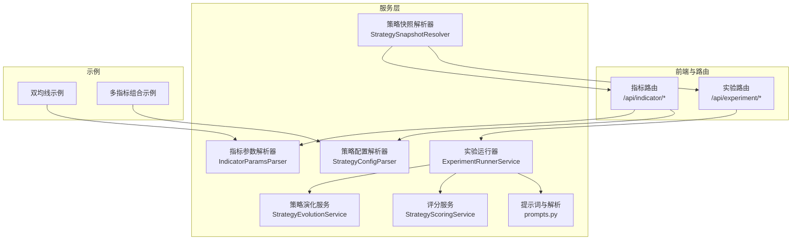
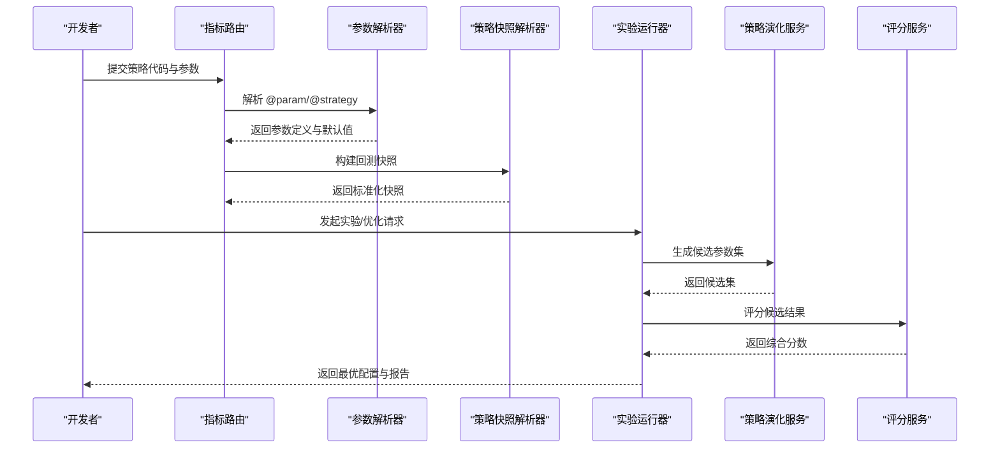
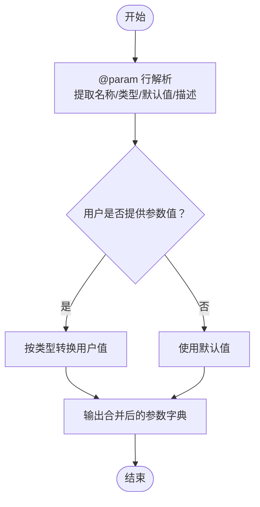
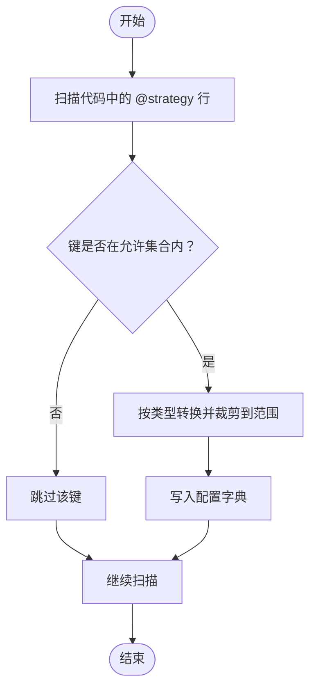
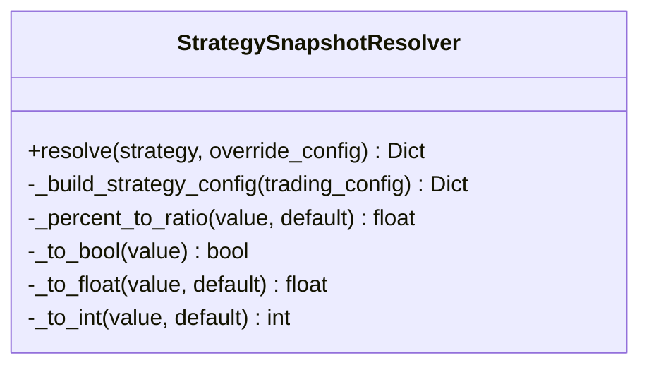
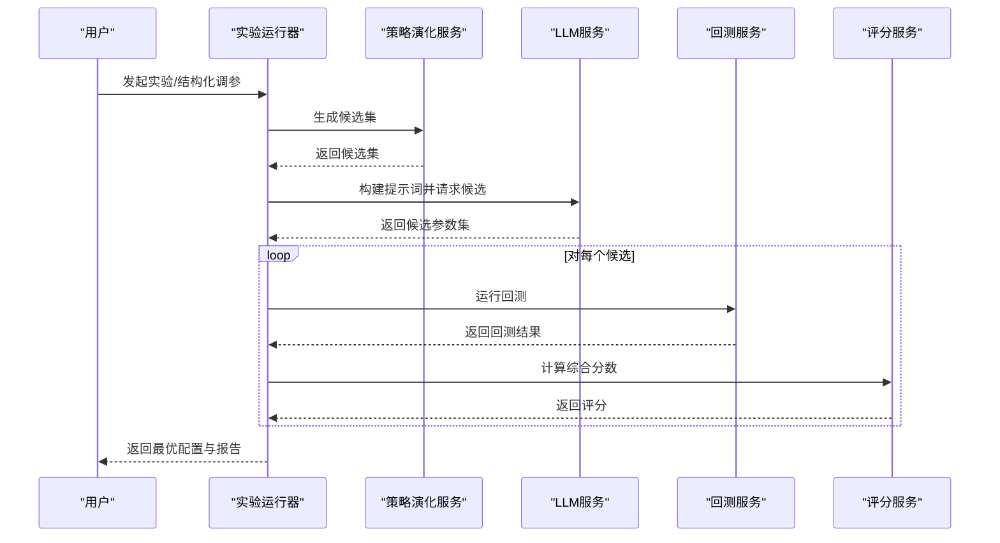
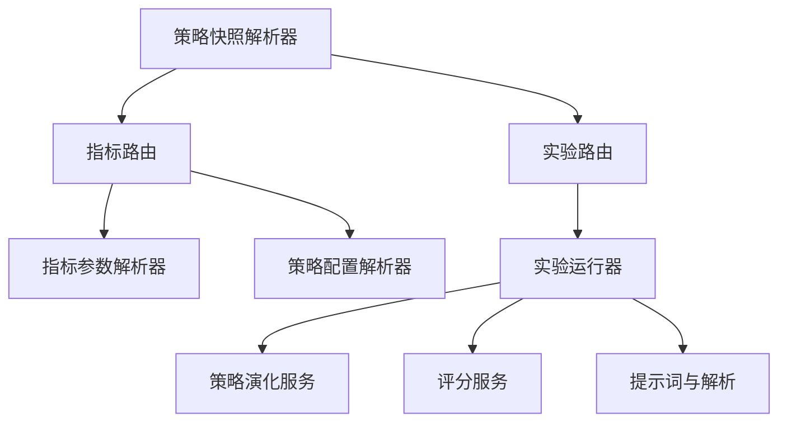

# 策略参数管理

<cite>
**本文档引用的文件**
- [backend_api_python/app/services/indicator_params.py](file://backend_api_python/app/services/indicator_params.py)
- [backend_api_python/app/routes/indicator.py](file://backend_api_python/app/routes/indicator.py)
- [backend_api_python/app/services/strategy_snapshot.py](file://backend_api_python/app/services/strategy_snapshot.py)
- [backend_api_python/app/services/experiment/evolution.py](file://backend_api_python/app/services/experiment/evolution.py)
- [backend_api_python/app/services/experiment/runner.py](file://backend_api_python/app/services/experiment/runner.py)
- [backend_api_python/app/services/experiment/scoring.py](file://backend_api_python/app/services/experiment/scoring.py)
- [backend_api_python/app/services/experiment/prompts.py](file://backend_api_python/app/services/experiment/prompts.py)
- [backend_api_python/app/routes/experiment.py](file://backend_api_python/app/routes/experiment.py)
- [docs/examples/dual_ma_with_params.py](file://docs/examples/dual_ma_with_params.py)
- [docs/examples/multi_indicator_composite.py](file://docs/examples/multi_indicator_composite.py)
</cite>

## 目录
1. [简介](#简介)
2. [项目结构](#项目结构)
3. [核心组件](#核心组件)
4. [架构总览](#架构总览)
5. [详细组件分析](#详细组件分析)
6. [依赖关系分析](#依赖关系分析)
7. [性能考虑](#性能考虑)
8. [故障排除指南](#故障排除指南)
9. [结论](#结论)
10. [附录](#附录)

## 简介
本指南面向策略开发者与量化研究人员，系统讲解 QuantDinger 策略参数管理系统的使用方法，涵盖以下主题：
- 如何定义与管理策略参数：参数类型、默认值、取值范围与校验规则
- 参数在策略代码中的使用方式：@strategy 注解语法与参数传递机制
- 参数优化与调参最佳实践：网格搜索、随机搜索与基于 LLM 的多轮优化
- 参数版本管理与参数快照：如何保存、复用与演进策略配置

## 项目结构
策略参数管理涉及前后端协作与实验管线，关键模块如下：
- 指标参数解析与策略配置解析：负责从代码中提取 @param 与 @strategy 声明，进行类型转换与范围约束
- 策略快照构建：将策略记录与交易配置整合为回测/实盘可执行的快照
- 实验与优化：提供网格/随机搜索、评分与排序、以及基于 LLM 的多轮优化
- 示例策略：展示参数声明与默认策略配置的标准写法

**图表来源**
- [backend_api_python/app/routes/indicator.py:121-124](file://backend_api_python/app/routes/indicator.py#L121-L124)
- [backend_api_python/app/services/indicator_params.py:119-173](file://backend_api_python/app/services/indicator_params.py#L119-L173)
- [backend_api_python/app/services/strategy_snapshot.py:116-220](file://backend_api_python/app/services/strategy_snapshot.py#L116-L220)
- [backend_api_python/app/services/experiment/evolution.py:13-38](file://backend_api_python/app/services/experiment/evolution.py#L13-L38)
- [backend_api_python/app/services/experiment/runner.py:32-47](file://backend_api_python/app/services/experiment/runner.py#L32-L47)
- [backend_api_python/app/services/experiment/scoring.py:10-22](file://backend_api_python/app/services/experiment/scoring.py#L10-L22)
- [backend_api_python/app/services/experiment/prompts.py:67-69](file://backend_api_python/app/services/experiment/prompts.py#L67-L69)
- [docs/examples/dual_ma_with_params.py:20-30](file://docs/examples/dual_ma_with_params.py#L20-L30)
- [docs/examples/multi_indicator_composite.py:16-34](file://docs/examples/multi_indicator_composite.py#L16-L34)

**章节来源**
- [backend_api_python/app/routes/indicator.py:121-124](file://backend_api_python/app/routes/indicator.py#L121-L124)
- [backend_api_python/app/services/indicator_params.py:119-173](file://backend_api_python/app/services/indicator_params.py#L119-L173)
- [backend_api_python/app/services/strategy_snapshot.py:116-220](file://backend_api_python/app/services/strategy_snapshot.py#L116-L220)
- [backend_api_python/app/services/experiment/evolution.py:13-38](file://backend_api_python/app/services/experiment/evolution.py#L13-L38)
- [backend_api_python/app/services/experiment/runner.py:32-47](file://backend_api_python/app/services/experiment/runner.py#L32-L47)
- [backend_api_python/app/services/experiment/scoring.py:10-22](file://backend_api_python/app/services/experiment/scoring.py#L10-L22)
- [backend_api_python/app/services/experiment/prompts.py:67-69](file://backend_api_python/app/services/experiment/prompts.py#L67-L69)
- [docs/examples/dual_ma_with_params.py:20-30](file://docs/examples/dual_ma_with_params.py#L20-L30)
- [docs/examples/multi_indicator_composite.py:16-34](file://docs/examples/multi_indicator_composite.py#L16-L34)

## 核心组件
- 指标参数解析器（IndicatorParamsParser）
  - 功能：解析代码中的 @param 声明，提取参数名、类型、默认值与描述；合并用户传入的参数值
  - 关键点：支持 int、float、bool、str 类型；默认值按类型转换；未声明的参数不会被注入
- 策略配置解析器（StrategyConfigParser）
  - 功能：解析代码中的 @strategy 注解，提取风控与仓位等策略默认配置
  - 关键点：内置有效键集合与取值范围；对非法值进行裁剪与类型转换
- 策略快照解析器（StrategySnapshotResolver）
  - 功能：将策略记录与交易配置整合为回测/实盘可执行的快照，统一字段命名与单位换算
- 实验与优化服务
  - 策略演化服务：基于参数空间生成网格/随机变体
  - 实验运行器：组织多轮 LLM 优化、批量回测、评分与排序
  - 评分服务：将回测结果映射为可比较的综合分数
  - 提示词与解析：构建 LLM 任务提示，解析候选参数集

**章节来源**
- [backend_api_python/app/services/indicator_params.py:119-173](file://backend_api_python/app/services/indicator_params.py#L119-L173)
- [backend_api_python/app/services/indicator_params.py:26-117](file://backend_api_python/app/services/indicator_params.py#L26-L117)
- [backend_api_python/app/services/strategy_snapshot.py:52-101](file://backend_api_python/app/services/strategy_snapshot.py#L52-L101)
- [backend_api_python/app/services/experiment/evolution.py:13-38](file://backend_api_python/app/services/experiment/evolution.py#L13-L38)
- [backend_api_python/app/services/experiment/runner.py:32-47](file://backend_api_python/app/services/experiment/runner.py#L32-L47)
- [backend_api_python/app/services/experiment/scoring.py:10-22](file://backend_api_python/app/services/experiment/scoring.py#L10-L22)
- [backend_api_python/app/services/experiment/prompts.py:67-69](file://backend_api_python/app/services/experiment/prompts.py#L67-L69)

## 架构总览
下图展示了从策略代码到参数解析、快照构建与实验优化的整体流程。

**图表来源**
- [backend_api_python/app/routes/indicator.py:673-715](file://backend_api_python/app/routes/indicator.py#L673-L715)
- [backend_api_python/app/services/indicator_params.py:119-173](file://backend_api_python/app/services/indicator_params.py#L119-L173)
- [backend_api_python/app/services/strategy_snapshot.py:116-220](file://backend_api_python/app/services/strategy_snapshot.py#L116-L220)
- [backend_api_python/app/services/experiment/runner.py:388-549](file://backend_api_python/app/services/experiment/runner.py#L388-L549)
- [backend_api_python/app/services/experiment/evolution.py:16-38](file://backend_api_python/app/services/experiment/evolution.py#L16-L38)
- [backend_api_python/app/services/experiment/scoring.py:23-75](file://backend_api_python/app/services/experiment/scoring.py#L23-L75)

## 详细组件分析

### 指标参数解析器（IndicatorParamsParser）
- 参数声明格式
  - 通过 @param 声明参数：名称、类型、默认值、描述
  - 支持类型：int、float、bool、str（string 会被规范化为 str）
- 参数合并策略
  - 若用户提供参数值，则按声明类型转换并覆盖默认值
  - 若未提供，则使用默认值
- 与策略代码的关系
  - @param 仅声明参数，不自动创建变量；必须通过 params.get(...) 显式读取

**图表来源**
- [backend_api_python/app/services/indicator_params.py:128-216](file://backend_api_python/app/services/indicator_params.py#L128-L216)

**章节来源**
- [backend_api_python/app/services/indicator_params.py:119-173](file://backend_api_python/app/services/indicator_params.py#L119-L173)
- [backend_api_python/app/routes/indicator.py:813-848](file://backend_api_python/app/routes/indicator.py#L813-L848)

### 策略配置解析器（StrategyConfigParser）
- @strategy 注解支持的键
  - stopLossPct、takeProfitPct：浮点数，范围受控
  - entryPct：浮点数，范围受控（通常为 0.01–1.0）
  - trailingEnabled：布尔
  - trailingStopPct、trailingActivationPct：浮点数，范围受控
  - tradeDirection：枚举，允许 long、short、both
- 解析与转换
  - 严格类型转换与边界裁剪
  - 非法枚举值会回退到允许集合的第一个元素
- 生成注解
  - 可根据配置字典生成 @strategy 注解文本，便于 AI 自动生成

**图表来源**
- [backend_api_python/app/services/indicator_params.py:57-117](file://backend_api_python/app/services/indicator_params.py#L57-L117)

**章节来源**
- [backend_api_python/app/services/indicator_params.py:26-117](file://backend_api_python/app/services/indicator_params.py#L26-L117)
- [backend_api_python/app/routes/indicator.py:826-848](file://backend_api_python/app/routes/indicator.py#L826-L848)

### 策略快照解析器（StrategySnapshotResolver）
- 职责
  - 将策略记录与交易配置（如杠杆、手续费、滑点、风控等）统一转换为回测/实盘可执行的快照
  - 负责百分比到比率的换算、布尔值解析、嵌套字段的标准化
- 关键字段
  - 市场、符号、时间框架、初始资金、杠杆、手续费、滑点、交易方向
  - 策略配置（风控、仓位、加仓/减仓策略、执行信号时机）

**图表来源**
- [backend_api_python/app/services/strategy_snapshot.py:7-220](file://backend_api_python/app/services/strategy_snapshot.py#L7-L220)

**章节来源**
- [backend_api_python/app/services/strategy_snapshot.py:52-101](file://backend_api_python/app/services/strategy_snapshot.py#L52-L101)
- [backend_api_python/app/services/strategy_snapshot.py:116-220](file://backend_api_python/app/services/strategy_snapshot.py#L116-L220)

### 实验与优化组件
- 策略演化服务（StrategyEvolutionService）
  - 支持网格搜索与随机搜索
  - 支持区间型参数（min/max/step）与离散列表
  - 支持路径式键（如 strategy_config.xxx）的嵌套覆盖
- 实验运行器（ExperimentRunnerService）
  - 多轮 LLM 优化：构建提示词、调用 LLM、解析候选、批量回测、评分与排序
  - 结构化调参：无需 LLM，直接在 parameterSpace 上进行网格/随机搜索
  - 保存最优策略：将最佳候选保存为策略记录
- 评分服务（StrategyScoringService）
  - 综合 return、annual_return、sharpe、profit_factor、win_rate、drawdown、stability 等指标
  - 可结合市场制度（regime）调整权重
- 提示词与解析（prompts.py）
  - 从 @param 注解抽取可调参数清单
  - 格式化市场制度与历史结果，指导 LLM 生成候选

**图表来源**
- [backend_api_python/app/services/experiment/runner.py:52-200](file://backend_api_python/app/services/experiment/runner.py#L52-L200)
- [backend_api_python/app/services/experiment/evolution.py:16-38](file://backend_api_python/app/services/experiment/evolution.py#L16-L38)
- [backend_api_python/app/services/experiment/scoring.py:23-75](file://backend_api_python/app/services/experiment/scoring.py#L23-L75)
- [backend_api_python/app/services/experiment/prompts.py:120-149](file://backend_api_python/app/services/experiment/prompts.py#L120-L149)

**章节来源**
- [backend_api_python/app/services/experiment/evolution.py:13-123](file://backend_api_python/app/services/experiment/evolution.py#L13-L123)
- [backend_api_python/app/services/experiment/runner.py:388-549](file://backend_api_python/app/services/experiment/runner.py#L388-L549)
- [backend_api_python/app/services/experiment/scoring.py:10-140](file://backend_api_python/app/services/experiment/scoring.py#L10-L140)
- [backend_api_python/app/services/experiment/prompts.py:67-200](file://backend_api_python/app/services/experiment/prompts.py#L67-L200)
- [backend_api_python/app/routes/experiment.py:137-159](file://backend_api_python/app/routes/experiment.py#L137-L159)

## 依赖关系分析
- 指标路由依赖参数解析器进行代码校验与参数提取
- 策略快照解析器在回测前统一配置，确保字段一致性
- 实验运行器串联演化服务、评分服务与提示词模块
- 示例策略展示了参数声明与默认策略配置的规范写法

**图表来源**
- [backend_api_python/app/routes/indicator.py:673-715](file://backend_api_python/app/routes/indicator.py#L673-L715)
- [backend_api_python/app/services/indicator_params.py:119-173](file://backend_api_python/app/services/indicator_params.py#L119-L173)
- [backend_api_python/app/services/strategy_snapshot.py:116-220](file://backend_api_python/app/services/strategy_snapshot.py#L116-L220)
- [backend_api_python/app/routes/experiment.py:137-159](file://backend_api_python/app/routes/experiment.py#L137-L159)
- [backend_api_python/app/services/experiment/runner.py:32-47](file://backend_api_python/app/services/experiment/runner.py#L32-L47)
- [backend_api_python/app/services/experiment/evolution.py:13-38](file://backend_api_python/app/services/experiment/evolution.py#L13-L38)
- [backend_api_python/app/services/experiment/scoring.py:10-22](file://backend_api_python/app/services/experiment/scoring.py#L10-L22)
- [backend_api_python/app/services/experiment/prompts.py:67-69](file://backend_api_python/app/services/experiment/prompts.py#L67-L69)

**章节来源**
- [backend_api_python/app/routes/indicator.py:673-715](file://backend_api_python/app/routes/indicator.py#L673-L715)
- [backend_api_python/app/services/strategy_snapshot.py:116-220](file://backend_api_python/app/services/strategy_snapshot.py#L116-L220)
- [backend_api_python/app/routes/experiment.py:137-159](file://backend_api_python/app/routes/experiment.py#L137-L159)

## 性能考虑
- 参数解析与快照构建均为内存操作，复杂度主要取决于策略代码长度与参数数量
- 网格搜索在高维参数空间下呈指数增长，建议优先使用随机搜索或分层探索
- 回测批处理时注意并发与资源限制，合理设置候选上限与回测时间窗口
- 评分与排序为 O(N log N)，其中 N 为候选数量

## 故障排除指南
- 代码校验失败
  - 缺少 output 字典、输出结构不符合要求、信号列长度不匹配等
  - 参考指标路由中的校验逻辑定位问题
- 参数未生效
  - 仅声明了 @param，未通过 params.get(...) 读取
  - @strategy 中出现未知键或超出范围的值
- 回测异常
  - 快照字段缺失或类型不匹配，检查策略快照解析器的字段映射
- 优化无结果
  - LLM 未返回有效 JSON，检查提示词构造与解析逻辑
  - 候选集为空或重复，检查参数空间与去重逻辑

**章节来源**
- [backend_api_python/app/routes/indicator.py:126-277](file://backend_api_python/app/routes/indicator.py#L126-L277)
- [backend_api_python/app/services/strategy_snapshot.py:134-172](file://backend_api_python/app/services/strategy_snapshot.py#L134-L172)
- [backend_api_python/app/services/experiment/prompts.py:152-186](file://backend_api_python/app/services/experiment/prompts.py#L152-L186)

## 结论
QuantDinger 的策略参数管理系统通过明确的注解语法与严格的解析流程，实现了参数声明、类型转换、范围控制与回测集成的一体化。配合网格/随机搜索与 LLM 多轮优化，用户可以高效地完成参数调优与策略迭代。建议在实际使用中遵循参数声明与默认策略配置的最佳实践，并结合评分体系与快照机制进行版本管理与复现。

## 附录

### 参数类型与取值范围速查
- 指标参数（@param）
  - 类型：int、float、bool、str
  - 默认值：按声明的字符串值转换为对应类型
- 策略参数（@strategy）
  - stopLossPct、takeProfitPct：浮点数，受控范围
  - entryPct：浮点数，受控范围（通常 0.01–1.0）
  - trailingEnabled：布尔
  - trailingStopPct、trailingActivationPct：浮点数，受控范围
  - tradeDirection：枚举，允许 long、short、both

**章节来源**
- [backend_api_python/app/services/indicator_params.py:47-55](file://backend_api_python/app/services/indicator_params.py#L47-L55)
- [backend_api_python/app/routes/indicator.py:832-838](file://backend_api_python/app/routes/indicator.py#L832-L838)

### 策略代码中的参数使用方式
- 读取参数
  - 通过 params.get(...) 从声明的参数中读取，避免直接使用未赋值的变量名
- 默认策略配置
  - 在策略代码中使用 @strategy 注解声明默认风控与仓位参数
- 示例参考
  - 双均线策略与多指标组合策略展示了参数声明与默认策略配置的写法

**章节来源**
- [backend_api_python/app/routes/indicator.py:813-848](file://backend_api_python/app/routes/indicator.py#L813-L848)
- [docs/examples/dual_ma_with_params.py:20-30](file://docs/examples/dual_ma_with_params.py#L20-L30)
- [docs/examples/multi_indicator_composite.py:16-34](file://docs/examples/multi_indicator_composite.py#L16-L34)

### 参数优化与调参最佳实践
- 网格搜索
  - 适用于低维参数空间；需谨慎设置步长与上限，避免组合爆炸
- 随机搜索
  - 更适合高维空间；可结合历史结果进行自适应采样
- LLM 多轮优化
  - 利用历史结果指导后续轮次，逐步收敛到更优区域
- 评分与排序
  - 使用综合评分体系评估候选，结合市场制度选择合适权重

**章节来源**
- [backend_api_python/app/services/experiment/evolution.py:16-38](file://backend_api_python/app/services/experiment/evolution.py#L16-L38)
- [backend_api_python/app/services/experiment/runner.py:52-200](file://backend_api_python/app/services/experiment/runner.py#L52-L200)
- [backend_api_python/app/services/experiment/scoring.py:10-75](file://backend_api_python/app/services/experiment/scoring.py#L10-L75)
- [backend_api_python/app/services/experiment/prompts.py:120-149](file://backend_api_python/app/services/experiment/prompts.py#L120-L149)

### 参数版本管理与参数快照
- 参数快照
  - 将策略配置、交易参数与回测所需字段统一打包，便于复用与对比
- 版本管理
  - 通过实验运行器保存最优候选为策略记录，形成可追溯的版本链路
- 路径式覆盖
  - 支持 strategy_config.xxx 等路径式键进行嵌套覆盖，提升灵活性

**章节来源**
- [backend_api_python/app/services/strategy_snapshot.py:173-219](file://backend_api_python/app/services/strategy_snapshot.py#L173-L219)
- [backend_api_python/app/services/experiment/evolution.py:110-123](file://backend_api_python/app/services/experiment/evolution.py#L110-L123)
- [backend_api_python/app/routes/experiment.py:161-189](file://backend_api_python/app/routes/experiment.py#L161-L189)