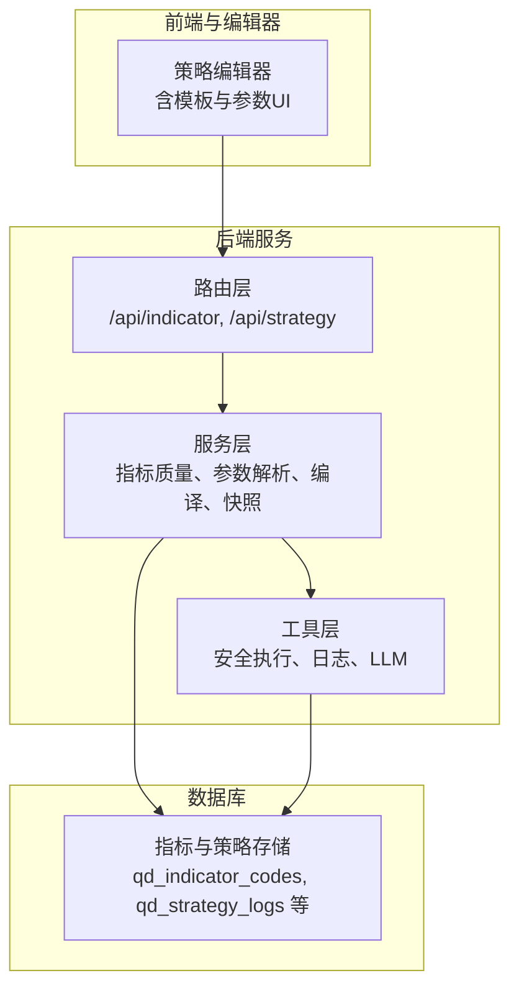
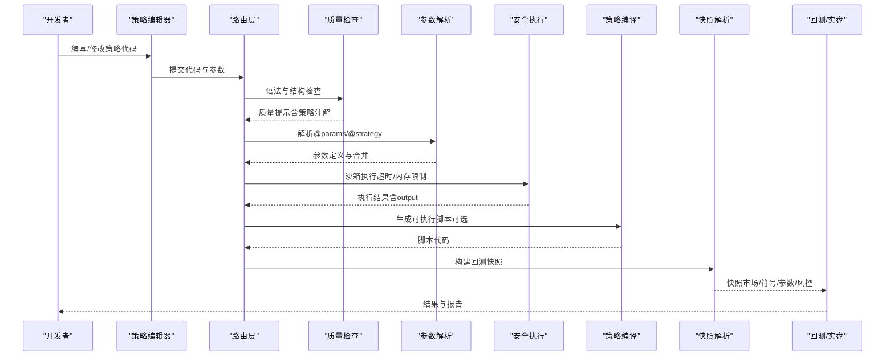
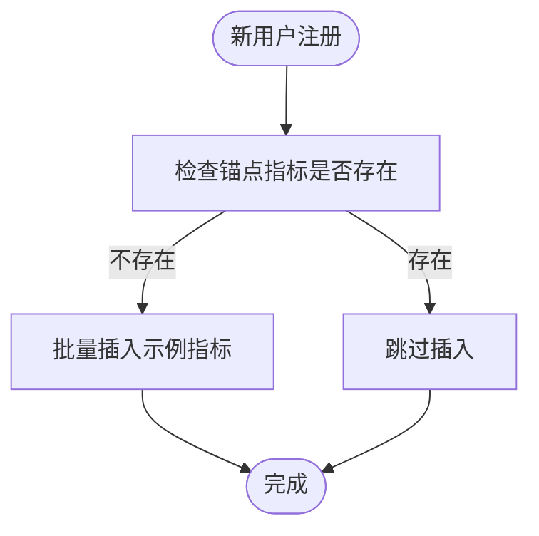
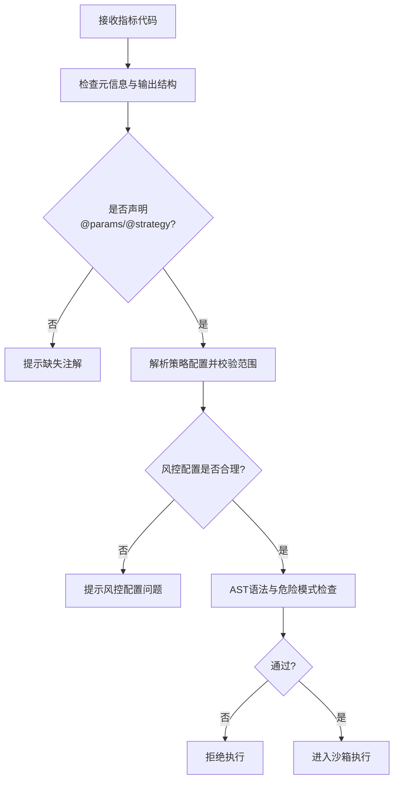
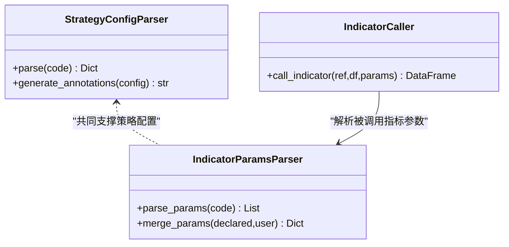
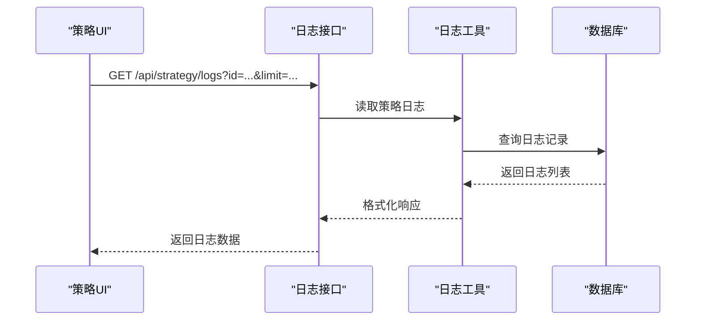
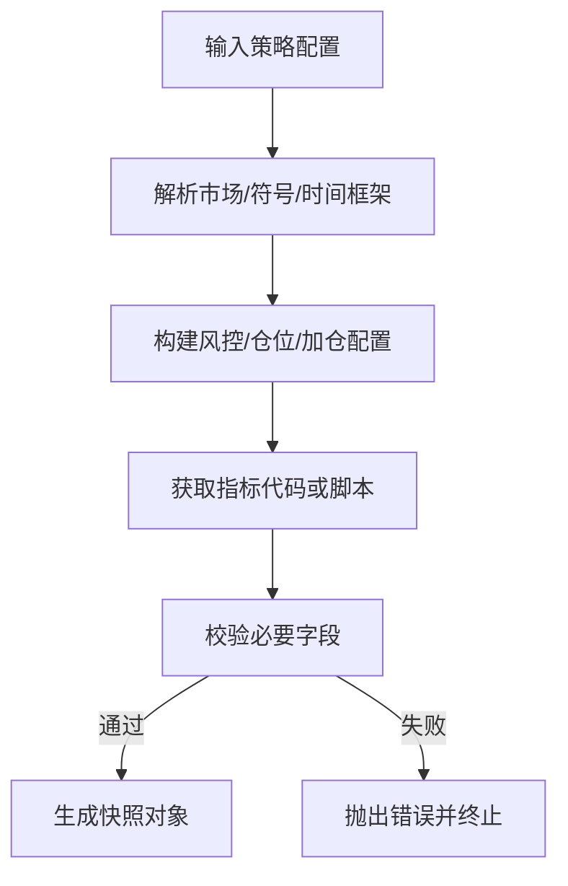
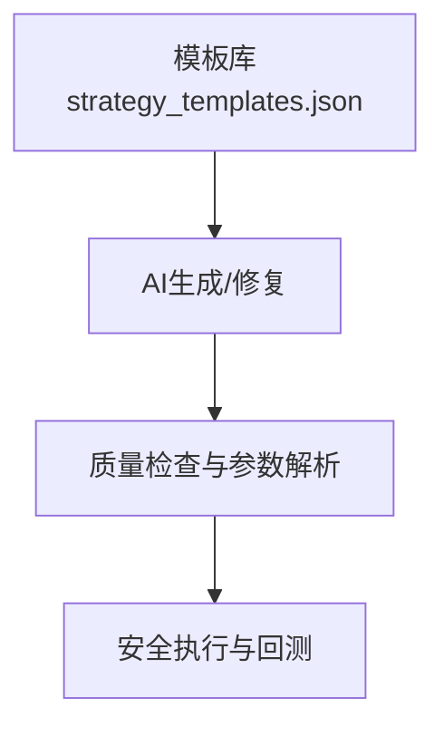

# 策略编辑器与开发工具

<cite>
**本文引用的文件**
- [STRATEGY_DEV_GUIDE_CN.md](file://docs/STRATEGY_DEV_GUIDE_CN.md)
- [builtin_indicators.py](file://backend_api_python/app/services/builtin_indicators.py)
- [indicator_code_quality.py](file://backend_api_python/app/services/indicator_code_quality.py)
- [indicator_params.py](file://backend_api_python/app/services/indicator_params.py)
- [indicator.py](file://backend_api_python/app/routes/indicator.py)
- [safe_exec.py](file://backend_api_python/app/utils/safe_exec.py)
- [strategy_compiler.py](file://backend_api_python/app/services/strategy_compiler.py)
- [strategy_snapshot.py](file://backend_api_python/app/services/strategy_snapshot.py)
- [strategy_runtime_logs.py](file://backend_api_python/app/utils/strategy_runtime_logs.py)
- [strategy.py](file://backend_api_python/app/routes/strategy.py)
- [cross_sectional_momentum_rsi.py](file://docs/examples/cross_sectional_momentum_rsi.py)
- [dual_ma_with_params.py](file://docs/examples/dual_ma_with_params.py)
- [multi_indicator_composite.py](file://docs/examples/multi_indicator_composite.py)
- [strategy_templates.json](file://backend_api_python/app/data/strategy_templates.json)
- [fast_analysis.py](file://backend_api_python/app/routes/fast_analysis.py)
- [analysis_memory.py](file://backend_api_python/app/services/analysis_memory.py)
</cite>

## 目录
1. [简介](#简介)
2. [项目结构](#项目结构)
3. [核心组件](#核心组件)
4. [架构总览](#架构总览)
5. [详细组件分析](#详细组件分析)
6. [依赖分析](#依赖分析)
7. [性能考虑](#性能考虑)
8. [故障排查指南](#故障排查指南)
9. [结论](#结论)
10. [附录](#附录)

## 简介
本指南面向策略开发者，系统讲解策略编辑器与开发工具的使用方法，涵盖以下主题：
- 内置指标库：技术指标、统计函数与数学运算符的使用与扩展
- 代码质量检查：语法检查、安全扫描与策略配置校验
- 策略参数管理：参数声明、合并与可视化
- 策略调试工具：日志记录、断点调试与性能监控
- 代码模板与快捷键：模板库、参数调整与开发效率提升
- 策略版本管理与快照：从策略到可回测快照的转换流程

## 项目结构
策略编辑器与开发工具主要由后端服务、路由与工具模块构成，围绕“指标代码质量检查—参数解析—安全执行—策略编译—回测/实盘”闭环展开。

**图表来源**
- [indicator.py](file://backend_api_python/app/routes/indicator.py)
- [strategy.py](file://backend_api_python/app/routes/strategy.py)
- [builtin_indicators.py](file://backend_api_python/app/services/builtin_indicators.py)
- [indicator_params.py](file://backend_api_python/app/services/indicator_params.py)
- [safe_exec.py](file://backend_api_python/app/utils/safe_exec.py)
- [strategy_compiler.py](file://backend_api_python/app/services/strategy_compiler.py)
- [strategy_snapshot.py](file://backend_api_python/app/services/strategy_snapshot.py)
- [strategy_runtime_logs.py](file://backend_api_python/app/utils/strategy_runtime_logs.py)

**章节来源**
- [indicator.py](file://backend_api_python/app/routes/indicator.py)
- [strategy.py](file://backend_api_python/app/routes/strategy.py)

## 核心组件
- 内置指标库：提供示例指标（如 RSI、双均线、MACD、布林带）以帮助快速上手与验证策略逻辑
- 代码质量检查：通过启发式规则与AST静态分析，给出缺失项、参数使用、策略配置合理性等提示
- 策略参数管理：解析指标代码中的参数与策略注解，支持参数合并与可视化
- 安全执行：严格白名单、超时与内存限制，保障沙箱执行安全
- 策略编译：将配置转化为可回测/可执行的脚本
- 快照解析：将策略配置转换为回测所需的标准化快照
- 调试与日志：持久化运行日志，便于定位问题
- 模板与AI：策略模板库与AI辅助生成/修复

**章节来源**
- [builtin_indicators.py](file://backend_api_python/app/services/builtin_indicators.py)
- [indicator_code_quality.py](file://backend_api_python/app/services/indicator_code_quality.py)
- [indicator_params.py](file://backend_api_python/app/services/indicator_params.py)
- [safe_exec.py](file://backend_api_python/app/utils/safe_exec.py)
- [strategy_compiler.py](file://backend_api_python/app/services/strategy_compiler.py)
- [strategy_snapshot.py](file://backend_api_python/app/services/strategy_snapshot.py)
- [strategy_runtime_logs.py](file://backend_api_python/app/utils/strategy_runtime_logs.py)
- [strategy_templates.json](file://backend_api_python/app/data/strategy_templates.json)

## 架构总览
策略从“编写—校验—执行—调试—回测/实盘”的整体流程如下：

**图表来源**
- [indicator.py](file://backend_api_python/app/routes/indicator.py)
- [indicator_code_quality.py](file://backend_api_python/app/services/indicator_code_quality.py)
- [indicator_params.py](file://backend_api_python/app/services/indicator_params.py)
- [safe_exec.py](file://backend_api_python/app/utils/safe_exec.py)
- [strategy_compiler.py](file://backend_api_python/app/services/strategy_compiler.py)
- [strategy_snapshot.py](file://backend_api_python/app/services/strategy_snapshot.py)

## 详细组件分析

### 内置指标库
- 作用：为新用户提供示例指标，覆盖经典技术形态（RSI、双均线、MACD、布林带），便于快速验证与学习
- 特性：幂等注册（以锚点名称避免重复插入）、字段包含名称、描述与代码
- 使用建议：基于示例指标快速搭建原型，再逐步替换为自定义逻辑

**图表来源**
- [builtin_indicators.py](file://backend_api_python/app/services/builtin_indicators.py)

**章节来源**
- [builtin_indicators.py](file://backend_api_python/app/services/builtin_indicators.py)

### 代码质量检查机制
- 静态检查：通过启发式规则与AST双重校验，识别缺失元信息、参数未使用、策略注解未知键、图表输出为空等问题
- 策略配置校验：对@strategy注解进行解析与范围校验，提示风控配置缺失或不合理
- 与安全执行联动：先静态检查，再进入沙箱执行，确保安全与可诊断性

**图表来源**
- [indicator_code_quality.py](file://backend_api_python/app/services/indicator_code_quality.py)
- [safe_exec.py](file://backend_api_python/app/utils/safe_exec.py)

**章节来源**
- [indicator_code_quality.py](file://backend_api_python/app/services/indicator_code_quality.py)
- [safe_exec.py](file://backend_api_python/app/utils/safe_exec.py)

### 策略参数管理系统
- 参数声明：支持在代码中通过注解声明参数（类型、默认值、描述），并解析为前端可编辑的参数定义
- 策略注解：支持@strategy声明风控与交易方向等策略配置，解析为结构化配置
- 参数合并：将声明参数与用户传参合并，保证默认值与类型一致性
- 指标调用：支持在一个指标中调用另一个指标，具备调用深度与循环依赖保护

**图表来源**
- [indicator_params.py](file://backend_api_python/app/services/indicator_params.py)

**章节来源**
- [indicator_params.py](file://backend_api_python/app/services/indicator_params.py)

### 策略调试工具
- 运行日志：将策略运行期间的日志持久化至数据库，便于查看与定位问题
- 路由接口：提供获取策略日志的接口，支持按策略ID与数量限制拉取
- 性能监控：通过回测接口聚合收益曲线与关键指标，辅助评估策略表现

**图表来源**
- [strategy_runtime_logs.py](file://backend_api_python/app/utils/strategy_runtime_logs.py)
- [strategy.py](file://backend_api_python/app/routes/strategy.py)

**章节来源**
- [strategy_runtime_logs.py](file://backend_api_python/app/utils/strategy_runtime_logs.py)
- [strategy.py](file://backend_api_python/app/routes/strategy.py)

### 策略版本管理与快照
- 快照构建：将策略配置、市场参数、风控与指标参数统一转换为回测/实盘可用的快照
- 默认值与兼容：对缺失字段提供合理默认值（如佣金、滑点、杠杆），并兼容脚本策略与指标策略
- 错误处理：对必需字段缺失与不支持类型进行显式报错

**图表来源**
- [strategy_snapshot.py](file://backend_api_python/app/services/strategy_snapshot.py)

**章节来源**
- [strategy_snapshot.py](file://backend_api_python/app/services/strategy_snapshot.py)

### 代码模板与快捷键
- 模板库：提供多种策略模板（均线交叉、RSI、布林带、MACD、网格、动量轮动等），包含默认参数与难度标签
- AI辅助：支持基于提示词生成策略代码，并自动修复常见问题
- 快捷键：编辑器内常用快捷键（如格式化、注释/取消注释、查找替换）可显著提升效率

**图表来源**
- [strategy_templates.json](file://backend_api_python/app/data/strategy_templates.json)
- [strategy.py](file://backend_api_python/app/routes/strategy.py)

**章节来源**
- [strategy_templates.json](file://backend_api_python/app/data/strategy_templates.json)
- [strategy.py](file://backend_api_python/app/routes/strategy.py)

### 示例与最佳实践
- 截面策略示例：演示多标的评分与排序思路，强调当前平台对跨段策略的限制
- 双均线参数示例：展示参数声明与策略注解的标准写法
- 多指标组合示例：演示如何组合均线、RSI、MACD与成交量过滤，形成稳定边缘触发信号

**章节来源**
- [cross_sectional_momentum_rsi.py](file://docs/examples/cross_sectional_momentum_rsi.py)
- [dual_ma_with_params.py](file://docs/examples/dual_ma_with_params.py)
- [multi_indicator_composite.py](file://docs/examples/multi_indicator_composite.py)

## 依赖分析
- 路由层依赖服务层与工具层，负责对外暴露接口
- 服务层内部模块相互协作：参数解析与质量检查并行，安全执行贯穿始终
- 数据库作为持久化层，承载指标、策略与日志数据

**图表来源**
- [indicator.py](file://backend_api_python/app/routes/indicator.py)
- [strategy.py](file://backend_api_python/app/routes/strategy.py)
- [indicator_params.py](file://backend_api_python/app/services/indicator_params.py)
- [safe_exec.py](file://backend_api_python/app/utils/safe_exec.py)
- [strategy_runtime_logs.py](file://backend_api_python/app/utils/strategy_runtime_logs.py)

**章节来源**
- [indicator.py](file://backend_api_python/app/routes/indicator.py)
- [strategy.py](file://backend_api_python/app/routes/strategy.py)

## 性能考虑
- 沙箱执行：通过超时与内存限制避免长时间或高内存占用的指标导致系统阻塞
- AST静态检查：在执行前进行语法与危险模式检查，降低运行期失败概率
- 快照构建：对默认值与类型进行预处理，减少回测阶段的异常分支
- 日志持久化：采用轻量级写入策略，避免阻塞主流程

[本节为通用指导，无需列出具体文件来源]

## 故障排查指南
- 代码质量提示：关注缺失元信息、参数未使用、策略注解未知键、风控配置缺失等提示，逐一修正
- 安全执行失败：检查是否包含危险导入/调用、是否超出超时或内存限制
- 日志查询：通过策略日志接口获取最近运行日志，定位异常发生点
- 回测失败：确认快照中的市场/符号/时间框架/风控参数是否齐全与合理

**章节来源**
- [indicator_code_quality.py](file://backend_api_python/app/services/indicator_code_quality.py)
- [safe_exec.py](file://backend_api_python/app/utils/safe_exec.py)
- [strategy_runtime_logs.py](file://backend_api_python/app/utils/strategy_runtime_logs.py)
- [strategy.py](file://backend_api_python/app/routes/strategy.py)

## 结论
通过内置指标库、参数管理、代码质量检查与安全执行机制，策略编辑器与开发工具形成了从“编写—校验—调试—回测/实盘”的完整闭环。配合模板与AI能力，开发者可以高效地验证与迭代策略，同时确保安全性与可维护性。

[本节为总结性内容，无需列出具体文件来源]

## 附录
- 快速上手步骤
  1) 选择模板或从内置指标库复制示例
  2) 在指标代码中声明参数与策略注解
  3) 提交代码，查看质量检查提示并修复
  4) 在沙箱环境中验证输出与图表
  5) 生成快照并进行回测/实盘
  6) 使用日志与性能接口持续优化

- 常见问题
  - 为什么我的参数没有生效？检查是否通过params读取并合并
  - 为什么执行被拒绝？检查是否有危险导入/调用或语法错误
  - 如何查看策略运行日志？使用策略日志接口按ID与数量限制拉取

[本节为补充说明，无需列出具体文件来源]