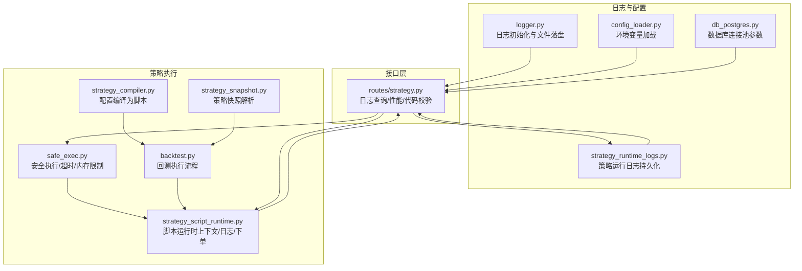
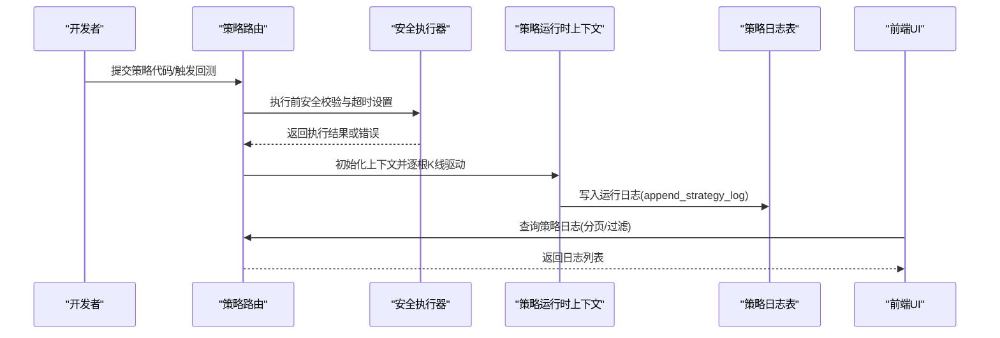
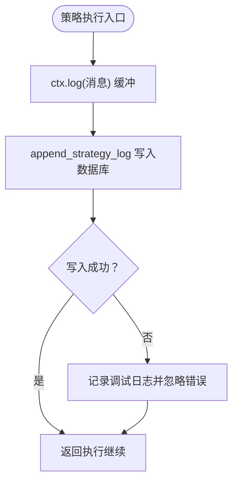
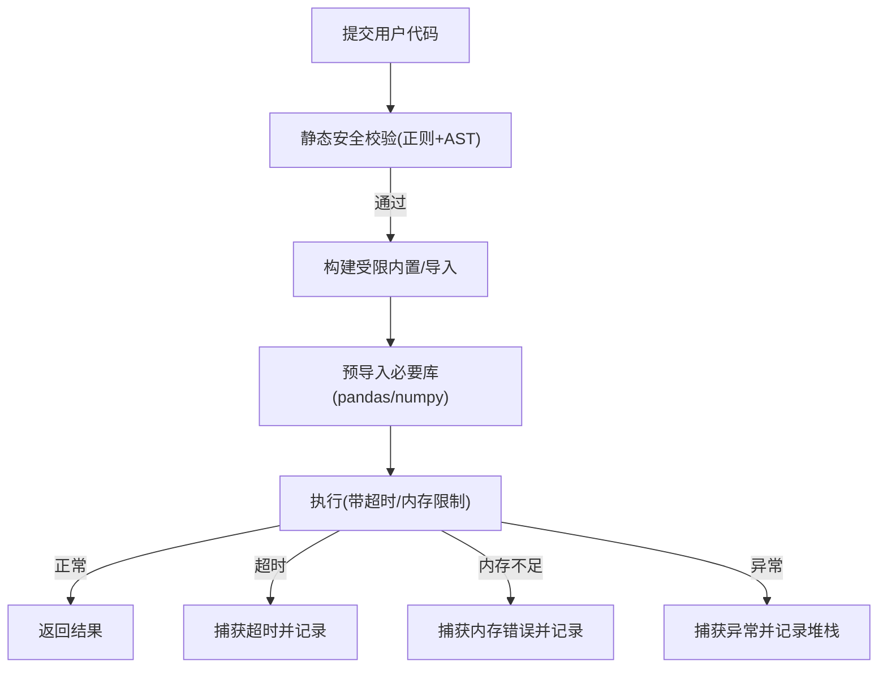
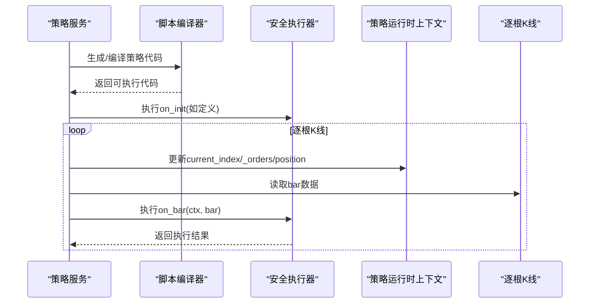
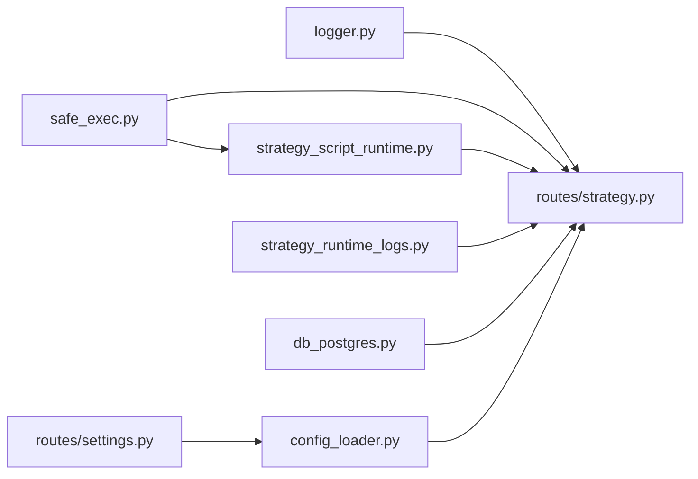

# 调试工具

<cite>
**本文引用的文件**
- [backend_api_python/app/utils/logger.py](file://backend_api_python/app/utils/logger.py)
- [backend_api_python/app/utils/strategy_runtime_logs.py](file://backend_api_python/app/utils/strategy_runtime_logs.py)
- [backend_api_python/app/services/strategy_script_runtime.py](file://backend_api_python/app/services/strategy_script_runtime.py)
- [backend_api_python/app/utils/safe_exec.py](file://backend_api_python/app/utils/safe_exec.py)
- [backend_api_python/app/routes/strategy.py](file://backend_api_python/app/routes/strategy.py)
- [backend_api_python/app/services/backtest.py](file://backend_api_python/app/services/backtest.py)
- [backend_api_python/app/services/strategy_compiler.py](file://backend_api_python/app/services/strategy_compiler.py)
- [backend_api_python/app/services/strategy_snapshot.py](file://backend_api_python/app/services/strategy_snapshot.py)
- [backend_api_python/app/utils/db_postgres.py](file://backend_api_python/app/utils/db_postgres.py)
- [backend_api_python/app/utils/config_loader.py](file://backend_api_python/app/utils/config_loader.py)
- [backend_api_python/app/routes/settings.py](file://backend_api_python/app/routes/settings.py)
</cite>

## 目录
1. [简介](#简介)
2. [项目结构](#项目结构)
3. [核心组件](#核心组件)
4. [架构总览](#架构总览)
5. [详细组件分析](#详细组件分析)
6. [依赖分析](#依赖分析)
7. [性能考虑](#性能考虑)
8. [故障排查指南](#故障排查指南)
9. [结论](#结论)
10. [附录](#附录)

## 简介
本指南面向策略开发者与运维人员，系统讲解如何在系统中进行策略调试。内容覆盖：
- 使用运行时日志追踪策略执行过程，包括关键变量监控与异常诊断
- 利用断点调试与安全执行机制定位问题
- 借助性能指标与回测/实盘运行时上下文进行优化
- 配置与使用技巧：条件断点、变量监视、调用栈分析、超时与资源限制
- 通过调试工具修复常见 bug 并提升策略稳定性与性能

## 项目结构
围绕“策略调试”的关键模块分布如下：
- 日志与运行时日志：统一日志配置与策略运行日志持久化
- 策略运行时：脚本策略的上下文、订单与日志收集
- 安全执行：超时、内存限制、白名单导入与沙箱执行
- 路由与服务：策略日志查询、性能指标、回测与编译器
- 数据库与配置：连接池、环境变量加载与运行时刷新

**图表来源**
- [backend_api_python/app/utils/logger.py:1-63](file://backend_api_python/app/utils/logger.py#L1-L63)
- [backend_api_python/app/utils/strategy_runtime_logs.py:1-30](file://backend_api_python/app/utils/strategy_runtime_logs.py#L1-L30)
- [backend_api_python/app/services/strategy_script_runtime.py:1-191](file://backend_api_python/app/services/strategy_script_runtime.py#L1-L191)
- [backend_api_python/app/utils/safe_exec.py:1-471](file://backend_api_python/app/utils/safe_exec.py#L1-L471)
- [backend_api_python/app/services/backtest.py:2191-2226](file://backend_api_python/app/services/backtest.py#L2191-L2226)
- [backend_api_python/app/services/strategy_compiler.py:1-689](file://backend_api_python/app/services/strategy_compiler.py#L1-L689)
- [backend_api_python/app/services/strategy_snapshot.py:1-220](file://backend_api_python/app/services/strategy_snapshot.py#L1-L220)
- [backend_api_python/app/utils/db_postgres.py:40-89](file://backend_api_python/app/utils/db_postgres.py#L40-L89)
- [backend_api_python/app/utils/config_loader.py:1-82](file://backend_api_python/app/utils/config_loader.py#L1-L82)
- [backend_api_python/app/routes/strategy.py:1960-2014](file://backend_api_python/app/routes/strategy.py#L1960-L2014)

**章节来源**
- [backend_api_python/app/utils/logger.py:1-63](file://backend_api_python/app/utils/logger.py#L1-L63)
- [backend_api_python/app/utils/strategy_runtime_logs.py:1-30](file://backend_api_python/app/utils/strategy_runtime_logs.py#L1-L30)
- [backend_api_python/app/services/strategy_script_runtime.py:1-191](file://backend_api_python/app/services/strategy_script_runtime.py#L1-L191)
- [backend_api_python/app/utils/safe_exec.py:1-471](file://backend_api_python/app/utils/safe_exec.py#L1-L471)
- [backend_api_python/app/routes/strategy.py:1960-2014](file://backend_api_python/app/routes/strategy.py#L1960-L2014)

## 核心组件
- 统一日志系统：本地开发友好，支持文件滚动与过滤噪声日志
- 策略运行日志：将策略运行期消息持久化至数据库表，供前端 UI 实时查看
- 策略运行时上下文：提供参数、历史K线、下单指令与日志缓冲
- 安全执行器：限制超时、内存、导入模块与危险符号，保障沙箱执行
- 回测与编译：将配置转为脚本并逐根K线驱动策略执行
- 性能与日志接口：提供策略日志查询与性能指标聚合

**章节来源**
- [backend_api_python/app/utils/logger.py:1-63](file://backend_api_python/app/utils/logger.py#L1-L63)
- [backend_api_python/app/utils/strategy_runtime_logs.py:1-30](file://backend_api_python/app/utils/strategy_runtime_logs.py#L1-L30)
- [backend_api_python/app/services/strategy_script_runtime.py:114-191](file://backend_api_python/app/services/strategy_script_runtime.py#L114-L191)
- [backend_api_python/app/utils/safe_exec.py:157-243](file://backend_api_python/app/utils/safe_exec.py#L157-L243)
- [backend_api_python/app/services/backtest.py:2191-2226](file://backend_api_python/app/services/backtest.py#L2191-L2226)
- [backend_api_python/app/routes/strategy.py:1960-2014](file://backend_api_python/app/routes/strategy.py#L1960-L2014)

## 架构总览
策略调试贯穿“日志采集—安全执行—持久化—查询展示”链路。

**图表来源**
- [backend_api_python/app/utils/safe_exec.py:207-243](file://backend_api_python/app/utils/safe_exec.py#L207-L243)
- [backend_api_python/app/services/strategy_script_runtime.py:114-191](file://backend_api_python/app/services/strategy_script_runtime.py#L114-L191)
- [backend_api_python/app/utils/strategy_runtime_logs.py:11-30](file://backend_api_python/app/utils/strategy_runtime_logs.py#L11-L30)
- [backend_api_python/app/routes/strategy.py:1960-2014](file://backend_api_python/app/routes/strategy.py#L1960-L2014)

## 详细组件分析

### 组件A：运行时日志与持久化
- 功能要点
  - 上下文提供日志缓冲，便于在策略中集中记录关键状态
  - 持久化函数以“尽力而为”的方式写入数据库，避免影响主流程
  - 路由提供分页查询与时间戳标准化，支持前端实时刷新
- 关键路径
  - 上下文日志缓冲与清空：[backend_api_python/app/services/strategy_script_runtime.py:146-147](file://backend_api_python/app/services/strategy_script_runtime.py#L146-L147)
  - 持久化实现与异常降级：[backend_api_python/app/utils/strategy_runtime_logs.py:11-30](file://backend_api_python/app/utils/strategy_runtime_logs.py#L11-L30)
  - 日志查询接口与表缺失兜底：[backend_api_python/app/routes/strategy.py:1960-2014](file://backend_api_python/app/routes/strategy.py#L1960-L2014)

**图表来源**
- [backend_api_python/app/services/strategy_script_runtime.py:146-147](file://backend_api_python/app/services/strategy_script_runtime.py#L146-L147)
- [backend_api_python/app/utils/strategy_runtime_logs.py:11-30](file://backend_api_python/app/utils/strategy_runtime_logs.py#L11-L30)

**章节来源**
- [backend_api_python/app/services/strategy_script_runtime.py:146-147](file://backend_api_python/app/services/strategy_script_runtime.py#L146-L147)
- [backend_api_python/app/utils/strategy_runtime_logs.py:11-30](file://backend_api_python/app/utils/strategy_runtime_logs.py#L11-L30)
- [backend_api_python/app/routes/strategy.py:1960-2014](file://backend_api_python/app/routes/strategy.py#L1960-L2014)

### 组件B：安全执行与断点调试
- 功能要点
  - 白名单内置函数与受限导入，禁止危险操作
  - 超时控制（信号/线程注入），跨平台兼容
  - 内存限制（Linux可通过资源限制启用）
  - 支持子进程隔离执行，避免单次策略崩溃影响整体
- 断点调试建议
  - 在策略中插入日志点，结合 UI 实时查看
  - 使用“条件断点”思想：在关键位置打印上下文变量，观察阈值触发
  - 对复杂逻辑分段执行，利用安全执行器的超时反馈快速定位死循环/长耗时段
- 关键路径
  - 白名单构建与导入限制：[backend_api_python/app/utils/safe_exec.py:74-92](file://backend_api_python/app/utils/safe_exec.py#L74-L92)
  - 超时上下文与异常注入：[backend_api_python/app/utils/safe_exec.py:97-153](file://backend_api_python/app/utils/safe_exec.py#L97-L153)
  - 内存限制与错误处理：[backend_api_python/app/utils/safe_exec.py:180-204](file://backend_api_python/app/utils/safe_exec.py#L180-L204)
  - 子进程隔离执行：[backend_api_python/app/utils/safe_exec.py:248-354](file://backend_api_python/app/utils/safe_exec.py#L248-L354)

**图表来源**
- [backend_api_python/app/utils/safe_exec.py:207-243](file://backend_api_python/app/utils/safe_exec.py#L207-L243)
- [backend_api_python/app/utils/safe_exec.py:97-153](file://backend_api_python/app/utils/safe_exec.py#L97-L153)
- [backend_api_python/app/utils/safe_exec.py:180-204](file://backend_api_python/app/utils/safe_exec.py#L180-L204)

**章节来源**
- [backend_api_python/app/utils/safe_exec.py:207-243](file://backend_api_python/app/utils/safe_exec.py#L207-L243)
- [backend_api_python/app/utils/safe_exec.py:97-153](file://backend_api_python/app/utils/safe_exec.py#L97-L153)
- [backend_api_python/app/utils/safe_exec.py:180-204](file://backend_api_python/app/utils/safe_exec.py#L180-L204)

### 组件C：回测与实盘执行流程
- 功能要点
  - 将策略脚本编译为可执行代码，逐根K线驱动 on_bar
  - 支持 on_init 初始化上下文参数与状态
  - 与回测/实盘共享同一运行时上下文，便于交叉验证
- 关键路径
  - 脚本编译与校验：[backend_api_python/app/services/strategy_script_runtime.py:159-191](file://backend_api_python/app/services/strategy_script_runtime.py#L159-L191)
  - 回测逐根驱动：[backend_api_python/app/services/backtest.py:2191-2226](file://backend_api_python/app/services/backtest.py#L2191-L2226)

**图表来源**
- [backend_api_python/app/services/strategy_script_runtime.py:159-191](file://backend_api_python/app/services/strategy_script_runtime.py#L159-L191)
- [backend_api_python/app/services/backtest.py:2191-2226](file://backend_api_python/app/services/backtest.py#L2191-L2226)

**章节来源**
- [backend_api_python/app/services/strategy_script_runtime.py:159-191](file://backend_api_python/app/services/strategy_script_runtime.py#L159-L191)
- [backend_api_python/app/services/backtest.py:2191-2226](file://backend_api_python/app/services/backtest.py#L2191-L2226)

### 组件D：性能监控与指标
- 功能要点
  - 提供策略性能接口，聚合权益曲线与收益
  - 结合日志与回测结果，定位收益异常与回撤峰值
- 关键路径
  - 性能指标接口：[backend_api_python/app/routes/strategy.py:1928-1957](file://backend_api_python/app/routes/strategy.py#L1928-L1957)

**章节来源**
- [backend_api_python/app/routes/strategy.py:1928-1957](file://backend_api_python/app/routes/strategy.py#L1928-L1957)

## 依赖分析
- 组件耦合
  - 日志模块被路由与运行时广泛依赖，形成高内聚低耦合
  - 安全执行器作为策略执行的前置守门人，被编译器与回测共同使用
  - 策略运行时上下文与数据库日志持久化解耦，通过路由统一暴露
- 外部依赖
  - PostgreSQL 连接池参数通过环境变量注入
  - .env 配置通过加载器转换为嵌套结构，支持运行时刷新

**图表来源**
- [backend_api_python/app/utils/logger.py:1-63](file://backend_api_python/app/utils/logger.py#L1-L63)
- [backend_api_python/app/utils/safe_exec.py:1-471](file://backend_api_python/app/utils/safe_exec.py#L1-L471)
- [backend_api_python/app/services/strategy_script_runtime.py:1-191](file://backend_api_python/app/services/strategy_script_runtime.py#L1-L191)
- [backend_api_python/app/utils/strategy_runtime_logs.py:1-30](file://backend_api_python/app/utils/strategy_runtime_logs.py#L1-L30)
- [backend_api_python/app/utils/db_postgres.py:40-89](file://backend_api_python/app/utils/db_postgres.py#L40-L89)
- [backend_api_python/app/utils/config_loader.py:1-82](file://backend_api_python/app/utils/config_loader.py#L1-L82)
- [backend_api_python/app/routes/settings.py:1-42](file://backend_api_python/app/routes/settings.py#L1-L42)
- [backend_api_python/app/routes/strategy.py:1960-2014](file://backend_api_python/app/routes/strategy.py#L1960-L2014)

**章节来源**
- [backend_api_python/app/utils/db_postgres.py:40-89](file://backend_api_python/app/utils/db_postgres.py#L40-L89)
- [backend_api_python/app/utils/config_loader.py:1-82](file://backend_api_python/app/utils/config_loader.py#L1-L82)
- [backend_api_python/app/routes/settings.py:1-42](file://backend_api_python/app/routes/settings.py#L1-L42)

## 性能考虑
- 超时与内存限制
  - 合理设置超时时间，避免长时间阻塞影响系统稳定性
  - 在 Linux 环境可启用资源限制，防止内存泄漏导致系统抖动
- 日志开销
  - 避免在高频事件中打印冗长日志，建议按需采样或分级
  - 使用 UI 分页与时间过滤，降低前端渲染压力
- 回测效率
  - 合理选择时间范围与品种，避免过长回测周期
  - 使用编译器生成的脚本，减少动态计算成本

[本节为通用指导，无需特定文件引用]

## 故障排查指南
- 常见问题与定位
  - 代码执行超时：检查是否存在死循环或长耗时计算，适当拆分逻辑
  - 内存不足：优化中间变量与数据结构，避免重复拷贝
  - 安全校验失败：确认导入模块是否在白名单，避免使用危险函数
  - 日志为空：确认数据库表是否存在，或检查路由对缺失表的兜底逻辑
- 调试步骤
  - 在策略关键节点插入日志，观察变量变化与触发条件
  - 使用性能接口对比不同参数下的收益曲线，定位异常回撤
  - 通过路由查询接口获取最近日志，结合错误信息定位根因
- 配置与刷新
  - 修改 .env 后通过设置接口刷新运行时配置，确保新参数生效

**章节来源**
- [backend_api_python/app/utils/safe_exec.py:180-204](file://backend_api_python/app/utils/safe_exec.py#L180-L204)
- [backend_api_python/app/routes/strategy.py:1960-2014](file://backend_api_python/app/routes/strategy.py#L1960-L2014)
- [backend_api_python/app/routes/settings.py:23-42](file://backend_api_python/app/routes/settings.py#L23-L42)

## 结论
通过统一的日志体系、安全的执行环境与完善的查询接口，系统为策略调试提供了从“可观测—可定位—可优化”的闭环能力。建议在日常开发中：
- 将调试日志纳入策略开发流程，形成“边写边测”的习惯
- 利用安全执行器的超时与内存限制，尽早暴露潜在风险
- 以性能接口为依据持续迭代参数，确保策略稳健性

[本节为总结，无需特定文件引用]

## 附录
- 快速上手清单
  - 在策略中使用上下文日志记录关键变量
  - 通过路由查询接口查看实时日志
  - 设置合理超时与内存上限，避免阻塞
  - 使用性能接口评估策略表现
  - 修改 .env 后刷新运行时配置

[本节为概览，无需特定文件引用]