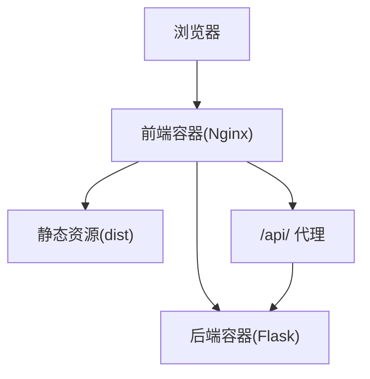
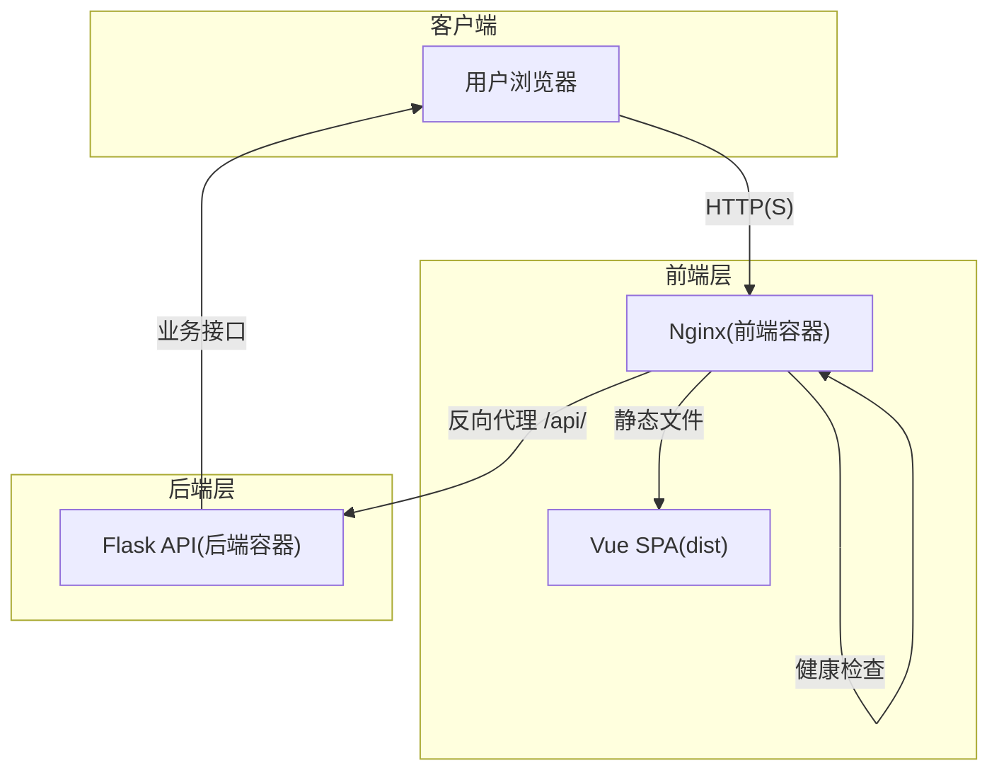
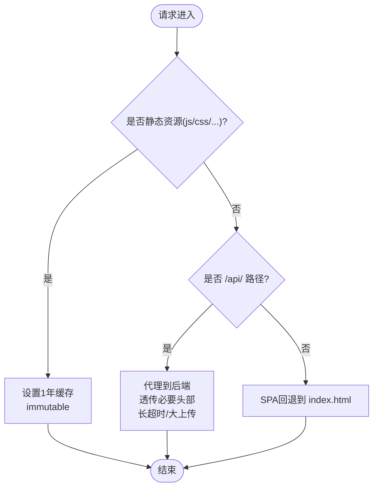
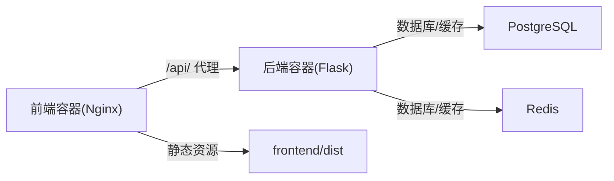
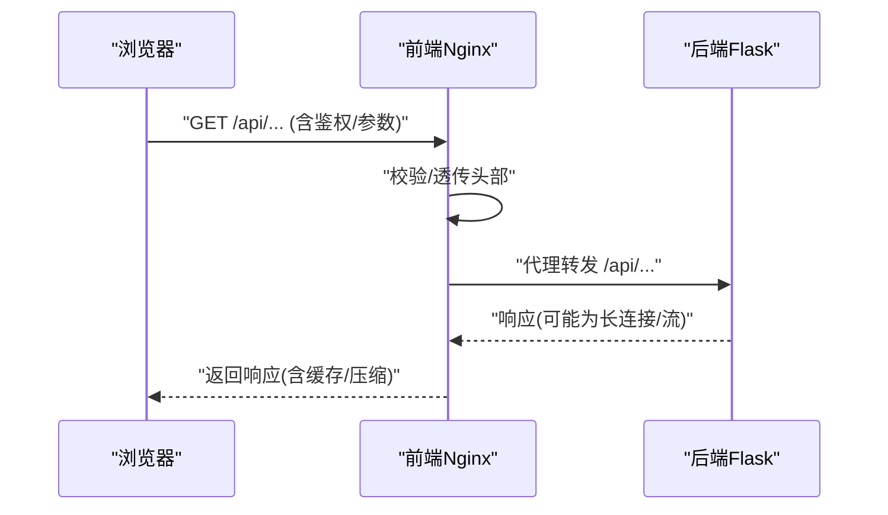
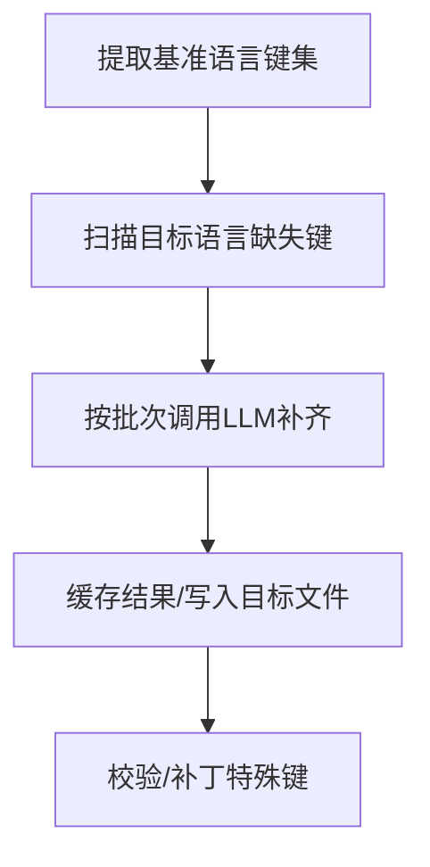

# 前端架构

<cite>
**本文引用的文件**
- [frontend/Dockerfile](file://frontend/Dockerfile)
- [frontend/nginx.conf.template](file://frontend/nginx.conf.template)
- [frontend/railway.json](file://frontend/railway.json)
- [docker-compose.yml](file://docker-compose.yml)
- [scripts/build-frontend.sh](file://scripts/build-frontend.sh)
- [DEVELOPMENT.md](file://DEVELOPMENT.md)
- [README.md](file://README.md)
- [backend_api_python/env.example](file://backend_api_python/env.example)
- [docs/CLOUD_DEPLOYMENT_EN.md](file://docs/CLOUD_DEPLOYMENT_EN.md)
- [scripts/i18n-diff.js](file://scripts/i18n-diff.js)
- [scripts/i18n-fill-ai.js](file://scripts/i18n-fill-ai.js)
- [scripts/i18n-patch-specials.js](file://scripts/i18n-patch-specials.js)
</cite>

## 目录
1. [简介](#简介)
2. [项目结构](#项目结构)
3. [核心组件](#核心组件)
4. [架构总览](#架构总览)
5. [详细组件分析](#详细组件分析)
6. [依赖关系分析](#依赖关系分析)
7. [性能考虑](#性能考虑)
8. [故障排查指南](#故障排查指南)
9. [结论](#结论)
10. [附录](#附录)

## 简介
本文件面向QuantDinger前端架构，聚焦于Vue.js单页应用（SPA）在容器化环境中的部署与运行方式、Nginx作为静态文件服务器的配置与代理策略、前端与后端API的通信机制与跨域处理、构建流程与资源优化、缓存策略、响应式设计与国际化、主题系统、性能优化、安全配置与监控方案。文档严格基于仓库内现有文件进行分析与总结。

## 项目结构
前端层由Nginx容器提供服务，直接从预构建的dist目录提供静态资源，并通过反向代理将/api/路径转发至后端Flask服务。该结构确保了前端与后端的解耦：前端仅负责UI与用户交互，后端提供REST与长连接能力。

图表来源
- [frontend/Dockerfile:1-24](file://frontend/Dockerfile#L1-L24)
- [frontend/nginx.conf.template:1-60](file://frontend/nginx.conf.template#L1-L60)
- [docker-compose.yml:136-159](file://docker-compose.yml#L136-L159)

章节来源
- [frontend/Dockerfile:1-24](file://frontend/Dockerfile#L1-L24)
- [frontend/nginx.conf.template:1-60](file://frontend/nginx.conf.template#L1-L60)
- [docker-compose.yml:136-159](file://docker-compose.yml#L136-L159)

## 核心组件
- 前端容器（Nginx）
  - 使用官方Nginx Alpine镜像，启动时通过envsubst对模板进行变量替换，注入后端地址。
  - 提供静态资源服务与SPA路由回退。
  - 配置安全头、Gzip压缩、静态资源强缓存、健康检查端点等。
- 后端容器（Flask）
  - 通过docker-compose暴露5000端口，提供REST API与长连接（如实验流式输出）。
- 构建与发布
  - 前端源代码位于独立私有仓库，通过构建脚本同步生产构建产物至frontend/dist，再由Nginx容器复制提供服务。
- 部署与平台
  - 支持本地Docker Compose一键启动，以及Railway平台的容器化部署配置。

章节来源
- [frontend/Dockerfile:1-24](file://frontend/Dockerfile#L1-L24)
- [frontend/nginx.conf.template:1-60](file://frontend/nginx.conf.template#L1-L60)
- [scripts/build-frontend.sh:1-53](file://scripts/build-frontend.sh#L1-L53)
- [frontend/railway.json:1-14](file://frontend/railway.json#L1-L14)
- [docker-compose.yml:136-159](file://docker-compose.yml#L136-L159)

## 架构总览
下图展示浏览器、前端容器、后端容器与静态资源之间的交互关系，以及API代理与健康检查的关键路径。

图表来源
- [frontend/nginx.conf.template:1-60](file://frontend/nginx.conf.template#L1-L60)
- [docker-compose.yml:136-159](file://docker-compose.yml#L136-L159)

## 详细组件分析

### 组件A：Nginx前端容器（静态文件服务器与API代理）
- 镜像与启动
  - 基于nginx:1.25-alpine，启动时安装curl，暴露80端口。
  - 通过环境变量控制后端地址，使用envsubst过滤仅替换BACKEND_URL，避免污染其他nginx变量。
- 安全头与压缩
  - 设置X-Frame-Options、X-Content-Type-Options、X-XSS-Protection等安全头。
  - 开启gzip压缩，限定最小长度与类型集合。
- 静态资源缓存
  - 对js/css/png/jpg/gif/svg/woff/woff2/ttf/eot/map等扩展名设置一年过期与immutable缓存。
- API代理
  - 将/api/前缀代理至${BACKEND_URL}/api/，透传Host、X-Real-IP、X-Forwarded-*、X-Forwarded-Proto等头部。
  - 针对长任务（如回测）设置较长超时与大上传限制。
- SPA路由
  - 所有未匹配到静态资源的请求回退到index.html，支持History API路由。
- 健康检查
  - 提供/health返回200，关闭访问日志，便于容器编排健康检查。

图表来源
- [frontend/nginx.conf.template:19-51](file://frontend/nginx.conf.template#L19-L51)

章节来源
- [frontend/Dockerfile:7-24](file://frontend/Dockerfile#L7-L24)
- [frontend/nginx.conf.template:1-60](file://frontend/nginx.conf.template#L1-L60)

### 组件B：后端API容器（Flask）
- 运行与暴露
  - 在容器内监听0.0.0.0:5000，通过docker-compose映射到宿主机端口，默认5000。
- 依赖与健康检查
  - 依赖PostgreSQL与Redis，健康检查通过/api/health。
- 环境变量
  - FRONTEND_URL用于生成重定向链接与CORS相关配置，OAUTH_ALLOWED_REDIRECTS可扩展额外前端域名。

章节来源
- [docker-compose.yml:81-131](file://docker-compose.yml#L81-L131)
- [backend_api_python/env.example:20-30](file://backend_api_python/env.example#L20-L30)

### 组件C：前端构建与发布（私有Vue仓库）
- 构建脚本
  - 通过QUANTDINGER_VUE_SRC指向私有Vue仓库，执行npm install与npm run build，再将dist内容同步到frontend/dist。
  - 仅在需要从源码构建时才需要Node.js。
- 默认部署
  - 仓库已内置预构建的dist，无需Node.js即可通过Docker Compose启动。

章节来源
- [scripts/build-frontend.sh:1-53](file://scripts/build-frontend.sh#L1-L53)
- [DEVELOPMENT.md:77-108](file://DEVELOPMENT.md#L77-L108)

### 组件D：部署与平台配置
- Docker Compose
  - 前端容器通过环境变量BACKEND_URL注入后端地址，默认http://backend:5000。
  - 提供健康检查与端口映射，前端默认8888端口对外。
- Railway
  - 通过railway.json定义Dockerfile构建与健康检查路径。

章节来源
- [docker-compose.yml:136-159](file://docker-compose.yml#L136-L159)
- [frontend/railway.json:1-14](file://frontend/railway.json#L1-L14)

### 组件E：国际化与主题系统（前端侧）
- 国际化
  - 仓库提供i18n工具链：差异分析、AI自动补齐、特殊键补丁等，覆盖阿拉伯语、德语、英语、法语、日语、韩语、泰语、越南语、繁体中文等。
  - 工具通过解析locale对象结构，保留注释与格式，按批次调用不同LLM提供商完成翻译。
- 主题系统
  - 仓库未提供主题系统实现细节；前端主题能力取决于私有Vue源码（不在当前开源树内）。

章节来源
- [scripts/i18n-diff.js:1-71](file://scripts/i18n-diff.js#L1-L71)
- [scripts/i18n-fill-ai.js:1-461](file://scripts/i18n-fill-ai.js#L1-L461)
- [scripts/i18n-patch-specials.js:81-137](file://scripts/i18n-patch-specials.js#L81-L137)

## 依赖关系分析
- 前端容器依赖后端容器提供的API；两者通过Docker网络通信，默认backend:5000。
- 前端容器依赖预构建的dist目录；构建脚本负责将私有Vue仓库的生产产物同步至该目录。
- 后端容器依赖数据库与缓存服务，健康检查确保服务可用性。

图表来源
- [docker-compose.yml:29-131](file://docker-compose.yml#L29-L131)
- [frontend/Dockerfile:19-20](file://frontend/Dockerfile#L19-L20)

章节来源
- [docker-compose.yml:29-131](file://docker-compose.yml#L29-L131)
- [frontend/Dockerfile:19-20](file://frontend/Dockerfile#L19-L20)

## 性能考虑
- 静态资源缓存
  - 对带哈希文件名的静态资源设置一年过期与immutable，显著降低带宽与提升加载速度。
- 压缩传输
  - 启用gzip压缩，减少文本类资源体积。
- 代理超时与上传限制
  - 针对长任务（如回测）设置较长超时与较大上传限制，保障用户体验。
- 健康检查与重启策略
  - 前端容器健康检查路径为/health，便于编排层快速发现异常并重启。

章节来源
- [frontend/nginx.conf.template:12-24](file://frontend/nginx.conf.template#L12-L24)
- [frontend/nginx.conf.template:41-45](file://frontend/nginx.conf.template#L41-L45)
- [frontend/railway.json:7-12](file://frontend/railway.json#L7-L12)

## 故障排查指南
- 前端无法访问后端
  - 检查BACKEND_URL环境变量是否正确注入，确认后端容器健康状态。
- SPA路由404或刷新后白屏
  - 确认Nginx已启用SPA回退到index.html。
- CORS或跨域问题
  - 若采用双域名部署，需确保后端正确配置CORS与允许的来源列表。
- 健康检查失败
  - 查看容器日志，确认/health端点可达且返回200。

章节来源
- [docker-compose.yml:155-158](file://docker-compose.yml#L155-L158)
- [frontend/nginx.conf.template:48-51](file://frontend/nginx.conf.template#L48-L51)
- [docs/CLOUD_DEPLOYMENT_EN.md:241-283](file://docs/CLOUD_DEPLOYMENT_EN.md#L241-L283)

## 结论
QuantDinger前端采用“Nginx静态文件服务器 + 反向代理”的轻量架构，结合预构建dist与容器化部署，实现了快速上线与稳定运行。通过明确的API代理、安全头、压缩与缓存策略，前端在性能与安全性方面具备良好基础。国际化与主题系统由私有前端源码负责，仓库提供了完善的工具链以支撑多语言与本地化工作。

## 附录

### 前端与后端通信序列（API代理）

图表来源
- [frontend/nginx.conf.template:31-46](file://frontend/nginx.conf.template#L31-L46)
- [docker-compose.yml:136-159](file://docker-compose.yml#L136-L159)

### 国际化工作流（AI补齐）

图表来源
- [scripts/i18n-diff.js:15-47](file://scripts/i18n-diff.js#L15-L47)
- [scripts/i18n-fill-ai.js:361-441](file://scripts/i18n-fill-ai.js#L361-L441)
- [scripts/i18n-patch-specials.js:86-133](file://scripts/i18n-patch-specials.js#L86-L133)