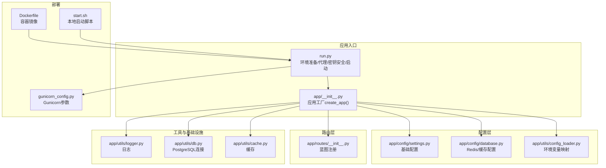
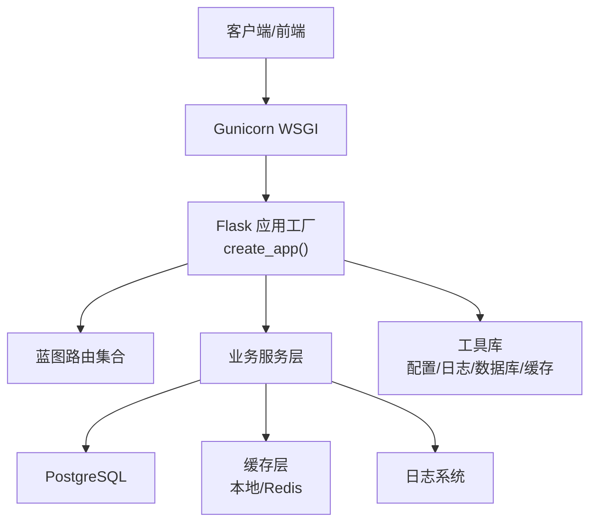
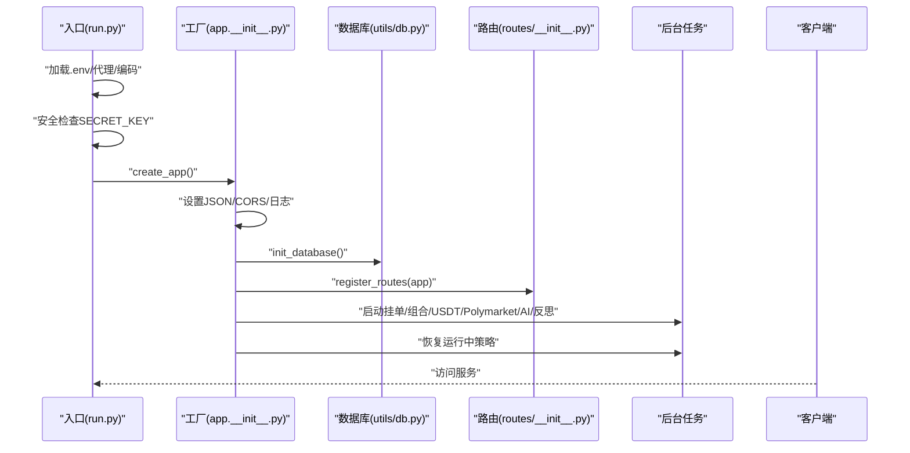
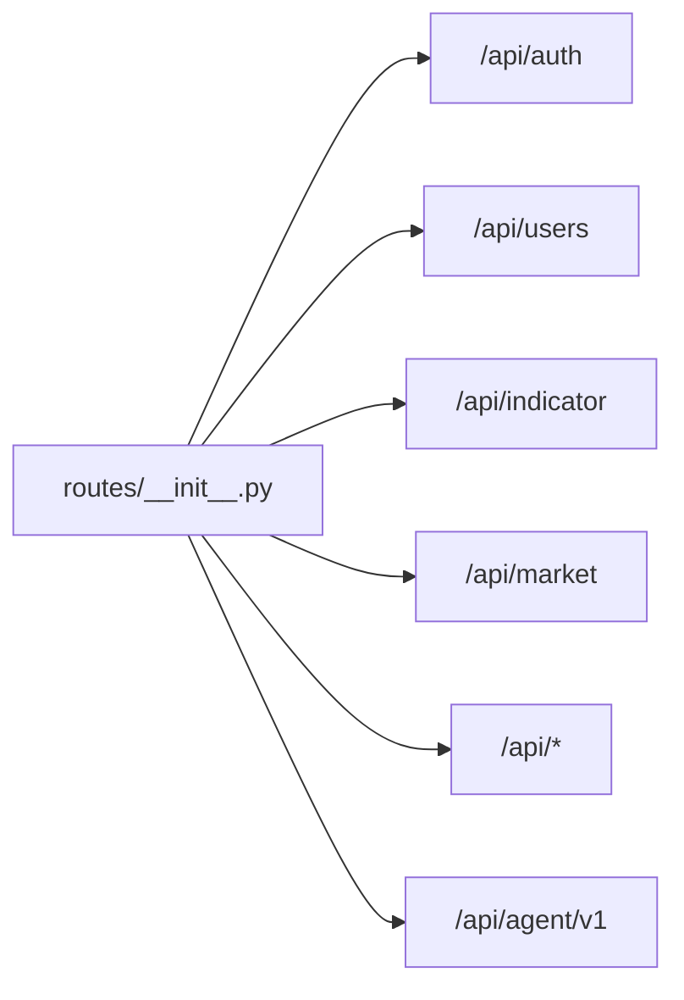
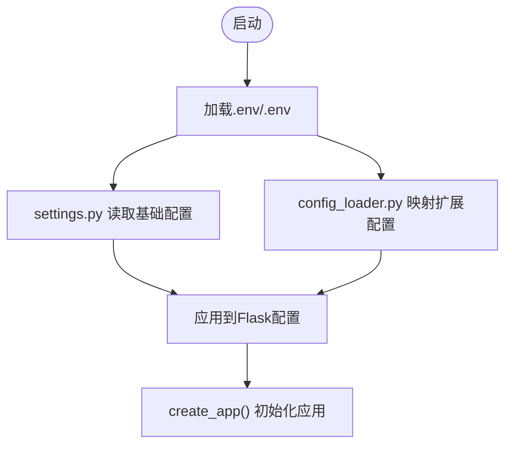
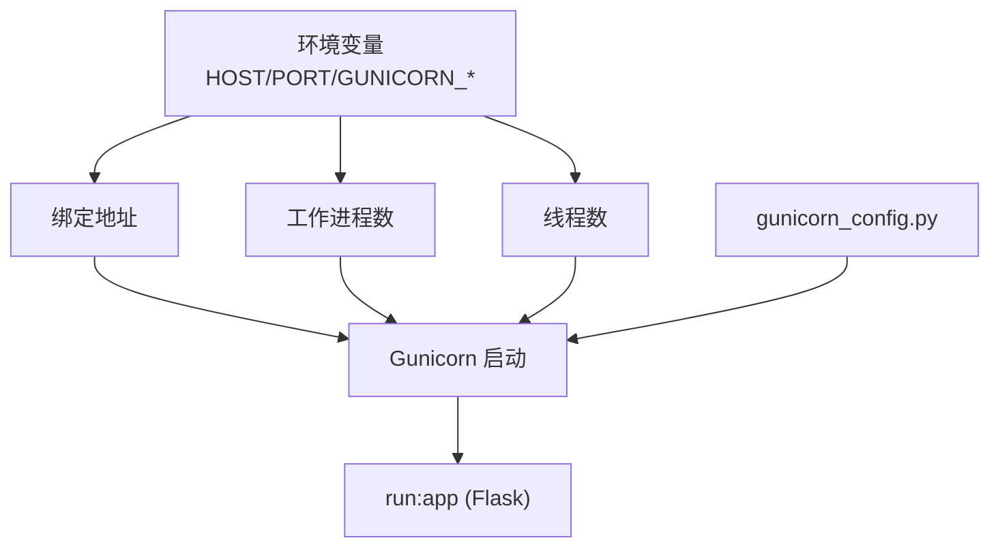
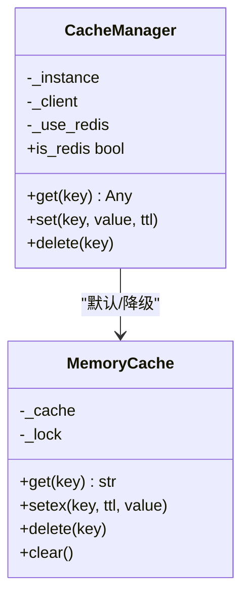
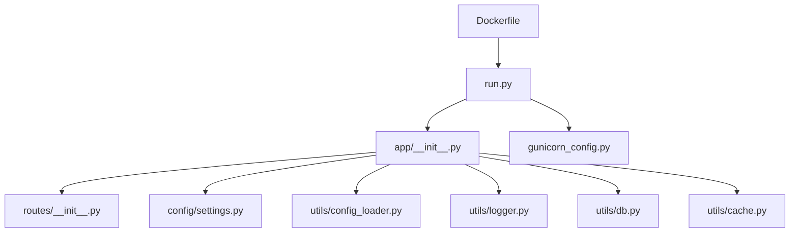

# 后端架构

<cite>
**本文引用的文件**
- [run.py](file://backend_api_python/run.py)
- [gunicorn_config.py](file://backend_api_python/gunicorn_config.py)
- [app/__init__.py](file://backend_api_python/app/__init__.py)
- [app/route/__init__.py](file://backend_api_python/app/routes/__init__.py)
- [app/config/settings.py](file://backend_api_python/app/config/settings.py)
- [app/utils/config_loader.py](file://backend_api_python/app/utils/config_loader.py)
- [app/utils/logger.py](file://backend_api_python/app/utils/logger.py)
- [app/utils/db.py](file://backend_api_python/app/utils/db.py)
- [app/config/database.py](file://backend_api_python/app/config/database.py)
- [app/utils/cache.py](file://backend_api_python/app/utils/cache.py)
- [env.example](file://backend_api_python/env.example)
- [Dockerfile](file://backend_api_python/Dockerfile)
- [start.sh](file://backend_api_python/start.sh)
</cite>

## 目录
1. [简介](#简介)
2. [项目结构](#项目结构)
3. [核心组件](#核心组件)
4. [架构总览](#架构总览)
5. [详细组件分析](#详细组件分析)
6. [依赖分析](#依赖分析)
7. [性能考虑](#性能考虑)
8. [故障排查指南](#故障排查指南)
9. [结论](#结论)
10. [附录](#附录)

## 简介
本文件面向QuantDinger后端架构，聚焦Flask应用的分层设计、蓝图组织与中间件配置，详述Gunicorn WSGI服务器的部署与并发模型，解释应用初始化流程、配置加载机制与环境变量管理，覆盖路由组织、错误处理与日志策略，并说明数据库连接池、缓存与会话管理现状与优化方向。最后给出性能调优、安全加固与监控建议。

## 项目结构
后端采用Python + Flask，代码位于backend_api_python目录。核心层次包括：
- 应用工厂与入口：run.py负责环境准备、代理与密钥安全检查，导出可被Gunicorn使用的app对象；app/__init__.py提供Flask应用工厂create_app。
- 配置体系：app/config/settings.py集中定义基础配置；app/config/database.py定义Redis/缓存配置；app/utils/config_loader.py解析环境变量映射为嵌套配置。
- 路由与蓝图：app/routes/__init__.py统一注册各蓝图并设置url前缀。
- 工具与基础设施：app/utils/logger.py提供日志配置；app/utils/db.py封装PostgreSQL连接；app/utils/cache.py实现本地/Redis两级缓存。
- 部署与运行：gunicorn_config.py定义Gunicorn参数；Dockerfile与start.sh提供容器化与本地启动脚本。

图表来源
- [run.py:1-134](file://backend_api_python/run.py#L1-L134)
- [app/__init__.py:213-279](file://backend_api_python/app/__init__.py#L213-L279)
- [app/config/settings.py:1-99](file://backend_api_python/app/config/settings.py#L1-L99)
- [app/config/database.py:1-90](file://backend_api_python/app/config/database.py#L1-L90)
- [app/utils/config_loader.py:24-161](file://backend_api_python/app/utils/config_loader.py#L24-L161)
- [app/routes/__init__.py:7-58](file://backend_api_python/app/routes/__init__.py#L7-L58)
- [app/utils/logger.py:9-49](file://backend_api_python/app/utils/logger.py#L9-L49)
- [app/utils/db.py:38-48](file://backend_api_python/app/utils/db.py#L38-L48)
- [app/utils/cache.py:49-129](file://backend_api_python/app/utils/cache.py#L49-L129)
- [gunicorn_config.py:10-36](file://backend_api_python/gunicorn_config.py#L10-L36)
- [Dockerfile:1-62](file://backend_api_python/Dockerfile#L1-L62)
- [start.sh:1-27](file://backend_api_python/start.sh#L1-L27)

章节来源
- [run.py:1-134](file://backend_api_python/run.py#L1-L134)
- [app/__init__.py:213-279](file://backend_api_python/app/__init__.py#L213-L279)
- [app/routes/__init__.py:7-58](file://backend_api_python/app/routes/__init__.py#L7-L58)
- [app/config/settings.py:1-99](file://backend_api_python/app/config/settings.py#L1-L99)
- [app/utils/config_loader.py:24-161](file://backend_api_python/app/utils/config_loader.py#L24-L161)
- [app/utils/logger.py:9-49](file://backend_api_python/app/utils/logger.py#L9-L49)
- [app/utils/db.py:38-48](file://backend_api_python/app/utils/db.py#L38-L48)
- [app/config/database.py:1-90](file://backend_api_python/app/config/database.py#L1-L90)
- [app/utils/cache.py:49-129](file://backend_api_python/app/utils/cache.py#L49-L129)
- [gunicorn_config.py:10-36](file://backend_api_python/gunicorn_config.py#L10-L36)
- [Dockerfile:1-62](file://backend_api_python/Dockerfile#L1-L62)
- [start.sh:1-27](file://backend_api_python/start.sh#L1-L27)

## 核心组件
- 应用工厂与入口
  - run.py负责：
    - 控制台编码与日志输出兼容性；
    - 优先加载同级.env，其次仓库根目录.env；
    - 设置TQDM禁用与代理环境变量；
    - 注入项目根目录到Python路径；
    - 导出可被Gunicorn使用的app对象；
    - 启动时对SECRET_KEY进行安全检查，生产模式下若使用默认密钥则自动生成新密钥并提示持久化。
  - app/__init__.py提供create_app()，完成：
    - 自定义JSON提供者（SafeJSONProvider），确保NaN/Infinity转为null；
    - 初始化CORS；
    - 初始化数据库与管理员账户；
    - 注册所有蓝图；
    - 启动后台任务（挂单扫描、组合监控、USDT订单、Polymarket、AI校准、反思等）；
    - 启动时恢复运行中的策略。

- 配置体系
  - 基础配置：app/config/settings.py通过元类读取环境变量，涵盖主机、端口、调试、日志、速率限制、功能开关等。
  - 额外配置：app/utils/config_loader.py将扁平环境变量映射为点号键的嵌套字典，兼容旧版PHP风格，支持缓存、请求日志、数据源超时重试等。
  - 缓存与Redis：app/config/database.py定义Redis配置与缓存业务配置；app/utils/cache.py实现本地内存缓存与Redis降级回退。

- 路由与蓝图
  - app/routes/__init__.py集中注册所有蓝图，并按API域设置url_prefix，如/api/auth、/api/users、/api/indicator、/api/market、/api等；同时注册版本化的Agent Gateway。

- 日志与数据库
  - app/utils/logger.py配置全局日志格式、级别与文件轮转；过滤特定子系统的噪声日志；自动创建logs目录。
  - app/utils/db.py封装PostgreSQL连接，初始化时验证连接可用性。

章节来源
- [run.py:17-134](file://backend_api_python/run.py#L17-L134)
- [app/__init__.py:15-279](file://backend_api_python/app/__init__.py#L15-L279)
- [app/config/settings.py:6-99](file://backend_api_python/app/config/settings.py#L6-L99)
- [app/utils/config_loader.py:24-161](file://backend_api_python/app/utils/config_loader.py#L24-L161)
- [app/config/database.py:6-90](file://backend_api_python/app/config/database.py#L6-L90)
- [app/utils/cache.py:49-129](file://backend_api_python/app/utils/cache.py#L49-L129)
- [app/routes/__init__.py:7-58](file://backend_api_python/app/routes/__init__.py#L7-L58)
- [app/utils/logger.py:9-49](file://backend_api_python/app/utils/logger.py#L9-L49)
- [app/utils/db.py:38-48](file://backend_api_python/app/utils/db.py#L38-L48)

## 架构总览
后端采用Flask应用工厂模式，配合蓝图实现清晰的路由分层；通过环境变量驱动配置，支持本地开发与容器化部署；Gunicorn以多工作进程+线程模型承载并发；数据库为PostgreSQL，缓存支持本地内存与Redis可选；日志统一落地与轮转。

图表来源
- [run.py:96-101](file://backend_api_python/run.py#L96-L101)
- [app/__init__.py:213-279](file://backend_api_python/app/__init__.py#L213-L279)
- [app/routes/__init__.py:7-58](file://backend_api_python/app/routes/__init__.py#L7-L58)
- [app/utils/db.py:38-48](file://backend_api_python/app/utils/db.py#L38-L48)
- [app/utils/cache.py:49-129](file://backend_api_python/app/utils/cache.py#L49-L129)
- [app/utils/logger.py:9-49](file://backend_api_python/app/utils/logger.py#L9-L49)

## 详细组件分析

### 应用工厂与初始化流程
- 关键流程
  - 环境准备：加载.env、设置代理、控制台编码、禁用进度条。
  - 安全检查：生产模式检测默认SECRET_KEY并自动生成随机密钥。
  - 应用创建：create_app()设置JSON提供者、CORS、日志；初始化数据库与管理员；注册蓝图；启动后台任务；恢复运行中策略。
- 并发与稳定性：启用ib_insync异步补丁以稳定IBKR连接；后台任务均做异常捕获，避免启动失败。

图表来源
- [run.py:17-134](file://backend_api_python/run.py#L17-L134)
- [app/__init__.py:213-279](file://backend_api_python/app/__init__.py#L213-L279)
- [app/utils/db.py:38-48](file://backend_api_python/app/utils/db.py#L38-L48)
- [app/routes/__init__.py:7-58](file://backend_api_python/app/routes/__init__.py#L7-L58)

章节来源
- [run.py:17-134](file://backend_api_python/run.py#L17-L134)
- [app/__init__.py:213-279](file://backend_api_python/app/__init__.py#L213-L279)

### 蓝图组织与路由前缀
- 统一注册：app/routes/__init__.py集中导入并注册所有蓝图，按域设置url_prefix，如/api/auth、/api/users、/api/indicator、/api/market等。
- 版本化Agent网关：/api/agent/v1通过独立注册函数接入，便于版本演进与权限隔离。

图表来源
- [app/routes/__init__.py:7-58](file://backend_api_python/app/routes/__init__.py#L7-L58)

章节来源
- [app/routes/__init__.py:7-58](file://backend_api_python/app/routes/__init__.py#L7-L58)

### 中间件与JSON提供者
- 自定义JSON提供者：SafeJSONProvider将NaN/Infinity安全转为null，保证RFC 8259兼容的JSON输出，避免前端解析异常。
- CORS：全局启用跨域支持，结合前端域名配置与OAuth重定向白名单使用。

章节来源
- [app/__init__.py:15-51](file://backend_api_python/app/__init__.py#L15-L51)
- [app/__init__.py:229](file://backend_api_python/app/__init__.py#L229)

### 配置加载机制与环境变量管理
- 基础配置：app/config/settings.py通过元类读取环境变量，覆盖主机、端口、调试、日志、速率限制、功能开关等。
- 扩展配置：app/utils/config_loader.py将扁平环境变量映射为点号键嵌套结构，兼容旧版PHP风格；支持LLM、数据源、搜索、第三方API等配置项。
- 环境示例：env.example提供完整参数清单，含数据库连接池、Gunicorn并发、AI提供商、代理、桌面Broker、支付、高级调优等。

图表来源
- [run.py:19-29](file://backend_api_python/run.py#L19-L29)
- [app/config/settings.py:6-99](file://backend_api_python/app/config/settings.py#L6-L99)
- [app/utils/config_loader.py:24-161](file://backend_api_python/app/utils/config_loader.py#L24-L161)

章节来源
- [run.py:19-29](file://backend_api_python/run.py#L19-L29)
- [app/config/settings.py:6-99](file://backend_api_python/app/config/settings.py#L6-L99)
- [app/utils/config_loader.py:24-161](file://backend_api_python/app/utils/config_loader.py#L24-L161)
- [env.example:1-319](file://backend_api_python/env.example#L1-L319)

### Gunicorn部署与并发模型
- 绑定与并发：bind由环境变量PYTHON_API_HOST与PYTHON_API_PORT拼接；默认1个工作进程、4个线程；可通过GUNICORN_WORKERS与GUNICORN_THREADS调整。
- 工作类：gthread（每工作进程内多线程）；preload_app禁用，避免后台线程在fork后丢失。
- 超时与日志：timeout、graceful_timeout、keepalive合理设置；accesslog与errorlog输出至标准输出；日志级别由环境变量控制。
- 容器入口：Dockerfile使用gunicorn_config.py作为配置文件，ENTRYPOINT执行docker-entrypoint.sh并以gunicorn启动run:app。

图表来源
- [gunicorn_config.py:10-36](file://backend_api_python/gunicorn_config.py#L10-L36)
- [Dockerfile:56-61](file://backend_api_python/Dockerfile#L56-L61)
- [run.py:96-101](file://backend_api_python/run.py#L96-L101)

章节来源
- [gunicorn_config.py:10-36](file://backend_api_python/gunicorn_config.py#L10-L36)
- [Dockerfile:56-61](file://backend_api_python/Dockerfile#L56-L61)
- [run.py:96-101](file://backend_api_python/run.py#L96-L101)

### 数据库连接池与会话管理
- 数据库类型：PostgreSQL，通过app/utils/db.py封装连接；初始化时验证可用性。
- 连接池：env.example提供DB_POOL_MIN/MAX/ACQUIRE_TIMEOUT/HEALTH_CHECK等参数，用于缓解“连接池耗尽”问题；同时给出市场与组合执行器的工作线程上限建议，避免超过池容量。
- 会话管理：未见显式的Flask Session配置，认证主要基于JWT与OAuth；数据库会话由psycopg2连接池管理。

章节来源
- [app/utils/db.py:38-48](file://backend_api_python/app/utils/db.py#L38-L48)
- [env.example:42-57](file://backend_api_python/env.example#L42-L57)

### 缓存策略
- 两级缓存：本地内存缓存（MemoryCache）作为默认；当CacheConfig.ENABLED为真且Redis可用时切换Redis；不可用时自动降级为内存缓存。
- TTL策略：针对K线、分析、价格等场景设定不同TTL；默认TTL可由环境变量覆盖。
- 使用方式：CacheManager单例持有缓存客户端，提供get/set/delete接口并序列化/反序列化。

图表来源
- [app/utils/cache.py:49-129](file://backend_api_python/app/utils/cache.py#L49-L129)

章节来源
- [app/config/database.py:52-85](file://backend_api_python/app/config/database.py#L52-L85)
- [app/utils/cache.py:49-129](file://backend_api_python/app/utils/cache.py#L49-L129)

### 日志记录策略
- 全局配置：设置日志级别、格式与文件轮转；自动创建logs目录；过滤Werkzeug与特定路由噪声日志；保留USDT对账与计费模块INFO级别日志。
- 输出：默认输出到控制台与文件；生产环境可结合Gunicorn accesslog/errorlog参数。

章节来源
- [app/utils/logger.py:9-49](file://backend_api_python/app/utils/logger.py#L9-L49)

### 错误处理与恢复
- 启动期恢复：create_app()中启动后台任务与恢复运行中策略；对异常进行记录但不中断应用启动。
- 策略恢复：遍历运行中策略并尝试启动，失败则更新状态为stopped，避免僵尸状态。
- 安全检查：run.py在生产模式下检测默认SECRET_KEY并自动生成新密钥，降低令牌伪造风险。

章节来源
- [app/__init__.py:258-276](file://backend_api_python/app/__init__.py#L258-L276)
- [app/__init__.py:152-211](file://backend_api_python/app/__init__.py#L152-L211)
- [run.py:109-120](file://backend_api_python/run.py#L109-L120)

## 依赖分析
- 组件耦合
  - run.py与app/__init__.py强关联：run.py导出app供Gunicorn使用；app/__init__.py提供create_app()。
  - app/__init__.py依赖配置模块、路由模块、工具模块与业务服务；业务服务进一步依赖数据库与缓存。
- 外部依赖
  - Gunicorn：通过gunicorn_config.py与Dockerfile集成。
  - PostgreSQL：通过app/utils/db.py连接；env.example提供连接池参数。
  - Redis：通过app/utils/cache.py按需启用；app/config/database.py提供配置。
- 循环依赖
  - 当前结构未见循环导入；蓝图注册在应用初始化阶段完成，避免运行时循环。

图表来源
- [run.py:96-101](file://backend_api_python/run.py#L96-L101)
- [app/__init__.py:255-256](file://backend_api_python/app/__init__.py#L255-L256)
- [app/routes/__init__.py:7-58](file://backend_api_python/app/routes/__init__.py#L7-L58)
- [app/config/settings.py:6-99](file://backend_api_python/app/config/settings.py#L6-L99)
- [app/utils/config_loader.py:24-161](file://backend_api_python/app/utils/config_loader.py#L24-L161)
- [app/utils/logger.py:9-49](file://backend_api_python/app/utils/logger.py#L9-L49)
- [app/utils/db.py:38-48](file://backend_api_python/app/utils/db.py#L38-L48)
- [app/utils/cache.py:49-129](file://backend_api_python/app/utils/cache.py#L49-L129)
- [gunicorn_config.py:10-36](file://backend_api_python/gunicorn_config.py#L10-L36)
- [Dockerfile:56-61](file://backend_api_python/Dockerfile#L56-L61)

章节来源
- [run.py:96-101](file://backend_api_python/run.py#L96-L101)
- [app/__init__.py:255-256](file://backend_api_python/app/__init__.py#L255-L256)
- [app/routes/__init__.py:7-58](file://backend_api_python/app/routes/__init__.py#L7-L58)
- [app/config/settings.py:6-99](file://backend_api_python/app/config/settings.py#L6-L99)
- [app/utils/config_loader.py:24-161](file://backend_api_python/app/utils/config_loader.py#L24-L161)
- [app/utils/logger.py:9-49](file://backend_api_python/app/utils/logger.py#L9-L49)
- [app/utils/db.py:38-48](file://backend_api_python/app/utils/db.py#L38-L48)
- [app/utils/cache.py:49-129](file://backend_api_python/app/utils/cache.py#L49-L129)
- [gunicorn_config.py:10-36](file://backend_api_python/gunicorn_config.py#L10-L36)
- [Dockerfile:56-61](file://backend_api_python/Dockerfile#L56-L61)

## 性能考虑
- 并发与线程
  - Gunicorn默认1工作进程+4线程；可根据CPU核数提升GUNICORN_WORKERS，保持线程数适中，避免上下文切换开销。
  - 线程内I/O密集型任务（数据源拉取、缓存访问）受益于gthread模型。
- 数据库连接池
  - 调整DB_POOL_MIN/MAX与ACQUIRE_TIMEOUT，确保高并发策略/组合任务不阻塞；监控PG最大连接数与池耗尽告警。
  - 市场与组合执行器工作线程之和应远小于DB_POOL_MAX。
- 缓存命中率
  - 合理设置K线/分析/价格TTL；对热点数据增加缓存；必要时启用Redis以共享缓存。
- I/O与网络
  - 代理与SSL证书配置：PROXY_URL与LIVE_TRADING_CA_BUNDLE/LIVE_TRADING_SSL_VERIFY影响外部数据源访问稳定性。
- 日志与资源
  - 控制日志级别与文件轮转大小，避免磁盘IO成为瓶颈。

## 故障排查指南
- 启动失败
  - 检查DATABASE_URL与PostgreSQL连通性；查看日志文件与Gunicorn错误日志。
  - 确认.env中SECRET_KEY已修改（生产模式）。
- 连接池耗尽
  - 提升DB_POOL_MAX并确保PostgreSQL max_connections足够；降低并发或拆分任务。
- 缓存不可用
  - 若启用Redis但不可达，系统自动降级为内存缓存；检查Redis连接参数与网络可达性。
- 代理与SSL
  - PROXY_URL与NO_PROXY配置不当会导致部分数据源失败；SSL证书问题可通过LIVE_TRADING_CA_BUNDLE或LIVE_TRADING_SSL_VERIFY临时定位。
- 后台任务异常
  - 查看日志中对应模块的错误堆栈；确认任务依赖的服务（如交易所、链上查询）可用性。

章节来源
- [app/utils/db.py:38-48](file://backend_api_python/app/utils/db.py#L38-L48)
- [app/utils/logger.py:9-49](file://backend_api_python/app/utils/logger.py#L9-L49)
- [app/utils/cache.py:77-98](file://backend_api_python/app/utils/cache.py#L77-L98)
- [env.example:138-152](file://backend_api_python/env.example#L138-L152)

## 结论
QuantDinger后端采用清晰的工厂+蓝图架构，通过环境变量驱动配置，具备良好的可运维性与可扩展性。Gunicorn提供稳定的多进程+线程并发模型；PostgreSQL与可选Redis构成可靠的数据与缓存基础设施；日志与安全检查保障生产可用性。建议在生产环境中完善连接池与缓存配置，强化监控与告警，并持续优化I/O与网络相关参数以获得最佳吞吐与稳定性。

## 附录
- 环境变量速览（节选）
  - 应用与认证：SECRET_KEY、ADMIN_USER、ADMIN_PASSWORD、DATABASE_URL、FRONTEND_URL、OAUTH_ALLOWED_REDIRECTS。
  - 数据库连接池：DB_POOL_MIN、DB_POOL_MAX、DB_POOL_ACQUIRE_TIMEOUT、DB_POOL_HEALTH_CHECK。
  - 并发与部署：GUNICORN_WORKERS、GUNICORN_THREADS、PYTHON_API_HOST、PYTHON_API_PORT。
  - 缓存：CACHE_ENABLED、REDIS_HOST、REDIS_PORT、REDIS_PASSWORD、REDIS_DB。
  - 代理与SSL：PROXY_URL、LIVE_TRADING_CA_BUNDLE、LIVE_TRADING_SSL_VERIFY。
  - AI与数据源：LLM_PROVIDER、OPENROUTER_*、FINNHUB_*、CCXT_*、YFINANCE_TIMEOUT、DATA_SOURCE_*。
- 启动方式
  - 本地：start.sh自动安装依赖并运行run.py。
  - 容器：Dockerfile使用gunicorn_config.py启动run:app。

章节来源
- [env.example:1-319](file://backend_api_python/env.example#L1-L319)
- [start.sh:8-22](file://backend_api_python/start.sh#L8-L22)
- [Dockerfile:56-61](file://backend_api_python/Dockerfile#L56-L61)