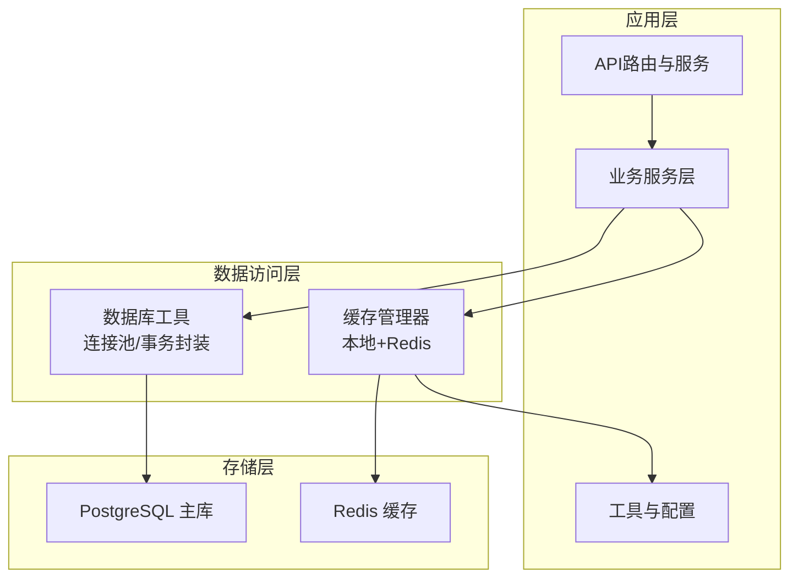
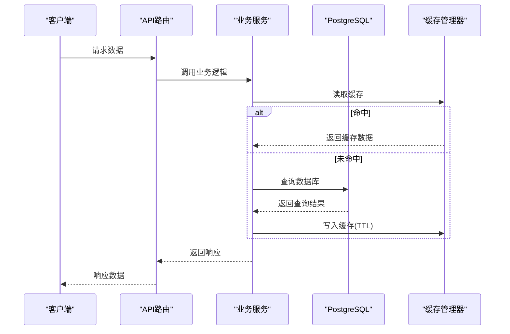
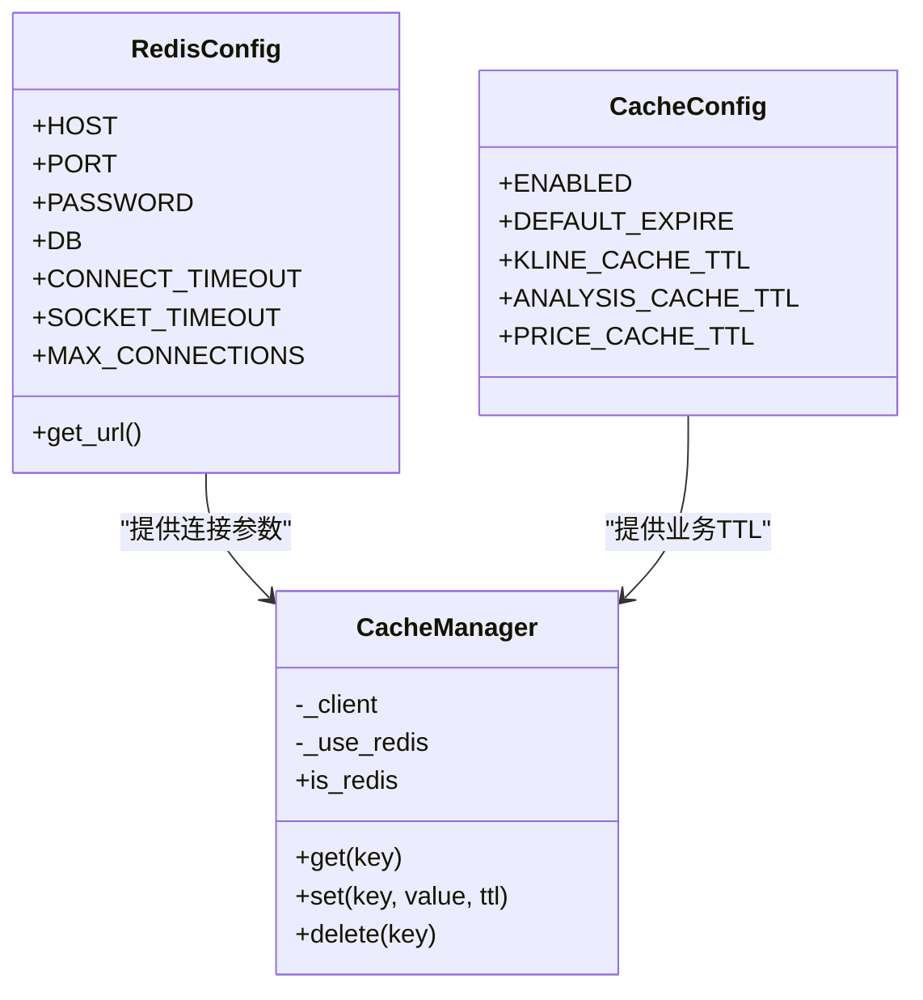
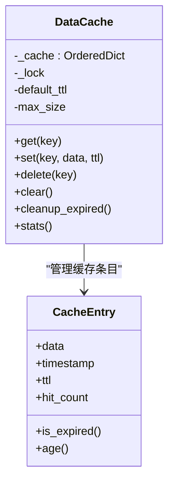
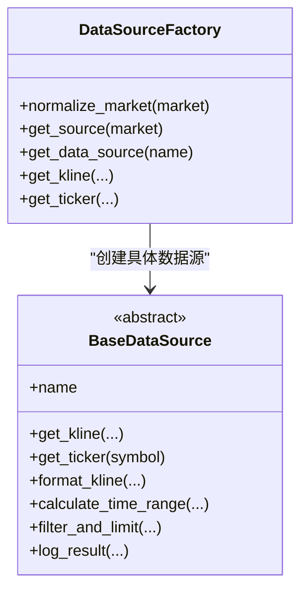
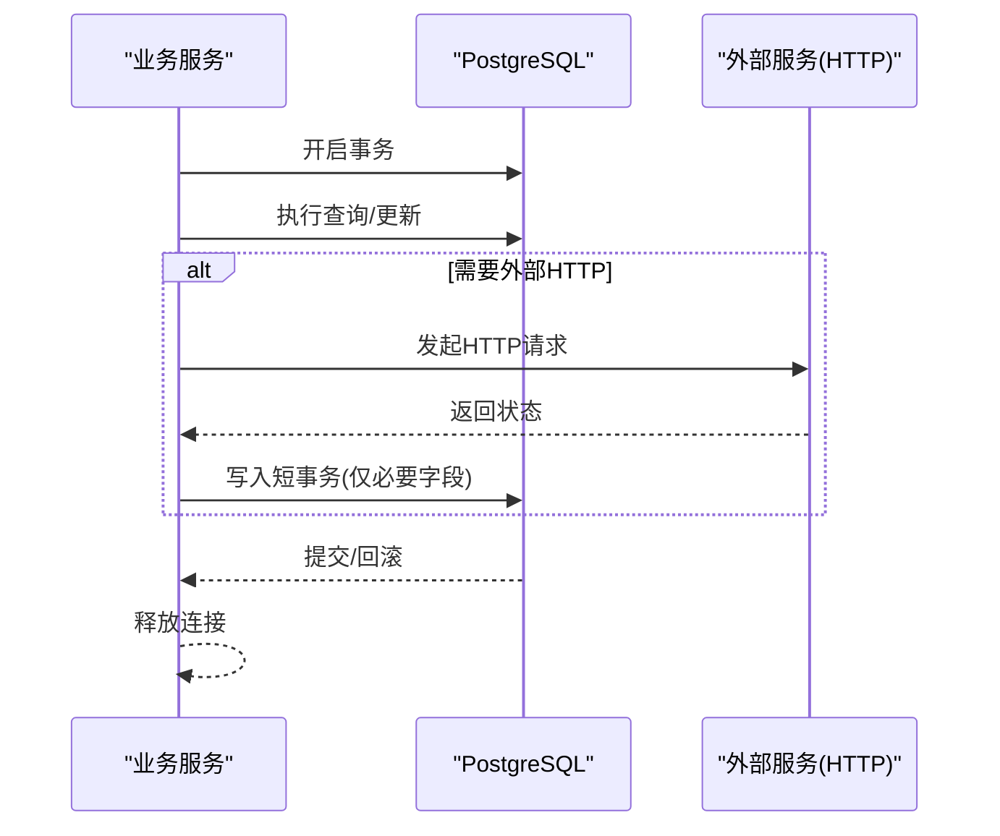
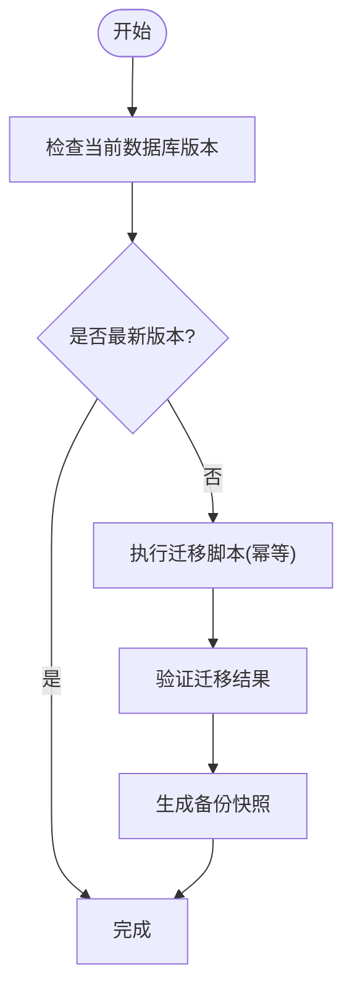
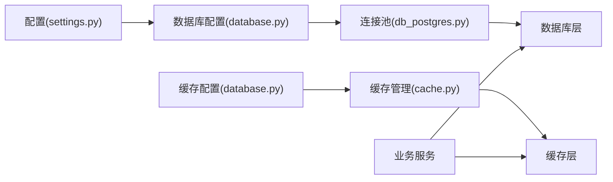

# 数据架构

<cite>
**本文引用的文件**
- [database.py](file://backend_api_python/app/config/database.py)
- [settings.py](file://backend_api_python/app/config/settings.py)
- [init.sql](file://backend_api_python/migrations/init.sql)
- [v3_1_0_agent_gateway.sql](file://backend_api_python/migrations/v3_1_0_agent_gateway.sql)
- [db_postgres.py](file://backend_api_python/app/utils/db_postgres.py)
- [db.py](file://backend_api_python/app/utils/db.py)
- [cache_manager.py](file://backend_api_python/app/data_sources/cache_manager.py)
- [cache.py](file://backend_api_python/app/utils/cache.py)
- [base.py](file://backend_api_python/app/data_sources/base.py)
- [factory.py](file://backend_api_python/app/data_sources/factory.py)
- [billing_service.py](file://backend_api_python/app/services/billing_service.py)
- [usdt_payment_service.py](file://backend_api_python/app/services/usdt_payment_service.py)
- [user_service.py](file://backend_api_python/app/services/user_service.py)
- [analysis_memory.py](file://backend_api_python/app/services/analysis_memory.py)
- [crypto.py](file://backend_api_python/app/data_providers/crypto.py)
</cite>

## 目录
1. [简介](#简介)
2. [项目结构](#项目结构)
3. [核心组件](#核心组件)
4. [架构总览](#架构总览)
5. [详细组件分析](#详细组件分析)
6. [依赖关系分析](#依赖关系分析)
7. [性能考量](#性能考量)
8. [故障排查指南](#故障排查指南)
9. [结论](#结论)
10. [附录](#附录)

## 简介
本文件面向QuantDinger的数据架构，系统性阐述PostgreSQL数据库表结构设计、索引策略与查询优化思路，Redis缓存层的配置与数据存储策略、缓存失效机制，以及数据迁移管理、版本控制与备份恢复策略。同时涵盖数据同步机制、事务处理与一致性保障、数据访问层设计模式与ORM使用建议、性能优化实践，并补充数据安全、隐私保护与合规性要点。

## 项目结构
QuantDinger后端采用Python/Flask微服务架构，数据层由PostgreSQL作为主存储，Redis作为可选缓存层，配合本地内存缓存实现“本地优先”的缓存策略。数据访问通过统一的数据库工具模块封装连接池与事务语义，数据源抽象通过工厂模式对接多市场数据源（加密货币、美股、港股、期货、外汇、俄罗斯市场等）。迁移脚本负责初始化与演进式Schema变更。

**图示来源**
- [db_postgres.py:107-161](file://backend_api_python/app/utils/db_postgres.py#L107-L161)
- [cache.py:49-99](file://backend_api_python/app/utils/cache.py#L49-L99)
- [database.py:38-89](file://backend_api_python/app/config/database.py#L38-L89)

**章节来源**
- [db.py:19-31](file://backend_api_python/app/utils/db.py#L19-L31)
- [settings.py:10-28](file://backend_api_python/app/config/settings.py#L10-L28)

## 核心组件
- PostgreSQL连接池与事务封装：提供线程安全的连接池、健康检查、超时等待与异常回滚，支持占位符兼容与自动RETURNING id回填。
- Redis/内存缓存：按业务维度配置TTL与容量，支持本地优先降级，提供统一的get/set/delete接口。
- 数据源抽象与工厂：以统一接口适配多市场数据源，支持K线与实时报价获取、过滤与延迟检测。
- 迁移与Schema：通过初始化SQL与版本化迁移脚本维护Schema演进，包含用户、策略、交易、挂单、分析、代理网关等核心表。

**章节来源**
- [db_postgres.py:107-161](file://backend_api_python/app/utils/db_postgres.py#L107-L161)
- [cache.py:49-99](file://backend_api_python/app/utils/cache.py#L49-L99)
- [base.py:28-56](file://backend_api_python/app/data_sources/base.py#L28-L56)
- [factory.py:33-111](file://backend_api_python/app/data_sources/factory.py#L33-L111)
- [init.sql:1-120](file://backend_api_python/migrations/init.sql#L1-L120)
- [v3_1_0_agent_gateway.sql:1-93](file://backend_api_python/migrations/v3_1_0_agent_gateway.sql#L1-L93)

## 架构总览
下图展示数据流从API到服务、再到数据库与缓存的整体交互：

**图示来源**
- [cache.py:100-124](file://backend_api_python/app/utils/cache.py#L100-L124)
- [db_postgres.py:415-451](file://backend_api_python/app/utils/db_postgres.py#L415-L451)

## 详细组件分析

### PostgreSQL数据库设计与索引策略
- 用户与认证：用户表、OAuth关联、CSRF状态、验证码、登录尝试、安全审计日志等，关键字段建立唯一/普通索引以支撑高频查询与去重。
- 交易与风控：策略、持仓、交易、挂单队列、通知、运行日志等，围绕user_id、status、strategy_id、created_at等维度建立索引，提升筛选与排序效率。
- 市场与分析：指标代码、自选、分析任务、回测运行与明细、分析记忆体等，支持社区、评分、购买统计与历史回放。
- 代理网关：令牌、异步作业、审计日志、纸面订单等，引入JSONB字段与复合索引，满足高并发与幂等性需求。

索引策略建议（基于现有脚本与表结构）：
- 用户与安全：对email、username、provider+provider_user_id、state、expires_at等建立索引，加速登录、注册与OAuth流程。
- 交易与风控：对strategy_id、status、user_id、created_at建立索引，支撑策略监控、挂单调度与报表统计。
- 回测与分析：对run_id、strategy_id、user_id、status、created_at建立索引，优化回测结果检索与分析任务追踪。
- 代理网关：对agent_token_id、kind、status、idempotency_key建立索引，确保幂等与审计高效。

**章节来源**
- [init.sql:8-31](file://backend_api_python/migrations/init.sql#L8-L31)
- [init.sql:42-53](file://backend_api_python/migrations/init.sql#L42-L53)
- [init.sql:63-94](file://backend_api_python/migrations/init.sql#L63-L94)
- [init.sql:104-111](file://backend_api_python/migrations/init.sql#L104-L111)
- [init.sql:117-128](file://backend_api_python/migrations/init.sql#L117-L128)
- [init.sql:138-146](file://backend_api_python/migrations/init.sql#L138-L146)
- [init.sql:155-168](file://backend_api_python/migrations/init.sql#L155-L168)
- [init.sql:177-185](file://backend_api_python/migrations/init.sql#L177-L185)
- [init.sql:195-220](file://backend_api_python/migrations/init.sql#L195-L220)
- [init.sql:261-277](file://backend_api_python/migrations/init.sql#L261-L277)
- [init.sql:286-299](file://backend_api_python/migrations/init.sql#L286-L299)
- [init.sql:309-338](file://backend_api_python/migrations/init.sql#L309-L338)
- [init.sql:348-360](file://backend_api_python/migrations/init.sql#L348-L360)
- [init.sql:370-376](file://backend_api_python/migrations/init.sql#L370-L376)
- [init.sql:385-417](file://backend_api_python/migrations/init.sql#L385-L417)
- [init.sql:427-436](file://backend_api_python/migrations/init.sql#L427-L436)
- [init.sql:444-456](file://backend_api_python/migrations/init.sql#L444-L456)
- [init.sql:464-489](file://backend_api_python/migrations/init.sql#L464-L489)
- [init.sql:496-525](file://backend_api_python/migrations/init.sql#L496-L525)
- [init.sql:621-633](file://backend_api_python/migrations/init.sql#L621-L633)
- [v3_1_0_agent_gateway.sql:5-23](file://backend_api_python/migrations/v3_1_0_agent_gateway.sql#L5-L23)
- [v3_1_0_agent_gateway.sql:26-49](file://backend_api_python/migrations/v3_1_0_agent_gateway.sql#L26-L49)
- [v3_1_0_agent_gateway.sql:52-69](file://backend_api_python/migrations/v3_1_0_agent_gateway.sql#L52-L69)
- [v3_1_0_agent_gateway.sql:72-89](file://backend_api_python/migrations/v3_1_0_agent_gateway.sql#L72-L89)

### Redis缓存层配置与数据存储策略
- 配置项：主机、端口、密码、DB索引、连接/套接字超时、最大连接数；业务TTL：K线、分析、价格等按业务场景设定。
- 存储策略：本地优先，启用时使用Redis，不可用时自动降级为内存缓存；统一JSON序列化/反序列化；提供get/set/delete接口。
- 失效机制：按业务维度设置TTL，支持主动删除与自动过期清理；全局统计命中率便于性能评估。

**图示来源**
- [database.py:38-89](file://backend_api_python/app/config/database.py#L38-L89)
- [cache.py:49-99](file://backend_api_python/app/utils/cache.py#L49-L99)

**章节来源**
- [database.py:38-89](file://backend_api_python/app/config/database.py#L38-L89)
- [cache.py:49-99](file://backend_api_python/app/utils/cache.py#L49-L99)

### 本地缓存与数据源缓存
- 本地缓存：线程安全的内存缓存，支持TTL与LRU淘汰，适合单进程内快速缓存与低延迟场景。
- 数据源缓存：按数据类型分区（实时行情、K线、股票信息），支持TTL与容量上限，提供统计与清理能力。

**图示来源**
- [cache_manager.py:44-175](file://backend_api_python/app/data_sources/cache_manager.py#L44-L175)

**章节来源**
- [cache_manager.py:44-175](file://backend_api_python/app/data_sources/cache_manager.py#L44-L175)

### 数据访问层设计模式与ORM使用
- 设计模式：工厂模式用于选择具体数据源；抽象基类定义统一接口；装饰器/上下文管理器封装数据库连接与事务。
- ORM建议：当前直接使用原生SQL与psycopg2连接池，具备高性能与灵活性；若引入ORM，建议：
  - 使用SQLAlchemy Core或异步ORM（如Tortoise/SQLModel）以获得更好的可移植性与类型安全；
  - 为热点表建立索引与物化视图，结合批量写入与批处理事务；
  - 对复杂查询使用预编译语句与参数绑定，避免SQL注入。

**图示来源**
- [base.py:28-180](file://backend_api_python/app/data_sources/base.py#L28-L180)
- [factory.py:33-178](file://backend_api_python/app/data_sources/factory.py#L33-L178)

**章节来源**
- [base.py:28-180](file://backend_api_python/app/data_sources/base.py#L28-L180)
- [factory.py:33-178](file://backend_api_python/app/data_sources/factory.py#L33-L178)

### 数据同步机制、事务处理与一致性
- 同步机制：服务层通过数据库连接上下文管理器确保事务边界；对外部链路（如USDT订单刷新）采用“短事务+外部HTTP”模式，避免长时间持有数据库连接。
- 事务处理：统一的连接池与异常回滚逻辑，失败时自动回滚并释放连接；对插入语句提供RETURNING id兼容处理。
- 一致性保障：通过唯一约束（如OAuth provider+provider_user_id、qd_market_symbols的market+symbol）、外键约束与索引，保证参照完整性与查询效率。

**图示来源**
- [usdt_payment_service.py:609-645](file://backend_api_python/app/services/usdt_payment_service.py#L609-L645)
- [db_postgres.py:415-451](file://backend_api_python/app/utils/db_postgres.py#L415-L451)

**章节来源**
- [usdt_payment_service.py:584-645](file://backend_api_python/app/services/usdt_payment_service.py#L584-L645)
- [db_postgres.py:415-451](file://backend_api_python/app/utils/db_postgres.py#L415-L451)

### 数据迁移管理、版本控制与备份恢复
- 初始化与演进：通过init.sql初始化核心Schema，通过v3_1_0_agent_gateway.sql进行Agent网关相关表与索引的演进；脚本具备幂等性，可重复执行。
- 版本控制：迁移脚本命名明确版本号，配合注释说明变更内容；建议在部署前记录当前版本并在回滚时提供逆向脚本。
- 备份恢复：生产环境建议采用PostgreSQL物理/逻辑备份策略（如pg_dump/pg_basebackup），定期校验备份完整性；恢复演练纳入变更管理流程。

**图示来源**
- [init.sql:1-10](file://backend_api_python/migrations/init.sql#L1-L10)
- [v3_1_0_agent_gateway.sql:1-10](file://backend_api_python/migrations/v3_1_0_agent_gateway.sql#L1-L10)

**章节来源**
- [init.sql:1-10](file://backend_api_python/migrations/init.sql#L1-L10)
- [v3_1_0_agent_gateway.sql:1-10](file://backend_api_python/migrations/v3_1_0_agent_gateway.sql#L1-L10)

### 数据安全、隐私保护与合规性
- 认证与授权：用户凭据与第三方OAuth链接分离存储，审计日志记录关键行为；令牌版本号用于单一登录控制。
- 数据最小化：仅收集与提供功能必要的数据；对敏感字段（如凭证、日志详情）进行脱敏与限制访问。
- 合规要求：遵循适用法律与监管要求，提供漏洞披露渠道与响应流程；在自托管环境下，用户需自行落实环境与密钥安全。

**章节来源**
- [init.sql:8-31](file://backend_api_python/migrations/init.sql#L8-L31)
- [init.sql:155-168](file://backend_api_python/migrations/init.sql#L155-L168)
- [init.sql:177-185](file://backend_api_python/migrations/init.sql#L177-L185)
- [SECURITY.md:58-110](file://SECURITY.md#L58-L110)

## 依赖关系分析
- 数据访问层依赖于数据库工具模块提供的连接池与事务封装，后者依赖psycopg2与环境变量配置。
- 缓存层依赖于配置模块提供的Redis/业务TTL参数，支持本地降级。
- 业务服务依赖数据访问层与缓存层，部分服务（如USDT支付、账务）涉及外部HTTP与数据库短事务协作。

**图示来源**
- [settings.py:10-28](file://backend_api_python/app/config/settings.py#L10-L28)
- [database.py:38-89](file://backend_api_python/app/config/database.py#L38-L89)
- [db_postgres.py:107-161](file://backend_api_python/app/utils/db_postgres.py#L107-L161)
- [cache.py:49-99](file://backend_api_python/app/utils/cache.py#L49-L99)

**章节来源**
- [db.py:19-31](file://backend_api_python/app/utils/db.py#L19-L31)
- [cache.py:49-99](file://backend_api_python/app/utils/cache.py#L49-L99)

## 性能考量
- 连接池与健康检查：合理设置最小/最大连接数与获取超时，启用健康检查以剔除坏连接。
- 查询优化：为高频过滤字段建立索引；避免SELECT *，按需投影；对大结果集分页或流式处理。
- 缓存策略：区分冷热数据，设置差异化TTL；对热点数据启用本地缓存与Redis双写；定期清理过期与统计命中率。
- 写入优化：批量插入与事务合并；短事务优先，避免长事务锁竞争；对外部HTTP调用采用异步或后台任务。

[本节为通用指导，无需列出具体文件来源]

## 故障排查指南
- 数据库连接问题：检查DATABASE_URL格式与网络连通性；查看连接池耗尽日志并调整DB_POOL_MAX与DB_POOL_ACQUIRE_TIMEOUT。
- 缓存不可用：确认CACHE_ENABLED与Redis连接参数；当Redis不可达时自动降级为内存缓存，关注日志提示。
- 事务异常：捕获OperationalError/InterfaceError并回滚；检查慢查询与长事务占用。
- 外部服务集成：USDT刷新等场景需注意HTTP超时与重试；短事务仅写入必要字段，避免阻塞。

**章节来源**
- [db_postgres.py:184-234](file://backend_api_python/app/utils/db_postgres.py#L184-L234)
- [cache.py:77-98](file://backend_api_python/app/utils/cache.py#L77-L98)
- [usdt_payment_service.py:609-645](file://backend_api_python/app/services/usdt_payment_service.py#L609-L645)

## 结论
QuantDinger的数据架构以PostgreSQL为核心，结合Redis/内存缓存实现高性能与可扩展的数据访问；通过工厂模式与抽象基类实现多市场数据源的统一接入；迁移脚本保障Schema演进的幂等与可追溯。建议在现有基础上进一步完善ORM选型、索引策略与缓存治理，持续优化事务与外部集成的可靠性与性能。

## 附录
- 数据源示例：加密货币价格抓取支持多源回退（CCXT/yfinance/CoinGecko），体现数据可用性与容错设计。
- 业务验证：分析记忆体服务提供离线校验与准确性统计，支撑AI模型的持续优化。

**章节来源**
- [crypto.py:118-169](file://backend_api_python/app/data_providers/crypto.py#L118-L169)
- [analysis_memory.py:685-701](file://backend_api_python/app/services/analysis_memory.py#L685-L701)