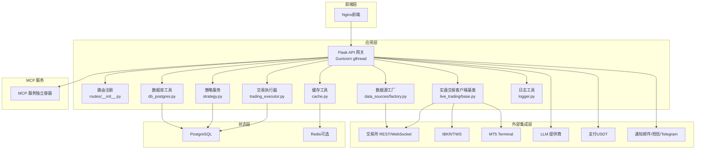
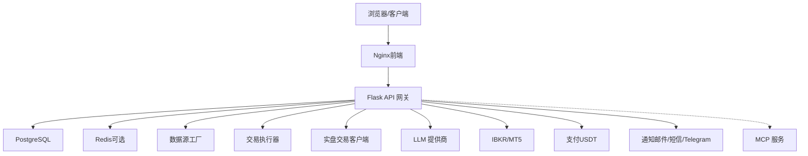
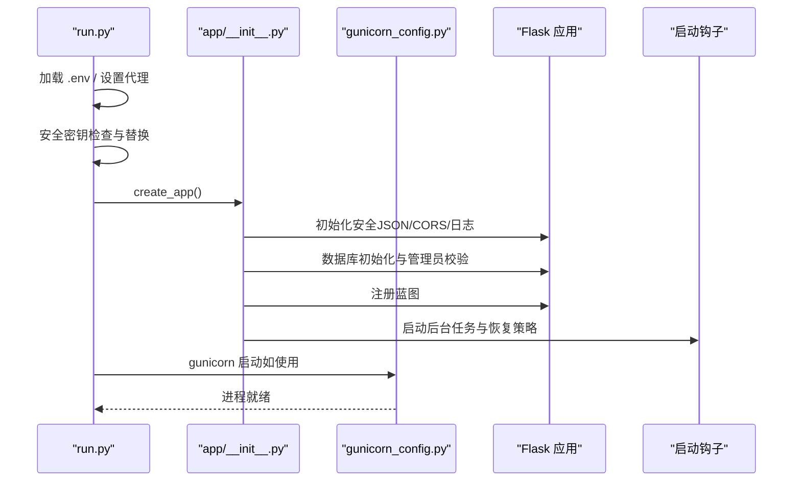
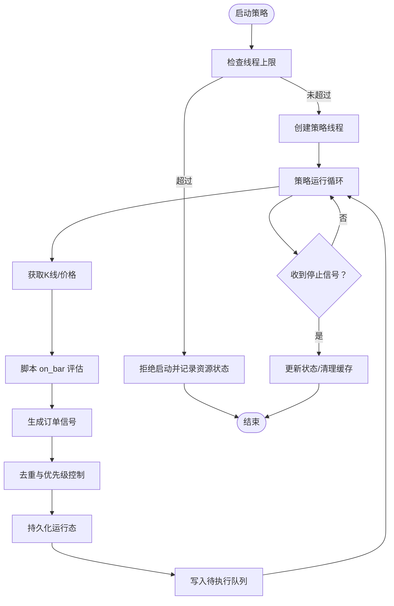
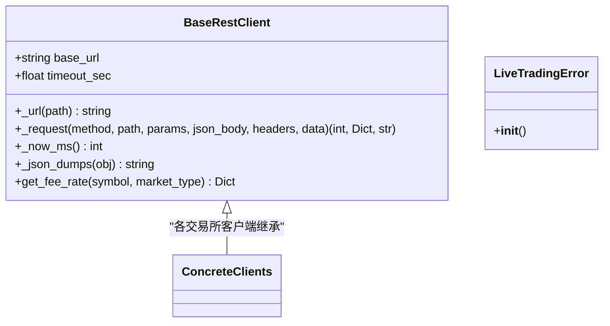
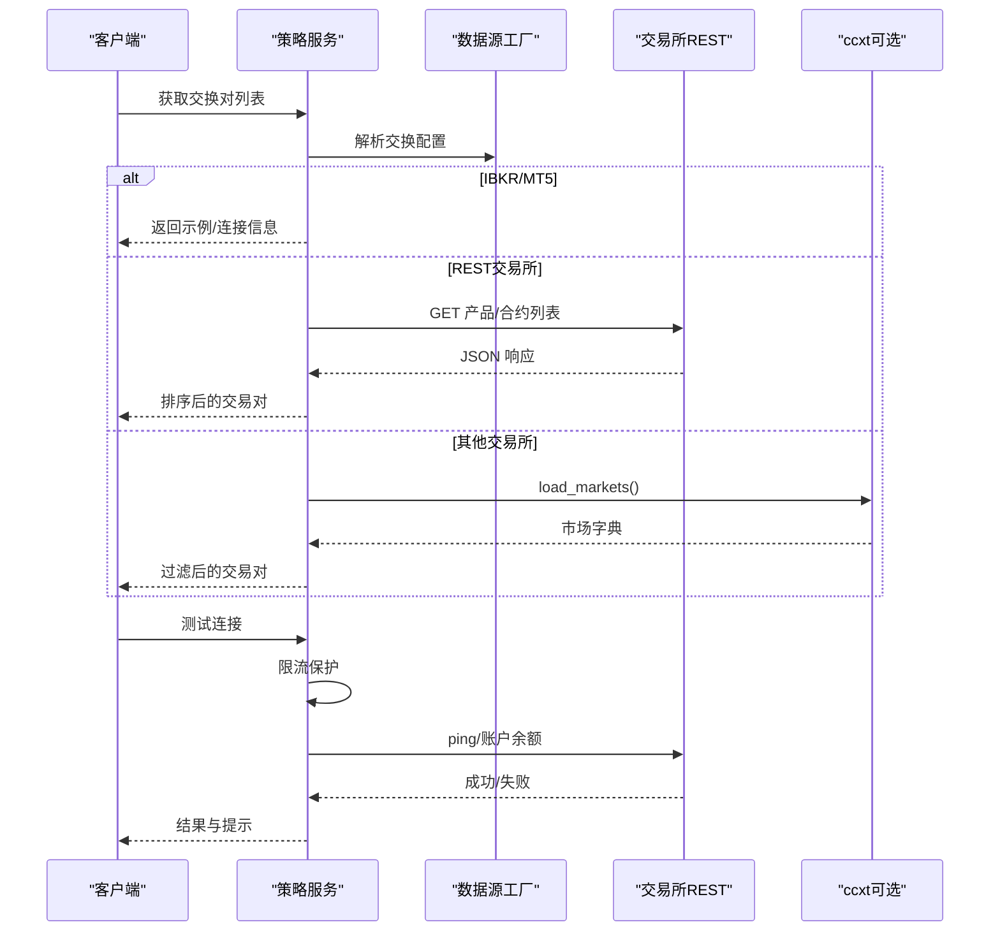
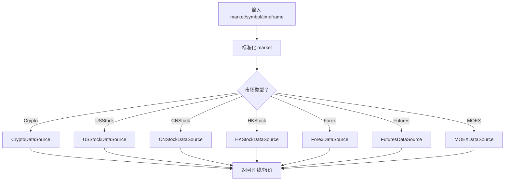
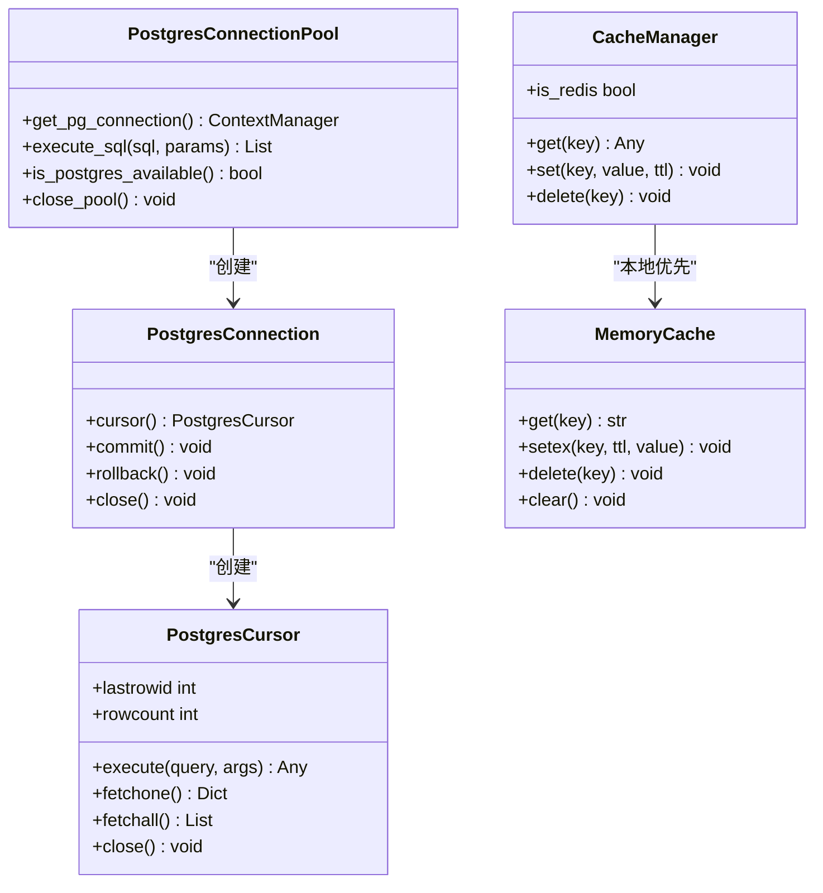
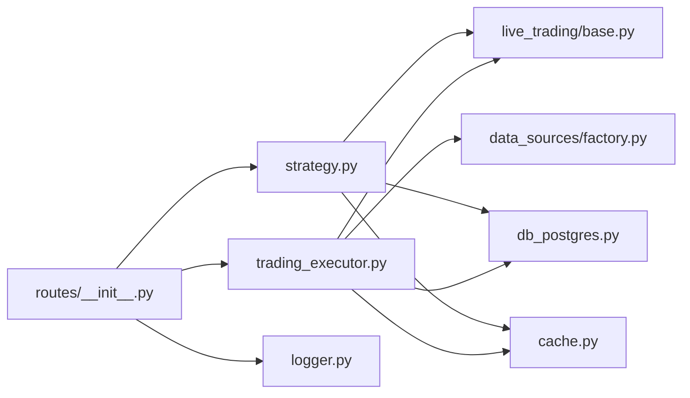

# 系统架构

<cite>
**本文引用的文件**
- [run.py](file://backend_api_python/run.py)
- [app/__init__.py](file://backend_api_python/app/__init__.py)
- [Dockerfile（后端）](file://backend_api_python/Dockerfile)
- [docker-compose.yml](file://docker-compose.yml)
- [Dockerfile（前端）](file://frontend/Dockerfile)
- [Dockerfile（MCP 服务）](file://mcp_server/Dockerfile)
- [settings.py](file://backend_api_python/app/config/settings.py)
- [routes/__init__.py](file://backend_api_python/app/routes/__init__.py)
- [gunicorn_config.py](file://backend_api_python/gunicorn_config.py)
- [db_postgres.py](file://backend_api_python/app/utils/db_postgres.py)
- [trading_executor.py](file://backend_api_python/app/services/trading_executor.py)
- [live_trading/base.py](file://backend_api_python/app/services/live_trading/base.py)
- [strategy.py](file://backend_api_python/app/services/strategy.py)
- [data_sources/factory.py](file://backend_api_python/app/data_sources/factory.py)
- [logger.py](file://backend_api_python/app/utils/logger.py)
- [cache.py](file://backend_api_python/app/utils/cache.py)
</cite>

## 目录
1. [引言](#引言)
2. [项目结构](#项目结构)
3. [核心组件](#核心组件)
4. [架构总览](#架构总览)
5. [详细组件分析](#详细组件分析)
6. [依赖分析](#依赖分析)
7. [性能考量](#性能考量)
8. [故障排查指南](#故障排查指南)
9. [结论](#结论)
10. [附录](#附录)

## 引言
QuantDinger 是一个面向量化交易与AI辅助决策的全栈系统，采用前后端分离与多层服务架构。系统以Flask作为API网关，承载认证、路由、策略编排、回测、交易执行、市场数据接入、AI分析与通知等功能；状态层采用PostgreSQL与Redis；外部集成覆盖主流交易所、经纪商、LLM提供商、支付与通知渠道。本文档从系统边界、架构模式、数据流与集成方式、技术决策与权衡、基础设施与可扩展性、部署拓扑、安全与监控等方面进行系统化阐述。

## 项目结构
- 前端层：Nginx容器提供静态资源服务，代理到后端API。
- 应用层：Flask后端（Gunicorn + gthread），负责路由注册、业务服务编排、策略执行与交易对接。
- 状态层：PostgreSQL（主数据库）、Redis（可选缓存）。
- 外部集成层：交易所REST/WebSocket、经纪商（IBKR/MT5）、LLM提供商、支付（USDT）、通知（邮件/短信/Telegram）。
- MCP服务：独立的MCP（Model Context Protocol）服务，用于AI代理能力扩展。

图表来源
- [docker-compose.yml:25-172](file://docker-compose.yml#L25-L172)
- [routes/__init__.py:7-58](file://backend_api_python/app/routes/__init__.py#L7-L58)
- [app/__init__.py:213-279](file://backend_api_python/app/__init__.py#L213-L279)
- [gunicorn_config.py:10-36](file://backend_api_python/gunicorn_config.py#L10-L36)
- [db_postgres.py:107-162](file://backend_api_python/app/utils/db_postgres.py#L107-L162)
- [cache.py:49-129](file://backend_api_python/app/utils/cache.py#L49-L129)
- [live_trading/base.py:95-168](file://backend_api_python/app/services/live_trading/base.py#L95-L168)
- [data_sources/factory.py:33-112](file://backend_api_python/app/data_sources/factory.py#L33-L112)
- [strategy.py:14-58](file://backend_api_python/app/services/strategy.py#L14-L58)

章节来源
- [docker-compose.yml:25-172](file://docker-compose.yml#L25-L172)
- [Dockerfile（后端）:1-62](file://backend_api_python/Dockerfile#L1-L62)
- [Dockerfile（前端）:1-25](file://frontend/Dockerfile#L1-L25)
- [Dockerfile（MCP 服务）:1-26](file://mcp_server/Dockerfile#L1-L26)

## 核心组件
- API网关（Flask + Gunicorn）
  - 应用工厂与安全JSON提供者，CORS与日志初始化，数据库初始化与管理员账户校验。
  - 启动钩子：挂载后台任务（待执行订单处理、组合监控、USDT订单处理、Polymarket任务、AI标定与反思）。
- 路由系统
  - 蓝图注册覆盖认证、用户、指标、策略、市场、AI、仪表盘、设置、组合、IBKR/MT5、全球市场、社区、快速交易、Polymarket、实验等。
- 数据库与缓存
  - PostgreSQL连接池（线程安全、健康检查、超时等待与回退）、占位符兼容转换、事务封装。
  - 缓存管理器：本地内存优先，可选Redis，自动降级。
- 交易执行与实盘
  - 策略执行器：策略线程管理、K线与信号生成、去重与优先级控制、脚本运行时上下文、位置与资金计算。
  - 实盘客户端基类：请求封装、SSL验证解析、错误类型化。
- 策略与回测
  - 策略服务：运行中策略查询、交换对列表获取、连接测试（含Binance权限提示）、显示参数构建、JSON序列化。
- 数据源与市场数据
  - 数据源工厂：按市场类型（加密、美股、港股、A股、外汇、商品、MOEX）分发具体数据源，统一K线与报价接口。
- 配置与运行
  - 配置类：主机、端口、调试、日志、速率限制、功能开关等。
  - 运行入口：加载.env、代理环境、安全密钥检查、gunicorn启动。

章节来源
- [app/__init__.py:15-279](file://backend_api_python/app/__init__.py#L15-L279)
- [routes/__init__.py:7-58](file://backend_api_python/app/routes/__init__.py#L7-L58)
- [db_postgres.py:107-508](file://backend_api_python/app/utils/db_postgres.py#L107-L508)
- [cache.py:49-129](file://backend_api_python/app/utils/cache.py#L49-L129)
- [trading_executor.py:37-800](file://backend_api_python/app/services/trading_executor.py#L37-L800)
- [live_trading/base.py:95-168](file://backend_api_python/app/services/live_trading/base.py#L95-L168)
- [strategy.py:14-800](file://backend_api_python/app/services/strategy.py#L14-L800)
- [data_sources/factory.py:33-178](file://backend_api_python/app/data_sources/factory.py#L33-L178)
- [settings.py:66-99](file://backend_api_python/app/config/settings.py#L66-L99)
- [run.py:96-134](file://backend_api_python/run.py#L96-L134)

## 架构总览
系统采用“API网关 + 多服务编排”的分层架构：
- 前端层：Nginx静态托管 + 反向代理，集中式健康检查与端口暴露。
- 应用层：Flask单体应用，通过蓝图组织功能域；Gunicorn gthread提升并发稳定性；后台任务在应用工厂内启动，保证幂等与锁协调。
- 状态层：PostgreSQL作为主存储，Redis作为可选缓存；连接池参数可调，满足高并发与长事务需求。
- 外部集成：交易所REST/WebSocket直连、IBKR/MT5终端、LLM提供商、支付与通知通道。
- MCP服务：独立容器，通过环境变量暴露传输协议与端口，便于AI代理扩展。

图表来源
- [docker-compose.yml:133-159](file://docker-compose.yml#L133-L159)
- [routes/__init__.py:7-58](file://backend_api_python/app/routes/__init__.py#L7-L58)
- [app/__init__.py:255-279](file://backend_api_python/app/__init__.py#L255-L279)
- [gunicorn_config.py:10-36](file://backend_api_python/gunicorn_config.py#L10-L36)

## 详细组件分析

### 组件A：API网关与启动流程
- 启动入口：加载.env、代理环境注入、安全密钥自动替换、打印服务地址、Flask开发服务器或Gunicorn。
- 应用工厂：安全JSON提供者（NaN/Inf转None）、CORS、日志、ib_insync补丁、数据库初始化与管理员校验、蓝图注册、启动钩子。
- 启动钩子：待执行订单工作线程、组合监控、USDT订单工作线程、Polymarket工作线程、AI标定与反思、策略恢复。

图表来源
- [run.py:96-134](file://backend_api_python/run.py#L96-L134)
- [app/__init__.py:213-279](file://backend_api_python/app/__init__.py#L213-L279)
- [gunicorn_config.py:10-36](file://backend_api_python/gunicorn_config.py#L10-L36)

章节来源
- [run.py:96-134](file://backend_api_python/run.py#L96-L134)
- [app/__init__.py:213-279](file://backend_api_python/app/__init__.py#L213-L279)
- [gunicorn_config.py:10-36](file://backend_api_python/gunicorn_config.py#L10-L36)

### 组件B：交易执行器与策略线程
- 策略线程管理：最大线程数限制、清理僵尸线程、失败原因记录、控制台输出与运行日志。
- K线与信号：K线服务、脚本上下文构建、订单生成、去重与优先级、持久化运行态。
- 位置与资金：根据初始资本与当前持仓计算权益，支持趋势网格等机器人参数。
- 数据一致性：数据库字段动态补齐（如最高/最低价），保障历史数据兼容。

图表来源
- [trading_executor.py:395-800](file://backend_api_python/app/services/trading_executor.py#L395-L800)

章节来源
- [trading_executor.py:37-800](file://backend_api_python/app/services/trading_executor.py#L37-L800)

### 组件C：实盘交易客户端基类
- 请求封装：统一URL拼接、超时、SSL验证解析（支持系统CA、PEM路径、certifi回退、禁用标志）。
- 错误处理：非ASCII头部编码、TLS验证失败、JSON解析失败等场景的LiveTradingError。
- 扩展点：fee查询等抽象方法，便于各交易所客户端实现。

图表来源
- [live_trading/base.py:95-168](file://backend_api_python/app/services/live_trading/base.py#L95-L168)

章节来源
- [live_trading/base.py:95-168](file://backend_api_python/app/services/live_trading/base.py#L95-L168)

### 组件D：策略服务与连接测试
- 运行中策略：查询运行中策略ID与类型，支持恢复策略。
- 交换对列表：针对IBKR/MT5与多家交易所REST接口，返回可用交易对清单。
- 连接测试：限流保护，自动探测市场类型，Binance权限提示（IP白名单、产品类型、演示模式），返回私有数据示例。
- 参数展示：根据机器人类型构建显示参数（网格、趋势、DCA等）。

图表来源
- [strategy.py:59-291](file://backend_api_python/app/services/strategy.py#L59-L291)
- [data_sources/factory.py:114-178](file://backend_api_python/app/data_sources/factory.py#L114-L178)

章节来源
- [strategy.py:14-800](file://backend_api_python/app/services/strategy.py#L14-L800)
- [data_sources/factory.py:33-178](file://backend_api_python/app/data_sources/factory.py#L33-L178)

### 组件E：数据源工厂与市场数据
- 市场归一：别名映射与大小写标准化，确保调用侧传入的market字符串一致。
- 源分发：按Crypto/USStock/CNStock/HKStock/Forex/Futures/MOEX分发至具体数据源。
- 快捷接口：统一K线与实时报价入口，内部排序与错误处理。

图表来源
- [data_sources/factory.py:33-112](file://backend_api_python/app/data_sources/factory.py#L33-L112)

章节来源
- [data_sources/factory.py:33-178](file://backend_api_python/app/data_sources/factory.py#L33-L178)

### 组件F：数据库与缓存
- PostgreSQL连接池：最小/最大连接、获取超时、健康检查、连接选项（时区、keepalives）。
- 占位符兼容：? -> %s、INSERT OR IGNORE兼容、RETURNING id回退与保存点。
- 缓存管理器：本地内存优先，可选Redis，自动降级，统一get/set/delete接口。

图表来源
- [db_postgres.py:107-508](file://backend_api_python/app/utils/db_postgres.py#L107-L508)
- [cache.py:49-129](file://backend_api_python/app/utils/cache.py#L49-L129)

章节来源
- [db_postgres.py:107-508](file://backend_api_python/app/utils/db_postgres.py#L107-L508)
- [cache.py:49-129](file://backend_api_python/app/utils/cache.py#L49-L129)

## 依赖分析
- 组件耦合
  - API网关对路由、服务、工具模块高度聚合；服务间通过数据库与缓存解耦。
  - 交易执行器与策略服务强相关，依赖K线服务与脚本运行时。
  - 实盘客户端基类被各交易所客户端继承，统一请求与错误处理。
- 外部依赖
  - PostgreSQL/Redis：状态存储与缓存。
  - 交易所REST/WebSocket：实时行情与下单。
  - IBKR/MT5：桌面终端直连。
  - LLM/Payment/Notification：第三方服务集成。
- 循环依赖
  - 未发现直接循环导入；服务通过蓝图与工厂模式解耦。

图表来源
- [routes/__init__.py:7-58](file://backend_api_python/app/routes/__init__.py#L7-L58)
- [strategy.py:14-58](file://backend_api_python/app/services/strategy.py#L14-L58)
- [trading_executor.py:25-32](file://backend_api_python/app/services/trading_executor.py#L25-L32)
- [data_sources/factory.py:33-67](file://backend_api_python/app/data_sources/factory.py#L33-L67)
- [live_trading/base.py:95-168](file://backend_api_python/app/services/live_trading/base.py#L95-L168)
- [db_postgres.py:107-162](file://backend_api_python/app/utils/db_postgres.py#L107-L162)
- [cache.py:49-129](file://backend_api_python/app/utils/cache.py#L49-L129)
- [logger.py:9-63](file://backend_api_python/app/utils/logger.py#L9-L63)

章节来源
- [routes/__init__.py:7-58](file://backend_api_python/app/routes/__init__.py#L7-L58)
- [strategy.py:14-58](file://backend_api_python/app/services/strategy.py#L14-L58)
- [trading_executor.py:25-32](file://backend_api_python/app/services/trading_executor.py#L25-L32)
- [data_sources/factory.py:33-67](file://backend_api_python/app/data_sources/factory.py#L33-L67)
- [live_trading/base.py:95-168](file://backend_api_python/app/services/live_trading/base.py#L95-L168)
- [db_postgres.py:107-162](file://backend_api_python/app/utils/db_postgres.py#L107-L162)
- [cache.py:49-129](file://backend_api_python/app/utils/cache.py#L49-L129)
- [logger.py:9-63](file://backend_api_python/app/utils/logger.py#L9-L63)

## 性能考量
- 并发模型
  - Gunicorn gthread：单进程多线程，降低fork开销，适合I/O密集型；可通过workers与threads参数扩展吞吐。
  - 策略线程上限：避免过多线程导致“无法启动新线程”与OOM。
- 数据库
  - 连接池参数：DB_POOL_MIN/DB_POOL_MAX/ACQUIRE_TIMEOUT/HEALTH_CHECK可调，适配高并发与长事务。
  - 占位符兼容与事务封装：减少SQL差异带来的错误与回滚风险。
- 缓存
  - 本地内存缓存优先，Redis可选；自动降级避免单点故障。
- 网络与代理
  - 统一代理注入与中国金融域名直连豁免，减少海外代理绕行。
- 日志
  - 文件轮转与级别过滤，减少磁盘与I/O压力。

## 故障排查指南
- 启动与安全
  - SECRET_KEY默认值：生产环境必须替换，否则容器不会启动。
  - 端口与网络：确认compose端口映射与容器健康检查。
- 数据库
  - 连接池耗尽：增大DB_POOL_MAX或优化慢查询；开启健康检查与超时回退。
  - 占位符错误：检查SQL兼容性与RETURNING回退逻辑。
- 交易执行
  - 策略线程上限：调整STRATEGY_MAX_THREADS或停止部分策略。
  - 去重与优先级：确认信号时间戳与去重窗口设置。
- 实盘连接
  - SSL验证：设置LIVE_TRADING_CA_BUNDLE或系统CA；生产禁用证书校验仅限开发。
  - Binance权限：核对IP白名单、产品类型与演示/主网密钥。
- 缓存
  - Redis不可用：自动降级至内存缓存；检查ENABLE_CACHE与Redis配置。
- 日志
  - 文件轮转与级别：调整LOG_LEVEL与文件大小；关注USDT对账与计费模块INFO级别。

章节来源
- [run.py:109-120](file://backend_api_python/run.py#L109-L120)
- [docker-compose.yml:14-15](file://docker-compose.yml#L14-L15)
- [db_postgres.py:184-235](file://backend_api_python/app/utils/db_postgres.py#L184-L235)
- [trading_executor.py:413-424](file://backend_api_python/app/services/trading_executor.py#L413-L424)
- [live_trading/base.py:34-79](file://backend_api_python/app/services/live_trading/base.py#L34-L79)
- [strategy.py:506-540](file://backend_api_python/app/services/strategy.py#L506-L540)
- [cache.py:77-98](file://backend_api_python/app/utils/cache.py#L77-L98)
- [logger.py:9-48](file://backend_api_python/app/utils/logger.py#L9-L48)

## 结论
QuantDinger通过清晰的分层架构与模块化设计，在Flask单体应用中实现了策略、回测、交易执行、市场数据与外部集成的统一编排。PostgreSQL与可选Redis提供了稳定的状态与缓存能力；Gunicorn gthread兼顾了并发与稳定性；严格的启动与运行期安全检查、连接池与缓存降级策略提升了系统的鲁棒性。结合容器化与Compose编排，系统具备良好的可扩展性与可运维性。

## 附录
- 基础设施要求
  - 后端：Python 3.12、psycopg2（PostgreSQL）、可选redis（缓存）、gunicorn。
  - 前端：Nginx镜像，静态资源预构建。
  - 数据库：PostgreSQL 16，Redis 7（可选）。
- 部署拓扑
  - 单机：docker-compose一键启动，前端Nginx反代后端API。
  - 云原生：容器镜像可部署于平台（如Railway），通过环境变量配置数据库、缓存与并发参数。
- 安全与监控
  - 安全：强制替换SECRET_KEY、SSL验证策略、请求头ASCII限制、限流与速率限制配置。
  - 监控：容器健康检查、日志轮转、策略运行日志与UI心跳。
- 灾难恢复
  - 数据库备份与连接池健康检查；缓存降级与策略恢复机制减少停机影响。