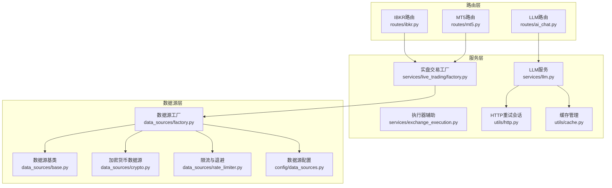
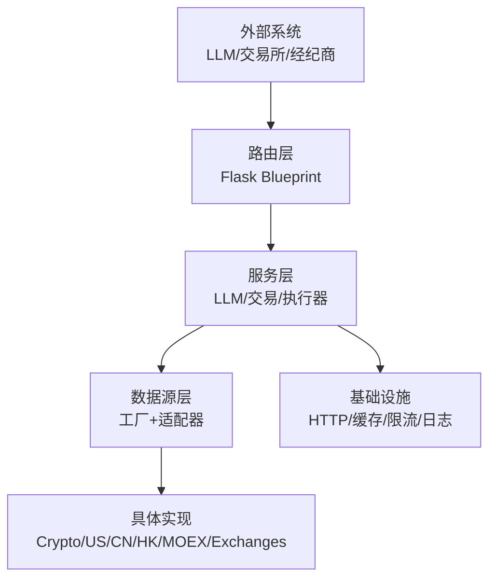
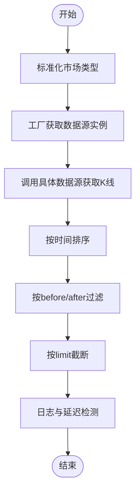
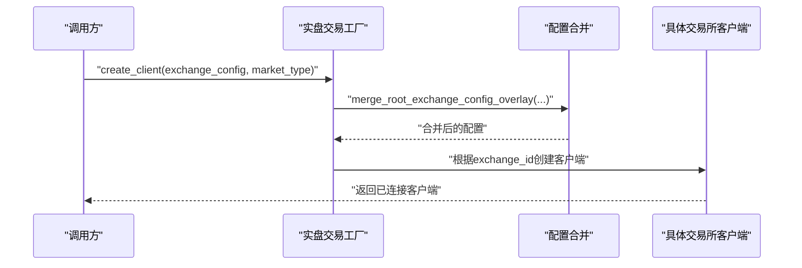
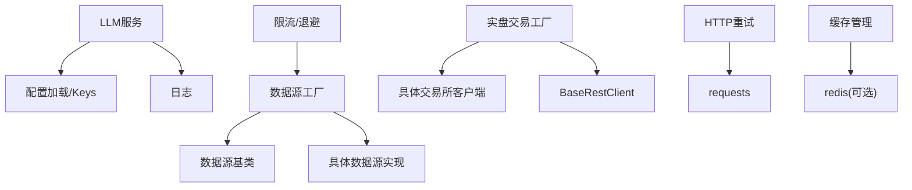

# 集成架构

<cite>
**本文引用的文件**
- [llm.py](file://backend_api_python/app/services/llm.py)
- [factory.py](file://backend_api_python/app/data_sources/factory.py)
- [base.py](file://backend_api_python/app/data_sources/base.py)
- [data_sources.py](file://backend_api_python/app/config/data_sources.py)
- [rate_limiter.py](file://backend_api_python/app/data_sources/rate_limiter.py)
- [http.py](file://backend_api_python/app/utils/http.py)
- [cache.py](file://backend_api_python/app/utils/cache.py)
- [exchange_execution.py](file://backend_api_python/app/services/exchange_execution.py)
- [factory.py](file://backend_api_python/app/services/live_trading/factory.py)
- [base.py](file://backend_api_python/app/services/live_trading/base.py)
- [binance.py](file://backend_api_python/app/services/live_trading/binance.py)
- [ibkr.py](file://backend_api_python/app/routes/ibkr.py)
- [mt5.py](file://backend_api_python/app/routes/mt5.py)
- [logger.py](file://backend_api_python/app/utils/logger.py)
</cite>

## 目录
1. [引言](#引言)
2. [项目结构](#项目结构)
3. [核心组件](#核心组件)
4. [架构总览](#架构总览)
5. [详细组件分析](#详细组件分析)
6. [依赖分析](#依赖分析)
7. [性能考虑](#性能考虑)
8. [故障排查指南](#故障排查指南)
9. [结论](#结论)
10. [附录](#附录)

## 引言
本文件面向QuantDinger的集成架构，系统性阐述外部系统集成的设计模式、接口抽象与适配器模式，覆盖LLM提供商集成、交易所API对接与经纪商接口适配、数据源工厂模式、执行器插件化设计与扩展点管理，并包含第三方服务集成、认证授权与API限流处理、消息队列与事件驱动架构、异步处理机制、集成测试策略、故障转移与监控告警方案等主题。目标是帮助开发者与运维人员快速理解并高效扩展系统。

## 项目结构
后端采用Python Flask应用，核心模块围绕“服务层”“数据源层”“路由层”“工具层”组织，形成清晰的分层与职责分离：
- 服务层：封装LLM服务、实盘交易客户端、执行器、缓存、HTTP会话、指标与分析等能力
- 数据源层：抽象统一的数据源接口，通过工厂模式按市场类型动态选择具体实现
- 路由层：对外暴露REST API，连接前端与内部服务
- 工具层：日志、缓存、HTTP重试、限流、配置加载等基础设施



图表来源
- [llm.py:70-122](file://backend_api_python/app/services/llm.py#L70-L122)
- [factory.py:33-111](file://backend_api_python/app/data_sources/factory.py#L33-L111)
- [base.py:28-66](file://backend_api_python/app/data_sources/base.py#L28-L66)
- [data_sources.py:26-55](file://backend_api_python/app/config/data_sources.py#L26-L55)
- [rate_limiter.py:109-164](file://backend_api_python/app/data_sources/rate_limiter.py#L109-L164)
- [http.py:9-41](file://backend_api_python/app/utils/http.py#L9-L41)
- [cache.py:49-99](file://backend_api_python/app/utils/cache.py#L49-L99)
- [exchange_execution.py:118-148](file://backend_api_python/app/services/exchange_execution.py#L118-L148)
- [ibkr.py:31-110](file://backend_api_python/app/routes/ibkr.py#L31-L110)
- [mt5.py:52-153](file://backend_api_python/app/routes/mt5.py#L52-L153)

章节来源
- [llm.py:70-122](file://backend_api_python/app/services/llm.py#L70-L122)
- [factory.py:33-111](file://backend_api_python/app/data_sources/factory.py#L33-L111)
- [base.py:28-66](file://backend_api_python/app/data_sources/base.py#L28-L66)
- [data_sources.py:26-55](file://backend_api_python/app/config/data_sources.py#L26-L55)
- [rate_limiter.py:109-164](file://backend_api_python/app/data_sources/rate_limiter.py#L109-L164)
- [http.py:9-41](file://backend_api_python/app/utils/http.py#L9-L41)
- [cache.py:49-99](file://backend_api_python/app/utils/cache.py#L49-L99)
- [exchange_execution.py:118-148](file://backend_api_python/app/services/exchange_execution.py#L118-L148)
- [ibkr.py:31-110](file://backend_api_python/app/routes/ibkr.py#L31-L110)
- [mt5.py:52-153](file://backend_api_python/app/routes/mt5.py#L52-L153)

## 核心组件
- LLM服务：统一多提供商（OpenRouter、OpenAI、Google Gemini、DeepSeek、Grok、Minimax、自定义）接入，支持自动探测、模型归一化、降级与替代提供商切换、安全JSON解析与错误提示
- 数据源工厂：按市场类型（Crypto、USStock、Forex、Futures、CNStock、HKStock、MOEX）选择具体实现，提供便捷的K线与实时报价获取
- 实盘交易工厂：集中创建各交易所REST客户端（Binance、OKX、Bitget、Bybit、Coinbase、Kraken、KuCoin、Gate、Deepcoin、HTX）及传统经纪商（IBKR、MT5），支持演示/仿真模式、参数合并与校验
- 执行器辅助：安全加载策略配置、凭证解密、交换配置合并与脱敏日志
- 基础设施：HTTP重试会话、缓存管理（内存/Redis）、限流与指数退避、日志配置

章节来源
- [llm.py:70-122](file://backend_api_python/app/services/llm.py#L70-L122)
- [factory.py:33-111](file://backend_api_python/app/data_sources/factory.py#L33-L111)
- [factory.py:126-285](file://backend_api_python/app/services/live_trading/factory.py#L126-L285)
- [base.py:95-167](file://backend_api_python/app/services/live_trading/base.py#L95-L167)
- [exchange_execution.py:118-148](file://backend_api_python/app/services/exchange_execution.py#L118-L148)
- [http.py:9-41](file://backend_api_python/app/utils/http.py#L9-L41)
- [cache.py:49-99](file://backend_api_python/app/utils/cache.py#L49-L99)
- [rate_limiter.py:109-164](file://backend_api_python/app/data_sources/rate_limiter.py#L109-L164)
- [logger.py:9-48](file://backend_api_python/app/utils/logger.py#L9-L48)

## 架构总览
系统采用“路由-服务-数据源/适配器”的分层架构，结合工厂模式与配置驱动，实现多提供商、多市场的可插拔集成。LLM服务作为AI能力入口，数据源层负责市场数据聚合，实盘交易层通过适配器对接不同交易所与经纪商，基础设施层提供限流、缓存与HTTP重试保障稳定性。



图表来源
- [llm.py:70-122](file://backend_api_python/app/services/llm.py#L70-L122)
- [factory.py:33-111](file://backend_api_python/app/data_sources/factory.py#L33-L111)
- [factory.py:126-285](file://backend_api_python/app/services/live_trading/factory.py#L126-L285)
- [http.py:9-41](file://backend_api_python/app/utils/http.py#L9-L41)
- [cache.py:49-99](file://backend_api_python/app/utils/cache.py#L49-L99)
- [rate_limiter.py:109-164](file://backend_api_python/app/data_sources/rate_limiter.py#L109-L164)
- [logger.py:9-48](file://backend_api_python/app/utils/logger.py#L9-L48)

## 详细组件分析

### LLM提供商集成（多提供商适配与自动探测）
- 设计要点
  - 提供商枚举与配置表，支持OpenRouter、OpenAI、Google、DeepSeek、Grok、Minimax、自定义
  - 自动探测：优先级顺序（DeepSeek > Grok > MiniMax > OpenAI > Google > OpenRouter），依据API Key存在性选择
  - 模型归一化：将OpenRouter风格的模型名转换为目标提供商格式，避免跨提供商错误传递
  - 降级与替代：当前提供商403/402时尝试替代提供商；同一提供商内支持主备模型链路
  - 安全调用：统一JSON输出请求、鲁棒解析与回退结构、错误信息增强与提示
- 关键流程（调用LLM API）

```mermaid
sequenceDiagram
participant Caller as "调用方"
participant LLM as "LLMService"
participant Prov as "提供商适配器"
participant Alt as "替代提供商"
Caller->>LLM : "call_llm_api(messages, model, ...)"
LLM->>LLM : "检测/归一化模型与提供商"
LLM->>Prov : "构造请求并发送"
Prov-->>LLM : "响应或HTTP错误"
alt "403/402/404/429"
LLM->>Alt : "尝试替代提供商"
Alt-->>LLM : "成功或失败"
end
LLM-->>Caller : "返回文本/抛出异常"
```

图表来源
- [llm.py:368-524](file://backend_api_python/app/services/llm.py#L368-L524)
- [llm.py:526-562](file://backend_api_python/app/services/llm.py#L526-L562)

章节来源
- [llm.py:19-122](file://backend_api_python/app/services/llm.py#L19-L122)
- [llm.py:368-562](file://backend_api_python/app/services/llm.py#L368-L562)

### 数据源工厂模式与适配器（多市场/多提供商）
- 设计要点
  - 工厂类维护市场到具体数据源的映射，支持别名标准化与向后兼容
  - 统一接口：K线与实时报价，过滤与截断逻辑，时间范围计算，延迟检测
  - 配置驱动：超时、重试次数、退避系数、CCXT默认交易所、代理等
  - 限流与退避：针对不同来源的限流器实例，指数退避装饰器
- 关键流程（获取K线）



图表来源
- [factory.py:114-148](file://backend_api_python/app/data_sources/factory.py#L114-L148)
- [base.py:106-140](file://backend_api_python/app/data_sources/base.py#L106-L140)

章节来源
- [factory.py:33-111](file://backend_api_python/app/data_sources/factory.py#L33-L111)
- [base.py:28-180](file://backend_api_python/app/data_sources/base.py#L28-L180)
- [data_sources.py:26-173](file://backend_api_python/app/config/data_sources.py#L26-L173)
- [rate_limiter.py:109-273](file://backend_api_python/app/data_sources/rate_limiter.py#L109-L273)

### 交易所API对接与适配器（实盘交易工厂）
- 设计要点
  - 工厂集中创建各交易所REST客户端，支持演示/仿真模式、URL覆盖、参数合并
  - 传统经纪商（IBKR）与外汇（MT5）通过专用工厂创建，严格参数校验与错误提示
  - 基类提供统一请求封装、TLS证书验证策略、错误处理与序列化
- 关键流程（创建客户端）



图表来源
- [factory.py:76-120](file://backend_api_python/app/services/live_trading/factory.py#L76-L120)
- [factory.py:126-285](file://backend_api_python/app/services/live_trading/factory.py#L126-L285)
- [base.py:95-167](file://backend_api_python/app/services/live_trading/base.py#L95-L167)

章节来源
- [factory.py:126-285](file://backend_api_python/app/services/live_trading/factory.py#L126-L285)
- [base.py:95-167](file://backend_api_python/app/services/live_trading/base.py#L95-L167)
- [binance.py:24-50](file://backend_api_python/app/services/live_trading/binance.py#L24-L50)

### 经纪商接口适配（IBKR与MT5）
- IBKR路由：连接状态查询、连接/断开、账户信息、持仓、订单、下单、报价等REST接口
- MT5路由：连接状态查询、连接/断开、账户信息、持仓、订单、符号、下单、平仓、撤单、报价等REST接口
- 本地桌面限制：云环境禁止MT5本地桌面连接，提供明确拒绝信息

章节来源
- [ibkr.py:31-383](file://backend_api_python/app/routes/ibkr.py#L31-L383)
- [mt5.py:52-439](file://backend_api_python/app/routes/mt5.py#L52-L439)

### 执行器插件化设计与扩展点管理
- 执行器辅助：从数据库加载策略配置，合并用户凭证与策略级配置，安全脱敏日志
- 扩展点：通过配置字段（exchange_config、trading_config、market_type、leverage、execution_mode、market_category）控制执行行为
- 插件化：交易所客户端以工厂方式注册，新增交易所只需在工厂中添加分支与适配器

章节来源
- [exchange_execution.py:59-148](file://backend_api_python/app/services/exchange_execution.py#L59-L148)
- [factory.py:126-285](file://backend_api_python/app/services/live_trading/factory.py#L126-L285)

### 第三方服务集成、认证授权与API限流
- 认证授权
  - 交易所REST：HMAC签名、时间同步、请求头规范、证书验证策略
  - IBKR/MT5：本地桌面连接要求、客户端ID冲突提示、云环境限制
- API限流
  - 数据源层：针对不同来源的限流器实例与指数退避装饰器
  - HTTP层：全局重试会话，统一状态码重试策略
- 配置驱动：超时、重试、退避、代理、CA证书路径等

章节来源
- [base.py:34-79](file://backend_api_python/app/services/live_trading/base.py#L34-L79)
- [binance.py:166-200](file://backend_api_python/app/services/live_trading/binance.py#L166-L200)
- [rate_limiter.py:109-273](file://backend_api_python/app/data_sources/rate_limiter.py#L109-L273)
- [http.py:9-41](file://backend_api_python/app/utils/http.py#L9-L41)
- [data_sources.py:102-173](file://backend_api_python/app/config/data_sources.py#L102-L173)

### 消息队列、事件驱动架构与异步处理
- 当前实现：策略信号进入“挂单队列”（paper模式），真实执行未在此模块实现
- 建议：引入消息队列（如RabbitMQ/Kafka/Pulsar）与工作进程，实现事件驱动与异步处理
- 适配：在执行器辅助与路由层之间增加消息发布/订阅，保证幂等与重试

章节来源
- [exchange_execution.py:1-21](file://backend_api_python/app/services/exchange_execution.py#L1-L21)

## 依赖分析
- 组件耦合
  - LLM服务与配置加载、API Keys、日志强相关，但避免循环导入
  - 数据源工厂与具体实现松耦合，通过基类接口隔离
  - 实盘交易工厂与具体客户端强耦合，但通过基类约束统一行为
- 外部依赖
  - HTTP：requests、urllib3重试
  - 缓存：redis（可选）、内存缓存
  - 限流：随机抖动、指数退避
  - 交易所：CCXT（加密货币）、ib_insync（IBKR）、MetaTrader5（MT5）



图表来源
- [llm.py:12-16](file://backend_api_python/app/services/llm.py#L12-L16)
- [factory.py:7-11](file://backend_api_python/app/data_sources/factory.py#L7-L11)
- [base.py:5-11](file://backend_api_python/app/data_sources/base.py#L5-L11)
- [factory.py:18-40](file://backend_api_python/app/services/live_trading/factory.py#L18-L40)
- [base.py:18-21](file://backend_api_python/app/services/live_trading/base.py#L18-L21)
- [http.py:4-6](file://backend_api_python/app/utils/http.py#L4-L6)
- [cache.py:78-98](file://backend_api_python/app/utils/cache.py#L78-L98)
- [rate_limiter.py:109-164](file://backend_api_python/app/data_sources/rate_limiter.py#L109-L164)

章节来源
- [llm.py:12-16](file://backend_api_python/app/services/llm.py#L12-L16)
- [factory.py:7-11](file://backend_api_python/app/data_sources/factory.py#L7-L11)
- [base.py:5-11](file://backend_api_python/app/data_sources/base.py#L5-L11)
- [factory.py:18-40](file://backend_api_python/app/services/live_trading/factory.py#L18-L40)
- [base.py:18-21](file://backend_api_python/app/services/live_trading/base.py#L18-L21)
- [http.py:4-6](file://backend_api_python/app/utils/http.py#L4-L6)
- [cache.py:78-98](file://backend_api_python/app/utils/cache.py#L78-L98)
- [rate_limiter.py:109-164](file://backend_api_python/app/data_sources/rate_limiter.py#L109-L164)

## 性能考虑
- 限流与退避：为不同来源配置独立限流器，指数退避降低被限风险
- HTTP复用：全局重试会话减少连接开销
- 缓存策略：内存缓存优先，Redis可选，按需启用
- 日志级别：生产环境降低噪声，保留关键模块INFO级别
- 时间同步：交易所客户端进行服务器时间对齐，避免签名错误

章节来源
- [rate_limiter.py:109-273](file://backend_api_python/app/data_sources/rate_limiter.py#L109-L273)
- [http.py:9-41](file://backend_api_python/app/utils/http.py#L9-L41)
- [cache.py:49-99](file://backend_api_python/app/utils/cache.py#L49-L99)
- [logger.py:9-48](file://backend_api_python/app/utils/logger.py#L9-L48)
- [binance.py:173-192](file://backend_api_python/app/services/live_trading/binance.py#L173-L192)

## 故障排查指南
- LLM调用失败
  - 检查API Key配置与提供商选择，查看替代提供商提示
  - 开启JSON模式与回退模型，关注403/402/404/429错误含义
- 数据源异常
  - 核对市场类型别名与标准化结果
  - 查看延迟检测日志，确认K线最新时间与阈值
- 交易所连接问题
  - IBKR：确认TWS/Gateway运行与客户端ID唯一性
  - MT5：云环境限制、Windows平台要求、终端路径与凭据
- 证书与网络
  - 设置LIVE_TRADING_CA_BUNDLE或禁用验证（开发环境）
  - 配置代理与系统CA路径

章节来源
- [llm.py:480-524](file://backend_api_python/app/services/llm.py#L480-L524)
- [base.py:142-179](file://backend_api_python/app/data_sources/base.py#L142-L179)
- [ibkr.py:100-110](file://backend_api_python/app/routes/ibkr.py#L100-L110)
- [mt5.py:93-153](file://backend_api_python/app/routes/mt5.py#L93-L153)
- [base.py:34-79](file://backend_api_python/app/services/live_trading/base.py#L34-L79)

## 结论
QuantDinger通过工厂模式与适配器实现了多提供商、多市场的可插拔集成；LLM服务提供了统一的多提供商接入与稳健的错误处理；数据源层与实盘交易层分别以配置驱动与工厂创建的方式，支撑了广泛的外部系统对接。建议在现有基础上引入消息队列与事件驱动架构，进一步提升系统的异步处理能力与扩展性。

## 附录
- 集成测试策略
  - 单元测试：针对LLM服务的提供商选择、模型归一化、错误处理
  - 集成测试：数据源工厂与具体实现的K线/报价一致性、限流与退避效果
  - 端到端测试：IBKR/MT5路由连通性、下单与撤单流程
- 故障转移与监控告警
  - 建议：基于日志与指标（延迟、错误率、响应时间）建立告警；在LLM与交易所层增加熔断与降级策略
- 扩展建议
  - 新增交易所：在实盘交易工厂添加分支与适配器
  - 新增数据源：继承基类并实现统一接口
  - 异步化：引入消息队列与工作进程，策略信号异步执行