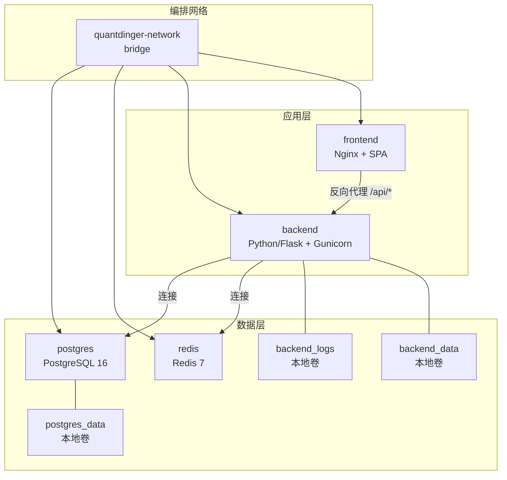
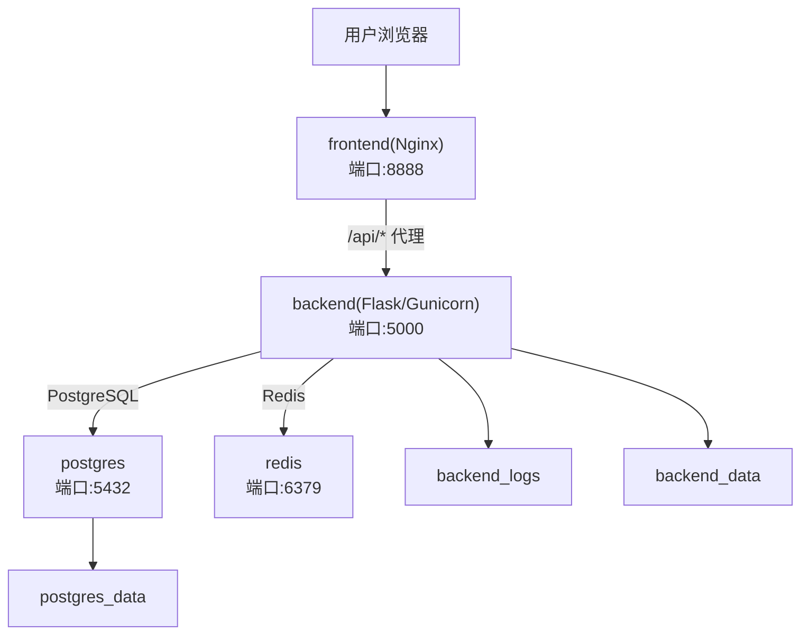
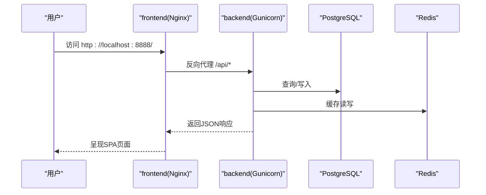
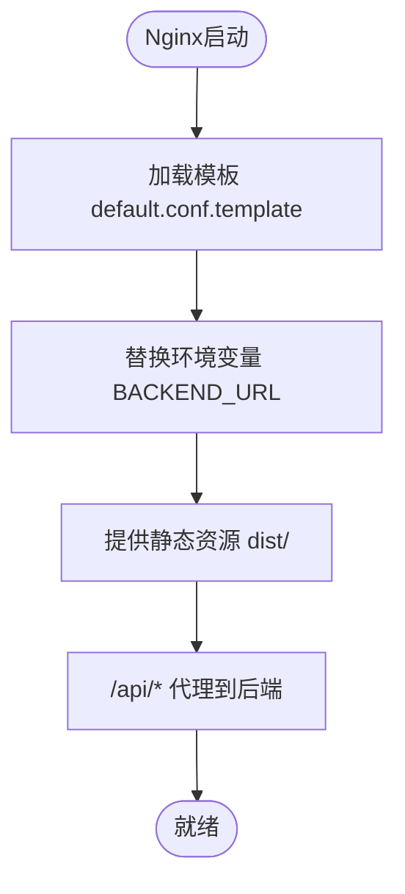
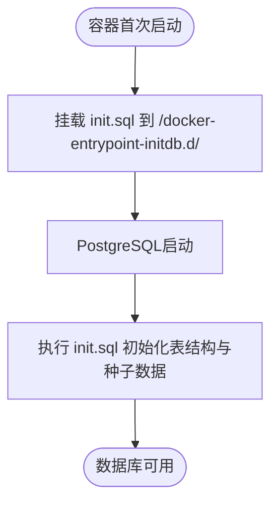
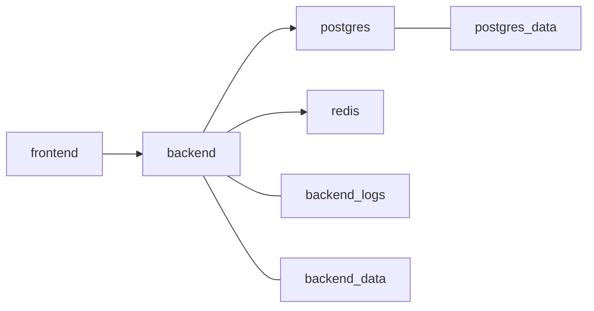
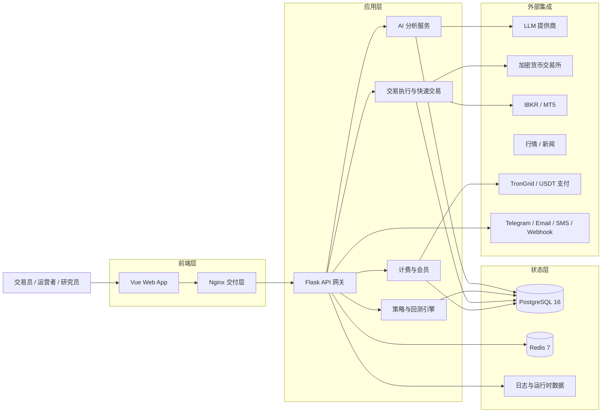

# Docker部署

<cite>
**本文引用的文件**
- [docker-compose.yml](file://docker-compose.yml)
- [backend_api_python/Dockerfile](file://backend_api_python/Dockerfile)
- [frontend/Dockerfile](file://frontend/Dockerfile)
- [mcp_server/Dockerfile](file://mcp_server/Dockerfile)
- [backend_api_python/env.example](file://backend_api_python/env.example)
- [backend_api_python/docker-entrypoint.sh](file://backend_api_python/docker-entrypoint.sh)
- [backend_api_python/gunicorn_config.py](file://backend_api_python/gunicorn_config.py)
- [backend_api_python/run.py](file://backend_api_python/run.py)
- [frontend/nginx.conf.template](file://frontend/nginx.conf.template)
- [backend_api_python/start.sh](file://backend_api_python/start.sh)
- [backend_api_python/requirements.txt](file://backend_api_python/requirements.txt)
- [backend_api_python/migrations/init.sql](file://backend_api_python/migrations/init.sql)
- [scripts/generate-secret-key.sh](file://scripts/generate-secret-key.sh)
- [docs/README_CN.md](file://docs/README_CN.md)
</cite>

## 目录
1. [简介](#简介)
2. [项目结构](#项目结构)
3. [核心组件](#核心组件)
4. [架构总览](#架构总览)
5. [详细组件分析](#详细组件分析)
6. [依赖关系分析](#依赖关系分析)
7. [性能考虑](#性能考虑)
8. [故障排查指南](#故障排查指南)
9. [结论](#结论)
10. [附录](#附录)

## 简介
本文件面向QuantDinger的Docker一键部署场景，围绕docker-compose编排配置进行深入解析，覆盖PostgreSQL数据库、Redis缓存、后端API（Python/Flask）、前端应用（Nginx）四类服务的容器配置、环境变量、端口映射、卷挂载、健康检查、容器间网络通信与数据持久化策略，并提供从环境变量准备、镜像构建到容器启动的完整部署步骤，以及常见问题排查与性能优化建议。

## 项目结构
- 顶层compose编排文件定义了四个核心服务：postgres、redis、backend、frontend，并声明自定义桥接网络与本地命名卷，确保服务间通信与数据持久化。
- 后端服务基于Python 3.12 Slim镜像，使用Gunicorn作为WSGI服务器，入口脚本负责SECRET_KEY校验与.env加载。
- 前端服务基于Nginx，使用模板渲染注入后端代理地址，静态资源由Nginx直接提供。
- MCP Server为可选的独立服务容器，便于扩展AI/代理相关能力。

**图示来源**
- [docker-compose.yml:25-172](file://docker-compose.yml#L25-L172)

**章节来源**
- [docker-compose.yml:1-172](file://docker-compose.yml#L1-L172)

## 核心组件
- 数据库服务（PostgreSQL）
  - 镜像：postgres:16-alpine
  - 环境变量：数据库名、用户名、密码、时区；通过命令参数提升最大连接数与共享缓冲
  - 卷：postgres_data持久化；初始化SQL挂载至容器入口初始化目录
  - 端口：默认映射到宿主127.0.0.1:5432
  - 健康检查：使用pg_isready检测
- 缓存服务（Redis）
  - 镜像：redis:7-alpine
  - 命令：限制内存与淘汰策略
  - 端口：默认映射到宿主127.0.0.1:6379
  - 健康检查：redis-cli ping
- 后端服务（Python/Flask + Gunicorn）
  - 构建上下文：backend_api_python
  - 环境变量：数据库连接串、Redis连接、时区、连接池参数、Gunicorn工作线程、执行器并行度、允许本地桌面Broker等
  - 卷：backend_logs、backend_data、.env挂载以支持运行时配置热更新
  - 端口：默认映射到宿主127.0.0.1:5000
  - 健康检查：访问/api/health
  - 依赖：postgres与redis均健康后才启动
- 前端服务（Nginx）
  - 构建上下文：frontend
  - 环境变量：BACKEND_URL（通过envsubst注入到Nginx模板）
  - 端口：默认映射到宿主8888
  - 健康检查：访问/Nginx健康端点
  - 依赖：backend就绪后启动

**章节来源**
- [docker-compose.yml:29-159](file://docker-compose.yml#L29-L159)
- [backend_api_python/Dockerfile:1-62](file://backend_api_python/Dockerfile#L1-L62)
- [frontend/Dockerfile:1-25](file://frontend/Dockerfile#L1-L25)

## 架构总览
下图展示容器间网络通信与数据流：前端通过Nginx反向代理转发/api/*到后端；后端连接PostgreSQL与Redis；数据库与缓存通过本地卷实现持久化；后端日志与运行时数据也挂载到本地卷。

**图示来源**
- [docker-compose.yml:29-159](file://docker-compose.yml#L29-L159)

## 详细组件分析

### 组件A：后端API（Python/Flask + Gunicorn）
- 镜像与构建
  - 使用Python 3.12 Slim基础镜像，优先使用阿里云apt源与pip镜像，失败则回退官方源
  - 复制requirements.txt并安装依赖，随后复制应用代码与入口脚本
- 入口与启动
  - ENTRYPOINT指向docker-entrypoint.sh，负责.env存在性与SECRET_KEY安全性检查
  - CMD使用gunicorn，配置文件来自gunicorn_config.py
- 关键环境变量
  - 数据库连接串、DB类型、Redis主机与端口、时区
  - 连接池参数（最小/最大、获取超时、健康检查）
  - 执行器并行度（市场与组合管理）
  - Gunicorn工作进程与线程数
  - 允许本地桌面Broker（IBKR/MT5）
- 健康检查
  - 访问/api/health端点
- 卷挂载
  - 日志目录logs、运行时数据目录data
  - .env挂载以便运行时热更新配置

**图示来源**
- [docker-compose.yml:81-131](file://docker-compose.yml#L81-L131)
- [backend_api_python/Dockerfile:46-61](file://backend_api_python/Dockerfile#L46-L61)
- [backend_api_python/docker-entrypoint.sh:11-48](file://backend_api_python/docker-entrypoint.sh#L11-L48)
- [backend_api_python/gunicorn_config.py:10-36](file://backend_api_python/gunicorn_config.py#L10-L36)
- [frontend/nginx.conf.template:31-46](file://frontend/nginx.conf.template#L31-L46)

**章节来源**
- [backend_api_python/Dockerfile:1-62](file://backend_api_python/Dockerfile#L1-L62)
- [backend_api_python/docker-entrypoint.sh:1-49](file://backend_api_python/docker-entrypoint.sh#L1-L49)
- [backend_api_python/gunicorn_config.py:1-36](file://backend_api_python/gunicorn_config.py#L1-L36)
- [backend_api_python/run.py:17-30](file://backend_api_python/run.py#L17-L30)

### 组件B：前端应用（Nginx）
- 镜像与构建
  - 基于nginx:1.25-alpine，启用envsubst仅替换BACKEND_URL
  - 将预构建的dist目录拷贝至/usr/share/nginx/html/
- 反向代理
  - 将/api/*代理到BACKEND_URL（默认http://backend:5000）
  - 设置必要的代理头与长连接超时，适配长时间回测任务
- 健康检查
  - 返回200的/Nginx健康端点

**图示来源**
- [frontend/Dockerfile:13-24](file://frontend/Dockerfile#L13-L24)
- [frontend/nginx.conf.template:26-58](file://frontend/nginx.conf.template#L26-L58)

**章节来源**
- [frontend/Dockerfile:1-25](file://frontend/Dockerfile#L1-L25)
- [frontend/nginx.conf.template:1-60](file://frontend/nginx.conf.template#L1-L60)

### 组件C：数据库（PostgreSQL）
- 初始化与模式
  - 首次启动时执行/docker-entrypoint-initdb.d/01-init.sql，创建用户、积分、会员、OAuth状态、策略、交易、回测、监控等表，并插入热门标的种子数据
- 性能与连接
  - 通过命令参数提升max_connections与shared_buffers，预留扩容空间
- 持久化
  - 使用本地卷postgres_data保存数据目录

**图示来源**
- [docker-compose.yml:41-51](file://docker-compose.yml#L41-L51)
- [backend_api_python/migrations/init.sql:1-120](file://backend_api_python/migrations/init.sql#L1-L120)

**章节来源**
- [docker-compose.yml:29-58](file://docker-compose.yml#L29-L58)
- [backend_api_python/migrations/init.sql:1-120](file://backend_api_python/migrations/init.sql#L1-L120)

### 组件D：缓存（Redis）
- 内存限制与淘汰策略
  - 限制最大内存并采用LRU淘汰策略，适合中小规模缓存需求
- 健康检查
  - 使用redis-cli ping

**章节来源**
- [docker-compose.yml:63-77](file://docker-compose.yml#L63-L77)

### 组件E：MCP Server（可选）
- 独立容器，使用Python 3.12 Slim镜像，安装项目自身包
- 默认暴露7800端口，可通过环境变量配置传输方式与绑定地址

**章节来源**
- [mcp_server/Dockerfile:1-26](file://mcp_server/Dockerfile#L1-L26)

## 依赖关系分析
- 服务依赖
  - backend依赖postgres与redis健康
  - frontend依赖backend就绪
- 网络
  - 四个服务均加入quantdinger-network桥接网络，容器间通过服务名互访
- 数据持久化
  - postgres_data、backend_logs、backend_data均为本地命名卷
- 环境变量与配置
  - 后端通过DATABASE_URL、REDIS_HOST/PORT、DB_POOL_*、GUNICORN_*等参数控制行为
  - 前端通过BACKEND_URL注入Nginx模板

**图示来源**
- [docker-compose.yml:89-154](file://docker-compose.yml#L89-L154)

**章节来源**
- [docker-compose.yml:89-154](file://docker-compose.yml#L89-L154)

## 性能考虑
- 数据库连接池
  - 后端通过DB_POOL_MIN/MAX、DB_POOL_ACQUIRE_TIMEOUT、DB_POOL_HEALTH_CHECK等参数控制连接池大小与健康检查
  - docker-compose中PG最大连接数预留高于默认值，建议保持DB_POOL_MAX小于PG最大连接数
- 并发与线程
  - GUNICORN_WORKERS与GUNICORN_THREADS决定WSGI并发；MARKET_EXECUTOR_WORKERS与PORTFOLIO_EXECUTOR_WORKERS影响路由级并行
- 缓存
  - 启用Redis缓存可降低数据库压力；注意内存限制与淘汰策略
- Nginx代理
  - 针对长回测任务设置了较长的proxy_read/send_timeout，避免超时中断
- 镜像拉取加速
  - Dockerfile中已内置国内镜像源回退逻辑；可通过设置IMAGE_PREFIX或Docker镜像加速器进一步提速

**章节来源**
- [docker-compose.yml:101-124](file://docker-compose.yml#L101-L124)
- [backend_api_python/gunicorn_config.py:10-36](file://backend_api_python/gunicorn_config.py#L10-L36)
- [frontend/nginx.conf.template:41-46](file://frontend/nginx.conf.template#L41-L46)

## 故障排查指南
- 启动时报错“SECRET_KEY未修改”
  - docker-entrypoint.sh会在容器启动时检查.env中的SECRET_KEY，若为空或默认值会自动生成并写回.env
  - 建议在宿主机生成强随机密钥后写入backend_api_python/.env
  - 参考脚本：scripts/generate-secret-key.sh
- 健康检查失败
  - 后端/api/health：检查后端日志与数据库连接串
  - 前端/Nginx健康端点：确认后端已就绪且BACKEND_URL可达
  - 数据库/Redis：确认max_connections与网络连通
- 数据库初始化异常
  - 确认init.sql已正确挂载；查看postgres容器日志；确认卷权限
- 端口冲突
  - 若宿主5000/6379/8888被占用，请在docker-compose.yml中修改映射端口
- 代理与SSL
  - 如使用代理或自签证书，可在后端设置LIVE_TRADING_CA_BUNDLE或禁用TLS校验（不推荐）

**章节来源**
- [backend_api_python/docker-entrypoint.sh:25-48](file://backend_api_python/docker-entrypoint.sh#L25-L48)
- [scripts/generate-secret-key.sh:1-33](file://scripts/generate-secret-key.sh#L1-L33)
- [docker-compose.yml:54-159](file://docker-compose.yml#L54-L159)

## 结论
QuantDinger的Docker部署通过docker-compose将数据库、缓存、后端API与前端应用整合在一个自定义桥接网络中，配合本地卷实现数据持久化与运行时配置热更新。通过合理的连接池、并发参数与Nginx代理配置，可在单机环境中稳定运行并具备一定扩展能力。建议在生产环境中固定并轮换SECRET_KEY、合理规划数据库连接上限与缓存容量，并根据业务负载调整Gunicorn与执行器参数。

## 附录

### 部署步骤（从零到运行）
- 准备环境变量
  - 复制env.example为backend_api_python/.env
  - 使用scripts/generate-secret-key.sh生成并写入强随机密钥
- 镜像构建与启动
  - 在项目根目录执行：docker-compose up -d --build
- 首次访问
  - 浏览器打开http://localhost:8888
- 可选：MCP Server
  - 如需启用，可在compose中添加mcp_server服务并按需暴露端口

**章节来源**
- [docker-compose.yml:1-16](file://docker-compose.yml#L1-L16)
- [scripts/generate-secret-key.sh:1-33](file://scripts/generate-secret-key.sh#L1-L33)

### 环境变量一览（后端）
- 认证与核心
  - SECRET_KEY、ADMIN_USER、ADMIN_PASSWORD、ADMIN_EMAIL、DATABASE_URL、FRONTEND_URL、OAUTH_ALLOWED_REDIRECTS、OAUTH_STATE_TTL_MINUTES、ENABLE_REGISTRATION
- 数据库连接池
  - DB_POOL_MIN、DB_POOL_MAX、DB_POOL_ACQUIRE_TIMEOUT、DB_POOL_HEALTH_CHECK
- 执行器与并发
  - MARKET_EXECUTOR_WORKERS、PORTFOLIO_EXECUTOR_WORKERS、GUNICORN_WORKERS、GUNICORN_THREADS
- 缓存与Broker
  - REDIS_HOST、REDIS_PORT、CACHE_ENABLED、ALLOW_LOCAL_DESKTOP_BROKERS
- 其他
  - TZ、PYTHON_API_HOST、PYTHON_API_PORT、ENABLE_CACHE、ENABLE_REQUEST_LOG、RATE_LIMIT等

**章节来源**
- [backend_api_python/env.example:1-319](file://backend_api_python/env.example#L1-L319)
- [docker-compose.yml:101-124](file://docker-compose.yml#L101-L124)

### 系统架构概念图（参考）
以下为项目文档中的系统架构示意，帮助理解服务层次与外部集成。

**图示来源**
- [docs/README_CN.md:278-332](file://docs/README_CN.md#L278-L332)