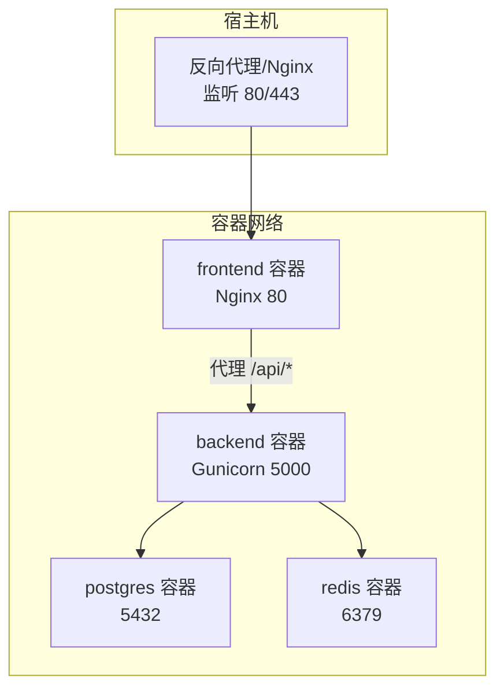
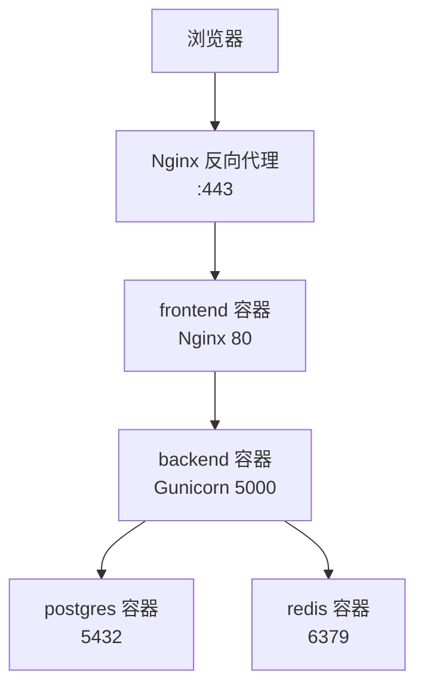
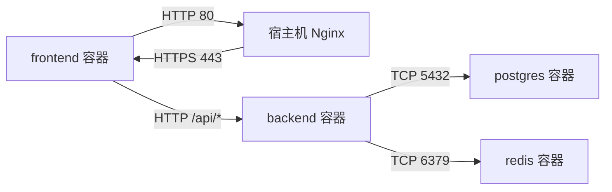

# 生产环境部署

<cite>
**本文引用的文件**
- [backend_api_python/Dockerfile](file://backend_api_python/Dockerfile)
- [backend_api_python/gunicorn_config.py](file://backend_api_python/gunicorn_config.py)
- [backend_api_python/run.py](file://backend_api_python/run.py)
- [backend_api_python/env.example](file://backend_api_python/env.example)
- [backend_api_python/docker-entrypoint.sh](file://backend_api_python/docker-entrypoint.sh)
- [backend_api_python/start.sh](file://backend_api_python/start.sh)
- [backend_api_python/railway.json](file://backend_api_python/railway.json)
- [frontend/Dockerfile](file://frontend/Dockerfile)
- [frontend/nginx.conf.template](file://frontend/nginx.conf.template)
- [frontend/railway.json](file://frontend/railway.json)
- [mcp_server/Dockerfile](file://mcp_server/Dockerfile)
- [mcp_server/src/quantdinger_mcp/server.py](file://mcp_server/src/quantdinger_mcp/server.py)
- [mcp_server/railway.json](file://mcp_server/railway.json)
- [docker-compose.yml](file://docker-compose.yml)
- [docs/CLOUD_DEPLOYMENT_EN.md](file://docs/CLOUD_DEPLOYMENT_EN.md)
- [docs/CLOUD_DEPLOYMENT_CN.md](file://docs/CLOUD_DEPLOYMENT_CN.md)
</cite>

## 目录
1. [简介](#简介)
2. [项目结构](#项目结构)
3. [核心组件](#核心组件)
4. [架构总览](#架构总览)
5. [详细组件分析](#详细组件分析)
6. [依赖分析](#依赖分析)
7. [性能考虑](#性能考虑)
8. [故障排查指南](#故障排查指南)
9. [结论](#结论)
10. [附录](#附录)

## 简介
本文件面向QuantDinger生产环境部署，围绕反向代理与TLS、负载均衡与高可用、云平台部署（含Railway）、安全加固、性能调优、备份与灾备以及运维监控进行系统化说明。文档以仓库现有配置与脚本为基础，结合部署指南与容器编排文件，给出可落地的生产实践。

## 项目结构
QuantDinger采用多容器架构：前端（Nginx静态服务）、后端（Python+Gunicorn+Flask）、数据库（PostgreSQL）与可选缓存（Redis）。部署支持单机Docker Compose与Railway云平台两种路径，同时提供反向代理与HTTPS的生产级参考方案。

图示来源
- [docker-compose.yml:25-172](file://docker-compose.yml#L25-L172)
- [frontend/nginx.conf.template:26-46](file://frontend/nginx.conf.template#L26-L46)
- [backend_api_python/Dockerfile:60-62](file://backend_api_python/Dockerfile#L60-L62)

章节来源
- [docker-compose.yml:1-172](file://docker-compose.yml#L1-L172)
- [docs/CLOUD_DEPLOYMENT_EN.md:1-451](file://docs/CLOUD_DEPLOYMENT_EN.md#L1-L451)
- [docs/CLOUD_DEPLOYMENT_CN.md:1-451](file://docs/CLOUD_DEPLOYMENT_CN.md#L1-L451)

## 核心组件
- 反向代理与前端
  - 使用Nginx作为反向代理与静态资源服务，内置安全头、Gzip压缩与静态缓存策略；通过环境变量注入后端地址，支持长连接与大文件上传。
- 后端服务
  - 基于Gunicorn的多线程工作模型（gthread），支持按CPU核数调整工作进程与线程数；健康检查路径为/api/health。
- 数据库与缓存
  - PostgreSQL用于持久化；Redis用于可选缓存层（LRU策略）。
- MCP服务
  - 提供Agent工具的MCP传输能力，支持标准输入、SSE与流式HTTP三种传输方式。

章节来源
- [frontend/Dockerfile:1-25](file://frontend/Dockerfile#L1-L25)
- [frontend/nginx.conf.template:1-60](file://frontend/nginx.conf.template#L1-L60)
- [backend_api_python/Dockerfile:1-62](file://backend_api_python/Dockerfile#L1-L62)
- [backend_api_python/gunicorn_config.py:1-36](file://backend_api_python/gunicorn_config.py#L1-L36)
- [docker-compose.yml:29-131](file://docker-compose.yml#L29-L131)
- [mcp_server/Dockerfile:1-26](file://mcp_server/Dockerfile#L1-L26)

## 架构总览
生产推荐“同域名+Nginx反向代理”拓扑：浏览器仅访问HTTPS域名，Nginx统一处理TLS与转发，前端容器提供SPA与静态资源，后端容器提供REST API，数据库与缓存仅对容器网络可见。

图示来源
- [docs/CLOUD_DEPLOYMENT_EN.md:5-240](file://docs/CLOUD_DEPLOYMENT_EN.md#L5-L240)
- [frontend/nginx.conf.template:1-60](file://frontend/nginx.conf.template#L1-L60)
- [docker-compose.yml:25-172](file://docker-compose.yml#L25-L172)

## 详细组件分析

### 反向代理与TLS配置
- Nginx作为宿主机反向代理，监听80/443，将请求转发至前端容器；前端容器内Nginx负责代理/api/*到后端容器。
- 建议使用Let’s Encrypt自动签发与续期证书；生产环境仅对外暴露80/443，数据库与后端API端口绑定到127.0.0.1。
- 前端Nginx模板包含安全响应头、Gzip压缩、静态资源强缓存与长超时配置，适合生产。

章节来源
- [docs/CLOUD_DEPLOYMENT_EN.md:150-220](file://docs/CLOUD_DEPLOYMENT_EN.md#L150-L220)
- [frontend/nginx.conf.template:1-60](file://frontend/nginx.conf.template#L1-L60)

### 负载均衡与高可用
- 单实例部署：使用Docker Compose在单机上运行，容器间通过桥接网络通信；通过健康检查实现自愈重启。
- 多实例扩展：可在反向代理层增加上游多个后端容器实例，配合健康检查与限流策略实现高可用。
- 注意：后端容器未内置LB，建议在Nginx层做多实例轮询或基于会话亲和的策略。

章节来源
- [docker-compose.yml:127-131](file://docker-compose.yml#L127-L131)
- [docs/CLOUD_DEPLOYMENT_EN.md:221-283](file://docs/CLOUD_DEPLOYMENT_EN.md#L221-L283)

### TLS证书管理
- 使用宿主机Nginx统一管理证书与续期；前端容器仅代理请求，不承担TLS终止。
- 建议开启HSTS与安全重定向，确保全站HTTPS访问。

章节来源
- [docs/CLOUD_DEPLOYMENT_EN.md:195-220](file://docs/CLOUD_DEPLOYMENT_EN.md#L195-L220)

### 云平台部署方案

#### Docker Compose（单机）
- 通过项目根.env与backend_api_python/.env分别控制镜像源、端口与应用配置；后端容器启动前会校验并自动生成安全密钥。
- 健康检查路径分别为/api/health与/health，便于外部监控系统探测。

章节来源
- [docker-compose.yml:1-172](file://docker-compose.yml#L1-L172)
- [backend_api_python/docker-entrypoint.sh:1-49](file://backend_api_python/docker-entrypoint.sh#L1-L49)
- [backend_api_python/run.py:104-134](file://backend_api_python/run.py#L104-L134)

#### Railway（Railway.json）
- 后端与前端均声明了健康检查路径与重启策略；MCP服务同样具备基础部署元信息。
- 建议在Railway侧配置环境变量（如DATABASE_URL、REDIS_*、LLM_*等）与域名绑定。

章节来源
- [backend_api_python/railway.json:1-14](file://backend_api_python/railway.json#L1-L14)
- [frontend/railway.json:1-14](file://frontend/railway.json#L1-L14)
- [mcp_server/railway.json:1-12](file://mcp_server/railway.json#L1-L12)

### 安全加固措施
- 密钥与认证
  - 启动阶段强制生成/替换默认SECRET_KEY，防止默认密钥导致的令牌伪造风险。
  - 建议在生产环境固定持久化的SECRET_KEY，并妥善保管。
- 网络与访问控制
  - 数据库与后端API仅绑定127.0.0.1，通过Nginx统一暴露80/443。
  - 前端Nginx模板包含安全响应头，建议结合WAF与CDN进一步强化。
- 数据加密
  - 建议启用数据库SSL连接与客户端证书校验；对敏感配置使用平台密钥管理服务。

章节来源
- [backend_api_python/docker-entrypoint.sh:25-44](file://backend_api_python/docker-entrypoint.sh#L25-L44)
- [backend_api_python/run.py:109-120](file://backend_api_python/run.py#L109-L120)
- [docs/CLOUD_DEPLOYMENT_EN.md:433-450](file://docs/CLOUD_DEPLOYMENT_EN.md#L433-L450)
- [frontend/nginx.conf.template:7-11](file://frontend/nginx.conf.template#L7-L11)

### 性能调优指南
- 应用并发与线程
  - 后端使用Gunicorn gthread模型，默认1个工作进程与4个线程；可根据CPU核数提升GUNICORN_WORKERS与GUNICORN_THREADS。
- 数据库连接池
  - 通过DB_POOL_MIN/MAX与ACQUIRE_TIMEOUT调节连接池大小；确保PostgreSQL max_connections高于DB_POOL_MAX。
- 缓存策略
  - 启用Redis缓存（CACHE_ENABLED=true），合理设置TTL与淘汰策略；对热点指标与K线数据进行缓存。
- 资源限制
  - 为容器设置CPU/内存限制与重启策略；结合健康检查与自动重启降低故障影响面。

章节来源
- [backend_api_python/gunicorn_config.py:10-36](file://backend_api_python/gunicorn_config.py#L10-L36)
- [backend_api_python/env.example:42-62](file://backend_api_python/env.example#L42-L62)
- [docker-compose.yml:110-125](file://docker-compose.yml#L110-L125)

### 备份与灾备
- 数据库备份
  - 使用pg_dump定期导出；结合对象存储进行异地备份与版本保留策略。
- 配置与日志
  - 将.env与日志目录映射到宿主机持久卷，定期归档。
- 灾难恢复
  - 准备最小化恢复清单（镜像版本、环境变量、备份位置、健康检查路径）；演练从备份快速重建流程。

章节来源
- [docker-compose.yml:47-58](file://docker-compose.yml#L47-L58)
- [docs/CLOUD_DEPLOYMENT_EN.md:300-318](file://docs/CLOUD_DEPLOYMENT_EN.md#L300-L318)

### 运维监控配置
- 健康检查
  - 后端：/api/health；前端：/health；Nginx：/health。
- 日志采集
  - 后端容器输出到stdout/stderr，结合平台日志服务聚合；前端Nginx访问/错误日志可接入统一收集。
- 告警
  - 基于健康检查失败、CPU/内存/磁盘阈值与数据库连接池耗尽事件触发告警。

章节来源
- [docker-compose.yml:127-159](file://docker-compose.yml#L127-L159)
- [backend_api_python/gunicorn_config.py:30-36](file://backend_api_python/gunicorn_config.py#L30-L36)

## 依赖分析
后端容器依赖数据库与缓存服务，前端容器依赖后端容器；容器间通过Docker网络通信，宿主机仅暴露Nginx端口。

图示来源
- [docker-compose.yml:25-172](file://docker-compose.yml#L25-L172)
- [frontend/nginx.conf.template:26-46](file://frontend/nginx.conf.template#L26-L46)

章节来源
- [docker-compose.yml:89-131](file://docker-compose.yml#L89-L131)

## 性能考虑
- 数据库连接池
  - 当并发交易/回测任务增多时，适当提高DB_POOL_MAX并确保PG最大连接数充足。
- 后端并发
  - 在CPU充足的服务器上调高GUNICORN_WORKERS与GUNICORN_THREADS，注意与市场数据并发执行器数量协调。
- 缓存命中率
  - 对高频查询与K线接口启用缓存，缩短后端计算压力。
- 网络与TLS
  - 在Nginx层启用HTTP/2与TLS会话复用，减少握手开销。

章节来源
- [backend_api_python/env.example:42-62](file://backend_api_python/env.example#L42-L62)
- [backend_api_python/gunicorn_config.py:10-36](file://backend_api_python/gunicorn_config.py#L10-L36)
- [frontend/nginx.conf.template:12-17](file://frontend/nginx.conf.template#L12-L17)

## 故障排查指南
- 镜像拉取失败
  - 通过设置IMAGE_PREFIX切换镜像源后重试。
- 健康检查失败
  - 检查后端/api/health与前端/health可达性，核对容器日志。
- 前端无法解析后端上游
  - 确认后端容器已健康启动，必要时重启前端容器。
- 代理在容器内不生效
  - Docker部署请使用host.docker.internal指向宿主机代理。
- 数据库不应暴露公网
  - 确保DB_PORT仅绑定127.0.0.1，仅对外暴露80/443。

章节来源
- [docs/CLOUD_DEPLOYMENT_EN.md:320-450](file://docs/CLOUD_DEPLOYMENT_EN.md#L320-L450)

## 结论
QuantDinger生产部署以“同域名+Nginx反向代理”为核心，结合Docker Compose与Railway两种部署路径，既满足单机自管需求，也支持云原生弹性扩展。通过严格的密钥管理、网络隔离与TLS治理，配合数据库连接池、缓存与资源限制的性能调优，可实现稳定、安全、可观测的生产运行。

## 附录

### 关键配置要点速查
- 后端并发与线程：GUNICORN_WORKERS、GUNICORN_THREADS
- 数据库连接池：DB_POOL_MIN、DB_POOL_MAX、DB_POOL_ACQUIRE_TIMEOUT
- 缓存开关：CACHE_ENABLED、REDIS_HOST、REDIS_PORT
- 健康检查：/api/health（后端）、/health（前端）
- 反向代理：BACKEND_URL（Nginx模板注入）

章节来源
- [backend_api_python/env.example:42-62](file://backend_api_python/env.example#L42-L62)
- [frontend/nginx.conf.template:14-17](file://frontend/nginx.conf.template#L14-L17)
- [docker-compose.yml:121-125](file://docker-compose.yml#L121-L125)