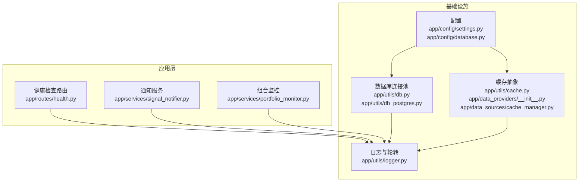
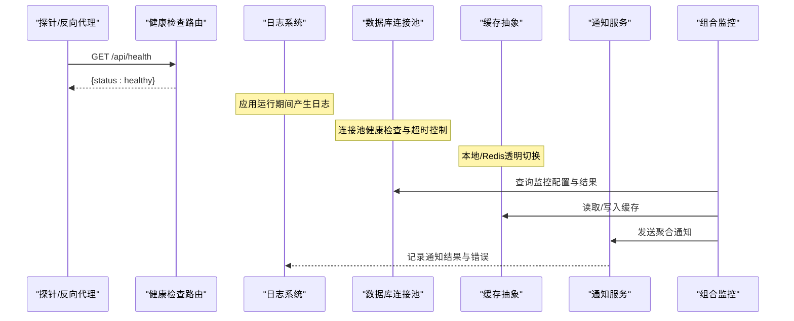
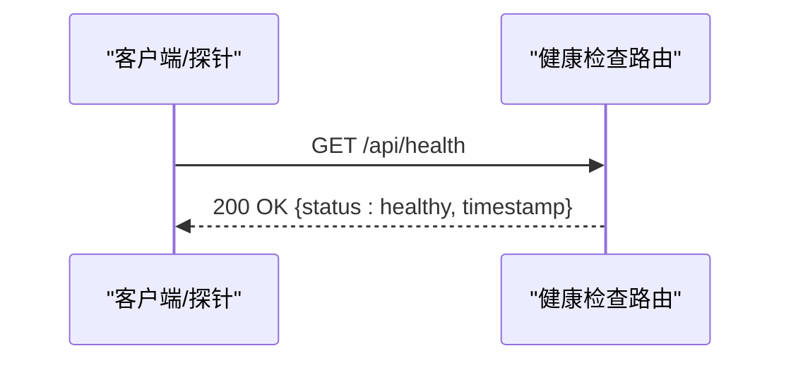
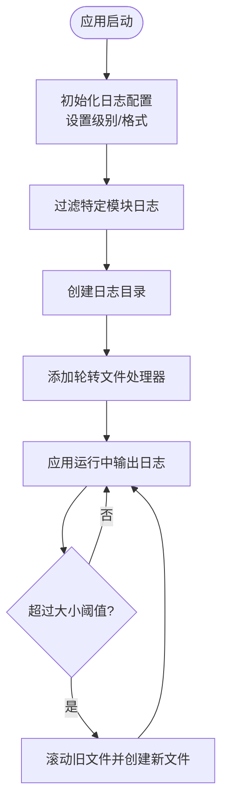
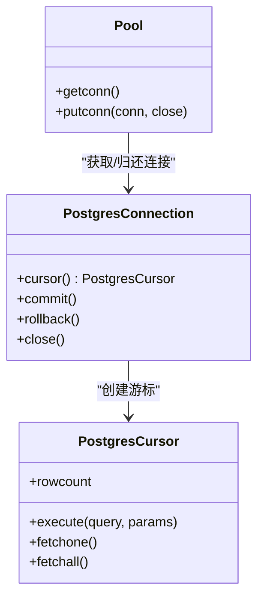
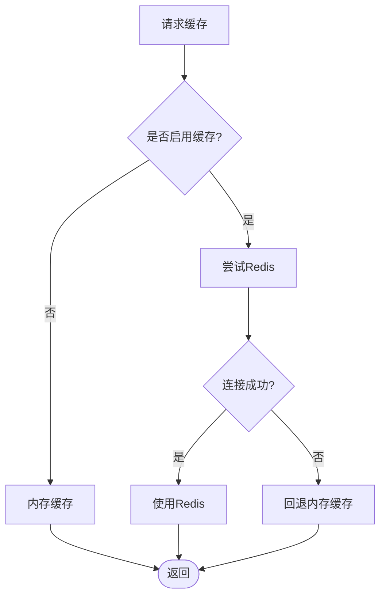
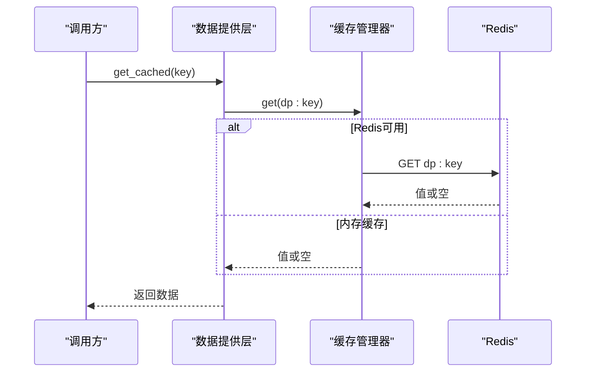
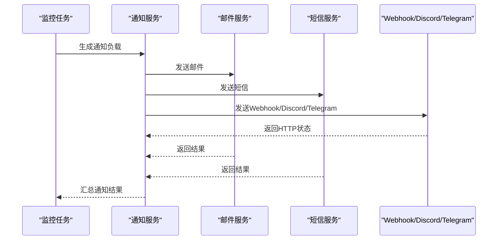
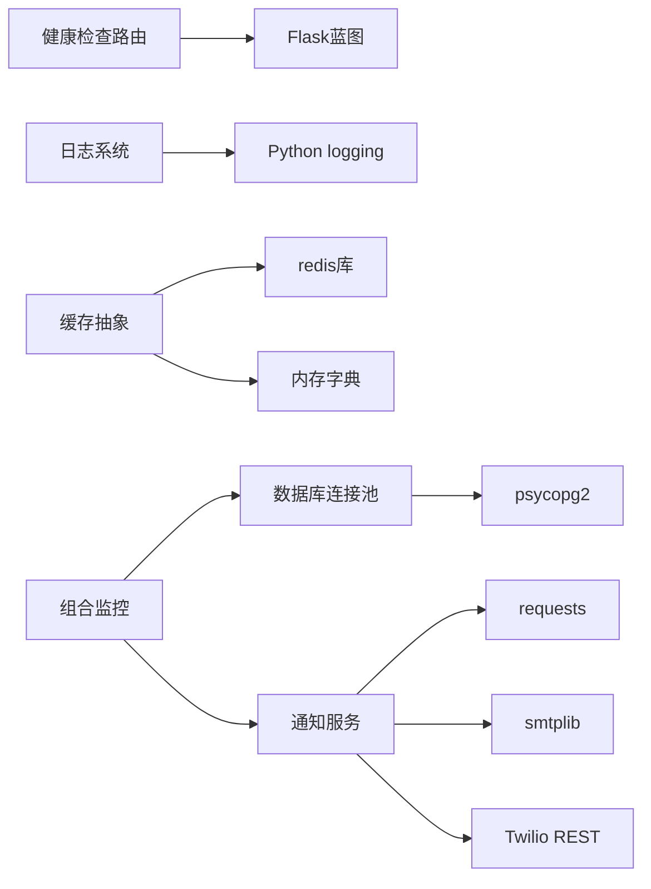

# 监控与告警

<cite>
**本文引用的文件**
- [backend_api_python/app/routes/health.py](file://backend_api_python/app/routes/health.py)
- [backend_api_python/app/utils/logger.py](file://backend_api_python/app/utils/logger.py)
- [backend_api_python/app/config/settings.py](file://backend_api_python/app/config/settings.py)
- [backend_api_python/app/config/database.py](file://backend_api_python/app/config/database.py)
- [backend_api_python/app/utils/cache.py](file://backend_api_python/app/utils/cache.py)
- [backend_api_python/app/data_providers/__init__.py](file://backend_api_python/app/data_providers/__init__.py)
- [backend_api_python/app/data_sources/cache_manager.py](file://backend_api_python/app/data_sources/cache_manager.py)
- [backend_api_python/app/services/market_data_collector.py](file://backend_api_python/app/services/market_data_collector.py)
- [backend_api_python/app/utils/db.py](file://backend_api_python/app/utils/db.py)
- [backend_api_python/app/utils/db_postgres.py](file://backend_api_python/app/utils/db_postgres.py)
- [backend_api_python/app/services/signal_notifier.py](file://backend_api_python/app/services/signal_notifier.py)
- [backend_api_python/app/services/portfolio_monitor.py](file://backend_api_python/app/services/portfolio_monitor.py)
- [backend_api_python/tests/test_health.py](file://backend_api_python/tests/test_health.py)
- [docs/NOTIFICATION_TELEGRAM_CONFIG_EN.md](file://docs/NOTIFICATION_TELEGRAM_CONFIG_EN.md)
</cite>

## 目录
1. [简介](#简介)
2. [项目结构](#项目结构)
3. [核心组件](#核心组件)
4. [架构总览](#架构总览)
5. [详细组件分析](#详细组件分析)
6. [依赖分析](#依赖分析)
7. [性能考虑](#性能考虑)
8. [故障排查指南](#故障排查指南)
9. [结论](#结论)
10. [附录](#附录)

## 简介
本文件面向QuantDinger的监控与告警系统，聚焦以下方面：
- 监控指标体系：应用性能指标、数据库性能指标、Redis缓存指标、业务指标
- 日志收集与分析：结构化日志格式、日志轮转与集中化管理
- 健康检查与故障检测：服务可用性、响应时间、错误率
- 告警配置：规则设置、通知渠道、升级策略
- 性能监控最佳实践与故障排查方法

系统当前实现以健康检查路由、统一日志与轮转、连接池与缓存抽象、信号与组合投资组合监控通知为主，具备扩展到更细粒度指标与集中化监控平台的基础。

## 项目结构
与监控与告警相关的关键模块分布如下：
- 健康检查：路由层提供健康检查端点
- 日志：本地轮转文件日志，支持按环境变量配置
- 数据库：PostgreSQL连接池封装，支持健康检查与超时控制
- 缓存：本地内存缓存与Redis透明切换
- 通知：多渠道通知（邮件、Webhook、Discord、Telegram、短信）
- 业务监控：组合投资组合监控与批量通知

**图表来源**
- [backend_api_python/app/routes/health.py:1-34](file://backend_api_python/app/routes/health.py#L1-L34)
- [backend_api_python/app/utils/logger.py:1-63](file://backend_api_python/app/utils/logger.py#L1-L63)
- [backend_api_python/app/config/settings.py:1-99](file://backend_api_python/app/config/settings.py#L1-L99)
- [backend_api_python/app/config/database.py:1-90](file://backend_api_python/app/config/database.py#L1-L90)
- [backend_api_python/app/utils/db.py:1-66](file://backend_api_python/app/utils/db.py#L1-L66)
- [backend_api_python/app/utils/db_postgres.py:1-507](file://backend_api_python/app/utils/db_postgres.py#L1-L507)
- [backend_api_python/app/utils/cache.py:1-129](file://backend_api_python/app/utils/cache.py#L1-L129)
- [backend_api_python/app/data_providers/__init__.py:1-85](file://backend_api_python/app/data_providers/__init__.py#L1-L85)
- [backend_api_python/app/data_sources/cache_manager.py:130-168](file://backend_api_python/app/data_sources/cache_manager.py#L130-L168)
- [backend_api_python/app/services/signal_notifier.py:1-912](file://backend_api_python/app/services/signal_notifier.py#L1-L912)
- [backend_api_python/app/services/portfolio_monitor.py:993-1728](file://backend_api_python/app/services/portfolio_monitor.py#L993-L1728)

**章节来源**
- [backend_api_python/app/routes/health.py:1-34](file://backend_api_python/app/routes/health.py#L1-L34)
- [backend_api_python/app/utils/logger.py:1-63](file://backend_api_python/app/utils/logger.py#L1-L63)
- [backend_api_python/app/config/settings.py:1-99](file://backend_api_python/app/config/settings.py#L1-L99)
- [backend_api_python/app/config/database.py:1-90](file://backend_api_python/app/config/database.py#L1-L90)
- [backend_api_python/app/utils/db.py:1-66](file://backend_api_python/app/utils/db.py#L1-L66)
- [backend_api_python/app/utils/db_postgres.py:1-507](file://backend_api_python/app/utils/db_postgres.py#L1-L507)
- [backend_api_python/app/utils/cache.py:1-129](file://backend_api_python/app/utils/cache.py#L1-L129)
- [backend_api_python/app/data_providers/__init__.py:1-85](file://backend_api_python/app/data_providers/__init__.py#L1-L85)
- [backend_api_python/app/data_sources/cache_manager.py:130-168](file://backend_api_python/app/data_sources/cache_manager.py#L130-L168)
- [backend_api_python/app/services/signal_notifier.py:1-912](file://backend_api_python/app/services/signal_notifier.py#L1-L912)
- [backend_api_python/app/services/portfolio_monitor.py:993-1728](file://backend_api_python/app/services/portfolio_monitor.py#L993-L1728)

## 核心组件
- 健康检查路由：提供应用状态与健康检查端点，便于容器探针与反向代理使用
- 日志与轮转：本地文件轮转，支持日志级别、格式与目录配置
- 数据库连接池：PostgreSQL连接池封装，含健康检查与超时控制
- 缓存抽象：本地内存缓存与Redis透明切换，支持读写失败降级
- 通知服务：多渠道通知（邮件、Webhook、Discord、Telegram、短信），支持签名与重试
- 组合监控：周期执行监控任务并聚合通知

**章节来源**
- [backend_api_python/app/routes/health.py:1-34](file://backend_api_python/app/routes/health.py#L1-L34)
- [backend_api_python/app/utils/logger.py:1-63](file://backend_api_python/app/utils/logger.py#L1-L63)
- [backend_api_python/app/utils/db_postgres.py:107-161](file://backend_api_python/app/utils/db_postgres.py#L107-L161)
- [backend_api_python/app/utils/cache.py:49-129](file://backend_api_python/app/utils/cache.py#L49-L129)
- [backend_api_python/app/services/signal_notifier.py:130-284](file://backend_api_python/app/services/signal_notifier.py#L130-L284)
- [backend_api_python/app/services/portfolio_monitor.py:993-1728](file://backend_api_python/app/services/portfolio_monitor.py#L993-L1728)

## 架构总览
下图展示监控与告警相关组件之间的交互关系与数据流：

**图表来源**
- [backend_api_python/app/routes/health.py:21-33](file://backend_api_python/app/routes/health.py#L21-L33)
- [backend_api_python/app/utils/logger.py:9-48](file://backend_api_python/app/utils/logger.py#L9-L48)
- [backend_api_python/app/utils/db_postgres.py:164-182](file://backend_api_python/app/utils/db_postgres.py#L164-L182)
- [backend_api_python/app/utils/cache.py:71-98](file://backend_api_python/app/utils/cache.py#L71-L98)
- [backend_api_python/app/services/signal_notifier.py:540-628](file://backend_api_python/app/services/signal_notifier.py#L540-L628)
- [backend_api_python/app/services/portfolio_monitor.py:1701-1728](file://backend_api_python/app/services/portfolio_monitor.py#L1701-L1728)

## 详细组件分析

### 健康检查机制
- 提供应用首页与健康检查端点，返回运行状态与时间戳
- 兼容容器探针与反向代理的健康检查路径
- 单元测试覆盖健康端点返回码

**图表来源**
- [backend_api_python/app/routes/health.py:21-33](file://backend_api_python/app/routes/health.py#L21-L33)
- [backend_api_python/tests/test_health.py:1-9](file://backend_api_python/tests/test_health.py#L1-L9)

**章节来源**
- [backend_api_python/app/routes/health.py:1-34](file://backend_api_python/app/routes/health.py#L1-L34)
- [backend_api_python/tests/test_health.py:1-9](file://backend_api_python/tests/test_health.py#L1-L9)

### 日志收集与分析配置
- 结构化日志格式：包含时间、模块名、级别与消息
- 日志轮转：本地文件轮转，支持最大大小与备份数量
- 集中式日志管理：通过日志目录与文件名配置，便于挂载到集中式平台
- 日志级别与过滤：对特定子系统进行级别调整，减少噪声

**图表来源**
- [backend_api_python/app/utils/logger.py:9-48](file://backend_api_python/app/utils/logger.py#L9-L48)
- [backend_api_python/app/config/settings.py:46-64](file://backend_api_python/app/config/settings.py#L46-L64)

**章节来源**
- [backend_api_python/app/utils/logger.py:1-63](file://backend_api_python/app/utils/logger.py#L1-L63)
- [backend_api_python/app/config/settings.py:46-64](file://backend_api_python/app/config/settings.py#L46-L64)

### 数据库性能监控与健康检查
- 连接池：最小/最大连接数、获取超时、健康检查开关
- 健康检查：轻量查询验证连接有效性
- 超时控制：连接与操作超时，避免阻塞
- 错误处理：异常记录与连接归还/丢弃策略

**图表来源**
- [backend_api_python/app/utils/db_postgres.py:237-451](file://backend_api_python/app/utils/db_postgres.py#L237-L451)

**章节来源**
- [backend_api_python/app/utils/db_postgres.py:107-161](file://backend_api_python/app/utils/db_postgres.py#L107-L161)
- [backend_api_python/app/utils/db_postgres.py:164-182](file://backend_api_python/app/utils/db_postgres.py#L164-L182)
- [backend_api_python/app/utils/db_postgres.py:415-451](file://backend_api_python/app/utils/db_postgres.py#L415-L451)
- [backend_api_python/app/utils/db.py:1-66](file://backend_api_python/app/utils/db.py#L1-L66)

### Redis缓存指标与监控
- 缓存模式：本地内存缓存优先；启用后透明切换至Redis
- 失败降级：Redis不可用时自动回退至内存缓存
- TTL策略：不同业务键空间采用不同TTL
- 统计接口：提供缓存命中率、大小等统计信息（部分模块）

**图表来源**
- [backend_api_python/app/utils/cache.py:71-98](file://backend_api_python/app/utils/cache.py#L71-L98)
- [backend_api_python/app/config/database.py:52-84](file://backend_api_python/app/config/database.py#L52-L84)
- [backend_api_python/app/data_sources/cache_manager.py:160-168](file://backend_api_python/app/data_sources/cache_manager.py#L160-L168)

**章节来源**
- [backend_api_python/app/utils/cache.py:1-129](file://backend_api_python/app/utils/cache.py#L1-L129)
- [backend_api_python/app/config/database.py:1-90](file://backend_api_python/app/config/database.py#L1-L90)
- [backend_api_python/app/data_sources/cache_manager.py:130-168](file://backend_api_python/app/data_sources/cache_manager.py#L130-L168)

### 业务指标与监控
- 市场数据缓存：提供缓存读写与过期逻辑
- 统一数据提供层：集中缓存TTL与清理逻辑
- 组合监控：周期执行监控任务，聚合通知

**图表来源**
- [backend_api_python/app/data_providers/__init__.py:45-58](file://backend_api_python/app/data_providers/__init__.py#L45-L58)
- [backend_api_python/app/utils/cache.py:100-116](file://backend_api_python/app/utils/cache.py#L100-L116)

**章节来源**
- [backend_api_python/app/services/market_data_collector.py:1201-1216](file://backend_api_python/app/services/market_data_collector.py#L1201-L1216)
- [backend_api_python/app/data_providers/__init__.py:23-58](file://backend_api_python/app/data_providers/__init__.py#L23-L58)
- [backend_api_python/app/services/portfolio_monitor.py:1701-1728](file://backend_api_python/app/services/portfolio_monitor.py#L1701-L1728)

### 告警配置与通知通道
- 通知渠道：浏览器内推送、邮件、短信、Webhook、Discord、Telegram
- 配置来源：用户侧配置与系统级公共配置
- 安全与可靠性：Webhook签名、重试、超时控制
- 批量通知：按用户聚合发送，降低通知风暴

**图表来源**
- [backend_api_python/app/services/signal_notifier.py:171-284](file://backend_api_python/app/services/signal_notifier.py#L171-L284)
- [backend_api_python/app/services/signal_notifier.py:540-628](file://backend_api_python/app/services/signal_notifier.py#L540-L628)
- [backend_api_python/app/services/portfolio_monitor.py:996-1036](file://backend_api_python/app/services/portfolio_monitor.py#L996-L1036)

**章节来源**
- [backend_api_python/app/services/signal_notifier.py:130-284](file://backend_api_python/app/services/signal_notifier.py#L130-L284)
- [backend_api_python/app/services/signal_notifier.py:540-628](file://backend_api_python/app/services/signal_notifier.py#L540-L628)
- [backend_api_python/app/services/portfolio_monitor.py:993-1036](file://backend_api_python/app/services/portfolio_monitor.py#L993-L1036)
- [docs/NOTIFICATION_TELEGRAM_CONFIG_EN.md:103-127](file://docs/NOTIFICATION_TELEGRAM_CONFIG_EN.md#L103-L127)

## 依赖分析
- 健康检查路由依赖Flask蓝图，简单直接
- 日志系统依赖标准库logging与RotatingFileHandler
- 数据库连接池依赖psycopg2与ThreadedConnectionPool
- 缓存抽象依赖Redis库或本地内存字典
- 通知服务依赖第三方HTTP与邮件/短信SDK
- 组合监控依赖数据库查询与通知服务

**图表来源**
- [backend_api_python/app/routes/health.py:1-34](file://backend_api_python/app/routes/health.py#L1-L34)
- [backend_api_python/app/utils/logger.py:1-63](file://backend_api_python/app/utils/logger.py#L1-L63)
- [backend_api_python/app/utils/db_postgres.py:22-31](file://backend_api_python/app/utils/db_postgres.py#L22-L31)
- [backend_api_python/app/utils/cache.py:78-98](file://backend_api_python/app/utils/cache.py#L78-L98)
- [backend_api_python/app/services/signal_notifier.py:33-36](file://backend_api_python/app/services/signal_notifier.py#L33-L36)
- [backend_api_python/app/services/portfolio_monitor.py:1238-1424](file://backend_api_python/app/services/portfolio_monitor.py#L1238-L1424)

**章节来源**
- [backend_api_python/app/utils/db_postgres.py:22-31](file://backend_api_python/app/utils/db_postgres.py#L22-L31)
- [backend_api_python/app/utils/cache.py:78-98](file://backend_api_python/app/utils/cache.py#L78-L98)
- [backend_api_python/app/services/signal_notifier.py:33-36](file://backend_api_python/app/services/signal_notifier.py#L33-L36)

## 性能考虑
- 连接池与健康检查：合理设置最小/最大连接数与获取超时，避免瞬时高并发导致池耗尽
- 缓存策略：根据业务特性选择合适的TTL，避免热点失效与雪崩
- 日志轮转：控制单文件大小与备份数量，平衡磁盘占用与检索效率
- 通知重试：对临时性错误（如429/5xx）进行有限重试，避免放大网络抖动
- 监控批量化：聚合同一用户的多条监控结果，减少通知风暴

[本节为通用指导，无需列出具体文件来源]

## 故障排查指南
- 健康检查失败
  - 使用单元测试脚本验证端点返回
  - 检查容器探针与反向代理配置
- 日志问题
  - 确认日志目录存在且有写权限
  - 检查日志级别与过滤规则
  - 关注轮转触发条件
- 数据库连接问题
  - 检查DATABASE_URL与连接参数
  - 观察池耗尽可能导致的等待与超时
  - 启用健康检查以快速发现坏连接
- 缓存不可用
  - 确认缓存开关与Redis连接参数
  - 查看回退到内存缓存的日志提示
- 通知失败
  - 检查各渠道的凭据与URL
  - 关注Webhook签名与重试逻辑
  - 参考Telegram通知配置文档进行排错

**章节来源**
- [backend_api_python/tests/test_health.py:1-9](file://backend_api_python/tests/test_health.py#L1-L9)
- [backend_api_python/app/utils/logger.py:35-48](file://backend_api_python/app/utils/logger.py#L35-L48)
- [backend_api_python/app/utils/db_postgres.py:184-234](file://backend_api_python/app/utils/db_postgres.py#L184-L234)
- [backend_api_python/app/utils/cache.py:94-98](file://backend_api_python/app/utils/cache.py#L94-L98)
- [docs/NOTIFICATION_TELEGRAM_CONFIG_EN.md:103-127](file://docs/NOTIFICATION_TELEGRAM_CONFIG_EN.md#L103-L127)

## 结论
QuantDinger当前的监控与告警体系以健康检查、统一日志、连接池与缓存抽象为基础，结合多渠道通知与组合监控，形成可扩展的可观测性框架。建议后续引入更细粒度的应用性能指标（APM）、数据库慢查询与锁等待指标、缓存命中率与延迟指标，并接入集中化监控平台以实现统一采集、存储与告警。

[本节为总结性内容，无需列出具体文件来源]

## 附录
- 环境变量与配置要点
  - 日志：日志级别、目录、文件名、单文件大小、备份数
  - 数据库：连接池参数、健康检查开关
  - 缓存：开关、默认TTL、业务TTL映射
  - 通知：邮件SMTP、短信Twilio、Webhook签名密钥等

**章节来源**
- [backend_api_python/app/config/settings.py:46-90](file://backend_api_python/app/config/settings.py#L46-L90)
- [backend_api_python/app/config/database.py:52-84](file://backend_api_python/app/config/database.py#L52-L84)
- [backend_api_python/app/services/signal_notifier.py:148-170](file://backend_api_python/app/services/signal_notifier.py#L148-L170)