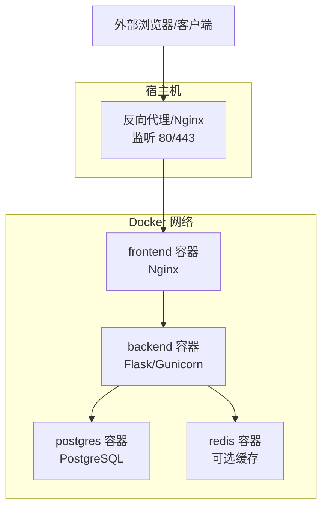
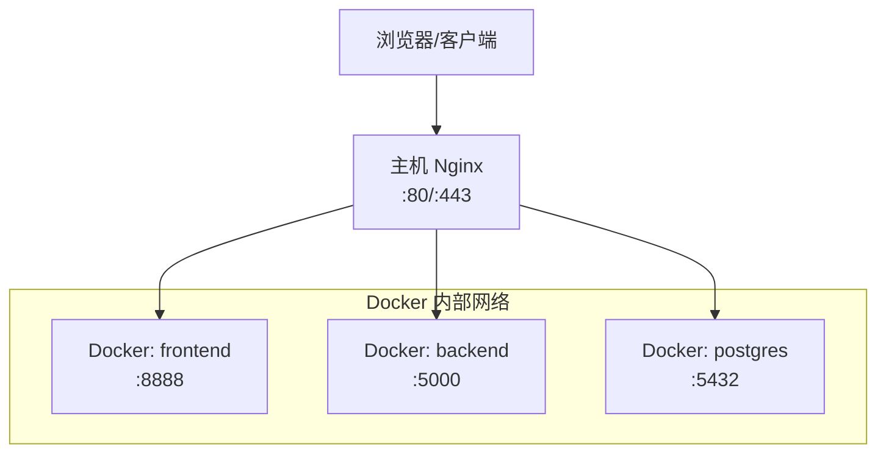
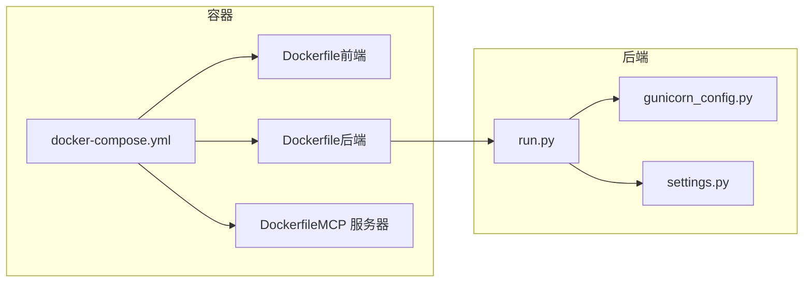

# 部署与配置

<cite>
**本文引用的文件**
- [docker-compose.yml](file://docker-compose.yml)
- [env.example](file://backend_api_python/env.example)
- [Dockerfile（后端）](file://backend_api_python/Dockerfile)
- [Dockerfile（前端）](file://frontend/Dockerfile)
- [Dockerfile（MCP 服务器）](file://mcp_server/Dockerfile)
- [run.py](file://backend_api_python/run.py)
- [gunicorn_config.py](file://backend_api_python/gunicorn_config.py)
- [nginx.conf.template](file://frontend/nginx.conf.template)
- [docker-entrypoint.sh](file://backend_api_python/docker-entrypoint.sh)
- [start.sh](file://backend_api_python/start.sh)
- [settings.py](file://backend_api_python/app/config/settings.py)
- [多用户部署指南](file://docs/multi-user-setup.md)
- [云平台部署指南（英文）](file://docs/CLOUD_DEPLOYMENT_EN.md)
- [OAuth 配置指南（英文）](file://docs/OAUTH_CONFIG_EN.md)
</cite>

## 目录
1. [简介](#简介)
2. [项目结构](#项目结构)
3. [核心组件](#核心组件)
4. [架构总览](#架构总览)
5. [详细组件分析](#详细组件分析)
6. [依赖关系分析](#依赖关系分析)
7. [性能考量](#性能考量)
8. [故障排除指南](#故障排除指南)
9. [结论](#结论)
10. [附录](#附录)

## 简介
本文件面向运维与开发工程师，系统化阐述 QuantDinger 的部署与配置方案，覆盖以下主题：
- Docker Compose 编排与容器间通信
- 环境变量体系与安全加固
- 生产级部署策略：反向代理、TLS 证书、负载均衡
- 数据库与缓存配置（PostgreSQL、Redis）
- LLM 提供商接入与多租户/多用户模式
- OAuth 集成与安全加固
- 云平台部署（含 AWS、Docker Hub 镜像源）
- 监控告警、备份恢复、性能调优与故障排除

## 项目结构
QuantDinger 采用“前后端分离 + 容器编排”的架构，核心服务通过 Docker Compose 统一编排，包含：
- 前端（Nginx 静态服务）
- 后端（Python/Flask + Gunicorn）
- 数据库（PostgreSQL）
- 可选缓存（Redis）

图表来源
- [docker-compose.yml:25-172](file://docker-compose.yml#L25-L172)
- [nginx.conf.template:1-60](file://frontend/nginx.conf.template#L1-L60)

章节来源
- [docker-compose.yml:1-172](file://docker-compose.yml#L1-L172)
- [Dockerfile（前端）:1-25](file://frontend/Dockerfile#L1-L25)
- [Dockerfile（后端）:1-62](file://backend_api_python/Dockerfile#L1-L62)

## 核心组件
- 前端容器（Nginx）
  - 作用：提供静态资源与反向代理，将 /api/* 转发到后端
  - 关键点：通过环境变量注入后端地址，支持单域名部署
- 后端容器（Flask + Gunicorn）
  - 作用：业务 API、交易执行、AI 分析、任务调度
  - 关键点：通过环境变量控制数据库、Redis、并发、日志等
- 数据库容器（PostgreSQL）
  - 作用：持久化用户、策略、订单、市场数据等
  - 关键点：连接池参数与健康检查
- 缓存容器（Redis，可选）
  - 作用：会话、限流、短期指标缓存
  - 关键点：内存限制与淘汰策略

章节来源
- [docker-compose.yml:29-131](file://docker-compose.yml#L29-L131)
- [nginx.conf.template:26-46](file://frontend/nginx.conf.template#L26-L46)
- [gunicorn_config.py:1-36](file://backend_api_python/gunicorn_config.py#L1-L36)

## 架构总览
下图展示生产推荐拓扑：单域名 + 主机 Nginx 反代，仅暴露 80/443，后端与数据库不直接对外。

图表来源
- [云平台部署指南（英文）:5-20](file://docs/CLOUD_DEPLOYMENT_EN.md#L5-L20)
- [docker-compose.yml:104-150](file://docker-compose.yml#L104-L150)

章节来源
- [云平台部署指南（英文）:1-451](file://docs/CLOUD_DEPLOYMENT_EN.md#L1-L451)

## 详细组件分析

### Docker Compose 编排与容器间通信
- 服务定义
  - postgres：初始化 SQL、健康检查、端口绑定（默认 127.0.0.1:5432）
  - redis：可选缓存，健康检查
  - backend：构建参数支持镜像前缀，依赖数据库与缓存健康，挂载 .env 以实现运行时配置更新
  - frontend：构建参数支持镜像前缀，依赖后端，通过环境变量注入后端地址
- 网络与卷
  - 使用自定义桥接网络，确保容器间通过服务名互通
  - 持久化卷用于数据库与后端日志/数据
- 健康检查
  - postgres、redis、frontend、backend 均配置健康检查，便于编排自动重启与依赖顺序

章节来源
- [docker-compose.yml:25-172](file://docker-compose.yml#L25-L172)

### 环境变量体系与安全加固
- 顶层 .env（Compose 使用）
  - 控制端口映射与镜像源（如 IMAGE_PREFIX）
  - 示例：FRONTEND_PORT、BACKEND_PORT、DB_PORT、IMAGE_PREFIX
- 后端 .env（应用加载）
  - 认证与安全：SECRET_KEY、ADMIN_USER、ADMIN_PASSWORD、OAUTH_*、TURNSTILE_*
  - 数据库与连接池：DATABASE_URL、DB_POOL_MIN/MAX、MARKET_EXECUTOR_WORKERS、PORTFOLIO_EXECUTOR_WORKERS
  - 并发与性能：GUNICORN_WORKERS、GUNICORN_THREADS
  - AI/LLM：LLM_PROVIDER 及各提供商密钥与模型
  - 其他：FRONTEND_URL、ENABLE_REGISTRATION、ALLOW_LOCAL_DESKTOP_BROKERS、BILLING_* 等
- 运行时安全检查
  - 容器入口脚本与应用启动均对 SECRET_KEY 进行校验，避免默认密钥导致的安全风险
  - 建议在生产环境持久化 SECRET_KEY，并在升级时保持一致

章节来源
- [env.example:1-319](file://backend_api_python/env.example#L1-L319)
- [docker-compose.yml:96-126](file://docker-compose.yml#L96-L126)
- [docker-entrypoint.sh:25-44](file://backend_api_python/docker-entrypoint.sh#L25-L44)
- [run.py:109-120](file://backend_api_python/run.py#L109-L120)

### 前端（Nginx）与反向代理
- 配置要点
  - 通过模板变量注入后端地址，支持单域名与双域名部署
  - 代理头设置、长连接超时、静态资源缓存、SPA 回退路由
  - 健康检查端点 /health
- 生产建议
  - 使用主机 Nginx 或同机其他反代统一处理 TLS 与 80/443
  - 将前端与后端置于同一域名，减少跨域复杂度

章节来源
- [nginx.conf.template:1-60](file://frontend/nginx.conf.template#L1-L60)
- [Dockerfile（前端）:13-20](file://frontend/Dockerfile#L13-L20)

### 后端（Flask + Gunicorn）
- 启动流程
  - run.py 加载 .env，应用代理与网络环境，创建应用实例
  - gunicorn_config.py 控制绑定地址、工作进程与线程数、日志级别等
- 关键配置项
  - 数据库连接池：DB_POOL_MIN/MAX/ACQUIRE_TIMEOUT/HEALTH_CHECK
  - 执行器并行度：MARKET_EXECUTOR_WORKERS、PORTFOLIO_EXECUTOR_WORKERS
  - 并发模型：GUNICORN_WORKERS、GUNICORN_THREADS
  - 安全与功能：ENABLE_CACHE、ENABLE_REQUEST_LOG、RATE_LIMIT、ENABLE_REGISTRATION

章节来源
- [run.py:17-98](file://backend_api_python/run.py#L17-L98)
- [gunicorn_config.py:1-36](file://backend_api_python/gunicorn_config.py#L1-L36)
- [settings.py:1-99](file://backend_api_python/app/config/settings.py#L1-L99)

### 数据库（PostgreSQL）与连接池
- 连接池参数
  - DB_POOL_MIN/MAX：根据并发与机器人数量调整
  - ACQUIRE_TIMEOUT：避免连接争用导致的阻塞
  - HEALTH_CHECK：启用健康检查降低无效连接
- PostgreSQL 参数
  - max_connections、shared_buffers：结合 DB_POOL_MAX 设置，预留余量
- 健康检查
  - 通过 pg_isready 检测，确保后端启动前数据库可用

章节来源
- [docker-compose.yml:38-58](file://docker-compose.yml#L38-L58)
- [env.example:42-61](file://backend_api_python/env.example#L42-L61)

### 缓存（Redis，可选）
- 用途：会话、限流、短期指标缓存
- 内存策略：LRU 淘汰，限制最大内存
- 健康检查：ping 检测

章节来源
- [docker-compose.yml:63-76](file://docker-compose.yml#L63-L76)

### MCP 服务器（可选）
- 作用：MCP（Model Context Protocol）服务，支持流式传输
- 端口与传输：默认 7800，支持 streamable-http
- 部署：容器化，按需启用

章节来源
- [Dockerfile（MCP 服务器）:1-26](file://mcp_server/Dockerfile#L1-L26)

### 多用户与多租户配置
- PostgreSQL 必须：SQLite 已不再支持
- 默认管理员账户与密码需立即修改
- 角色权限：admin、manager、user、viewer
- JWT 密钥一致性：升级或迁移时需保持 SECRET_KEY 不变

章节来源
- [多用户部署指南:1-214](file://docs/multi-user-setup.md#L1-L214)

### OAuth 集成与安全加固
- 支持 Google、GitHub 第三方登录，以及 Cloudflare Turnstile 验证
- 配置要点：回调地址、站点密钥、应用密钥、允许的重定向域名
- 生产部署：确保 FRONTEND_URL 与回调地址完全匹配，Turnstile 域名白名单包含生产域名

章节来源
- [OAuth 配置指南（英文）:1-228](file://docs/OAUTH_CONFIG_EN.md#L1-L228)
- [env.example:16-31](file://backend_api_python/env.example#L16-L31)

### LLM 提供商设置
- 支持 OpenRouter、OpenAI、Google、DeepSeek、Grok、Minimax、自定义兼容接口
- 配置项：API Key、模型名、基础 URL、温度、最大令牌、超时等
- 代码生成专用模型可单独指定

章节来源
- [env.example:63-98](file://backend_api_python/env.example#L63-L98)

### 本地桌面券商（IBKR/MT5）
- 本地终端要求：需要在可访问的机器上运行 TWS/IB Gateway 或 MT5 终端
- 多租户/云部署建议：关闭本地终端开关，避免错误流程

章节来源
- [env.example:153-165](file://backend_api_python/env.example#L153-L165)

## 依赖关系分析

图表来源
- [docker-compose.yml:25-172](file://docker-compose.yml#L25-L172)
- [run.py:96-101](file://backend_api_python/run.py#L96-L101)
- [gunicorn_config.py:10-20](file://backend_api_python/gunicorn_config.py#L10-L20)
- [settings.py:92-99](file://backend_api_python/app/config/settings.py#L92-L99)

章节来源
- [docker-compose.yml:25-172](file://docker-compose.yml#L25-L172)
- [run.py:96-101](file://backend_api_python/run.py#L96-L101)

## 性能考量
- 并发与连接池
  - 后端：GUNICORN_WORKERS × GUNICORN_THREADS 控制并发 I/O
  - 数据库：DB_POOL_MAX 与 PostgreSQL max_connections 保持安全余量
  - 执行器：MARKET_EXECUTOR_WORKERS + PORTFOLIO_EXECUTOR_WORKERS 应小于 DB_POOL_MAX
- 缓存
  - Redis 最大内存与淘汰策略，结合业务热点选择合适 TTL
- 网络与代理
  - 前端代理超时、长连接与大文件上传限制
- 日志与监控
  - 启用请求日志与访问日志，结合外部日志收集与告警

章节来源
- [env.example:42-61](file://backend_api_python/env.example#L42-L61)
- [docker-compose.yml:113-124](file://docker-compose.yml#L113-L124)
- [nginx.conf.template:41-45](file://frontend/nginx.conf.template#L41-L45)

## 故障排除指南
- 镜像拉取失败
  - 使用镜像前缀切换源，或配置 Docker Registry Mirror
- 容器启动报错找不到入口
  - 重新构建后端镜像并重启
- 前端无法解析上游后端
  - 检查后端健康状态与日志，优先修复后端再重启前端
- 前端构建失败（缺失 dist）
  - 排查 .dockerignore 是否排除了 frontend/dist
- 写入 .env 失败（只读文件系统）
  - 确保挂载为可写，避免 ro 模式
- 代理在容器内不可用
  - 使用 host.docker.internal 替代 127.0.0.1
- 交换所返回 symbol not found
  - 属于交易所符号映射问题，非网络问题
- Nginx 502/504
  - 检查后端与前端健康检查、Nginx 配置语法

章节来源
- [云平台部署指南（英文）:320-451](file://docs/CLOUD_DEPLOYMENT_EN.md#L320-L451)

## 结论
通过 Docker Compose 的标准化编排与完善的环境变量体系，QuantDinger 可在单机或云环境中快速完成生产级部署。建议遵循“单域名 + 主机反代 + 仅暴露 80/443”“的拓扑，配合严格的密钥管理、数据库与缓存参数调优、以及完善的监控与备份策略，确保系统稳定、安全与可扩展。

## 附录

### 生产部署清单（摘自官方文档）
- 服务器准备：Ubuntu/Debian、开放 22/80/443、域名 A 记录
- 安装 Docker 与 Compose
- 克隆仓库、生成 SECRET_KEY、最小化配置
- 配置项目根 .env（端口与镜像源）
- 启动容器并验证健康状态
- 安装并配置主机 Nginx，启用 HTTPS（Let’s Encrypt）
- 可选：分离前端/后端域名，注意 CORS 与回调地址
- 常用操作：查看状态、日志、更新与重启
- 故障排查：镜像拉取、入口脚本、上游解析、构建、只读挂载、代理、Nginx 错误码

章节来源
- [云平台部署指南（英文）:21-318](file://docs/CLOUD_DEPLOYMENT_EN.md#L21-L318)