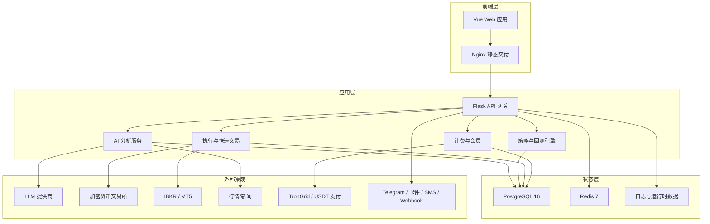
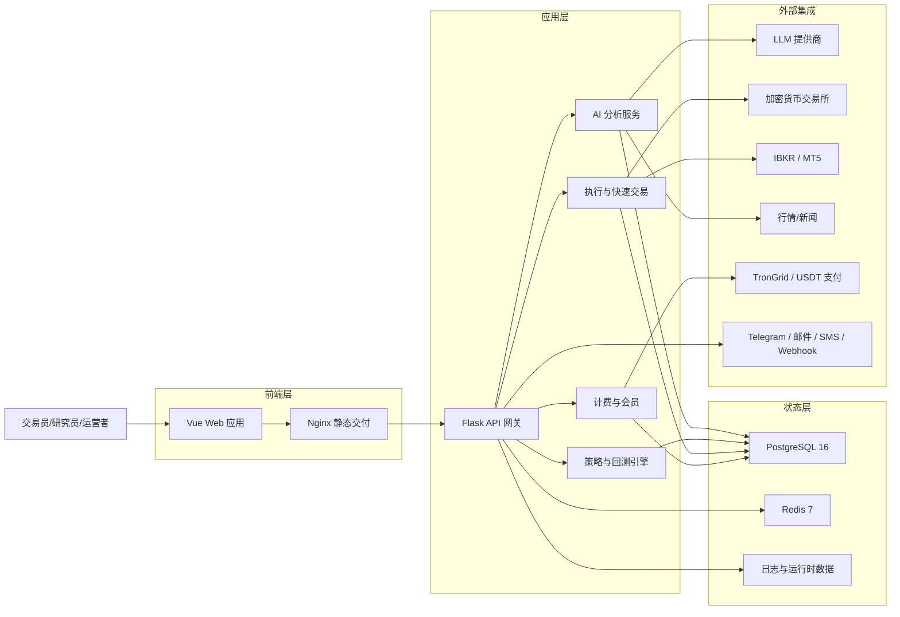
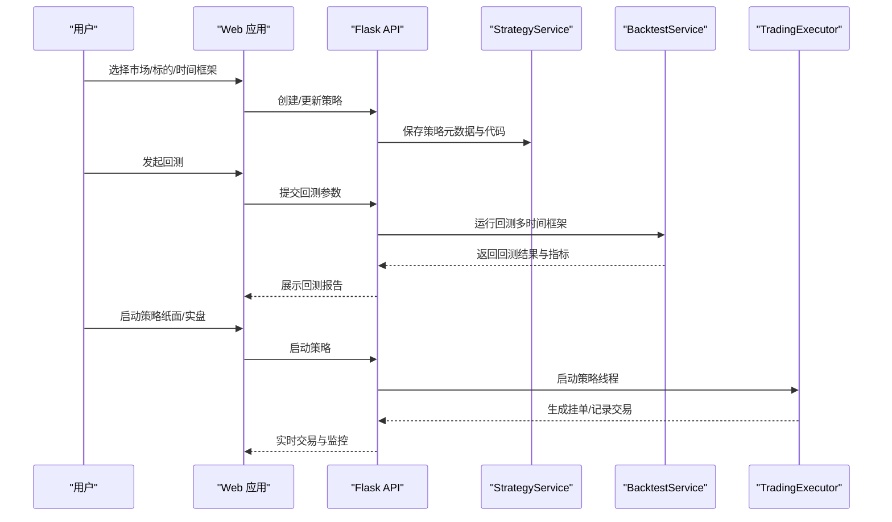
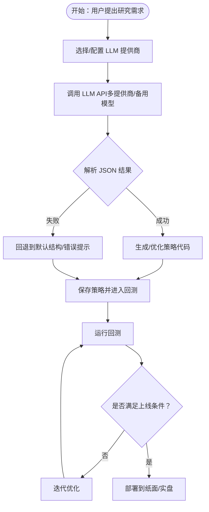
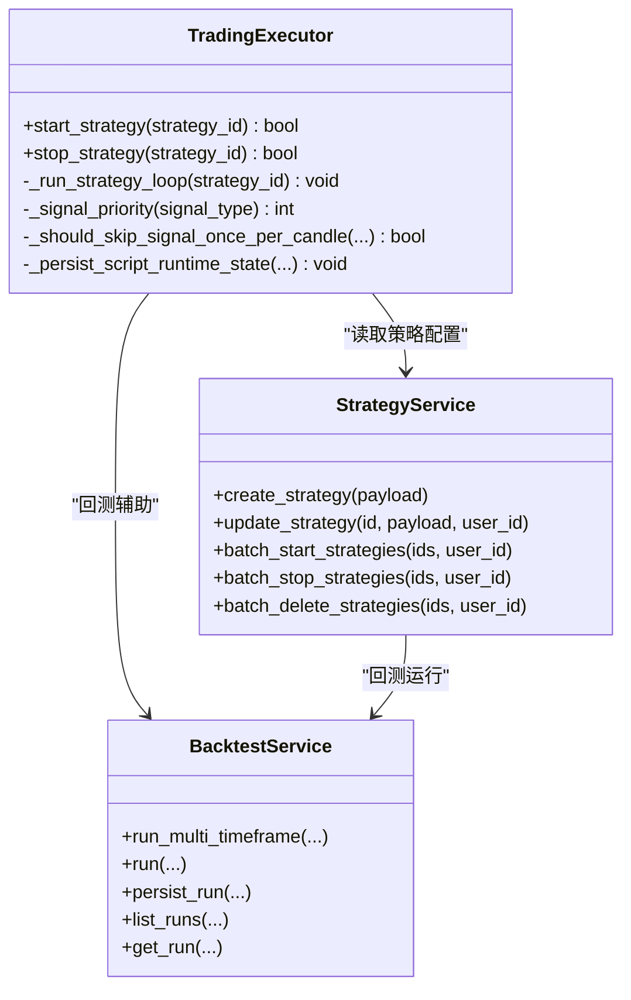
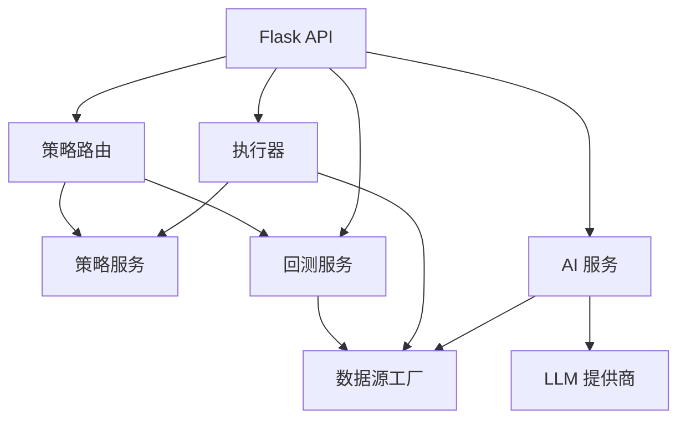

# 产品介绍

<cite>
**本文引用的文件**
- [README.md](file://README.md)
- [backend_api_python/README.md](file://backend_api_python/README.md)
- [docs/README_CN.md](file://docs/README_CN.md)
- [docs/LAUNCH_MATERIALS.md](file://docs/LAUNCH_MATERIALS.md)
- [backend_api_python/run.py](file://backend_api_python/run.py)
- [backend_api_python/app/__init__.py](file://backend_api_python/app/__init__.py)
- [backend_api_python/app/config/settings.py](file://backend_api_python/app/config/settings.py)
- [backend_api_python/app/routers/strategy.py](file://backend_api_python/app/routers/strategy.py)
- [backend_api_python/app/services/backtest.py](file://backend_api_python/app/services/backtest.py)
- [backend_api_python/app/services/trading_executor.py](file://backend_api_python/app/services/trading_executor.py)
- [backend_api_python/app/services/llm.py](file://backend_api_python/app/services/llm.py)
- [backend_api_python/app/data_sources/factory.py](file://backend_api_python/app/data_sources/factory.py)
- [docs/STRATEGY_DEV_GUIDE.md](file://docs/STRATEGY_DEV_GUIDE.md)
- [mcp_server/README.md](file://mcp_server/README.md)
- [docs/agent/AI_INTEGRATION_DESIGN.md](file://docs/agent/AI_INTEGRATION_DESIGN.md)
</cite>

## 目录
1. [引言](#引言)
2. [项目结构](#项目结构)
3. [核心组件](#核心组件)
4. [架构总览](#架构总览)
5. [详细组件分析](#详细组件分析)
6. [依赖关系分析](#依赖关系分析)
7. [性能考量](#性能考量)
8. [故障排查指南](#故障排查指南)
9. [结论](#结论)
10. [附录](#附录)

## 引言
QuantDinger 是一款“本地优先”的自托管量化操作系统，目标是将“AI 辅助研究、Python 原生策略、回测验证、实盘执行”整合为一条端到端的闭环工作流。产品强调“隐私保护、数据主权、可扩展性”，通过 Docker Compose 一键部署，支持加密货币、IBKR 美股、MT5 外汇等多市场接入，并提供 AI Agent 网关与 MCP 协议，既可作为桌面助手，也能与云端 Agent 集成。

- 本地优先与隐私保护：所有数据与密钥由用户自管，支持自签发 Agent Token，交易类默认仅纸面执行，Live 交易需显式启用。
- 从想法到实盘：AI 分析 → 指标/策略开发 → 回测 → 优化 → 纸面/实盘执行 → 监控。
- 可扩展性：模块化服务（策略引擎、回测、执行、AI、数据源工厂、通知等），支持多用户、计费、USDT 支付、多 LLM 提供商。

## 项目结构
QuantDinger 采用前后端分离与容器化部署的单仓结构：
- 前端：预构建 Web 资产，由 Nginx 提供静态服务。
- 后端：Flask 应用，提供 REST API、策略/回测/执行/AI/数据源/通知等服务。
- 数据层：PostgreSQL 存状态，Redis 支持后台任务。
- 外部集成：加密货币交易所、IBKR/MT5、LLM、支付通道、通知渠道。

**图示来源**
- [README.md:270-332](file://README.md#L270-L332)
- [backend_api_python/README.md:15-33](file://backend_api_python/README.md#L15-L33)

**章节来源**
- [README.md:270-332](file://README.md#L270-L332)
- [backend_api_python/README.md:15-33](file://backend_api_python/README.md#L15-L33)

## 核心组件
- 应用入口与启动：Flask 应用工厂、安全 JSON 输出、CORS、日志、数据库初始化、管理员账户保障、启动钩子（挂起订单、组合监控、USDT 订单、Polymarket、AI 校准、反思任务、策略恢复）。
- 配置系统：环境变量驱动，包含服务端口、调试模式、密钥、日志、功能开关、缓存、请求日志、安全限流等。
- 路由与策略：策略 CRUD、批量启停、回测、历史查询、交易记录与持仓查询。
- 回测引擎：多时间框架回测、缓存、执行精度估算、交易模拟、指标计算、结果持久化。
- 实盘执行：策略线程池、K 线服务、信号去重、订单生成、挂单派发、费用缓存、资源监控。
- AI 与 LLM：多提供商（OpenRouter/OpenAI/Google/DeepSeek/Grok/Minimax/自定义）统一抽象、模型名称规范化、备用模型与替代提供商、安全调用与 JSON 解析。
- 数据源工厂：按市场类型（加密、美股、港股、俄股、外汇、商品）选择具体数据源，统一 K 线与实时报价接口。

**章节来源**
- [backend_api_python/app/__init__.py:213-279](file://backend_api_python/app/__init__.py#L213-L279)
- [backend_api_python/app/config/settings.py:1-99](file://backend_api_python/app/config/settings.py#L1-L99)
- [backend_api_python/app/routers/strategy.py:295-800](file://backend_api_python/app/routers/strategy.py#L295-L800)
- [backend_api_python/app/services/backtest.py:64-142](file://backend_api_python/app/services/backtest.py#L64-L142)
- [backend_api_python/app/services/trading_executor.py:37-104](file://backend_api_python/app/services/trading_executor.py#L37-L104)
- [backend_api_python/app/services/llm.py:70-122](file://backend_api_python/app/services/llm.py#L70-L122)
- [backend_api_python/app/data_sources/factory.py:33-112](file://backend_api_python/app/data_sources/factory.py#L33-L112)

## 架构总览
QuantDinger 的系统架构围绕“数据源 → 引擎层（指标/信号/策略/回测/AI 分析）→ 执行层（挂单/成交/通知）”展开，形成从“想法 → 指标 → 策略 → 回测 → 优化 → 执行 → 监控”的闭环。

**图示来源**
- [README.md:270-332](file://README.md#L270-L332)

**章节来源**
- [README.md:270-332](file://README.md#L270-L332)

## 详细组件分析

### 组件A：策略开发与回测闭环
- 指标策略（IndicatorStrategy）：基于 DataFrame 的信号生成与可视化回测，适合研究与原型验证。
- 脚本策略（ScriptStrategy）：事件驱动的 bar 级状态管理与显式下单，适合执行导向与实盘对齐。
- 回测服务：多时间框架回测、缓存、执行精度估算、交易模拟、指标计算、结果持久化。
- 策略路由：策略 CRUD、批量启停、回测、历史查询、交易与持仓查询。

**图示来源**
- [docs/STRATEGY_DEV_GUIDE.md:1-200](file://docs/STRATEGY_DEV_GUIDE.md#L1-L200)
- [backend_api_python/app/routers/strategy.py:295-800](file://backend_api_python/app/routers/strategy.py#L295-L800)
- [backend_api_python/app/services/backtest.py:444-668](file://backend_api_python/app/services/backtest.py#L444-L668)
- [backend_api_python/app/services/trading_executor.py:395-496](file://backend_api_python/app/services/trading_executor.py#L395-L496)

**章节来源**
- [docs/STRATEGY_DEV_GUIDE.md:1-200](file://docs/STRATEGY_DEV_GUIDE.md#L1-L200)
- [backend_api_python/app/routers/strategy.py:295-800](file://backend_api_python/app/routers/strategy.py#L295-L800)
- [backend_api_python/app/services/backtest.py:444-668](file://backend_api_python/app/services/backtest.py#L444-L668)
- [backend_api_python/app/services/trading_executor.py:395-496](file://backend_api_python/app/services/trading_executor.py#L395-L496)

### 组件B：AI 驱动的研究与代码生成
- LLM 服务：统一多提供商（OpenRouter/OpenAI/Google/DeepSeek/Grok/Minimax/自定义），模型名称规范化、备用模型与替代提供商、安全调用与 JSON 解析。
- AI 集成设计：Agent 网关与 MCP 服务器，支持工具式交互（R/B/W/T 等作用域），默认仅纸面交易，Live 交易需显式授权与白名单。
- 数据源工厂：按市场类型选择数据源，统一 K 线与实时报价接口，支持缓存与错误处理。

**图示来源**
- [backend_api_python/app/services/llm.py:70-122](file://backend_api_python/app/services/llm.py#L70-L122)
- [docs/agent/AI_INTEGRATION_DESIGN.md:162-194](file://docs/agent/AI_INTEGRATION_DESIGN.md#L162-L194)
- [backend_api_python/app/data_sources/factory.py:87-112](file://backend_api_python/app/data_sources/factory.py#L87-L112)

**章节来源**
- [backend_api_python/app/services/llm.py:70-122](file://backend_api_python/app/services/llm.py#L70-L122)
- [docs/agent/AI_INTEGRATION_DESIGN.md:162-194](file://docs/agent/AI_INTEGRATION_DESIGN.md#L162-L194)
- [backend_api_python/app/data_sources/factory.py:87-112](file://backend_api_python/app/data_sources/factory.py#L87-L112)

### 组件C：执行与风险管理
- 执行器：策略线程池、K 线服务、信号去重、订单生成、挂单派发、费用缓存、资源监控。
- 风险控制：止损/止盈/移动止损、加减仓/网格/对冲等高级规则，支持多时间框架回测与执行精度估算。
- 后台任务：挂单工作者、组合监控、USDT 订单工作者、Polymarket 工作者、AI 校准与反思工作者。

**图示来源**
- [backend_api_python/app/services/trading_executor.py:37-104](file://backend_api_python/app/services/trading_executor.py#L37-L104)
- [backend_api_python/app/services/backtest.py:64-142](file://backend_api_python/app/services/backtest.py#L64-L142)
- [backend_api_python/app/routers/strategy.py:491-678](file://backend_api_python/app/routers/strategy.py#L491-L678)

**章节来源**
- [backend_api_python/app/services/trading_executor.py:37-104](file://backend_api_python/app/services/trading_executor.py#L37-L104)
- [backend_api_python/app/services/backtest.py:64-142](file://backend_api_python/app/services/backtest.py#L64-L142)
- [backend_api_python/app/routers/strategy.py:491-678](file://backend_api_python/app/routers/strategy.py#L491-L678)

## 依赖关系分析
- 组件耦合与内聚：策略路由与服务、回测服务与数据源工厂、执行器与策略服务、LLM 服务与 AI 分析服务相对独立，通过 API 与数据库交互。
- 直接与间接依赖：数据源工厂为回测与执行提供统一数据入口；LLM 服务为 AI 分析提供多提供商支持；执行器依赖策略配置与数据源；回测服务依赖数据源与指标参数解析。
- 外部依赖与集成点：加密货币交易所、IBKR/MT5、LLM 提供商、支付通道（TronGrid/USDT）、通知渠道（Telegram/邮件/SMS/Webhook）。
- 接口契约与实现细节：Agent 网关与 MCP 服务器提供工具式交互，交易类默认仅纸面，Live 交易需显式授权与白名单。

**图示来源**
- [backend_api_python/app/routers/strategy.py:295-800](file://backend_api_python/app/routers/strategy.py#L295-L800)
- [backend_api_python/app/services/backtest.py:64-142](file://backend_api_python/app/services/backtest.py#L64-L142)
- [backend_api_python/app/services/trading_executor.py:37-104](file://backend_api_python/app/services/trading_executor.py#L37-L104)
- [backend_api_python/app/services/llm.py:70-122](file://backend_api_python/app/services/llm.py#L70-L122)
- [backend_api_python/app/data_sources/factory.py:87-112](file://backend_api_python/app/data_sources/factory.py#L87-L112)

**章节来源**
- [backend_api_python/app/routers/strategy.py:295-800](file://backend_api_python/app/routers/strategy.py#L295-L800)
- [backend_api_python/app/services/backtest.py:64-142](file://backend_api_python/app/services/backtest.py#L64-L142)
- [backend_api_python/app/services/trading_executor.py:37-104](file://backend_api_python/app/services/trading_executor.py#L37-L104)
- [backend_api_python/app/services/llm.py:70-122](file://backend_api_python/app/services/llm.py#L70-L122)
- [backend_api_python/app/data_sources/factory.py:87-112](file://backend_api_python/app/data_sources/factory.py#L87-L112)

## 性能考量
- 回测性能：多时间框架回测与缓存（K 线缓存、执行精度估算），避免重复外部 API 调用；回测结果持久化与索引优化。
- 执行性能：策略线程池上限（STRATEGY_MAX_THREADS）、信号去重缓存、价格缓存 TTL、资源监控与告警。
- LLM 性能：多提供商自动切换、备用模型与替代提供商、超时与错误处理、JSON 安全解析与回退结构。
- 数据源性能：数据源工厂按市场类型选择最优实现，统一接口与错误处理，支持缓存与降级。

[本节为通用指导，不直接分析具体文件]

## 故障排查指南
- 启动与配置
  - SECRET_KEY 未设置或为默认值：后端拒绝启动，需在 .env 中设置强随机密钥。
  - 端口冲突：PostgreSQL/Redis/API/Web 端口冲突，调整根目录 .env 或 docker-compose.yml 映射。
  - CORS/前端 URL：FRONTEND_URL 与实际访问域名不一致导致跨域问题。
- 回测与执行
  - 回测范围超限：不同时间框架最大回测天数限制，需缩短日期范围或降低精度。
  - 策略线程上限：STRATEGY_MAX_THREADS 达到上限，需停止部分策略或提高阈值。
  - LLM 调用失败：检查 LLM_PROVIDER 与对应 API Key，必要时切换备用提供商或模型。
- AI 与 Agent
  - Agent Token 审计日志：所有调用均记录，便于追踪与审计。
  - MCP 传输：stdio（桌面 IDE）、SSE/streamable-http（云端/远程 IDE），按客户端选择。

**章节来源**
- [backend_api_python/run.py:104-134](file://backend_api_python/run.py#L104-L134)
- [backend_api_python/app/__init__.py:110-125](file://backend_api_python/app/__init__.py#L110-L125)
- [backend_api_python/app/services/backtest.py:170-224](file://backend_api_python/app/services/backtest.py#L170-L224)
- [backend_api_python/app/services/llm.py:428-437](file://backend_api_python/app/services/llm.py#L428-L437)
- [docs/agent/AI_INTEGRATION_DESIGN.md:184-194](file://docs/agent/AI_INTEGRATION_DESIGN.md#L184-L194)
- [mcp_server/README.md:58-87](file://mcp_server/README.md#L58-L87)

## 结论
QuantDinger 以“本地优先、隐私保护”为核心理念，提供从 AI 辅助研究、Python 原生策略开发、回测验证到实盘执行的完整闭环。通过模块化架构与多提供商集成，产品在保证数据主权的同时，兼顾易用性与可扩展性。针对个人交易者、量化研究人员与小型团队，QuantDinger 提供了可即用的自托管解决方案与灵活的部署选项。

[本节为总结性内容，不直接分析具体文件]

## 附录

### 产品定位与价值主张
- 定位：自托管、本地优先的量化操作系统，将 AI 研究、策略开发、回测与实盘执行整合为一。
- 价值主张：隐私保护（数据与密钥自管）、数据主权（本地部署）、可扩展性（模块化服务、多提供商、多市场接入）。

**章节来源**
- [README.md:74-78](file://README.md#L74-L78)
- [docs/README_CN.md:224-234](file://docs/README_CN.md#L224-L234)

### 工作流程（从想法到实盘）
- AI 辅助研究：自然语言描述 → LLM 生成/优化策略 → 保存策略。
- 策略开发：IndicatorStrategy/ScriptStrategy → 参数与风控默认值 → 图表与信号回测。
- 回测验证：多时间框架回测 → 指标与资金曲线 → 策略快照。
- 实盘执行：纸面/实盘切换 → 挂单派发 → 交易记录与监控。

**章节来源**
- [docs/STRATEGY_DEV_GUIDE.md:1-200](file://docs/STRATEGY_DEV_GUIDE.md#L1-L200)
- [backend_api_python/app/services/backtest.py:444-668](file://backend_api_python/app/services/backtest.py#L444-L668)
- [docs/README_CN.md:409-412](file://docs/README_CN.md#L409-L412)

### 用户类型与针对性价值
- 个人交易者：本地部署、隐私保护、简单易用、AI 即时辅助。
- 量化研究人员：DataFrame 指标策略、信号回测、参数扫描、策略模板复用。
- 小型团队：多用户角色、审计日志、Agent 网关与 MCP 工具、白名单与限额控制。

**章节来源**
- [README.md:222-234](file://README.md#L222-L234)
- [docs/README_CN.md:224-234](file://docs/README_CN.md#L224-L234)
- [docs/agent/AI_INTEGRATION_DESIGN.md:174-194](file://docs/agent/AI_INTEGRATION_DESIGN.md#L174-L194)

### 关键术语与应用场景
- 关键术语：IndicatorStrategy、ScriptStrategy、回测、挂单、Paper-only、Agent Token、MCP、多提供商 LLM。
- 应用场景：加密货币网格/趋势策略、美股/外汇因子研究、跨品种动量策略、AI 即时生成与优化。

**章节来源**
- [docs/STRATEGY_DEV_GUIDE.md:1-200](file://docs/STRATEGY_DEV_GUIDE.md#L1-L200)
- [README.md:484-536](file://README.md#L484-L536)
- [docs/README_CN.md:475-527](file://docs/README_CN.md#L475-L527)