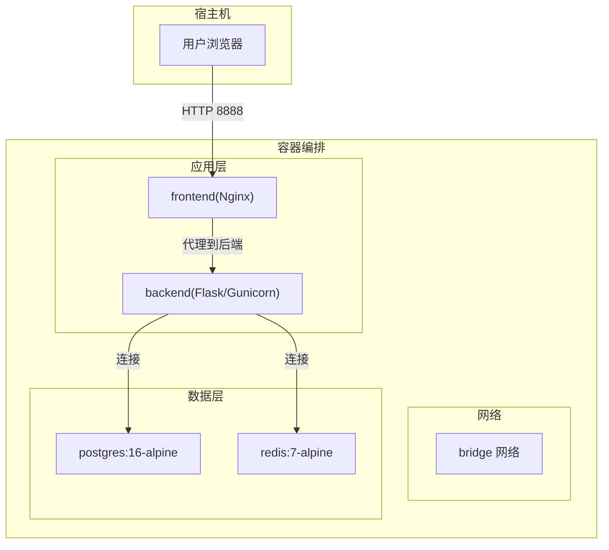
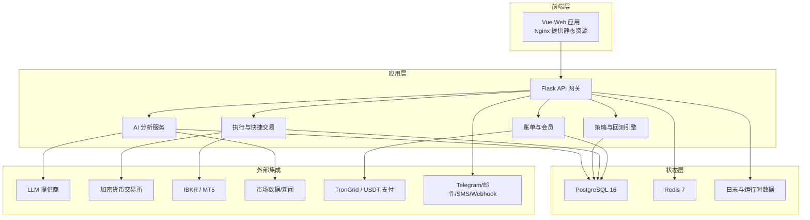
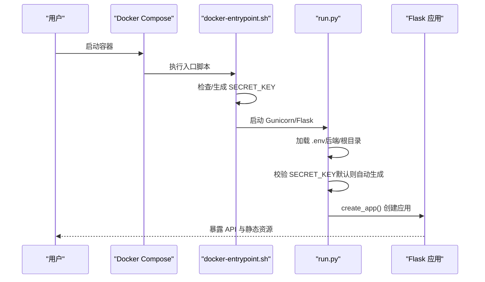
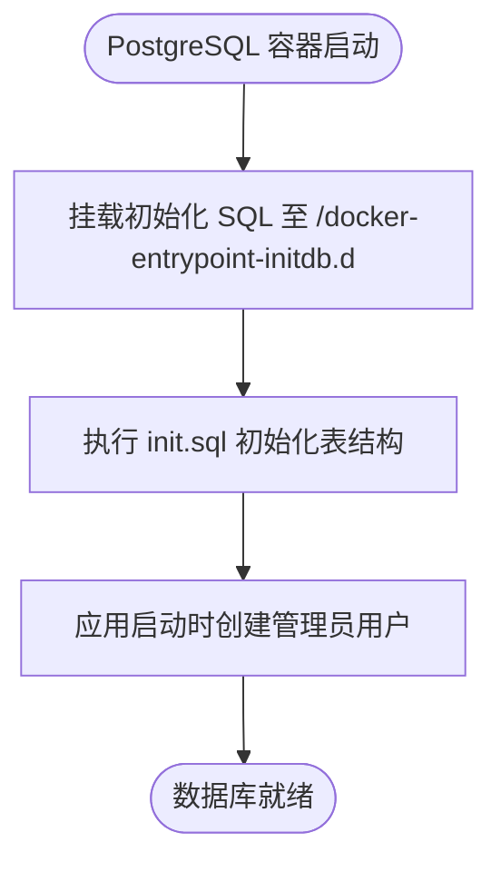
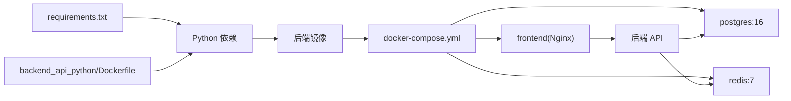

# 快速开始指南

<cite>
**本文引用的文件**   
- [README.md](file://README.md)
- [backend_api_python/README.md](file://backend_api_python/README.md)
- [docker-compose.yml](file://docker-compose.yml)
- [backend_api_python/env.example](file://backend_api_python/env.example)
- [scripts/generate-secret-key.sh](file://scripts/generate-secret-key.sh)
- [backend_api_python/Dockerfile](file://backend_api_python/Dockerfile)
- [backend_api_python/run.py](file://backend_api_python/run.py)
- [backend_api_python/start.sh](file://backend_api_python/start.sh)
- [backend_api_python/docker-entrypoint.sh](file://backend_api_python/docker-entrypoint.sh)
- [backend_api_python/requirements.txt](file://backend_api_python/requirements.txt)
- [backend_api_python/migrations/init.sql](file://backend_api_python/migrations/init.sql)
- [frontend/Dockerfile](file://frontend/Dockerfile)
</cite>

## 目录
1. [简介](#简介)
2. [项目结构](#项目结构)
3. [核心组件](#核心组件)
4. [架构总览](#架构总览)
5. [详细组件分析](#详细组件分析)
6. [依赖关系分析](#依赖关系分析)
7. [性能注意事项](#性能注意事项)
8. [故障排查指南](#故障排查指南)
9. [结论](#结论)
10. [附录](#附录)

## 简介
本指南面向首次部署 QuantDinger 的用户，提供从零到一的完整安装与初始配置流程，覆盖：
- Docker 环境准备与一键部署
- 代码克隆与配置文件设置
- 密钥生成与安全加固
- 服务启动与健康检查
- 首次登录与默认管理员密码修改
- 基本功能验证与常见问题排查
- 最小化示例（Python 指标策略）的实现步骤

目标是让新用户在最短时间内成功运行系统并体验核心功能。

## 项目结构
QuantDinger 采用“前端静态资源 + 后端 API + 数据库 + 缓存”的容器化组合，通过 Docker Compose 一键拉起。核心目录与职责如下：
- backend_api_python：Flask 后端源码、配置模板、迁移脚本、Dockerfile、入口脚本
- frontend：预构建的 Web 前端（Nginx 提供静态资源）
- docs：产品文档与示例
- scripts：辅助脚本（如密钥生成）
- 根目录 docker-compose.yml：编排数据库、缓存、后端、前端服务

**图示来源**
- [docker-compose.yml:25-172](file://docker-compose.yml#L25-L172)
- [frontend/Dockerfile:1-25](file://frontend/Dockerfile#L1-L25)
- [backend_api_python/Dockerfile:1-62](file://backend_api_python/Dockerfile#L1-L62)

**章节来源**
- [README.md:538-556](file://README.md#L538-L556)
- [docker-compose.yml:1-172](file://docker-compose.yml#L1-L172)

## 核心组件
- 后端 API（Flask + Gunicorn）
  - 负责用户认证、策略与回测引擎、AI 分析、执行通道、账单与会员体系等
  - 通过 .env 驱动配置，支持数据库连接池、并发工作线程、AI 提供商等参数
- 数据库（PostgreSQL 16）
  - 初始化脚本自动创建用户、积分、会员、USDT 订单、OAuth 状态、验证码、登录尝试、安全审计等表
- 缓存（Redis 7）
  - 可选缓存层，提升多 Worker 场景下的性能
- 前端（Nginx 预构建 SPA）
  - 通过环境变量注入后端地址，反向代理转发请求

**章节来源**
- [backend_api_python/README.md:1-33](file://backend_api_python/README.md#L1-L33)
- [backend_api_python/migrations/init.sql:1-200](file://backend_api_python/migrations/init.sql#L1-L200)
- [docker-compose.yml:29-159](file://docker-compose.yml#L29-L159)

## 架构总览
下图展示从浏览器到后端、数据库与外部集成的整体路径，以及数据与执行闭环。

**图示来源**
- [README.md:276-330](file://README.md#L276-L330)
- [backend_api_python/README.md:1-33](file://backend_api_python/README.md#L1-L33)

## 详细组件分析

### 安装与首次配置（Docker 一键部署）
- 先决条件
  - 已安装 Docker Desktop（Windows/macOS）或 Docker Engine + Compose 插件（Linux），并具备 Git
  - Node.js 不是必需的（前端已预构建）
- 步骤概览
  1) 克隆仓库并进入目录
  2) 复制并编辑后端配置模板
  3) 生成并写入 SECRET_KEY（必填）
  4) 启动编排服务
  5) 验证健康状态与登录
  6) 可选：启用 AI 功能
  7) 可选：自定义端口与镜像前缀

- macOS / Linux（Bash）
  - 一行命令或分步执行：
    - git clone 与进入目录
    - 复制 env.example 到 .env
    - 授予脚本可执行权限并生成密钥
    - docker-compose up -d --build
  - 若提示权限不足，请先 chmod +x scripts/generate-secret-key.sh
  - 若 docker-compose 命令不可用，请使用 docker compose（注意中间有空格）

- Windows（PowerShell）
  - 使用 PowerShell 执行：
    - git clone
    - Set-Location 进入目录
    - 复制 env.example 到 .env
    - 通过 Python 生成随机密钥并写入 .env
    - docker-compose up -d --build
  - 若提示 docker-compose 未找到，请使用 docker compose
  - 若 Python 命令不存在，请安装 Python 并加入 PATH

- Windows（Git Bash）
  - 在 Git Bash 中可直接复用 macOS/Linux 的一行命令

- 配置文件与密钥
  - 后端配置模板位于 backend_api_python/env.example，复制为 .env 后进行编辑
  - SECRET_KEY 必须在首次启动前设置，否则后端拒绝启动
  - 提供脚本 generate-secret-key.sh 自动生成并写入 .env

- 服务与端口
  - 默认端口：Web 8888，API 5000，数据库 5432，缓存 6379
  - 可通过根目录 .env 自定义端口与镜像前缀（IMAGE_PREFIX）

- 健康检查
  - Web：http://localhost:8888
  - API 健康：http://localhost:5000/api/health
  - 查看日志：docker-compose logs -f backend

- 首次登录与默认管理员
  - 默认管理员账户：quantdinger / 123456
  - 登录后立即修改默认密码
  - 可在 .env 中提前设置 ADMIN_USER / ADMIN_PASSWORD

- 可选：启用 AI 功能
  - 在 .env 中配置至少一个 LLM 提供商的密钥与模型
  - 重启后端生效

- 常见问题（首启）
  - 后端立即退出：检查 SECRET_KEY 是否仍为默认值或 .env 语法错误
  - 浏览器空白页或 API 报错：检查 FRONTEND_URL 与 CORS 设置，确认 API 可从当前主机访问
  - 端口冲突：调整根目录 .env 中的 FRONTEND_PORT / BACKEND_PORT / DB_PORT / REDIS_PORT
  - 策略过多导致“启动被拒”：提高 STRATEGY_MAX_THREADS 并重启 API

- 常用 Docker 命令
  - docker-compose ps / logs -f backend / restart backend / up -d --build / down

**章节来源**
- [README.md:81-120](file://README.md#L81-L120)
- [README.md:332-451](file://README.md#L332-L451)
- [scripts/generate-secret-key.sh:1-34](file://scripts/generate-secret-key.sh#L1-L34)
- [backend_api_python/env.example:1-319](file://backend_api_python/env.example#L1-L319)
- [docker-compose.yml:1-172](file://docker-compose.yml#L1-L172)

### 后端启动流程与密钥校验
后端启动时会读取 .env 并进行关键安全检查：
- 优先加载 backend_api_python/.env，其次加载根目录 .env
- 应用代理环境变量以适配国内数据源直连
- 启动前对 SECRET_KEY 进行校验：若为默认值则自动生成随机密钥并提示持久化

**图示来源**
- [backend_api_python/docker-entrypoint.sh:1-49](file://backend_api_python/docker-entrypoint.sh#L1-L49)
- [backend_api_python/run.py:17-129](file://backend_api_python/run.py#L17-L129)
- [backend_api_python/Dockerfile:48-61](file://backend_api_python/Dockerfile#L48-L61)

**章节来源**
- [backend_api_python/run.py:17-129](file://backend_api_python/run.py#L17-L129)
- [backend_api_python/docker-entrypoint.sh:11-44](file://backend_api_python/docker-entrypoint.sh#L11-L44)

### 数据库初始化与用户管理
- 首次启动时，PostgreSQL 容器会执行 /docker-entrypoint-initdb.d/01-init.sql
- 初始化脚本创建用户、积分、会员、USDT 订单、OAuth 状态、验证码、登录尝试、安全审计等核心表
- 应用启动时根据 ADMIN_USER / ADMIN_PASSWORD 创建管理员账户

**图示来源**
- [docker-compose.yml:49-49](file://docker-compose.yml#L49-L49)
- [backend_api_python/migrations/init.sql:1-200](file://backend_api_python/migrations/init.sql#L1-L200)

**章节来源**
- [docker-compose.yml:49-49](file://docker-compose.yml#L49-L49)
- [backend_api_python/migrations/init.sql:1-200](file://backend_api_python/migrations/init.sql#L1-L200)

### 前端与反向代理
- 前端容器基于 Nginx，提供预构建的 SPA 静态资源
- 通过环境变量注入后端地址（BACKEND_URL），实现反向代理
- 默认暴露 80 端口，映射至宿主的 FRONTEND_PORT（默认 8888）

**章节来源**
- [frontend/Dockerfile:1-25](file://frontend/Dockerfile#L1-L25)
- [docker-compose.yml:136-159](file://docker-compose.yml#L136-L159)

### 最小化示例：Python 指标策略
- 目标：编写一个基于双移动平均的信号策略，便于快速上手
- 实现步骤
  1) 在前端打开“指标 IDE”，新建策略
  2) 在策略编辑器中粘贴示例逻辑（含参数声明与信号生成）
  3) 选择标的与时间范围，运行回测验证
  4) 将策略保存并设置为“停止”状态，准备接入实盘或快速交易
- 示例参考
  - 文档中的最小示例脚本与更多示例位于 docs/examples/

**章节来源**
- [README.md:453-483](file://README.md#L453-L483)
- [docs/examples/dual_ma_with_params.py](file://docs/examples/dual_ma_with_params.py)

## 依赖关系分析
- 后端依赖
  - Python 运行时与包管理：requirements.txt 列出 Flask、Werkzeug、CORS、金融数据接口、加密、数据库、缓存、生产服务器等
  - Docker 构建顺序：apt 包安装（镜像加速回退）、pip 安装（镜像加速回退）、复制源码、设置入口脚本与工作目录
- 编排依赖
  - 后端依赖数据库与缓存健康；前端依赖后端可达
  - 环境变量贯穿于各服务之间（如 FRONTEND_URL、DATABASE_URL、REDIS_HOST/PORT 等）

**图示来源**
- [backend_api_python/requirements.txt:1-37](file://backend_api_python/requirements.txt#L1-L37)
- [backend_api_python/Dockerfile:1-62](file://backend_api_python/Dockerfile#L1-L62)
- [docker-compose.yml:25-159](file://docker-compose.yml#L25-L159)

**章节来源**
- [backend_api_python/requirements.txt:1-37](file://backend_api_python/requirements.txt#L1-L37)
- [backend_api_python/Dockerfile:1-62](file://backend_api_python/Dockerfile#L1-L62)
- [docker-compose.yml:1-172](file://docker-compose.yml#L1-L172)

## 性能注意事项
- 数据库连接池
  - DB_POOL_MIN / DB_POOL_MAX / DB_POOL_ACQUIRE_TIMEOUT / DB_POOL_HEALTH_CHECK 可按并发与策略数量调优
  - MARKET_EXECUTOR_WORKERS + PORTFOLIO_EXECUTOR_WORKERS 之和应低于 DB_POOL_MAX
- 并发与线程
  - GUNICORN_WORKERS × GUNICORN_THREADS 决定后端并发能力
- 缓存
  - 启用 Redis（CACHE_ENABLED=true）可降低重复查询压力
- 策略并发
  - STRATEGY_MAX_THREADS 控制“实盘/信号策略”并发线程上限，需结合系统资源评估

**章节来源**
- [backend_api_python/env.example:42-62](file://backend_api_python/env.example#L42-L62)
- [backend_api_python/env.example:223-234](file://backend_api_python/env.example#L223-L234)

## 故障排查指南
- 后端立即退出
  - 检查 SECRET_KEY 是否仍为默认值；查看 docker-compose logs backend 获取详细错误
- 浏览器空白页或 API 报错
  - 核对 FRONTEND_URL 与实际访问域名一致；确认 API 可从浏览器所在网络访问
- 端口冲突
  - 修改根目录 .env 中的 FRONTEND_PORT / BACKEND_PORT / DB_PORT / REDIS_PORT
- 策略过多导致“启动被拒”
  - 提升 STRATEGY_MAX_THREADS 并重启 API
- 常用命令
  - docker-compose ps / logs -f backend / restart backend / up -d --build / down

**章节来源**
- [README.md:418-436](file://README.md#L418-L436)
- [backend_api_python/run.py:114-120](file://backend_api_python/run.py#L114-L120)

## 结论
通过本指南，您已完成 QuantDinger 的本地一键部署、基础配置与初始验证。建议在完成默认管理员密码修改后，逐步探索 AI 分析、指标策略开发与回测，并在测试环境中接入少量真实资金进行演练。后续可按需扩展 AI 提供商、通知渠道与计费模块。

## 附录
- 常用端点
  - Web：http://localhost:8888
  - API 健康：http://localhost:5000/api/health
- 常用命令
  - docker-compose ps / logs -f backend / restart backend / up -d --build / down
- 参考文档
  - 后端 README 与配置模板、架构图与功能概览

**章节来源**
- [README.md:384-391](file://README.md#L384-L391)
- [backend_api_python/README.md:1-33](file://backend_api_python/README.md#L1-L33)