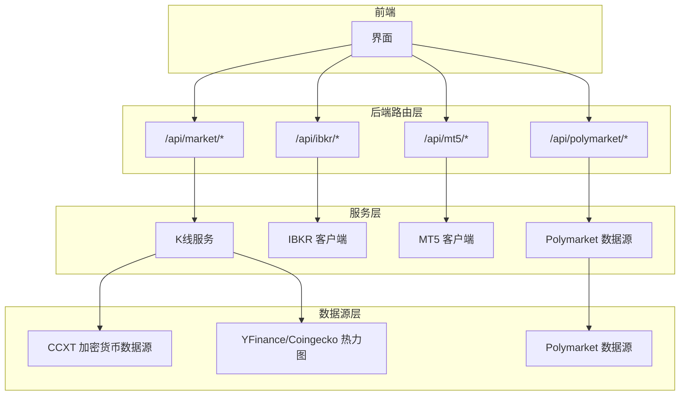
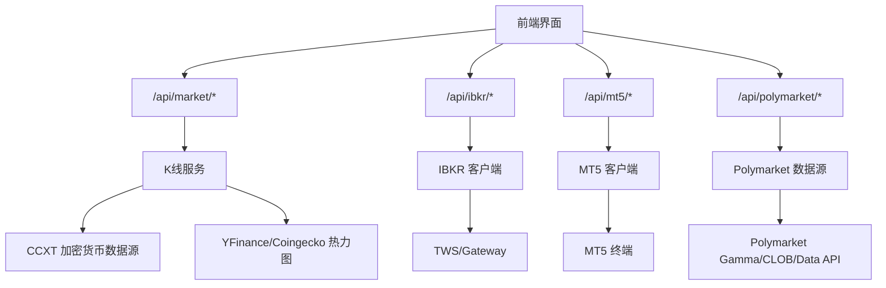
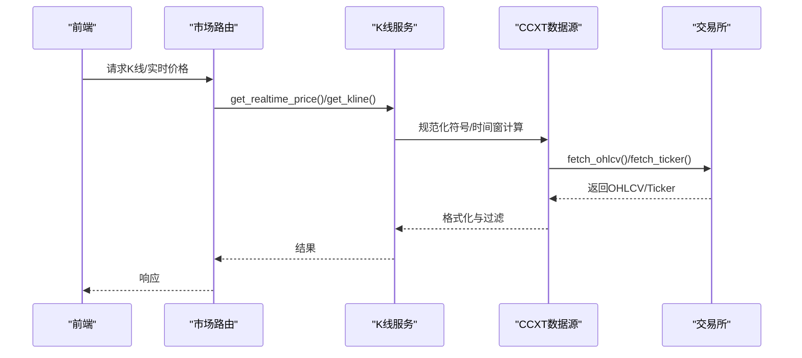
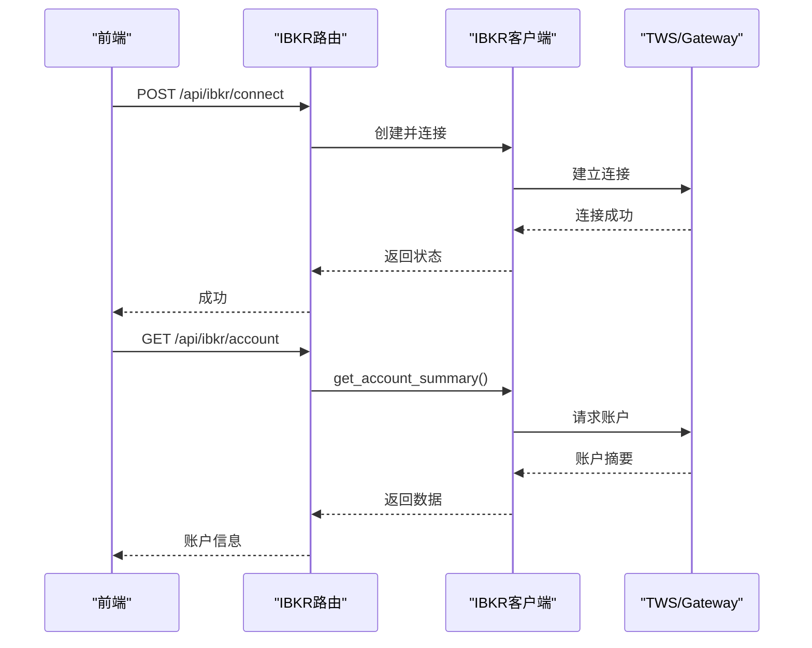
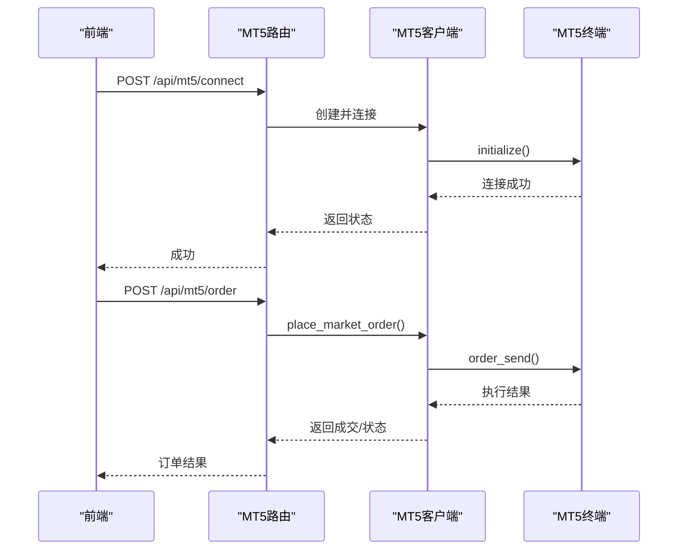
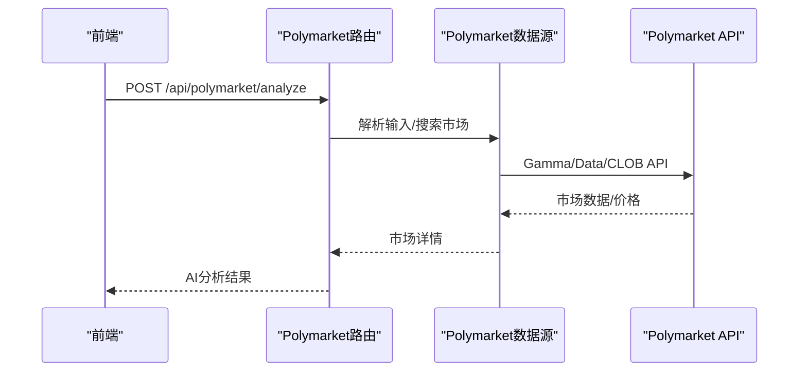
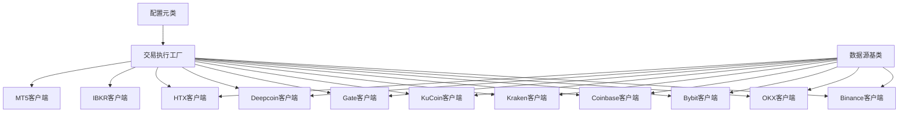

# 支持的市场类型

<cite>
**本文引用的文件**
- [backend_api_python/app/data_sources/crypto.py](file://backend_api_python/app/data_sources/crypto.py)
- [backend_api_python/app/data_sources/polymarket.py](file://backend_api_python/app/data_sources/polymarket.py)
- [backend_api_python/app/services/live_trading/binance.py](file://backend_api_python/app/services/live_trading/binance.py)
- [backend_api_python/app/services/mt5_trading/client.py](file://backend_api_python/app/services/mt5_trading/client.py)
- [backend_api_python/app/route/market.py](file://backend_api_python/app/route/market.py)
- [backend_api_python/app/route/ibkr.py](file://backend_api_python/app/route/ibkr.py)
- [backend_api_python/app/route/polymarket.py](file://backend_api_python/app/route/polymarket.py)
- [backend_api_python/app/services/ibkr_trading/client.py](file://backend_api_python/app/services/ibkr_trading/client.py)
- [backend_api_python/app/data_sources/base.py](file://backend_api_python/app/data_sources/base.py)
- [backend_api_python/app/config/data_sources.py](file://backend_api_python/app/config/data_sources.py)
- [backend_api_python/app/data_providers/crypto.py](file://backend_api_python/app/data_providers/crypto.py)
- [backend_api_python/app/services/live_trading/factory.py](file://backend_api_python/app/services/live_trading/factory.py)
</cite>

## 目录
1. [简介](#简介)
2. [项目结构](#项目结构)
3. [核心组件](#核心组件)
4. [架构总览](#架构总览)
5. [详细组件分析](#详细组件分析)
6. [依赖关系分析](#依赖关系分析)
7. [性能考虑](#性能考虑)
8. [故障排除指南](#故障排除指南)
9. [结论](#结论)
10. [附录](#附录)

## 简介
本文件系统性梳理 QuantDinger 量化平台支持的三大市场类别：加密货币交易所、传统金融市场（美国股票与外汇）、预测市场，并基于仓库中的实际实现，说明各市场的数据来源、执行方式、API 集成、风险控制与配置要点。文档同时提供市场选择建议、配置指南与实际交易流程图示，帮助用户在不同市场中安全、稳定地开展策略研究与实盘交易。

## 项目结构
QuantDinger 的市场支持由“数据源层”“交易执行层”“路由与服务层”共同构成：
- 数据源层：负责从交易所或第三方 API 获取行情与市场数据（如加密货币、预测市场 Polymarket）。
- 交易执行层：封装各交易所/券商的 REST/Socket 客户端，提供下单、查询、风控等能力。
- 路由与服务层：对外暴露 HTTP 接口，协调数据与交易流程，提供 UI 所需的市场类型、符号搜索、价格查询等功能。

图表来源
- [backend_api_python/app/route/market.py:1-643](file://backend_api_python/app/route/market.py#L1-L643)
- [backend_api_python/app/route/ibkr.py:1-383](file://backend_api_python/app/route/ibkr.py#L1-L383)
- [backend_api_python/app/route/polymarket.py:1-329](file://backend_api_python/app/route/polymarket.py#L1-L329)
- [backend_api_python/app/services/mt5_trading/client.py:1-858](file://backend_api_python/app/services/mt5_trading/client.py#L1-L858)
- [backend_api_python/app/data_sources/crypto.py:1-428](file://backend_api_python/app/data_sources/crypto.py#L1-L428)
- [backend_api_python/app/data_sources/polymarket.py:1-800](file://backend_api_python/app/data_sources/polymarket.py#L1-L800)

章节来源
- [backend_api_python/app/route/market.py:1-643](file://backend_api_python/app/route/market.py#L1-L643)
- [backend_api_python/app/route/ibkr.py:1-383](file://backend_api_python/app/route/ibkr.py#L1-L383)
- [backend_api_python/app/route/polymarket.py:1-329](file://backend_api_python/app/route/polymarket.py#L1-L329)
- [backend_api_python/app/services/mt5_trading/client.py:1-858](file://backend_api_python/app/services/mt5_trading/client.py#L1-L858)
- [backend_api_python/app/data_sources/crypto.py:1-428](file://backend_api_python/app/data_sources/crypto.py#L1-L428)
- [backend_api_python/app/data_sources/polymarket.py:1-800](file://backend_api_python/app/data_sources/polymarket.py#L1-L800)

## 核心组件
- 加密货币数据源（CCXT）
  - 支持主流交易所（如 Binance、OKX、Bybit、Coinbase、Kraken、Gate、KuCoin、Deepcoin、HTX 等）通过 CCXT 获取行情与 K 线。
  - 提供符号规范化、交易所差异适配、批量分页拉取、延迟检测与日志记录。
- 传统金融（美国股票与外汇）
  - 美国股票：通过 IBKR（TWS/Gateway）进行下单、查询账户与订单、获取报价。
  - 外汇：通过 MT5（MetaQuotes 5）终端进行外汇交易，支持市价单、限价单、平仓与挂单。
- 预测市场（Polymarket）
  - 提供市场搜索、详情获取、趋势市场聚合、AI 分析调用与历史记录管理。
- 交易执行工厂
  - 统一创建各交易所/券商客户端，支持模拟/实盘切换、参数覆盖、错误处理与连接校验。

章节来源
- [backend_api_python/app/data_sources/crypto.py:1-428](file://backend_api_python/app/data_sources/crypto.py#L1-L428)
- [backend_api_python/app/services/ibkr_trading/client.py:1-555](file://backend_api_python/app/services/ibkr_trading/client.py#L1-L555)
- [backend_api_python/app/services/mt5_trading/client.py:1-858](file://backend_api_python/app/services/mt5_trading/client.py#L1-L858)
- [backend_api_python/app/data_sources/polymarket.py:1-800](file://backend_api_python/app/data_sources/polymarket.py#L1-L800)
- [backend_api_python/app/services/live_trading/factory.py:1-441](file://backend_api_python/app/services/live_trading/factory.py#L1-L441)

## 架构总览
下图展示从 UI 到数据源与交易执行的整体链路，以及各市场类型的接入方式。

图表来源
- [backend_api_python/app/route/market.py:1-643](file://backend_api_python/app/route/market.py#L1-L643)
- [backend_api_python/app/route/ibkr.py:1-383](file://backend_api_python/app/route/ibkr.py#L1-L383)
- [backend_api_python/app/route/polymarket.py:1-329](file://backend_api_python/app/route/polymarket.py#L1-L329)
- [backend_api_python/app/services/ibkr_trading/client.py:1-555](file://backend_api_python/app/services/ibkr_trading/client.py#L1-L555)
- [backend_api_python/app/services/mt5_trading/client.py:1-858](file://backend_api_python/app/services/mt5_trading/client.py#L1-L858)
- [backend_api_python/app/data_sources/polymarket.py:1-800](file://backend_api_python/app/data_sources/polymarket.py#L1-L800)

## 详细组件分析

### 加密货币交易所（CCXT）
- 数据来源与支持
  - 通过 CCXT 抽象统一接入多家交易所，包括但不限于 Binance、OKX、Bybit、Coinbase、Kraken、Gate、KuCoin、Deepcoin、HTX 等。
  - 支持 K 线与实时行情获取，具备符号规范化、交易所差异适配与批量分页拉取能力。
- 执行方式与风险控制
  - K 线获取采用分页与去重策略，避免重复与空档导致的数据错乱。
  - 提供延迟检测与日志告警，便于发现数据源异常。
  - 通过配置项支持超时、速率限制与代理设置。
- 实际交易示例（概念流程）
  - 通过交易工厂创建具体交易所客户端（如 Binance Futures/Spot、OKX、Bybit 等），随后调用下单、查询账户与手续费等接口。
- 配置要点
  - 默认交易所、超时、时间周期映射、代理等均来自配置模块。
  - 支持通过环境变量或配置文件覆盖默认行为。

图表来源
- [backend_api_python/app/route/market.py:371-518](file://backend_api_python/app/route/market.py#L371-L518)
- [backend_api_python/app/data_sources/crypto.py:232-428](file://backend_api_python/app/data_sources/crypto.py#L232-L428)
- [backend_api_python/app/data_sources/base.py:1-180](file://backend_api_python/app/data_sources/base.py#L1-L180)
- [backend_api_python/app/config/data_sources.py:102-152](file://backend_api_python/app/config/data_sources.py#L102-L152)

章节来源
- [backend_api_python/app/data_sources/crypto.py:1-428](file://backend_api_python/app/data_sources/crypto.py#L1-L428)
- [backend_api_python/app/data_sources/base.py:1-180](file://backend_api_python/app/data_sources/base.py#L1-L180)
- [backend_api_python/app/config/data_sources.py:102-152](file://backend_api_python/app/config/data_sources.py#L102-L152)
- [backend_api_python/app/data_providers/crypto.py:1-232](file://backend_api_python/app/data_providers/crypto.py#L1-L232)

### 传统金融市场（美国股票与外汇）

#### 美国股票（IBKR）
- 数据来源与支持
  - 通过 ib_insync 库连接 TWS 或 IB Gateway，支持账户查询、持仓、订单、报价与下单。
- 执行方式与风险控制
  - 异步事件循环管理，连接状态检查，错误与拒绝状态处理。
  - 严格参数校验（买卖方向、数量、价格等），失败时返回明确错误信息。
- 实际交易示例（概念流程）
  - 连接 IBKR → 查询账户 → 下单（市价/限价）→ 查询成交与手续费 → 平仓/撤单。

图表来源
- [backend_api_python/app/route/ibkr.py:52-138](file://backend_api_python/app/route/ibkr.py#L52-L138)
- [backend_api_python/app/services/ibkr_trading/client.py:110-175](file://backend_api_python/app/services/ibkr_trading/client.py#L110-L175)

章节来源
- [backend_api_python/app/route/ibkr.py:1-383](file://backend_api_python/app/route/ibkr.py#L1-L383)
- [backend_api_python/app/services/ibkr_trading/client.py:1-555](file://backend_api_python/app/services/ibkr_trading/client.py#L1-L555)

#### 外汇（MT5）
- 数据来源与支持
  - 通过 MetaTrader5 Python 库连接 MT5 终端，支持外汇交易（仅 Forex）。
- 执行方式与风险控制
  - 符号标准化与可见性检查，最小/最大/步进量校验，填充模式选择（IOC/FOK/RETURN）。
  - 连接状态检查与异常处理，失败时返回错误信息。
- 实际交易示例（概念流程）
  - 连接 MT5 → 选择/添加交易品种 → 市价单/限价单下单 → 查询订单/持仓 → 平仓/撤单。

图表来源
- [backend_api_python/app/route/mt5.py:1-200](file://backend_api_python/app/routes/mt5.py#L1-L200) 与 [backend_api_python/app/services/mt5_trading/client.py:101-155](file://backend_api_python/app/services/mt5_trading/client.py#L101-L155)

章节来源
- [backend_api_python/app/services/mt5_trading/client.py:1-858](file://backend_api_python/app/services/mt5_trading/client.py#L1-L858)

### 预测市场（Polymarket）
- 数据来源与支持
  - 通过 Polymarket Gamma API、Data API、CLOB API 获取市场、事件、标签、订单簿与价格。
  - 支持热门市场、市场详情、关键词搜索、分类筛选与数据库缓存。
- 执行方式与风险控制
  - 多源数据融合与评分排序，提供 slug/id/symbol 等多种入口。
  - 限流与错误处理，API 不可用时返回空列表而非抛出异常。
- 实际交易示例（概念流程）
  - 输入 Polymarket 链接/标题 → 解析 market_id/slug → 获取市场详情 → AI 分析 → 记录历史。

图表来源
- [backend_api_python/app/route/polymarket.py:22-228](file://backend_api_python/app/route/polymarket.py#L22-L228)
- [backend_api_python/app/data_sources/polymarket.py:35-160](file://backend_api_python/app/data_sources/polymarket.py#L35-L160)

章节来源
- [backend_api_python/app/route/polymarket.py:1-329](file://backend_api_python/app/route/polymarket.py#L1-L329)
- [backend_api_python/app/data_sources/polymarket.py:1-800](file://backend_api_python/app/data_sources/polymarket.py#L1-L800)

## 依赖关系分析
- 交易执行工厂
  - 统一创建各交易所/券商客户端，支持模拟/实盘切换、参数覆盖、错误处理与连接校验。
  - 支持的交易所/券商：Binance、OKX、Bitget、Bybit、Coinbase、Kraken、KuCoin、Gate、Deepcoin、HTX、IBKR、MT5。
- 配置体系
  - 通过配置元类动态读取 addon 配置与环境变量，统一管理超时、重试、时间周期映射、代理等。
- 数据源基类
  - 提供统一的 K 线接口、格式化、时间范围计算、过滤截断与延迟检测。

图表来源
- [backend_api_python/app/services/live_trading/factory.py:1-441](file://backend_api_python/app/services/live_trading/factory.py#L1-L441)
- [backend_api_python/app/config/data_sources.py:102-152](file://backend_api_python/app/config/data_sources.py#L102-L152)
- [backend_api_python/app/data_sources/base.py:28-180](file://backend_api_python/app/data_sources/base.py#L28-L180)

章节来源
- [backend_api_python/app/services/live_trading/factory.py:1-441](file://backend_api_python/app/services/live_trading/factory.py#L1-L441)
- [backend_api_python/app/config/data_sources.py:1-173](file://backend_api_python/app/config/data_sources.py#L1-L173)
- [backend_api_python/app/data_sources/base.py:1-180](file://backend_api_python/app/data_sources/base.py#L1-L180)

## 性能考虑
- 加密货币数据
  - 分页拉取与去重，避免重复与空档导致的性能损耗。
  - 缓存热门市场（Polymarket）与交易所市场列表，降低重复请求。
- 交易执行
  - 通过工厂统一创建客户端，减少重复初始化开销。
  - IBKR/MT5 需要长连接与事件循环，注意连接复用与异常恢复。
- 预测市场
  - 搜索与评分排序可能产生较多 API 调用，建议合理设置缓存与限流。

## 故障排除指南
- 加密货币数据
  - 符号不支持：检查交易所市场列表与符号规范化逻辑，必要时切换默认交易所。
  - 限流/超时：调整超时与重试配置，必要时启用代理。
- IBKR
  - 连接失败：确认 TWS/Gateway 正在运行、端口与 clientId 配置正确。
  - 订单被拒：检查买卖方向、数量、价格与账户权限。
- MT5
  - 连接失败：确认 MT5 终端运行、Windows 环境、登录/密码/服务器正确。
  - 订单未成交：检查填充模式与滑点设置。
- Polymarket
  - API 不可用：返回空列表，检查网络与服务状态。
  - 搜索无结果：尝试更广泛的关键词或直接使用 slug/id。

章节来源
- [backend_api_python/app/data_sources/crypto.py:176-306](file://backend_api_python/app/data_sources/crypto.py#L176-L306)
- [backend_api_python/app/services/ibkr_trading/client.py:110-175](file://backend_api_python/app/services/ibkr_trading/client.py#L110-L175)
- [backend_api_python/app/services/mt5_trading/client.py:101-155](file://backend_api_python/app/services/mt5_trading/client.py#L101-L155)
- [backend_api_python/app/data_sources/polymarket.py:533-541](file://backend_api_python/app/data_sources/polymarket.py#L533-L541)

## 结论
QuantDinger 在三大市场类型上提供了较为完善的基础设施：加密货币通过 CCXT 实现多交易所统一接入与风控；美国股票与外汇分别通过 IBKR 与 MT5 提供稳健的实盘执行通道；预测市场通过 Polymarket 数据源与 AI 分析形成闭环。结合配置体系与工厂模式，平台能够灵活适配不同市场与场景需求。

## 附录

### 市场类型与支持度概览
- 加密货币（CCXT）
  - 支持交易所：Binance、OKX、Bybit、Coinbase、Kraken、Gate、KuCoin、Deepcoin、HTX 等。
  - 执行方式：REST/WS（由 CCXT 抽象），支持分页与去重。
  - 风险控制：延迟检测、符号规范化、最小下单量校验。
- 传统金融
  - 美国股票（IBKR）：TWS/Gateway，支持账户、订单、报价与下单。
  - 外汇（MT5）：仅支持 Forex，支持市价/限价/挂单/平仓。
- 预测市场（Polymarket）
  - 数据源：Gamma/CLOB/Data API，支持热门市场、搜索、详情与 AI 分析。

章节来源
- [backend_api_python/app/services/live_trading/factory.py:1-441](file://backend_api_python/app/services/live_trading/factory.py#L1-L441)
- [backend_api_python/app/data_sources/crypto.py:1-428](file://backend_api_python/app/data_sources/crypto.py#L1-L428)
- [backend_api_python/app/services/ibkr_trading/client.py:1-555](file://backend_api_python/app/services/ibkr_trading/client.py#L1-L555)
- [backend_api_python/app/services/mt5_trading/client.py:1-858](file://backend_api_python/app/services/mt5_trading/client.py#L1-L858)
- [backend_api_python/app/data_sources/polymarket.py:1-800](file://backend_api_python/app/data_sources/polymarket.py#L1-L800)

### 配置指南（关键项）
- 加密货币（CCXT）
  - 默认交易所、超时、时间周期映射、代理。
- IBKR
  - 主机、端口、clientId、账户、只读模式。
- MT5
  - 登录、密码、服务器、可选终端路径。
- Polymarket
  - API 端点（Gamma/CLOB/Data），缓存 TTL。

章节来源
- [backend_api_python/app/config/data_sources.py:102-152](file://backend_api_python/app/config/data_sources.py#L102-L152)
- [backend_api_python/app/services/ibkr_trading/client.py:55-64](file://backend_api_python/app/services/ibkr_trading/client.py#L55-L64)
- [backend_api_python/app/services/mt5_trading/client.py:38-47](file://backend_api_python/app/services/mt5_trading/client.py#L38-L47)
- [backend_api_python/app/data_sources/polymarket.py:20-29](file://backend_api_python/app/data_sources/polymarket.py#L20-L29)