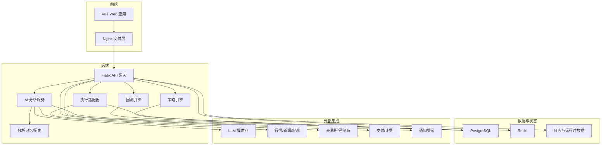
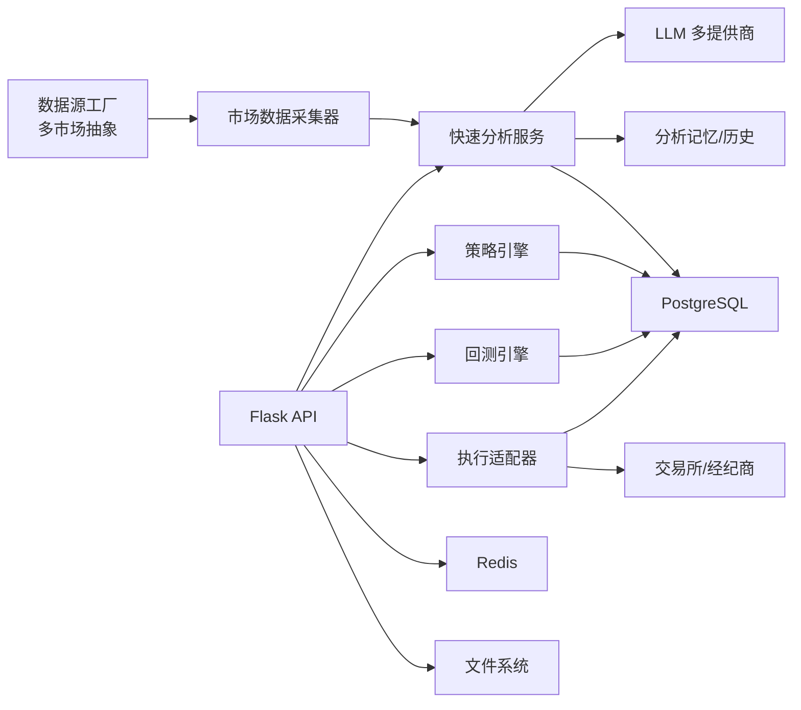
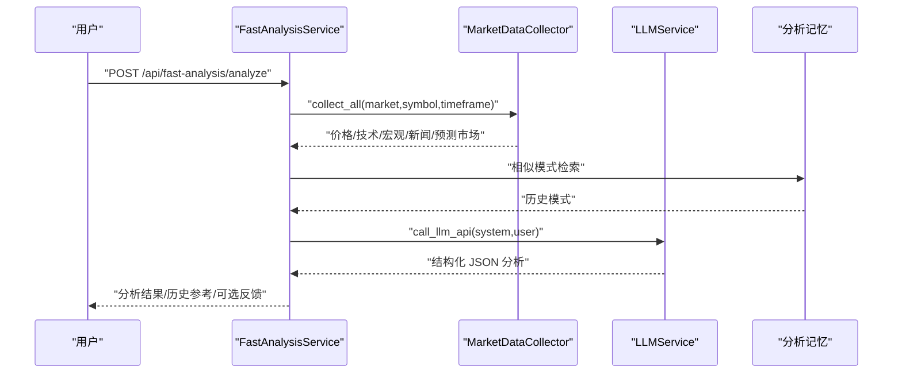
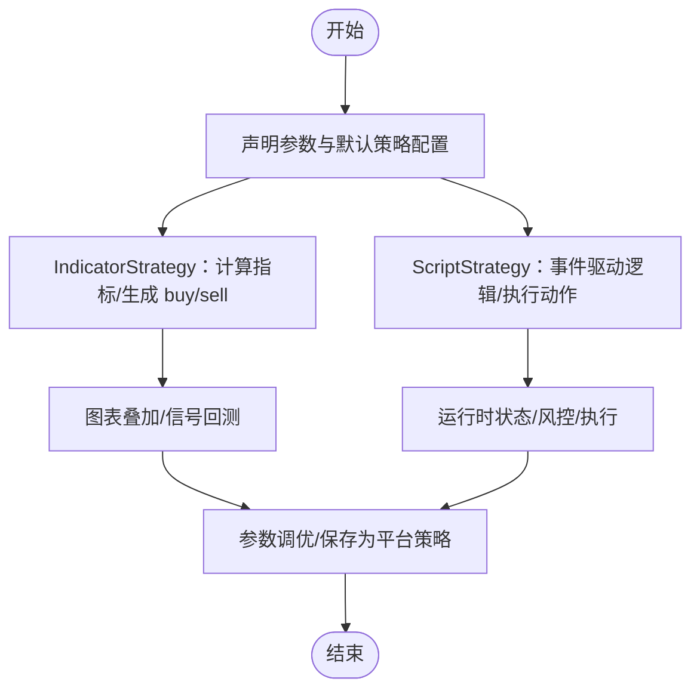
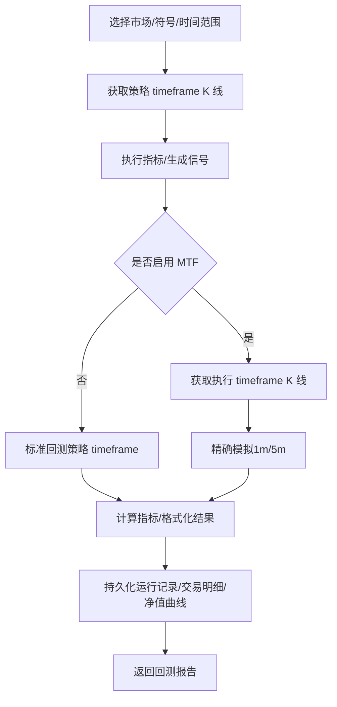
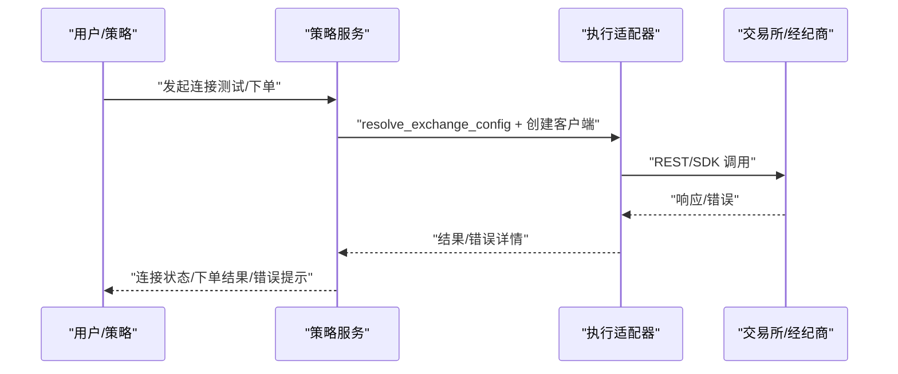
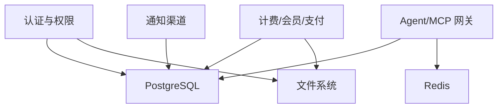
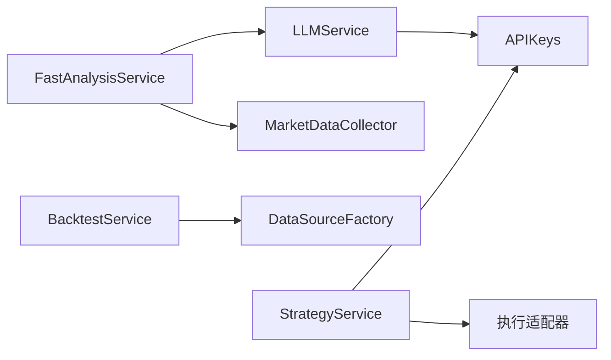

# 核心特性

<cite>
**本文引用的文件**
- [backend_api_python/README.md](file://backend_api_python/README.md)
- [docs/README_CN.md](file://docs/README_CN.md)
- [backend_api_python/app/services/llm.py](file://backend_api_python/app/services/llm.py)
- [backend_api_python/app/services/fast_analysis.py](file://backend_api_python/app/services/fast_analysis.py)
- [backend_api_python/app/data_sources/factory.py](file://backend_api_python/app/data_sources/factory.py)
- [backend_api_python/app/services/backtest.py](file://backend_api_python/app/services/backtest.py)
- [backend_api_python/app/services/strategy.py](file://backend_api_python/app/services/strategy.py)
- [backend_api_python/app/config/api_keys.py](file://backend_api_python/app/config/api_keys.py)
- [docs/STRATEGY_DEV_GUIDE_CN.md](file://docs/STRATEGY_DEV_GUIDE_CN.md)
</cite>

## 目录
1. [引言](#引言)
2. [项目结构](#项目结构)
3. [核心组件](#核心组件)
4. [架构总览](#架构总览)
5. [详细组件分析](#详细组件分析)
6. [依赖分析](#依赖分析)
7. [性能考量](#性能考量)
8. [故障排查指南](#故障排查指南)
9. [结论](#结论)
10. [附录](#附录)

## 引言
QuantDinger 是一套可自托管的本地优先量化操作系统，围绕“AI 辅助研究、Python 原生策略、回测与实盘执行”构建一体化工作流。平台以 Flask 后端为核心，提供多市场数据层、AI 分析与记忆、策略运行时与回测引擎、多交易所/经纪商执行通道，以及可选的多用户、计费与通知体系。本文聚焦五大核心特性：AI 辅助研究与分析、Python 原生策略开发、服务器端回测、实时交易执行、平台化基础设施，解释其技术实现原理、使用场景、配置要求与实际效果，并为初学者与有经验的开发者分别提供概念性理解与技术深度。

## 项目结构
后端采用模块化分层设计：
- 配置与密钥：集中于环境变量与附加配置，支持多 LLM 与第三方 API 密钥注入
- 数据层：工厂模式抽象多市场数据源（加密、美股、港股、期货、MOEX 等）
- AI 分析：统一数据采集器 + 结构化提示词 + LLM 多提供商
- 策略与回测：IndicatorStrategy/ScriptStrategy 双引擎，服务端回测持久化
- 执行层：多交易所/经纪商适配器，支持加密货币与传统市场
- 基础设施：PostgreSQL/Redis/文件系统，支持 Agent/MCP 网关与计费

**图表来源**
- [docs/README_CN.md:272-332](file://docs/README_CN.md#L272-L332)

**章节来源**
- [docs/README_CN.md:272-332](file://docs/README_CN.md#L272-L332)
- [backend_api_python/README.md:15-33](file://backend_api_python/README.md#L15-L33)

## 核心组件
- AI 辅助研究与分析：统一数据采集器 + 结构化提示词 + 多 LLM 提供商 + 分析记忆
- Python 原生策略开发：IndicatorStrategy（表驱动信号）与 ScriptStrategy（事件驱动执行）
- 服务器端回测：多时间框架回测、精确模拟、指标缓存、结果持久化
- 实时交易执行：多交易所/经纪商适配、连接测试、风控与订单管理
- 平台化基础设施：多用户、角色权限、计费与通知、Agent/MCP 网关

**章节来源**
- [backend_api_python/README.md:5-14](file://backend_api_python/README.md#L5-L14)
- [docs/README_CN.md:264-271](file://docs/README_CN.md#L264-L271)

## 架构总览
平台以 Flask 为中心，向上承载 AI 分析、策略与回测、执行与计费，向下对接 PostgreSQL/Redis/文件系统与外部 LLM/行情/交易所。数据流从多市场数据源进入统一采集器，经 AI 分析生成结构化洞察与决策，策略引擎与回测引擎复用相同数据与指标计算，执行层对接多交易所/经纪商，形成“想法→指标→策略→回测→优化→执行→监控”的闭环。

**图表来源**
- [backend_api_python/app/data_sources/factory.py:33-112](file://backend_api_python/app/data_sources/factory.py#L33-L112)
- [backend_api_python/app/services/fast_analysis.py:186-233](file://backend_api_python/app/services/fast_analysis.py#L186-L233)
- [backend_api_python/app/services/llm.py:70-122](file://backend_api_python/app/services/llm.py#L70-L122)
- [docs/README_CN.md:272-332](file://docs/README_CN.md#L272-L332)

## 详细组件分析

### AI 辅助研究与分析
- 技术实现
  - 数据采集：统一 MarketDataCollector，聚合价格、K 线、技术指标、基本面、宏观、新闻、预测市场与衍生因子
  - 结构化提示词：强约束提示工程，要求输出 JSON，包含决策、置信度、摘要、分析要点、入场/止损/止盈、时间框架、关键原因与风险
  - 多 LLM 提供商：OpenRouter/OpenAI/Google/DeepSeek/Grok/MiniMax/自定义（OpenAI 兼容），自动检测与降级
  - 记忆与校准：分析历史存储与相似模式检索，支持校准 BUY/SELL 阈值
- 使用场景
  - 快速资产/市场分析、机会雷达、AI 写指标/策略、回测后 AI 建议
- 配置要求
  - LLM 提供商与 API Key（OPENROUTER_API_KEY、OPENAI_API_KEY、GOOGLE_API_KEY、DEEPSEEK_API_KEY、GROK_API_KEY、MINIMAX_API_KEY、CUSTOM_API_KEY/CUSTOM_API_URL/CUSTOM_MODEL）
  - 可选：Adanos 市场情绪（ADANOS_API_KEY、ADANOS_SENTIMENT_SOURCE）
- 实际效果
  - 单次 LLM 调用产出结构化分析，降低人工解读成本；支持多语言；具备历史模式参考与反馈闭环

**图表来源**
- [backend_api_python/app/services/fast_analysis.py:186-233](file://backend_api_python/app/services/fast_analysis.py#L186-L233)
- [backend_api_python/app/services/llm.py:70-122](file://backend_api_python/app/services/llm.py#L70-L122)

**章节来源**
- [backend_api_python/app/services/fast_analysis.py:186-761](file://backend_api_python/app/services/fast_analysis.py#L186-L761)
- [backend_api_python/app/services/llm.py:19-122](file://backend_api_python/app/services/llm.py#L19-L122)
- [backend_api_python/app/config/api_keys.py:54-141](file://backend_api_python/app/config/api_keys.py#L54-L141)
- [backend_api_python/README.md:210-217](file://backend_api_python/README.md#L210-L217)

### Python 原生策略开发
- 模式一：IndicatorStrategy（表驱动）
  - 基于 DataFrame 计算指标与布尔信号 buy/sell，声明默认策略配置（止损、止盈、仓位、方向等），适合图表叠加、信号型回测与原型验证
- 模式二：ScriptStrategy（事件驱动）
  - 基于 on_init/on_bar 事件，通过 ctx.buy()/sell()/close_position() 表达执行动作，适合有状态策略、动态风控与实盘对齐
- 开发流程
  - 先用 IndicatorStrategy 把信号逻辑跑通，验证图表与回测语义；再升级为 ScriptStrategy 实现运行时状态与执行控制
- 配置要求
  - 策略参数与默认配置通过注解声明；回测与实盘均读取相同数据与指标
- 实际效果
  - 降低信号与执行的耦合，提升可维护性与可移植性；支持参数化与可视化验证

**图表来源**
- [docs/STRATEGY_DEV_GUIDE_CN.md:93-200](file://docs/STRATEGY_DEV_GUIDE_CN.md#L93-L200)

**章节来源**
- [docs/STRATEGY_DEV_GUIDE_CN.md:1-200](file://docs/STRATEGY_DEV_GUIDE_CN.md#L1-L200)
- [backend_api_python/README.md:266-269](file://backend_api_python/README.md#L266-L269)

### 服务器端回测
- 技术实现
  - 多时间框架回测：策略 timeframe 生成信号，执行 timeframe 精确模拟（1m/5m），支持高精度回测与回退策略
  - 指标缓存：K 线内存缓存（TTL），减少重复外部调用
  - 精确模拟：基于推断 K 线价格路径（开盘→低→高→收盘）确定触发顺序，考虑滑点与手续费
  - 结果持久化：回测运行记录、交易明细、净值曲线写入 PostgreSQL
- 使用场景
  - 信号型回测、策略对比、参数扫描、风控规则验证
- 配置要求
  - 初始资本、手续费、滑点、杠杆、交易方向、执行假设（信号时机、缩放规则等）
- 实际效果
  - 在服务端完成高质量回测，支持多市场与多时间框架，结果可追溯、可复现

**图表来源**
- [backend_api_python/app/services/backtest.py:444-668](file://backend_api_python/app/services/backtest.py#L444-L668)
- [backend_api_python/app/services/backtest.py:64-142](file://backend_api_python/app/services/backtest.py#L64-L142)

**章节来源**
- [backend_api_python/app/services/backtest.py:64-800](file://backend_api_python/app/services/backtest.py#L64-L800)

### 实时交易执行
- 技术实现
  - 交易所/经纪商适配：加密货币（Binance/OKX/Bybit/Bitget/KuCoin/Gate/Kraken/Coinbase 等）与传统市场（IBKR/MT5）
  - 连接测试：直连 REST/SDK，验证公开 ping 与私有数据读取，自动提示常见错误（IP 白名单、权限、基地址）
  - 执行通道：策略/脚本生成下单意图，执行器对接交易所适配器，支持挂单派发与行情采集解耦
- 使用场景
  - 快速交易、实盘策略、纸面交易与实盘切换、多市场多品种执行
- 配置要求
  - 各交易所/经纪商 API Key、基地址、市场类型（现货/合约）、风控参数（最大每日亏损、止盈止损等）
- 实际效果
  - 本地部署可控、安全边界清晰；支持多提供商与备用路径；连接测试与错误提示降低实盘门槛

**图表来源**
- [backend_api_python/app/services/strategy.py:292-609](file://backend_api_python/app/services/strategy.py#L292-L609)

**章节来源**
- [backend_api_python/app/services/strategy.py:59-291](file://backend_api_python/app/services/strategy.py#L59-L291)
- [docs/README_CN.md:475-503](file://docs/README_CN.md#L475-L503)

### 平台化基础设施
- 多用户与权限：管理员/管理者/普通用户/观察者四级权限，支持用户管理与密码重置
- 计费与会员：可选计费开关、定价与积分体系、USDT 支付（TronGrid/USDT）
- 通知：Telegram/Email/SMS/Discord/Webhook
- Agent/MCP 网关：面向 Cursor/Claude Code 等客户端，提供 MCP 服务器与 Agent Token 管理，严格审计与安全边界
- 数据与状态：PostgreSQL（模式初始化、索引、外键）、Redis（队列/工作进程）、文件系统（日志与运行时数据）

**图表来源**
- [docs/README_CN.md:133-223](file://docs/README_CN.md#L133-L223)

**章节来源**
- [docs/README_CN.md:142-149](file://docs/README_CN.md#L142-L149)
- [docs/README_CN.md:133-223](file://docs/README_CN.md#L133-L223)

## 依赖分析
- 组件耦合
  - FastAnalysisService 依赖 LLMService 与 MarketDataCollector，耦合集中在数据采集与提示工程
  - BacktestService 依赖数据源工厂与指标工具，耦合集中在数据获取与回测流程
  - StrategyService 依赖执行适配器与本地 Broker 限制，耦合集中在连接测试与市场类型判定
- 外部依赖
  - LLM 提供商（OpenRouter/OpenAI/Google/DeepSeek/Grok/MiniMax/自定义）
  - 多交易所/经纪商 REST/SDK（Binance/OKX/Bybit/Bitget/KuCoin/Gate/Kraken/Coinbase/IBKR/MT5）
  - PostgreSQL/Redis/文件系统
- 循环依赖
  - LLMService 与 FastAnalysisService 解耦良好，避免循环导入

**图表来源**
- [backend_api_python/app/services/fast_analysis.py:186-233](file://backend_api_python/app/services/fast_analysis.py#L186-L233)
- [backend_api_python/app/services/llm.py:70-122](file://backend_api_python/app/services/llm.py#L70-L122)
- [backend_api_python/app/data_sources/factory.py:33-112](file://backend_api_python/app/data_sources/factory.py#L33-L112)
- [backend_api_python/app/services/strategy.py:59-125](file://backend_api_python/app/services/strategy.py#L59-L125)
- [backend_api_python/app/config/api_keys.py:168-184](file://backend_api_python/app/config/api_keys.py#L168-L184)

**章节来源**
- [backend_api_python/app/services/fast_analysis.py:186-233](file://backend_api_python/app/services/fast_analysis.py#L186-L233)
- [backend_api_python/app/services/llm.py:70-122](file://backend_api_python/app/services/llm.py#L70-L122)
- [backend_api_python/app/data_sources/factory.py:33-112](file://backend_api_python/app/data_sources/factory.py#L33-L112)
- [backend_api_python/app/services/strategy.py:59-125](file://backend_api_python/app/services/strategy.py#L59-L125)
- [backend_api_python/app/config/api_keys.py:168-184](file://backend_api_python/app/config/api_keys.py#L168-L184)

## 性能考量
- 回测性能
  - 多时间框架回测在 1 分钟与 5 分钟之间权衡，1 分钟回测限制区间以保证性能
  - K 线缓存（TTL）减少重复外部调用，提高回测吞吐
- LLM 调用
  - 多提供商自动检测与降级，支持备用模型与超时控制
  - 单次 LLM 调用产出结构化 JSON，减少多次往返
- 执行稳定性
  - 连接测试并发限制（信号量），保护 CPU 与限流
  - 错误提示细化（IP 白名单、权限、基地址、模拟盘/实盘差异），降低实盘失败率

**章节来源**
- [backend_api_python/app/services/backtest.py:64-82](file://backend_api_python/app/services/backtest.py#L64-L82)
- [backend_api_python/app/services/backtest.py:25-61](file://backend_api_python/app/services/backtest.py#L25-L61)
- [backend_api_python/app/services/llm.py:428-524](file://backend_api_python/app/services/llm.py#L428-L524)
- [backend_api_python/app/services/strategy.py:17-18](file://backend_api_python/app/services/strategy.py#L17-L18)
- [backend_api_python/app/services/strategy.py:506-540](file://backend_api_python/app/services/strategy.py#L506-L540)

## 故障排查指南
- 数据库连接失败
  - 检查 DATABASE_URL 格式与 PostgreSQL 服务状态
- 外出请求失败
  - 配置 PROXY_URL（如需）
- 策略恢复与工作进程
  - 关闭自动恢复：DISABLE_RESTORE_RUNNING_STRATEGIES=true
  - 关闭挂单工作进程：ENABLE_PENDING_ORDER_WORKER=false
- LLM 调用异常
  - API Key 未配置或无效/余额不足/无模型权限；检查对应提供商密钥与账户状态
- 实盘连接失败
  - 币安 -2015：核对 IP 白名单、权限与基地址；区分模拟盘/实盘密钥
  - MT5/IBKR：仅限本地桌面终端；核对市场类别与终端状态

**章节来源**
- [backend_api_python/README.md:231-236](file://backend_api_python/README.md#L231-L236)
- [backend_api_python/app/services/llm.py:228-238](file://backend_api_python/app/services/llm.py#L228-L238)
- [backend_api_python/app/services/strategy.py:506-570](file://backend_api_python/app/services/strategy.py#L506-L570)

## 结论
QuantDinger 以“可自托管、本地优先”为原则，将 AI 辅助研究、Python 原生策略、回测与实盘执行整合为统一工作流。通过多市场数据层、多 LLM 提供商、双策略引擎、服务端回测与多交易所适配，平台既满足初学者快速上手，也为有经验的开发者提供高可扩展性与可控性。配合多用户、计费与通知体系，平台可支撑团队化运营与商业化落地。

## 附录
- 快速开始与配置
  - Docker Compose 快速启动、数据库初始化、LLM 与第三方密钥配置
- 策略开发最佳实践
  - 先 IndicatorStrategy，再 ScriptStrategy；参数与默认策略配置分离；避免破坏沙盒的写法

**章节来源**
- [backend_api_python/README.md:35-134](file://backend_api_python/README.md#L35-L134)
- [docs/STRATEGY_DEV_GUIDE_CN.md:93-200](file://docs/STRATEGY_DEV_GUIDE_CN.md#L93-L200)