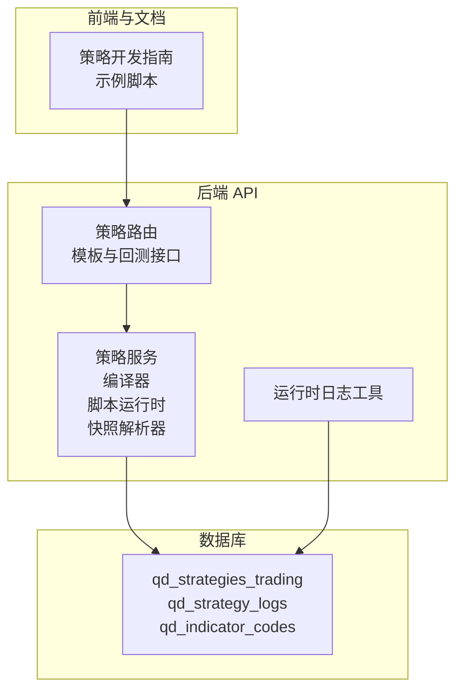
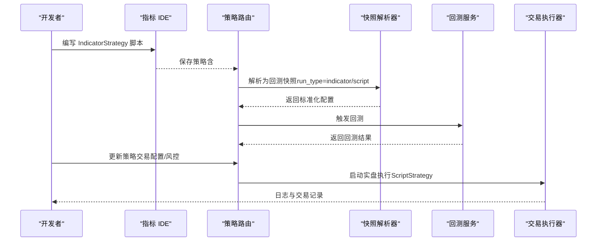
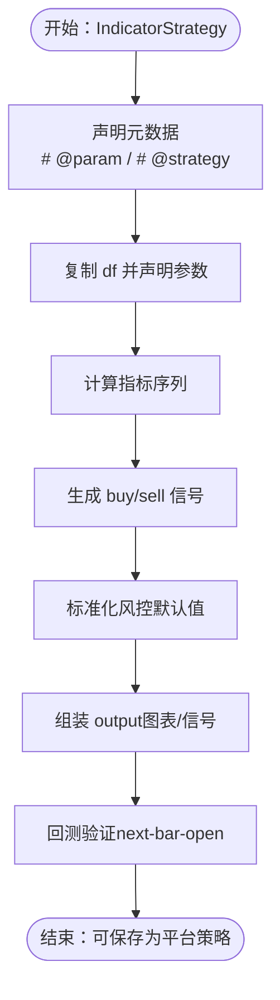
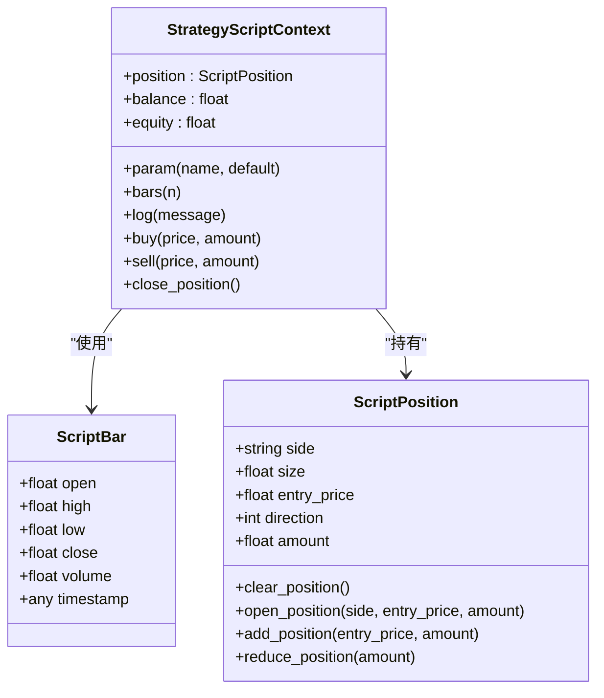
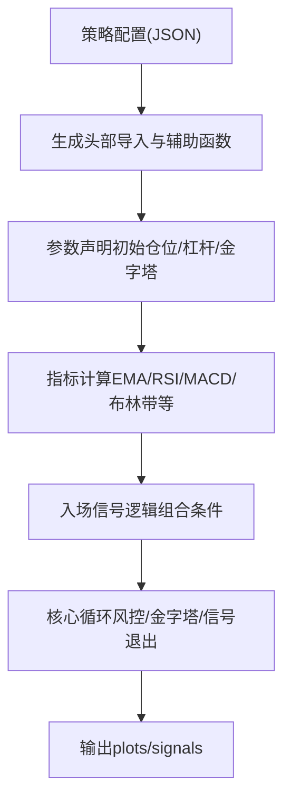
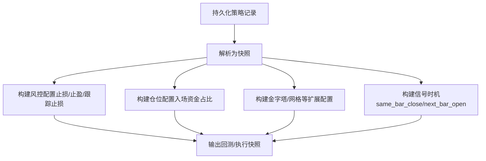
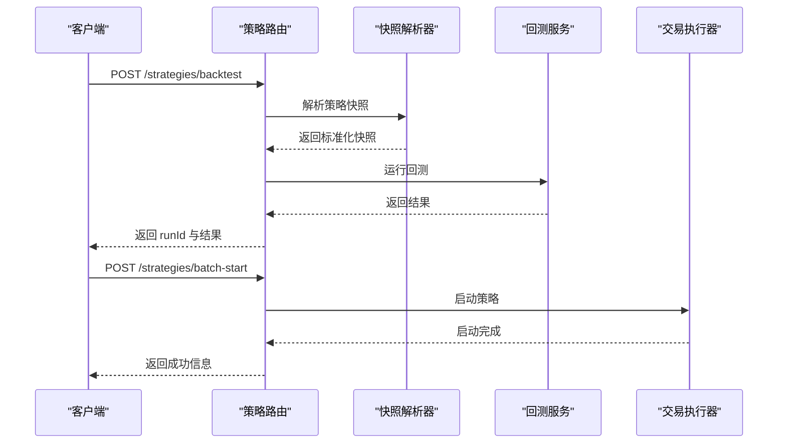
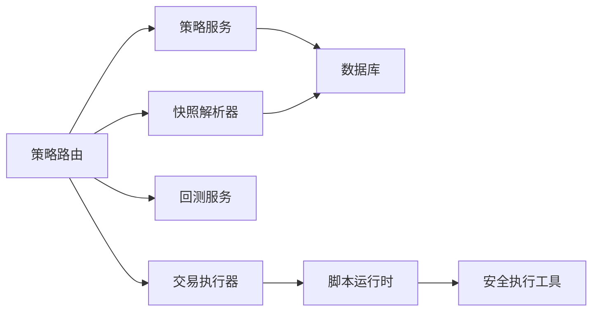

# 策略开发模式

<cite>
**本文引用的文件**
- [策略开发指南（中文）](file://docs/STRATEGY_DEV_GUIDE_CN.md)
- [策略开发指南（英文）](file://docs/STRATEGY_DEV_GUIDE.md)
- [策略服务](file://backend_api_python/app/services/strategy.py)
- [策略编译器](file://backend_api_python/app/services/strategy_compiler.py)
- [脚本运行时](file://backend_api_python/app/services/strategy_script_runtime.py)
- [策略快照解析器](file://backend_api_python/app/services/strategy_snapshot.py)
- [策略路由](file://backend_api_python/app/routes/strategy.py)
- [双均线示例](file://docs/examples/dual_ma_with_params.py)
- [多指标组合示例](file://docs/examples/multi_indicator_composite.py)
- [截面动量RSI示例](file://docs/examples/cross_sectional_momentum_rsi.py)
- [需求清单](file://backend_api_python/requirements.txt)
</cite>

## 目录
1. [引言](#引言)
2. [项目结构](#项目结构)
3. [核心组件](#核心组件)
4. [架构总览](#架构总览)
5. [详细组件分析](#详细组件分析)
6. [依赖关系分析](#依赖关系分析)
7. [性能考量](#性能考量)
8. [故障排查指南](#故障排查指南)
9. [结论](#结论)
10. [附录](#附录)

## 引言
本篇文档围绕 QuantDinger 量化交易平台的两类策略开发模式展开：IndicatorStrategy（基于数据框的 Python 脚本，适合信号生成与图表渲染）与 ScriptStrategy（基于事件驱动的 Python 脚本，适合状态化策略与精确执行控制）。我们将对比两类模式的适用场景、开发复杂度与性能特征，并提供从环境搭建、代码编写、调试测试到部署执行的完整流程指导，辅以示例与最佳实践，帮助初学者快速入门，同时为有经验的开发者提供进阶技巧。

## 项目结构
QuantDinger 的策略开发与执行链路由后端 API 服务、策略编译器、脚本运行时、快照解析器以及前端模板与示例共同组成。策略开发指南文档提供了清晰的开发范式与元数据标注约定；后端服务负责策略的持久化、回测、实盘执行与日志记录；示例文件展示了平台推荐的参数与风控配置写法。

**图表来源**
- [策略开发指南（中文）](file://docs/STRATEGY_DEV_GUIDE_CN.md)
- [策略路由](file://backend_api_python/app/routes/strategy.py)
- [策略服务](file://backend_api_python/app/services/strategy.py)
- [策略编译器](file://backend_api_python/app/services/strategy_compiler.py)
- [脚本运行时](file://backend_api_python/app/services/strategy_script_runtime.py)
- [策略快照解析器](file://backend_api_python/app/services/strategy_snapshot.py)
- [运行时日志工具](file://backend_api_python/app/utils/strategy_runtime_logs.py)

**章节来源**
- [策略开发指南（中文）](file://docs/STRATEGY_DEV_GUIDE_CN.md)
- [策略开发指南（英文）](file://docs/STRATEGY_DEV_GUIDE.md)

## 核心组件
- 策略开发指南：定义了 IndicatorStrategy 与 ScriptStrategy 的心智模型、分层与开发流程，强调将“指标层—信号层—风险默认配置层”分离，以及元数据（# @param、# @strategy）的重要性。
- 策略服务：提供策略查询、批量启停、连接测试、交易配置展示等功能，支撑策略生命周期管理。
- 策略编译器：将可视化配置转换为可执行的 IndicatorStrategy 脚本，包含参数、指标计算、信号逻辑与输出。
- 脚本运行时：为 ScriptStrategy 提供安全的执行环境，封装 bar、position、ctx 等上下文对象，支持 on_init/on_bar 生命周期。
- 策略快照解析器：将持久化的策略记录解析为回测/执行所需的快照，统一 run_type（strategy_indicator / strategy_script），并标准化风控与仓位配置。
- 策略路由：提供模板加载、策略回测、历史查询、批量启停等接口，贯穿策略从创建到执行的全链路。
- 示例与模板：提供双均线、多指标组合、截面动量 RSI 等示例，便于对照学习与快速迁移。

**章节来源**
- [策略开发指南（中文）](file://docs/STRATEGY_DEV_GUIDE_CN.md)
- [策略服务](file://backend_api_python/app/services/strategy.py)
- [策略编译器](file://backend_api_python/app/services/strategy_compiler.py)
- [脚本运行时](file://backend_api_python/app/services/strategy_script_runtime.py)
- [策略快照解析器](file://backend_api_python/app/services/strategy_snapshot.py)
- [策略路由](file://backend_api_python/app/routes/strategy.py)
- [双均线示例](file://docs/examples/dual_ma_with_params.py)
- [多指标组合示例](file://docs/examples/multi_indicator_composite.py)
- [截面动量RSI示例](file://docs/examples/cross_sectional_momentum_rsi.py)

## 架构总览
策略从“想法—脚本—回测—实盘”的演进路径如下：

**图表来源**
- [策略开发指南（中文）](file://docs/STRATEGY_DEV_GUIDE_CN.md)
- [策略路由](file://backend_api_python/app/routes/strategy.py)
- [策略快照解析器](file://backend_api_python/app/services/strategy_snapshot.py)

## 详细组件分析

### IndicatorStrategy 模式
- 心智模型与分层
  - 指标层：计算 EMA、RSI、MACD、布林带等技术指标。
  - 信号层：生成布尔型 buy/sell 信号，确保边缘触发与填充策略。
  - 风险默认配置层：通过 # @strategy 声明默认止损、止盈、入场资金占比与跟踪止损等。
- 开发流程
  - 元数据与默认配置先行，随后复制 df、计算指标、生成 buy/sell、组装 output。
  - 回测语义强调“收盘确认、下一根开盘成交”，避免未来函数。
- 元数据与风控
  - # @param：声明可调参数，通过 params.get 读取。
  - # @strategy：声明默认风控与仓位，如 stopLossPct、takeProfitPct、entryPct、trailing 系列、tradeDirection。
- 示例参考
  - 双均线策略：展示参数与风控对齐、边缘触发与图表输出。
  - 多指标组合：展示如何组合均线、RSI、MACD、成交量过滤并稳定信号。

**图表来源**
- [策略开发指南（中文）](file://docs/STRATEGY_DEV_GUIDE_CN.md)
- [双均线示例](file://docs/examples/dual_ma_with_params.py)
- [多指标组合示例](file://docs/examples/multi_indicator_composite.py)

**章节来源**
- [策略开发指南（中文）](file://docs/STRATEGY_DEV_GUIDE_CN.md)
- [双均线示例](file://docs/examples/dual_ma_with_params.py)
- [多指标组合示例](file://docs/examples/multi_indicator_composite.py)

### ScriptStrategy 模式
- 心智模型与适用场景
  - 需要运行时状态（持仓、余额、权益）、动态止损止盈、分批加减仓、bot 风格执行等。
  - 以 on_init / on_bar 事件驱动，ctx 提供 param、bars、position、log、buy/sell/close_position 等能力。
- 运行时与上下文
  - ScriptBar：封装 bar.open/high/low/close/volume/timestamp。
  - ScriptPosition：封装 side/size/entry_price/direction/amount，并提供清仓、加仓、减仓等操作。
  - StrategyScriptContext：提供 param、bars、log、buy/sell/close_position、position、balance、equity。
- 执行语义与差异
  - 标准回测/实盘：bar 确认收盘后 on_bar 调用；amount 更偏向下单意图，最终仓位由保存后的策略配置主导。
  - bot 模式：可能以类 tick 的伪 bar 反复驱动，适合网格、DCA 等高频机器人策略。

**图表来源**
- [脚本运行时](file://backend_api_python/app/services/strategy_script_runtime.py)

**章节来源**
- [策略开发指南（中文）](file://docs/STRATEGY_DEV_GUIDE_CN.md)
- [脚本运行时](file://backend_api_python/app/services/strategy_script_runtime.py)

### 策略编译器（可视化配置到脚本）
- 输入：策略配置（名称、入场规则、仓位配置、金字塔/加仓规则、风控）。
- 输出：可执行的 IndicatorStrategy 脚本，包含参数、指标计算、信号逻辑与图表输出。
- 关键点：将可视化配置映射为 df 列与布尔信号，统一输出结构，便于回测与 UI 展示。

**图表来源**
- [策略编译器](file://backend_api_python/app/services/strategy_compiler.py)

**章节来源**
- [策略编译器](file://backend_api_python/app/services/strategy_compiler.py)

### 策略快照解析器（统一回测/执行入口）
- 职责：将持久化策略记录解析为回测/执行快照，标准化风控、仓位、信号时机、市场符号等。
- 关键点：根据交易配置构建 risk/position/scale/execution 等子配置；run_type 依据策略类型与模式选择 strategy_indicator 或 strategy_script。

**图表来源**
- [策略快照解析器](file://backend_api_python/app/services/strategy_snapshot.py)

**章节来源**
- [策略快照解析器](file://backend_api_python/app/services/strategy_snapshot.py)

### 策略路由与生命周期
- 模板：提供一键导入的策略模板，支持分类与难度筛选。
- 回测：接收策略 ID 与时间范围，解析快照并运行回测，持久化运行记录。
- 批量启停：支持批量启动/停止策略，联动交易执行器。
- 交易与日志：提供交易记录与实时日志写入，便于监控与排障。

**图表来源**
- [策略路由](file://backend_api_python/app/routes/strategy.py)
- [策略快照解析器](file://backend_api_python/app/services/strategy_snapshot.py)

**章节来源**
- [策略路由](file://backend_api_python/app/routes/strategy.py)

## 依赖关系分析
- 组件耦合
  - 策略路由依赖策略服务、快照解析器与回测服务；策略服务依赖数据库与交易客户端；脚本运行时依赖安全执行工具。
- 外部依赖
  - pandas、numpy、ccxt、requests 等用于数据处理与市场数据获取；psycopg2 用于 PostgreSQL；gunicorn 用于生产部署。
- 潜在环路
  - 路由→服务→解析器→回测服务形成单向依赖，未见循环依赖；脚本运行时与路由之间通过字符串脚本交互，避免强耦合。

**图表来源**
- [策略路由](file://backend_api_python/app/routes/strategy.py)
- [策略服务](file://backend_api_python/app/services/strategy.py)
- [策略快照解析器](file://backend_api_python/app/services/strategy_snapshot.py)
- [脚本运行时](file://backend_api_python/app/services/strategy_script_runtime.py)
- [需求清单](file://backend_api_python/requirements.txt)

**章节来源**
- [策略路由](file://backend_api_python/app/routes/strategy.py)
- [策略服务](file://backend_api_python/app/services/strategy.py)
- [脚本运行时](file://backend_api_python/app/services/strategy_script_runtime.py)
- [需求清单](file://backend_api_python/requirements.txt)

## 性能考量
- IndicatorStrategy
  - 优势：基于向量化计算与布尔信号，回测效率高；适合大规模信号验证与参数扫描。
  - 注意：避免未来函数（如 shift(-1)），严格遵循“收盘确认、下一根开盘成交”的回测语义。
- ScriptStrategy
  - 优势：可表达复杂的运行时状态与执行逻辑，适合 bot 风格高频策略。
  - 注意：on_bar 每根 K 线调用，需避免重型计算；合理使用 ctx.bars(n) 获取窗口数据；控制日志与订单数量。
- 回测与实盘差异
  - run_type 与信号时机（same_bar_close vs next_bar_open）会影响收益曲线；保存后的策略回测中，entryPct 等配置对仓位有更强约束。

[本节为通用指导，无需具体文件引用]

## 故障排查指南
- 代码质量检查
  - 缺少 on_init/on_bar、未声明参数默认值、未检测到下单意图等，路由会返回相应提示码与人类可读摘要。
- 运行时错误
  - 脚本编译失败、函数签名不匹配、沙盒限制等，会在运行时抛出异常；可通过运行时日志工具写入 qd_strategy_logs。
- 连接与配置
  - 通过策略服务的连接测试接口验证交易所连通性与权限；关注 IP 白名单、市场类型与 base_url 匹配。

**章节来源**
- [策略路由](file://backend_api_python/app/routes/strategy.py)
- [脚本运行时](file://backend_api_python/app/services/strategy_script_runtime.py)
- [策略服务](file://backend_api_python/app/services/strategy.py)
- [运行时日志工具](file://backend_api_python/app/utils/strategy_runtime_logs.py)

## 结论
- 选择模式的决策树
  - 若逻辑可抽象为“条件 A 出现就买，条件 B 出现就卖”，优先使用 IndicatorStrategy，快速验证信号与参数。
  - 若需要运行时状态、动态风控、分批加减仓或 bot 执行，采用 ScriptStrategy，并在保存后策略回测中核对仓位与执行语义。
- 开发流程建议
  - 先在指标 IDE 中用 IndicatorStrategy 原型化，再逐步迁移到 ScriptStrategy；始终以 # @param 与 # @strategy 明确元数据与风控默认值；回测与实盘语义务必一致。
- 最佳实践
  - 保持“指标层—信号层—风险默认配置层”的清晰分层；使用边缘触发信号；在 ScriptStrategy 中优先使用 ctx.close_position 表达“全部平仓”的意图；通过模板与示例快速对齐平台 UI 与默认配置。

[本节为总结性内容，无需具体文件引用]

## 附录

### 开发流程（从零到上线）
- 环境搭建
  - 安装后端依赖（pandas、numpy、ccxt、requests、psycopg2、gunicorn 等）。
  - 启动后端服务与数据库，确保端口与凭据正确。
- 代码编写
  - IndicatorStrategy：先声明 # @param 与 # @strategy，再复制 df、计算指标、生成 buy/sell、组装 output。
  - ScriptStrategy：实现 on_init/on_bar，使用 ctx.param/ctx.bars/ctx.position/ctx.buy/sell/close_position。
- 调试测试
  - 使用策略路由的回测接口运行短期回测，核对收益曲线与信号密度；必要时通过运行时日志定位问题。
- 部署执行
  - 保存策略后，通过批量启停接口启动实盘执行；监控交易记录与日志。

**章节来源**
- [策略开发指南（中文）](file://docs/STRATEGY_DEV_GUIDE_CN.md)
- [策略路由](file://backend_api_python/app/routes/strategy.py)
- [脚本运行时](file://backend_api_python/app/services/strategy_script_runtime.py)

### 示例参考
- 双均线策略：展示参数与风控对齐、边缘触发与图表输出。
- 多指标组合：展示如何组合均线、RSI、MACD、成交量过滤并稳定信号。
- 截面动量 RSI：展示对多标的打分与排序思路（当前平台文档明确 cross_sectional 不在主策略回测/实盘链路内）。

**章节来源**
- [双均线示例](file://docs/examples/dual_ma_with_params.py)
- [多指标组合示例](file://docs/examples/multi_indicator_composite.py)
- [截面动量RSI示例](file://docs/examples/cross_sectional_momentum_rsi.py)
- [策略开发指南（中文）](file://docs/STRATEGY_DEV_GUIDE_CN.md)