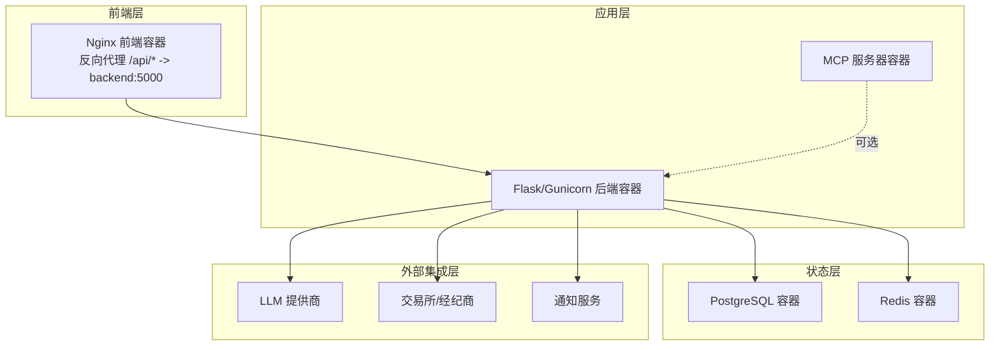
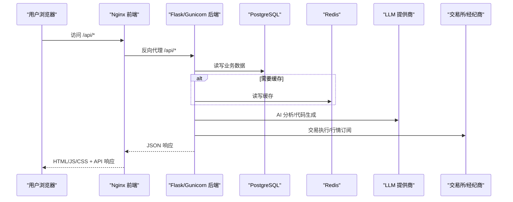
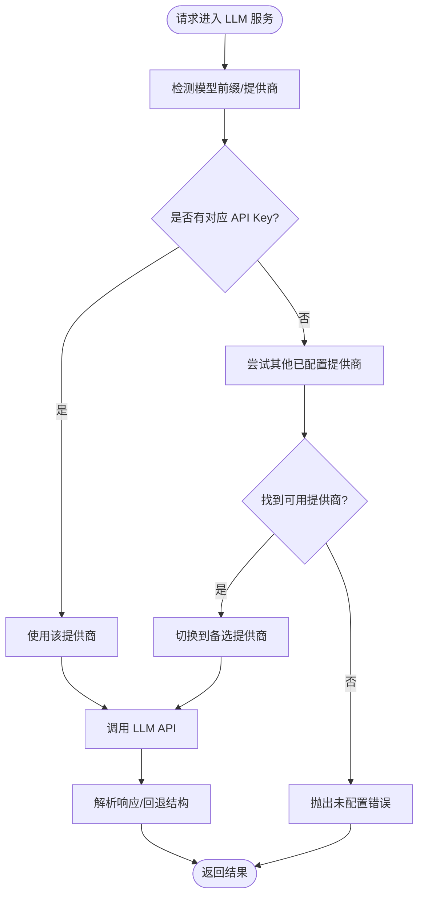
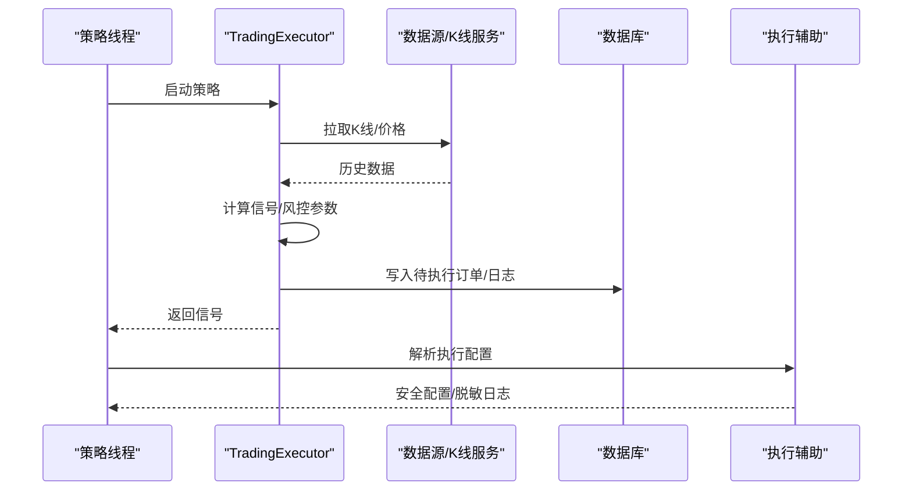
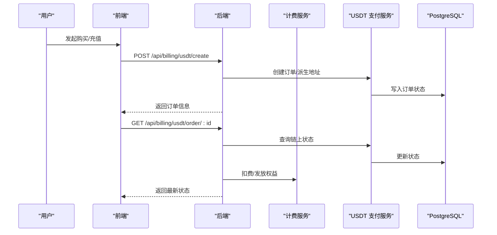
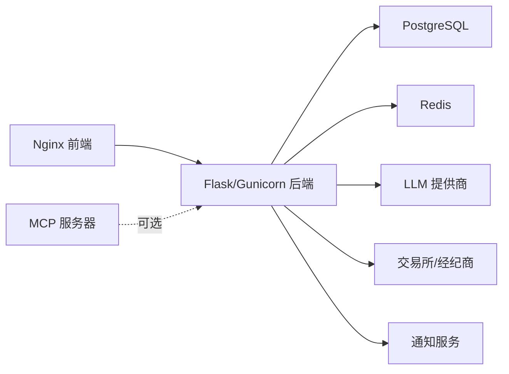

# 系统架构

<cite>
**本文引用的文件**
- [docker-compose.yml](file://docker-compose.yml)
- [backend_api_python/Dockerfile](file://backend_api_python/Dockerfile)
- [frontend/Dockerfile](file://frontend/Dockerfile)
- [mcp_server/Dockerfile](file://mcp_server/Dockerfile)
- [backend_api_python/run.py](file://backend_api_python/run.py)
- [backend_api_python/env.example](file://backend_api_python/env.example)
- [backend_api_python/app/config/settings.py](file://backend_api_python/app/config/settings.py)
- [backend_api_python/gunicorn_config.py](file://backend_api_python/gunicorn_config.py)
- [frontend/nginx.conf.template](file://frontend/nginx.conf.template)
- [backend_api_python/app/services/llm.py](file://backend_api_python/app/services/llm.py)
- [backend_api_python/app/services/billing_service.py](file://backend_api_python/app/services/billing_service.py)
- [backend_api_python/app/services/usdt_payment_service.py](file://backend_api_python/app/services/usdt_payment_service.py)
- [backend_api_python/app/services/trading_executor.py](file://backend_api_python/app/services/trading_executor.py)
- [backend_api_python/app/services/exchange_execution.py](file://backend_api_python/app/services/exchange_execution.py)
- [backend_api_python/app/routes/billing.py](file://backend_api_python/app/routes/billing.py)
</cite>

## 目录
1. [简介](#简介)
2. [项目结构](#项目结构)
3. [核心组件](#核心组件)
4. [架构总览](#架构总览)
5. [详细组件分析](#详细组件分析)
6. [依赖分析](#依赖分析)
7. [性能考量](#性能考量)
8. [故障排查指南](#故障排查指南)
9. [结论](#结论)
10. [附录](#附录)

## 简介
QuantDinger 是一个基于 Docker Compose 的微服务架构量化交易平台。系统采用前后端分离设计：前端使用 Vue 构建并通过 Nginx 提供静态资源与反向代理；后端以 Flask/Gunicorn 承载 API 服务，内部通过多类服务模块实现 AI 分析、策略引擎、交易执行、计费与支付等功能；状态层由 PostgreSQL 和 Redis 组成；外部集成层涵盖 LLM 提供商、交易所与经纪商、通知服务等。本文档系统阐述架构设计、组件交互、数据流、通信协议、技术决策、性能与可扩展性、部署拓扑与依赖关系，并给出安全与监控建议。

## 项目结构
- 前端层
  - Vue 应用构建产物位于 frontend/dist，由 Nginx 容器提供服务与反向代理。
- 应用层
  - Flask/Gunicorn 后端容器承载所有业务 API，包含路由、服务与工具模块。
  - MCP 服务器容器提供可插拔的模型上下文协议服务（可选）。
- 状态层
  - PostgreSQL 数据库持久化用户、策略、订单、计费等核心数据。
  - Redis 可选缓存层，用于热点数据与会话缓存。
- 外部集成层
  - LLM 提供商（OpenRouter/OpenAI/Google/DeepSeek/Grok/MiniMax/自定义兼容接口）
  - 交易所与经纪商（IBKR、MT5、币安、Gate.io、OKX、Kraken 等）
  - 通知服务（邮件、短信、Telegram 等）

图表来源
- [docker-compose.yml:25-172](file://docker-compose.yml#L25-L172)
- [frontend/nginx.conf.template:31-46](file://frontend/nginx.conf.template#L31-L46)
- [backend_api_python/Dockerfile:1-62](file://backend_api_python/Dockerfile#L1-L62)
- [mcp_server/Dockerfile:1-26](file://mcp_server/Dockerfile#L1-L26)

章节来源
- [docker-compose.yml:1-172](file://docker-compose.yml#L1-L172)
- [frontend/nginx.conf.template:1-60](file://frontend/nginx.conf.template#L1-L60)
- [backend_api_python/Dockerfile:1-62](file://backend_api_python/Dockerfile#L1-L62)
- [mcp_server/Dockerfile:1-26](file://mcp_server/Dockerfile#L1-L26)

## 核心组件
- 前端 Nginx
  - 提供静态资源服务与 /api/* 反向代理，默认代理到 backend:5000。
  - 支持健康检查与安全头配置。
- Flask/Gunicorn 后端
  - 通过 run.py 创建应用实例，加载 .env 并进行安全检查（禁止默认密钥）。
  - 使用 gunicorn_config.py 控制工作线程模型与超时。
  - 配置来源于 env.example，支持数据库连接池、LLM 提供商、OAuth、计费与支付等。
- PostgreSQL
  - 作为主数据库，提供表迁移初始化与健康检查。
- Redis
  - 可选缓存层，限制内存并设置淘汰策略。
- MCP 服务器
  - 提供可插拔的模型上下文协议服务，绑定 7800 端口。

章节来源
- [backend_api_python/run.py:104-134](file://backend_api_python/run.py#L104-L134)
- [backend_api_python/gunicorn_config.py:1-36](file://backend_api_python/gunicorn_config.py#L1-L36)
- [backend_api_python/env.example:1-319](file://backend_api_python/env.example#L1-L319)
- [docker-compose.yml:29-172](file://docker-compose.yml#L29-L172)
- [mcp_server/Dockerfile:1-26](file://mcp_server/Dockerfile#L1-L26)

## 架构总览
系统采用“前端 Nginx + 后端 API + 状态层 + 外部集成”的四层架构。前端通过 Nginx 将 /api/* 请求转发至后端容器；后端通过数据库连接池访问 PostgreSQL，必要时使用 Redis 缓存；对外通过 LLM 服务、交易所对接与通知服务完成智能分析、交易执行与用户提醒。

图表来源
- [frontend/nginx.conf.template:31-46](file://frontend/nginx.conf.template#L31-L46)
- [backend_api_python/app/services/llm.py:368-446](file://backend_api_python/app/services/llm.py#L368-L446)
- [backend_api_python/app/services/trading_executor.py:395-456](file://backend_api_python/app/services/trading_executor.py#L395-L456)
- [docker-compose.yml:29-172](file://docker-compose.yml#L29-L172)

## 详细组件分析

### 前端 Nginx 组件
- 配置要点
  - 通过 NGINX_ENVSUBST_FILTER 注入 BACKEND_URL，实现运行时替换。
  - /api/ 路由代理到 backend:5000，支持长连接与大文件上传。
  - 静态资源缓存与安全头配置。
- 健康检查
  - 提供 /health 端点返回 200 OK。

章节来源
- [frontend/nginx.conf.template:1-60](file://frontend/nginx.conf.template#L1-L60)
- [docker-compose.yml:136-159](file://docker-compose.yml#L136-L159)

### 后端 Flask/Gunicorn 组件
- 应用入口与安全
  - run.py 加载 .env，进行 SECRET_KEY 安全检查，防止默认密钥导致的安全风险。
- 配置管理
  - settings.py 从环境变量读取主机、端口、日志、速率限制、缓存开关等。
  - env.example 提供 LLM、OAuth、计费、支付、数据源、安全等全面配置项。
- 服务器配置
  - gunicorn_config.py 使用 gthread 模型，支持多线程提升 I/O 并发。
- 健康检查
  - docker-compose 中配置 /api/health 健康检查。

章节来源
- [backend_api_python/run.py:104-134](file://backend_api_python/run.py#L104-L134)
- [backend_api_python/app/config/settings.py:1-99](file://backend_api_python/app/config/settings.py#L1-L99)
- [backend_api_python/env.example:1-319](file://backend_api_python/env.example#L1-L319)
- [backend_api_python/gunicorn_config.py:1-36](file://backend_api_python/gunicorn_config.py#L1-L36)
- [docker-compose.yml:81-131](file://docker-compose.yml#L81-L131)

### 状态层组件
- PostgreSQL
  - 初始化 SQL 与健康检查；max_connections、shared_buffers 参数可调。
  - 通过 DATABASE_URL 环境变量连接。
- Redis
  - 可选缓存，限制内存并设置淘汰策略，提供健康检查。

章节来源
- [docker-compose.yml:29-76](file://docker-compose.yml#L29-L76)
- [backend_api_python/env.example:21-51](file://backend_api_python/env.example#L21-L51)

### AI 分析与 LLM 服务
- 支持多提供商：OpenRouter、OpenAI、Google Gemini、DeepSeek、Grok、MiniMax、自定义兼容接口。
- 智能选择与回退：当配置缺失或受限时自动切换备用提供商。
- 输出格式控制：默认 JSON 模式，便于结构化解析。

图表来源
- [backend_api_python/app/services/llm.py:368-446](file://backend_api_python/app/services/llm.py#L368-L446)
- [backend_api_python/app/services/llm.py:614-628](file://backend_api_python/app/services/llm.py#L614-L628)

章节来源
- [backend_api_python/app/services/llm.py:1-628](file://backend_api_python/app/services/llm.py#L1-L628)
- [backend_api_python/env.example:66-93](file://backend_api_python/env.example#L66-L93)

### 策略引擎与交易执行
- 策略执行器
  - TradingExecutor 负责策略线程管理、信号去重、缓存与风控参数构建。
  - 通过 KlineService 获取 K 线，脚本上下文计算生成待执行信号。
- 交易执行辅助
  - exchange_execution 提供交换机配置安全加载与脱敏日志输出。
- 线程与资源
  - 通过 STRATEGY_MAX_THREADS 限制单进程策略线程上限，避免资源耗尽。

图表来源
- [backend_api_python/app/services/trading_executor.py:395-456](file://backend_api_python/app/services/trading_executor.py#L395-L456)
- [backend_api_python/app/services/exchange_execution.py:59-150](file://backend_api_python/app/services/exchange_execution.py#L59-L150)

章节来源
- [backend_api_python/app/services/trading_executor.py:1-800](file://backend_api_python/app/services/trading_executor.py#L1-L800)
- [backend_api_python/app/services/exchange_execution.py:1-150](file://backend_api_python/app/services/exchange_execution.py#L1-L150)
- [backend_api_python/env.example:224-233](file://backend_api_python/env.example#L224-L233)

### 计费与支付
- 计费服务
  - 统一积分余额、功能扣费、会员状态与套餐发放。
  - 支持按功能计费与 VIP 权益。
- USDT 支付
  - TRC20（TronGrid）方案：每单独立地址 + 自动对账。
  - 后台路由提供创建订单与查询状态接口。

图表来源
- [backend_api_python/app/routes/billing.py:55-94](file://backend_api_python/app/routes/billing.py#L55-L94)
- [backend_api_python/app/services/billing_service.py:47-120](file://backend_api_python/app/services/billing_service.py#L47-L120)
- [backend_api_python/app/services/usdt_payment_service.py:33-829](file://backend_api_python/app/services/usdt_payment_service.py#L33-L829)

章节来源
- [backend_api_python/app/routes/billing.py:1-94](file://backend_api_python/app/routes/billing.py#L1-L94)
- [backend_api_python/app/services/billing_service.py:1-758](file://backend_api_python/app/services/billing_service.py#L1-L758)
- [backend_api_python/app/services/usdt_payment_service.py:1-829](file://backend_api_python/app/services/usdt_payment_service.py#L1-L829)
- [backend_api_python/env.example:181-210](file://backend_api_python/env.example#L181-L210)

### 外部集成层
- LLM 提供商
  - 通过 env.example 的 LLM_PROVIDER 与 API Key 配置，支持多提供商与自定义兼容接口。
- 交易所与经纪商
  - 通过 exchange_execution 解析策略配置与凭证，支持多种交易所对接。
- 通知服务
  - 邮件、短信、Telegram 等通知通道在 env.example 中配置。

章节来源
- [backend_api_python/env.example:66-93](file://backend_api_python/env.example#L66-L93)
- [backend_api_python/app/services/exchange_execution.py:118-150](file://backend_api_python/app/services/exchange_execution.py#L118-L150)
- [backend_api_python/env.example:127-151](file://backend_api_python/env.example#L127-L151)

## 依赖分析
- 组件耦合
  - 前端 Nginx 仅依赖后端 API；后端服务模块间通过路由与服务层解耦。
  - 策略引擎与交易执行通过数据库进行弱耦合。
- 外部依赖
  - LLM 提供商、交易所 API、通知服务均通过配置注入，便于替换。
- 健壮性
  - 健康检查贯穿前端、后端、数据库与缓存，保障服务可用性。

图表来源
- [docker-compose.yml:25-172](file://docker-compose.yml#L25-L172)
- [frontend/nginx.conf.template:31-46](file://frontend/nginx.conf.template#L31-L46)

章节来源
- [docker-compose.yml:25-172](file://docker-compose.yml#L25-L172)

## 性能考量
- 并发模型
  - 后端使用 gthread 模型，线程数由 GUNICORN_THREADS 控制，适合 I/O 密集型场景。
- 数据库连接池
  - DB_POOL_MIN/MAX、ACQUIRE_TIMEOUT、HEALTH_CHECK 可调，避免连接池耗尽。
- 策略并发
  - STRATEGY_MAX_THREADS 限制单进程策略线程数，避免系统资源枯竭。
- 缓存策略
  - Redis 限制内存与淘汰策略，适合作为热点数据缓存。
- I/O 优化
  - Nginx 静态资源缓存与压缩，提升前端加载性能。

章节来源
- [backend_api_python/gunicorn_config.py:1-36](file://backend_api_python/gunicorn_config.py#L1-L36)
- [backend_api_python/env.example:44-61](file://backend_api_python/env.example#L44-L61)
- [backend_api_python/env.example:224-233](file://backend_api_python/env.example#L224-L233)
- [frontend/nginx.conf.template:12-24](file://frontend/nginx.conf.template#L12-L24)
- [docker-compose.yml:63-76](file://docker-compose.yml#L63-L76)

## 故障排查指南
- 健康检查
  - 前端：/health 返回 200 OK。
  - 后端：/api/health 返回 200 OK。
  - 数据库与缓存：compose 中内置健康检查命令。
- 安全检查
  - run.py 在生产模式下若检测到默认 SECRET_KEY 会自动生成随机密钥并提示。
- 常见问题
  - 连接池耗尽：调整 DB_POOL_MAX 与 DB_POOL_MIN，确保 PostgreSQL max_connections 足够。
  - 策略线程过多：降低 STRATEGY_MAX_THREADS 或减少同时运行的策略数量。
  - LLM 未配置：检查 env.example 中 LLM_PROVIDER 与对应 API Key。

章节来源
- [docker-compose.yml:54-131](file://docker-compose.yml#L54-L131)
- [backend_api_python/run.py:109-120](file://backend_api_python/run.py#L109-L120)
- [backend_api_python/env.example:66-93](file://backend_api_python/env.example#L66-L93)

## 结论
QuantDinger 采用清晰的微服务架构与 Docker Compose 一键部署，前后端分离、服务模块化、状态层与外部集成解耦。通过合理的并发模型、连接池与缓存策略，系统具备良好的性能与可扩展性。结合安全检查与健康检查机制，能够稳定支撑从 AI 分析到策略执行与计费支付的完整量化交易流程。

## 附录
- 部署拓扑
  - 建议在生产环境使用反向代理（如 Nginx/Railway）与容器编排平台，开启 TLS 与限流。
- 监控方案
  - 建议接入日志聚合（如 ELK/Cloud Logging）、指标采集（Prometheus/Grafana）与告警（AlertManager/云监控）。
- 安全设计
  - 强制更换默认 SECRET_KEY；凭证加密存储；最小权限访问数据库与外部 API；启用 HTTPS 与安全头。