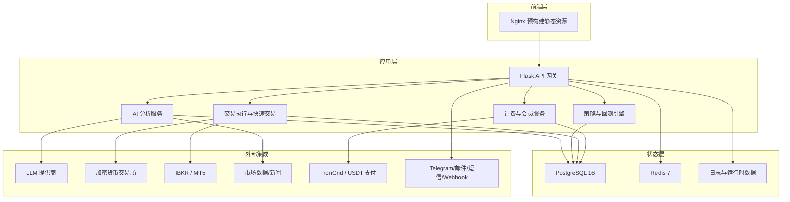
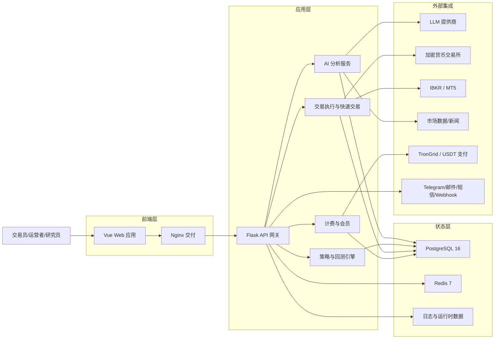
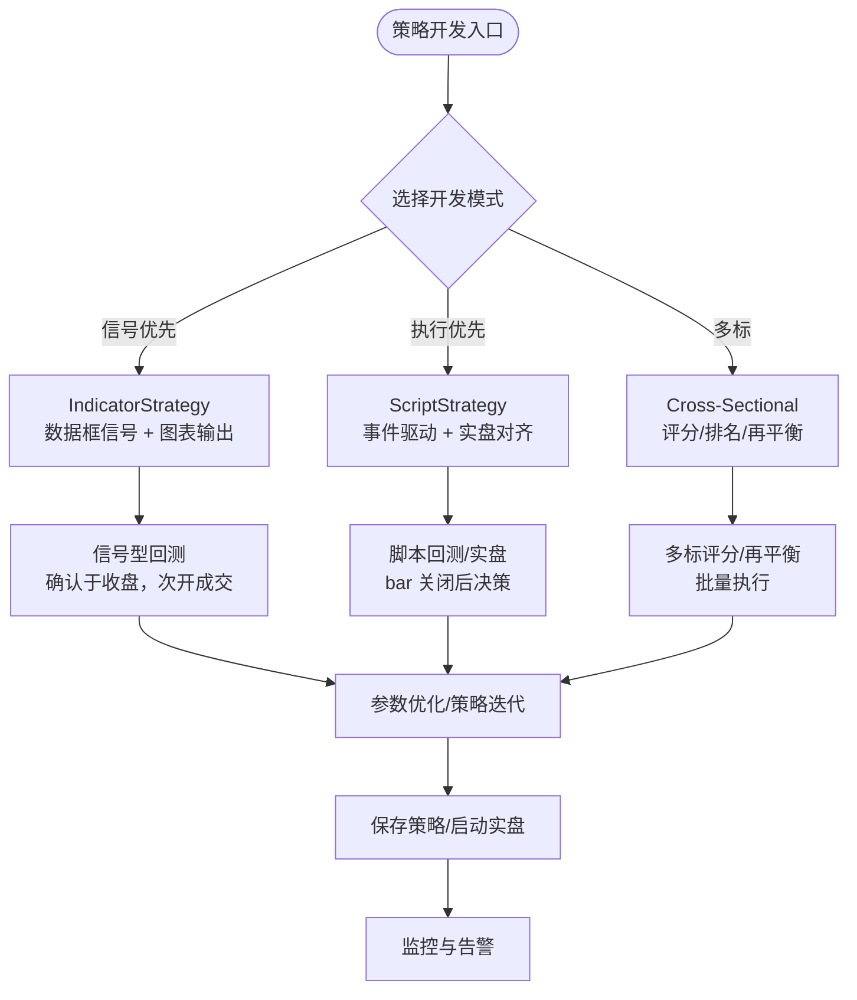
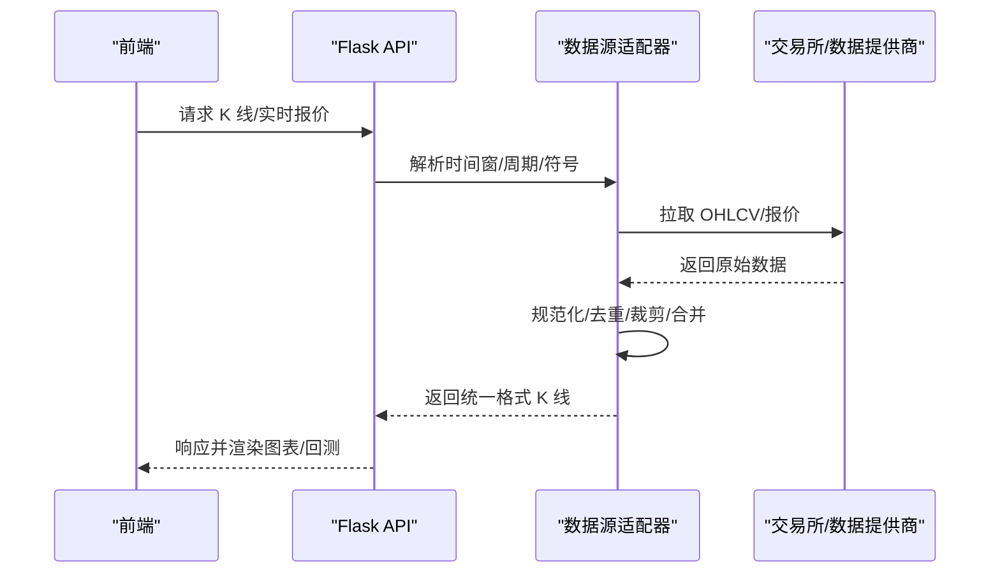
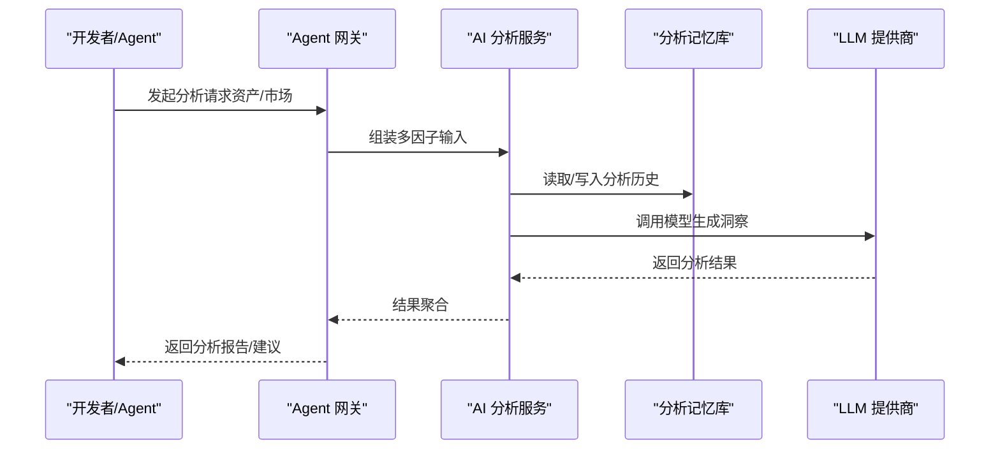
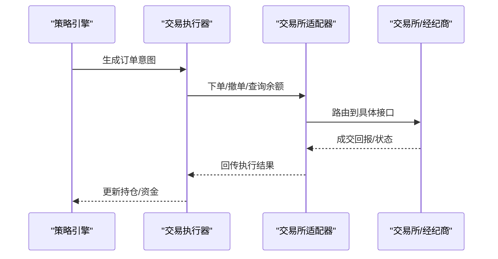
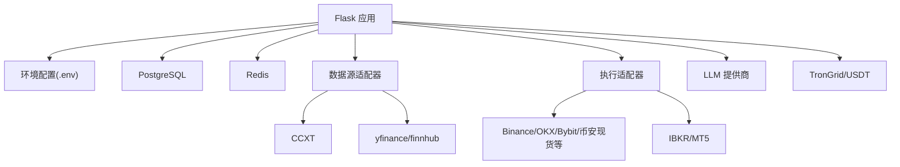

# 项目概述

<cite>
**本文引用的文件**
- [README.md](file://README.md)
- [backend_api_python/README.md](file://backend_api_python/README.md)
- [DEVELOPMENT.md](file://DEVELOPMENT.md)
- [docs/README_CN.md](file://docs/README_CN.md)
- [backend_api_python/run.py](file://backend_api_python/run.py)
- [backend_api_python/app/__init__.py](file://backend_api_python/app/__init__.py)
- [backend_api_python/env.example](file://backend_api_python/env.example)
- [docker-compose.yml](file://docker-compose.yml)
- [docs/STRATEGY_DEV_GUIDE.md](file://docs/STRATEGY_DEV_GUIDE.md)
- [docs/CROSS_SECTIONAL_STRATEGY_GUIDE_EN.md](file://docs/CROSS_SECTIONAL_STRATEGY_GUIDE_EN.md)
- [backend_api_python/app/data_sources/crypto.py](file://backend_api_python/app/data_sources/crypto.py)
- [backend_api_python/app/data_sources/us_stock.py](file://backend_api_python/app/data_sources/us_stock.py)
</cite>

## 目录
1. [引言](#引言)
2. [项目结构](#项目结构)
3. [核心组件](#核心组件)
4. [架构总览](#架构总览)
5. [详细组件分析](#详细组件分析)
6. [依赖关系分析](#依赖关系分析)
7. [性能考量](#性能考量)
8. [故障排查指南](#故障排查指南)
9. [结论](#结论)
10. [附录](#附录)

## 引言
QuantDinger 是一款“本地优先”的自托管量化操作系统，将“AI 辅助研究、Python 原生策略、回测与实盘交易”整合为一套可部署的完整闭环。项目支持加密货币、传统股票（美股）、外汇（经 MT5/外盘）等多市场类型，提供从 Idea → 指标 → 策略 → 回测 → 优化 → 执行 → 监控的全链路体验。平台强调隐私与可扩展性：所有凭证与数据由用户自管，后端通过环境变量与数据库驱动，前端通过 Nginx 提供静态资源，后端以 Flask 承载策略引擎、AI 分析、计费与执行。

## 项目结构
- 后端（Flask/Python）：位于 backend_api_python，包含路由、服务层、数据源与工具模块，提供 REST API、策略运行时、AI 分析、回测、交易执行与后台作业。
- 前端（Nginx 静态）：位于 frontend，打包为预构建资源，容器内仅提供静态服务。
- 部署编排：docker-compose.yml 统一编排 postgres、redis、backend、frontend 四个服务，内置健康检查与端口映射。
- 文档与示例：docs 下包含多语言 README、策略开发指南、跨市场策略指南与示例脚本。

**图示来源**
- [README.md:278-332](file://README.md#L278-L332)
- [docker-compose.yml:25-160](file://docker-compose.yml#L25-L160)

**章节来源**
- [README.md:538-556](file://README.md#L538-L556)
- [docker-compose.yml:25-160](file://docker-compose.yml#L25-L160)

## 核心组件
- 应用入口与安全启动
  - run.py 负责加载 .env、应用代理与编码设置、注入 SECRET_KEY 安全检查与自动随机化、创建 Flask 应用实例。
  - app/__init__.py 提供 Flask 工厂、CORS、安全 JSON 输出（NaN/Inf 转 null）、全局单例（交易执行器、挂单工作者）、启动后台作业（挂单派发、组合监控、USDT 订单、Polymarket）、恢复运行中策略。
- 配置与环境
  - env.example 提供认证、数据库、AI/LLM、OAuth、代理、本地桌面经纪商、验证码、计费、USDT 支付、策略/执行参数、AI 搜索与校准、Redis 缓存等配置项。
- 数据与多市场接入
  - CryptoDataSource 基于 CCXT，支持多交易所符号规范化、容错与分页拉取 K 线。
  - USStockDataSource 基于 yfinance/finnhub，提供实时报价与日线回测数据，具备降级与合并周期能力。
- 策略开发与运行
  - 支持 IndicatorStrategy（数据框信号、图表叠加、信号型回测）与 ScriptStrategy（事件驱动、显式下单、实时对齐）。
  - 跨品种策略（Cross-Sectional）支持多标的评分与再平衡。

**章节来源**
- [backend_api_python/run.py:1-134](file://backend_api_python/run.py#L1-L134)
- [backend_api_python/app/__init__.py:1-280](file://backend_api_python/app/__init__.py#L1-L280)
- [backend_api_python/env.example:1-319](file://backend_api_python/env.example#L1-L319)
- [backend_api_python/app/data_sources/crypto.py:1-428](file://backend_api_python/app/data_sources/crypto.py#L1-L428)
- [backend_api_python/app/data_sources/us_stock.py:1-361](file://backend_api_python/app/data_sources/us_stock.py#L1-L361)
- [docs/STRATEGY_DEV_GUIDE.md:1-800](file://docs/STRATEGY_DEV_GUIDE.md#L1-L800)
- [docs/CROSS_SECTIONAL_STRATEGY_GUIDE_EN.md:1-224](file://docs/CROSS_SECTIONAL_STRATEGY_GUIDE_EN.md#L1-L224)

## 架构总览
QuantDinger 的端到端架构围绕“数据源 → 指标/信号/策略/回测/AI 分析层 → 执行层”的五层引擎展开，形成从“想法到监控”的闭环。系统通过 Nginx 提供前端静态资源，Flask 承载 API 网关与业务服务，PostgreSQL 存储状态，Redis 支撑缓存与后台作业，外部集成包括 LLM、市场数据、交易所与支付通道。

**图示来源**
- [README.md:278-332](file://README.md#L278-L332)
- [backend_api_python/app/__init__.py:213-279](file://backend_api_python/app/__init__.py#L213-L279)

**章节来源**
- [README.md:270-332](file://README.md#L270-L332)

## 详细组件分析

### 组件 A：策略开发与运行（IndicatorStrategy 与 ScriptStrategy）
- IndicatorStrategy
  - 以数据框生成 buy/sell 信号，支持参数化与策略默认风险设置（止损、止盈、入场比例、方向等），输出图表叠加与标记。
  - 回测语义：信号在收盘确认，通常于次开盘成交；注意避免前瞻偏误。
- ScriptStrategy
  - 事件驱动，支持 on_init/on_bar，通过 ctx.buy/sell/close_position 等接口表达意图；可依据 ctx.position 实现动态风控与再平衡。
  - 与 saved-strategy backtest 的规模主要由标准化交易配置（如 entryPct）决定，amount 为运行时意图。
- 跨品种策略（Cross-Sectional）
  - 多标的评分与排名，按目标比例分配多头/空头，支持日/周/月再平衡与批量执行。

**图示来源**
- [docs/STRATEGY_DEV_GUIDE.md:93-800](file://docs/STRATEGY_DEV_GUIDE.md#L93-L800)
- [docs/CROSS_SECTIONAL_STRATEGY_GUIDE_EN.md:1-224](file://docs/CROSS_SECTIONAL_STRATEGY_GUIDE_EN.md#L1-L224)

**章节来源**
- [docs/STRATEGY_DEV_GUIDE.md:1-800](file://docs/STRATEGY_DEV_GUIDE.md#L1-L800)
- [docs/CROSS_SECTIONAL_STRATEGY_GUIDE_EN.md:1-224](file://docs/CROSS_SECTIONAL_STRATEGY_GUIDE_EN.md#L1-L224)

### 组件 B：数据源与多市场接入
- 加密货币（CCXT）
  - 符号规范化、交易所差异适配、活跃市场校验、分页拉取与去重、时间窗裁剪与日志追踪。
- 美国股票（yfinance/finnhub）
  - 实时报价优先级：Finnhub（更快）→ yfinance fast_info → info → 1 分钟回退；日线回测优先 yfinance，必要时降级 finnhub；支持周期合并与裁剪。
- 外汇与传统市场
  - 通过 IBKR/MT5 路径接入美股与外汇数据与执行；Polymarket 作为研究与分析工作流。

**图示来源**
- [backend_api_python/app/data_sources/crypto.py:176-306](file://backend_api_python/app/data_sources/crypto.py#L176-L306)
- [backend_api_python/app/data_sources/us_stock.py:176-244](file://backend_api_python/app/data_sources/us_stock.py#L176-L244)

**章节来源**
- [backend_api_python/app/data_sources/crypto.py:1-428](file://backend_api_python/app/data_sources/crypto.py#L1-L428)
- [backend_api_python/app/data_sources/us_stock.py:1-361](file://backend_api_python/app/data_sources/us_stock.py#L1-L361)
- [README.md:484-512](file://README.md#L484-L512)

### 组件 C：AI 辅助研究与分析
- AI 分析服务
  - FastAnalysisService：单次/多次因子的 LLM 调用，结合市场数据与分析记忆；支持校准（阈值自调）、相似模式检索与用户反馈。
  - 可选集成：Adanos 市场情绪、Polymarket 研究工作流。
- Agent 网关与 MCP
  - 提供 /api/agent/v1 接口与 MCP 服务器，支持 Cursor/Claude Code 等客户端以“纸面交易”默认安全模式读取市场、管理策略与回测；Live 执行需显式开关与令牌配置。

**图示来源**
- [README.md:133-221](file://README.md#L133-L221)
- [backend_api_python/README.md:210-217](file://backend_api_python/README.md#L210-L217)

**章节来源**
- [README.md:264-269](file://README.md#L264-L269)
- [backend_api_python/README.md:210-217](file://backend_api_python/README.md#L210-L217)

### 组件 D：交易执行与快速交易
- 执行路径
  - 策略引擎生成下单意图 → 交易执行器 → 交易所/经纪商适配器（Binance/OKX/Bybit/币安现货/OKX 现货/Bitget/Gate/Kraken/HTX/Coinbase/KuCoin/Deepcoin/Kraken 永续等）。
  - 本地桌面经纪商（IBKR/MT5）通过本地终端连接，支持美股与外汇。
- 快速交易与挂单派发
  - 后台工作者按队列派发挂单，支持 USDT 订单链上状态轮询与恢复。

**图示来源**
- [README.md:484-512](file://README.md#L484-L512)
- [backend_api_python/env.example:106-124](file://backend_api_python/env.example#L106-L124)

**章节来源**
- [README.md:484-512](file://README.md#L484-L512)
- [backend_api_python/env.example:106-124](file://backend_api_python/env.example#L106-L124)

## 依赖关系分析
- 组件耦合与内聚
  - Flask 工厂集中初始化数据库、用户服务、CORS、日志与后台作业，降低模块间耦合；数据源适配器与执行适配器通过工厂/配置解耦。
- 外部依赖
  - PostgreSQL/Redis 作为状态与缓存；CCXT/yfinance/finnhub 提供多市场数据；LLM 提供 AI 分析；支付通道（TronGrid/USDT）支撑 USDT 计费。
- 部署与运维
  - docker-compose 统一编排，健康检查保障可用性；.env 驱动配置，支持镜像前缀、端口与连接池参数调优。

**图示来源**
- [docker-compose.yml:25-160](file://docker-compose.yml#L25-L160)
- [backend_api_python/env.example:1-319](file://backend_api_python/env.example#L1-L319)

**章节来源**
- [docker-compose.yml:25-160](file://docker-compose.yml#L25-L160)
- [backend_api_python/env.example:1-319](file://backend_api_python/env.example#L1-L319)

## 性能考量
- 数据拉取与缓存
  - Redis 缓存可显著降低高频查询压力；数据库连接池与路由级执行器线程数需与并发策略数量匹配，避免连接池耗尽。
- 回测与策略线程
  - 策略最大并发线程数可通过配置调节；大量实盘策略启动时建议提升线程上限并观察系统资源。
- 代理与网络
  - 通过 PROXY_URL 与 CA/BUNDLE 设置保障出站访问稳定性；中国境内金融数据源需绕过代理以避免额外延迟。
- IO 与序列化
  - 安全 JSON 提供器将 NaN/Inf 转为 null，避免前端解析异常；K 线分页与去重减少重复数据与网络负担。

**章节来源**
- [backend_api_python/run.py:35-91](file://backend_api_python/run.py#L35-L91)
- [backend_api_python/env.example:215-234](file://backend_api_python/env.example#L215-L234)

## 故障排查指南
- 启动与安全
  - 若后端立即退出，检查 SECRET_KEY 是否为默认值；首次启动需生成并写入 .env。
- 端口与网络
  - 端口冲突（5000/8888/5432/6379）需在根目录 .env 中调整；反向代理需正确设置 FRONTEND_URL 与 CORS。
- 数据与代理
  - 十二大数据源（Twelve Data）需正确配置 API Key；yfinance/finnhub 可能因限流或计划权限受限；代理设置需区分国内金融域名直连。
- 后台作业
  - 挂单派发、组合监控、USDT 订单与 Polymarket 工作者需按需启用；调试模式下避免重复启动。
- 常用命令
  - docker-compose ps/logs/restart/up/down 用于服务状态与日志排查。

**章节来源**
- [README.md:418-426](file://README.md#L418-L426)
- [DEVELOPMENT.md:146-151](file://DEVELOPMENT.md#L146-L151)
- [backend_api_python/run.py:109-120](file://backend_api_python/run.py#L109-L120)

## 结论
QuantDinger 以“本地优先、隐私可控、工程可扩展”为核心理念，将 AI 研究、Python 原生策略、回测与实盘执行整合为闭环工作流。通过模块化的数据源与执行适配器、灵活的策略开发模式与后台作业体系，平台既适合初学者快速上手，也为有经验的开发者提供了可演进的架构与强大的可定制空间。结合多市场接入与可选计费/会员能力，QuantDinger 可作为个人工作站或团队运营平台的统一底座。

## 附录
- 快速开始
  - Docker 一键部署：克隆仓库 → 复制 env.example → 生成 SECRET_KEY → docker-compose up -d --build → 访问 http://localhost:8888。
- 策略开发建议
  - 优先使用 IndicatorStrategy 验证信号与参数，再迁移到 ScriptStrategy 实现实盘对齐；跨品种策略按评分/再平衡流程编写。
- 多语言文档
  - 英文 README、中文 README、策略指南与示例脚本位于 docs 目录，便于按需查阅。

**章节来源**
- [README.md:81-120](file://README.md#L81-L120)
- [docs/README_CN.md:81-120](file://docs/README_CN.md#L81-L120)
- [docs/STRATEGY_DEV_GUIDE.md:12-17](file://docs/STRATEGY_DEV_GUIDE.md#L12-L17)