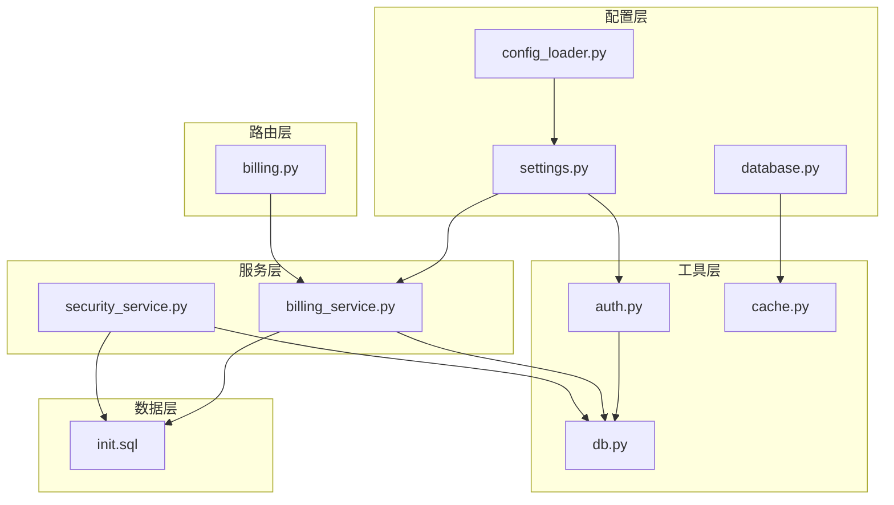
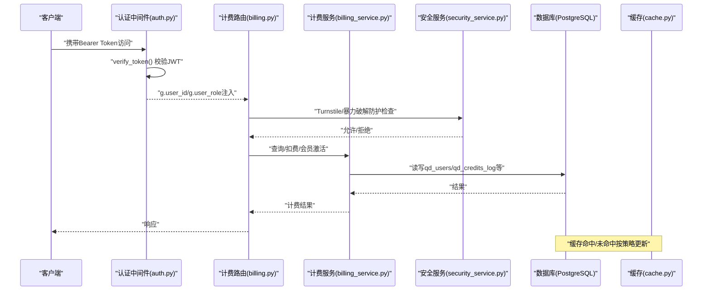
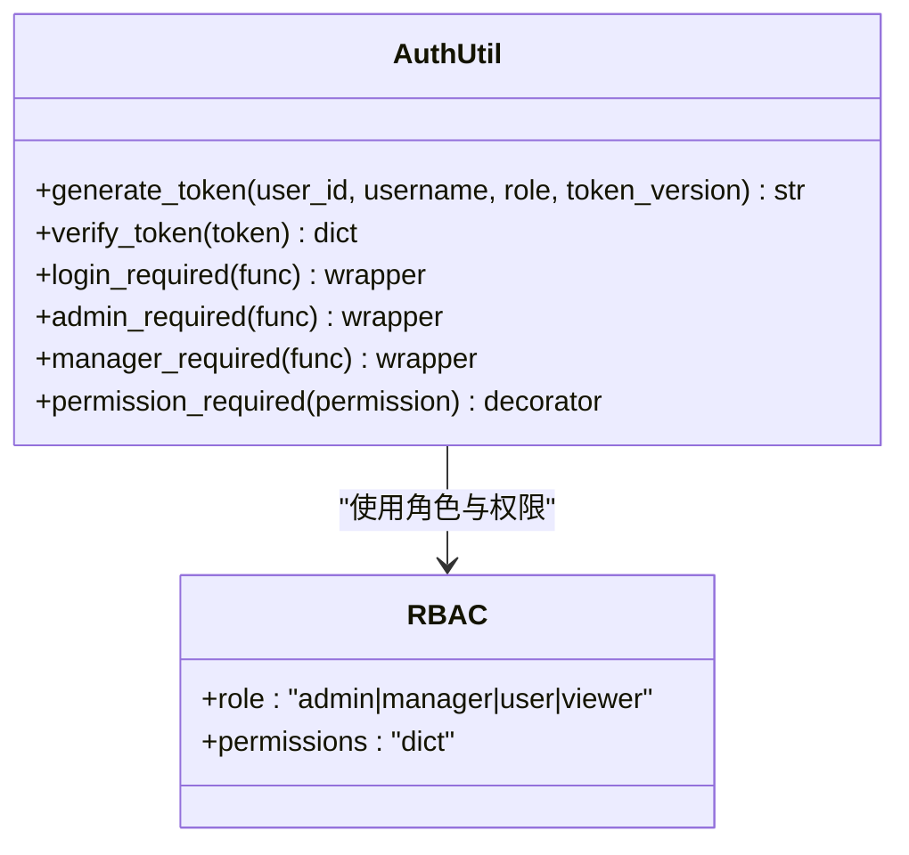
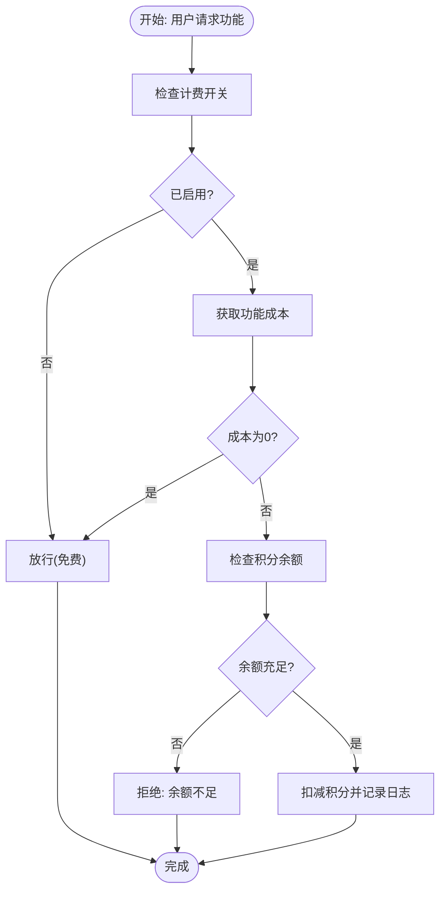
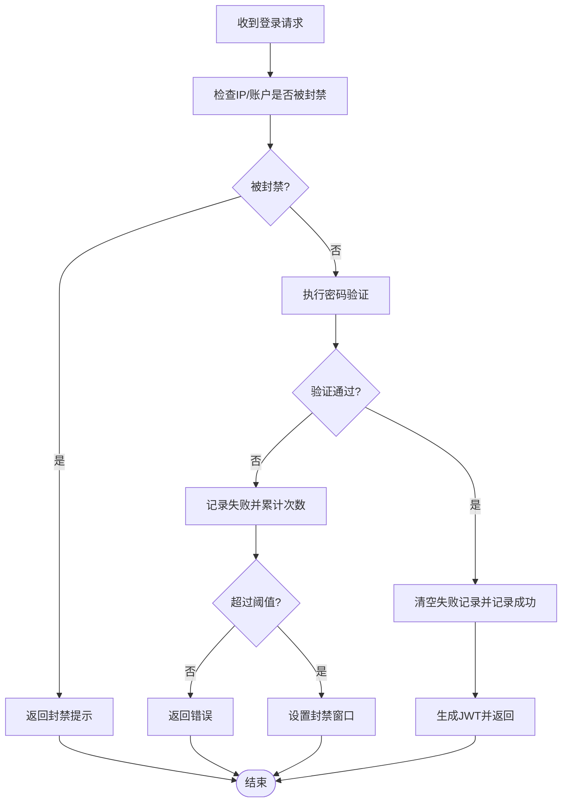
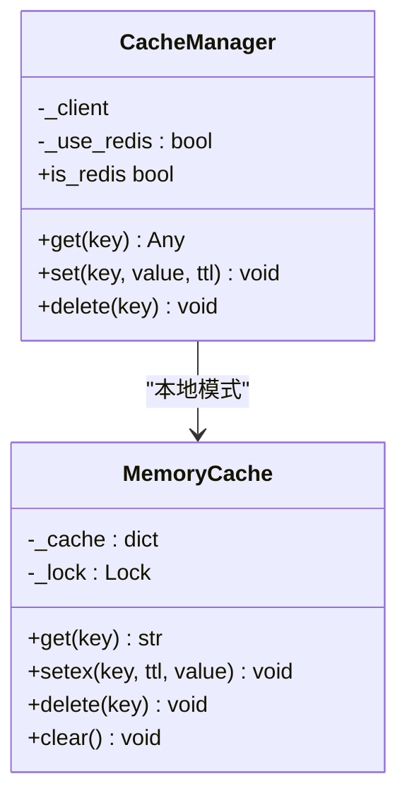
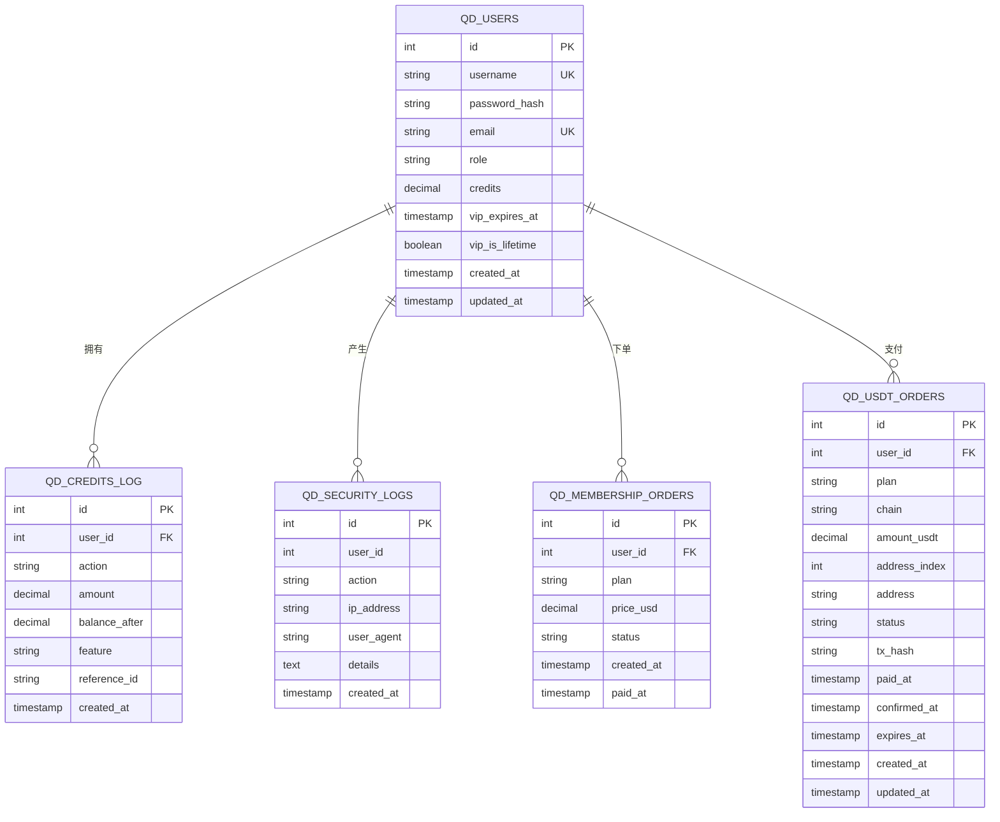
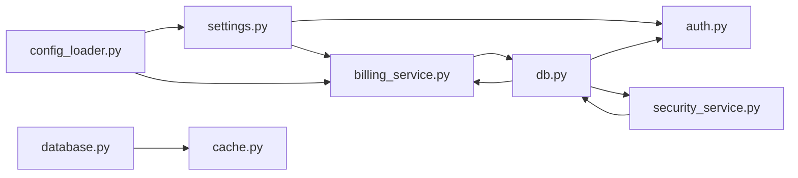

# 多租户架构扩展

<cite>
**本文引用的文件**
- [settings.py](file://backend_api_python/app/config/settings.py)
- [database.py](file://backend_api_python/app/config/database.py)
- [db.py](file://backend_api_python/app/utils/db.py)
- [auth.py](file://backend_api_python/app/utils/auth.py)
- [cache.py](file://backend_api_python/app/utils/cache.py)
- [config_loader.py](file://backend_api_python/app/utils/config_loader.py)
- [billing_service.py](file://backend_api_python/app/services/billing_service.py)
- [billing.py](file://backend_api_python/app/routes/billing.py)
- [security_service.py](file://backend_api_python/app/services/security_service.py)
- [init.sql](file://backend_api_python/migrations/init.sql)
</cite>

## 目录
1. [简介](#简介)
2. [项目结构](#项目结构)
3. [核心组件](#核心组件)
4. [架构总览](#架构总览)
5. [详细组件分析](#详细组件分析)
6. [依赖分析](#依赖分析)
7. [性能考虑](#性能考虑)
8. [故障排查指南](#故障排查指南)
9. [结论](#结论)
10. [附录](#附录)

## 简介
本文件面向QuantDinger的多租户架构扩展，系统性阐述多租户设计的核心理念、数据隔离策略、资源管理与权限模型，并结合现有代码库中的认证、计费、缓存与安全模块，给出可落地的实施方案。文档同时覆盖租户配置管理、计费系统集成、API配额控制、部署架构、数据库设计与缓存策略，以及迁移、扩容与性能优化的最佳实践，并强调安全隔离、合规性与审计追踪的技术保障。

## 项目结构
QuantDinger后端采用Flask微服务风格，围绕“配置-工具-服务-路由”分层组织。与多租户相关的关键目录与文件包括：
- 配置层：settings.py、database.py、config_loader.py
- 工具层：auth.py（认证）、cache.py（缓存）、db.py（数据库连接）
- 服务层：billing_service.py（计费）、security_service.py（安全）
- 路由层：billing.py（计费API）
- 数据层：migrations/init.sql（初始化与表结构）

**图示来源**
- [settings.py:1-99](file://backend_api_python/app/config/settings.py#L1-L99)
- [database.py:1-90](file://backend_api_python/app/config/database.py#L1-L90)
- [config_loader.py:1-251](file://backend_api_python/app/utils/config_loader.py#L1-L251)
- [auth.py:1-239](file://backend_api_python/app/utils/auth.py#L1-L239)
- [cache.py:1-129](file://backend_api_python/app/utils/cache.py#L1-L129)
- [db.py:1-66](file://backend_api_python/app/utils/db.py#L1-L66)
- [billing_service.py:1-758](file://backend_api_python/app/services/billing_service.py#L1-L758)
- [security_service.py:1-399](file://backend_api_python/app/services/security_service.py#L1-L399)
- [billing.py:1-95](file://backend_api_python/app/routes/billing.py#L1-L95)
- [init.sql:1-1117](file://backend_api_python/migrations/init.sql#L1-L1117)

**章节来源**
- [settings.py:1-99](file://backend_api_python/app/config/settings.py#L1-L99)
- [database.py:1-90](file://backend_api_python/app/config/database.py#L1-L90)
- [config_loader.py:1-251](file://backend_api_python/app/utils/config_loader.py#L1-L251)
- [auth.py:1-239](file://backend_api_python/app/utils/auth.py#L1-L239)
- [cache.py:1-129](file://backend_api_python/app/utils/cache.py#L1-L129)
- [db.py:1-66](file://backend_api_python/app/utils/db.py#L1-L66)
- [billing_service.py:1-758](file://backend_api_python/app/services/billing_service.py#L1-L758)
- [security_service.py:1-399](file://backend_api_python/app/services/security_service.py#L1-L399)
- [billing.py:1-95](file://backend_api_python/app/routes/billing.py#L1-L95)
- [init.sql:1-1117](file://backend_api_python/migrations/init.sql#L1-L1117)

## 核心组件
- 应用配置与环境变量：集中于settings.py与config_loader.py，支持运行时配置加载与环境变量优先策略。
- 认证与权限：auth.py提供JWT生成、校验与装饰器，支持角色与权限检查；配合数据库中的用户表与审计日志表实现租户级访问控制。
- 计费与配额：billing_service.py提供积分余额、功能扣费、会员状态与套餐发放；billing.py提供对外API。
- 缓存与性能：cache.py提供本地内存缓存与Redis备选；database.py定义缓存TTL策略。
- 安全与审计：security_service.py提供Turnstile验证、暴力破解防护、登录尝试记录与安全审计日志。
- 数据库与隔离：init.sql定义用户、积分、会员、订单、审计等核心表，通过user_id外键实现天然的租户隔离。

**章节来源**
- [settings.py:1-99](file://backend_api_python/app/config/settings.py#L1-L99)
- [config_loader.py:1-251](file://backend_api_python/app/utils/config_loader.py#L1-L251)
- [auth.py:1-239](file://backend_api_python/app/utils/auth.py#L1-L239)
- [billing_service.py:1-758](file://backend_api_python/app/services/billing_service.py#L1-L758)
- [billing.py:1-95](file://backend_api_python/app/routes/billing.py#L1-L95)
- [cache.py:1-129](file://backend_api_python/app/utils/cache.py#L1-L129)
- [database.py:1-90](file://backend_api_python/app/config/database.py#L1-L90)
- [security_service.py:1-399](file://backend_api_python/app/services/security_service.py#L1-L399)
- [init.sql:1-1117](file://backend_api_python/migrations/init.sql#L1-L1117)

## 架构总览
下图展示了多租户场景下的关键交互：客户端请求经认证与权限检查后，进入业务服务（计费、安全等），所有数据均以user_id为维度进行隔离，审计日志贯穿始终。

**图示来源**
- [auth.py:126-157](file://backend_api_python/app/utils/auth.py#L126-L157)
- [billing.py:20-32](file://backend_api_python/app/routes/billing.py#L20-L32)
- [billing_service.py:461-526](file://backend_api_python/app/services/billing_service.py#L461-L526)
- [security_service.py:72-110](file://backend_api_python/app/services/security_service.py#L72-L110)
- [cache.py:100-124](file://backend_api_python/app/utils/cache.py#L100-L124)
- [init.sql:8-31](file://backend_api_python/migrations/init.sql#L8-L31)

## 详细组件分析

### 认证与权限模型
- JWT令牌：包含用户ID、用户名、角色与token版本，用于单一客户端登录控制与权限判定。
- 装饰器体系：login_required、admin_required、manager_required、permission_required，确保端点访问受控。
- 角色与权限：基于角色的访问控制（RBAC），权限来源于用户服务动态加载。

**图示来源**
- [auth.py:18-217](file://backend_api_python/app/utils/auth.py#L18-L217)

**章节来源**
- [auth.py:1-239](file://backend_api_python/app/utils/auth.py#L1-L239)

### 计费系统与API配额
- 计费配置：通过环境变量与配置缓存组合，支持全局开关与功能级积分消耗。
- 余额与消费：用户积分余额查询、消费与日志记录，支持回滚与审计。
- 会员计划：月卡、年卡、终身卡的到期时间、额度与奖励策略。
- USDT支付：订单创建与状态查询，链上确认后激活会员权益。

**图示来源**
- [billing_service.py:461-526](file://backend_api_python/app/services/billing_service.py#L461-L526)

**章节来源**
- [billing_service.py:1-758](file://backend_api_python/app/services/billing_service.py#L1-L758)
- [billing.py:1-95](file://backend_api_python/app/routes/billing.py#L1-L95)

### 安全隔离与审计
- Turnstile验证：可选的人机验证，失败时拒绝访问。
- 暴力破解防护：基于IP与账户维度的失败次数统计与封禁窗口。
- 登录尝试与审计：记录每次登录尝试与安全事件，支持清理过期记录。
- 密码强度：最小长度与字符集要求。

**图示来源**
- [security_service.py:200-241](file://backend_api_python/app/services/security_service.py#L200-L241)

**章节来源**
- [security_service.py:1-399](file://backend_api_python/app/services/security_service.py#L1-L399)

### 缓存策略与性能
- 本地优先：默认使用内存缓存，Redis仅在显式启用时生效。
- TTL策略：针对K线、分析、价格等场景设定不同TTL，兼顾实时性与性能。
- 并发安全：缓存管理器使用锁保证线程安全。

**图示来源**
- [cache.py:49-129](file://backend_api_python/app/utils/cache.py#L49-L129)
- [database.py:57-84](file://backend_api_python/app/config/database.py#L57-L84)

**章节来源**
- [cache.py:1-129](file://backend_api_python/app/utils/cache.py#L1-L129)
- [database.py:1-90](file://backend_api_python/app/config/database.py#L1-L90)

### 数据库设计与租户隔离
- 用户与会话：qd_users包含用户基本信息、积分、VIP状态与令牌版本，支撑多租户隔离。
- 计费与审计：qd_credits_log记录积分变动与功能关联，qd_security_logs记录安全事件。
- 订单与支付：qd_membership_orders与qd_usdt_orders支撑会员购买与链上支付。
- 策略与交易：qd_strategies_trading、qd_strategy_positions、qd_strategy_trades等以user_id隔离。

**图示来源**
- [init.sql:8-31](file://backend_api_python/migrations/init.sql#L8-L31)
- [init.sql:42-57](file://backend_api_python/migrations/init.sql#L42-L57)
- [init.sql:177-189](file://backend_api_python/migrations/init.sql#L177-L189)
- [init.sql:63-94](file://backend_api_python/migrations/init.sql#L63-L94)
- [init.sql:79-94](file://backend_api_python/migrations/init.sql#L79-L94)

**章节来源**
- [init.sql:1-1117](file://backend_api_python/migrations/init.sql#L1-L1117)

## 依赖分析
- 配置依赖：settings.py与config_loader.py共同决定应用行为，后者提供扁平到嵌套的配置映射。
- 认证依赖：auth.py依赖settings.py中的密钥与超时配置，并通过db.py访问数据库核对token版本。
- 计费依赖：billing_service.py依赖db.py与config_loader.py，读取环境变量与数据库。
- 安全依赖：security_service.py依赖db.py与外部Turnstile接口。
- 缓存依赖：cache.py依赖database.py中的Redis配置与CacheConfig。

**图示来源**
- [settings.py:1-99](file://backend_api_python/app/config/settings.py#L1-L99)
- [config_loader.py:1-251](file://backend_api_python/app/utils/config_loader.py#L1-L251)
- [auth.py:1-239](file://backend_api_python/app/utils/auth.py#L1-L239)
- [db.py:1-66](file://backend_api_python/app/utils/db.py#L1-L66)
- [billing_service.py:1-758](file://backend_api_python/app/services/billing_service.py#L1-L758)
- [security_service.py:1-399](file://backend_api_python/app/services/security_service.py#L1-L399)
- [database.py:1-90](file://backend_api_python/app/config/database.py#L1-L90)
- [cache.py:1-129](file://backend_api_python/app/utils/cache.py#L1-L129)

**章节来源**
- [settings.py:1-99](file://backend_api_python/app/config/settings.py#L1-L99)
- [config_loader.py:1-251](file://backend_api_python/app/utils/config_loader.py#L1-L251)
- [auth.py:1-239](file://backend_api_python/app/utils/auth.py#L1-L239)
- [db.py:1-66](file://backend_api_python/app/utils/db.py#L1-L66)
- [billing_service.py:1-758](file://backend_api_python/app/services/billing_service.py#L1-L758)
- [security_service.py:1-399](file://backend_api_python/app/services/security_service.py#L1-L399)
- [database.py:1-90](file://backend_api_python/app/config/database.py#L1-L90)
- [cache.py:1-129](file://backend_api_python/app/utils/cache.py#L1-L129)

## 性能考虑
- 缓存策略：针对高频读取的数据（如K线、分析结果、价格）设置合理TTL，避免热点击穿；在Redis不可用时自动降级为内存缓存。
- 数据库连接：统一通过db.py提供的连接池接口，避免长事务与阻塞；对高并发写入（积分变动、订单）使用事务与索引优化。
- 安全检查：Turnstile验证失败时快速拒绝，降低无效负载；登录尝试记录采用异步或批量写入策略。
- API限流：结合RateLimit配置与安全服务的封禁策略，防止恶意刷量。

[本节为通用指导，无需特定文件引用]

## 故障排查指南
- 认证失败：检查Token签名、过期与token版本一致性；核对数据库中token_version是否与JWT一致。
- 计费异常：确认计费开关与功能成本配置；查看积分日志与余额变更记录；检查会员状态与到期时间。
- 缓存问题：确认CacheConfig.ENABLED与Redis连通性；观察内存缓存与Redis切换日志。
- 安全告警：查看qd_security_logs与qd_login_attempts表，定位暴力破解与异常登录行为。
- 数据库连接：确认DATABASE_URL与PostgreSQL可达性；检查migrations/init.sql是否成功执行。

**章节来源**
- [auth.py:82-114](file://backend_api_python/app/utils/auth.py#L82-L114)
- [billing_service.py:675-727](file://backend_api_python/app/services/billing_service.py#L675-L727)
- [cache.py:77-99](file://backend_api_python/app/utils/cache.py#L77-L99)
- [security_service.py:246-277](file://backend_api_python/app/services/security_service.py#L246-L277)
- [init.sql:1-1117](file://backend_api_python/migrations/init.sql#L1-L1117)

## 结论
QuantDinger现有架构以user_id为天然租户边界，结合认证、计费、安全与缓存模块，形成了可扩展的多租户基础。通过明确的配置加载、严格的审计与封禁策略、以及可插拔的缓存实现，系统在功能与性能之间取得平衡。建议在生产环境中进一步完善租户维度的监控与治理，强化API配额与资源隔离策略，并持续优化数据库索引与缓存命中率。

[本节为总结性内容，无需特定文件引用]

## 附录

### 多租户部署架构建议
- 单数据库多Schema：在PostgreSQL中为每个租户分配独立Schema，配合Row Level Security（RLS）实现更强隔离。
- 多数据库实例：按租户分库，结合读写分离与备份策略。
- 服务拆分：将计费、安全、缓存等模块容器化，按需水平扩展。
- CDN与边缘缓存：对静态资源与公共数据使用CDN，降低数据库压力。

[本节为概念性建议，无需特定文件引用]

### 租户迁移与扩容最佳实践
- 迁移：先冻结写入，导出旧库，按租户维度导入新Schema/库，校验关键表完整性后再解冻。
- 扩容：优先提升缓存容量与Redis集群；数据库层面增加只读副本与索引优化；API网关侧增加限流与熔断。

[本节为通用指导，无需特定文件引用]

### 安全隔离、合规性与审计
- 安全隔离：强制启用Turnstile；限制登录尝试；定期清理过期记录；对敏感字段加密存储。
- 合规性：遵循GDPR等隐私保护要求，提供数据删除与导出能力；审计日志保留满足监管要求。
- 审计追踪：qd_security_logs与qd_credits_log提供完整的操作轨迹，支持回溯与溯源。

**章节来源**
- [security_service.py:362-399](file://backend_api_python/app/services/security_service.py#L362-L399)
- [init.sql:177-189](file://backend_api_python/migrations/init.sql#L177-L189)
- [init.sql:42-57](file://backend_api_python/migrations/init.sql#L42-L57)