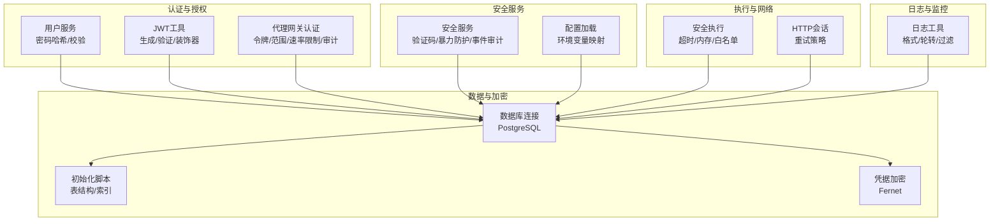
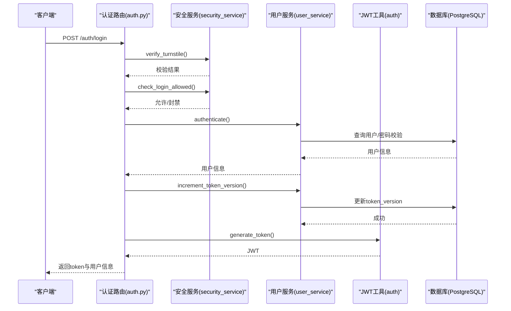
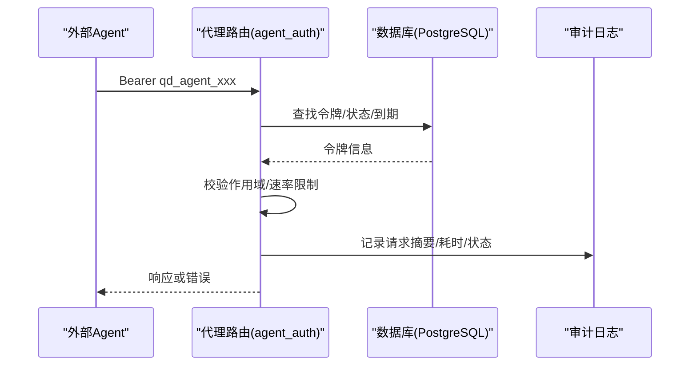
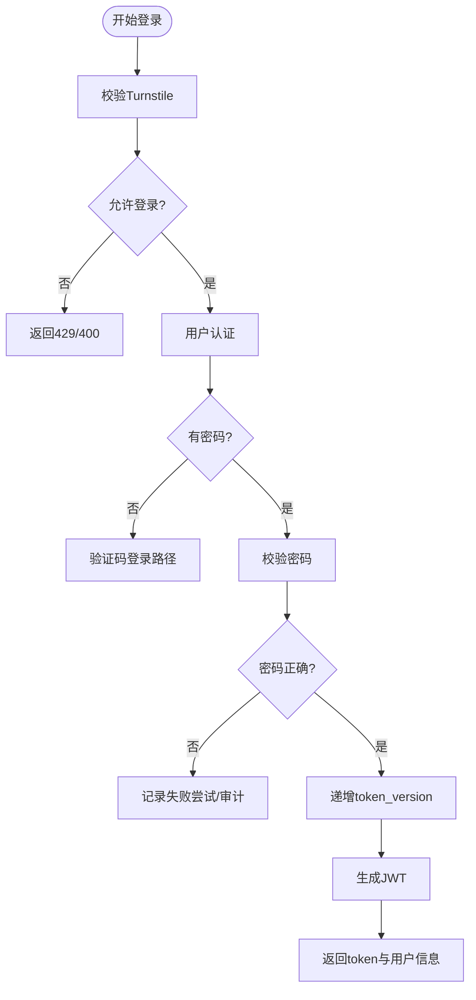
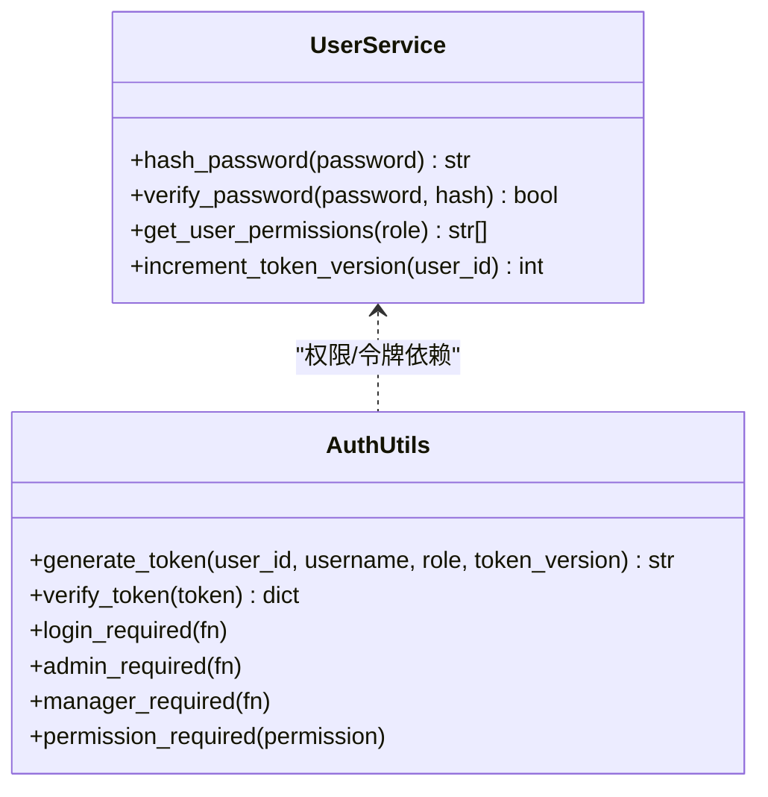
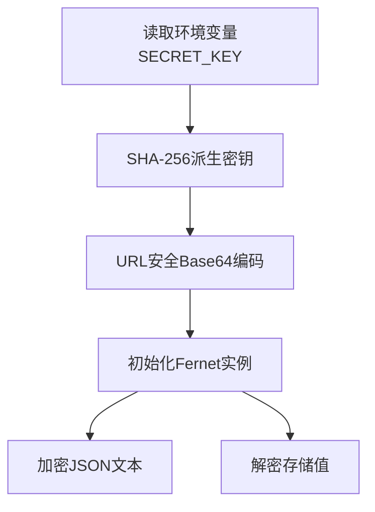
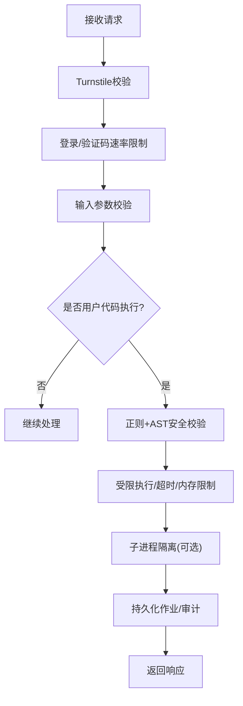
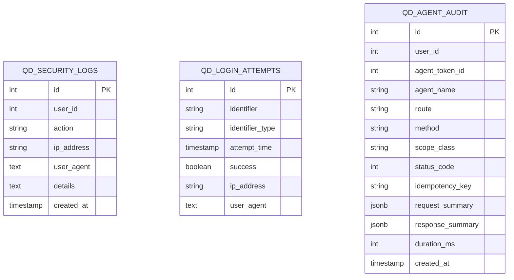
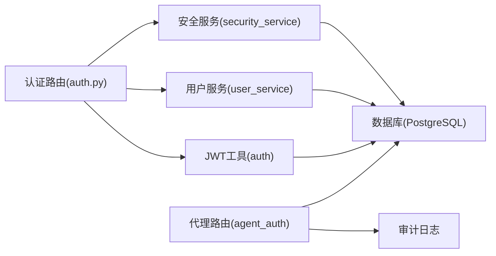

# 安全加固措施

<cite>
**本文档引用的文件**
- [backend_api_python/app/utils/auth.py](file://backend_api_python/app/utils/auth.py)
- [backend_api_python/app/utils/agent_auth.py](file://backend_api_python/app/utils/agent_auth.py)
- [backend_api_python/app/services/security_service.py](file://backend_api_python/app/services/security_service.py)
- [backend_api_python/app/config/settings.py](file://backend_api_python/app/config/settings.py)
- [backend_api_python/app/routes/auth.py](file://backend_api_python/app/routes/auth.py)
- [backend_api_python/app/utils/logger.py](file://backend_api_python/app/utils/logger.py)
- [backend_api_python/app/utils/db.py](file://backend_api_python/app/utils/db.py)
- [backend_api_python/migrations/init.sql](file://backend_api_python/migrations/init.sql)
- [backend_api_python/app/utils/safe_exec.py](file://backend_api_python/app/utils/safe_exec.py)
- [backend_api_python/app/utils/credential_crypto.py](file://backend_api_python/app/utils/credential_crypto.py)
- [backend_api_python/app/utils/http.py](file://backend_api_python/app/utils/http.py)
- [backend_api_python/app/utils/config_loader.py](file://backend_api_python/app/utils/config_loader.py)
- [backend_api_python/app/services/user_service.py](file://backend_api_python/app/services/user_service.py)
- [backend_api_python/app/utils/agent_jobs.py](file://backend_api_python/app/utils/agent_jobs.py)
</cite>

## 目录
1. [简介](#简介)
2. [项目结构](#项目结构)
3. [核心组件](#核心组件)
4. [架构总览](#架构总览)
5. [详细组件分析](#详细组件分析)
6. [依赖关系分析](#依赖关系分析)
7. [性能考虑](#性能考虑)
8. [故障排除指南](#故障排除指南)
9. [结论](#结论)
10. [附录](#附录)

## 简介
本文件面向QuantDinger平台的安全加固，系统化阐述身份认证、授权控制、数据加密、API安全防护、输入验证与注入攻击防范、会话管理与令牌刷新、权限验证、安全审计与日志记录、威胁检测、合规与隐私保护、漏洞扫描与渗透测试以及应急响应流程。文档以代码为依据，结合实际实现细节，提供可操作的实施方案与最佳实践。

## 项目结构
QuantDinger后端采用Flask微服务架构，安全相关能力主要分布在以下模块：
- 认证与授权：用户认证、角色权限、JWT令牌、代理网关令牌
- 安全服务：验证码、登录尝试记录、暴力破解防护、Turnstile人机验证、安全事件审计
- 数据库与模式：PostgreSQL初始化脚本定义用户、凭证、登录尝试、安全审计等表
- 数据加密：Fernet对称加密用于交易所凭据存储
- 代码执行安全：受限执行环境、超时与内存限制、子进程隔离
- 日志与监控：统一日志配置、请求级日志开关
- 配置加载：环境变量驱动的配置加载，避免敏感信息落库

**图示来源**
- [backend_api_python/app/utils/auth.py:1-239](file://backend_api_python/app/utils/auth.py#L1-L239)
- [backend_api_python/app/utils/agent_auth.py:1-481](file://backend_api_python/app/utils/agent_auth.py#L1-L481)
- [backend_api_python/app/services/security_service.py:1-399](file://backend_api_python/app/services/security_service.py#L1-L399)
- [backend_api_python/app/utils/db.py:1-66](file://backend_api_python/app/utils/db.py#L1-L66)
- [backend_api_python/migrations/init.sql:1-1117](file://backend_api_python/migrations/init.sql#L1-L1117)
- [backend_api_python/app/utils/credential_crypto.py:1-50](file://backend_api_python/app/utils/credential_crypto.py#L1-L50)
- [backend_api_python/app/utils/safe_exec.py:1-471](file://backend_api_python/app/utils/safe_exec.py#L1-L471)
- [backend_api_python/app/utils/http.py:1-42](file://backend_api_python/app/utils/http.py#L1-L42)
- [backend_api_python/app/utils/logger.py:1-63](file://backend_api_python/app/utils/logger.py#L1-L63)
- [backend_api_python/app/utils/config_loader.py:1-251](file://backend_api_python/app/utils/config_loader.py#L1-L251)

**章节来源**
- [backend_api_python/app/utils/auth.py:1-239](file://backend_api_python/app/utils/auth.py#L1-L239)
- [backend_api_python/app/utils/agent_auth.py:1-481](file://backend_api_python/app/utils/agent_auth.py#L1-L481)
- [backend_api_python/app/services/security_service.py:1-399](file://backend_api_python/app/services/security_service.py#L1-L399)
- [backend_api_python/app/utils/db.py:1-66](file://backend_api_python/app/utils/db.py#L1-L66)
- [backend_api_python/migrations/init.sql:1-1117](file://backend_api_python/migrations/init.sql#L1-L1117)
- [backend_api_python/app/utils/credential_crypto.py:1-50](file://backend_api_python/app/utils/credential_crypto.py#L1-L50)
- [backend_api_python/app/utils/safe_exec.py:1-471](file://backend_api_python/app/utils/safe_exec.py#L1-L471)
- [backend_api_python/app/utils/http.py:1-42](file://backend_api_python/app/utils/http.py#L1-L42)
- [backend_api_python/app/utils/logger.py:1-63](file://backend_api_python/app/utils/logger.py#L1-L63)
- [backend_api_python/app/utils/config_loader.py:1-251](file://backend_api_python/app/utils/config_loader.py#L1-L251)

## 核心组件
- 身份认证与令牌
  - 用户登录：支持用户名/邮箱与密码、邮箱验证码快速登录；集成Cloudflare Turnstile人机验证；登录成功后生成JWT，同时递增token_version实现单一客户端登录控制。
  - 代理网关认证：专用Agent令牌，具备作用域（读/写/回测/通知/凭据/交易）、按令牌速率限制、审计日志、幂等性保障。
- 授权控制
  - 基于角色的权限矩阵（viewer/user/manager/admin），支持按权限字符串校验；管理员/经理装饰器链式保护。
- 数据加密
  - 交易所凭据采用Fernet对称加密，密钥来自环境变量SECRET_KEY派生。
  - 密码采用bcrypt（若可用）或SHA256+盐作为降级方案。
- API安全防护
  - 统一的登录/注册/验证码接口均进行Turnstile校验与速率限制；登录尝试记录与账户/IP封禁策略；安全事件审计日志。
- 输入验证与注入防护
  - 用户代码执行前进行静态安全校验（正则+AST），限制导入模块与危险函数调用；执行时设置超时与内存上限；支持子进程隔离。
- 会话管理与令牌刷新
  - JWT有效期7天；通过递增token_version实现旧令牌失效；代理令牌支持到期时间与状态控制。
- 安全审计与日志
  - 审计表记录登录、注册、重置密码、OAuth登录等关键事件；日志统一格式与轮转，过滤噪声。

**章节来源**
- [backend_api_python/app/routes/auth.py:1-1180](file://backend_api_python/app/routes/auth.py#L1-L1180)
- [backend_api_python/app/utils/auth.py:1-239](file://backend_api_python/app/utils/auth.py#L1-L239)
- [backend_api_python/app/utils/agent_auth.py:1-481](file://backend_api_python/app/utils/agent_auth.py#L1-L481)
- [backend_api_python/app/services/security_service.py:1-399](file://backend_api_python/app/services/security_service.py#L1-L399)
- [backend_api_python/app/services/user_service.py:1-701](file://backend_api_python/app/services/user_service.py#L1-L701)
- [backend_api_python/app/utils/credential_crypto.py:1-50](file://backend_api_python/app/utils/credential_crypto.py#L1-L50)
- [backend_api_python/app/utils/safe_exec.py:1-471](file://backend_api_python/app/utils/safe_exec.py#L1-L471)
- [backend_api_python/migrations/init.sql:1-1117](file://backend_api_python/migrations/init.sql#L1-L1117)
- [backend_api_python/app/utils/logger.py:1-63](file://backend_api_python/app/utils/logger.py#L1-L63)

## 架构总览
下图展示登录与代理网关两类认证路径在系统中的交互关系与数据流。

**图示来源**
- [backend_api_python/app/routes/auth.py:140-278](file://backend_api_python/app/routes/auth.py#L140-L278)
- [backend_api_python/app/services/security_service.py:72-110](file://backend_api_python/app/services/security_service.py#L72-L110)
- [backend_api_python/app/services/user_service.py:194-246](file://backend_api_python/app/services/user_service.py#L194-L246)
- [backend_api_python/app/utils/auth.py:18-47](file://backend_api_python/app/utils/auth.py#L18-L47)
- [backend_api_python/migrations/init.sql:8-31](file://backend_api_python/migrations/init.sql#L8-L31)

**图示来源**
- [backend_api_python/app/utils/agent_auth.py:340-418](file://backend_api_python/app/utils/agent_auth.py#L340-L418)
- [backend_api_python/migrations/init.sql:62-149](file://backend_api_python/migrations/init.sql#L62-L149)

## 详细组件分析

### 身份认证与令牌管理
- 用户认证流程
  - 支持用户名/邮箱登录与密码校验；若用户无密码（验证码登录用户），引导使用验证码登录路径。
  - 登录成功后递增token_version，使旧令牌立即失效，实现单一客户端登录控制。
  - 生成JWT，包含用户ID、用户名、角色、token_version等载荷，7天有效期。
- 代理网关认证
  - 专用Agent令牌，支持作用域（R/W/B/N/C/T）与按令牌速率限制。
  - 首次使用自动确保表结构存在，避免迁移不完整导致的500错误。
  - 审计日志记录每次调用的请求摘要、响应摘要、耗时与状态码。
- 令牌刷新与失效
  - 通过递增token_version实现即时失效；代理令牌支持到期时间与状态字段控制。

**图示来源**
- [backend_api_python/app/routes/auth.py:140-278](file://backend_api_python/app/routes/auth.py#L140-L278)
- [backend_api_python/app/services/user_service.py:274-312](file://backend_api_python/app/services/user_service.py#L274-L312)
- [backend_api_python/app/utils/auth.py:18-47](file://backend_api_python/app/utils/auth.py#L18-L47)

**章节来源**
- [backend_api_python/app/routes/auth.py:140-278](file://backend_api_python/app/routes/auth.py#L140-L278)
- [backend_api_python/app/utils/auth.py:18-239](file://backend_api_python/app/utils/auth.py#L18-L239)
- [backend_api_python/app/utils/agent_auth.py:340-418](file://backend_api_python/app/utils/agent_auth.py#L340-L418)
- [backend_api_python/app/services/user_service.py:274-312](file://backend_api_python/app/services/user_service.py#L274-L312)

### 授权控制与权限验证
- 角色与权限
  - 角色层级：viewer → user → manager → admin。
  - 权限矩阵：不同角色拥有不同权限集合，支持按权限字符串校验。
- 装饰器链
  - @login_required：强制Bearer令牌，注入用户上下文。
  - @admin_required/@manager_required：基于角色的访问控制。
  - @permission_required：细粒度权限校验。

**图示来源**
- [backend_api_python/app/services/user_service.py:63-68](file://backend_api_python/app/services/user_service.py#L63-L68)
- [backend_api_python/app/utils/auth.py:126-217](file://backend_api_python/app/utils/auth.py#L126-L217)

**章节来源**
- [backend_api_python/app/services/user_service.py:63-68](file://backend_api_python/app/services/user_service.py#L63-L68)
- [backend_api_python/app/utils/auth.py:126-217](file://backend_api_python/app/utils/auth.py#L126-L217)

### 数据加密与凭据保护
- 凭据加密
  - 使用Fernet对交易所凭据进行对称加密，密钥来自环境变量SECRET_KEY的SHA-256派生。
  - 存储为encrypted_config字段，读取时解密返回JSON文本。
- 密码加密
  - 优先使用bcrypt，不可用时使用SHA256+盐作为降级方案，并记录警告日志。

**图示来源**
- [backend_api_python/app/utils/credential_crypto.py:17-49](file://backend_api_python/app/utils/credential_crypto.py#L17-L49)
- [backend_api_python/app/services/user_service.py:70-100](file://backend_api_python/app/services/user_service.py#L70-L100)

**章节来源**
- [backend_api_python/app/utils/credential_crypto.py:1-50](file://backend_api_python/app/utils/credential_crypto.py#L1-L50)
- [backend_api_python/app/services/user_service.py:70-100](file://backend_api_python/app/services/user_service.py#L70-L100)

### API安全防护与输入验证
- 人机验证与暴力防护
  - 登录/注册/验证码发送接口集成Cloudflare Turnstile校验；失败时拒绝请求。
  - 登录尝试记录与封禁策略：按IP与账户维度统计失败次数，超过阈值进入封禁窗口。
- 输入验证与注入防范
  - 用户代码执行前进行双重校验：正则匹配危险模式与AST解析，禁止导入危险模块与调用危险函数。
  - 执行时设置超时与内存上限；支持子进程隔离，避免影响宿主进程。
- 幂等性与作业调度
  - 代理网关支持Idempotency-Key，避免重复执行；作业持久化至qd_agent_jobs，支持进度流与重启恢复。

**图示来源**
- [backend_api_python/app/services/security_service.py:72-110](file://backend_api_python/app/services/security_service.py#L72-L110)
- [backend_api_python/app/routes/auth.py:491-578](file://backend_api_python/app/routes/auth.py#L491-L578)
- [backend_api_python/app/utils/safe_exec.py:358-471](file://backend_api_python/app/utils/safe_exec.py#L358-L471)
- [backend_api_python/app/utils/agent_jobs.py:77-150](file://backend_api_python/app/utils/agent_jobs.py#L77-L150)

**章节来源**
- [backend_api_python/app/services/security_service.py:72-110](file://backend_api_python/app/services/security_service.py#L72-L110)
- [backend_api_python/app/routes/auth.py:491-578](file://backend_api_python/app/routes/auth.py#L491-L578)
- [backend_api_python/app/utils/safe_exec.py:358-471](file://backend_api_python/app/utils/safe_exec.py#L358-L471)
- [backend_api_python/app/utils/agent_jobs.py:77-150](file://backend_api_python/app/utils/agent_jobs.py#L77-L150)

### 安全审计、日志记录与威胁检测
- 审计日志
  - qd_security_logs记录登录、注册、重置密码、OAuth登录等关键事件；支持查询索引加速。
  - 代理网关审计表记录请求摘要、响应摘要、耗时与状态码，便于追踪与取证。
- 日志配置
  - 统一日志格式与轮转；过滤Werkzeug/INFO噪音；特定模块保留INFO级别便于排查。
- 威胁检测建议
  - 结合qd_login_attempts与qd_verification_codes的统计，建立动态阈值与告警规则。
  - 审计日志定期归档与离线分析，识别异常登录时间、地区与设备指纹。

**图示来源**
- [backend_api_python/migrations/init.sql:177-189](file://backend_api_python/migrations/init.sql#L177-L189)
- [backend_api_python/migrations/init.sql:138-149](file://backend_api_python/migrations/init.sql#L138-L149)
- [backend_api_python/migrations/init.sql:103-118](file://backend_api_python/migrations/init.sql#L103-L118)

**章节来源**
- [backend_api_python/migrations/init.sql:138-189](file://backend_api_python/migrations/init.sql#L138-L189)
- [backend_api_python/app/utils/logger.py:9-63](file://backend_api_python/app/utils/logger.py#L9-L63)
- [backend_api_python/app/utils/agent_auth.py:292-331](file://backend_api_python/app/utils/agent_auth.py#L292-L331)

### 合规性、隐私保护与数据安全
- 合规与隐私
  - 严格限制敏感配置来源：所有敏感配置来自环境变量或.env文件，不从数据库读取。
  - 个人数据最小化：仅记录必要的审计与日志字段，避免冗余收集。
- 数据安全
  - 敏感字段（凭据、验证码）采用加密存储；密码采用强哈希算法。
  - 通过HTTPS传输与令牌机制降低中间人风险；代理令牌支持到期与状态控制。

**章节来源**
- [backend_api_python/app/utils/config_loader.py:24-32](file://backend_api_python/app/utils/config_loader.py#L24-L32)
- [backend_api_python/app/utils/credential_crypto.py:25-49](file://backend_api_python/app/utils/credential_crypto.py#L25-L49)
- [backend_api_python/app/services/user_service.py:70-100](file://backend_api_python/app/services/user_service.py#L70-L100)

### 漏洞扫描、渗透测试与应急响应
- 漏洞扫描与渗透测试
  - 建议周期性进行容器镜像与依赖库漏洞扫描；对API端点进行自动化渗透测试，覆盖认证绕过、注入、越权与业务逻辑缺陷。
- 应急响应
  - 快速冻结受影响账户（禁用/封禁）、撤销相关令牌（递增token_version）、回滚可疑变更。
  - 审计日志与日志留存用于溯源；必要时启用只读模式与紧急降级。

[本节为通用指导，无需特定文件引用]

## 依赖关系分析
- 组件耦合
  - 认证路由依赖安全服务与用户服务；JWT工具依赖配置与数据库；代理认证依赖数据库表结构与审计。
- 外部依赖
  - Cloudflare Turnstile用于人机验证；PostgreSQL用于持久化；requests用于外部HTTP调用。
- 循环依赖规避
  - 权限校验延迟导入用户服务，避免循环导入。

**图示来源**
- [backend_api_python/app/routes/auth.py:1-1180](file://backend_api_python/app/routes/auth.py#L1-L1180)
- [backend_api_python/app/utils/agent_auth.py:1-481](file://backend_api_python/app/utils/agent_auth.py#L1-L481)
- [backend_api_python/app/services/security_service.py:1-399](file://backend_api_python/app/services/security_service.py#L1-L399)
- [backend_api_python/app/services/user_service.py:1-701](file://backend_api_python/app/services/user_service.py#L1-L701)
- [backend_api_python/app/utils/auth.py:1-239](file://backend_api_python/app/utils/auth.py#L1-L239)

**章节来源**
- [backend_api_python/app/routes/auth.py:1-1180](file://backend_api_python/app/routes/auth.py#L1-L1180)
- [backend_api_python/app/utils/agent_auth.py:1-481](file://backend_api_python/app/utils/agent_auth.py#L1-L481)
- [backend_api_python/app/services/security_service.py:1-399](file://backend_api_python/app/services/security_service.py#L1-L399)
- [backend_api_python/app/services/user_service.py:1-701](file://backend_api_python/app/services/user_service.py#L1-L701)
- [backend_api_python/app/utils/auth.py:1-239](file://backend_api_python/app/utils/auth.py#L1-L239)

## 性能考虑
- 速率限制与并发
  - 登录尝试与验证码发送采用数据库计数与时间窗口控制，避免热点攻击；代理令牌速率限制在内存中维护，减少DB压力。
- 执行性能
  - 用户代码执行设置超时与内存上限，防止长耗时或内存泄漏；子进程隔离可避免阻塞主进程。
- 日志与审计
  - 日志轮转与过滤减少磁盘与IO开销；审计表建立索引提升查询效率。

[本节为通用指导，无需特定文件引用]

## 故障排除指南
- 登录失败
  - 检查Turnstile配置与网络连通性；查看qd_login_attempts与封禁剩余时间；确认用户状态为active。
- 令牌无效或过期
  - 确认JWT签名算法与SECRET_KEY一致性；检查token_version是否被递增；代理令牌需检查到期时间与状态。
- 代理调用被拒
  - 校验Bearer头格式与令牌前缀；确认作用域包含所需权限；查看速率限制与审计日志。
- 代码执行异常
  - 检查安全校验失败原因（危险模式/AST解析失败）；调整超时与内存限制；必要时启用子进程隔离。

**章节来源**
- [backend_api_python/app/services/security_service.py:146-240](file://backend_api_python/app/services/security_service.py#L146-L240)
- [backend_api_python/app/utils/auth.py:50-80](file://backend_api_python/app/utils/auth.py#L50-L80)
- [backend_api_python/app/utils/agent_auth.py:340-418](file://backend_api_python/app/utils/agent_auth.py#L340-L418)
- [backend_api_python/app/utils/safe_exec.py:358-471](file://backend_api_python/app/utils/safe_exec.py#L358-L471)

## 结论
QuantDinger通过多层安全机制实现了从认证、授权、数据加密到API防护与审计的闭环。建议持续完善安全配置（如启用更强的密码策略、强化代理令牌作用域与速率限制）、定期进行漏洞扫描与渗透测试，并建立完善的应急响应流程，以应对不断演进的威胁环境。

## 附录
- 配置要点
  - SECRET_KEY：用于JWT签名与凭据加密密钥派生。
  - TURNSTILE_*：Cloudflare人机验证配置。
  - 安全阈值：IP/账户最大失败次数、封禁时长、验证码发送频率限制。
- 建议增强
  - 引入双因素认证（2FA）选项；
  - 对高危操作（如删除账户、修改管理员权限）增加二次确认；
  - 审计日志与告警联动，实现自动化威胁检测。

[本节为通用指导，无需特定文件引用]